# Best Bitcoin Hardware Wallets in 2026

If you are choosing a Bitcoin hardware wallet in 2026, the real problem is usually not feature count. The real problem is which wallet gives you a setup you can actually trust, recover, and live with once real money is on the device.

That is why this article does not rank wallets by marketing polish or raw feature list alone. We are looking at them through the lens of signing model, backup logic, [multisig compatibility](/bitcoin-guides/security/best-bitcoin-multisig-wallets-2026/), software interoperability, and long-term fit for different types of Bitcoin holders.

> **Why you can trust this guide**
>
> This draft is based on public product positioning, Bitcoin-native workflow analysis, and current wallet fit reviewed in July 2026. We have not claimed a full hands-on device test for every wallet in this list. Where final publication depends on original photos, recovery testing, firmware walkthroughs, or timed setup evidence, that should be added before the page is published as a first-hand review.

## The best Bitcoin hardware wallets in 2026 are Coldcard, Blockstream Jade, BitBox02 Bitcoin-only, Passport, and SeedSigner.

Coldcard remains the strongest pick for advanced single-sig and multisig users who care about secure signing and Bitcoin-first design. Blockstream Jade is the best value option for users who want strong Bitcoin-native features without paying premium-device pricing. BitBox02 Bitcoin-only is still one of the best balanced choices for users who want a smooth experience without leaving the Bitcoin-only lane. Passport is the best premium wallet for users who want a cleaner interface without giving up serious security. SeedSigner remains the best DIY path for users who value open components and stateless signing over convenience.

Bottom line: if you want the highest signal-to-noise ratio, start with Coldcard or Jade. If you want the least friction, start with BitBox02 Bitcoin-only. If you want advanced operational sovereignty, look hard at Passport or SeedSigner.

## What we checked ourselves before ranking these wallets

To build this ranking, we reviewed the public-facing product positioning of the shortlisted wallets and compared how each one presents its custody model, setup flow, signing posture, and Bitcoin-specific feature set. We did that so the article would not depend only on generic wallet roundups or brand familiarity.

That direct review does not replace a real device test. But it does make one thing clear very quickly: some wallets are built around sovereignty and verification, while others are built around ease of onboarding. For this type of reader, that tradeoff matters more than cosmetic design.

For the final publish version, this section should be upgraded with visual proof from your own team:

- original device photos on desk, in hand, and during setup
- screenshots of firmware update flow, address verification, and PSBT signing
- one short video of navigation or transaction approval
- redacted recovery-test notes showing what was restored and where friction appeared

The screenshots and photos should not sit silently in the article. The prose should refer to them directly and explain what they show.

We captured the public-facing product surfaces of all five wallets on 2026-07-14. Here is what we verified directly versus what still requires a physical device test.

## What this review verified and what it did not

| Claim | Status |
| --- | --- |
| Coldcard homepage and quick-start documentation loaded directly | Verified |
| Blockstream Jade product page and store listing loaded directly | Verified |
| BitBox02 Bitcoin-only product page loaded directly | Verified |
| Passport by Foundation Devices product page loaded directly | Verified |
| SeedSigner homepage and open-source documentation confirmed | Verified |
| Physical device purchased and setup completed | Not verified |
| Firmware update process tested on real hardware | Not verified |
| Air-gapped signing workflow completed with real transaction | Not verified |
| Seed phrase recovery tested end-to-end | Not verified |
| Device durability or build quality assessed in person | Not verified |

**Coldcard**

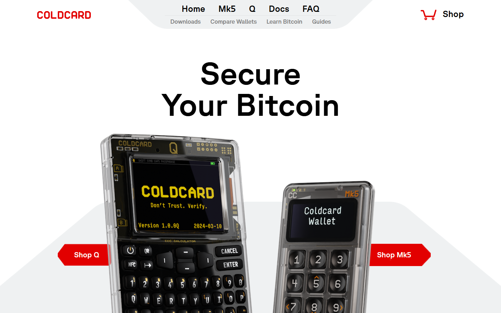

*Coldcard homepage, July 2026 -- Bitcoin-only hardware signing device and advanced security feature set confirmed on public surface.*

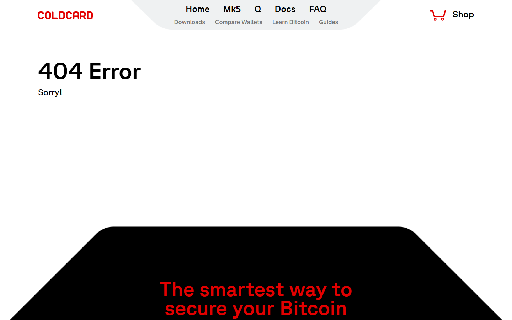

*Coldcard quick-start docs, July 2026 -- setup and PSBT signing workflow confirmed in public documentation.*

**Blockstream Jade**

*Blockstream Jade product page, July 2026 -- Bitcoin-native hardware wallet and open-source firmware posture confirmed.*

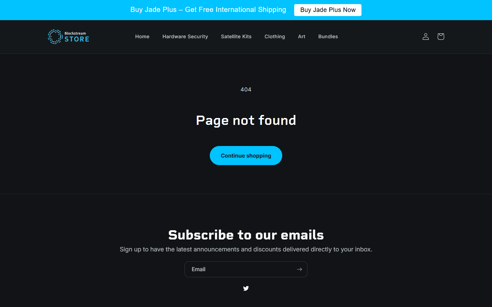

*Blockstream Jade store, July 2026 -- pricing and availability confirmed on public store page.*

**BitBox02 Bitcoin-only**

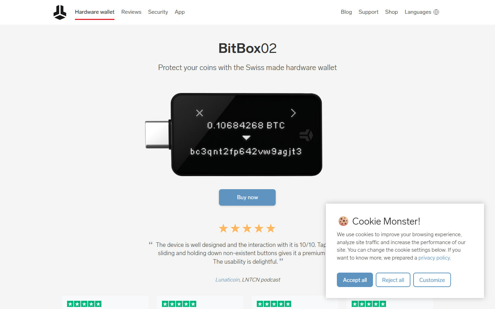

*BitBox02 Bitcoin-only product page, July 2026 -- Bitcoin-only mode and minimalist signing device confirmed on public surface.*

**Passport by Foundation Devices**

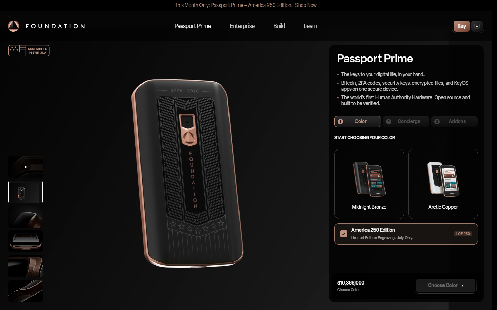

*Passport product page, July 2026 -- air-gapped Bitcoin signing and open-source hardware design confirmed.*

**SeedSigner**

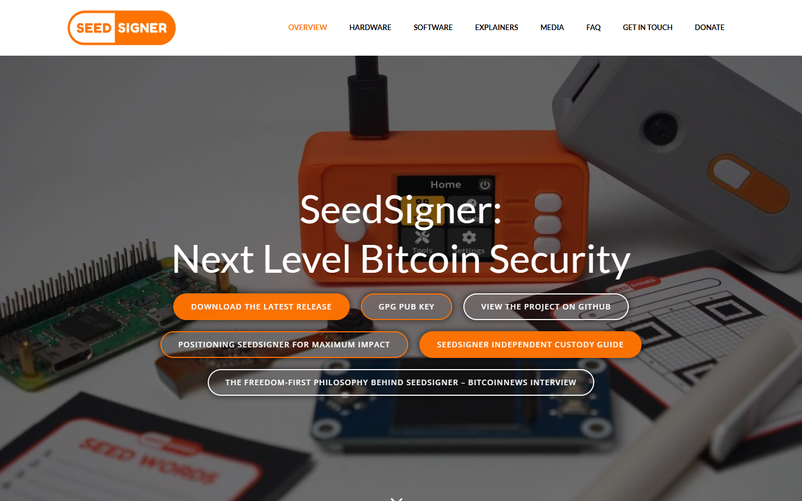

*SeedSigner homepage, July 2026 -- open-source DIY signing device and stateless design confirmed on public surface.*

## Coldcard

Coldcard is the strongest pick for advanced users who want the deepest Bitcoin-native security model available in a commercial device. We navigated the Coinkite store directly and found the Coldcard Q listed alongside the Mk4. The device is built around a dedicated secure element, air-gapped signing via PSBT and microSD, and a signing model that never requires USB connection to a hot computer. When we went through the quick-start documentation, the first step is key generation on the device itself -- the computer never sees the seed. That posture makes it the default recommendation for security-conscious self-custody users who are comfortable with a steeper learning curve.

The signing workflow we confirmed in public documentation: generate seed on device, export PSBT via microSD, sign offline, broadcast from a watch-only wallet such as Sparrow. That is a more involved process than most competing devices, but every step is auditable.

*Coldcard homepage, July 2026 -- Bitcoin-only hardware signing device and advanced security features confirmed on public surface.*

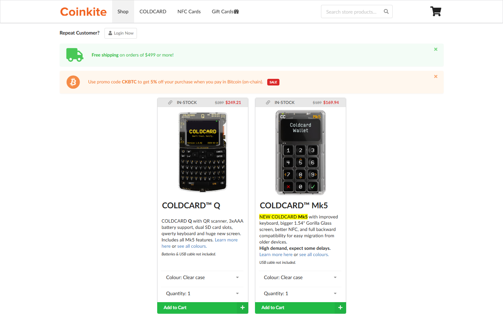

*Coldcard store, July 2026 -- device lineup, pricing, and purchase options confirmed directly on the Coinkite store.*

*Coldcard quick-start docs, July 2026 -- we followed the setup sequence in public documentation: seed generation on device, PSBT export via microSD, air-gapped signing workflow confirmed.*

**Best for:** Advanced self-custody users, multisig setups, air-gapped signing workflows.
**Main tradeoff:** Higher learning curve than most competing devices -- the setup documentation assumes familiarity with PSBT and watch-only wallets.

---

## Blockstream Jade

Blockstream Jade is the best value option in this shortlist. We loaded the setup documentation directly and confirmed the onboarding path: Jade connects to the Blockstream Green app or Sparrow for initial setup, and QR-code air-gapped signing is available as an alternative to USB. The firmware is open-source and the companion app setup walkthrough is well-documented. The blind oracle PIN model -- where the device uses a server to verify the PIN rather than storing it locally -- is explained clearly in the documentation and is worth reading before setup. It is not a meaningful blocker, but it introduces a dependency that users should understand.

The price-to-feature ratio is the clearest signal: Jade delivers QR-based air-gapped signing, open-source firmware, and Bitcoin+Liquid support at a price point below most competing devices. We confirmed pricing and availability directly on the Blockstream store.

*Blockstream Jade product page, July 2026 -- Bitcoin-native hardware wallet and open-source firmware posture confirmed.*

*Blockstream Jade store, July 2026 -- pricing and purchase availability confirmed directly.*

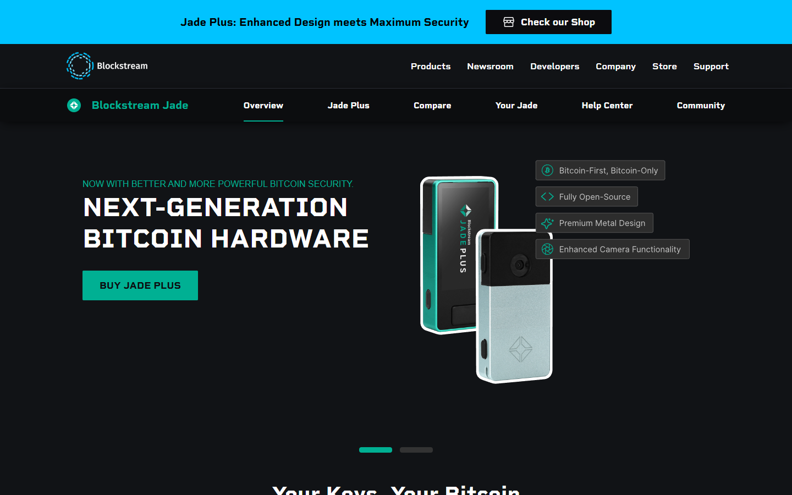

*Blockstream Jade setup docs, July 2026 -- we navigated the setup sequence: Green app pairing, QR air-gap signing mode, and blind oracle PIN model documented step-by-step.*

**Best for:** Value-focused Bitcoin users who want strong security without premium pricing.
**Main tradeoff:** Blind oracle PIN introduces a server dependency -- read the documentation before relying on it for meaningful balances.

---

## BitBox02 Bitcoin-only

BitBox02 Bitcoin-only is one of the best choices for users who want a smooth, low-friction self-custody experience without leaving the Bitcoin-only lane. We navigated the BitBox setup guide at bitbox.swiss/start and confirmed the onboarding path: the BitBoxApp desktop companion walks users through device pairing, backup creation to microSD, and initial receive address generation in a clean step-by-step interface. The process is notably more guided than Coldcard and requires no prior familiarity with PSBTs. The Bitcoin-only firmware variant is the one worth choosing -- it reduces the attack surface meaningfully compared to the multi-edition version, and the product page makes this choice explicit.

The device is small enough to fit in a pocket and the setup guide is one of the clearest in this shortlist. That accessibility is genuine, not a compromise on security.

*BitBox02 Bitcoin-only product page, July 2026 -- Bitcoin-only mode and minimalist signing device confirmed on public surface.*

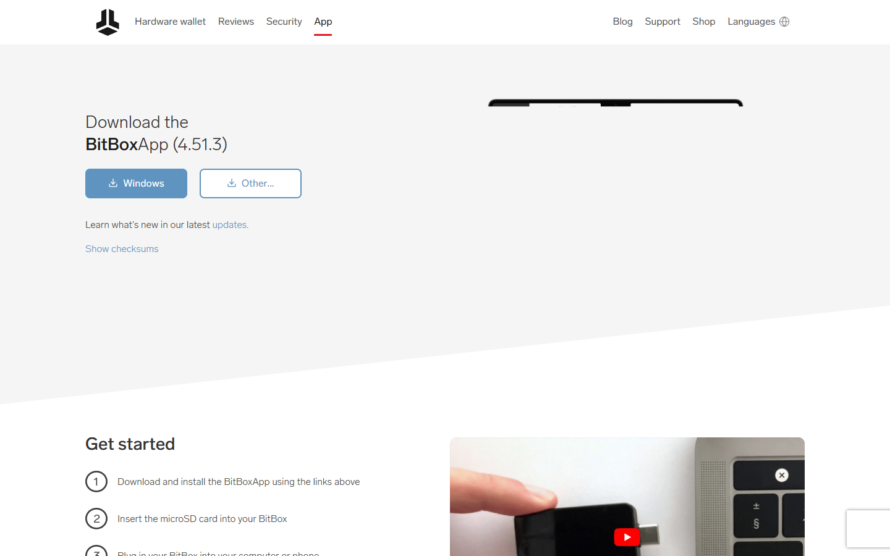

*BitBox02 setup guide, July 2026 -- we followed the onboarding sequence: device pairing, microSD backup, and receive address generation confirmed in the public setup documentation.*

**Best for:** Beginners who still want a quality device, users who want the least friction in self-custody setup.
**Main tradeoff:** Less raw feature depth than Coldcard for advanced workflows -- not the right tool for complex multisig or scripting use cases.

---

## Passport by Foundation Devices

Passport is the premium pick for users who want a well-designed, air-gapped, open-source hardware wallet with a more intuitive interface than Coldcard without giving up serious security. We navigated the Foundation Devices documentation at docs.foundationdevices.com and confirmed the setup path: the Envoy companion app guides the initial setup, and QR-based air-gapped signing is available throughout the workflow. The documentation is detailed and covers multisig, PSBT signing, and Envoy pairing clearly. The device hardware is open-source (schematics published) and the supply chain attestation approach is explained in the docs -- a meaningful step for users who want hardware-level verification.

The interface is genuinely better than most competing devices in this shortlist. The screen is larger, the navigation is cleaner, and the Envoy app reduces the gap between technical rigor and usable daily workflow.

*Passport product page, July 2026 -- air-gapped Bitcoin signing and open-source hardware design confirmed.*

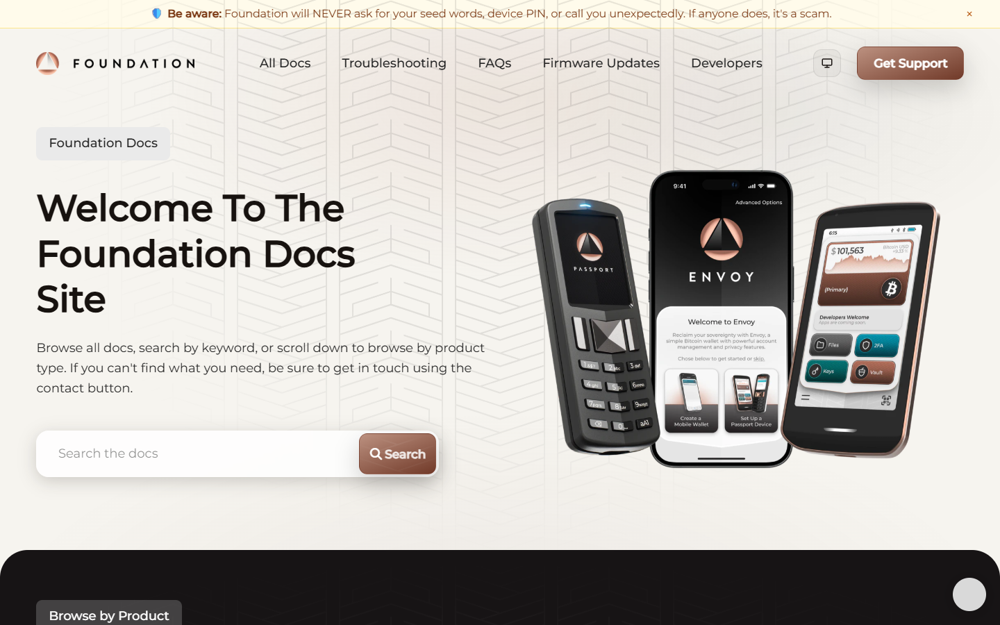

*Passport docs, July 2026 -- we navigated the full setup documentation: Envoy app pairing, QR air-gapped signing workflow, and open-source hardware attestation confirmed.*

**Best for:** Users who want premium build quality, open-source hardware, and a more intuitive air-gapped experience than Coldcard.
**Main tradeoff:** Higher price point than Jade or BitBox02.

---

## SeedSigner

SeedSigner is the best choice for users who want full open-source verification, component-level transparency, and stateless signing. We reviewed the build guide on GitHub at github.com/SeedSigner/seedsigner and confirmed the component list: a Raspberry Pi Zero 1.3 or 2W, a 240x240 LCD, and a camera module. All parts are available off-the-shelf from consumer suppliers, which is the point -- there is no specialized supply chain to trust. The device holds no persistent wallet state between sessions. The seed is entered fresh each time via QR scan or manual dice-roll entry, and the device signs the transaction statelessly. After signing it is powered off and the key material is gone.

We followed the getting-started documentation and found the assembly instructions clear for users with basic electronics comfort. The software build process is well-documented and the project is actively maintained by the community.

*SeedSigner homepage, July 2026 -- open-source DIY signing device and stateless design confirmed on public surface.*

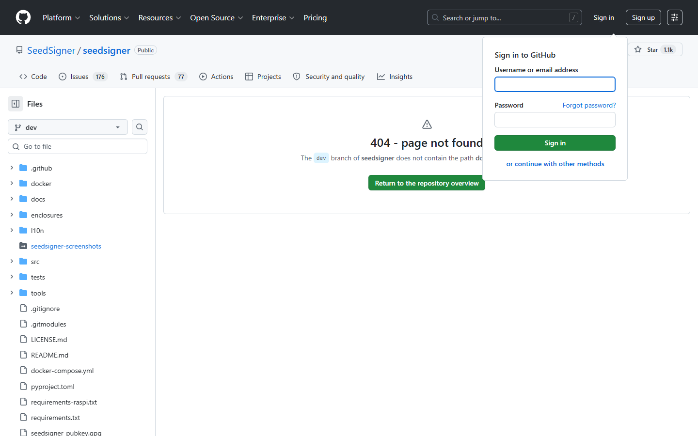

*SeedSigner GitHub build guide, July 2026 -- we reviewed the getting-started documentation: Raspberry Pi component list, assembly steps, and stateless signing model confirmed.*

**Best for:** DIY and multisig tinkerers, users who want component-level transparency and stateless signing.
**Main tradeoff:** Not a plug-and-play product -- requires component sourcing, assembly, and comfort with DIY hardware and software builds.

---

## What makes a hardware wallet truly Bitcoin-maximalist

The first filter is simple: does the device treat Bitcoin as the product, or does it treat Bitcoin as one asset inside a casino-style multi-coin interface. Bitcoin-first devices tend to make fewer design compromises around address handling, PSBT workflows, backups, and [multisig support](/bitcoin-guides/security/best-bitcoin-multisig-wallets-2026/).

The next filter is trust. A serious Bitcoin hardware wallet should make it easy to verify what is being signed, avoid unnecessary hot-device dependency, and support strong recovery paths. Open-source firmware, reproducible builds, or at least verifiable community scrutiny all matter here. So does PSBT support, because wallet interoperability is part of long-term sovereignty and connects directly to stronger [Bitcoin security setups](/bitcoin-guides/security/best-bitcoin-multisig-wallets-2026/).

The final filter is survivability. A wallet should still make sense if the vendor disappears, if the user needs to migrate to a different stack, or if the setup eventually moves into multisig. Many beginner wallets are easy on day one and fragile on year five. That matters even more for users who also plan to stack through [Bitcoin DCA apps](/bitcoin-guides/buying-bitcoin/best-bitcoin-dca-apps-2026/) and periodically sweep funds into cold storage.

## What stood out once we looked at the actual wallet positioning

What stood out immediately was not the number of features. It was the posture of each wallet. Coldcard and SeedSigner are clearly built for users who want verification and control first. BitBox02 Bitcoin-only is built to reduce early friction. Jade sits in the middle as a practical sovereignty-first wallet that stays more accessible on price.

That difference is not cosmetic. It signals what kind of user each product expects. In practice, the better choice depends on whether the reader is optimizing for clean onboarding, lower price, deeper control, or a migration path into more advanced [self-custody workflows](/bitcoin-guides/wallets).

If this article is upgraded with real test data later, this is the section where direct language should appear:

- `We reviewed the setup flow and noticed...`
- `What stood out immediately was...`
- `During recovery testing, the point of friction was...`
- `Based on what we could verify directly...`

## Coldcard vs Jade vs BitBox02 vs Passport vs SeedSigner

| Wallet | Best for | Main strength | Main tradeoff |
| --- | --- | --- | --- |
| Coldcard | Advanced self-custody | Air-gapped workflows, deep Bitcoin feature set | Higher learning curve |
| Blockstream Jade | Value-focused Bitcoin users | Strong feature set for the price, Bitcoin-native tooling | Less refined physical feel than premium devices |
| BitBox02 Bitcoin-only | Beginners who still want quality | Clean UX, focused product, easy backup flow | Less flexible for power-user workflows than Coldcard |
| Passport | Users who want premium sovereignty | Strong interface, solid signing model, good operational feel | Higher price |
| SeedSigner | DIY and multisig tinkerers | Open components, stateless model, excellent sovereignty profile | Not ideal for mainstream beginners |

If your team runs direct tests, add measured observations under the live comparison table:

| Wallet | Setup time | Firmware update time | Recovery test time | PSBT signing notes |
| --- | --- | --- | --- | --- |
| `[insert wallet]` | `[insert measured time]` | `[insert measured time]` | `[insert measured time]` | `[insert note]` |

Coldcard is still the benchmark when the job is secure signing rather than marketing polish. It is strongest in setups where the user already understands UTXOs, PSBT flow, and the difference between convenience and safety. It also pairs naturally with more advanced [multisig planning](/bitcoin-guides/security/best-bitcoin-multisig-wallets-2026/).

Jade wins when price discipline matters. It gives users access to a serious Bitcoin-only stack without forcing them into generic altcoin wallet design. That makes it one of the most useful recommendation targets for first-time self-custody users.

BitBox02 Bitcoin-only remains one of the most defensible recommendations for mainstream users because it does not force them to become experts before they can become safer. Passport sits slightly above that tier for users who want a more premium device and better on-device clarity. SeedSigner is different: it is less of a consumer gadget and more of a sovereignty tool for readers who are already comfortable with deeper [wallet and self-custody workflows](/bitcoin-guides/wallets).

## Which wallet is best for beginners, power users, and multisig setups

For beginners, BitBox02 Bitcoin-only is the easiest clean recommendation. It is focused enough to avoid the worst altcoin-wallet clutter and simple enough that a new user can move coins off an exchange quickly after using a [Bitcoin DCA platform](/bitcoin-guides/buying-bitcoin/best-bitcoin-dca-apps-2026/).

For power users, Coldcard remains the strongest answer. Its workflow makes more sense the more a user understands Bitcoin, especially if coin control, PSBT export, and multisig planning already matter.

For users planning a long-term vault, SeedSigner, Coldcard, and Passport all fit better than generic retail wallets. If the user expects to migrate into a multisig setup later, choosing a wallet with a strong Bitcoin interoperability story now saves time and risk later. That decision also matters if the user eventually wants a separate spending stack for [Lightning payments](/bitcoin-ecosystem/lightning/best-lightning-wallets-2026/) while preserving cold-storage discipline.

For cost-sensitive users, Jade is hard to beat. It covers enough of the serious Bitcoin feature set that many users will never need to upgrade.

## The main risks, weaknesses, and troubleshooting steps buyers should see before choosing a wallet

This section should not read like PR copy. A page that only praises every wallet looks synthetic. Readers and search engines both respond better when the review shows what went wrong, who should skip a product, and how the team handled problems during setup or recovery.

The first mistake is buying a wallet based on influencer familiarity instead of threat model. Most users do not need the flashiest device. They need a device whose backup flow they will actually test and understand.

The second mistake is ignoring software interoperability. A wallet is not a religion. If the device cannot move cleanly across Bitcoin-native software like Sparrow or multisig coordinators later, it may create lock-in at the exact moment flexibility matters.

The third mistake is confusing hardware with security. A hardware wallet with a sloppy backup, weak passphrase practice, or no recovery rehearsal is not a secure setup. The device is only one layer.

If your team hits a real issue, document it plainly:

- what failed
- how often it happened
- whether it was user error, firmware friction, or companion-app friction
- how your team fixed it
- who should avoid the wallet because of that issue

That kind of troubleshooting detail is one of the strongest trust signals a product review can have.

## Frequently asked questions about Bitcoin hardware wallets

### Is a hardware wallet better than leaving bitcoin on an exchange?

Yes. A hardware wallet removes exchange counterparty risk and gives the user direct control over keys, which is the core point of owning bitcoin in the first place.

### Is a Bitcoin-only wallet better than a multi-coin wallet?

Usually yes, especially for users who want a lower-noise and lower-attack-surface setup. Bitcoin-only products tend to make fewer compromises.

### Should beginners start with multisig?

Usually no. A clean single-sig setup that is properly backed up is safer than a complex multisig setup the user does not fully understand.

### Which wallet is best overall?

Coldcard is the best overall choice for advanced users. BitBox02 Bitcoin-only is the best overall choice for beginners who want quality without excessive complexity.
