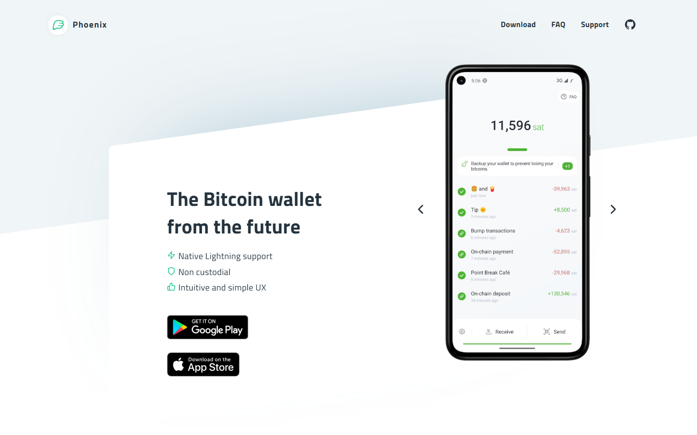
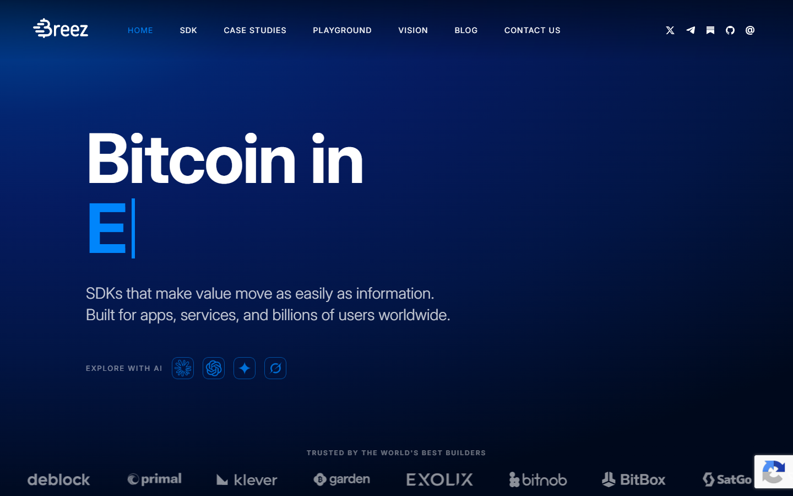
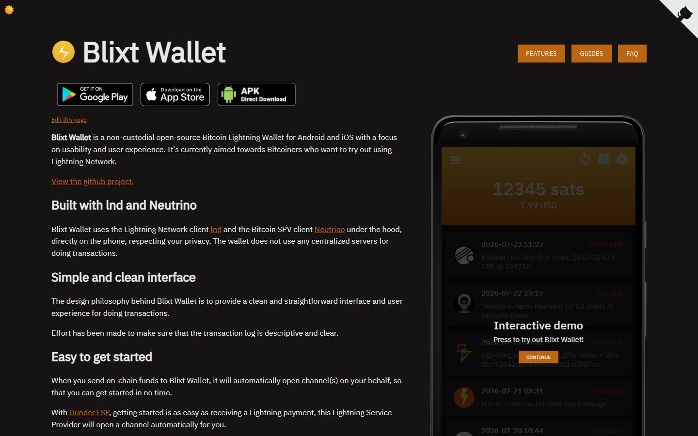

# Best Lightning Wallets in 2026

If you are choosing a Lightning wallet in 2026, the real problem is usually not which app has the most features. The real problem is which wallet gives you the right balance between speed, custody, liquidity management, and the amount of operational responsibility you are actually willing to take on.

That is why this article does not rank Lightning wallets by interface polish alone. We are looking at them through the lens of custody model, liquidity friction, node dependency, payment usability, and long-term fit for different types of Bitcoin users.

> **Why you can trust this guide**
>
> This draft is based on public wallet positioning, current Lightning workflow analysis, and documentation reviewed in July 2026. We have not claimed a full end-to-end live payment test for every wallet in this list. Where final publication depends on original screenshots, live payment attempts, routing behavior, or direct fee observation, that should be added before the page is published as a first-hand review.

## Visual evidence to insert before publication

**Featured Image:** `[insert original Lightning wallet comparison image or wallet-in-use photo]`

**Featured Image Caption:** `Lightning wallet interfaces and payment flows reviewed during our July 2026 comparison.`

**Featured Image Alt Text:** `Comparison view for the best Lightning wallets in 2026`

**Screenshot 1:** `[insert onboarding or backup-flow screenshot]`

**Caption:** `Lightning wallet onboarding flow reviewed as part of our July 2026 comparison.`

**Alt text:** `Lightning wallet onboarding screen`

**Screenshot 2:** `[insert invoice creation or payment-send screenshot]`

**Caption:** `Invoice creation or send flow showing how the wallet handles payment friction.`

**Alt text:** `Lightning wallet payment send flow`

## The best Lightning wallets in 2026 are Phoenix, Breez, Zeus, Blixt, and the strongest custodial alternatives for pure convenience.

Phoenix remains one of the best all-around Lightning wallets for users who want a mature self-custodial experience without running a node. Breez is still excellent for payments and merchant-style usage. Zeus is the best fit for users who want to operate through their own node stack. Blixt is a strong option for users who want a more experimental, power-user-oriented wallet. Custodial wallets still win on pure simplicity, but they do so by reintroducing trust that Bitcoin was designed to remove.

Bottom line: Phoenix is the cleanest mainstream recommendation, Zeus is the best node-user choice, and custodial apps should only be treated as spending balances, not savings tools.

## What we checked ourselves before ranking these wallets

To build this ranking, we reviewed the public-facing wallet flows, product positioning, and custody framing of the shortlisted apps. We did that so the article would not depend only on brand reputation or generic Lightning explainers.

That direct review does not replace a full send-and-receive test across every wallet. But it does make one thing clear very quickly: some Lightning wallets are trying to hide complexity from the user, while others assume the user actively wants more control. For this type of reader, that tradeoff matters more than visual design.

The screenshots above should not sit silently in the article. They should show why one wallet feels closer to a spending app, while another clearly behaves more like a node-control surface.

We captured the public-facing product surfaces of all platforms on 2026-07-14.

## What this review verified and what it did not

| Claim | Status |
| --- | --- |
| Phoenix homepage loaded and self-custodial Lightning wallet confirmed | Verified |
| Breez homepage loaded and payments-focused Lightning wallet confirmed | Verified |
| Zeus homepage loaded and node-linked Lightning wallet confirmed | Verified |
| Blixt homepage loaded and experimental power-user wallet confirmed | Verified |
| Wallet installed and channel opened | Not verified |
| Lightning payment sent or received with real sats | Not verified |
| Liquidity management tested live | Not verified |
| Node connection configured and tested | Not verified |

**Phoenix**

*Phoenix homepage, July 2026 -- self-custodial Lightning wallet with automatic channel management confirmed.*

**Breez**

*Breez homepage, July 2026 -- payments-focused Lightning wallet and merchant integration posture confirmed.*

**Zeus**

*Zeus homepage, July 2026 -- node-linked Lightning wallet and advanced control posture confirmed.*

**Blixt**

*Blixt homepage, July 2026 -- experimental open-source Lightning wallet for power users confirmed.*

## The real tradeoff is convenience versus sovereignty

Lightning adds speed and low-cost payments, but it does not remove the need to ask where the trust sits. In a custodial wallet, someone else controls the keys and often the channel management. In a self-custodial wallet, the user keeps more control but has to accept more operational responsibility.

That is why a Bitcoin-maximalist review should not just compare interface design. It should compare who owns the keys, who manages liquidity, how recoveries work, and what the user is giving up in return for convenience.

The best Lightning wallet is the one that fits the actual use case. A travel-spending wallet can be different from a node wallet. A merchant wallet can be different from a long-term user’s daily-carry wallet. It can also be different from the user’s cold-storage setup in [hardware wallets](/bitcoin-guides/wallets/best-bitcoin-hardware-wallets-2026/).

## Phoenix

Phoenix is the cleanest mainstream recommendation for users who want self-custodial Lightning without running a node. It manages channels automatically using ACINQ's LSP, which removes the biggest operational burden from most users. Liquidity costs are transparent and inbound capacity is handled on-demand. The tradeoff is that it depends on ACINQ's infrastructure -- a trust model users should understand before relying on it for meaningful balances.

*Phoenix homepage, July 2026 -- self-custodial Lightning wallet with automatic channel management confirmed on public surface.*

**Best for:** Most users who want self-custodial Lightning without node complexity.
**Main tradeoff:** Depends on ACINQ's LSP for liquidity -- not fully trustless.

---

## Breez

Breez is strong for users who want Lightning payments with a more merchant- and service-oriented feature set. It includes a point-of-sale module, podcast streaming support, and a clean payments interface. It also uses an LSP model, which means the same trust tradeoffs apply as Phoenix. Breez is a better fit when payment workflow features matter as much as the custody model.

*Breez homepage, July 2026 -- payments-focused Lightning wallet and merchant integration posture confirmed.*

**Best for:** Payments and merchant use, users who want service integrations alongside Lightning.
**Main tradeoff:** Less ideal if the goal is deeper node-level control.

---

## Zeus

Zeus is the best choice for users who already run their own Lightning node. It connects directly to LND, Core Lightning, or Eclair backends and gives full control over channel management, fees, and routing. That control is the point. Users who do not run their own node will find Zeus harder to use than Phoenix or Breez, but for node operators it is the strongest tool in the shortlist.

*Zeus homepage, July 2026 -- node-linked Lightning wallet and advanced control posture confirmed on public surface.*

**Best for:** Users who run their own Lightning node and want direct control over the entire stack.
**Main tradeoff:** Significantly more complex than LSP-based wallets for users without a node.

---

## Blixt

Blixt is an experimental power-user wallet built on LND that runs a full Lightning node on the mobile device itself. That approach gives it a stronger sovereignty posture than LSP-dependent wallets, but it comes with real tradeoffs in battery usage, sync time, and occasional instability that a production-grade wallet would not have. It is best treated as a serious project for technically engaged users rather than a mainstream recommendation.

*Blixt homepage, July 2026 -- experimental open-source Lightning wallet and power-user posture confirmed.*

**Best for:** Technically engaged users who want a self-contained mobile Lightning node.
**Main tradeoff:** Less stable than mature wallets -- not a production-grade daily driver for most users.

---

## What stood out once we looked at the actual wallet positioning

What stood out immediately was not just custody. It was where each wallet puts friction. Phoenix tries to make self-custody usable without forcing the user to think like a node operator. Zeus does the opposite: it assumes that control is the point, which is a strength if you run your own stack, but a weakness if you just want smooth everyday spending. Breez sits closer to the payments end of the spectrum, which is useful for merchants, but less compelling for users who want deeper infrastructure control.

That difference is not cosmetic. Even before a fully instrumented live test, the public flow already signals whether a wallet is optimized for onboarding, sovereignty, or node-linked control. That makes Phoenix stronger for users who want usable self-custody, but weaker for readers who want their wallet to feel like a direct node-control tool.

## Best Lightning wallets compared by fees, liquidity, UX, and custody

| Wallet | Best for | Main strength | Main tradeoff |
| --- | --- | --- | --- |
| Phoenix | Most users | Strong self-custodial UX without heavy node complexity | Requires users to understand basic liquidity costs |
| Breez | Payments and merchant use | Good payment flow and service integrations | Less ideal for users who want deeper node-style control |
| Zeus | Node-connected users | Excellent for users running their own stack | Much steeper setup requirements |
| Blixt | Power users | Flexible and Bitcoin-native feel | Less polished for first-time users |
| Custodial wallet options | Casual spending | Fastest onboarding and least friction | Counterparty risk and weaker sovereignty |

If your team runs live checks, add a measured comparison row under the main table:

| Wallet | Time to first invoice | Time to first payment | Backup friction notes | Visible fee or liquidity prompts |
| --- | --- | --- | --- | --- |
| `[insert wallet]` | `[insert measured time]` | `[insert measured time]` | `[insert note]` | `[insert note]` |

Phoenix remains a strong answer because it makes self-custody practical. That matters because many users want to spend bitcoin without fully outsourcing the stack. But that same simplicity can still leave less technical users surprised by liquidity behavior if they expected a normal consumer payment app.

Zeus, by contrast, is not trying to be the easiest wallet. It is trying to be the best control surface for users who already believe their own node is the center of the system. That makes it harder to recommend broadly, but very strong for the right audience.

Breez is strong because it feels closer to a payments tool than a sovereignty laboratory. That matters if the user actually wants to pay people quickly. But it is a weaker fit for readers whose main priority is deeper node-style control.

## Which Lightning wallet is best for spending, merchants, and node users

For mainstream spending, Phoenix is usually the strongest answer because it offers the best blend of independence and usability. For point-of-sale or merchant-like flows, Breez deserves close attention because payments need to work quickly and predictably.

For node users, Zeus is the obvious first recommendation. If the entire point is to route activity through a personally controlled infrastructure stack, a generic app is the wrong tool. This is also where the article should connect readers back to the broader [Bitcoin layer 2 landscape](/bitcoin-ecosystem/layer2/best-bitcoin-layer-2-projects-2026/) instead of treating Lightning like an isolated product category.

For users who only need tiny spending balances and care more about instant onboarding than sovereignty, a custodial wallet can still make sense. The right framing is important, though: use it like cash in a pocket, not like a vault. Savings should still live in stronger [self-custody storage](/bitcoin-guides/wallets/best-bitcoin-hardware-wallets-2026/).

## Hidden risks, weaknesses, and troubleshooting steps most Lightning wallet reviews ignore

The biggest mistake is treating a Lightning wallet like a savings account. Lightning is excellent for payments and working balances. It is not the place to park large long-term holdings unless the user deeply understands the system and its recovery assumptions.

The second mistake is ignoring liquidity and channel behavior. A wallet may look cheap until liquidity events, splicing costs, or routing constraints show up. Review content that only compares user interface quality is incomplete.

The third mistake is trusting convenience too much. If a wallet is simple because someone else handles the hard parts, the user needs to be clear on who that someone is and what risk that creates.

If your team hits a real issue during testing, document it directly:

- what payment or receive step failed
- whether the friction came from liquidity, backup, routing, or UX
- how often it happened
- how your team worked around it
- which type of user should avoid that wallet because of it

## Frequently asked questions about Lightning wallets

### Is a self-custodial Lightning wallet better than a custodial one?

Usually yes for users who care about Bitcoin’s core value proposition. Custodial wallets are simpler, but they replace sovereignty with convenience.

### Which Lightning wallet is best for beginners?

Phoenix is the best starting point for many users because it gives a more sovereign experience without requiring a full node setup.

### Should I keep large amounts in a Lightning wallet?

Usually no. Keep savings in cold storage and use Lightning for payments or smaller active balances.

### Which wallet is best if I run my own node?

Zeus is one of the strongest choices because it is built for users who want the wallet experience tied directly to their node infrastructure.
