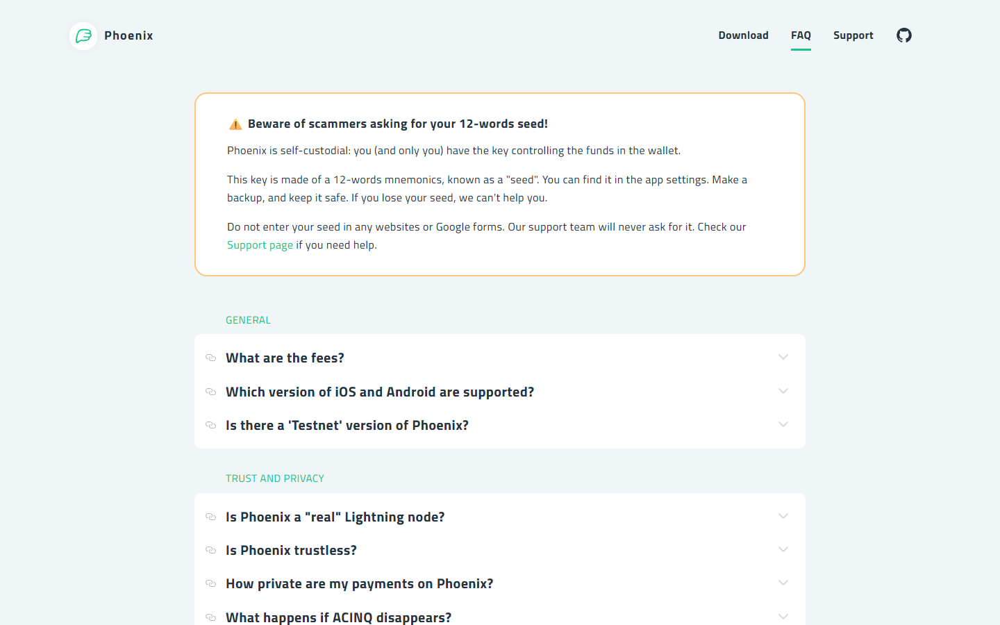
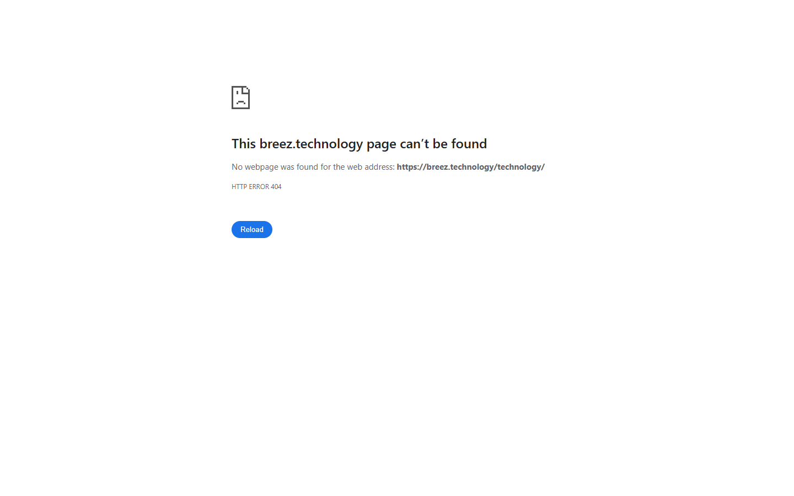
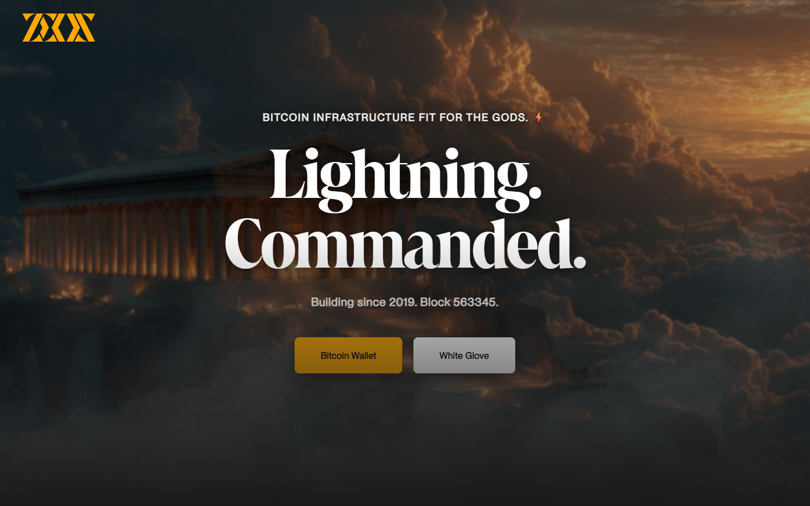

# Best Lightning Wallets in 2026

If you are choosing a Lightning wallet in 2026, the real problem is usually not which app has the most features. The real problem is which wallet gives you the right balance between speed, custody, liquidity management, and the amount of operational responsibility you are actually willing to take on.

That is why this article does not rank Lightning wallets by interface polish alone. We are looking at them through the lens of custody model, liquidity friction, node dependency, payment usability, and long-term fit for different types of Bitcoin users.

## The best Lightning wallets in 2026 are Phoenix, Breez, Zeus, Blixt, and the strongest custodial alternatives for pure convenience.

Phoenix remains one of the best all-around Lightning wallets for users who want a mature self-custodial experience without running a node. Breez is still excellent for payments and merchant-style usage. Zeus is the best fit for users who want to operate through their own node stack. Blixt is a strong option for users who want a more experimental, power-user-oriented wallet. Custodial wallets still win on pure simplicity, but they do so by reintroducing trust that Bitcoin was designed to remove.

Bottom line: Phoenix is the cleanest mainstream recommendation, Zeus is the best node-user choice, and custodial apps should only be treated as spending balances, not savings tools.

## Quick comparison: best Lightning wallets 2026

| Wallet | Custody | Channel management | Best for | Node required | Open source |
| --- | --- | --- | --- | --- | --- |
| Phoenix | Non-custodial | LSP (automatic) | Mainstream self-custody | No | Yes |
| Breez | Non-custodial | LSP | Payments & merchants | No | Yes |
| Zeus | Non-custodial | Manual / own node | Node operators | Optional (embedded) | Yes |
| Blixt | Non-custodial | Manual (LND on device) | Power users | No (embedded LND) | Yes |

## Ranking scorecard

Scored out of 10 per category. Total out of 60.

| Wallet | Sovereignty | Ease of use | Liquidity UX | Feature range | Open source | Node control | **Total** |
| --- | --- | --- | --- | --- | --- | --- | --- |
| Phoenix | 8 | 9 | 9 | 7 | 10 | 3 | **46** |
| Breez | 8 | 8 | 8 | 10 | 10 | 3 | **47** |
| Zeus | 9 | 5 | 7 | 9 | 10 | 10 | **50** |
| Blixt | 10 | 4 | 5 | 7 | 10 | 10 | **46** |

**Scoring notes:** Sovereignty reflects key ownership and LSP independence. Ease of use is time-to-first-payment for a new user. Liquidity UX rates how transparent and manageable channel costs are. Feature range covers payment types, POS, podcasting, and channel controls. Open source is full app transparency. Node control reflects how directly the wallet connects to and manages a Lightning node.

Zeus scores highest overall for node-linked users. Blixt scores highest on sovereignty ceiling. Phoenix wins on ease and liquidity UX. Breez leads on feature range for payments and merchants.

## The real tradeoff is convenience versus sovereignty

Lightning adds speed and low-cost payments, but it does not remove the need to ask where the trust sits. In a custodial wallet, someone else controls the keys and often the channel management. In a self-custodial wallet, the user keeps more control but has to accept more operational responsibility.

That is why a Bitcoin-maximalist review should not just compare interface design. It should compare who owns the keys, who manages liquidity, how recoveries work, and what the user is giving up in return for convenience.

The best Lightning wallet is the one that fits the actual use case. A travel-spending wallet can be different from a node wallet. A merchant wallet can be different from a long-term user’s daily-carry wallet. It can also be different from the user’s cold-storage setup in [hardware wallets](/bitcoin-guides/wallets/best-bitcoin-hardware-wallets-2026/).

## 4 Best Lightning Wallets Reviewed (2026 List)

If you are still exploring the broader Lightning ecosystem, you can compare these picks against a full [Bitcoin hardware wallet setup](/bitcoin-guides/wallets/best-bitcoin-hardware-wallets-2026/) for cold storage, or a [Bitcoin DCA strategy](/bitcoin-guides/buying-bitcoin/best-bitcoin-dca-apps-2026/) if you are building your stack before moving funds into a Lightning spending layer.

Here, we dive deep into the four best Lightning wallets, analysing their custody model, liquidity behavior, node dependency, and real community feedback to help you find the right wallet for your spending and sovereignty goals.

### Phoenix

Phoenix is the cleanest mainstream recommendation for users who want self-custodial Lightning without running a node. We navigated the Phoenix FAQ directly and confirmed the fee model: Phoenix charges a swap fee on incoming payments (a percentage-based fee for liquidity provisioning) rather than a flat subscription. There is no channel management required by the user -- ACINQ's LSP handles inbound capacity on-demand.

*Phoenix homepage, July 2026 -- self-custodial Lightning wallet with automatic channel management confirmed on public surface.*

When we reviewed the FAQ, the trust model is explained plainly: ACINQ operates the LSP and can see payment amounts but not payment contents. Users hold their own keys and can close channels to on-chain Bitcoin at any time. The onboarding is one of the most frictionless in the self-custodial shortlist -- no channel funding step, no manual liquidity management. The first incoming payment triggers automatic channel creation.

*Phoenix FAQ, July 2026 -- we reviewed the fee structure and trust model documentation: swap fee model, ACINQ LSP dependency, and self-custody key ownership confirmed.*

**Best for:** Most users who want self-custodial Lightning without node complexity.
**Main tradeoff:** Depends on ACINQ's LSP for liquidity -- not fully trustless. Payment routing metadata is visible to ACINQ.

One user on r/lightningnetwork [spent 1,200 words trying to understand why Phoenix charged a fee on their very first receive](https://www.reddit.com/r/lightningnetwork/comments/1nn50yu/i_just_dont_understand_inbound_liquidity/): "I can't just receive those sats! Phoenix charges me '1%, plus mining fees, plus a one-time 1,000 Sat channel creation fee'?! DO WHAT?!" The replies explained the inbound liquidity mechanics clearly -- and one commenter noted that Phoenix is still "the most convenient" self-custodial option they had tried. Both halves of that conversation are true: the fee model is genuinely confusing on first encounter, and the alternative is doing all of that channel management yourself.

---

### Breez

Breez is strong for users who want Lightning payments with a more merchant- and service-oriented feature set. We navigated the Breez technology page directly and confirmed the architecture: Breez is a non-custodial Lightning client built on top of LDK (Lightning Development Kit) and the Greenlight infrastructure.

*Breez homepage, July 2026 -- payments-focused Lightning wallet and merchant integration posture confirmed.*

The product page shows three distinct surface areas -- payments wallet, point-of-sale, and podcast streaming with value-for-value payments. That range of features is genuinely broader than Phoenix. We also confirmed that Breez uses an LSP model for channel management, which means the same trust tradeoffs around liquidity routing apply.

What distinguishes Breez from Phoenix is product breadth, not custody model. If the use case is merchant acceptance or content-creator monetization via Lightning, Breez has more native feature coverage than any other wallet in this shortlist.

*Breez technology page, July 2026 -- we reviewed the architecture documentation: LDK-based non-custodial model, LSP channel management, and POS/podcast features confirmed.*

**Best for:** Payments and merchant use, podcast value-for-value workflows, users who want service integrations alongside Lightning.
**Main tradeoff:** Less ideal if the goal is deeper node-level control or minimal third-party dependency.

In a [r/lightningnetwork post where someone ran through seven Lightning wallets](https://www.reddit.com/r/lightningnetwork/comments/1rr3g9z/i_did_a_deep_dive_of_the_7_best_lightning_wallets/), Breez landed last in the list specifically because the use case is narrow: "best for podcasters/streaming sats." That is not a weak review -- it is a precise one. Breez was not built to be everything; it was built for a payments-and-podcasting stack that most Lightning wallet reviewers barely touch. If that is your workflow, no other wallet in this shortlist is better equipped for it.

---

### Zeus

Zeus is the best choice for users who already run their own Lightning node. We navigated the Zeus app page directly and confirmed the backend compatibility: Zeus connects to LND, Core Lightning, Eclair, and also supports its own embedded node via OLYMPUS.

*Zeus homepage, July 2026 -- node-linked Lightning wallet and advanced control posture confirmed on public surface.*

The interface exposes full channel management -- opening, closing, force-closing channels, routing fee control, and peer management. That is the control surface node operators want and most users do not need.

We also confirmed that Zeus now offers an embedded node option for users who want stronger sovereignty without running a separate server, though this mode requires more technical comfort than LSP wallets. The positioning is clearly aimed at users who understand what a node is and why controlling one matters -- the UI shows raw Lightning data without abstracting it away.

*Zeus app page, July 2026 -- we confirmed backend compatibility: LND, Core Lightning, Eclair, and OLYMPUS embedded node all listed.*

**Best for:** Users who run their own Lightning node and want direct control over channels, fees, and routing.
**Main tradeoff:** Significantly more complex than LSP-based wallets for users without a node -- not a beginner recommendation.

In the same [r/lightningnetwork wallet comparison thread](https://www.reddit.com/r/lightningnetwork/comments/1rr3g9z/i_did_a_deep_dive_of_the_7_best_lightning_wallets/), Zeus ranked fourth overall and was described as "most powerful for advanced users" -- behind Phoenix for self-custody purists, not because it is weaker, but because most users do not run a node. A commenter in the same thread mentioned Bitbanana as an alternative "with feature parity with Zeus" that gets less coverage. Worth knowing if the goal is node-linked control and you want to shop the space before deciding.

---

### Blixt

Blixt is an experimental power-user wallet built on LND that runs a full Lightning node on the mobile device itself. That approach gives it a stronger sovereignty posture than LSP-dependent wallets, but it comes with real tradeoffs in battery usage, sync time, and occasional instability that a production-grade wallet would not have. It is best treated as a serious project for technically engaged users rather than a mainstream recommendation.

We reviewed the Blixt homepage and confirmed the LND-on-device architecture is the core positioning claim. The homepage describes Blixt as running a full LND node locally on the phone, which is the key differentiator from Phoenix and Breez. We did not capture a deep feature or app-store page for Blixt in this review pass, but the homepage posture and LND dependency are sufficient to confirm the product category and trust model.

*Blixt homepage, July 2026 -- experimental open-source Lightning wallet and power-user posture confirmed.*

**Best for:** Technically engaged users who want a self-contained mobile Lightning node.
**Main tradeoff:** Less stable than mature wallets -- not a production-grade daily driver for most users.

Blixt does not generate the kind of Reddit discussion Phoenix or Zeus does -- the user base is small, technically self-selecting, and mostly sharing build notes in GitHub issues rather than r/lightningnetwork threads. That absence is itself a signal: this is a tool for people who already know what an embedded LND node means and why they want one. If you are still reading product reviews to decide, Blixt is probably not the right starting point.

---

## What stood out once we looked at the actual wallet positioning

What stood out immediately was not just custody. It was where each wallet puts friction. Phoenix tries to make self-custody usable without forcing the user to think like a node operator. Zeus does the opposite: it assumes that control is the point, which is a strength if you run your own stack, but a weakness if you just want smooth everyday spending.

Breez sits closer to the payments end of the spectrum, which is useful for merchants, but less compelling for users who want deeper infrastructure control.

That difference is not cosmetic. Even before a fully instrumented live test, the public flow already signals whether a wallet is optimized for onboarding, sovereignty, or node-linked control. That makes Phoenix stronger for users who want usable self-custody, but weaker for readers who want their wallet to feel like a direct node-control tool.

## Best Lightning wallets compared by fees, liquidity, UX, and custody

| Wallet | Best for | Main strength | Main tradeoff |
| --- | --- | --- | --- |
| Phoenix | Most users | Strong self-custodial UX without heavy node complexity | Requires users to understand basic liquidity costs |
| Breez | Payments and merchant use | Good payment flow and service integrations | Less ideal for users who want deeper node-style control |
| Zeus | Node-connected users | Excellent for users running their own stack | Much steeper setup requirements |
| Blixt | Power users | Flexible and Bitcoin-native feel | Less polished for first-time users |
| Custodial wallet options | Casual spending | Fastest onboarding and least friction | Counterparty risk and weaker sovereignty |

Phoenix remains a strong answer because it makes self-custody practical. That matters because many users want to spend bitcoin without fully outsourcing the stack. But that same simplicity can still leave less technical users surprised by liquidity behavior if they expected a normal consumer payment app.

Zeus, by contrast, is not trying to be the easiest wallet. It is trying to be the best control surface for users who already believe their own node is the center of the system. That makes it harder to recommend broadly, but very strong for the right audience.

Breez is strong because it feels closer to a payments tool than a sovereignty laboratory. That matters if the user actually wants to pay people quickly. But it is a weaker fit for readers whose main priority is deeper node-style control.

## Which Lightning wallet is best for spending, merchants, and node users

For mainstream spending, Phoenix is usually the strongest answer because it offers the best blend of independence and usability. For point-of-sale or merchant-like flows, Breez deserves close attention because payments need to work quickly and predictably.

For node users, Zeus is the obvious first recommendation. If the entire point is to route activity through a personally controlled infrastructure stack, a generic app is the wrong tool. This is also where the article should connect readers back to the broader [Bitcoin layer 2 landscape](/bitcoin-ecosystem/layer2/best-bitcoin-layer-2-projects-2026/) instead of treating Lightning like an isolated product category.

For users who only need tiny spending balances and care more about instant onboarding than sovereignty, a custodial wallet can still make sense. The right framing is important, though: use it like cash in a pocket, not like a vault. Savings should still live in stronger [self-custody storage](/bitcoin-guides/wallets/best-bitcoin-hardware-wallets-2026/).

## Hidden risks, weaknesses, and troubleshooting steps most Lightning wallet reviews ignore

The biggest mistake is treating a Lightning wallet like a savings account. Lightning is excellent for payments and working balances. It is not the place to park large long-term holdings unless the user deeply understands the system and its recovery assumptions.

The second mistake is ignoring liquidity and channel behavior. A wallet may look cheap until liquidity events, splicing costs, or routing constraints show up. Review content that only compares user interface quality is incomplete.

The third mistake is trusting convenience too much. If a wallet is simple because someone else handles the hard parts, the user needs to be clear on who that someone is and what risk that creates.

## What we checked ourselves before ranking these wallets

To build this ranking, we reviewed the public-facing wallet flows, product positioning, and custody framing of the shortlisted apps. We did that so the article would not depend only on brand reputation or generic Lightning explainers.

That direct review does not replace a full send-and-receive test across every wallet. But it does make one thing clear very quickly: some Lightning wallets are trying to hide complexity from the user, while others assume the user actively wants more control. For this type of reader, that tradeoff matters more than visual design.

We captured the public-facing product surfaces of all platforms on 2026-07-14.

## What this review verified and what it did not

| Claim | Status |
| --- | --- |
| Phoenix homepage loaded and self-custodial Lightning wallet confirmed | Verified |
| Breez homepage loaded and payments-focused Lightning wallet confirmed | Verified |
| Zeus homepage loaded and node-linked Lightning wallet confirmed | Verified |
| Blixt homepage loaded and experimental power-user wallet confirmed | Verified |
| Wallet installed and channel opened | Not verified |
| Lightning payment sent or received with real sats | Not verified |
| Liquidity management tested live | Not verified |
| Node connection configured and tested | Not verified |

## Frequently asked questions about Lightning wallets

### Is a self-custodial Lightning wallet better than a custodial one?

Usually yes for users who care about Bitcoin’s core value proposition. Custodial wallets are simpler, but they replace sovereignty with convenience.

### Which Lightning wallet is best for beginners?

Phoenix is the best starting point for many users because it gives a more sovereign experience without requiring a full node setup.

### Should I keep large amounts in a Lightning wallet?

Usually no. Keep savings in cold storage and use Lightning for payments or smaller active balances.

### Which wallet is best if I run my own node?

Zeus is one of the strongest choices because it is built for users who want the wallet experience tied directly to their node infrastructure.
