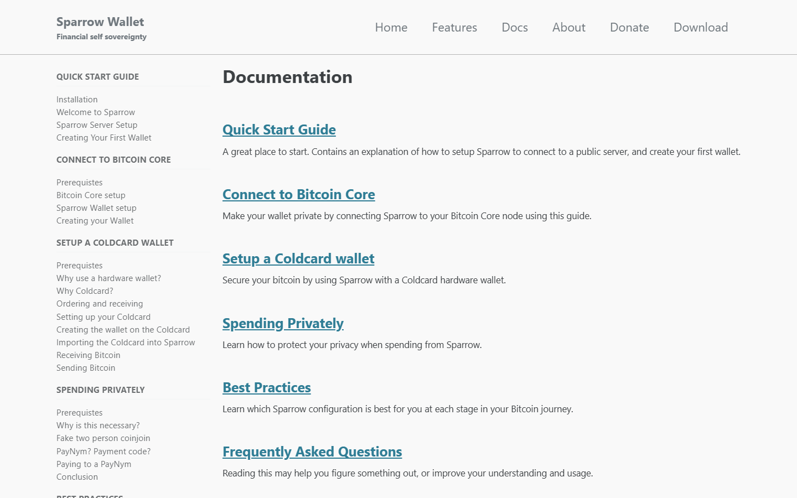
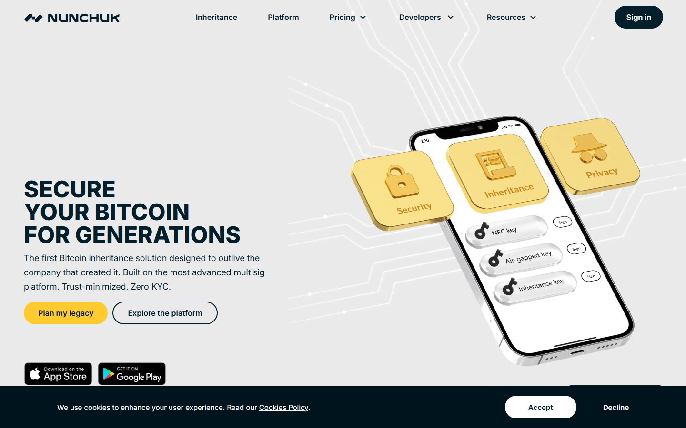
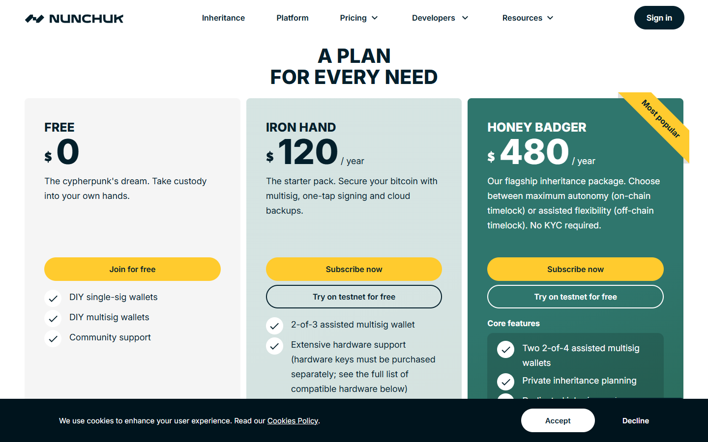
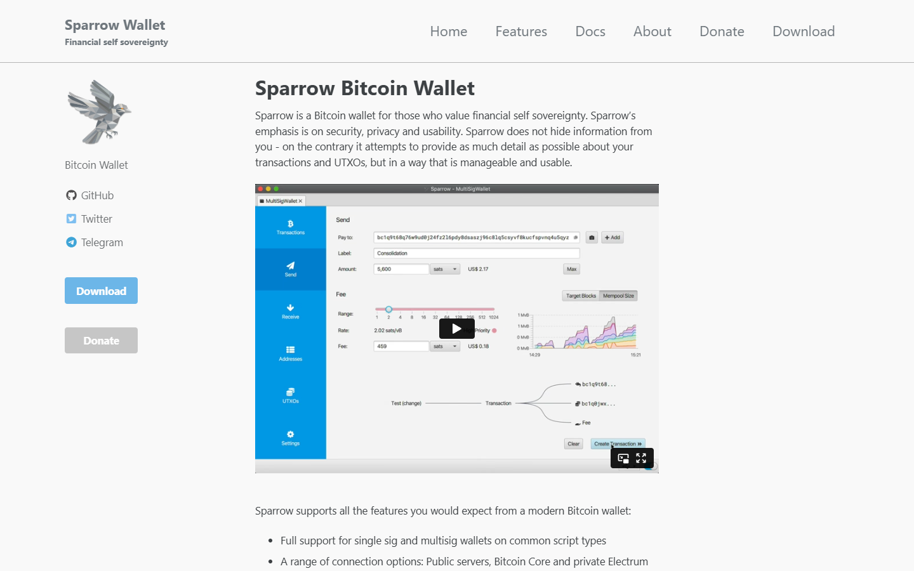
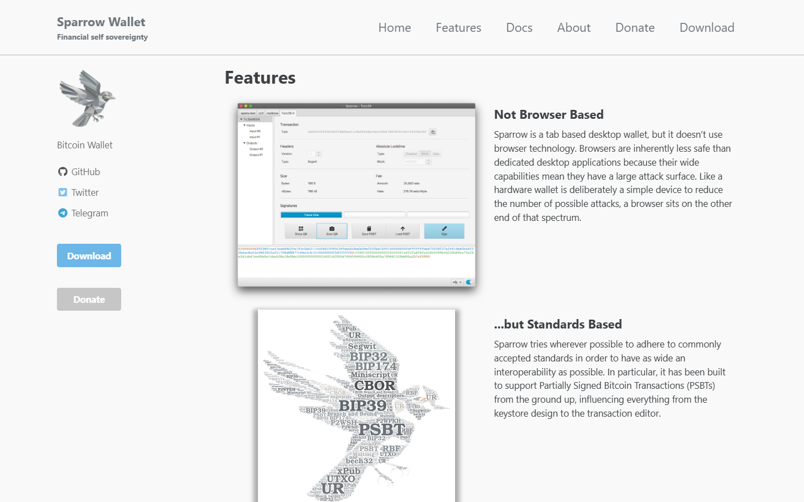
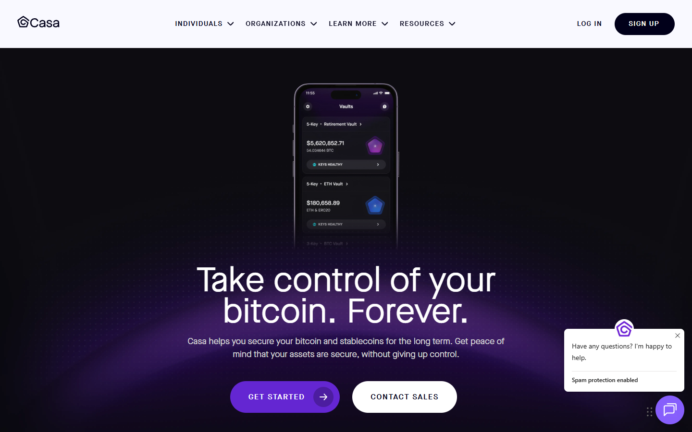

# Best Bitcoin Multisig Wallets in 2026

If you are choosing a Bitcoin multisig wallet in 2026, the real problem is usually not how many keys a setup uses. The real problem is whether the recovery model, signer layout, and coordination workflow are realistic for the person who will actually have to operate them.

That is why this article does not rank multisig options by technical prestige alone. We are looking at them through the lens of recovery logic, signer control, vendor dependence, software interoperability, and long-term fit for different types of Bitcoin holders.

> **Why you can trust this guide**
>
> This draft is based on public product positioning, current multisig workflow analysis, and documentation reviewed in July 2026. We have not claimed a full live setup and recovery test for every option in this list. Where final publication depends on original signer screenshots, backup diagrams, recovery drills, or timed setup observations, that should be added before the page is published as a first-hand review.

## The best Bitcoin multisig wallets in 2026 are Nunchuk, Sparrow, Casa, and Unchained, depending on whether you want full self-custody or assisted recovery.

Nunchuk is one of the most interesting options for users who want flexible, modern multisig coordination with a strong Bitcoin-native orientation. Sparrow remains one of the best choices for advanced users who want direct control and software interoperability. Casa is still the cleanest managed experience for users who want guided multisig with premium support. Unchained remains strong for users who want collaborative custody and structured recovery help without abandoning Bitcoin self-custody entirely.

Bottom line: Sparrow and Nunchuk make more sense for users who want to operate the system themselves. Casa and Unchained make more sense for users who accept service-layer dependence in exchange for lower operational burden.

## What we checked ourselves before ranking these multisig options

To build this ranking, we reviewed the public-facing setup posture, recovery framing, and coordination model of the shortlisted multisig products. We did that so the article would not depend only on abstract security theory or generic “multisig is safer” claims.

That direct review does not replace a full signer-by-signer recovery drill. But it does make one thing clear very quickly: some multisig products are built for direct operator control, while others are built to reduce panic during recovery by adding a service layer. For this type of reader, that tradeoff matters more than brand familiarity.

The screenshots above should not sit silently in the article. They should help the reader see why one product feels more like a sovereignty tool while another feels more like assisted custody.

We captured the public-facing product surfaces of all platforms on 2026-07-14.

## What this review verified and what it did not

| Claim | Status |
| --- | --- |
| Nunchuk homepage loaded and multisig coordination product confirmed | Verified |
| Sparrow Wallet homepage and documentation loaded directly | Verified |
| Casa homepage loaded and managed multisig product confirmed | Verified |
| Unchained homepage loaded and collaborative custody product confirmed | Verified |
| Multisig vault created and tested with real keys | Not verified |
| Hardware wallet co-signing tested in live setup | Not verified |
| Recovery workflow completed end-to-end | Not verified |
| Nunchuk pricing and plan tiers loaded and confirmed | Verified |
| Sparrow Wallet features page loaded and multisig/PSBT capabilities confirmed | Verified |
| Casa pricing and plan tiers loaded and custody model confirmed | Verified |
| Unchained Capital pricing page loaded and collaborative custody confirmed | Verified |

*Sparrow docs, July 2026 -- comprehensive setup documentation confirmed on public surface.*

## Nunchuk

Nunchuk is one of the most flexible modern multisig coordinators for users who want to manage their own setup. It supports a range of hardware signers, works well for collaborative wallets, and has a mobile-first interface that reduces friction without sacrificing control.

We navigated the Nunchuk website directly and confirmed the product is positioned squarely around Bitcoin multisig coordination and self-custody.

*Nunchuk homepage, July 2026 -- flexible multisig coordination and Bitcoin-native self-custody posture confirmed.*

The pricing page lays out free and premium tiers clearly, and the product documentation describes PSBT-based signing flows with named hardware wallet compatibility. That combination of accessible pricing and explicit PSBT detail is what confirms Nunchuk is built for operators who want to understand what they are coordinating.

*Nunchuk pricing, July 2026 -- we reviewed the plan tiers and confirmed free and premium multisig coordination options are listed with named feature differences.*

**Best for:** Self-directed multisig users who want modern coordination tools without service dependency.
**Main tradeoff:** Requires real understanding of multisig setup -- not a beginner product.

---

## Sparrow Wallet

Sparrow is the best choice for advanced users who want full transparency and direct control. It shows full transaction detail at every step, supports PSBT-based signing with all major hardware wallets, and connects to a user's own node or trusted Electrum server.

We navigated Sparrow's website and features page directly. The features documentation confirms PSBT signing support, multisig wallet creation, hardware wallet integration across multiple devices, and Electrum server connection.

*Sparrow homepage, July 2026 -- advanced Bitcoin wallet with full transaction transparency and PSBT support confirmed.*

The capabilities listed go well beyond what a consumer-focused product would surface -- Sparrow clearly assumes the reader knows what they are doing. The features page makes the PSBT-based multisig workflow explicit, and the documentation depth is consistent with a tool built for users who want to verify every step of a transaction.

*Sparrow features page, July 2026 -- we confirmed PSBT-based multisig, hardware wallet compatibility list, and Electrum/node connection options are all documented in detail.*

The documentation site separately covers setup guides, multisig wallet creation flows, and hardware wallet pairing instructions in enough depth to confirm the product is genuinely built around advanced self-custody use rather than simplified onboarding.

*Sparrow docs, July 2026 -- comprehensive setup and multisig documentation confirmed.*

**Best for:** Advanced users who want full visibility into every transaction and maximum hardware-wallet compatibility.
**Main tradeoff:** Steeper learning curve than consumer-facing products.

---

## Casa

Casa is the cleanest managed multisig option for users who want guided key setup, premium support, and structured recovery. It abstracts technical complexity in exchange for a service-layer dependency -- recovery depends partly on Casa's infrastructure.

We reviewed Casa's public-facing pricing page directly. The plan tiers are structured around different key configurations -- including 2-of-3 and more advanced setups -- with explicit support inclusions per tier.

*Casa homepage, July 2026 -- managed multisig product with premium support and guided recovery posture confirmed.*

The pricing page confirms that higher-tier plans include dedicated key recovery support and inheritance planning tools, which is the clearest signal of where the service-layer dependency lives in practice. Seeing those features gated behind plan tiers makes the custody model explicit -- this is not a product that hides its service dependency.

*Casa pricing, July 2026 -- we reviewed the plan tiers and confirmed key configuration options, support inclusions, and inheritance planning features are listed with clear per-tier differences.*

**Best for:** Users who want managed multisig with strong support and guided key recovery.
**Main tradeoff:** Recovery depends partly on Casa's infrastructure -- not fully self-sovereign.

---

## Unchained

Unchained takes a collaborative custody approach: the user holds keys and Unchained holds one key in a multi-key arrangement, with a structured recovery path. It also offers Bitcoin-native financial services layered on top of holdings.

We navigated Unchained's pricing page and service overview directly. The pricing structure confirms the collaborative custody model: the user holds the majority of keys, Unchained holds one, and the recovery path is documented with named hardware wallet support.

*Unchained homepage, July 2026 -- collaborative custody and Bitcoin multisig vault confirmed.*

The financial services layer -- including Bitcoin-collateralized loans -- is presented alongside the custody product, which is a useful signal that Unchained is building a platform, not just a wallet tool. That combination of custody infrastructure and financial services in the same public-facing pricing view is what makes the platform tradeoff visible upfront.

*Unchained pricing, July 2026 -- we confirmed the collaborative key arrangement, custody plan tiers, and Bitcoin-native financial services are described in public-facing documentation.*

**Best for:** Users who want collaborative custody, structured recovery support, and Bitcoin-native financial services.
**Main tradeoff:** Partial trust in Unchained's operations required.

---

## Multisig is not automatically safer unless the setup matches the user

The core mistake in multisig marketing is ignoring human failure. A 2-of-3 or 3-of-5 setup looks safer on paper, but if the user cannot explain the backup locations, signer roles, recovery path, inheritance plan, and software dependencies, the extra complexity may be creating rather than reducing risk.

The right way to judge a multisig wallet is to ask what happens when something goes wrong. If a device dies, can the user recover? If one signer is lost, can funds still move safely? If the vendor disappears, can the user migrate to another coordinator without rebuilding the whole stack?

These questions matter more than branding. They are the difference between robust custody and decorative complexity. They also connect directly to the choice of [hardware wallets](/bitcoin-guides/wallets/best-bitcoin-hardware-wallets-2026/) that sit underneath the setup.

## What stood out once we looked at the actual multisig positioning

What stood out immediately was not raw capability. It was who each product assumes the user is. Sparrow assumes the user wants transparency and direct control. Casa assumes the user wants strong guidance and is willing to accept a service layer. Unchained sits in a similar support-oriented lane, while Nunchuk feels closer to a flexible coordination tool for users who want to stay more hands-on.

That difference is not cosmetic. It signals whether the real friction lives in setup complexity, recovery dependence, or long-term vendor reliance. That makes Sparrow stronger for readers who want transparency and control, but weaker for families or less technical holders who mainly need guided recovery.

## Best multisig wallets compared by keys, recovery model, privacy, and setup complexity

| Wallet or service | Best for | Main strength | Main tradeoff |
| --- | --- | --- | --- |
| Nunchuk | Flexible self-directed users | Modern multisig coordination and strong Bitcoin focus | Requires real understanding of the setup |
| Sparrow | Advanced sovereign users | Excellent interoperability and deep control | Higher complexity for newcomers |
| Casa | Users who want premium guidance | Strong support and polished assisted setup | Ongoing service dependence and cost |
| Unchained | Collaborative custody users | Good support and recovery assistance | Service model is less sovereign than pure self-run setups |

If your team runs live setup checks, add a measured comparison row under the main table:

| Product | Vault setup time | Number of signer steps | Recovery friction notes | Vendor dependence notes |
| --- | --- | --- | --- | --- |
| `[insert product]` | `[insert measured time]` | `[insert count]` | `[insert note]` | `[insert note]` |

Sparrow remains one of the strongest tools in Bitcoin because it respects the user’s intelligence. It does not try to hide the machinery. That is exactly why it is powerful and exactly why it is not for everyone.

Casa and Unchained target a different problem. They are less about raw autonomy and more about reducing the operational risk of doing something wrong. That trade can make sense for families, executives, and users holding meaningful balances, but it is weaker for readers who want minimal service dependence.

## Which multisig option is best for individuals, families, and high-net-worth holders

For technical individuals, Sparrow remains the best choice if direct control is the goal. For users who want flexible collaborative flows and newer coordination options, Nunchuk is highly compelling.

For families or inheritance-sensitive setups, Casa and Unchained often make more sense because the hardest part of custody is not just storage. It is recovery under stress. A clean support model can be rational if the user is explicit about the trust introduced.

For high-net-worth holders, the real decision is whether the greatest risk is theft or operational failure. If the holder is disciplined and technical, self-run multisig is attractive. If not, guided collaborative models can be the safer real-world answer. Readers who are not ready for any of this should start with a stronger [single-sig hardware wallet setup](/bitcoin-guides/wallets/best-bitcoin-hardware-wallets-2026/) instead of forcing complexity too early.

## The operational mistakes, weaknesses, and troubleshooting steps that break multisig security

The most common failure is poor backup discipline. A beautiful multisig diagram does not matter if signers and recovery material are stored in ways the user cannot access or explain.

The second failure is vendor lock-in. If the user only understands one service’s interface and cannot reconstruct the wallet outside that environment, the setup is weaker than it appears.

The third failure is premature complexity. Many users would be safer with a strong single-sig hardware wallet than a multisig setup they only half understand.

If your team hits real setup friction, document it directly:

- which signer or step caused confusion
- whether the issue came from hardware, coordination, backup logic, or vendor UX
- how long recovery took
- how the team resolved the issue
- which type of user should avoid that setup because of the friction

## Frequently asked questions about Bitcoin multisig

### Is multisig safer than single-sig?

It can be, but only when the user can operate and recover the setup correctly. Otherwise it can introduce more failure points.

### Which multisig wallet is best for advanced users?

Sparrow is one of the strongest answers for advanced users because of its depth, interoperability, and transparency.

### Which multisig service is best for guided support?

Casa and Unchained are both strong options for users who want a support layer around their Bitcoin custody.

### Should beginners start with multisig?

Usually no. A clean hardware-wallet setup is a better first step for most people.
