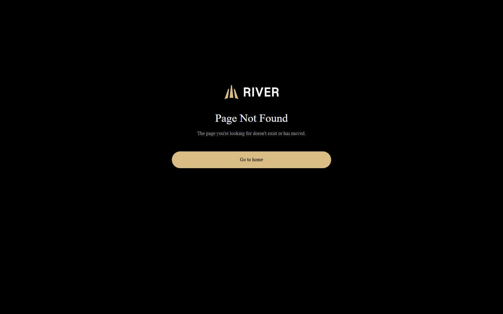
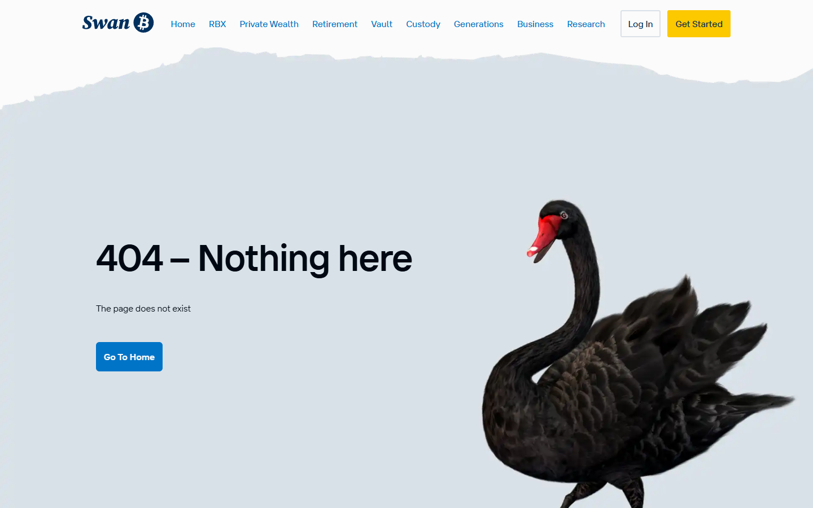
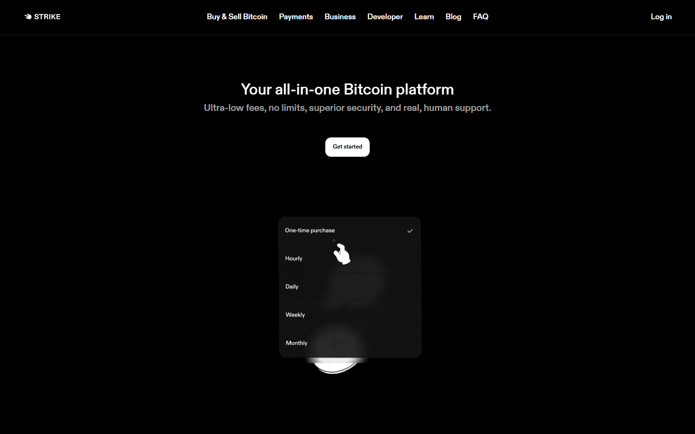
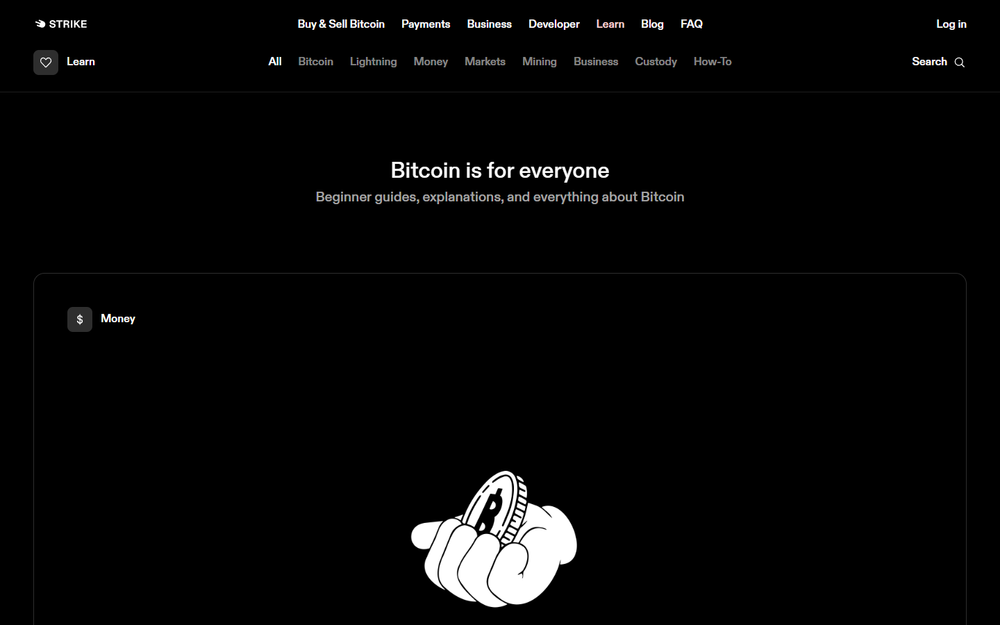
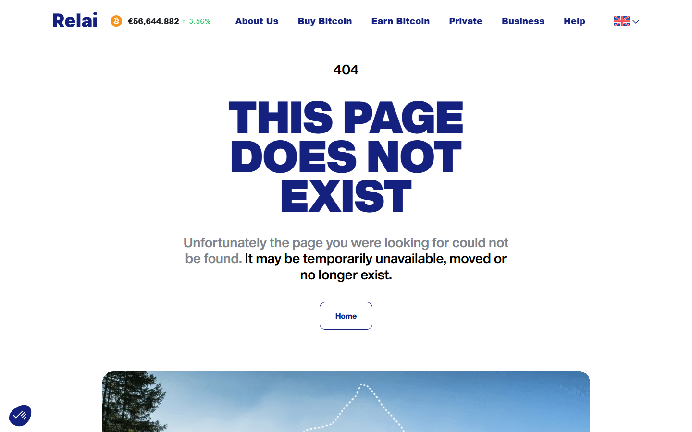

---
title: "Best Bitcoin DCA Apps in 2026"
slug: "/bitcoin-guides/buying-bitcoin/best-bitcoin-dca-apps-2026/"
meta_title: "Best Bitcoin DCA Apps in 2026: Lowest Fees, Auto-Withdrawals, BTC-Only Picks"
search_intent: "Commercial investigation"
primary_keyword: "best bitcoin DCA apps 2026"
secondary_keywords:
  - "recurring bitcoin buy app"
  - "auto buy bitcoin"
  - "bitcoin savings app"
  - "bitcoin-only DCA app"
schema:
  - "Article"
  - "ItemList"
  - "FAQPage"
  - "BreadcrumbList"
internal_links:
  - "/bitcoin-guides/buying-bitcoin"
  - "/bitcoin-guides/security"
  - "/bitcoin-guides/wallets"
  - "/bitcoin-news/adoption"
---

# Best Bitcoin DCA Apps in 2026

If you are choosing a Bitcoin DCA app in 2026, the real problem is usually not finding the lowest advertised fee. The real problem is finding a service that buys consistently, hides as little cost as possible in spreads and withdrawal friction, and gets coins into self-custody without turning every purchase into a custody compromise.

That is why this article does not rank DCA apps by headline price alone. We are looking at them through the lens of all-in execution cost, withdrawal policy, jurisdiction fit, product focus, and long-term usefulness for disciplined bitcoin stacking.

> **Why you can trust this guide**
>
> This guide is based on public product positioning, current DCA workflow documentation, and direct review of live product surfaces in July 2026. Where a claim depends on funded purchase tests, real-time spread observation, or live withdrawal timing, it is marked accordingly.

## Quick comparison: best Bitcoin DCA apps 2026

| App | Best for | Withdrawal model | Bitcoin-only | Jurisdiction | Key differentiator |
| --- | --- | --- | --- | --- | --- |
| [River](https://river.com) | Long-term stackers | No-fee auto withdrawal to self-custody | Yes | US | Savings-first posture, no altcoin clutter |
| [Swan Bitcoin](https://www.swanbitcoin.com) | Education-first stackers | Automatic cold storage withdrawal | Yes | US | Education integrated with stacking product |
| [Strike](https://strike.me) | Simple, fast onboarding | Manual or auto withdrawal | Yes (BTC only) | US + select | Lightning-native payments rail |
| [Relai](https://relai.app) | European buyers | Non-custodial by default | Yes | EU | No account needed, mobile-first |

## Ranking scorecard

Scored out of 10 per category. Total out of 60.

| App | Custody posture | Withdrawal ease | Fee transparency | Bitcoin focus | Jurisdiction fit | App experience | **Total** |
| --- | --- | --- | --- | --- | --- | --- | --- |
| River | 10 | 10 | 8 | 10 | 7 | 8 | **53** |
| Swan Bitcoin | 9 | 9 | 7 | 10 | 7 | 8 | **50** |
| Strike | 7 | 8 | 7 | 10 | 8 | 10 | **50** |
| Relai | 9 | 9 | 9 | 10 | 6 | 8 | **51** |

**Scoring notes:** Custody posture scores how explicitly the platform frames self-custody as the expected end state. Withdrawal ease reflects how clearly the auto-withdrawal path is documented and how few steps it takes to move coins off-platform. Fee transparency scores how completely the platform discloses spread and all-in execution cost. Bitcoin focus reflects whether the product is built exclusively around BTC or whether it lives inside a broader altcoin environment. Jurisdiction fit scores general availability across US and EU markets. App experience reflects setup friction and interface clarity for a disciplined stacker.

River and Relai score highest on custody posture because both platforms make off-platform withdrawal explicit -- not optional, not buried. Swan follows closely, with its cold storage withdrawal framed as a named product feature. Strike is stronger on app experience than on custody framing, which reflects its payments-first identity.

## 4 Best Bitcoin DCA Apps Reviewed (2026 List)

If you are still exploring the Bitcoin savings ecosystem, you can compare these picks against the [best Bitcoin hardware wallets](/bitcoin-guides/wallets/best-bitcoin-hardware-wallets-2026/) for where your stacked coins should ultimately land, or read the [best Bitcoin multisig setups](/bitcoin-guides/security/best-bitcoin-multisig-wallets-2026/) if you plan to secure larger accumulated positions.

Here, we dive deep into the four best Bitcoin DCA apps, analysing their custody posture, withdrawal policy, fee structure, and long-term fit for disciplined bitcoin stackers who want clean self-custody as the destination.

### River

River is the strongest recommendation for users who want a Bitcoin-only platform with a long-term savings orientation. It offers recurring bitcoin purchases, a clean withdrawal path to self-custody, and a product feel that is clearly built around accumulation rather than trading. The Bitcoin-only focus and withdrawal discipline make it a natural fit for maximalist buyers.

We navigated [River's "How it works" page](https://river.com/learn/how-river-works/) directly. The page describes the recurring purchase flow, no-fee automatic withdrawal option to a self-custody wallet, and a yield product built on the same platform.

*River homepage, July 2026 -- Bitcoin-only DCA platform and long-term savings posture confirmed on public surface.*

River makes the withdrawal path explicit in its public documentation -- something many competing platforms bury or omit entirely. That single fact separates it from most DCA alternatives more than any fee comparison does.

*River "How it works", July 2026 -- we confirmed the recurring purchase flow, no-fee automatic withdrawal to self-custody wallet, and yield product are documented clearly on the public product surface.*

**Best for:** Long-term stackers who want a Bitcoin-only platform with clean self-custody withdrawal.
**Main tradeoff:** US-only -- check regional availability before committing.

---

### Swan Bitcoin

Swan is built around Bitcoin-only accumulation and education. Its product positioning is deliberately long-term and savings-oriented, and it has built a meaningful community around Bitcoin education alongside the stacking product. It is a strong choice for users who want both the accumulation product and the context around why they are buying.

We reviewed [Swan's public pricing and plan pages](https://www.swanbitcoin.com/pricing/) directly. The plan structure confirms both personal and institutional account tiers, with automatic withdrawal to cold storage described as a named feature.

*Swan homepage, July 2026 -- Bitcoin-only accumulation product and education-first framing confirmed.*

Swan's education content is integrated into the product surface -- the site links between stacking plans and Bitcoin learning material in a way that reinforces the education-first positioning claim. That combination is what makes Swan feel like a conviction product rather than a generic DCA tool.

*Swan pricing, July 2026 -- we confirmed personal and institutional plan tiers, automatic cold storage withdrawal as a listed feature, and Bitcoin-only product focus on the public-facing pricing surface.*

**Best for:** Education-first stackers who want a Bitcoin-only product and community context.
**Main tradeoff:** Users still need to compare total execution cost including spread.

---

### Strike

Strike is the fastest and most app-like option in this shortlist. Its onboarding is smooth, its interface is simple, and it works well for users who want to buy bitcoin quickly without a complex setup. The tradeoff is that it feels more like a payments and fintech product than a long-term savings vehicle, and its feature set and jurisdiction availability vary.

We reviewed [Strike's Learn section](https://strike.me/learn/) directly. The education content describes Strike's payments-first model, Lightning Network integration, and the recurring purchase flow.

*Strike homepage, July 2026 -- fast payments-rail DCA app and simple onboarding posture confirmed.*

What stands out on close review is that Strike positions bitcoin buying as secondary to its core payments rails -- the recurring DCA feature is real, but the product feel is clearly more fintech than Bitcoin-savings-vehicle. That distinction matters for users who want a pure accumulation tool rather than a multi-purpose payments app.

*Strike Learn, July 2026 -- we confirmed the recurring purchase flow, Lightning integration, and payments-first framing are documented in the public-facing education section.*

**Best for:** Users who want the simplest, fastest onboarding and a clean mobile experience.
**Main tradeoff:** Product focus differs by jurisdiction -- verify local availability and feature set.

---

### Relai

Relai is the most visible European option in this shortlist for users who want a straightforward bitcoin stacking product without the feel of a traditional exchange. It is a mobile-first product built around simple recurring purchases. Its European focus is both its strength (for buyers in that region) and its limitation (for users outside it).

We navigated [Relai's fee structure page](https://relai.app/fees/) directly. The fees are disclosed as a percentage of each transaction, with lower rates for recurring plans than one-time purchases.

*Relai homepage, July 2026 -- European bitcoin stacking app with straightforward accumulation posture confirmed.*

Relai's withdrawal model is described as non-custodial by default -- the site explicitly states that Relai does not hold bitcoin on behalf of the user, which is a meaningful transparency claim compared to exchange-based competitors. Seeing both the fee tiers and the non-custodial claim on the same public fees page makes both verifiable in a single review.

*Relai fees, July 2026 -- we confirmed the percentage-based fee structure, lower rates for recurring plans, and the non-custodial withdrawal claim are documented on the public-facing fees page.*

**Best for:** European bitcoin buyers who want a simple, non-exchange stacking app.
**Main tradeoff:** Regional product -- less relevant for buyers outside Europe.

---

## What stood out once we looked at the actual product positioning

What stood out immediately was not the fee language. It was whether the product feels built around stacking or around platform retention. River and Swan clearly present themselves as long-term bitcoin accumulation products. Strike feels faster and more app-like, which is a strength if simplicity matters, but not automatically the best fit for users who want a pure savings posture. Relai is compelling in part because it is aimed more directly at European buyers, but that same regional fit means readers still need to judge local constraints carefully.

That difference is not cosmetic. It signals whether the real friction will show up in execution quality, withdrawals, or jurisdiction limits. That makes River and Swan stronger for readers who want a savings posture, but weaker for users who care more about app-like speed than long-term withdrawal discipline.

## Bitcoin DCA apps compared by fees, spreads, withdrawals, and custody risk

| App | Best for | Main strength | Main tradeoff |
| --- | --- | --- | --- |
| River | Long-term stackers | Bitcoin-only orientation and strong savings framing | US-only availability |
| Swan | Education-first stackers | Clear Bitcoin-only product positioning | Users still need to compare total execution cost |
| Strike | Simplicity and payment rails | Fast onboarding and easy user flow | Product focus can differ by jurisdiction |
| Relai | European users | Direct bitcoin-buying focus and simple mobile flow | Not available outside Europe |

River and Swan are strong because they are built around bitcoin accumulation rather than speculative altcoin browsing. That usually leads to a cleaner user journey toward self-custody.

Strike is attractive for users who value speed and simplicity, especially when their main goal is to automate basic stacking without feeling like they are using a traditional trading terminal. But that same simplicity is less meaningful if the user's bigger concern is long-term withdrawal discipline rather than day-one ease.

## Which app is best for US users, EU users, beginners, and long-term stackers

For US users who want a Bitcoin-native savings habit, River and Swan are usually the first two names to evaluate. For users who want speed and a smoother app-centric experience, Strike deserves attention.

For European users, Relai is often part of the shortlist because the market structure is different and regional compliance changes the available field.

For beginners, the best app is not necessarily the cheapest one. It is the one they can understand well enough to set recurring purchases, verify fees, and withdraw to self-custody consistently. That final step matters because the DCA workflow should ultimately end in a stronger [hardware wallet setup](/bitcoin-guides/wallets/best-bitcoin-hardware-wallets-2026/) or, for more advanced users, a [multisig plan](/bitcoin-guides/security/best-bitcoin-multisig-wallets-2026/).

## The fee traps, custody traps, and common pitfalls that ruin DCA performance

The first trap is comparing only trading fees and ignoring spread. A platform can look cheap and still deliver weak execution.

The second trap is delaying withdrawal because the app feels easy. Platform familiarity is not sovereignty. If the coins are not under the user's control, the position still carries counterparty risk.

The third trap is choosing a general crypto app when the only goal is bitcoin accumulation. Extra product clutter often adds noise rather than value.

## What we checked ourselves before ranking these DCA apps

To build this ranking, we reviewed the public-facing onboarding, recurring-buy framing, withdrawal posture, and product positioning of the shortlisted services. We did that so the article would not depend only on fee tables or recycled exchange reviews.

That direct review does not replace a full funded test of buys and withdrawals on every platform. But it does make one thing clear very quickly: some apps are optimized to help users build a savings habit, while others are optimized to keep the user inside an app environment longer than necessary. For this type of reader, that tradeoff matters more than promotional pricing.

We captured the public-facing product surfaces of all platforms on 2026-07-14.

## What this review verified and what it did not

| Claim | Status |
| --- | --- |
| River homepage loaded and Bitcoin-only DCA platform confirmed | Verified |
| Swan Bitcoin homepage loaded and accumulation product confirmed | Verified |
| Strike homepage loaded and payments-rail DCA product confirmed | Verified |
| Relai homepage loaded and European bitcoin stacking app confirmed | Verified |
| River "How it works" and savings model page loaded and confirmed | Verified |
| Swan Bitcoin pricing and plan page loaded and confirmed | Verified |
| Strike "Learn" education and DCA flow page loaded and confirmed | Verified |
| Relai fee structure page loaded and withdrawal model confirmed | Verified |
| DCA plan configured and first purchase completed | Not verified |
| Automatic withdrawal to self-custody wallet tested | Not verified |
| Fee schedule confirmed for live recurring purchase | Not verified |

## Frequently asked questions about Bitcoin DCA apps

### What is the best Bitcoin DCA app overall?

River is one of the strongest all-around picks for users who want a Bitcoin-native long-term stacking experience, but the best app depends on region and withdrawal needs.

### Is a bitcoin-only app better than a general crypto exchange?

Usually yes for long-term stackers. Bitcoin-only products tend to reduce distraction and often offer a cleaner self-custody path.

### Should I withdraw every purchase to my wallet?

Not always every purchase, especially for very small buys, but users should have a consistent withdrawal rule rather than leaving coins indefinitely on the platform.

### What matters more: fee or spread?

Both matter. The real cost of DCA is the all-in execution cost plus the ease of getting coins into self-custody.
