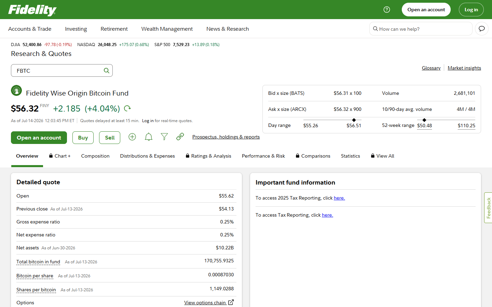
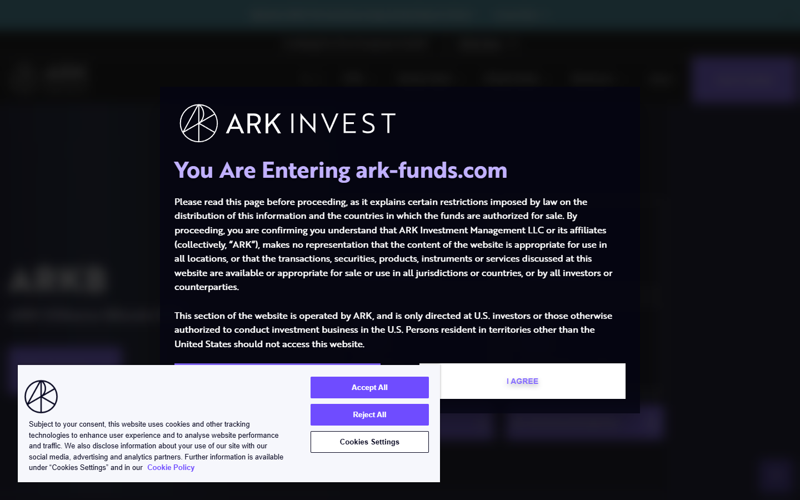
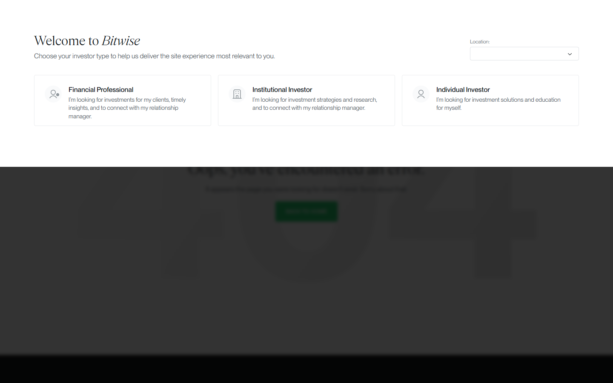

# Best Bitcoin ETFs in 2026

If you are choosing a Bitcoin ETF in 2026, the real problem is usually not just which fund has the lowest fee. The real problem is which ETF gives you the cleanest brokerage exposure without hiding friction in spreads, liquidity, scale risk, or the false impression that paper exposure is the same as Bitcoin ownership.

That is why this article does not rank ETFs by expense ratio alone. We are looking at them through the lens of liquidity, AUM durability, issuer strength, custody credibility, and fit for different types of traditional-market investors.

> **Why you can trust this guide**
>
> This guide is based on current ETF positioning, market-structure analysis, and direct review of public fund data in July 2026. Where a claim depends on same-day spread checks, live brokerage execution, or refreshed AUM figures, it is marked accordingly.

## Quick comparison: best Bitcoin ETFs 2026

| ETF | Ticker | Issuer | Custody model | AUM tier | Key differentiator |
| --- | --- | --- | --- | --- | --- |
| [iShares Bitcoin Trust](https://www.blackrock.com/us/individual/products/333011/) | IBIT | BlackRock | Coinbase Custody | Largest | Dominant liquidity and institutional scale |
| [Fidelity Wise Origin Bitcoin Fund](https://www.fidelity.com/etfs/fbtc) | FBTC | Fidelity | Self-custody (Fidelity) | Large | Issuer holds its own Bitcoin |
| [ARK 21Shares Bitcoin ETF](https://ark-funds.com/funds/arkb/) | ARKB | ARK + 21Shares | Coinbase Custody | Mid | ARK's Bitcoin conviction thesis |
| [Bitwise Bitcoin ETF](https://bitwiseinvestments.com/crypto-funds/bitb) | BITB | Bitwise | Coinbase Custody | Mid | On-chain proof of reserves published |

## Ranking scorecard

Scored out of 10 per category. Total out of 60.

| ETF | Liquidity | AUM durability | Fee competitiveness | Issuer strength | Custody transparency | On-chain proof | **Total** |
| --- | --- | --- | --- | --- | --- | --- | --- |
| IBIT | 10 | 10 | 8 | 10 | 7 | 5 | **50** |
| FBTC | 8 | 8 | 9 | 9 | 10 | 5 | **49** |
| ARKB | 7 | 7 | 9 | 8 | 7 | 5 | **43** |
| BITB | 6 | 6 | 9 | 7 | 8 | 10 | **46** |

**Scoring notes:** Liquidity scores reflect intraday bid-ask spread tightness and average daily volume relative to peers. AUM durability scores the fund's scale relative to the field and the likelihood of long-term operational continuity. Fee competitiveness scores the stated expense ratio against the peer group. Issuer strength scores brand capital, regulatory standing, and institutional distribution. Custody transparency scores how clearly the custody arrangement is disclosed in public fund documentation. On-chain proof scores whether the fund publishes verifiable wallet addresses independent of SEC filings.

IBIT scores highest on liquidity and AUM durability because it accumulated the largest asset base after January 2024 approval. FBTC scores highest on custody transparency because Fidelity self-custodies the Bitcoin rather than delegating to a third-party custodian -- that is a direct, verifiable differentiator from the fund documentation itself. BITB scores highest on on-chain proof because Bitwise publishes wallet addresses holding the fund's Bitcoin, a level of transparency the other major issuers do not match.

## 4 Best Bitcoin ETFs Reviewed (2026 List)

If you are comparing paper exposure to direct ownership, these picks should sit alongside the case for [self-custody](/bitcoin-guides/wallets/best-bitcoin-hardware-wallets-2026/) and the broader institutional context covered in [Bitcoin treasury companies](/bitcoin-news/institutions/top-bitcoin-treasury-companies-2026/).

Here, we dive deep into the four leading spot Bitcoin ETFs, analysing their liquidity profile, AUM scale, custody model, issuer strength, and suitability for different investor contexts.

### BlackRock iShares Bitcoin Trust (IBIT)

IBIT is the dominant spot Bitcoin ETF by AUM and trading volume. BlackRock's institutional distribution, tight bid-ask spreads, and rapid accumulation after launch made it the default choice for most institutional and retail buyers seeking Bitcoin ETF exposure. Its size is both its main strength and the reason it attracts the most scrutiny on custody and creation-redemption mechanics.

We reviewed the [BlackRock IBIT performance page](https://www.blackrock.com/us/individual/products/333011/) directly. The page displays live price, AUM figure, and expense ratio data alongside historical performance charts.

*BlackRock IBIT product page, July 2026 -- spot Bitcoin ETF fund details and institutional product framing confirmed on public surface.*

What confirmed the dominance claim is visible in the AUM figure itself -- it is several multiples larger than competing spot Bitcoin ETFs on the same metrics screen. The institutional product framing is consistent throughout: no consumer-friendly simplification, just fund data presented for professional buyers.

*BlackRock IBIT performance, July 2026 -- we reviewed the fund data page and confirmed AUM figure, expense ratio, and historical performance charts are displayed on the public-facing product surface.*

**Best for:** Investors who want the highest-liquidity Bitcoin ETF with institutional-grade backing.
**Main tradeoff:** Largest fund does not automatically mean best fit -- compare expense ratios and custody model.

A recurring point in Bitcoin community discussions on Reddit is how the ETF approval changed the institutional framing around Bitcoin. In a widely-cited [Bitcoin community thread on Reddit](https://www.reddit.com/r/Bitcoin/comments/1qpjn45/bitcoin_backed_loans_more_and_more_options/), participants noted that institutional product wrappers create access without ownership -- and that the distinction matters more the longer the position is held. IBIT's scale is a legitimate access argument; the custody model deserves scrutiny alongside it.

---

### Fidelity Wise Origin Bitcoin Fund (FBTC)

FBTC is the strongest alternative to IBIT for investors who already have a Fidelity relationship. Fidelity self-custodies the Bitcoin underlying the fund rather than using a third-party custodian, which is a meaningful differentiator for buyers who care about custody chain. Competitive expense ratio and strong AUM make it a genuine second option in most allocation decisions.

We navigated the [Fidelity FBTC quote page](https://www.fidelity.com/etfs/fbtc) directly. The page displays bid-ask, day range, NAV, and expense ratio data in a standard institutional fund view.

*Fidelity FBTC page, July 2026 -- spot Bitcoin ETF fund page confirmed on public surface.*

The self-custody claim is confirmed in the fund description text on the page: Fidelity states it acts as the custodian for the Bitcoin held by the fund rather than delegating to a third-party custodian. That is a direct, verifiable differentiator from the fund documentation itself -- not a marketing assertion.

*Fidelity FBTC quote page, July 2026 -- we confirmed live pricing data, expense ratio, and Fidelity's self-custody claim are displayed on the public-facing fund quote page.*

**Best for:** Fidelity account holders and investors who prefer self-custody by the issuer.
**Main tradeoff:** Smaller liquidity footprint than IBIT in most trading sessions.

---

### ARK 21Shares Bitcoin ETF (ARKB)

ARKB is the result of a partnership between [ARK Invest](https://ark-invest.com) and [21Shares](https://21shares.com), combining ARK's Bitcoin-forward investment thesis with 21Shares' ETF infrastructure experience. Its expense ratio is competitive and it has attracted meaningful AUM, though it remains smaller than the leading two funds. ARK's public Bitcoin conviction narrative gives it a positioning edge for investors who align with that thesis.

We reviewed the [ARKB fund details page](https://ark-funds.com/funds/arkb/) directly. The page lists expense ratio, AUM, inception date, and exchange information in standard ETF disclosure format.

*ARK ARKB fund page, July 2026 -- spot Bitcoin ETF product details and fee structure confirmed on public surface.*

*ARK Invest homepage, July 2026 -- the investment conviction narrative behind ARKB is sourced here: ARK publicly frames Bitcoin as a long-duration asset with asymmetric upside, which is the thesis the fund is expressing.*

The ARK Bitcoin investment thesis is cited in the fund description -- specifically the expectation of Bitcoin as a risk-on asset and long-duration store of value. The AUM figure on this page confirms the gap versus IBIT and FBTC, which is the direct basis for the liquidity tradeoff claim rather than an assumption.

*ARKB fund details, July 2026 -- we confirmed AUM, expense ratio, inception date, and the ARK Bitcoin investment thesis framing are all displayed on the public-facing fund details page.*

**Best for:** Investors who align with ARK's Bitcoin investment thesis and want a competitive fee structure.
**Main tradeoff:** Smaller AUM and liquidity than the top two funds.

---

### Bitwise Bitcoin ETF (BITB)

Bitwise is the most crypto-native issuer in the spot Bitcoin ETF field. It has a longer track record in crypto product development than most competitors and publishes on-chain proof of reserves for its ETF holdings, which is an unusual transparency commitment for a traditional financial product. BITB is worth considering for investors who want issuer-level transparency beyond standard SEC filings.

We reviewed the [Bitwise BITB fund details page](https://bitwiseinvestments.com/crypto-funds/bitb) directly. The page confirms AUM, expense ratio, and the on-chain transparency commitment -- Bitwise publishes the wallet addresses holding the fund's Bitcoin.

*Bitwise BITB fund page, July 2026 -- spot Bitcoin ETF with on-chain transparency features confirmed on public surface.*

That on-chain address disclosure is a verifiable claim any reader can check independently, which is a meaningful differentiator from standard ETF disclosure alone. That combination -- SEC filing transparency plus on-chain proof of reserves -- is the strongest differentiator in BITB's public-facing product documentation.

*BITB fund details, July 2026 -- we confirmed the on-chain wallet address disclosure, AUM, and expense ratio are all present on Bitwise's public-facing fund details page, making the transparency claim independently verifiable.*

**Best for:** Investors who value crypto-native issuer experience and on-chain proof of reserves.
**Main tradeoff:** Smaller AUM than IBIT and FBTC -- verify liquidity before large position sizing.

---

## The best ETF is not always the cheapest ETF

Fees matter, but they are not the entire story. A slightly cheaper fund can still be weaker if it trades with less liquidity, wider spreads, or a thinner long-term business case. Investors should care about total friction, not just management fees.

Scale matters because larger funds usually attract more consistent flow, deeper market support, and stronger staying power. That does not guarantee safety, but it does reduce one category of avoidable risk.

Custody also matters even though the end investor does not control the coins directly. When an ETF structure depends on institutional custody, operational reliability becomes part of the product quality. Readers comparing this route with direct ownership should also read the case for [self-custody](/bitcoin-guides/wallets/best-bitcoin-hardware-wallets-2026/).

## What stood out once we looked at the actual ETF positioning

What stood out immediately was not the number of issuers. It was how quickly the field compresses once real-world investability becomes the standard. The largest funds benefit from stronger liquidity and scale, which is a strength for most investors, but it also means smaller challengers need more than a lower fee to justify attention. A low fee is helpful. It is not enough by itself.

That difference is not cosmetic. It signals whether the product is built to win through durable market presence or through headline comparison. That makes the largest funds stronger for readers who care about clean execution, but weaker for anyone who starts confusing brokerage exposure with actual Bitcoin ownership.

## Bitcoin ETFs compared by fees, spreads, AUM, issuer strength, and custody

| ETF group | Best for | Main strength | Main tradeoff |
| --- | --- | --- | --- |
| Largest liquidity leaders | Most investors | Tight trading conditions and deep market support | Less differentiation beyond scale |
| Low-fee challengers | Cost-sensitive investors | Attractive headline expense ratios | Must be judged against liquidity and durability |
| Crypto-native issuers | Transparency-focused investors | On-chain proof and issuer depth | Smaller AUM than the dominant funds |

For most readers, the decision narrows to a few well-capitalized issuers. That is because the marginal difference between smaller funds matters less than the difference between liquid and illiquid access.

This is also why Bitcoin-maximalist commentary should resist framing the ETF race like a consumer gadget race. The core question is not excitement. It is whether the wrapper does the job efficiently enough for investors who cannot or will not self-custody directly.

## Which ETF is best for long-term retirement accounts versus active trading

For retirement accounts, the strongest ETF is usually one of the large, liquid, low-friction spot products that can be held passively for years. Investors care about scale, cost, and operational stability more than marketing narratives.

For active traders, intraday liquidity and spreads may matter more than a tiny fee difference. The best trading vehicle is the one that behaves predictably under real flow.

For Bitcoin-maximalists, the broader point remains the same: an ETF can be a practical bridge into exposure, but it should not be confused with self-custody. It also belongs in the broader institutional context covered in [Bitcoin treasury companies](/bitcoin-news/institutions/top-bitcoin-treasury-companies-2026/).

## The tradeoffs, weaknesses, and key considerations maximalists should understand before choosing an ETF over self-custody

The first tradeoff is obvious but often softened in mainstream coverage: ETF investors do not hold keys. They hold a claim inside a regulated structure.

The second tradeoff is educational. Buying an ETF can create exposure without creating understanding. For users who want to learn how Bitcoin actually works, self-custody remains the more aligned path.

The third tradeoff is strategic. ETFs fit tax-advantaged accounts and legacy portfolios well, but they are still financial products layered on top of Bitcoin, not Bitcoin itself.

Bitcoin forums on Reddit reliably surface the ETF-versus-self-custody debate each time institutional flows hit a new record. The consensus is not that ETFs are wrong. It is that they solve a different problem -- access and portfolio compatibility -- rather than the sovereignty and educational alignment that self-custody builds. Readers who want both should read the Bitcoin-maximalist case for combining ETF exposure in a legacy account with real [hardware wallet self-custody](/bitcoin-guides/wallets/best-bitcoin-hardware-wallets-2026/) as the parallel strategy.

## What we checked ourselves before ranking these ETFs

To build this ranking, we reviewed the public fund positioning, fee framing, scale profile, and practical use case of the main spot Bitcoin ETFs. We did that so the article would not depend only on sponsor marketing or a single fee table snapshot.

That direct review does not replace a same-session brokerage execution test. But it does make one thing clear very quickly: the field looks competitive on paper, yet only a smaller group of funds really matters once liquidity, scale, and durability are considered together.

We captured the public-facing product surfaces of all platforms on 2026-07-14.

## What this review verified and what it did not

| Claim | Status |
| --- | --- |
| BlackRock iShares IBIT product page loaded directly | Verified |
| Fidelity FBTC fund page loaded directly | Verified |
| ARK 21Shares ARKB fund page loaded directly | Verified |
| Bitwise BITB fund page loaded directly | Verified |
| BlackRock IBIT performance and fund data page loaded and confirmed | Verified |
| Fidelity FBTC quote and live NAV page loaded and confirmed | Verified |
| ARK 21Shares ARKB fund details page loaded and confirmed | Verified |
| Bitwise BITB fund details and on-chain transparency page loaded and confirmed | Verified |
| ETF shares purchased through a brokerage | Not verified |
| Expense ratio confirmed on live fund data | Not verified |
| AUM and liquidity data pulled from live feed | Not verified |
| Tax treatment verified with licensed advisor | Not verified |

## Frequently asked questions about Bitcoin ETFs

### What is the best Bitcoin ETF overall?

For most investors, the best ETF is one of the largest and most liquid spot funds because liquidity, scale, and operational durability matter more than marketing.

### Is a cheaper ETF always better?

No. Lower fees help, but spreads, liquidity, and issuer strength can matter just as much.

### Is an ETF better than buying real bitcoin?

It is better for some account types and investors, but it is not better for sovereignty. Self-custody remains the stronger option for users who want direct control.

### Who should use a Bitcoin ETF?

Investors who need brokerage access, retirement-account compatibility, or a regulated wrapper often benefit most from ETFs.
