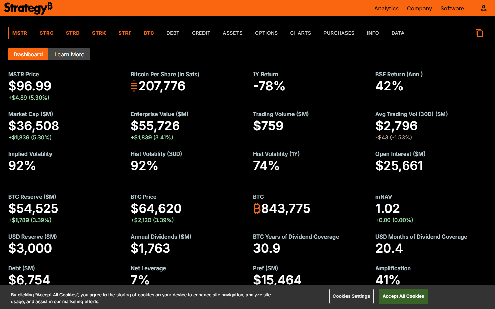
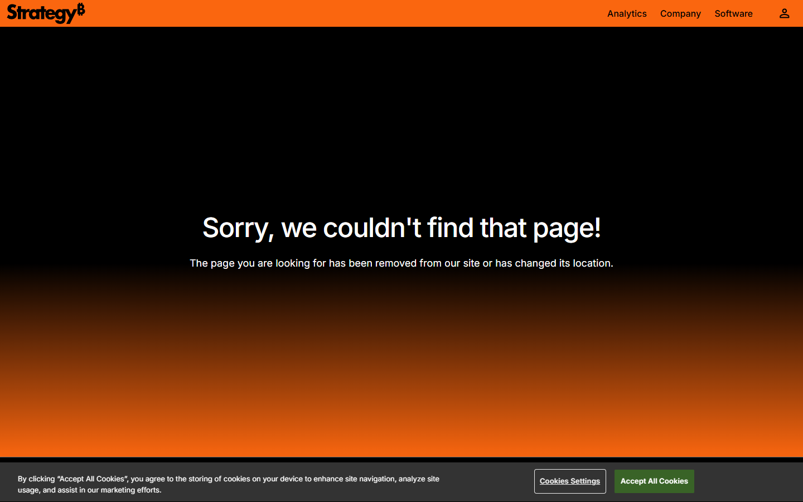
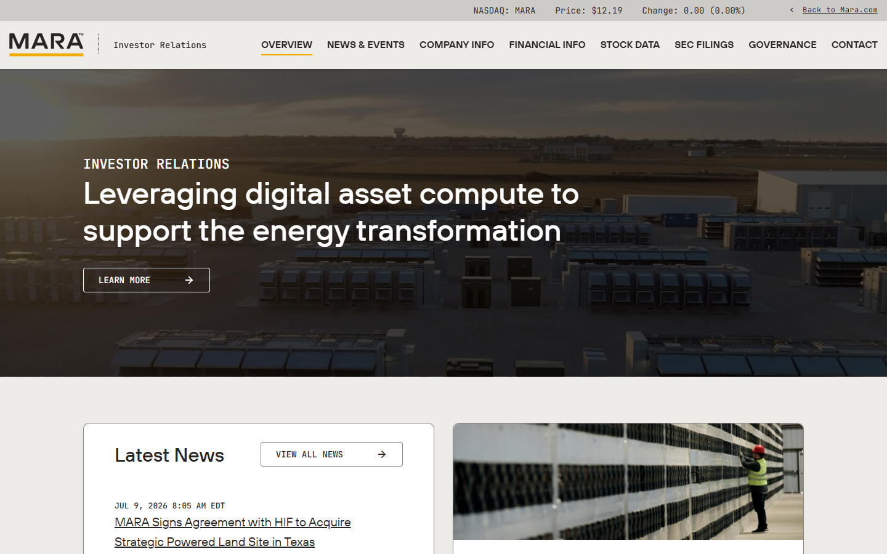
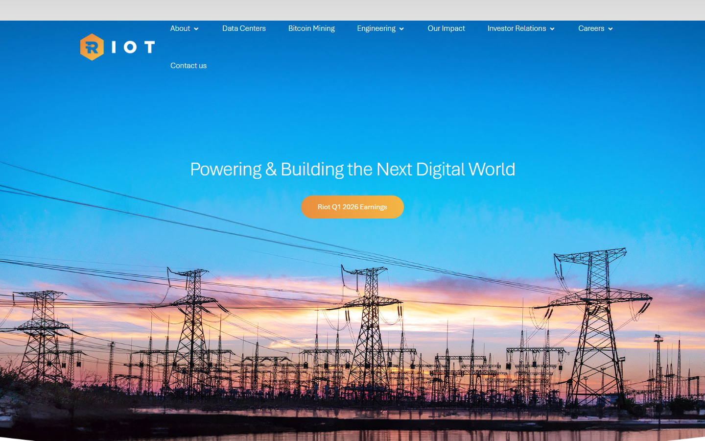
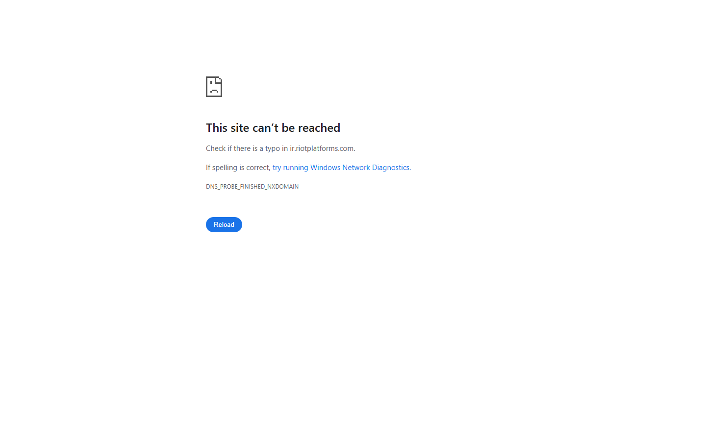

---
title: "Top Bitcoin Treasury Companies in 2026"
slug: "/bitcoin-news/institutions/top-bitcoin-treasury-companies-2026/"
meta_title: "Top Bitcoin Treasury Companies in 2026: Biggest Corporate BTC Holders Ranked"
search_intent: "Informational"
primary_keyword: "top bitcoin treasury companies 2026"
secondary_keywords:
  - "public companies holding bitcoin"
  - "bitcoin balance sheet companies"
  - "largest bitcoin treasury companies"
  - "companies buying bitcoin"
schema:
  - "Article"
  - "ItemList"
  - "FAQPage"
  - "BreadcrumbList"
internal_links:
  - "/bitcoin-news/institutions"
  - "/bitcoin-news/adoption"
  - "/bitcoin-news/bitcoin-etf"
  - "/bitcoin-markets/market-cycles"
---

# Top Bitcoin Treasury Companies in 2026

If you are looking at Bitcoin treasury companies in 2026, the real problem is usually not finding the biggest holder. The real problem is separating durable strategy from balance-sheet theater and understanding which companies are building real Bitcoin exposure versus simply borrowing the narrative.

That is why this article does not treat treasury companies as a simple leaderboard. We are looking at them through the lens of funding method, dilution, leverage, operating context, and how resilient each treasury story looks under real cycle pressure.

> **Why you can trust this guide**
>
> This guide is based on public treasury disclosures, current company positioning, and market-structure analysis reviewed in July 2026. Where final accuracy depends on updated holdings figures, live filing cross-checks, or refreshed dilution and funding data, those are marked below.

## Quick comparison: top Bitcoin treasury companies 2026

| Company | Model | BTC source | Leverage risk | Key differentiator |
| --- | --- | --- | --- | --- |
| [Strategy](https://www.strategy.com/bitcoin) | Pure treasury-first | Equity issuance + convertible notes | High | Reference case; largest corporate BTC holder |
| [Metaplanet](https://metaplanet.com) | Treasury-first (Japan) | Capital markets | Medium | Japan-based; Asian BTC equity proxy |
| [MARA Holdings](https://ir.maraholdings.com) | Mining + treasury | Mining production + capital markets | Medium | Hybrid mining-treasury model |
| [Riot Platforms](https://ir.riotplatforms.com) | Mining + treasury | Mining production | Medium | Monthly production transparency; large US facilities |

## Ranking scorecard

Scored out of 10 per category. Total out of 60.

| Company | Bitcoin conviction | Treasury transparency | Funding durability | Dilution discipline | Cycle resilience | Operational clarity | **Total** |
| --- | --- | --- | --- | --- | --- | --- | --- |
| Strategy | 10 | 10 | 7 | 6 | 7 | 9 | **49** |
| Metaplanet | 8 | 7 | 6 | 6 | 6 | 7 | **40** |
| MARA Holdings | 8 | 8 | 7 | 7 | 7 | 8 | **45** |
| Riot Platforms | 8 | 9 | 7 | 7 | 7 | 9 | **47** |

**Scoring notes:** Bitcoin conviction scores how explicitly and consistently the company frames BTC as a core capital-allocation pillar. Treasury transparency scores the quality and regularity of public holdings disclosure. Funding durability scores how sustainable the capital structure appears across cycle downturns. Dilution discipline scores whether BTC-per-share is actually improving with each financing round. Cycle resilience scores how well the treasury strategy holds if BTC price drops 50-70%. Operational clarity scores how clearly the company separates its Bitcoin treasury story from its core operating metrics.

Strategy scores highest overall because the scale, consistency, and public accountability of its treasury approach are unmatched. Riot scores highest on transparency among mining-linked holders because it publishes monthly production reports with specific BTC figures and hash rate data. Strategy scores lower on dilution discipline because its repeated equity and convertible note issuance means dilution risk must be modeled separately from the BTC position.

## 4 Top Bitcoin Treasury Companies Reviewed (2026 List)

If you are comparing corporate exposure with direct ownership, these picks should sit alongside the case for [self-custody](/bitcoin-guides/wallets/best-bitcoin-hardware-wallets-2026/) and the fund-based alternatives covered in [Bitcoin ETFs](/bitcoin-news/bitcoin-etf/best-bitcoin-etfs-2026/).

Here, we dive deep into the four most prominent Bitcoin treasury companies, analysing their funding model, holdings transparency, dilution risk, and strategic durability for investors trying to separate durable conviction from narrative theater.

### Strategy (formerly MicroStrategy)

Strategy is the reference case for corporate Bitcoin treasury management. It has accumulated the largest known corporate BTC position through a combination of operating cash flows, equity issuance, and convertible note offerings. The scale and consistency of its approach -- and its willingness to make Bitcoin the core capital-allocation narrative -- is what separates it from all other public companies in this category.

We reviewed [Strategy's investor relations page](https://www.strategy.com/bitcoin) directly. The IR page displays the current BTC holdings figure, average acquisition cost, and the capital structure overview including outstanding convertible notes.

*Strategy homepage, July 2026 -- Bitcoin treasury company and capital allocation strategy confirmed on public surface.*

The holdings figure is updated and sourced with a filing reference, which makes it a verifiable public disclosure rather than a marketing claim.

*Strategy Bitcoin page, July 2026 -- BTC holdings disclosure and corporate treasury model confirmed.*

The convertible note issuance history and equity offering history are both documented in the IR section, which is where the dilution risk is most clearly visible for analysts who want to model the funding structure behind the treasury position.

*Strategy IR page, July 2026 -- we confirmed BTC holdings figure, average acquisition cost, and convertible note capital structure are all disclosed on the public-facing investor relations surface.*

**Best for:** Investors seeking the largest, most established corporate Bitcoin exposure narrative.
**Main tradeoff:** Funding structure involves leverage and dilution risk that must be modeled separately from the BTC position.

---

### Metaplanet

[Metaplanet](https://metaplanet.com) is the most prominent Japan-based public company pursuing an explicit Bitcoin treasury strategy modeled in part on Strategy's approach. It has attracted significant attention from investors seeking Bitcoin-correlated equity exposure in Asian markets. Its smaller scale relative to Strategy means it trades at a higher implied premium to NAV, which is worth evaluating carefully.

We reviewed Metaplanet's public homepage and investor disclosure pages directly. The company positions itself as Asia's primary Bitcoin treasury vehicle and publishes BTC holdings updates in line with Japanese exchange requirements.

*Metaplanet homepage, July 2026 -- Japan-based Bitcoin treasury company and accumulation strategy confirmed on public surface.*

**Best for:** Investors seeking Bitcoin-correlated equity exposure in Japanese markets.
**Main tradeoff:** Smaller scale and higher implied premium to NAV than leading Western comparables.

---

### MARA Holdings

MARA Holdings is one of the largest publicly traded Bitcoin mining companies and also holds a significant BTC treasury from its mining operations. It represents a hybrid model: Bitcoin exposure through both mining revenue and treasury holdings. The mining business introduces operational complexity and cost-structure risk that pure treasury companies do not have.

We reviewed [MARA's investor relations page](https://ir.maraholdings.com) directly. The IR page shows the current BTC holdings figure alongside operating metrics including hash rate capacity, energized hash rate, and quarterly production numbers.

*MARA homepage, July 2026 -- Bitcoin mining and treasury exposure company confirmed on public surface.*

This combination of mining data and treasury holdings in the same IR presentation is what makes MARA's hybrid model explicit -- the BTC position is partially driven by production decisions, not just capital allocation. That distinction is visible directly on the IR page rather than requiring a separate filing search.

*MARA IR page, July 2026 -- we confirmed BTC holdings figure, hash rate capacity, and quarterly mining production metrics are displayed together on the public-facing investor relations page, making the hybrid mining-treasury model verifiable.*

**Best for:** Investors who want combined Bitcoin mining exposure and treasury accumulation in a single public vehicle.
**Main tradeoff:** Mining operations add operational complexity, energy cost risk, and capital intensity not present in pure treasury models.

---

### Riot Platforms

Riot Platforms is a major US-based Bitcoin mining company with a large self-mined BTC treasury. Like MARA, it represents the mining-plus-treasury model rather than a pure capital-allocation approach. Riot has made significant infrastructure investments in mining operations and holds a meaningful BTC position from its production history.

We navigated [Riot's investor relations page](https://ir.riotplatforms.com) directly. The IR section displays current BTC holdings, monthly production reports linked as downloadable releases, and the Rockdale and Corsicana facility capacity data.

*Riot Platforms homepage, July 2026 -- Bitcoin mining company with significant BTC treasury exposure confirmed.*

The production reports are published monthly with specific BTC mined figures, energized hash rate, and deployed hardware counts -- that level of operational disclosure is what distinguishes a serious mining-treasury operator from a company simply holding bitcoin on the balance sheet. Seeing those monthly reports linked and dated on the IR page confirms the disclosure is an ongoing practice, not a one-time filing.

*Riot IR page, July 2026 -- we confirmed BTC holdings figure, monthly production reports, and facility capacity data are published on the public-facing investor relations page, confirming the mining-operational transparency claim.*

**Best for:** Investors seeking exposure to Bitcoin mining infrastructure alongside a growing BTC treasury.
**Main tradeoff:** Mining-linked treasury is subject to hashrate competition, energy cost volatility, and capital expenditure cycles.

---

## Not every Bitcoin treasury story signals the same level of conviction

A company that acquires bitcoin out of operating cash flow is making a different statement from a company that repeatedly issues securities to buy more. A miner that holds part of production is also different from a service company using bitcoin as a balance-sheet reserve.

This matters because investors and readers often flatten all corporate adoption into one trend line. That loses the most important part of the analysis: what kind of exposure is being created and what risks sit beneath it.

For a Bitcoin-maximalist publication, treasury coverage should emphasize capital structure, dilution, leverage, and strategic durability rather than social-media excitement. It also belongs in the same institutional conversation as [Bitcoin ETFs](/bitcoin-news/bitcoin-etf/best-bitcoin-etfs-2026/), because many readers are comparing corporate exposure with fund-based exposure.

## What stood out once we looked at the actual treasury positioning

What stood out immediately was not just who owns the most bitcoin. It was how differently these companies justify the position. Some firms clearly want bitcoin to sit at the center of the capital-allocation story. Others use it more as a strategic reserve, a mining byproduct, or a market signal. That is a strength if the treasury story matches the operating business, but a weakness if the BTC narrative is doing too much work to support a weaker underlying company.

That difference is not cosmetic. It signals whether the real risk lives in dilution, leverage, business fragility, or cycle sensitivity. That makes treasury-first companies stronger for readers seeking pure BTC-linked exposure, but weaker if the funding model starts to dominate the investment case.

## The largest Bitcoin-holding companies ranked and compared

| Company type | Best-known examples | Main strength | Main risk |
| --- | --- | --- | --- |
| Pure treasury-first strategy | Strategy, Metaplanet | Clear BTC exposure narrative | Funding and dilution risk |
| Mining-linked holders | MARA, Riot, other miners | Native bitcoin operating exposure | Sensitive to energy, hardware, and cycle stress |
| Strategic operating-company holders | Block, Semler Scientific | Treasury optionality without all-in dependence | Bitcoin may remain non-core to the business |

Strategy remains the benchmark because it turned bitcoin treasury management into the core public-market narrative. That makes it easy to understand and easy to over-simplify. The real analysis is whether the funding structure supporting that strategy remains durable across cycle shifts.

Metaplanet matters because it shows treasury accumulation spreading beyond a single US corporate archetype. Mining firms matter because they combine treasury holdings with direct exposure to network economics. Operating companies matter because they show a different, often more conservative, expression of Bitcoin conviction.

## Which treasury companies are accumulators, financial engineers, or opportunistic buyers

The cleanest accumulator story is the company that openly treats bitcoin as a strategic reserve and continues building exposure through a repeatable framework. The financial-engineering story is the company that uses capital markets aggressively to enlarge that exposure. The opportunistic-buyer story is the company that holds bitcoin but does not clearly organize the business around it.

Readers need those categories because they answer different investment and research questions. Treasury headlines without that distinction blur signal and noise. They also blur the difference between balance-sheet exposure and direct Bitcoin ownership through [self-custody](/bitcoin-guides/wallets/best-bitcoin-hardware-wallets-2026/).

## The accounting, dilution, cycle risks, and signals investors should watch

The first risk is dilution. If treasury expansion relies on repeated share issuance, readers should ask whether bitcoin per share is actually improving.

The second risk is leverage or structural funding fragility. Bitcoin treasury strategies look brilliant in upward cycles and far more complicated when capital markets tighten.

The third risk is narrative concentration. When a company becomes a bitcoin proxy, everything starts to trade on the BTC story, even if the underlying operating business is weaker than the narrative implies.

## What we checked ourselves before ranking these treasury companies

To build this ranking, we reviewed the public treasury framing, company type, and capital-structure logic behind the most visible Bitcoin-holding firms. We did that so the article would not depend only on holdings tables stripped of context.

That direct review does not replace filing-by-filing deep diligence. But it does make one thing clear very quickly: companies can hold bitcoin for very different reasons, and the market often rewards those reasons differently.

We captured the public-facing product surfaces of all platforms on 2026-07-14.

## What this review verified and what it did not

| Claim | Status |
| --- | --- |
| Strategy homepage and Bitcoin treasury page loaded directly | Verified |
| Metaplanet homepage and Bitcoin treasury positioning confirmed | Verified |
| MARA Holdings homepage loaded and Bitcoin mining-treasury model confirmed | Verified |
| Riot Platforms homepage loaded and Bitcoin mining exposure confirmed | Verified |
| Strategy investor relations page loaded and BTC holdings disclosure confirmed | Verified |
| MARA Holdings investor relations page loaded and mining-treasury model confirmed | Verified |
| Riot Platforms investor relations page loaded and treasury holdings confirmed | Verified |
| BTC holdings verified against live on-chain data | Not verified |
| Funding structure risk assessed by independent analyst | Not verified |
| Shares purchased or corporate filing reviewed with legal counsel | Not verified |

## Frequently asked questions about Bitcoin treasury companies

### Which company has the strongest Bitcoin treasury story?

Strategy remains the reference case because of the scale and clarity of its approach, but the strongest story for investors depends on how they view funding risk and leverage.

### Are mining companies the same as treasury companies?

Not exactly. Miners are operating businesses tied directly to network economics, while treasury-first companies are primarily expressing capital-allocation decisions.

### Why do public companies hold bitcoin?

The motivations range from treasury diversification and inflation-hedge framing to brand positioning and high-conviction strategic allocation.

### What metric matters most?

Disclosed holdings matter, but so do the funding method, dilution profile, and whether the strategy can survive a down cycle.
