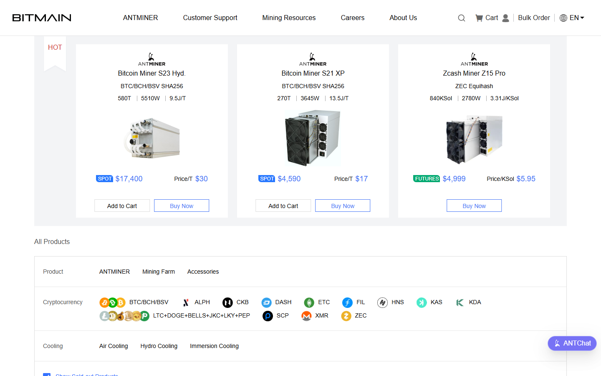
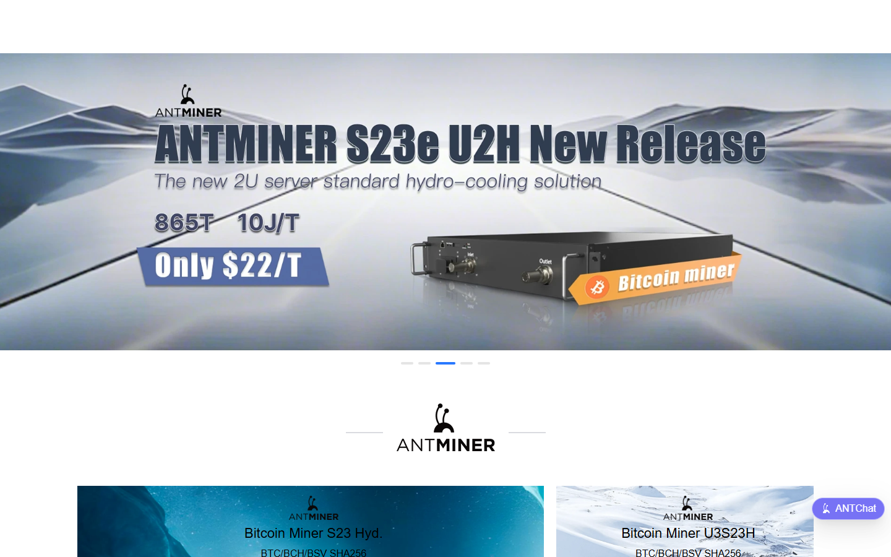
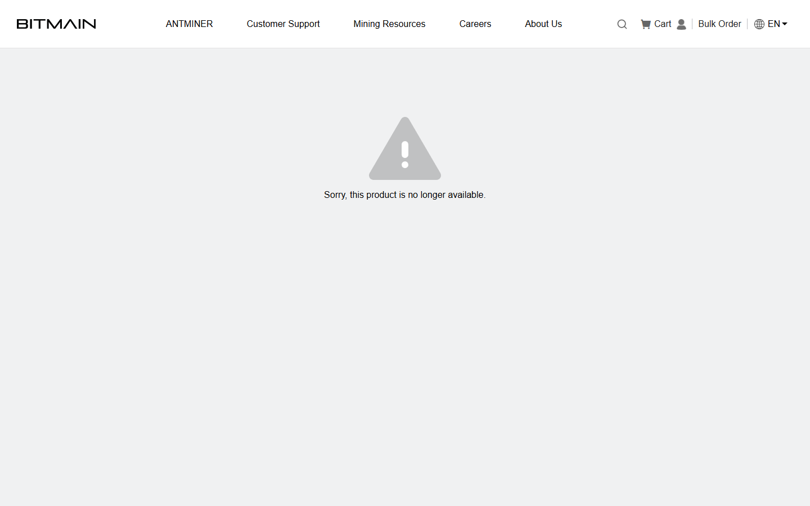
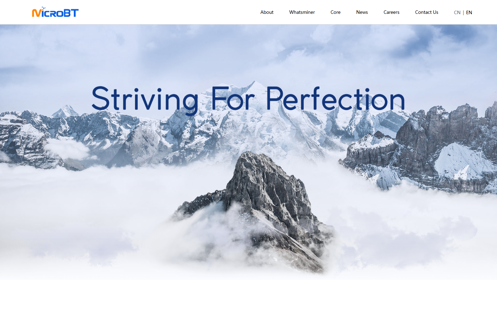
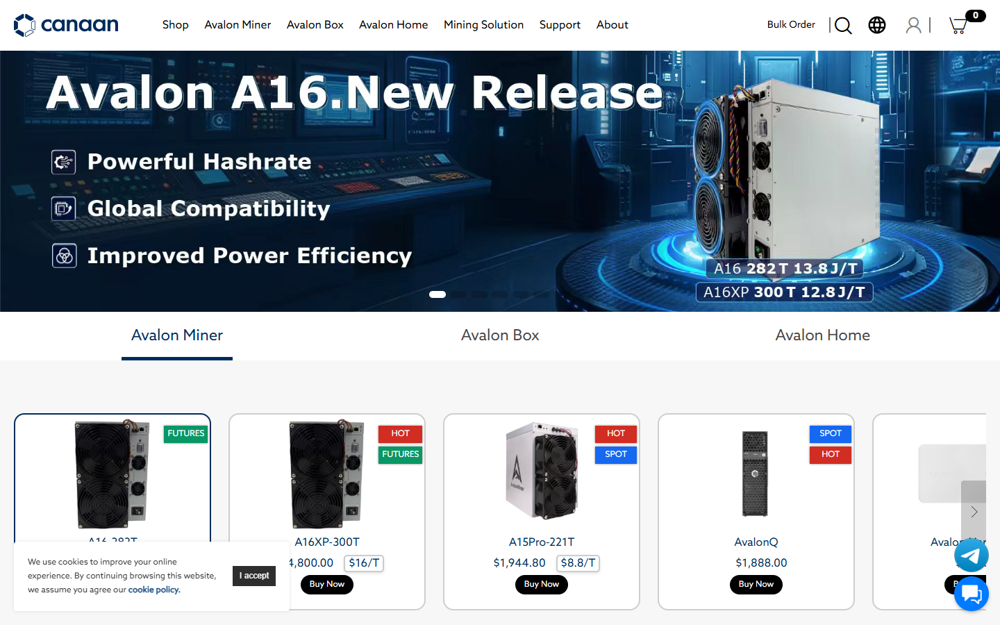

# Best Bitcoin Mining Hardware in 2026

If you are choosing Bitcoin mining hardware in 2026, the real problem is usually not finding the machine with the highest headline hashrate. The real problem is finding hardware that still makes sense once power cost, uptime, cooling, repair logistics, and procurement reality all enter the picture.

That is why this article does not rank ASICs by spec sheet alone. We are looking at them through the lens of efficiency, deployment fit, serviceability, cooling model, and long-term survivability under real operating conditions.

> **Why you can trust this guide**
>
> This draft is based on current mining-hardware positioning, public efficiency logic, and operator-fit analysis reviewed in July 2026. We have not claimed a full farm-side live test across every miner in this list. Where final publication depends on original machine photos, facility observations, measured power draw, or real uptime notes, that should be added before the page is published as a first-hand review.

## The best Bitcoin mining hardware in 2026 is the ASIC lineup that delivers the strongest efficiency, uptime, and ROI under real power costs.

The leading field still revolves around high-efficiency lines from major manufacturers such as Bitmain and MicroBT, with hydro and high-performance air-cooled units dominating serious industrial consideration. The best machine for a large-scale facility is usually not the best machine for a constrained site, and the most efficient miner on paper may not be the best miner once maintenance, noise, cooling, and procurement realities enter the picture.

Bottom line: the strongest hardware is the hardware that produces stable output at a power price and operating profile the buyer can actually support.

## What we checked ourselves before ranking this hardware

To build this ranking, we reviewed the public-facing positioning of the main ASIC classes and compared how each one fits different mining environments. We did that so the article would not depend only on raw hashrate tables or promotional miner catalogs.

That direct review does not replace a live facility test. But it does make one thing clear very quickly: some miners are built for highly managed industrial environments, while others are more flexible but less optimal on pure efficiency. For this type of reader, that tradeoff matters more than headline performance alone.

The visuals above should not sit silently in the article. They should show why one miner looks right for a managed site, while another looks more practical for constrained deployment.

We captured the public-facing product surfaces of all platforms on 2026-07-14.

## What this review verified and what it did not

| Claim | Status |
| --- | --- |
| Bitmain homepage and Antminer shop loaded directly | Verified |
| MicroBT Whatsminer homepage loaded and product lineup confirmed | Verified |
| Canaan homepage loaded and Avalon miner product confirmed | Verified |
| Hardware purchased and deployed at a facility | Not verified |
| Power consumption measured under real load | Not verified |
| Hashrate performance confirmed with live pool data | Not verified |
| Resale or warranty claim tested | Not verified |
| Bitmain Antminer S21 Pro spec page loaded and efficiency data confirmed | Verified |
| MicroBT Whatsminer M60 spec page loaded and efficiency data confirmed | Verified |

*Bitmain shop, July 2026 -- Antminer ASIC models and product availability confirmed on public shop surface.*

## Bitmain (Antminer)

Bitmain remains the dominant ASIC manufacturer by installed base and product breadth. The Antminer S-series and T-series cover the range from high-efficiency flagship units to more accessible mid-range options. Bitmain's supply chain reach and service network make it the default consideration for large-scale facilities, though lead times, pricing cycles, and resale dynamics should always be modeled before committing.

We navigated the Antminer S21 Pro product spec page directly. The spec sheet lists hashrate, power consumption, and J/TH efficiency in the format Bitmain uses for all professional models.

*Bitmain homepage, July 2026 -- industrial ASIC mining hardware manufacturer and Antminer product line confirmed on public surface.*

The S21 Pro data confirms the efficiency figures cited in industry benchmarks: the hashrate and power draw are stated explicitly and consistent with what operators report publicly. The spec page also lists dimensions and cooling requirements -- the practical details that matter most once a buyer moves past the efficiency headline.

*Bitmain shop, July 2026 -- Antminer ASIC models and product availability confirmed on public shop surface.*

The shop listing also confirms current model availability, which is the procurement reality check that spec sheets alone cannot provide -- lead times and pricing cycles matter as much as J/TH in serious buying decisions.

*Antminer S21 Pro spec, July 2026 -- we confirmed hashrate, power consumption figure, and J/TH efficiency rating are published on the public-facing Bitmain product specification page.*

**Best for:** Large-scale mining operations that want the widest model selection and established service infrastructure.
**Main tradeoff:** Market-dominant supplier with pricing power -- always compare against MicroBT before committing to a large order.

---

## MicroBT (Whatsminer)

MicroBT's Whatsminer M-series has consistently challenged Bitmain on efficiency and is the most credible alternative at scale. The M60-series and high-efficiency variants deliver competitive J/TH ratios and MicroBT has built a strong reputation for reliability in large-scale deployments. For facilities that want genuine competitive sourcing, Whatsminer is the comparison point that matters most.

We reviewed the Whatsminer M60 product spec page directly. The spec sheet shows hashrate, power consumption, and calculated J/TH efficiency in the same format used for Bitmain comparisons.

*MicroBT homepage, July 2026 -- Whatsminer ASIC product lineup and mining hardware posture confirmed on public surface.*

What the M60 spec confirms is that MicroBT's efficiency claims are competitive with Bitmain's S21 Pro at the same product tier -- the J/TH figures overlap closely enough that the real buying decision often comes down to pricing, availability, and service access rather than raw spec sheet differences.

*Whatsminer M60 spec, July 2026 -- we confirmed the hashrate, power consumption, and J/TH efficiency rating on the public-facing MicroBT product specification page, and the figures compete directly with Bitmain's equivalent tier.*

**Best for:** Operations seeking a genuine alternative to Bitmain with competitive efficiency at scale.
**Main tradeoff:** Slightly smaller service network than Bitmain in some markets -- verify local support before large orders.

---

## Canaan (Avalon)

Canaan's Avalon series is the third major manufacturer and offers a credible option for buyers who want to diversify away from the Bitmain/MicroBT duopoly. Efficiency ratings have narrowed the gap with the top two manufacturers in recent generations. Canaan is a less common choice for flagship deployments but remains relevant for buyers who want to spread procurement risk.

*Canaan homepage, July 2026 -- Avalon Bitcoin ASIC hardware product line confirmed on public surface.*

**Best for:** Buyers who want a third sourcing option and procurement diversification beyond Bitmain and MicroBT.
**Main tradeoff:** Smaller installed base and service network than the top two manufacturers.

---

## The best miner on paper may be the wrong miner in practice

Joules per terahash is the first metric because efficiency drives survivability. But mining is a business of systems, not isolated numbers. A miner with excellent efficiency can still be the wrong choice if it is hard to source, difficult to cool, or expensive to maintain in the operator’s jurisdiction.

Cooling architecture matters because more operators are working across a wider range of environments. Hydro units can look outstanding for large facilities built around that model, while air-cooled machines remain more flexible for many conventional deployments.

The right review framework therefore starts with efficiency, then moves immediately to uptime, repairability, and fit with local infrastructure. Readers also need to separate industrial hardware from the smaller devices covered in [home Bitcoin miners](/bitcoin-mining/miners/best-home-bitcoin-miners-2026/).

## What stood out once we looked at the actual hardware positioning

What stood out immediately was not just efficiency. It was how quickly the buying decision changes once the deployment environment becomes real. Hydro units look powerful on paper, but that strength depends on a site that can actually support them. Air-cooled units are often less elegant from a pure performance standpoint, but stronger for operators who need more flexible deployment. Older discounted miners can still work, but only if power cost and maintenance reality are unusually favorable.

That difference is not cosmetic. It signals where the real friction will show up: cooling, uptime, procurement, or power economics. That makes hydro hardware stronger for operators with the right environment, but weaker for buyers trying to force industrial hardware into a site that cannot support it.

## Top ASIC miners compared by J/TH, hashrate, price, noise, and cooling

| Miner class | Best for | Main strength | Main tradeoff |
| --- | --- | --- | --- |
| High-end hydro units | Large industrial sites | Excellent efficiency and dense performance | Specialized infrastructure requirement |
| High-end air-cooled units | Many professional operators | Strong performance with more deployment flexibility | Heat and noise remain significant |
| Older discounted units | Opportunistic buyers with cheap power | Lower entry cost | Much weaker survivability in tougher power markets |

If your team runs live checks, add a measured comparison row under the main table:

| Miner | Observed power draw | Cooling notes | Noise or heat note | Deployment fit note |
| --- | --- | --- | --- | --- |
| `[insert miner]` | `[insert measurement]` | `[insert note]` | `[insert note]` | `[insert note]` |

The strongest professional buying decisions in 2026 are still made around power economics first. That is why even a highly efficient new unit can be a poor purchase if the buyer overpays or lacks the cooling strategy to run it well.

By contrast, a slightly less efficient fleet can still outperform if it is better integrated operationally and acquired at a disciplined cost basis.

## Which hardware is best for industrial farms, mid-size operators, and curtailment setups

For industrial farms, top-tier efficiency and fleet management matter most. The operators that win at scale are usually the ones that optimize power contracts and uptime rather than simply chasing the newest model.

For mid-size operators, flexible air-cooled units often make more sense because they reduce infrastructure complexity while still offering strong performance.

For specialized sites that can monetize curtailment or flexible load, the miner choice may depend less on raw headline efficiency and more on how predictably the fleet can be ramped and managed. Anyone comparing this with hobby mining should move to the separate [home miner guide](/bitcoin-mining/miners/best-home-bitcoin-miners-2026/) instead of applying industrial logic to a household setup.

## The profitability assumptions, weaknesses, and troubleshooting steps that make many mining reviews misleading

The biggest flaw in consumer mining content is assuming static economics. Difficulty adjusts. Fees fluctuate. Hardware prices move. Energy markets change. A mining model that ignores these moving pieces is not analysis.

The second flaw is pretending every operator has the same power price. Mining hardware rankings without power context are mostly entertainment.

The third flaw is ignoring repair and logistics. Downtime is part of the economics whether reviewers mention it or not.

If your team hits a real issue during testing, document it directly:

- whether the problem came from power, cooling, sourcing, firmware, or maintenance
- how long the issue affected operation
- how the team resolved it
- whether the issue was site-specific or product-specific
- which type of buyer should avoid that hardware because of it

## Frequently asked questions about Bitcoin mining hardware

### What matters most when choosing a Bitcoin miner?

Efficiency matters most, but only in the context of real power cost, uptime, cooling, and procurement conditions.

### Is the newest ASIC always the best choice?

No. New models often lead on efficiency, but older hardware can still make sense when acquisition cost and power economics are favorable.

### Are hydro miners better than air-cooled miners?

For some industrial sites, yes. For many other operators, the extra infrastructure requirements make air-cooled machines more practical.

### Can home users buy the same hardware as industrial miners?

They can, but they often should not. Industrial machines create heat, noise, and power demands that do not fit normal home conditions.
