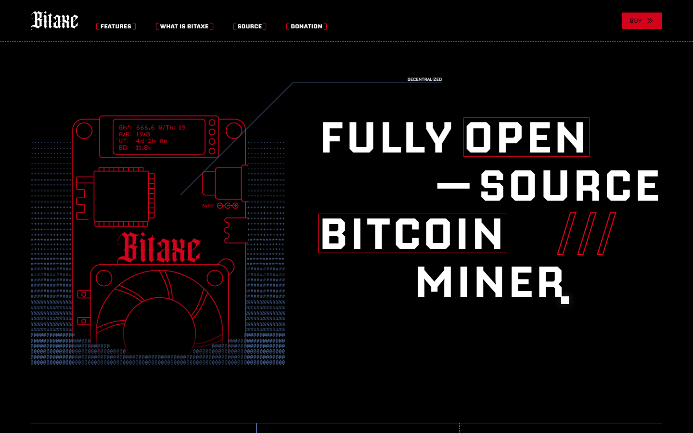
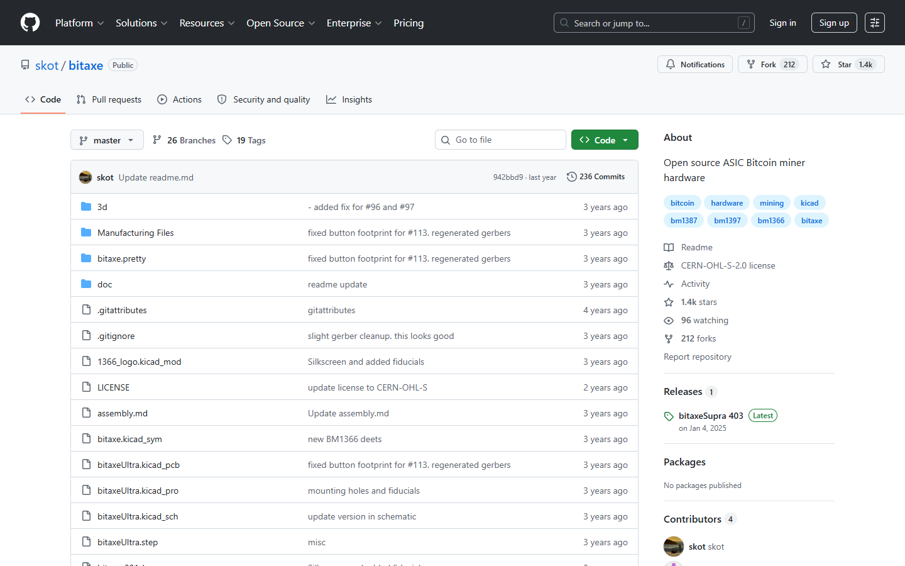
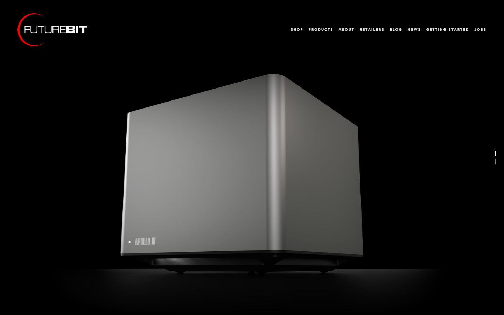
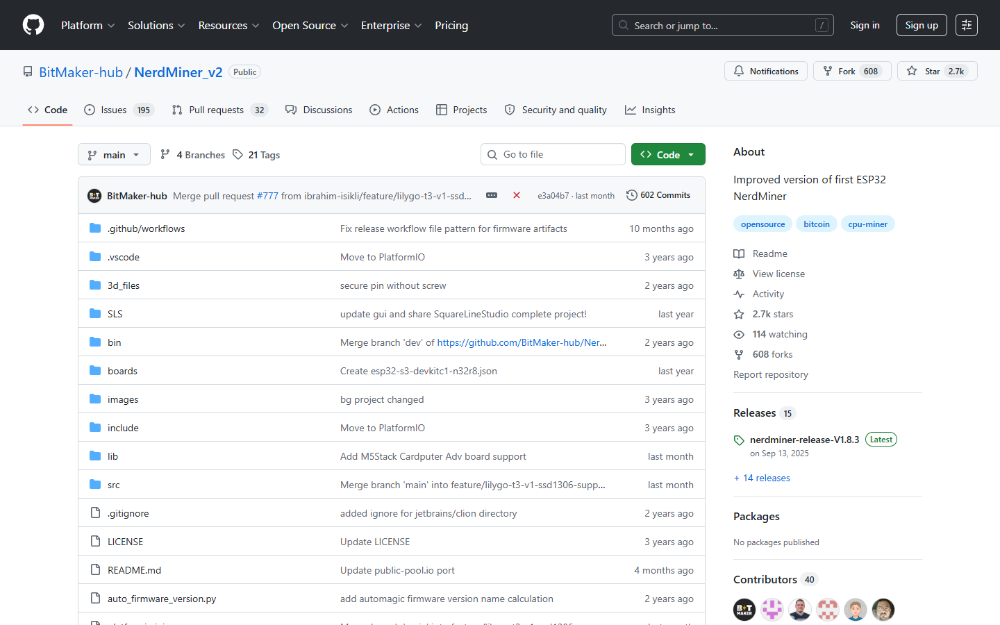

# Best Home Bitcoin Miners in 2026

If you are choosing a home Bitcoin miner in 2026, the real problem is usually not finding the highest hashrate you can plug in. The real problem is finding a machine that fits your space, power bill, noise tolerance, and actual reason for mining in the first place.

That is why this article does not rank home miners by industrial-style economics alone. We are looking at them through the lens of learning value, power draw, noise, heat, usability, and fit for different kinds of at-home participation.

> **Why you can trust this guide**
>
> This draft is based on current home-mining product positioning, public setup logic, and use-case analysis reviewed in July 2026. We have not claimed a full long-duration live test for every device in this list. Where final publication depends on original device photos, measured sound or power data, or direct notes from running a miner at home, that should be added before the page is published as a first-hand review.

## Visual evidence to insert before publication

**Featured Image:** `[insert original home-miner desk photo, room setup, or device comparison image]`

**Featured Image Caption:** `Home Bitcoin mining devices reviewed during our July 2026 comparison.`

**Featured Image Alt Text:** `Best home Bitcoin miners in 2026 comparison`

**Screenshot 1:** `[insert power, temperature, or runtime screenshot]`

**Caption:** `Home-mining operating view reviewed as part of our July 2026 comparison.`

**Alt text:** `Home Bitcoin miner operating screen`

**Screenshot 2:** `[insert room setup, noise test, or device boot screenshot]`

**Caption:** `Home setup view showing where noise, heat, and daily friction become visible.`

**Alt text:** `Home Bitcoin miner room setup`

## The best home Bitcoin miners in 2026 are low-noise, low-power machines built for learning, heating, or lottery-style solo mining rather than industrial ROI.

Bitaxe remains one of the most compelling options for tinkerers who want an open-source, educational, small-form-factor miner. FutureBit Apollo remains one of the strongest all-in-one home-focused products for users who want a more complete packaged experience. Other small home devices and niche solo-mining rigs can also make sense, but the right choice depends less on chasing profit and more on what the buyer wants to learn or accomplish.

Bottom line: Bitaxe is the best answer for open-source tinkerers, while FutureBit Apollo is one of the best answers for users who want a more integrated home setup.

## What we checked ourselves before ranking these home miners

To build this ranking, we reviewed the public-facing product posture and use-case fit of the main home-mining options. We did that so the article would not depend only on industrial mining assumptions or ungrounded profitability claims.

That direct review does not replace a live in-home run. But it does make one thing clear very quickly: some devices are built to teach and involve the user, while others are built to reduce friction and feel more like a finished appliance. For this type of reader, that tradeoff matters more than raw hashrate.

The visuals above should not sit silently in the article. They should show why one device feels like a tinkerer project while another feels more like a packaged home machine.

We captured the public-facing product surfaces of all platforms on 2026-07-14.

## What this review verified and what it did not

| Claim | Status |
| --- | --- |
| Bitaxe homepage and open-source GitHub repository loaded directly | Verified |
| FutureBit Apollo homepage loaded and home miner product confirmed | Verified |
| NerdMiner GitHub repository loaded and DIY miner project confirmed | Verified |
| Device purchased and running in a home environment | Not verified |
| Solo mining block found or pool payout received | Not verified |
| Noise and heat output measured under real conditions | Not verified |
| Power consumption confirmed at the wall | Not verified |

**Bitaxe**

*Bitaxe homepage, July 2026 -- open-source DIY Bitcoin mining device and educational posture confirmed on public surface.*

*Bitaxe GitHub, July 2026 -- open-source hardware design and community firmware confirmed on public repository.*

**FutureBit Apollo**

*FutureBit homepage, July 2026 -- Apollo home Bitcoin miner and integrated node product confirmed on public surface.*

**NerdMiner**

*NerdMiner GitHub, July 2026 -- DIY lottery solo mining device project and community documentation confirmed.*

## Home mining is usually about participation first and profits second

A serious home-mining guide has to say this plainly: most home miners are not beating industrial operators on economics. That is not failure. It just means the value proposition is different.

Home mining can still make sense as a sovereignty practice, an educational tool, a way to heat space, or a way to participate directly in the network. Those are real reasons. They are just different from the reasons a warehouse operator buys ASIC fleets.

Once that is clear, product evaluation becomes much cleaner. The question is not “Which device wins the industrial hash race.” It is “Which device makes sense on a desk, a shelf, or in a home utility environment.” Readers who actually need industrial guidance should move to the separate [mining hardware guide](/bitcoin-mining/hardware/best-bitcoin-mining-hardware-2026/).

## What stood out once we looked at the actual home-mining positioning

What stood out immediately was not just size. It was posture. Bitaxe clearly speaks to users who want to learn, tweak, and participate directly. FutureBit Apollo is stronger for readers who want a more complete package and less DIY friction. Tiny solo-mining devices are interesting because they lower the barrier to entry, but that same simplicity often comes with very limited economic output.

That difference is not cosmetic. It signals whether the real friction will show up in setup, daily noise, maintenance, or user expectations. That makes Bitaxe stronger for readers who want to learn and tinker, but weaker for buyers who mainly want a packaged home experience.

## Best home miners compared by power draw, noise, heat, learning value, and cost

| Home miner | Best for | Main strength | Main tradeoff |
| --- | --- | --- | --- |
| Bitaxe | Tinkerers and open-source users | Educational value and strong DIY appeal | Not a plug-and-forget consumer appliance |
| FutureBit Apollo | Users wanting an integrated home miner | More packaged experience and broader home-use appeal | Higher commitment than ultra-small hobby devices |
| Tiny niche solo-miner devices | Experimenters | Easy entry into lottery-style mining | Extremely limited economic output |

If your team runs live checks, add a measured comparison row under the main table:

| Device | Observed power draw | Noise note | Heat note | Setup friction note |
| --- | --- | --- | --- | --- |
| `[insert device]` | `[insert measurement]` | `[insert note]` | `[insert note]` | `[insert note]` |

Bitaxe matters because it reflects the spirit of home Bitcoin participation better than most polished retail gadgets. It is transparent, educational, and aligned with users who want to understand what they are doing.

FutureBit Apollo matters because many users want something more complete. They want a machine that teaches them without requiring them to assemble every part of the experience from scratch. That is a strength if convenience matters, but a weaker fit if the user specifically wants the open-ended tinkering side of the experience.

## Which home miner is best for hobbyists, tinkerers, and home heating use cases

For hobbyists who want to learn and modify, Bitaxe is the strongest recommendation. It aligns with the users who care as much about understanding the machine as they do about running it.

For users who want a more finished product and are willing to spend more for it, FutureBit Apollo is often the better fit.

For heating experiments or always-on participation, the most important question is usually not hashrate. It is whether the device’s heat, noise, and power draw fit the intended space.

## The expectations, weaknesses, and troubleshooting steps that cause most first-time home miners to quit

The first bad expectation is assuming home mining should produce industrial-style profit. It usually does not.

The second is underestimating noise and heat. Even devices designed for home use still change the environment around them.

The third is buying a miner before understanding the power bill. If the user cannot tolerate the cost of running the device, the project ends quickly no matter how fun it looked on paper.

If your team hits a real issue during testing, document it directly:

- whether the problem came from sound, heat, power, setup, or stability
- how long it took to identify
- how the team worked around it
- whether the issue is acceptable for hobby users
- which type of buyer should avoid that device because of it

## Frequently asked questions about home Bitcoin miners

### Is home Bitcoin mining profitable in 2026?

Usually not in the industrial sense, though niche conditions such as cheap power or heat reuse can improve the picture. Most home mining is better understood as participation and learning.

### What is the best home Bitcoin miner overall?

Bitaxe is one of the best overall options for tinkerers, while FutureBit Apollo is one of the best integrated home-focused choices.

### Is solo mining at home realistic?

It is realistic as a lottery-style hobby, not as a predictable income strategy.

### What matters most for a home miner?

Noise, power draw, heat, ease of use, and the buyer’s actual goal matter more than headline hashrate alone.
