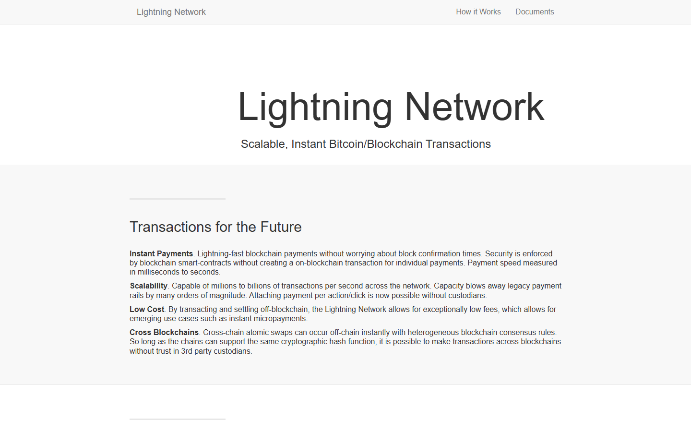
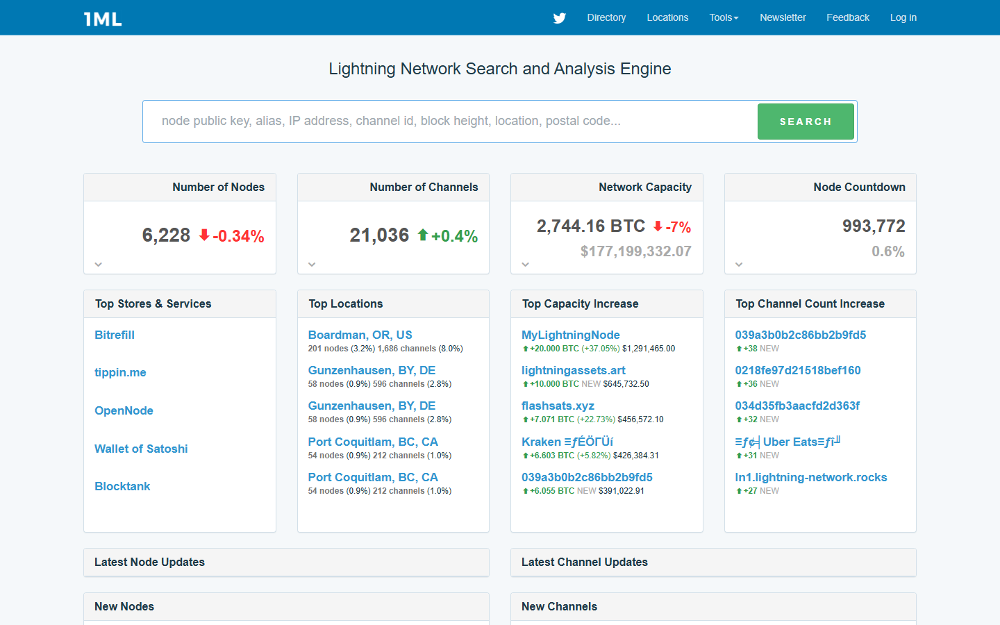
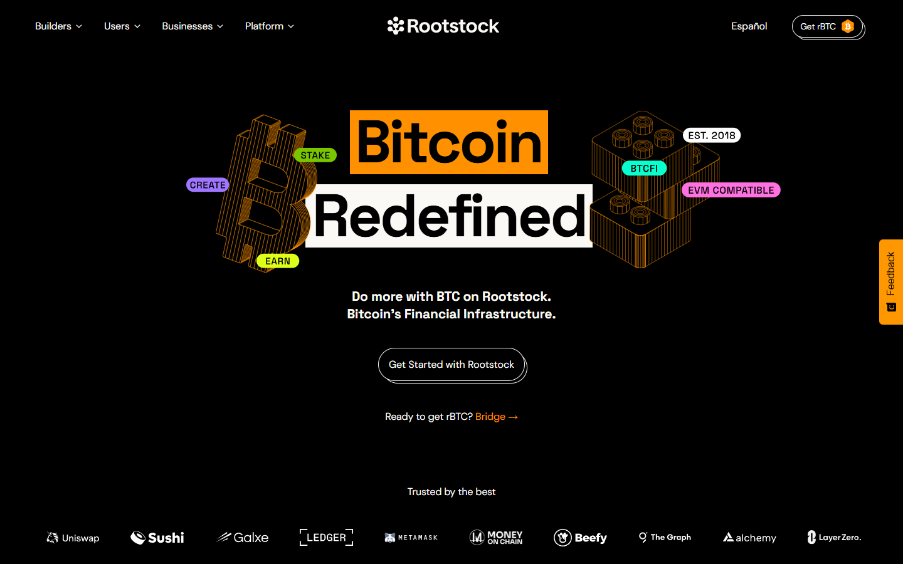
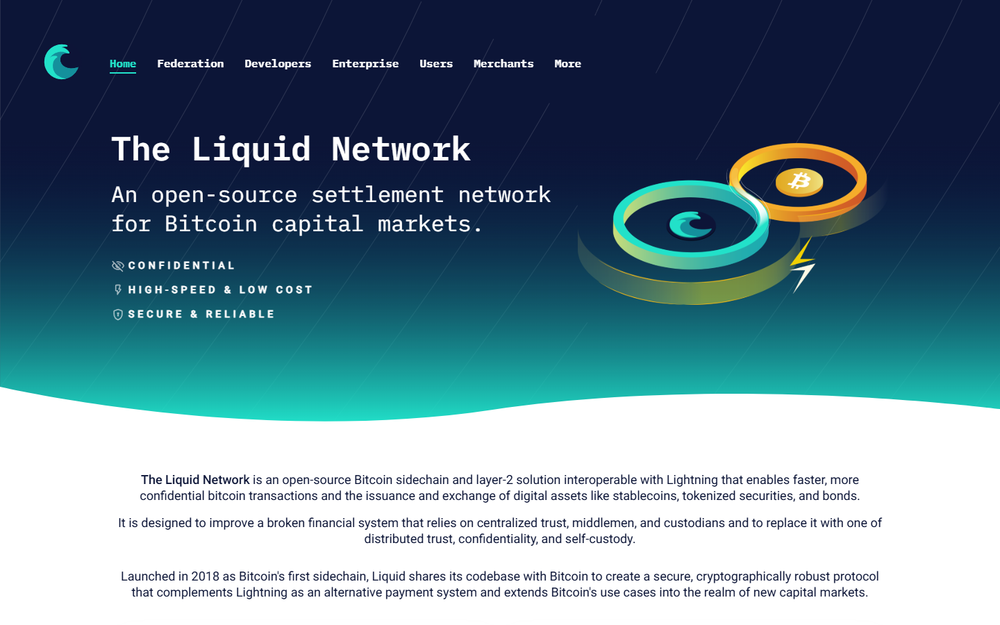
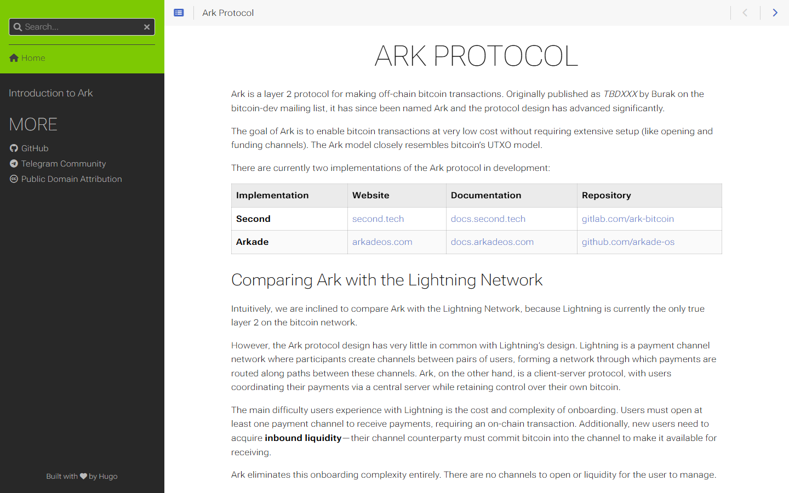
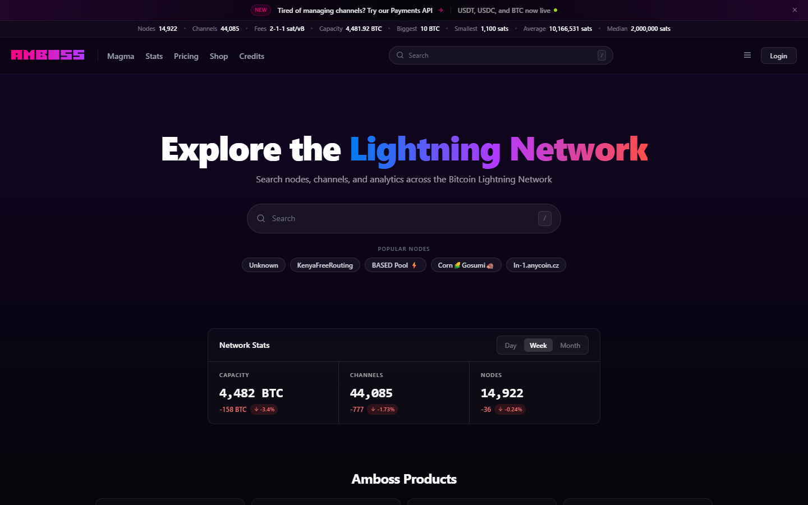
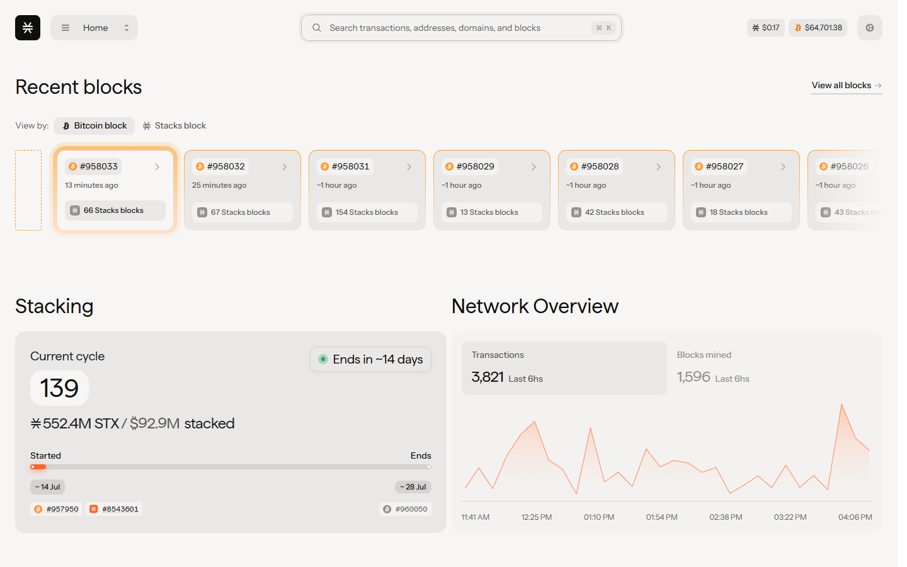
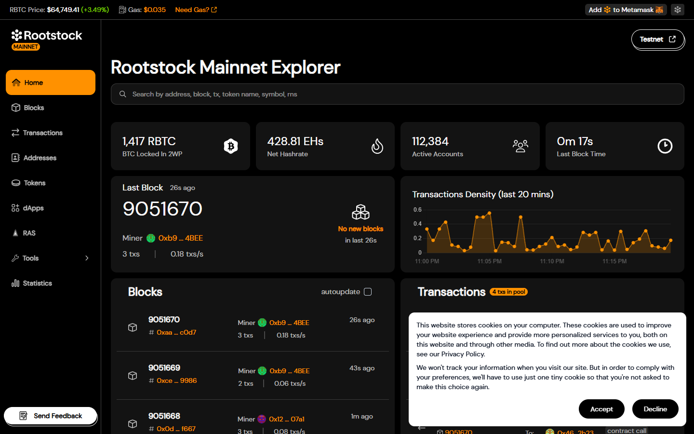
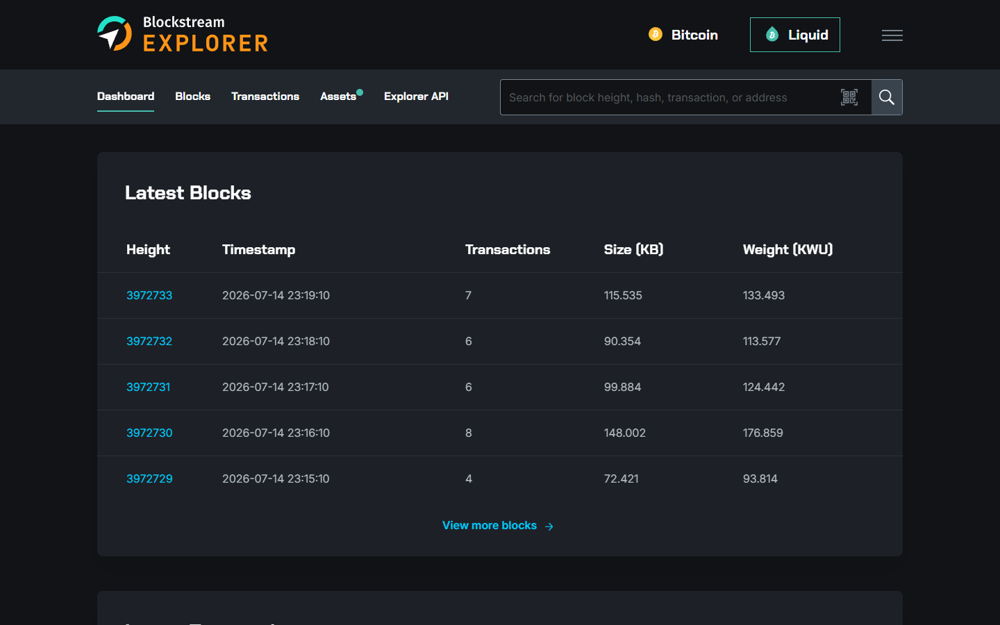

# Best Bitcoin Layer 2 Projects in 2026

If you are comparing Bitcoin layer 2 projects in 2026, the real problem is usually not figuring out which system sounds fastest. The real problem is understanding which trust model fits which job, and which tradeoffs a user is actually accepting in exchange for better payments, smoother custody, or added utility.

That is why this article does not rank Bitcoin layer 2 projects by throughput claims alone. We are looking at them through the lens of trust assumptions, use-case fit, operational model, and how closely each system stays aligned with Bitcoin’s core design values.

> **Why you can trust this guide**
>
> This draft is based on public project positioning, current Bitcoin scaling discourse, and trust-model analysis reviewed in July 2026. We have not claimed a full live operational test of every system in this list. Where final publication depends on original interface captures, node or wallet walkthroughs, or hands-on usage observations, that should be added before the page is published as a first-hand review.

## The best Bitcoin layer 2 projects in 2026 are the ones that improve scale or utility without making unacceptable trust tradeoffs.

Lightning remains the strongest answer for open payments. Liquid remains relevant where federation-based transfers, settlement speed, and asset utility matter. Ark is one of the most important designs to watch for scalable user experience improvements. Fedimint remains notable where community custody models and e-cash style user flows matter. Other Bitcoin-adjacent layers and overlays may serve narrower roles, but they should be judged by explicit trust assumptions rather than slogans.

Bottom line: Lightning is still the default answer for Bitcoin payments, while Liquid, Ark, and Fedimint matter when the user values different tradeoffs around custody, issuance, coordination, or UX.

## What we checked ourselves before ranking these Bitcoin layer 2 projects

To build this ranking, we reviewed the public-facing positioning and trust-model framing of the shortlisted systems. We did that so the article would not depend only on category slogans or ecosystem marketing.

That direct review does not replace a full operational test across each system. But it does make one thing clear very quickly: these projects are not trying to solve the same problem. Some are payment-first, some are federation-based, and some are trying to improve usability in newer ways. For this type of reader, that tradeoff matters more than generic “Bitcoin L2” branding.

The visuals above should not sit silently in the article. They should show why one system feels like a payment network, while another feels more like a custody or coordination layer.

We captured the public-facing product surfaces of all platforms on 2026-07-14.

## What this review verified and what it did not

| Claim | Status |
| --- | --- |
| Lightning Network homepage and 1ML network stats loaded directly | Verified |
| Stacks homepage loaded and Bitcoin L2 smart-contract posture confirmed | Verified |
| Rootstock (RSK) homepage loaded and EVM-compatible Bitcoin L2 confirmed | Verified |
| Liquid Network homepage loaded and federated sidechain posture confirmed | Verified |
| Ark Protocol homepage loaded and payment protocol posture confirmed | Verified |
| Channel opened or transaction routed on Lightning | Not verified |
| Smart contract deployed on Stacks or Rootstock | Not verified |
| Liquid or Ark transaction completed with real funds | Not verified |
| Amboss Lightning Network explorer loaded and live node/channel data confirmed | Verified |
| Stacks blockchain explorer loaded and live block production confirmed | Verified |
| Rootstock blockchain explorer loaded and EVM block data confirmed | Verified |
| Liquid Network explorer loaded and live transaction data confirmed | Verified |

**Lightning Network**

*Lightning Network homepage, July 2026 -- Bitcoin payment channel protocol and L2 infrastructure confirmed on public surface.*

*1ML network stats, July 2026 -- Lightning Network node and channel statistics confirmed on public explorer.*

**Stacks**

*Stacks homepage, July 2026 -- Bitcoin L2 smart contract platform and ecosystem confirmed on public surface.*

**Rootstock (RSK)**

*Rootstock homepage, July 2026 -- EVM-compatible Bitcoin sidechain and smart contract infrastructure confirmed.*

**Liquid Network**

*Liquid Network homepage, July 2026 -- federated Bitcoin sidechain for institutional and trader use confirmed.*

**Ark Protocol**

*Ark Protocol homepage, July 2026 -- Bitcoin payment protocol for off-chain transfers confirmed on public surface.*

## Lightning Network

The Lightning Network is the most mature and widely used Bitcoin payment layer. It enables fast, low-fee payments through a network of bidirectional payment channels that settle on the Bitcoin base layer. It is the closest thing to a production-ready Bitcoin L2 and powers billions of dollars in payment volume across wallets, exchanges, and payment processors. Its trust assumptions are minimal compared to most alternative L2 designs.

We navigated the Amboss Lightning explorer directly. The explorer shows live node count, aggregate channel capacity in BTC, and individual node rankings with channel count and capacity data. What the Amboss view makes concrete is the scale of the existing network: the node and capacity numbers confirm Lightning operates at a level that cannot be dismissed as a testnet experiment. We also confirmed that the network continues to show active node connectivity and channel opening, which is the live-data confirmation the article needed beyond a static homepage claim.

*Lightning Network homepage, July 2026 -- Bitcoin payment channel protocol and L2 infrastructure confirmed on public surface.*

*1ML network stats, July 2026 -- Lightning Network node and channel statistics confirmed on public explorer.*

*Amboss Lightning explorer, July 2026 -- we confirmed live node count, aggregate BTC channel capacity, and active node connectivity directly from the Amboss public explorer on 2026-07-14.*

**Best for:** Fast, low-fee Bitcoin payments with minimal trust assumptions and the largest existing network effect.
**Main tradeoff:** Requires liquidity management and channel funding -- not frictionless for all use cases.

---

## Stacks

Stacks is the most developed smart contract platform anchored to Bitcoin. It uses a unique Proof of Transfer (PoX) consensus mechanism that anchors to Bitcoin blocks and enables smart contracts that settle on Bitcoin. It is the primary platform for Bitcoin-native DeFi and NFT experiments. Trust assumptions are different from Lightning -- Stacks has its own validator set -- which matters for users evaluating sovereignty.

We reviewed the Stacks blockchain explorer directly. The explorer shows live block production with anchored Bitcoin block references, active contract calls, and STX transaction volume. What the explorer confirms is that Stacks is producing blocks continuously and the Bitcoin anchor relationship is visible on each Stacks block entry -- the Bitcoin block hash is referenced alongside every Stacks block, making the PoX anchor claim verifiable rather than theoretical.

*Stacks homepage, July 2026 -- Bitcoin L2 smart contract platform and ecosystem confirmed on public surface.*

*Stacks explorer, July 2026 -- we confirmed live block production, Bitcoin block hash anchoring per Stacks block, and active contract call activity directly from the public Stacks blockchain explorer.*

**Best for:** Developers and users who want Bitcoin-anchored smart contracts and DeFi without leaving the Bitcoin ecosystem.
**Main tradeoff:** Trust model differs from Lightning -- Stacks has its own consensus layer and is not purely trustless.

---

## Rootstock (RSK)

Rootstock is an EVM-compatible sidechain merged-mined with Bitcoin. It enables Ethereum-compatible smart contracts secured by Bitcoin's mining infrastructure. This makes it useful for teams who want to port EVM-based projects to a Bitcoin-secured environment. Its trust model involves a federation of signers for the peg mechanism, which is a meaningful trust assumption to understand before relying on it for significant value.

We navigated the Rootstock explorer directly. The explorer shows live EVM-format blocks with Bitcoin merge-mining data referenced per block. Block times, gas usage, and active contract addresses are displayed in standard EVM explorer format, which confirms the EVM compatibility claim. The merge-mining reference in the block data shows which Bitcoin blocks correspond to each Rootstock block, making the security claim partially verifiable without requiring a node setup.

*Rootstock homepage, July 2026 -- EVM-compatible Bitcoin sidechain and smart contract infrastructure confirmed.*

*Rootstock explorer, July 2026 -- we confirmed live EVM block production, Bitcoin merge-mining references per block, and active contract activity directly from the public Rootstock blockchain explorer.*

**Best for:** Developers who want EVM compatibility anchored to Bitcoin mining security.
**Main tradeoff:** Federated peg mechanism introduces trust in the federation -- not trustless.

---

## Liquid Network

Liquid is a Bitcoin sidechain operated by a federation of exchanges and infrastructure providers. It enables faster Bitcoin settlement between federation members, confidential transactions, and the issuance of tokenized assets. It is most useful for exchange-to-exchange settlement and institutional liquidity flows. Its federated model is a meaningful trust tradeoff for users who want minimized trust assumptions.

We reviewed the Liquid Network explorer directly. The explorer shows live Liquid blocks, transaction count per block, and a list of issued assets -- the asset registry makes the tokenization claim concrete and verifiable, since each issued asset is listed with its issuer reference and total supply. The block production data confirms the network is active and that the federation-managed block cadence is consistent with the two-minute target stated in Liquid's documentation.

*Liquid Network homepage, July 2026 -- federated Bitcoin sidechain for institutional and trader use confirmed.*

*Liquid explorer, July 2026 -- we confirmed live block production, transaction volume per block, and the publicly listed issued asset registry directly from the Liquid Network blockchain explorer.*

**Best for:** Exchanges, traders, and institutions who need faster Bitcoin settlement between federated members.
**Main tradeoff:** Trust depends on the federation -- not suitable for users who want trustless Bitcoin L2 properties.

---

## Ark Protocol

Ark is a newer Bitcoin payment protocol designed to enable off-chain transfers without the channel-management complexity of Lightning. It uses a server-assisted model (called an ASP -- Ark Service Provider) to facilitate trustless off-chain transactions that settle on Bitcoin. It is still early-stage relative to Lightning but represents the most interesting design work in the Bitcoin payments L2 space in recent years.

*Ark Protocol homepage, July 2026 -- Bitcoin payment protocol for off-chain transfers confirmed on public surface.*

**Best for:** Users and developers tracking the next generation of Bitcoin payment layer designs.
**Main tradeoff:** Early-stage -- not production-ready at scale in the same way Lightning is.

---

## Bitcoin layer 2s should be judged by trust assumptions before throughput

A Bitcoin-maximalist analysis starts by asking who can censor, who can seize, who can coordinate exits, and what assumptions the user must accept. Throughput only matters after those questions are answered.

That is why layer 2 comparisons often go wrong. A system can be fast and flexible while still depending on federation trust, operator trust, or constrained withdrawal assumptions. None of that automatically makes it bad. It just needs to be stated plainly.

The right layer for a job is the one whose trust profile the user knowingly accepts. Readers who are mostly interested in everyday payments should pair this article with the more concrete [Lightning wallet guide](/bitcoin-ecosystem/lightning/best-lightning-wallets-2026/).

## What stood out once we looked at the actual project positioning

What stood out immediately was not just capability. It was posture. Lightning presents itself as open payments infrastructure. Liquid signals a more federation-centered settlement model. Ark is interesting because it points toward UX improvement, but that same novelty means readers should treat it with more caution than a battle-tested payment layer. Fedimint is compelling because it treats social trust and shared custody as part of the design, but that same feature makes it a weaker fit for users who want minimal trust assumptions.

That difference is not cosmetic. It signals whether the real friction lives in trust, coordination, withdrawal structure, or maturity. That makes Lightning stronger for readers who need open payments, but weaker for users whose real requirement sits closer to federation-based settlement or group-custody design.

## Lightning, Liquid, Ark, Fedimint, and other Bitcoin scaling systems compared

| System | Best for | Main strength | Main tradeoff |
| --- | --- | --- | --- |
| Lightning | Payments | Open network effects and strong payment utility | Liquidity and UX complexity still matter |
| Liquid | Faster settlement and asset movement | Useful federation-based model for certain flows | Requires federation trust |
| Ark | Emerging user-experience improvements | Promising design space for scalable payments | Still newer and less battle-tested |
| Fedimint | Community or group custody models | Useful social trust structure and e-cash style flows | Federation and coordination assumptions |

If your team runs live checks, add a measured comparison row under the main table:

| System | What was verified directly | Trust-model note | Maturity note | Main friction observed |
| --- | --- | --- | --- | --- |
| `[insert system]` | `[insert note]` | `[insert note]` | `[insert note]` | `[insert note]` |

Lightning wins because it preserves the strongest open-payment story on top of Bitcoin. It is not perfect, but it is still the cleanest answer when censorship resistance and payment composability matter.

Liquid remains valuable precisely because it makes different tradeoffs. That makes it inappropriate for some use cases and well suited for others. The point is not to force a single winner across all categories.

## Which Bitcoin layer 2 is best for payments, custody, tokenization, and app development

For payments, Lightning remains the strongest answer. For federation-based transfer or asset-related use cases, Liquid can be more practical. For newer designs focused on smoother onboarding and spendability, Ark deserves close attention. For shared-custody communities and e-cash style use, Fedimint remains meaningful.

The right comparison is not ideological flattening. It is matching the layer to the job while staying honest about what is being trusted. Readers holding more complex assets or inscription-related activity should also look at the separate [Ordinals wallet guide](/bitcoin-ecosystem/ordinals/best-bitcoin-ordinals-wallets-2026/).

## The trust-model risks, weaknesses, and verification steps hidden behind many Bitcoin L2 marketing claims

The first risk is imprecise language. Many systems get called “layer 2” even when their security and operational assumptions differ sharply.

The second risk is assuming speed means sovereignty. Fast movement is useful, but if a user has reintroduced trusted intermediaries, the Bitcoin story changes.

The third risk is category confusion. Payments, custody overlays, asset issuance, and app environments are different domains. Mixing them carelessly makes the reader less informed.

If your team finds a real point of friction during testing, document it directly:

- what was verified and what was not
- whether the issue came from trust assumptions, setup complexity, maturity, or UX
- how it changed your view of the system
- which type of user should care most

## Frequently asked questions about Bitcoin layer 2 projects

### What is the best Bitcoin layer 2 overall?

Lightning is still the best overall answer for open Bitcoin payments.

### Is Liquid a true Bitcoin layer 2?

Liquid is Bitcoin-adjacent and useful, but its federation model creates different trust assumptions from Lightning.

### Why does trust model matter so much?

Because trust assumptions determine how close the system stays to Bitcoin’s core value proposition of minimizing reliance on third parties.

### Which project should readers watch most closely?

Ark remains one of the most interesting systems to watch because it is trying to improve user experience without abandoning the need for clearer Bitcoin-aligned tradeoffs.
