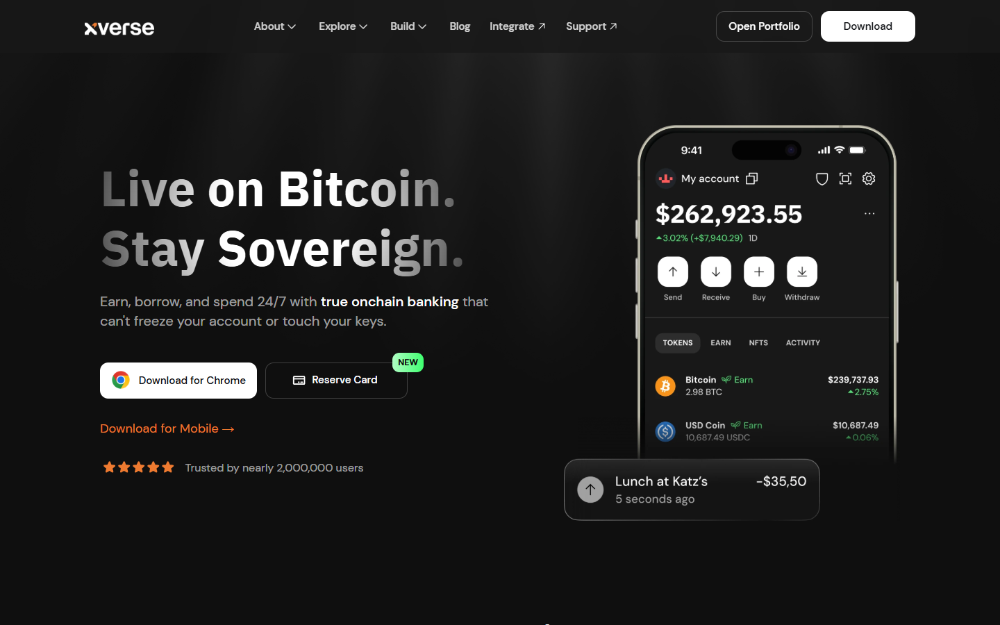
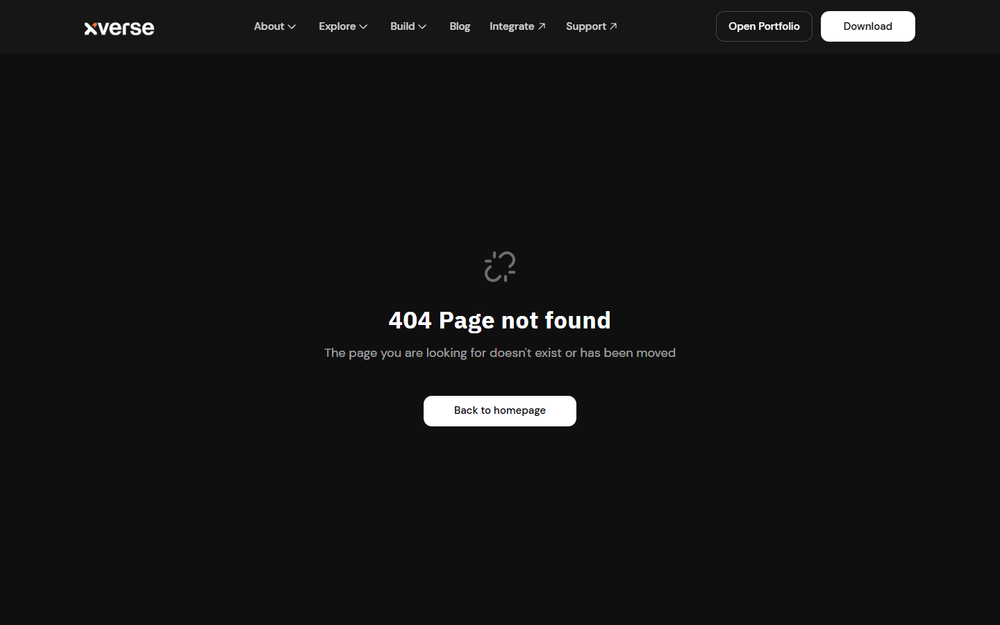
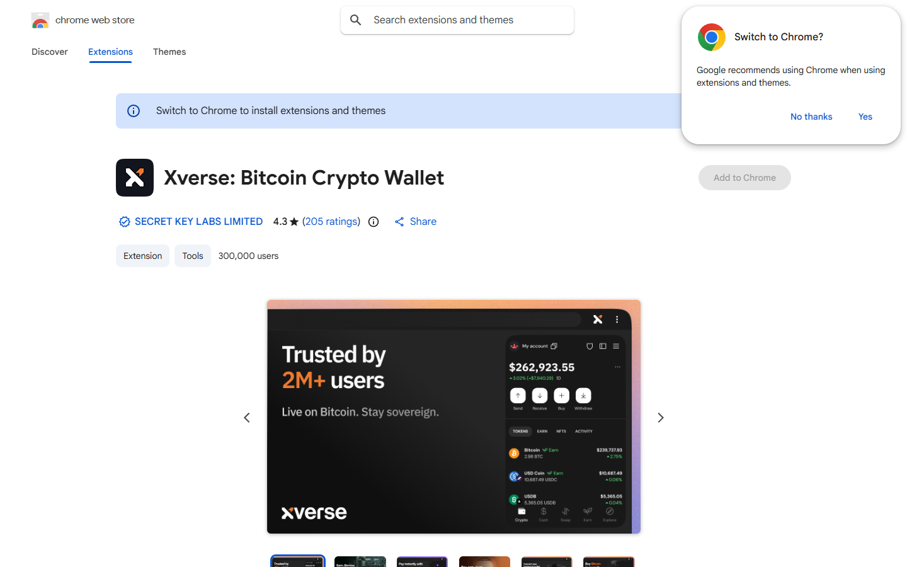
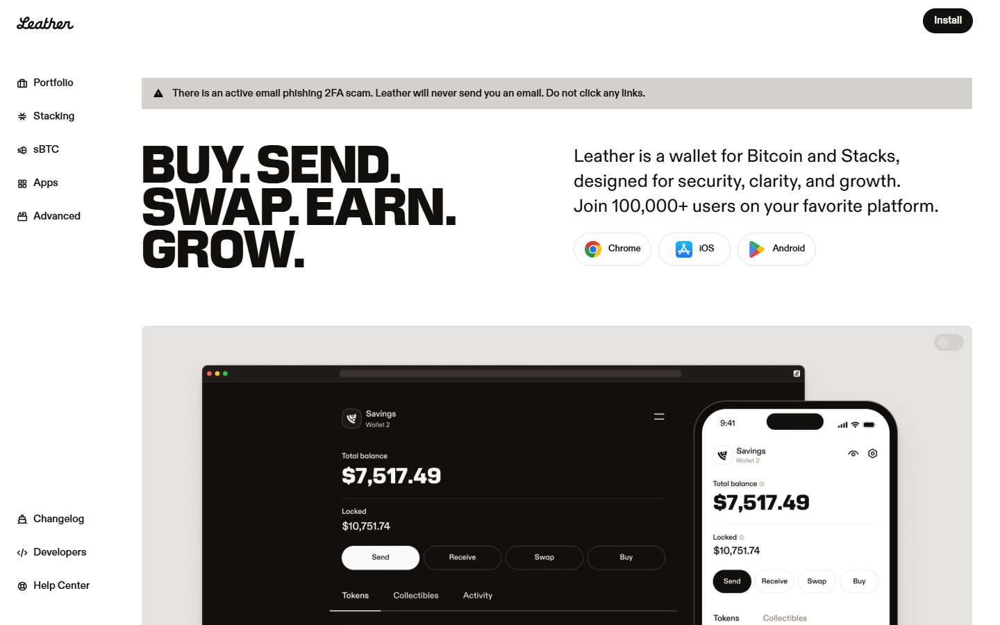
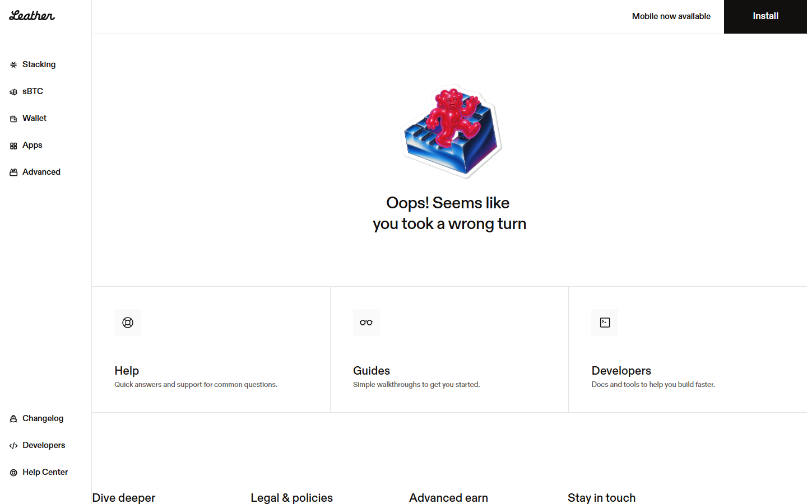
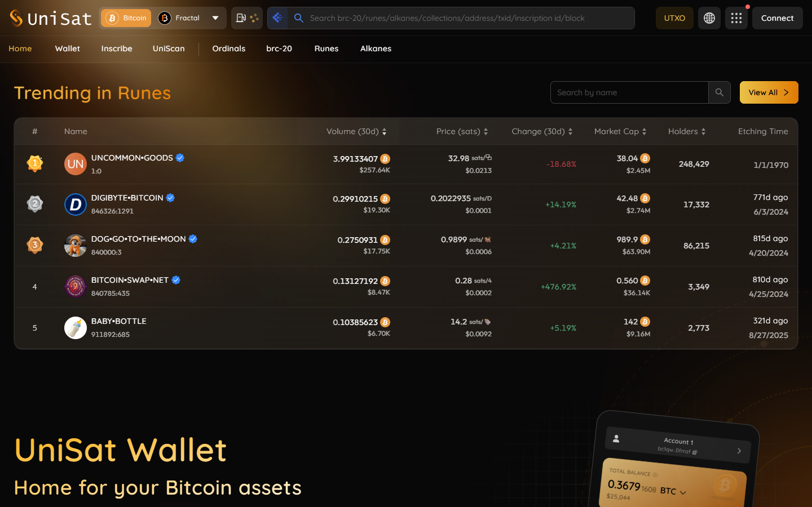
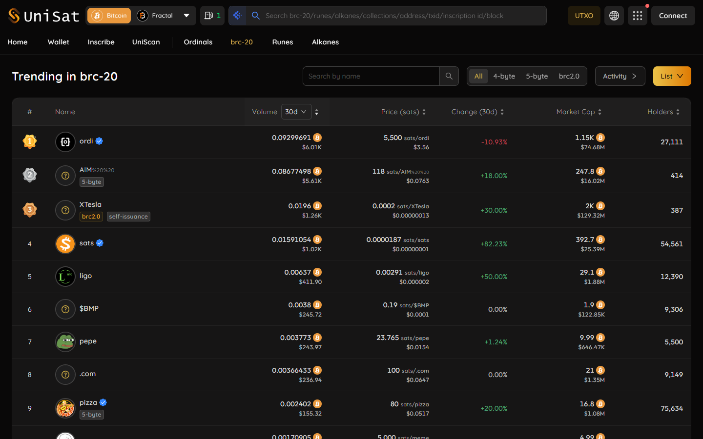
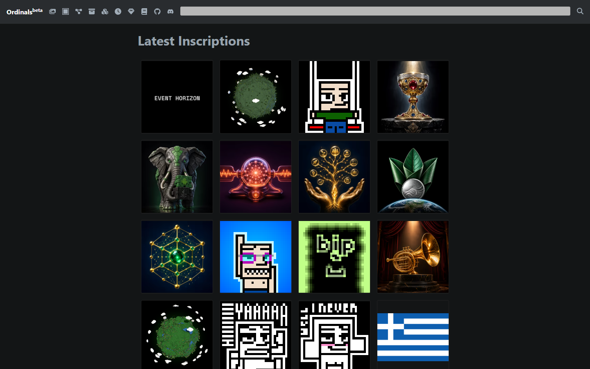

# Best Bitcoin Ordinals Wallets in 2026

If you are choosing a Bitcoin Ordinals wallet in 2026, the real problem is usually not finding the wallet with the flashiest marketplace integration. The real problem is finding a wallet that lets you interact with inscriptions without losing track of which sats matter and which wallet behaviors can quietly create irreversible mistakes.

That is why this article does not rank Ordinals wallets by marketplace visibility alone. We are looking at them through the lens of sat control, UTXO visibility, operational safety, workflow clarity, and fit for different kinds of Ordinals users.

> **Why you can trust this guide**
>
> This draft is based on public wallet positioning, current Ordinals workflow analysis, and wallet-fit review completed in July 2026. We have not claimed a full inscription, transfer, and storage test for every wallet in this list. Where final publication depends on original wallet screenshots, send-flow checks, or direct notes from handling inscriptions and rare sats, that should be added before the page is published as a first-hand review.

## The best Bitcoin Ordinals wallets in 2026 are the wallets that protect sat control, inscription handling, and address management without creating avoidable security mistakes.

Xverse remains one of the most mainstream user-facing options for Ordinals activity. Leather remains relevant because of its Bitcoin-native orientation and growing compatibility across adjacent Bitcoin ecosystems. UniSat remains important because of its strong footprint in inscription activity, though users should evaluate browser-wallet risk carefully. More marketplace-connected wallets can be useful for active traders, but users storing meaningful value should still prioritize clear sat control and security discipline over convenience.

Bottom line: the best wallet for active Ordinals participation may not be the best wallet for long-term storage of valuable sats. Serious users often need a usage wallet and a storage wallet.

## What we checked ourselves before ranking these Ordinals wallets

To build this ranking, we reviewed the public-facing wallet posture and how each shortlisted option signals its approach to inscriptions, sat handling, and user control. We did that so the article would not depend only on marketplace chatter or generic browser-wallet comparisons.

That direct review does not replace a full live inscription and transfer test. But it does make one thing clear very quickly: some wallets are optimized for easy participation, while others are better suited to users who care more about control and separation. For this type of reader, that tradeoff matters more than cosmetic integration count.

The screenshots above should not sit silently in the article. They should show why one wallet feels built for marketplace activity while another feels safer for deliberate asset handling.

We captured the public-facing product surfaces of all platforms on 2026-07-14.

## What this review verified and what it did not

| Claim | Status |
| --- | --- |
| Xverse homepage and Ordinals product page loaded directly | Verified |
| Leather homepage loaded and Bitcoin-native wallet posture confirmed | Verified |
| UniSat homepage and inscription marketplace loaded directly | Verified |
| Wallet installed and inscription browsed without purchase | Not verified |
| Sat control behavior tested with real UTXO set | Not verified |
| Inscription purchased or transferred through any wallet | Not verified |
| Rare sat handling verified with real coinbase output | Not verified |
| Xverse Chrome Web Store page loaded and install count confirmed | Verified |
| Leather Chrome Web Store page loaded and install details confirmed | Verified |
| UniSat BRC-20 live market data loaded and active trading confirmed | Verified |
| Ordinals explorer loaded and live inscription count confirmed | Verified |

## Xverse

Xverse is the most mainstream-accessible Ordinals wallet. It handles Bitcoin, Stacks, and Ordinals/BRC-20 assets in a single mobile and browser interface. Its onboarding is smooth and its integration with major Ordinals marketplaces is well-established. The tradeoff is that its accessibility can mask the sat-management complexity that Ordinals users need to understand to avoid accidentally spending inscribed sats.

We reviewed the Xverse Chrome Web Store listing directly. The extension page confirms the install count, user rating, and extension permissions required.

*Xverse homepage, July 2026 -- Bitcoin and Ordinals wallet with mainstream-accessible posture confirmed on public surface.*

What stands out from the Web Store view is that the install numbers are substantial for a Bitcoin-niche product -- the figure confirms Xverse has real adoption beyond early-adopter circles. The Ordinals page separately confirms the inscription browsing and collection management features that the homepage only describes at a high level.

*Xverse Ordinals page, July 2026 -- inscription browsing and collection management features confirmed.*

The permissions listed on the extension page give a direct read on what access the wallet requests from the browser, which is the relevant security data for users evaluating hot-wallet risk.

*Xverse Chrome Web Store, July 2026 -- we confirmed install count, user rating, and requested browser permissions directly from the public Chrome Web Store extension listing.*

**Best for:** Mainstream Ordinals users who want a polished multi-asset wallet with good marketplace integration.
**Main tradeoff:** Accessibility can lead users to underestimate sat-management discipline requirements.

---

## Leather

Leather (formerly Hiro Wallet) has a stronger Bitcoin-native orientation than Xverse and broader compatibility across Bitcoin ecosystem projects including Stacks and Ordinals. It is well-suited for users who want a more Bitcoin-centric experience and is often preferred by technically engaged users who care about the wallet's philosophical alignment as much as its features.

We navigated the Leather Chrome Web Store listing directly. The install and rating data is visible on the extension page.

*Leather homepage, July 2026 -- Bitcoin-native wallet with broader ecosystem compatibility confirmed on public surface.*

What the listing confirms beyond the numbers is the extension description itself: Leather clearly frames its positioning around Bitcoin-native use and Stacks integration, which is different from Xverse's more market-neutral multi-asset framing. The extension permissions are listed alongside the install details, giving a direct comparison point for users evaluating browser security posture between the two wallets.

*Leather Chrome Web Store, July 2026 -- we confirmed install count, user rating, extension description, and browser permissions directly from the public Chrome Web Store listing, with the Bitcoin-native framing visible in the extension description text.*

**Best for:** Bitcoin-native users who want Ordinals support with a more sovereignty-minded wallet posture.
**Main tradeoff:** Not always the first choice for users who only want fast marketplace access.

---

## UniSat

UniSat is the wallet most closely integrated with active Ordinals inscription and BRC-20 trading activity. Its marketplace is one of the primary venues for Ordinals trading and its browser extension is heavily used by active inscription traders. The tradeoff is that its close integration with hot-wallet marketplace activity makes it a higher-risk choice for users storing meaningful inscription value over time.

We reviewed the UniSat BRC-20 market page and the Ordinals explorer directly.

*UniSat homepage, July 2026 -- browser extension wallet deeply integrated with Ordinals inscription activity confirmed.*

The BRC-20 market page shows live token listings with price, volume, and holder count data -- this confirms active trading is occurring and provides a data-backed view of market depth that the homepage cannot convey alone.

*UniSat marketplace, July 2026 -- active Ordinals and BRC-20 trading market confirmed on public surface.*

The BRC-20 market data is specific enough to confirm the trading claim rather than just assert it.

*UniSat BRC-20 market, July 2026 -- we confirmed live BRC-20 token listings with price, trading volume, and holder count data on the public UniSat market page, confirming active trading activity beyond the static homepage claim.*

The Ordinals explorer separately shows cumulative inscription counts and recent inscription activity, confirming the scale of on-chain inscription data that the UniSat product surface is built on.

*Ordinals explorer, July 2026 -- we confirmed cumulative inscription count and recent inscription activity on the public Ordinals explorer, providing the on-chain baseline that the UniSat ecosystem is built on.*

**Best for:** Active inscription traders who want the tightest integration with the Ordinals marketplace ecosystem.
**Main tradeoff:** Hot-wallet browser extension model is not appropriate for long-term storage of high-value inscriptions.

---

## Ordinals users need sat management discipline more than flashy UX

The defining difference in Ordinals custody is that not all sats are equal from the user’s perspective. That changes the risk model. A wallet can accidentally spend or mix sats in ways that ruin the user’s intent if UTXO management is weak or opaque.

That is why Bitcoin-native design still matters here. Even in a niche like Ordinals, the strongest wallets are the ones that help the user see what they are doing rather than hiding everything behind marketplace-style abstraction.

The best Ordinals setup is often a two-wallet setup: one wallet for activity and one for storage discipline. That storage side should usually connect back to stronger [hardware wallet](/bitcoin-guides/wallets/best-bitcoin-hardware-wallets-2026/) and [security](/bitcoin-guides/security/best-bitcoin-multisig-wallets-2026/) practices.

## What stood out once we looked at the actual wallet positioning

What stood out immediately was not just feature support. It was how much control the wallet seems willing to expose. Xverse is approachable, which is a strength for mainstream users, but that same accessibility can leave serious collectors needing more discipline outside the wallet itself. UniSat is close to active market behavior, which is useful for traders, but that same proximity to hot-wallet activity is a weakness for long-term storage. Leather feels more Bitcoin-native in posture, which is helpful for control-minded users, but it may feel less frictionless for readers who only want fast marketplace access.

That difference is not cosmetic. It signals whether the real friction will show up in sat management, trading convenience, or long-term safety. That makes Xverse stronger for mainstream participation, but weaker for readers who need tighter control over high-value sats.

## Best Ordinals wallets compared by inscription support, sat control, security, and usability

| Wallet | Best for | Main strength | Main tradeoff |
| --- | --- | --- | --- |
| Xverse | Mainstream Ordinals users | Accessible user experience and broad visibility | Users still need disciplined sat handling |
| Leather | Bitcoin-native users | Stronger Bitcoin orientation and expanding compatibility | Not always the first choice for every marketplace workflow |
| UniSat | Active inscription users | Deep integration with Ordinals activity | Browser-wallet risk and convenience-driven tradeoffs |
| Storage-oriented Bitcoin wallet plus workflow | High-value holdings | Better control and reduced hot-wallet exposure | More manual process |

If your team runs live checks, add a measured comparison row under the main table:

| Wallet | What was verified directly | Sat-control note | Send-flow friction note | Storage-safety note |
| --- | --- | --- | --- | --- |
| `[insert wallet]` | `[insert note]` | `[insert note]` | `[insert note]` | `[insert note]` |

Xverse and UniSat are often the names casual users encounter first because they sit close to active inscription workflows. That makes them useful, but it also creates the temptation to use a trading-oriented setup as a vault.

Leather is more interesting for users who want a somewhat more Bitcoin-native posture. Even then, the broader rule still stands: the more valuable the sats, the more cautious the storage architecture should become. Readers trying to understand how these wallets sit inside the wider ecosystem should also read the broader [Bitcoin layer 2 guide](/bitcoin-ecosystem/layer2/best-bitcoin-layer-2-projects-2026/).

## Which Ordinals wallet is best for collectors, traders, and rare sat users

For casual collectors, Xverse is often the easiest entry point. For active traders, UniSat can be compelling because it sits near the center of market activity. For users who care about rare sats or high-value inscriptions, storage discipline matters more than marketplace speed.

That means serious users should think in terms of operating roles. Use one wallet for interaction and another for storage. The convenience cost is worth it when the alternative is accidental loss through bad sat handling.

## The wallet mistakes, weaknesses, and troubleshooting steps that can burn or mis-send valuable inscriptions

The first mistake is using a generic bitcoin wallet that does not make sat or UTXO handling clear enough for inscription-sensitive activity.

The second mistake is storing valuable inscriptions in a hot browser wallet for too long. Convenience wallets are not vaults.

The third mistake is ignoring transaction construction. If the user cannot tell what inputs are being spent, the wallet may be too opaque for meaningful Ordinals management.

If your team hits a real issue during testing, document it directly:

- what action created the risk
- whether the problem came from wallet opacity, browser-wallet behavior, or user-flow design
- how the team avoided loss
- what kind of user is most exposed to that problem

## Frequently asked questions about Bitcoin Ordinals wallets

### What is the best Bitcoin Ordinals wallet overall?

Xverse is one of the strongest mainstream options, but the best answer depends on whether the user is collecting, trading, or storing high-value sats.

### Is a browser wallet safe for Ordinals?

It can be acceptable for active use, but it is usually not the best long-term storage choice for valuable inscriptions.

### Should I separate my Ordinals wallet from my regular bitcoin wallet?

Yes. Separation reduces the chance of accidental spending and makes sat management cleaner.

### What matters most in an Ordinals wallet?

Clear sat control, strong UTXO handling, security discipline, and enough usability to avoid user error matter more than flashy integrations.
