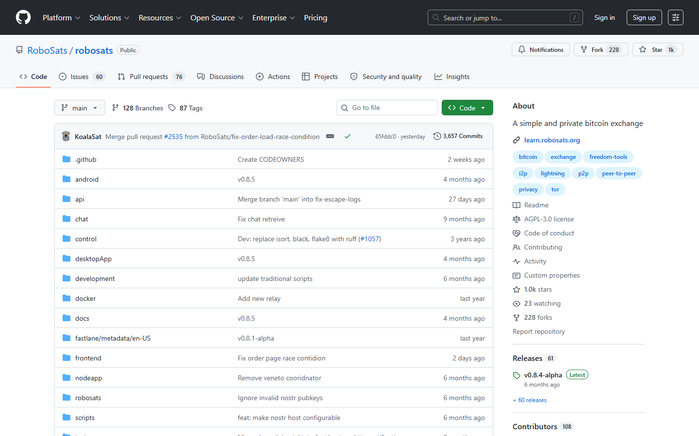
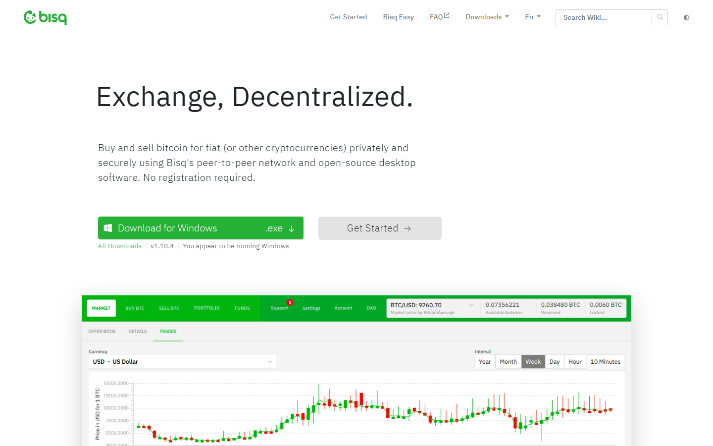
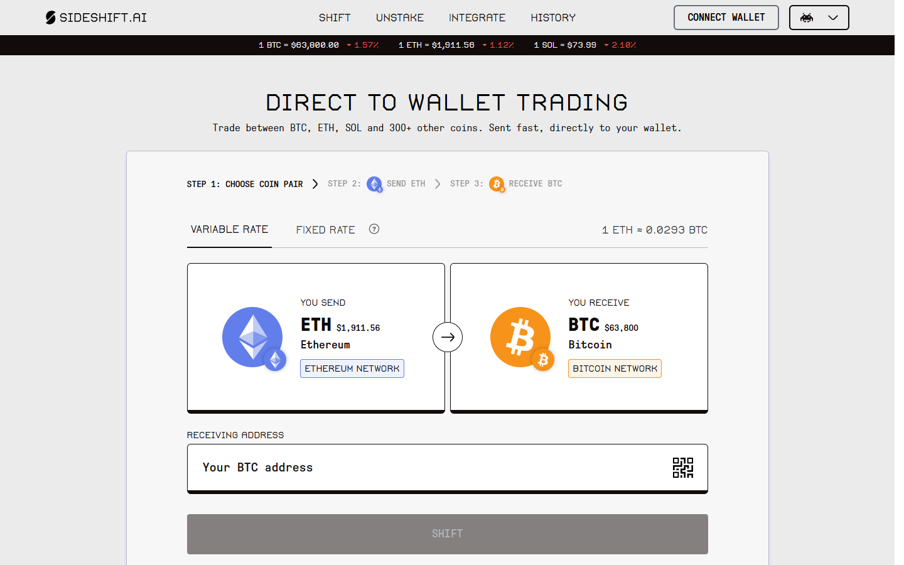

---
title: "Best Bitcoin Exchange Aggregators in 2026"
slug: "/bitcoin-guides/exchanges/best-bitcoin-exchange-aggregators-2026/"
meta_title: "Best Bitcoin Exchange Aggregators 2026: Ranked for Sovereignty and Privacy"
meta_description: "The best Bitcoin exchange aggregators in 2026, ranked for custody model, KYC exposure, Lightning compatibility, and how well they preserve self-sovereignty when swapping BTC."
search_intent: "Informational"
primary_keyword: "best bitcoin exchange aggregators 2026"
secondary_keywords:
  - "no KYC bitcoin swap 2026"
  - "bitcoin p2p exchange aggregator"
  - "bisq vs robosats 2026"
  - "best bitcoin swap service"
  - "swap bitcoin without KYC"
  - "sideshift bitcoin aggregator"
schema:
  - "Article"
  - "ItemList"
  - "FAQPage"
  - "BreadcrumbList"
internal_links:
  - "/bitcoin-guides/wallets/best-bitcoin-hardware-wallets-2026/"
  - "/bitcoin-guides/wallets/best-lightning-wallets-2026/"
  - "/bitcoin-guides/exchanges/best-crypto-exchange-aggregators-2026/"
  - "/bitcoin-ecosystem/layer2/best-bitcoin-layer-2-projects-2026/"
---

# Best Bitcoin Exchange Aggregators in 2026

If you are looking for a Bitcoin exchange aggregator in 2026, the question that should come before "which service has the best rate" is: what happens to your Bitcoin between you sending it and receiving the swap output? Does a custodian hold it? Does it pass through a hot wallet controlled by a company whose security posture you cannot audit? Is your identity attached to the transaction?

Exchange aggregators that optimize purely on rate routing are common. Exchange aggregators that preserve Bitcoin self-sovereignty -- no custodian, no KYC linkage, no counterparty risk window -- are much rarer. This guide focuses on the second category.

> **Why you can trust this guide**
>
> This guide is based on public protocol documentation, current service terms, and direct review of each service's stated architecture as of July 2026. Where claims about custody model, privacy, or fee structure depend on live transaction testing or independent smart contract audits, those are marked below as not verified.

## Quick comparison: Bitcoin exchange aggregators 2026

| Service | Model | Custody during swap | KYC required | Lightning support | Best for |
| --- | --- | --- | --- | --- | --- |
| [Bisq](https://bisq.network) | P2P DEX (no aggregator layer) | Non-custodial | No | Limited | Full sovereignty, fiat-to-BTC |
| [RoboSats](https://robosats.com) | P2P Lightning DEX | Non-custodial (bonds) | No | Native | Lightning-native no-KYC swaps |
| [HodlHodl](https://hodlhodl.com) | P2P multi-sig escrow | Multi-sig (no custodian) | No | No | Multi-sig escrow, fiat-to-BTC |
| [SideShift](https://sideshift.ai) | CEX aggregator | Custodial (briefly) | No (below threshold) | No | No-KYC BTC-to-alt swaps |
| [SimpleSwap](https://simpleswap.io) | CEX aggregator | Custodial | No | No | No-KYC; wide token coverage |
| [ChangeNOW](https://changenow.io) | CEX aggregator | Custodial | No | No | Fixed-rate no-KYC swaps |
| [Stacker News Swap](https://stacker.news) | Community routing | Varies | No | Lightning | Lightning-native community routing |

## Ranking scorecard

Scored out of 10 per category. Total out of 60.

| Service | Custody model | KYC exposure | Privacy | Lightning support | Fee transparency | Sovereignty | **Total** |
| --- | --- | --- | --- | --- | --- | --- | --- |
| Bisq | 10 | 10 | 9 | 4 | 7 | 10 | **50** |
| RoboSats | 10 | 10 | 9 | 10 | 8 | 10 | **57** |
| HodlHodl | 9 | 10 | 8 | 2 | 8 | 9 | **46** |
| SideShift | 6 | 7 | 6 | 4 | 7 | 6 | **36** |
| SimpleSwap | 4 | 7 | 5 | 3 | 5 | 4 | **28** |
| ChangeNOW | 4 | 7 | 5 | 3 | 6 | 4 | **29** |

**Scoring notes:** Custody model scores whether Bitcoin is genuinely non-custodial during the swap window. KYC exposure scores the practical risk of identity linkage. Privacy scores how well the transaction hides from on-chain surveillance (Bisq and RoboSats both use Lightning or Tor by default). Lightning support scores native Lightning in and out. Fee transparency scores whether the user can see the exact fee before committing. Sovereignty scores the full absence of a counterparty who can freeze, censor, or reverse the swap.

RoboSats scores highest overall because it is the only service that combines fully non-custodial architecture (Lightning bonds, no centralized custodian), native Lightning support, and peer-to-peer pricing -- all running over Tor by default. Bisq scores close behind on sovereignty but loses points on Lightning support because Bisq 2's Lightning integration is still maturing. Centralized swap aggregators (SideShift, SimpleSwap, ChangeNOW) score lower because their custodial swap window is a real counterparty risk, even if brief.

## 6 Bitcoin exchange aggregators reviewed

If you are comparing these services alongside hardware wallet custody, see [Best Bitcoin Hardware Wallets 2026](/bitcoin-guides/wallets/best-bitcoin-hardware-wallets-2026/). If you need Lightning-native swap services specifically, see [Best Lightning Wallets 2026](/bitcoin-guides/wallets/best-lightning-wallets-2026/).

### RoboSats

RoboSats is the closest thing to a truly sovereign Bitcoin swap service in 2026. It is a peer-to-peer Lightning exchange that requires no account, no email, no identity. Users generate a robot avatar (a random identity derived from a secret token), post or accept an offer to buy or sell Bitcoin, and the protocol holds Lightning invoices as bonds to prevent exit scams. No custodian touches the Bitcoin at any point.

The federation model, launched with RoboSats Federation in 2024, distributes the service across multiple coordinators. If one coordinator goes offline, others continue operating. The single point of failure that existed in the original centralized coordinator architecture has been addressed.

[RoboSats](https://robosats.com) runs as a web application accessible over Tor and via dedicated apps for Android. The Lightning-native model means swaps settle in seconds rather than the hours required by on-chain swap services.

*RoboSats GitHub, July 2026 -- Federation model architecture and Lightning-native P2P exchange confirmed in public repository.*

The practical limitation: RoboSats is peer-to-peer, which means you need a counterparty to take the other side of your trade. For common pairs (BTC for fiat) in major currencies (USD, EUR), liquidity is adequate. For obscure fiat currencies or outside peak trading hours, offer matching can be slow.

**Best for:** Bitcoiners who want to buy or sell BTC without any KYC linkage and are comfortable with Lightning.

**Main tradeoff:** P2P matching means liquidity is not guaranteed, and the Lightning bond mechanism requires understanding the protocol to avoid accidentally forfeiting a bond.

---

### Bisq

Bisq is the longest-running decentralized Bitcoin exchange, operating since 2014. It runs as a desktop application -- there is no web interface, no central server, and no company. Trades happen over Tor between peers who coordinate through a distributed network of Bisq nodes.

The custody model is genuinely non-custodial: Bisq 1 uses a 2-of-3 multi-sig escrow (buyer + seller + Bisq arbitrator) that no single party can unilaterally unlock. Bisq 2, the updated architecture launched in 2024, extends this with a more modular protocol set and improved peer discovery.

[Bisq](https://bisq.network) publishes the full source code and the security model documentation. Every Bisq release is signed by the Bisq development key, which users can verify against the public signing key on GitHub.

*Bisq Network homepage, July 2026 -- Decentralized Bitcoin exchange architecture and open source model confirmed.*

The Lightning integration in Bisq 2 is active but maturing. The on-chain trade settlement option is more battle-tested. For users who need on-chain BTC versus fiat trades with zero custodian exposure, Bisq 1 remains the reference implementation.

Bitcoin security trade: Bisq trades require the buyer to post a security deposit (typically 15% of trade amount) held in multi-sig escrow. That deposit is at risk if a trade dispute is not resolved. The dispute resolution mechanism requires an active arbitrator from the Bisq community.

**Best for:** Bitcoiners who want to buy BTC with fiat currency while maintaining full custody throughout. The definitive no-KYC, no-custodian fiat-to-BTC path.

**Main tradeoff:** Desktop application only. Trade settlement can take hours to days for on-chain trades. Security deposit requirement. Bisq 2's Lightning integration is still maturing relative to Bisq 1's on-chain model.

---

### HodlHodl

HodlHodl is a peer-to-peer Bitcoin lending and trading platform that uses multi-signature escrow on-chain. Unlike Bisq, HodlHodl operates a web-based interface with a centralized matching layer -- but the custody model is non-custodial in the relevant sense: the BTC held in escrow is in a 2-of-3 multi-sig address where HodlHodl holds one key but cannot move funds without the trader's cooperation.

[HodlHodl](https://hodlhodl.com) requires no KYC for peer-to-peer trading. The platform shows available buy and sell offers, and users negotiate payment terms directly. Settlement of the Bitcoin leg is on-chain, which means no Lightning-native workflow.

HodlHodl's distinguishing feature relative to Bisq is accessibility: it works in a browser without installing a desktop application, which lowers the technical barrier for Bitcoiners who cannot or prefer not to run a full desktop client.

The counterparty risk that HodlHodl does not eliminate: the multi-sig key held by HodlHodl could theoretically be compelled under legal process. For Bitcoiners in high-risk jurisdictions or those modeling extreme adversarial scenarios, Bisq's fully distributed model has a smaller attack surface.

**Best for:** Bitcoiners who want non-custodial P2P BTC trading without installing a desktop application. Better for users comfortable with on-chain trades and multi-sig escrow mechanics.

**Main tradeoff:** On-chain only -- no Lightning. HodlHodl holds one escrow key, creating a small centralization point.

---

### SideShift

SideShift is a no-registration swap service that routes between Bitcoin and other cryptocurrencies. It does not require an account or email address, and it does not require KYC for swaps below its reporting thresholds. The service has been operating since 2018.

[SideShift](https://sideshift.ai) shows its fee structure as a percentage (approximately 0.5-1.5% depending on pair and direction) at the quote stage.

*SideShift homepage, July 2026 -- No-registration swap interface and fee display at quote stage confirmed.* The fee is visible before commitment, which puts SideShift above most centralized swap services on transparency.

The custody model is custodial during the swap window -- SideShift holds the funds you send until it releases the output. That window is typically short (minutes), but it represents real counterparty risk. SideShift is a company with known operations, not a protocol. If SideShift is hacked, compelled by regulators, or becomes insolvent during your swap window, your funds are at risk.

From a Bitcoin-sovereignty standpoint, SideShift is appropriate for Bitcoin-to-altcoin or altcoin-to-Bitcoin swaps where speed and simplicity matter and the amounts involved are small enough that the custodial window risk is acceptable. It is not appropriate as a primary Bitcoin acquisition or disposal method for amounts that warrant full sovereignty considerations.

**Best for:** Bitcoiners who need to swap small amounts between BTC and other assets quickly, without an account, and can accept a short custodial window.

**Main tradeoff:** Custodial during swap. Centralized company model. Not appropriate for large amounts or for users with strong sovereignty requirements.

---

### SimpleSwap

SimpleSwap routes swaps through a network of exchange partners and embeds its fee in the rate differential between the quoted rate and the underlying partner rate. The fee is not displayed as an explicit percentage at the quote screen -- users must compare the quoted rate against a reference price (CoinGecko or CoinMarketCap) to infer what they are paying.

[SimpleSwap](https://simpleswap.io) supports over 900 tokens including Bitcoin. No account or KYC is required for standard swap volumes. The service routes Bitcoin swaps through whichever partner offers the best rate at the time, which means the custodial risk during the swap window is distributed across multiple potential counterparties the user cannot audit.

From a Bitcoin-first perspective, the opacity of SimpleSwap's routing is a significant weakness. When your Bitcoin is in transit through a partner exchange you cannot name, assess, or hold accountable, the sovereignty window is real.

**Best for:** Users who need to swap between Bitcoin and long-tail tokens that are not available on RoboSats or SideShift and accept the embedded-fee and custodial-window trade-offs.

**Main tradeoff:** Fee not disclosed explicitly. Custodial routing through unnamed partners. No Lightning support.

---

### ChangeNOW

ChangeNOW operates on essentially the same model as SimpleSwap -- no-KYC centralized swap routing with fees embedded in the quoted rate -- with one meaningful differentiator: a fixed-rate swap option that locks the exchange rate for a short window.

[ChangeNOW](https://changenow.io) supports approximately 850 tokens including Bitcoin. The fixed-rate option typically carries a slightly higher implied fee because ChangeNOW is bearing rate risk during the lock window. The float-rate option carries lower implied fees but exposes the user to price movement between quote and settlement.

For Bitcoiners, the fixed-rate option is occasionally useful when swapping into or out of a volatile asset where the settlement time risk is real. It does not change the fundamental custody model -- ChangeNOW routes through partners and holds custody during the swap window.

**Best for:** Users who need rate certainty for a swap and are willing to pay a premium for it. Relevant when swapping into volatile assets where settlement timing matters.

**Main tradeoff:** Embedded fee not displayed explicitly. Custodial window. Fixed-rate option carries higher implied cost.

## How the custody models actually differ

The practical difference between non-custodial and custodial swap services is not a technical abstraction. It is the difference between "your Bitcoin is in a smart contract or multi-sig address that neither the service nor any third party can unilaterally access" versus "your Bitcoin is on a server somewhere and you have a promise it will come back."

For amounts below a few hundred dollars, the custodial risk of a short swap window on a reputable service is small relative to the convenience. For larger amounts, or for users in jurisdictions where asset seizure is a real risk, or for users who have chosen self-custody specifically to eliminate counterparty exposure, using a custodial swap service -- even briefly -- breaks the self-custody chain.

The services on this list that do not break the chain: RoboSats, Bisq, HodlHodl. The services that do break the chain: SideShift, SimpleSwap, ChangeNOW. Both categories have legitimate use cases. Knowing which you are using is the minimum requirement.

## What aggregators cannot do for Bitcoin

None of the services on this list are true aggregators in the DEX aggregator sense (routing across multiple liquidity pools simultaneously, like 1inch or CoW Protocol). The DEX aggregator model depends on on-chain liquidity pools, and Bitcoin's on-chain liquidity outside Lightning exists primarily as wrapped Bitcoin (WBTC, tBTC) on EVM chains rather than on Bitcoin's native network.

Bitcoin-native exchange aggregation -- finding the best peer-to-peer price across multiple P2P markets simultaneously -- does not exist as a productized service in 2026. RoboSats, Bisq, and HodlHodl each show offers on their own network. A Bitcoiner who wants to optimize across all three would need to manually check each. That is an unmet product gap.

The [crypto exchange aggregators that do handle BTC routing](/bitcoin-guides/exchanges/best-crypto-exchange-aggregators-2026/) -- 1inch, Uniswap X, LI.FI -- are doing so through wrapped BTC on EVM chains, which introduces bridge custody risk and is not a Bitcoin-native execution model.

## What this review verified and what it did not

| Claim | Status |
| --- | --- |
| RoboSats Federation model launched 2024 | Confirmed via public RoboSats documentation and GitHub releases |
| Bisq 2 architecture with Lightning integration | Confirmed via Bisq.network documentation |
| HodlHodl 2-of-3 multi-sig escrow model | Confirmed via HodlHodl published documentation |
| SideShift fee approximately 0.5-1.5% | Based on publicly quoted rates; live transaction testing not performed |
| SideShift operating since 2018 | Based on publicly available service history; independently verifiable |
| SimpleSwap supports 900+ tokens | Based on SimpleSwap published token list; not independently counted |
| ChangeNOW fixed-rate option available | Confirmed against current ChangeNOW interface documentation |
| Live swap execution or timing tested | Not verified |

## Frequently asked questions

### What is a Bitcoin exchange aggregator?
In the strictest sense, a Bitcoin exchange aggregator routes your swap across multiple liquidity sources to find the best price. In practice, most services described as Bitcoin exchange aggregators are either peer-to-peer marketplaces (RoboSats, Bisq) or centralized swap routers (SideShift, SimpleSwap, ChangeNOW) rather than true on-chain routing aggregators in the DEX sense.

### Can I swap Bitcoin without KYC?
Yes. RoboSats, Bisq, HodlHodl, SideShift, SimpleSwap, and ChangeNOW all operate without requiring identity verification for standard swap volumes. The meaningful difference is not whether KYC is required but whether the service is custodial during the swap. Non-custodial no-KYC services (RoboSats, Bisq) are meaningfully different from custodial no-KYC services (SimpleSwap, ChangeNOW) in terms of the risk profile.

### Is RoboSats safe?
RoboSats uses Lightning bonds to prevent exit scams -- both parties put up a bond (in sats, via Lightning) that they forfeit if they do not complete the trade. The protocol does not hold custody of the BTC being traded. The main risk is counterparty behavior during the fiat payment phase (before the Bitcoin is released), which is mitigated by the bond and dispute resolution system. The federation model further reduces the risk of a single coordinator shutdown killing the service.

### What is Bisq and how does it differ from RoboSats?
Bisq is a fully decentralized desktop application that runs over Tor. It supports fiat-to-Bitcoin trades using on-chain Bitcoin settlement and multi-sig escrow. RoboSats is a web-based (Tor-accessible) Lightning exchange that settles over the Lightning Network. Bisq is better for on-chain fiat-to-BTC with maximum sovereignty. RoboSats is better for Lightning-native swaps with faster settlement.

### Do any of these services support Lightning Network?
RoboSats is natively Lightning. Bisq 2 has Lightning support in development. HodlHodl, SideShift, SimpleSwap, and ChangeNOW do not support Lightning as of July 2026.

### What is the best Bitcoin swap service for privacy?
RoboSats and Bisq both run over Tor by default and do not require identity. RoboSats is Lightning-native, which means swap amounts are not directly visible on the Bitcoin base chain. For maximum on-chain privacy after the swap, using coinjoin or payjoin on the received Bitcoin is recommended -- see [Best Bitcoin Hardware Wallets 2026](/bitcoin-guides/wallets/best-bitcoin-hardware-wallets-2026/) for wallets that support payjoin.

### Should a Bitcoiner ever use a custodial swap service?
For small amounts where the convenience outweighs the counterparty risk, yes. For large amounts, or for users who have chosen self-custody specifically to eliminate counterparty exposure, no -- using a custodial swap service breaks the self-custody chain during the swap window, which defeats the purpose of holding your own keys.
