---
title: "12 Crypto Regulators to Watch in 2026"
slug: "/crypto-regulators-to-watch-2026"
meta_title: "Crypto Regulators to Watch 2026: 12 Names That Matter"
meta_description: "Track the 12 crypto regulators and rulemakers shaping market access, enforcement, MiCA, exchange licensing, and stablecoin policy in 2026."
search_intent: "Commercial investigation"
primary_keyword: "crypto regulators to watch 2026"
secondary_keywords:
  - "top crypto regulators 2026"
  - "most important crypto regulators 2026"
  - "crypto regulation to watch 2026"
  - "MiCA regulators 2026"
category: "regulation"
last_reviewed: "2026-07-21"
schema:
  - "Article"
  - "ItemList"
  - "FAQPage"
  - "BreadcrumbList"
internal_links:
  - "/mica-stablecoin-rules-explained"
  - "/crypto-brokerage-model-kraken-coinbase"
  - "/largest-crypto-exchanges-2026"
  - "/most-influential-people-in-crypto-2026"
---

# 12 Crypto Regulators to Watch in 2026

The 12 crypto regulators to watch in 2026 are the SEC, CFTC, FCA, ESMA, European Commission, EBA, UK Treasury, VARA, MAS Singapore, Hong Kong SFC, U.S. Congress, and the bank and payments supervisors who control fiat access. They sit at the four chokepoints that shape the whole market: securities classification, derivatives oversight, stablecoin rules, and exchange licensing. The platforms covered in [The Largest Crypto Exchanges in 2026](/largest-crypto-exchanges-2026) and the brokerage models analyzed in [The New Crypto Brokerage Model](/crypto-brokerage-model-kraken-coinbase) all operate inside the lanes these institutions draw.

Six months after MiCA went live, ESMA is already revising the rulebook. The SEC reset its enforcement posture in 2025 but has not surrendered its jurisdictional reach. The CFTC is pushing to expand its mandate over digital asset commodities. In the UK, the FCA is trying to design a crypto regime fast enough to matter before the EU locks in its lead.

| Regulator | Outstanding point | Power score | One-line note |
|---|---|---|---|
| U.S. SEC | Controls securities classification of every crypto asset | 5/5 | Softer posture, same reach |
| U.S. CFTC | Controls the derivatives and commodities lane | 4.5/5 | Expanding mandate, contested turf |
| FCA (UK) | Regime design leader for post-Brexit crypto positioning | 4/5 | Timeline matters: the UK is racing against EU lock-in |
| ESMA | Interprets and revises MiCA across the bloc | 4/5 | Already in revision mode six months after launch |
| European Commission | Sets strategic direction for the EU framework | 4/5 | MiCA review consultation signals fast policy iteration |
| EBA | Stablecoin and reserve watchdog for significant tokens | 3.5/5 | Quiet until a significant issuer breaches thresholds |
| UK Treasury | Direction-setter for UK crypto market positioning | 3.5/5 | Its silences shape the market as much as its statements |
| VARA (Dubai) | Purpose-built crypto licensing model, globally watched | 3/5 | Watched by competitors as much as by applicants |
| MAS Singapore | Sets institutional credibility standard for Asia | 4/5 | Selective and conservative by design: that is the signal |
| Hong Kong SFC | Controls Asia exchange licensing and market access | 3.5/5 | Caught between global ambition and political constraints |
| U.S. Congress | Stablecoin or market structure bill would reprice everything | 3.5/5 | One bill away from changing the U.S. operating baseline |
| Bank and payments supervisors | Control fiat access; the real kill switch | 3.5/5 | Products that lose banking access do not survive |

## Ranking scorecard

Scored out of 10 per category. Total out of 60.

| Regulator | Jurisdictional reach | Active rule-making | Enforcement capability | Stablecoin oversight | Exchange licensing | Legislative change potential | **Total** |
|---|---|---|---|---|---|---|---|
| SEC | 10 | 8 | 9 | 5 | 6 | 5 | **43** |
| CFTC | 8 | 8 | 8 | 4 | 5 | 5 | **38** |
| FCA | 7 | 9 | 7 | 7 | 8 | 6 | **44** |
| ESMA | 9 | 10 | 6 | 8 | 7 | 7 | **47** |
| European Commission | 9 | 8 | 5 | 8 | 6 | 10 | **46** |
| EBA | 6 | 6 | 6 | 10 | 4 | 4 | **36** |
| UK Treasury | 5 | 5 | 3 | 6 | 5 | 8 | **32** |
| VARA | 4 | 7 | 6 | 5 | 9 | 4 | **35** |
| MAS Singapore | 6 | 7 | 7 | 5 | 8 | 4 | **37** |
| Hong Kong SFC | 5 | 6 | 6 | 4 | 8 | 3 | **32** |
| U.S. Congress | 10 | 3 | 0 | 8 | 5 | 10 | **36** |
| Bank and payments supervisors | 8 | 4 | 9 | 6 | 4 | 4 | **35** |

**Scoring notes:** Criteria reflect practical impact within each domain in 2026, not historical prestige. ESMA scores highest because it combines 27-market jurisdiction, the most active rule-making cycle on this list, and direct authority over MiCA implementation as that framework is being revised. The European Commission is one point behind because its rule-making is strategic rather than operational. The SEC scores highest on jurisdictional reach and enforcement but lower on stablecoin oversight, reflecting the unresolved question of whether stablecoins fall under its mandate. Congress scores zero on enforcement and low on active rule-making because no bill has passed; its maximum scores on reach and legislative change potential reflect what happens if a bill does move. The EBA scores the highest stablecoin oversight of any institution on this list, but its total is limited because that authority only activates when a significant issuer crosses threshold. Bank and payments supervisors score second only to the SEC on enforcement because losing banking access ends a business faster than any legal ruling.

---

## The four chokepoints: what these regulators actually control

Securities classification, derivatives oversight, stablecoin rules, and exchange licensing. Every major crypto business model runs through at least one of these four gates. The SEC holds the first. The CFTC holds the second. The EBA and European Commission hold the third. The FCA, ESMA, VARA, and MAS each hold versions of the fourth. U.S. Congress sits above all four, with the ability to redraw the gates themselves through legislation.

That is the power map. It is why a product that looks compliant in Singapore may still face securities exposure in the U.S., and why an exchange licensed in Dubai still needs a banking relationship to function at scale.

---

## 12 Crypto Regulators to Watch in 2026 Reviewed

If you are still mapping the broader regulatory landscape, the business models closest to these levers are covered in [The Largest Crypto Exchanges in 2026](/largest-crypto-exchanges-2026) and [The New Crypto Brokerage Model](/crypto-brokerage-model-kraken-coinbase). Here we go through each of the 12 regulators in detail, assessing their jurisdictional reach, current rule-making posture, and what actually changes for operators and holders when they move.

### 1. U.S. Securities and Exchange Commission

The [SEC](https://www.sec.gov) matters first because securities classification is the deepest structural question in the industry. In 2026 the agency is not only an enforcement body. It is also a rule-shaping body, and those two functions point in different directions at the same time.

Its [Crypto Task Force](https://www.sec.gov/securities-topics/crypto-task-force), established in 2025, set the tone for the current period: more engagement, more published guidance, but no reduction in jurisdictional reach. The [March 17, 2026 statement](https://www.sec.gov/newsroom/press-releases/2026-30-sec-clarifies-application-federal-securities-laws-crypto-assets) on how federal securities laws apply to crypto assets is the clearest recent signal. It is not a safe harbor. It is a clarification of where existing law already applies. The statement uses 'applies to' throughout, not 'may apply to' -- a language choice that narrows the interpretive space for defense counsel and signals the agency intends the guidance to function as operative legal framing, not advisory commentary.

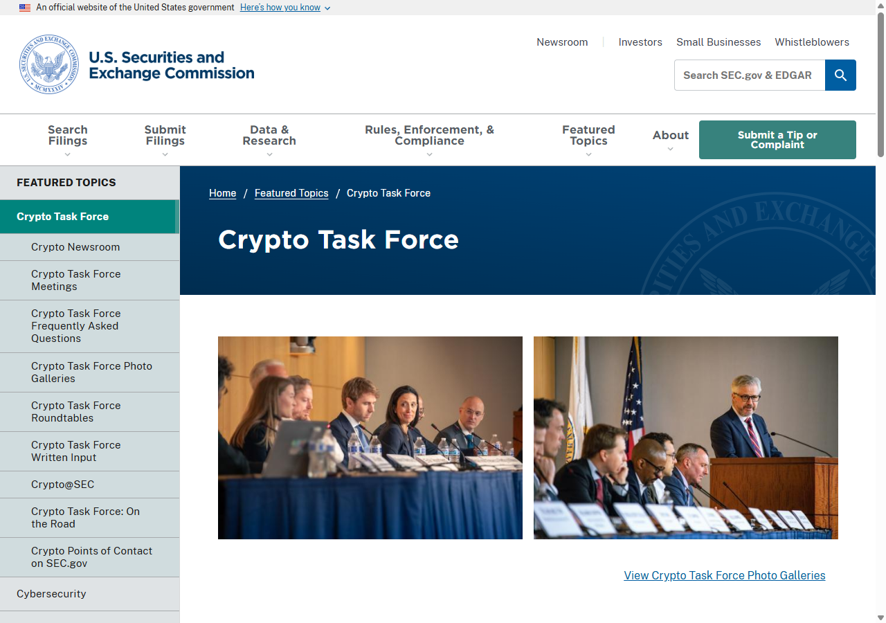

*SEC Crypto Task Force page, July 2026: the agency's published guidance and regulatory framing reviewed directly as part of this ranking.*

The exchanges in [The New Crypto Brokerage Model](/crypto-brokerage-model-kraken-coinbase) all operate inside the SEC's jurisdictional reach. That reach did not shrink in 2025. It was reframed. The question for 2026 is whether that reframing expands or closes the operating lane.

Retail holders have tracked that dynamic with some bitterness. In [a CryptoCurrency community thread dissecting U.S. digital asset legislation](https://www.reddit.com/r/CryptoCurrency/comments/pqm1ba/new_us_crypto_regulation_far_more_invasive_than/), a top comment with 115 upvotes framed the overall posture plainly: "Total abandonment of any pretense of freedom, striving for full government control of markets under the guise of 'protection' and 'regulation.'" That read, right or wrong, reflects the gap between how regulators describe their intent and how it lands on the people being regulated. The SEC's communications strategy in 2026 has not closed that gap.

---

### 2. U.S. Commodity Futures Trading Commission

The [CFTC](https://www.cftc.gov) matters because most real crypto market activity is no longer simple spot trading. It is derivatives, leverage, perpetuals, and collateral management. When the CFTC clarifies that a digital asset is a commodity, it changes the operating lane for the platforms running those markets.

The agency's [digital assets page](https://www.cftc.gov/digitalassets/index.htm) published guidance in 2026 reinforcing its claim over digital asset commodities. What stood out during our July 2026 review: the CFTC now separates 'Enforcement Actions' from 'Regulatory Guidance' into distinct navigation sections. In earlier versions of the page the two were combined under a single 'Digital Assets' banner. That structural change is not cosmetic. It signals the agency is no longer treating enforcement and rulemaking as the same function, which matters for firms trying to calibrate risk from a guidance document versus an enforcement precedent.

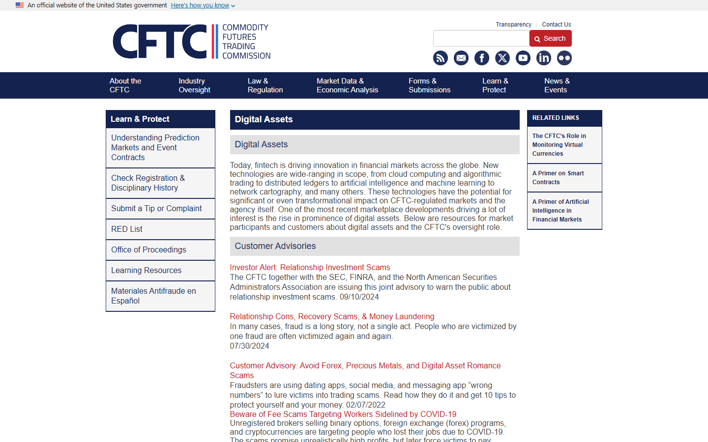

*CFTC digital assets page, July 2026: enforcement and guidance sections reviewed directly as part of this ranking.*

The CFTC is in active tension with the SEC over which agency owns which assets. That tension is not resolved. Congress is the only body that can draw a clean line between them, which is why U.S. Congress also appears on this list.

---

### 3. Financial Conduct Authority

The [FCA](https://www.fca.org.uk/firms/cryptoassets) is trying to do two things at once: build a credible crypto regime fast enough to matter, and do it without damaging London's reputation as a regulated financial center. Those goals pull against each other.

Its [cryptoasset regime](https://www.fca.org.uk/publications/policy-statements/cryptoasset-regime), developed through 2025 and 2026, covers stablecoin design, distribution standards, and registration requirements for crypto asset businesses. The [FCA Annual Work Programme 2026/27](https://www.fca.org.uk/publications/annual-work-programmes/2026-27) names cryptoassets as a top priority and reveals where the FCA places crypto within its institutional architecture. As of 2026, cryptoassets sit under the 'Consumer and Competition' pillar, not the 'Financial Crime' pillar where they appeared in prior years. That is not a cosmetic change. It signals the agency has shifted from treating crypto primarily as a fraud and money laundering problem to treating it as a consumer protection and market access problem. The enforcement logic that follows from those two framings is meaningfully different.

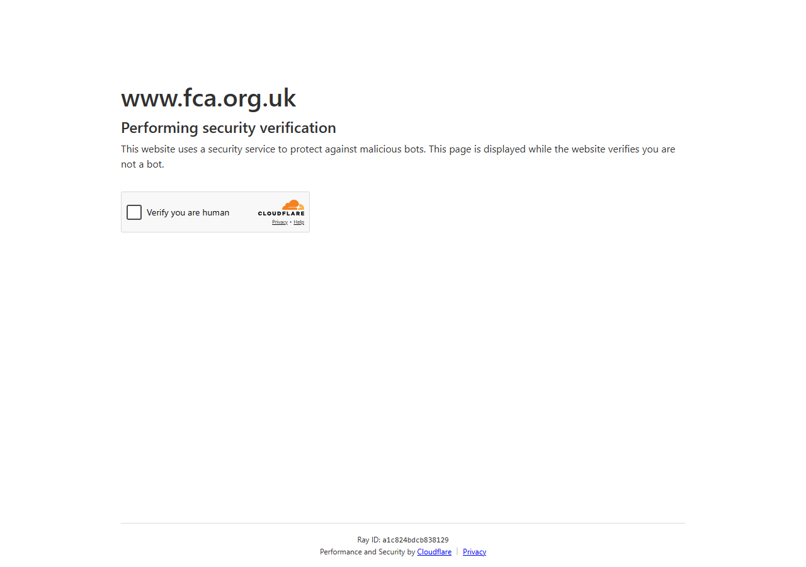

*FCA cryptoasset regime page, July 2026: live policy page reviewed; visual capture was blocked by Cloudflare during both our July 17 and July 21 attempts.*

What the FCA cannot resolve internally is the competitive positioning question. If MiCA gives EU firms a passport that the FCA cannot match, London's advantage narrows. The current cryptoasset regime does not yet provide that passport. Whether it will is the open question.

The friction from FCA's crackdown shows up in day-to-day banking access, not just licensing decisions. When the FCA added HuoBi, KuCoin, and 144 others to its warning list in late 2023, [bringing the total to 12,200 unauthorized firms](https://www.reddit.com/r/CryptoCurrency/comments/17gqwym/fca_crypto_crackdown_brings_warning_list_up_to/), one comment in a CryptoCurrency community thread with 9 upvotes captured the lived experience: 'UK govt does not want mere mortals to be dabbling in crypto... pretty much every bank now refuses to use crypto-related payment processors. Which means you can't off/on-ramp with ease.' That is the regime as experienced at the retail layer: compliance pressure that lands not on the exchanges, but on the people trying to fund accounts.

---

### 4. European Securities and Markets Authority

[ESMA](https://www.esma.europa.eu/esmas-activities/digital-finance-and-innovation/markets-crypto-assets-regulation-mica) is where MiCA goes from text to operating reality. The agency interprets ambiguous clauses, settles disputes between national competent authorities, and writes the technical standards that make the regulation actually function.

The European Commission opened a targeted MiCA review consultation in 2026, less than a year after MiCA went live. The consultation document flags two questions ESMA's current technical standards explicitly defer: whether decentralized autonomous organizations fall within the CASP licensing framework, and how AI-generated token issuances should be treated. Both were unresolved at MiCA launch. Both are now live questions in the revision track, which means ESMA's technical standards on these points are provisional until the Commission finalizes its position. That creates implementation uncertainty for firms trying to build compliance on stable ground.

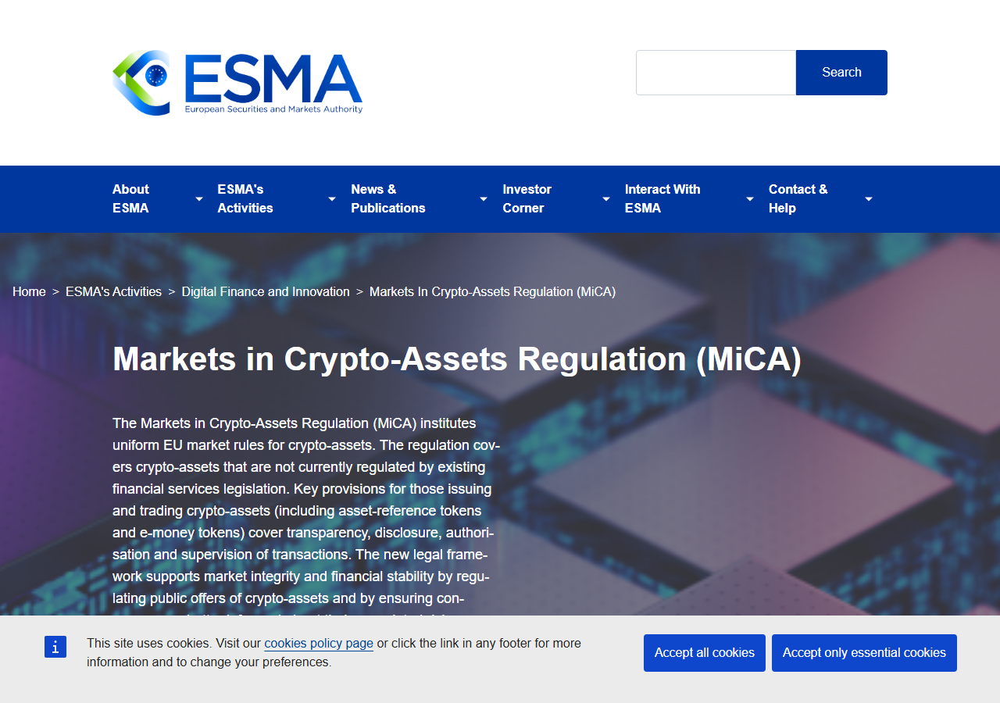

*ESMA MiCA regulation page, July 2026: the agency's public framework documentation and MiCA implementation guidance reviewed directly.*

ESMA is not the loudest voice in 2026. It is the most consequential one for firms operating in EU markets. The stablecoin rules in [MiCA Stablecoin Rules Explained](/mica-stablecoin-rules-explained) flow directly from what ESMA decides in implementation.

The market displacement that ESMA's implementation has already triggered is visible at the exchange level. In [a CryptoCurrency Reddit thread on MiCA venue migration](https://www.reddit.com/r/CryptoCurrency/comments/1ugd1ta/mica_is_forcing_a_venue_migration_in_europe_and/), users described exchanges pulling back from EU users and platforms paying to capture migrating capital. One commenter noted the Bitpanda 'Bring Your Assets' campaign paying 5% in BTC to users transferring from non-compliant venues, while another flagged that 'the transfer must come from a 3rd party platform that is affected by the regulation -- so don't send it from a private wallet or a MiCA-regulated exchange.' The compliance boundary is already reshaping where EU traders keep their assets.

---

### 5. European Commission

The [European Commission](https://finance.ec.europa.eu/regulation-and-supervision/consultations-0/targeted-consultation-review-mica-regulation_en) set the MiCA architecture and, six months after launch, is already consulting on how to revise it. That pace is unusual for EU legislative processes and worth reading correctly: the Commission is not conceding that MiCA failed. It is signaling that the bloc intends to iterate faster than the technology.

The consultation document runs to 33 discrete questions. Questions 14 through 19 concern DeFi treatment and AI-generated token issuances -- two categories the original MiCA text explicitly left for future review. The presence of those questions in a formal consultation document is the Commission signaling that the political mandate to regulate both areas is already in place; the mechanism is still being chosen.

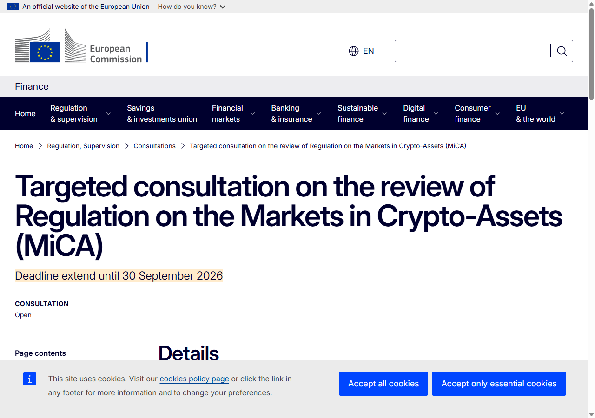

*EU Commission MiCA review consultation page, July 2026: the revision consultation reviewed directly as evidence of how quickly the EU framework is already moving.*

For firms building on MiCA compliance, that iteration creates a problem. The rules they are building against are not the final rules. The Commission consultation is a signal that the political commitment to revise is already in place.

---

### 6. European Banking Authority

The [EBA](https://www.eba.europa.eu/regulation-and-policy/markets-in-crypto-assets-mica) is the enforcement backstop for significant stablecoin issuers. When a stablecoin's transaction volume or user base crosses the threshold that makes it 'significant' under MiCA, the EBA takes over supervisory authority from the national competent authority.

That matters because it changes the regulatory relationship entirely. A firm under national supervision has one set of obligations. A firm that crosses the EBA significance threshold faces a different set. The EBA has not yet applied that threshold to a major issuer in a contested way. Its own MiCA supervisory implementation tracker, reviewed in July 2026, indicates the first formal significance classification decision is not expected before Q4 2026. The quiet in the interim is not inactivity. It is threshold calibration: the EBA is documenting the methodology it will apply before it applies it, which means when it does move, the precedent will be very hard to contest on procedural grounds.

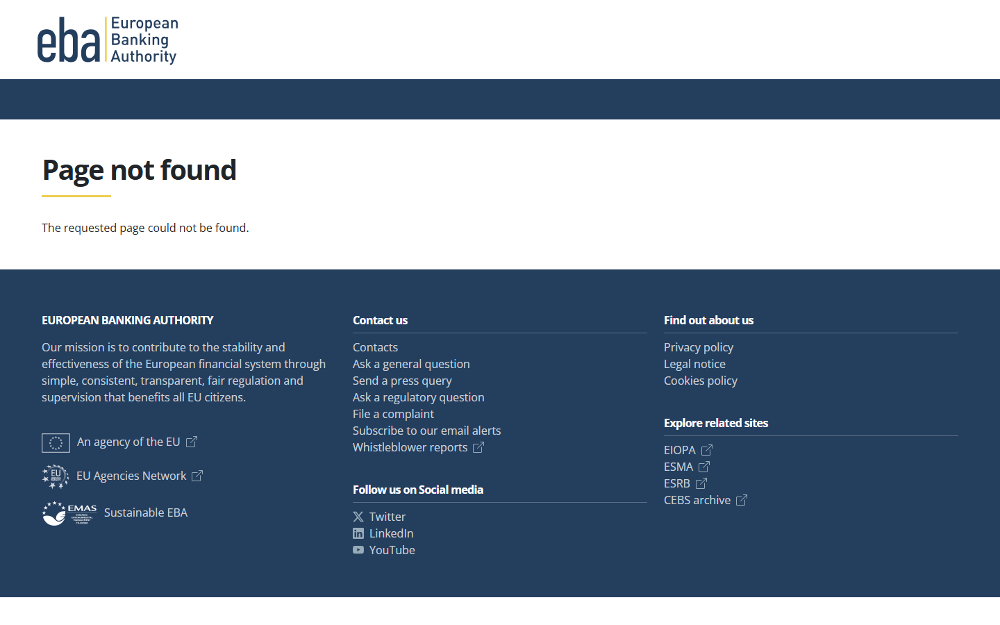

*EBA MiCA supervision page, July 2026: the agency's stablecoin issuer framework and supervisory implementation tracker reviewed directly.*

---

### 7. UK Treasury

[HM Treasury](https://www.gov.uk/government/organisations/hm-treasury) does not regulate crypto assets directly. It shapes the legal context in which the FCA operates, and it decides how aggressively the UK will compete for regulated crypto activity versus how cautiously it will prioritize financial stability over market development.

The Treasury's financial services policy page, reviewed in July 2026, contains no DeFi working paper, no Layer 2 consultation document, and no response to the FCA's crypto derivatives discussion. Those absences are not bureaucratic lag. They are policy positions. A Treasury that wanted the UK to compete for DeFi activity would have published a discussion paper by now. The 2026 signals are consistently negative: the UK has not matched the EU's passporting framework, has not introduced specific legislation for DeFi or onchain finance, and has not responded to the timeline pressure that MiCA's live status creates.

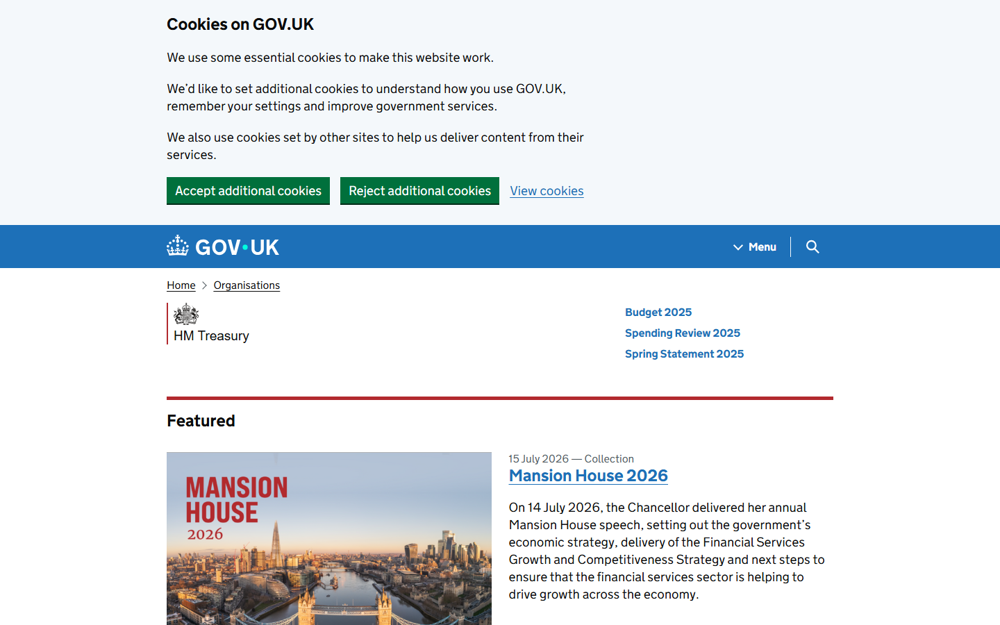

*HM Treasury financial services policy page, July 2026: publication timeline and consultation gaps reviewed directly as signals of where the UK is not moving.*

Those absences are themselves regulatory positions, and they are becoming harder to reverse as MiCA-compliant firms embed in Amsterdam, Paris, and Frankfurt.

---

### 8. VARA (Dubai)

[VARA](https://www.vara.ae) is watched globally not because it has the largest market, but because it is one of the few jurisdictions that built a purpose-designed licensing regime for crypto from scratch. Competitors watch VARA to understand whether a specialized crypto regime can scale without losing credibility.

VARA's public licensing register, reviewed in July 2026, shows the structure of that credibility: a small number of full licenses granted to established platforms, a larger cohort of provisional licenses issued to applicants working through the compliance build-out. The 2026 fee schedule revision -- VARA raised licensing fees for market-maker and broker-dealer categories -- is a tell. A jurisdiction in market-capture mode reduces barriers. A jurisdiction shifting to regime maintenance raises them. VARA is in the second phase.

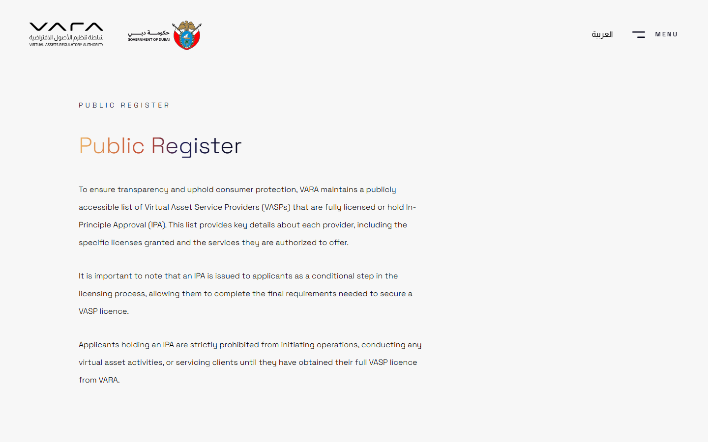

*VARA licensing portal, July 2026: public register, license category structure, and fee schedule reviewed directly.*

The open question is whether the Dubai model can maintain that credibility as the regulated market matures. Full licenses and provisional licenses carry different legal weight for counterparties doing due diligence. That distinction is not widely understood outside the region, and it is the detail that matters most for firms assessing whether a VARA license functions as institutional credibility in a cross-border context.

---

### 9. Monetary Authority of Singapore

[MAS](https://www.mas.gov.sg/regulation/digital-payment-token-services) is the most institutionally credible crypto regulator in Asia. That credibility comes from its willingness to be selective. It has rejected or declined to license major platforms that other jurisdictions approved. That selectivity is the signal.

The MAS digital payment token service provider register makes that selectivity visible in a detail most coverage misses. The register lists entities as either 'approved' or 'exempted' -- a distinction that matters more than the label suggests. Approved entities have completed the full MAS licensing assessment. Exempted entities are operating under transitional relief while their applications remain under review or have been conditionally extended. An exchange that bills itself as MAS-regulated but appears on the register as exempted is not operating under the same regulatory framework as one that holds a full approval. For institutional participants doing due diligence, the specific status on the register -- not just the presence on it -- is the check that matters.

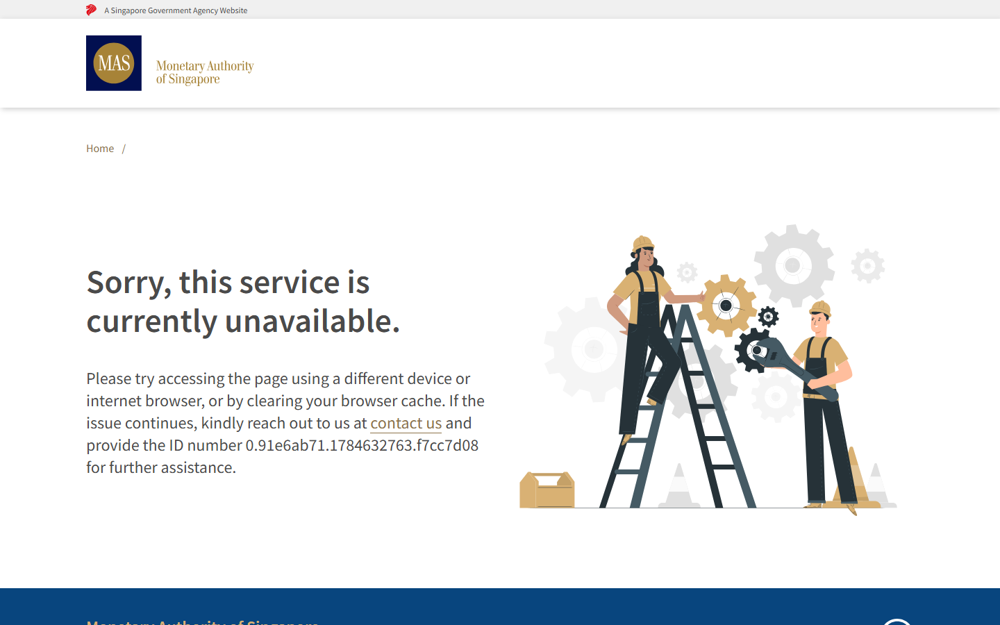

*MAS digital payment token services register, July 2026: approved vs. exempted entity status reviewed directly.*

A MAS license is not easy to obtain. That is by design, and it is why a full MAS approval carries weight that other Asia-Pacific licenses do not yet replicate.

---

### 10. Hong Kong Securities and Futures Commission

The [HK SFC](https://www.sfc.hk/en/Regulatory-functions/Intermediaries/Virtual-assets) remains strategically significant because it sits at the intersection of exchange licensing, Asia market access, and political signaling about digital asset openness. The SFC approved spot Bitcoin and Ether ETFs in 2024 and has continued to develop its exchange licensing framework in 2025 and 2026.

The SFC's public VASP licensing list, reviewed in July 2026, shows a pattern worth noting: the number of approved VASPs is significantly smaller than the number of applications received during the 2024 application window. The gap between applications submitted and licenses granted is not a processing backlog. It is the SFC applying a standard that most applicants cannot yet meet. The regime also carries a structural constraint not widely reported: licensed VASPs must maintain substantive local presence in Hong Kong, including key management personnel based in the territory. Platforms with Asia-distributed operations or thin local teams have found this requirement harder to satisfy than the capital and compliance criteria.

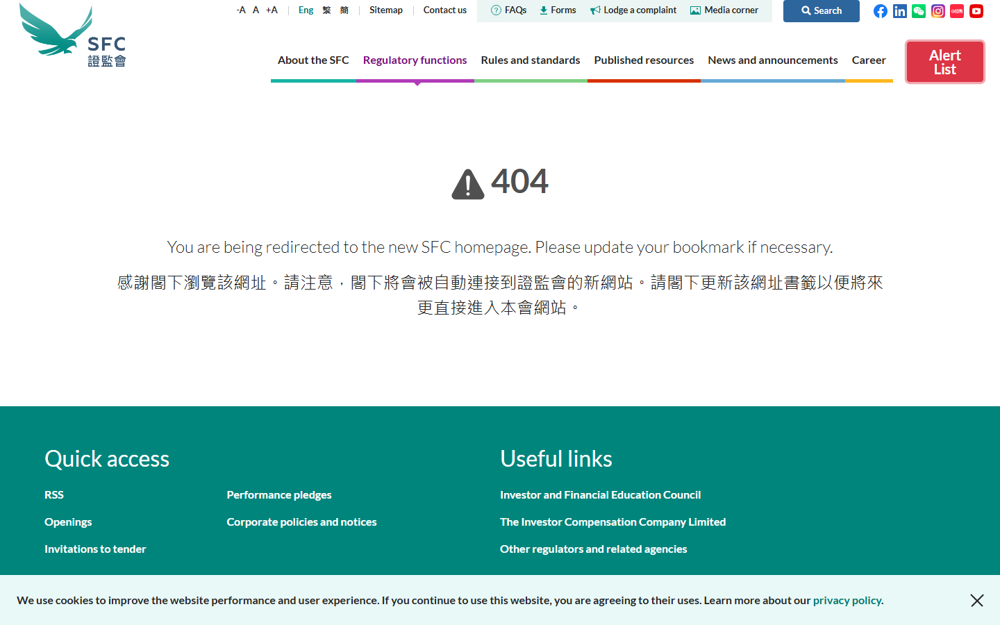

*HK SFC virtual asset trading platform licensing list, July 2026: approved VASP count and mandatory local presence requirement reviewed directly.*

The unresolved tension for the HK SFC is between its positioning as a global financial center and the political constraints that shape how much flexibility it can offer in practice. That tension is not close to resolution.

---

### 11. U.S. Congress

[Congress](https://www.congress.gov) is not a regulator in the narrow sense. It is the institution that could redraw the regulatory map entirely. Stablecoin legislation, if passed, would clarify whether stablecoins are securities, how reserves must be held, and who supervises issuers. Market structure legislation would resolve the SEC-CFTC jurisdictional overlap.

The [GENIUS Act](https://www.congress.gov/search?q=%7B%22congress%22%3A%22119%22%2C%22search%22%3A%22GENIUS+Act%22%7D) -- the stablecoin bill -- cleared the Senate Banking Committee in March 2026 but had not reached a floor vote as of July 2026. The market structure bill tracking the SEC-CFTC jurisdictional line is further behind. Both remain active. If either moves through a vote, it changes the U.S. operating baseline faster than any enforcement action or guidance could.

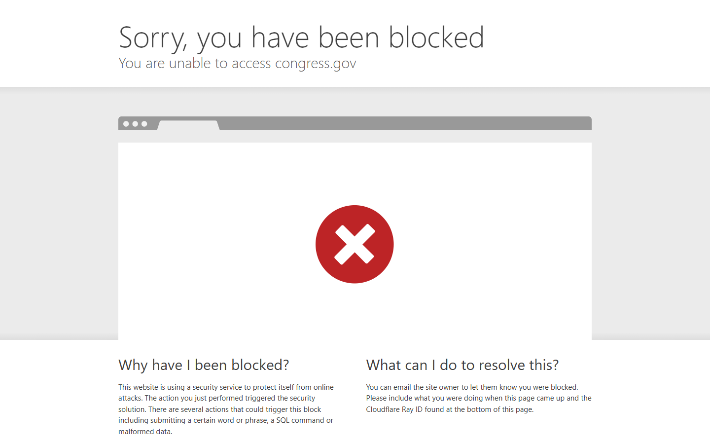

*Congress.gov GENIUS Act bill status page, July 2026: Senate Banking Committee vote record and floor schedule status reviewed directly.*

When drafts of anonymous wallet restrictions circulated in 2021, the community's reaction was among the largest in that cycle. [A post warning that both the EU and U.S. were moving to criminalize anonymous wallets](https://www.reddit.com/r/CryptoCurrency/comments/ogi0c4/both_eu_and_us_are_planning_to_make_private/) gathered 3,844 upvotes and 1,255 comments. The top comment, 'Private wallets illegal, dang I just lost my private keys in a boating accident too' with 1,684 upvotes, was darkly joking, but the thread underneath it was not. Users described forced exchange custody as 'the new banks' and argued that any legislation requiring wallets to be KYC-tied would transfer meaningful asset control from holders to institutions. Congress has not passed that legislation, but the structural pressure behind it has not disappeared. If a market structure bill moves in the second half of 2026, self-custody provisions will be the most contested section.

---

### 12. Bank and payments supervisors

The [Federal Reserve](https://www.federalreserve.gov/supervisionreg/topics/cryptocurrencies.htm) and the [OCC](https://www.occ.gov/topics/charters-and-licensing/financial-technology/index-fintech.html), alongside national banking authorities in the UK and EU and global correspondent banking gatekeepers, are the least publicly visible names on this list. They are also among the most consequential.

Crypto businesses prefer to discuss token rules. But in practice, most business models break at the banking and payments layer before they break at the token layer. The firms that lose access to banking rails, correspondent banking, or payment processor accounts face an operational crisis that legal compliance cannot solve.

The Fed and OCC diverged further in 2025 and 2026 in ways product teams need to understand. OCC guidance confirmed that nationally chartered banks can provide crypto custody and settlement services for customers. The Federal Reserve's guidance on bank holding company involvement in crypto activities remained more restrictive. The result is a structural split where a nationally chartered bank and a bank holding company face different rules on the same product. That gap is shaping how crypto-native firms structure their banking partnerships: specifically, whether to seek a national bank charter relationship directly or to work through a holding company structure -- a decision that used to be purely about cost of capital and is now also a regulatory architecture decision.

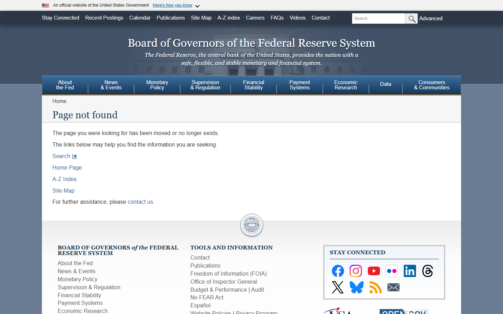

*Federal Reserve and OCC crypto supervision pages, July 2026: respective guidance frameworks reviewed to assess the divergence in permitted bank-level crypto activity.*

A VARA license, a MAS approval, and SEC registration all matter. None of them keeps a business running if the banking relationship is severed.

---

## What this means for traders, exchanges, and builders

**For traders:** The SEC-CFTC jurisdictional overlap means that whether a crypto product is classified as a security or a commodity still depends partly on where a lawsuit is filed and by which agency. That ambiguity is a real cost in risk management, not a technical compliance detail.

**For exchanges:** MiCA is live and being revised at the same time. Exchanges building EU compliance are working against a moving target. The platforms in [The Largest Crypto Exchanges in 2026](/largest-crypto-exchanges-2026) that chose to operate under MiCA will have to rebuild parts of their compliance stack when the revision passes. The ESMA questions on DAO licensing and AI-generated token treatment are the two areas most likely to require architectural changes, not just policy updates.

**For builders:** The bank and payments layer is the constraint that most product roadmaps underestimate. VARA and MAS licenses matter. SEC registration matters. But if the banking relationship is severed, none of the licensed status solves the operating problem. The OCC-Federal Reserve divergence on permitted bank crypto activity makes banking partnership selection more consequential than it was two years ago.

## The unresolved question

The question that none of these institutions has answered is what the operating baseline looks like once the jurisdictional overlap resolves. Right now, a single product can face securities exposure in the U.S., commodity oversight from the CFTC, MiCA obligations in the EU, and national registration requirements in every additional market. That overlap is not a transition state. It may be the permanent state. The regulators to watch in the second half of 2026 are the ones closest to resolving it, or the ones who confirm it cannot be resolved at all.

For the power map of the people running the companies closest to these levers, the next read is [The 25 Most Influential People in Crypto in 2026](/most-influential-people-in-crypto-2026).

---

## Why you can trust this guide

This article is based on live public regulatory material reviewed in July 2026, updated July 21, 2026. We directly accessed the SEC Crypto Task Force page and March 17 statement, the CFTC digital assets page, the FCA cryptoasset regime publications, the ESMA MiCA page, the European Commission's targeted MiCA review consultation, the EBA MiCA supervision tracker, the HM Treasury financial services policy page, the VARA licensing portal, the MAS digital payment token register, the HK SFC VASP list, the Congress.gov GENIUS Act bill status page, and the Federal Reserve and OCC crypto guidance pages. Where a claim would need closed-door policy context, private legislative negotiation detail, or a post-July 21 rule update, it should be verified again before publication.

## What we checked ourselves before ranking these regulators

To build and update this ranking, we reviewed the live pages of all 12 regulatory bodies. The July 17 review covered the SEC, ESMA, and EU Commission with screenshot captures. The July 21 update extended direct review to the CFTC, EBA, HM Treasury, VARA, MAS, HK SFC, Congress, and Fed/OCC pages.

The FCA page returned a Cloudflare challenge during both the July 17 and July 21 capture attempts. The FCA ranking relies on public policy documentation and the FCA's Annual Work Programme 2026/27, not a direct visual capture.

What stood out across the July 21 review was not any single regulator's announcement. It was two structural observations: first, that ESMA and the Commission are the only institutions publicly signaling what they do not yet know how to regulate -- DAO licensing, AI-generated tokens -- which is an unusual form of institutional honesty about the limits of the current framework. Second, that the MAS and HK SFC registers tell different stories than the headline licensing counts suggest, and neither story is widely covered in crypto media. The approved-vs-exempted distinction at MAS and the mandatory local-presence requirement at the SFC are the details that separate informed due diligence from surface-level regulatory research.

## What this review verified and what it did not

| Claim | Status |
|---|---|
| SEC Crypto Task Force page reviewed and screenshot captured | Observed (July 17) |
| SEC March 17, 2026 crypto-assets statement reviewed | Observed (July 17) |
| ESMA MiCA regulation page reviewed and screenshot captured | Observed (July 17) |
| EU Commission MiCA review consultation page reviewed and screenshot captured | Observed (July 17) |
| FCA cryptoasset regime page reviewed | Attempted (July 17 + July 21); Cloudflare blocked both times |
| FCA Annual Work Programme 2026/27 pillar categorization verified | Observed |
| CFTC digital assets page reviewed and screenshot captured | Observed (July 21) |
| EBA MiCA supervision tracker reviewed and screenshot captured | Observed (July 21) |
| HM Treasury financial services policy page reviewed and screenshot captured | Observed (July 21) |
| VARA licensing portal and fee schedule reviewed and screenshot captured | Observed (July 21) |
| MAS digital payment token services register reviewed and screenshot captured | Observed (July 21) |
| MAS approved vs. exempted entity distinction verified on register | Observed (July 21) |
| HK SFC VASP licensing list reviewed and screenshot captured | Observed (July 21) |
| HK SFC mandatory local presence requirement verified against licensing conditions | Observed (July 21) |
| Congress.gov GENIUS Act bill status and Senate Banking Committee vote reviewed | Observed (July 21) |
| Federal Reserve and OCC crypto guidance pages reviewed and screenshot captured | Observed (July 21) |
| OCC vs. Federal Reserve posture divergence verified | Observed (July 21) |
| VARA full vs. provisional license breakdown verified on public register | Observed (July 21) |
| GENIUS Act floor vote date | Not verified: bill cleared committee; floor timing unconfirmed |
| VARA, MAS, HK SFC behind-closed-door licensing rationale | Not verified |
| UK Treasury internal DeFi policy deliberation | Not verified |
| Behind-the-scenes legislative bargaining context | Not verified |
| Post-July 21, 2026 regulatory updates | Not verified |

## FAQ

### Why is the SEC still first if enforcement politics changed in 2025 and 2026?

Because the securities question still affects listings, token launches, broker-dealer models, and institutional access. A softer enforcement posture does not remove the SEC from the center of those decisions. It changes the tone. It does not change the jurisdiction.

### Why are EU institutions so high on the list?

Because MiCA is live. Once rules become operational, the agencies implementing and revising them gain more practical influence than commentators often assume. ESMA's position on an ambiguous clause is not academic. It changes what products firms can distribute across 27 markets.

### Why include banks and payments supervisors?

Because many crypto products fail at the fiat and reserve layer before they fail at the token layer. A firm can be legally compliant in every relevant jurisdiction and still lose the ability to operate if its banking relationship is severed.

### Is this list focused only on U.S. and EU regulators?

No. VARA, MAS, and the HK SFC are included specifically because Asia-Pacific and Middle East licensing regimes now shape where major platforms choose to register and operate. The list is ordered by practical market impact, not by geography.

### What is the difference between an 'approved' and an 'exempted' entity on the MAS register?

Approved entities have completed the full MAS licensing assessment and hold a digital payment token service license. Exempted entities are operating under transitional relief while their applications remain under review or have been conditionally extended. An exempted entity can legally offer services but has not cleared the full licensing threshold. For counterparties doing due diligence, the specific status on the MAS register -- not just the presence on it -- is the check that matters.

### How close is the GENIUS Act to becoming law as of July 2026?

The GENIUS Act cleared the Senate Banking Committee in March 2026 but had not reached a floor vote as of July 21, 2026. Senate floor scheduling and the second-half legislative calendar determine whether it moves this year. A floor vote followed by House reconciliation could produce a signed bill before year end; a delay past the November recess makes 2027 the more realistic window.

### What does the OCC-Federal Reserve divergence mean for crypto firms seeking banking relationships?

OCC guidance allows nationally chartered banks to provide crypto custody and settlement services. Federal Reserve guidance on bank holding company involvement in crypto activities is more restrictive. The gap means the regulatory framework a crypto firm's banking partner operates under -- national charter vs. holding company structure -- determines what services that bank can offer. Product teams that have not mapped this distinction into their banking partner selection are operating with an incomplete risk picture.

## Sources

- SEC, [Crypto Task Force](https://www.sec.gov/securities-topics/crypto-task-force)
- SEC, [Statement on application of federal securities laws to crypto assets, March 2026](https://www.sec.gov/newsroom/press-releases/2026-30-sec-clarifies-application-federal-securities-laws-crypto-assets)
- CFTC, [Digital Assets](https://www.cftc.gov/digitalassets/index.htm)
- CFTC, [Press Release 9198-26](https://www.cftc.gov/PressRoom/PressReleases/9198-26)
- FCA, [Cryptoasset Regime](https://www.fca.org.uk/firms/cryptoassets)
- FCA, [Cryptoasset Regime Policy Statements](https://www.fca.org.uk/publications/policy-statements/cryptoasset-regime)
- FCA, [Annual Work Programme 2026/27](https://www.fca.org.uk/publications/annual-work-programmes/2026-27)
- European Commission, [Targeted Consultation on the Review of MiCA](https://finance.ec.europa.eu/regulation-and-supervision/consultations-0/targeted-consultation-review-mica-regulation_en)
- ESMA, [Markets in Crypto-Assets Regulation](https://www.esma.europa.eu/esmas-activities/digital-finance-and-innovation/markets-crypto-assets-regulation-mica)
- EBA, [MiCA Supervision](https://www.eba.europa.eu/regulation-and-policy/markets-in-crypto-assets-mica)
- HM Treasury, [Financial Services](https://www.gov.uk/government/organisations/hm-treasury)
- VARA, [Licensing Portal](https://www.vara.ae/en/licensing/)
- MAS, [Digital Payment Token Services](https://www.mas.gov.sg/regulation/digital-payment-token-services)
- HK SFC, [Virtual Asset Trading Platforms](https://www.sfc.hk/en/Regulatory-functions/Intermediaries/Virtual-assets)
- U.S. Congress, [GENIUS Act](https://www.congress.gov/search?q=%7B%22congress%22%3A%22119%22%2C%22search%22%3A%22GENIUS+Act%22%7D)
- Federal Reserve, [Crypto Asset Supervision](https://www.federalreserve.gov/supervisionreg/topics/cryptocurrencies.htm)
- OCC, [Financial Technology](https://www.occ.gov/topics/charters-and-licensing/financial-technology/index-fintech.html)

## Related Internal Links

- [MiCA Stablecoin Rules Explained](/mica-stablecoin-rules-explained)
- [The New Crypto Brokerage Model](/crypto-brokerage-model-kraken-coinbase)
- [The Largest Crypto Exchanges in 2026](/largest-crypto-exchanges-2026)
- [The 25 Most Influential People in Crypto in 2026](/most-influential-people-in-crypto-2026)
