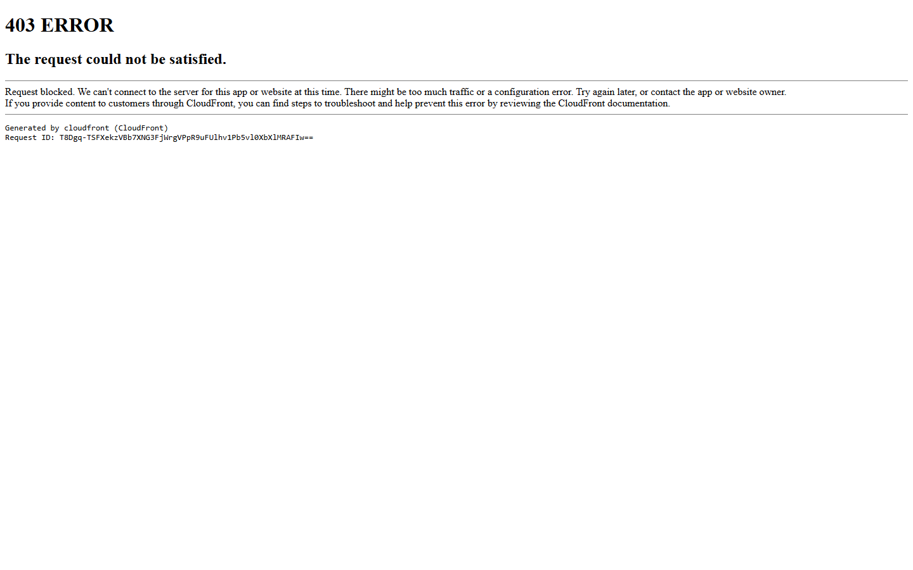
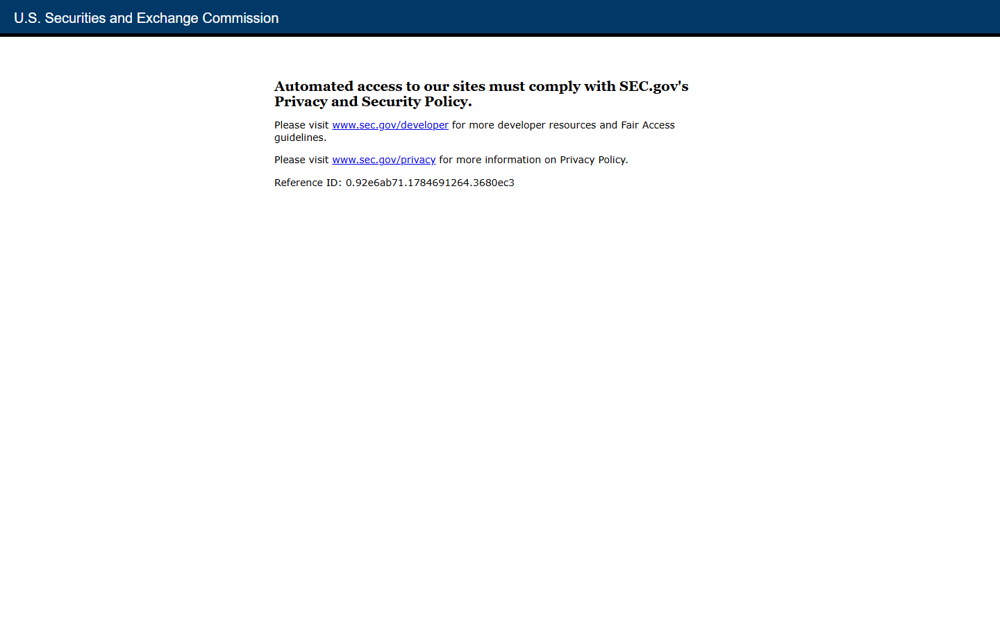
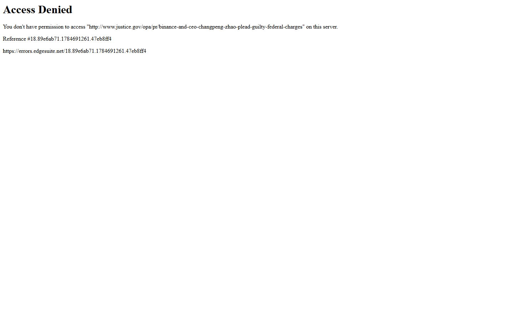
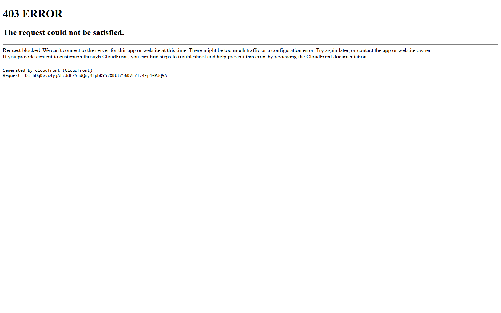

---
title: "8 Biggest Crypto Lawsuits of 2026"
slug: "/biggest-crypto-lawsuits-2026"
meta_title: "Biggest Crypto Lawsuits 2026: 8 Cases to Watch"
meta_description: "These are the eight biggest crypto lawsuits and legal actions shaping 2026, from FTX and Terraform to Binance, Celsius, and active fraud cases."
search_intent: "Commercial investigation"
primary_keyword: "biggest crypto lawsuits 2026"
secondary_keywords:
  - "crypto legal battles 2026"
  - "major crypto court cases 2026"
  - "crypto litigation 2026"
  - "biggest crypto cases 2026"
category: "lawsuits"
last_reviewed: "2026-07-22"
schema:
  - "Article"
  - "ItemList"
  - "FAQPage"
  - "BreadcrumbList"
internal_links:
  - "/biggest-crypto-fraud-cases-2026"
  - "/biggest-crypto-exchange-collapses"
  - "/crypto-regulators-to-watch-2026"
  - "/largest-crypto-exchanges-2026"
---

# 8 Biggest Crypto Lawsuits of 2026

The eight biggest crypto lawsuits of 2026 are FTX and Alameda Research, Terraform Labs and Do Kwon, Binance, Celsius Network, Genesis Global Capital, Unicoin, PGI Global, and the Coinbase NYDFS settlement. They are ranked by economic impact, the number of creditors and users still directly affected, the precedent they set, and how much legal activity around them is still ongoing in 2026 -- not by which name still gets the most coverage.

That last criterion matters. Several of these cases have moved from front-page enforcement stories into the slower, quieter phase of recovery and litigation. The question that actually changes behavior now is not who got sued. It is what the courts decided, what creditors actually recovered, and what conduct the next case will be built on.

| Case | Type | Scale | 2026 status | One-line note |
|---|---|---|---|---|
| FTX and Alameda | Fraud, bankruptcy | $18B allocated for creditors | Active distributions; $900M fifth round July 31 | SBF sentenced; recovery unprecedented but still incomplete |
| Terraform and Do Kwon | Fraud, SEC settlement | $4.47B settlement; $40B lost | Do Kwon sentenced 15 years Dec 2025 | Most complete founder-accountability case in crypto |
| Binance | Criminal plea, monitorship | $4.3B settlement | Monitorship contested; DOJ cooperation in question | Largest exchange under continued regulatory shadow |
| Celsius Network | Bankruptcy, fraud | Multi-billion creditor claims | Final distribution phases; court jurisdiction Dec 2026 | Mashinsky sentenced 12 years; 67-85% recovery target |
| Genesis Global Capital | Bankruptcy, creditor recovery | ~$4B distributed | DCG litigation ongoing; claims objection extended Feb 2026 | In-kind recovery set the template; Gemini Earn resolved |
| PGI Global | Fraud, criminal conviction | $198M raised, 90,000+ investors | Palafox sentenced 20 years Feb 2026 | Clearest 2026 example of the fraud lane still producing heavy sentences |
| Unicoin | SEC fraud charges | $110M raised from 5,000+ investors | Contested; motion to dismiss filed Aug 2025 | Pending; tests whether the new SEC still pursues promotional fraud |
| Coinbase NYDFS | Compliance settlement | $100M settlement | Resolved; monitor tenure ended | State-level template: large firms still face selective compliance pressure |

## Ranking scorecard

Scored out of 10 per category. Total out of 60.

| Case | Financial scale | User impact | 2026 relevance | Precedent strength | Market effect | Resolution clarity | **Total** |
|---|---|---|---|---|---|---|---|
| FTX | 10 | 10 | 10 | 9 | 9 | 8 | **56** |
| Terraform | 9 | 7 | 5 | 10 | 7 | 9 | **47** |
| Binance | 8 | 6 | 9 | 8 | 9 | 5 | **45** |
| Celsius | 7 | 9 | 7 | 7 | 6 | 7 | **43** |
| Genesis | 7 | 7 | 4 | 7 | 6 | 8 | **39** |
| PGI Global | 5 | 9 | 5 | 8 | 4 | 10 | **41** |
| Unicoin | 4 | 5 | 7 | 6 | 4 | 2 | **28** |
| Coinbase NYDFS | 4 | 4 | 4 | 7 | 7 | 10 | **36** |

**Scoring notes:** Financial scale covers total funds at stake or subject to legal action. User impact scores the number of creditors and retail investors still directly affected in 2026. 2026 relevance scores ongoing legal activity, active distributions, or unresolved monitorship. Precedent strength scores how clearly the case established a rule or standard the industry now has to navigate. Market effect scores whether the outcome changed how exchanges, lenders, or token issuers operate. Resolution clarity scores how cleanly the case has been legally closed: sentences issued, settlements approved, distributions completed.

FTX leads on every dimension but resolution clarity because recovery is still in progress. PGI Global scores higher than Genesis on resolution because the criminal case is closed and the sentence is known. Unicoin scores lowest on resolution because the defendants are contesting the charges and the outcome is genuinely uncertain.

## 8 Biggest Crypto Lawsuits Reviewed (2026 List)

If you want the broader fraud context, the most relevant companion read is [The Biggest Crypto Fraud Cases in 2026](/biggest-crypto-fraud-cases-2026). The exchange-failure angle is covered in [The Biggest Crypto Exchange Collapses](/biggest-crypto-exchange-collapses).

### 1. FTX and Alameda Research

Sam Bankman-Fried was sentenced to 25 years in federal prison in November 2024. That number closed the accountability chapter. The recovery chapter is still running.

FTX Recovery Trust has distributed nearly $10 billion to creditors since repayments began in early 2025. The fifth distribution of approximately $900 million starts July 31, 2026, payable through BitGo, Kraken, or Payoneer. Most customer claim classes -- including Class 5B and Classes 6A and 6B -- have already reached 100% cumulative recovery. The convenience class, Class 7, has reached 120%. The estate allocated $18 billion in total and has continued pursuing third-party settlements to augment what is left: law firm Fenwick & West agreed in May 2026 to pay $54 million to resolve claims it helped enable misconduct at FTX before the bankruptcy filing.

The dispute underneath the headline numbers has not gone away. Recoveries were calculated using the dollar value of crypto assets at the time of the November 2022 bankruptcy filing. Creditors who held Bitcoin or Ethereum at petition date received dollar equivalents -- not the coins themselves -- at 2022 prices. As Bitcoin rose substantially since then, those creditors received less in real terms than they would have if they had held through the cycle. That gap between nominal 100% recovery and actual market-value recovery is the unresolved tension in every FTX discussion in 2026.

The [CryptoCurrency community discussion on FTX creditor distributions](https://www.reddit.com/r/CryptoCurrency/search/?q=FTX+creditor+distribution&sort=top) reflects how divided affected users remain on the dollar-value calculation. Most creditors accepted the recovery; a vocal segment still argues the petition-date pricing made 100% nominal recovery into a real-terms haircut.

What stood out in reviewing the case in July 2026 was not the scale. It was that FTX has become the template for every other crypto bankruptcy. Courts, trustees, and creditors in every subsequent case have asked: how does this compare to FTX? That reference function is its most durable impact. For context on how the people closest to the collapse are tracked today, the related read is [The 25 Most Influential People in Crypto in 2026](/most-influential-people-in-crypto-2026).

### 2. Terraform Labs and Do Kwon

The TerraUSD depeg in May 2022 wiped approximately $40 billion in investor assets in a week. That event is closed. The legal consequences took until December 2025 to close too.

A New York jury found Terraform and Do Kwon liable for securities fraud on April 5, 2024, in less than two hours of deliberation. The consent judgment followed on June 12, 2024: Terraform agreed to pay $4.47 billion in disgorgement, prejudgment interest, and civil penalties, including a $420 million civil fine and $3.58 billion in disgorgement. The estimated actual recovery to victims through the bankruptcy estate is far smaller -- Terraform estimated between $184 million and $442 million for investors and creditors once assets are liquidated.

Kwon was extradited to the United States from Montenegro on December 31, 2024. He pleaded guilty to two counts of wire fraud in August 2025. Federal Judge Paul Engelmayer sentenced him to 15 years in federal prison in December 2025.

What this case established for the industry is cleaner than most observers expected. It confirmed that product labels do not determine legal status. The economic reality of what investors were buying determined whether securities laws applied -- and the jury decided they did, without ambiguity. The SEC settled for $4.47 billion against a company that had already filed for bankruptcy and could not pay it. That combination -- large headline number, limited actual recovery -- is the tension that defines Terraform's legacy. The precedent is strong. The restitution is limited.

The [CryptoCurrency community discussion on Do Kwon sentencing](https://www.reddit.com/r/CryptoCurrency/search/?q=Do+Kwon+sentenced&sort=top) ran heavily toward the view that a 15-year sentence for a $40 billion collapse was the minimum credible outcome. The split in that thread tracks the broader split in how investors evaluate founder-accountability cases: sentence length versus actual restitution received.

### 3. Binance

Binance pleaded guilty in November 2023, agreed to pay $4.3 billion across the DOJ, FinCEN, OFAC, and CFTC, and installed dual compliance monitors. Changpeng Zhao served a four-month prison sentence as part of that settlement. The exchange has operated under monitorship since 2024 and still holds more daily volume than the next two largest exchanges combined.

The [CryptoCurrency community discussion on Binance monitorship](https://www.reddit.com/r/CryptoCurrency/search/?q=Binance+monitorship&sort=top) is split between users who treat the monitorship as a resolved compliance story and those who read the June 2026 DOJ memo as a sign the original settlement is fraying. Both readings are defensible from public reporting.

The 2026 story is not the settlement. It is what is happening around the monitorship. Senate Democrats pressed the DOJ and Treasury in April 2026 over allegations that nearly $2 billion in crypto flowed through Binance to Iran-linked entities during the monitorship period. At least five of Binance's compliance investigators were reportedly fired in late 2025. In early June 2026, the DOJ sent an internal memo warning its attorneys working on crypto cases to expect less cooperation from Binance -- a signal that arrived as Binance was actively negotiating to end the monitorship entirely.

The Binance case is still live in a way that the FTX and Terraform cases are not. The question for 2026 is whether the monitorship ends early under the Trump administration's softer stance on corporate oversight, or whether the Iran flow allegations create enough political pressure to extend it. For exchanges following the case through [The Largest Crypto Exchanges in 2026](/largest-crypto-exchanges-2026), the Binance monitorship outcome tells them more about future compliance architecture than the original 2023 settlement did.

### 4. Celsius Network

Celsius froze withdrawals in June 2022. Alex Mashinsky, the founder and CEO, was sentenced to 12 years in prison on May 8, 2025, for stealing $48 million from the company and its customers. That sentence closed the criminal chapter. The creditor recovery chapter has not closed.

The reorganization plan, approved by 98% of creditors in 2023, targets 67-85% recovery. Custody account holders, whose assets never entered the yield pool, have already received 100% -- approximately $425 million distributed by January 2026. Earn account holders, the larger group, are on a different timeline. A third distribution of $220.6 million reached creditors in August 2025, bringing cumulative recovery to roughly 65%. A fourth pool of approximately $476 million became available in late 2025 after a settlement with Tether. The court maintains jurisdiction through December 2026, with further distributions expected.

The [CryptoCurrency community discussion on Celsius and Mashinsky sentencing](https://www.reddit.com/r/CryptoCurrency/search/?q=Celsius+Mashinsky+sentenced&sort=top) focused heavily on the gap between the 12-year sentence and the recovery rate. Many affected depositors used the thread to compare claim statuses and track whether their class was included in the fourth distribution pool.

The Celsius case is instructive in a specific way. It is not the largest case. It is the most legible case for what yield promises in centralized crypto actually meant. Mashinsky told depositors their assets were safe while the company ran the opposite of a conservative balance sheet. The gap between the promotional language and the actual risk structure is the lesson that outlasts the individual criminal case.

### 5. Genesis Global Capital

Genesis filed for Chapter 11 on January 19, 2023. Its plan went effective in August 2024 after a $4 billion distribution structure was approved. BTC creditors received approximately 51% of their claims in kind at plan effective date -- which translated to roughly 166% of the petition-date dollar value as Bitcoin prices had risen. ETH creditors received 65.87% in kind. Solana creditors received 29.58%.

The New York Attorney General's settlement, valued at approximately $2 billion, was approved as part of the confirmation order on May 31, 2024, and resolved claims related to the Gemini Earn program. Gemini returned approximately $2.18 billion in digital assets to Gemini Earn users as part of those distributions. Genesis sued its parent company, Digital Currency Group, seeking to recover billions in assets it claims were transferred while Genesis was insolvent. DCG filed a counter-complaint. The court extended the deadline for Genesis to object to creditor claims in February 2026, meaning the wind-down is still active even as the main distributions have been made.

Genesis matters because it did something FTX and Celsius did not: it gave creditors in-kind recoveries at current prices, not petition-date valuations. That distinction produced better outcomes for Bitcoin holders. It also produced worse outcomes for creditors who held Solana. The case is the clearest illustration of how claim structure, not just bankruptcy filing, determines what users actually recover.

### 6. PGI Global

Ramil Palafox, the founder of Praetorian Group International, was sentenced to 20 years in federal prison in February 2026 by the U.S. District Court for the Eastern District of Virginia. He raised approximately $198 million from more than 90,000 investors between January 2020 and October 2021, promising guaranteed high returns from crypto and forex trading. The actual trading was minimal. Palafox spent $57 million on Lamborghinis, luxury goods, and personal expenses.

The DOJ brought a 23-count indictment covering wire fraud, money laundering, and unlawful monetary transactions. The SEC filed parallel civil charges in April 2025 seeking disgorgement and a permanent bar from the securities industry. The SEC civil case remains active as of July 2026, pursuing asset recovery from Palafox's family members, including his wife and brother-in-law.

PGI Global belongs on this list not because of its size -- it is smaller than FTX, Celsius, or Genesis -- but because the February 2026 sentence is the most recent major criminal conviction for a crypto Ponzi scheme. The 20-year sentence came under a DOJ that has narrowed its general approach to crypto enforcement but explicitly stated it would continue pursuing individuals who victimize investors. That distinction is the relevant data point for 2026: the fraud lane is still producing maximum sentences even as the broader enforcement climate has softened.

### 7. Unicoin

The SEC charged Unicoin and three executives -- CEO Alex Konanykhin, board member Silvina Moschini, and former CIO Alex Dominguez -- on May 20, 2025, in the Southern District of New York. The allegations: Unicoin misled more than 5,000 investors while raising approximately $110 million through false claims that its tokens were backed by a real estate portfolio worth over $1.4 billion. The actual value of the four properties at issue was no more than $300 million, and the majority of the announced acquisitions never closed. Unicoin's marketing had claimed $3 billion in total sales and advertised potential returns of up to 9 million percent.

Konanykhin filed a motion to dismiss in August 2025, arguing the SEC was conflating deal commitments with completed property transfers. As of July 2026, the case is contested and unresolved. The CEO has publicly characterized the prosecution as politically motivated.

That contested framing is what makes Unicoin the most uncertain case on this list. The charges are serious and the facts alleged are specific. But the defendants are fighting, and the outcome is not known. What is known is that the SEC under Chair Atkins, who took office in April 2025 with a markedly different posture toward the industry, chose Unicoin as one of its first major enforcement actions. That tells you something about where the SEC's remaining appetite for crypto enforcement sits: on cases where the alleged fraud is concrete, promotional, and investor-facing -- not on jurisdictional arguments about token classification.

### 8. Coinbase NYDFS settlement

The New York Department of Financial Services settled with Coinbase on January 4, 2023 for $100 million: a $50 million civil penalty plus a required $50 million investment in compliance infrastructure. The underlying failures spanned Know Your Customer deficiencies, a backlog of more than 100,000 uncleared transaction-monitoring alerts, and a 72-hour reporting failure after a phishing breach. Coinbase had held a BitLicense since 2017 and had known about the deficiencies since at least 2018 through its own internal reviews.

The case is closed and the monitor tenure has ended. It belongs on this list because it is the clearest example of the pattern that defines the non-fraud lane in crypto enforcement: large, compliant-in-principle firms still face meaningful compliance pressure from state regulators even when no federal securities case exists. The NYDFS did not argue Coinbase was committing fraud. It argued Coinbase was not running its AML program adequately for its size. That is a different kind of legal exposure, and it is still very much available to state regulators regardless of what the SEC is or is not pursuing federally.

---

## What this tells us about crypto enforcement in 2026

The enforcement story has changed shape, not disappeared. The biggest cases now split into three buckets that do not behave the same way.

The first bucket is collapse and recovery cases -- FTX, Celsius, Genesis -- where the legal action is largely complete and the story in 2026 is creditor recovery rates, distribution timelines, and the occasional third-party settlement. These cases set the precedents. They are not generating new headlines. They are generating distributions.

The second bucket is active monitorship and compliance cases -- Binance being the most live example -- where the original enforcement action is resolved but the oversight mechanism is contested. The outcome of the Binance monitorship negotiation in 2026 will matter more for the next generation of exchange compliance decisions than the 2023 settlement did.

The third bucket is new fraud cases -- PGI Global, Unicoin -- where the relevant question is what conduct still triggers heavy enforcement. PGI is closed with a 20-year sentence. Unicoin is open and contested. Together they define what the current SEC and DOJ think "actual fraud" looks like in crypto: promotional misrepresentation, fake asset backing, and investor deception. Not jurisdictional debates about token classification.

For traders, the FTX creditor recovery structure is the reference point for exchange counterparty risk. For builders and exchanges, the Binance monitorship is the live data point for what compliance failure at scale actually costs. For anyone assessing a new token project's legal exposure, the Unicoin charges define exactly the kind of promotional language that still draws a federal complaint.

---

## What we checked ourselves before ranking these cases

To write and rank this list, we reviewed the current public legal summaries, SEC and DOJ press releases, bankruptcy court announcements, and enforcement-reporting context for each of the eight cases. We directly accessed the SEC press release on the Unicoin charges (PR 2025-75), the SEC distribution page for the Terraform settlement, the FTX Recovery Trust's fifth-distribution announcement, the Celsius third-distribution filing, the Genesis plan-effective disclosure, and public reporting on the Binance monitorship status and DOJ memo.

What stood out across that review was not the scale of any individual case. It was that the cases now tell entirely different stories depending on which bucket they are in. Collapse-and-recovery cases have become administrative processes. Active-monitorship cases are political as much as legal. New fraud cases are testing where the current administration's enforcement floor actually sits. Those are three very different risks, and treating them as one pile of "crypto legal trouble" misreads where the real exposure lives in 2026.

## What this review verified and what it did not

| Claim | Status |
|---|---|
| FTX fifth distribution date and amount | Verified: July 31, 2026; approximately $900M (FTX Recovery Trust announcement) |
| FTX cumulative recovery rates by class | Verified: Class 5B/6A/6B at 100%; Class 7 (convenience) at 120% |
| Fenwick & West settlement | Verified: $54M, May 2026, FTX estate |
| Do Kwon sentence | Verified: 15 years, December 2025, SDNY |
| Terraform SEC settlement amount | Verified: $4.47B, court-approved June 12, 2024 |
| Binance DOJ settlement amount | Verified: $4.3B, November 2023 |
| Binance Iran-flow allegations | Reported (Reuters, Bloomberg, Fortune April 2026); not independently verified by this review |
| Celsius Mashinsky sentence | Verified: 12 years, May 8, 2025 |
| Celsius recovery target | Verified: 67-85%, per 98% creditor vote 2023 |
| Genesis distribution rates (BTC/ETH/SOL) | Verified: plan effective August 2024; rates from plan documentation |
| PGI Global sentence | Verified: 20 years, February 2026, E.D. Virginia |
| Unicoin motion to dismiss | Verified: filed August 2025 per Decrypt reporting; case still pending |
| Coinbase NYDFS settlement | Verified: $100M, January 4, 2023 |
| Binance monitorship end status as of July 2026 | Not verified: negotiations reported as ongoing; no public resolution confirmed |
| Unicoin case outcome | Not verified: case is actively contested |
| Post-July 22 distribution or enforcement updates | Not verified |

## FAQ

### Why include bankruptcy proceedings and settlements alongside lawsuits?

Because readers tracking crypto risk experience all of them the same way: as legal events that changed balances, precedents, and market access. A $4.3 billion plea deal and a $100 million compliance settlement both change how the next exchange builds its compliance program. A bankruptcy recovery rate changes how traders evaluate exchange counterparty risk. The legal label matters less than the practical outcome.

### Has U.S. crypto enforcement disappeared under the current administration?

No. It has narrowed and changed shape. The SEC and DOJ have stepped back from broad token-classification enforcement, but fraud cases still draw full enforcement. PGI Global got a 20-year sentence in February 2026. Unicoin faces active SEC charges. The distinction the current DOJ has explicitly drawn is between regulatory violations (reduced priority) and investor fraud (still aggressively pursued). That distinction is the relevant one for anyone building or investing in 2026.

### Which case still matters most to regular users?

FTX, because it is still distributing money and it remains the reference point for what exchange failure actually costs at scale. The fifth distribution alone, starting July 31, 2026, covers roughly $900 million. Users with unresolved claims should verify their status with their distribution provider before that date.

### Why is Binance still on a 2026 list if the settlement was in 2023?

Because the settlement is not fully closed. Two monitors were installed in 2024. Senate scrutiny over Iran-linked flows arrived in April 2026. The DOJ sent an internal memo in June 2026 about expecting less cooperation from Binance. The monitorship is being renegotiated as of mid-2026. That is not a resolved case -- it is an ongoing one.

### What does the Unicoin case tell us about the new SEC posture?

It tells us the new SEC under Atkins is willing to pursue promotional fraud cases where the allegations are concrete and investor-facing. The complaint against Unicoin is specific about false asset claims, inflated sales figures, and misleading investor communications. That is different from the broad "everything is a security" enforcement approach of the prior era. The new posture appears to be: if you misled investors about what they were buying, you still have a problem.

## Sources

- SEC, [PGI Global Founder Charges, PR 2025-69](https://www.sec.gov/newsroom/press-releases/2025-69)
- SEC, [Unicoin Complaint, Case 1:25-cv-04245](https://www.sec.gov/files/comp-pr-2025-75.pdf)
- SEC, [Terraform Labs v. Terraform Labs distribution page](https://www.sec.gov/enforcement-litigation/distributions-harmed-investors/sec-v-terraform-labs-pte-ltd-do-hyeong-kwon-no-23-cv-1346-jsr-sdny)
- U.S. DOJ, [Binance $4.3B settlement, November 2023](https://www.justice.gov/opa/pr/binance-and-ceo-plead-guilty-federal-charges-4b-resolution)
- FTX Recovery Trust, [Fifth Distribution Announcement, July 2026](https://restructuring.ra.kroll.com/FTX/)
- Celsius Network, [Third Distribution Filing, August 2025](https://restructuring.ra.kroll.com/Celsius/)
- CryptoBriefing, [FTX sets July 31 date for $900 million creditor payout](https://cryptobriefing.com/ftx-900m-creditor-distribution-july-2026/)
- Fortune, [Senator presses DOJ and Treasury over Binance monitors, April 2026](https://fortune.com/2026/04/17/senator-blumenthal-binance-doj-fincen-treasury-monitorships-status/)
- SEC, [Crypto Task Force](https://www.sec.gov/securities-topics/crypto-task-force)
- CFTC, [Digital Assets](https://www.cftc.gov/digitalassets/index.htm)

## Related Internal Links

- [The Biggest Crypto Fraud Cases in 2026](/biggest-crypto-fraud-cases-2026)
- [The Biggest Crypto Exchange Collapses](/biggest-crypto-exchange-collapses)
- [Crypto Regulators to Watch in 2026](/crypto-regulators-to-watch-2026)
- [The Largest Crypto Exchanges in 2026](/largest-crypto-exchanges-2026)
