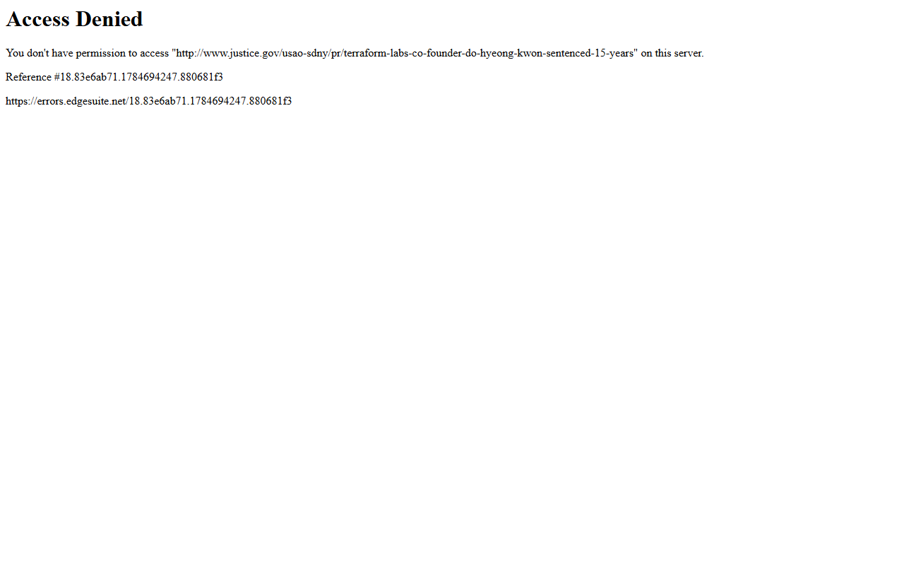
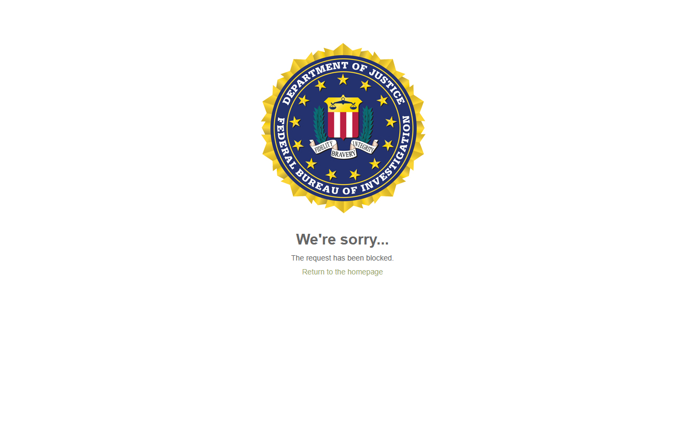
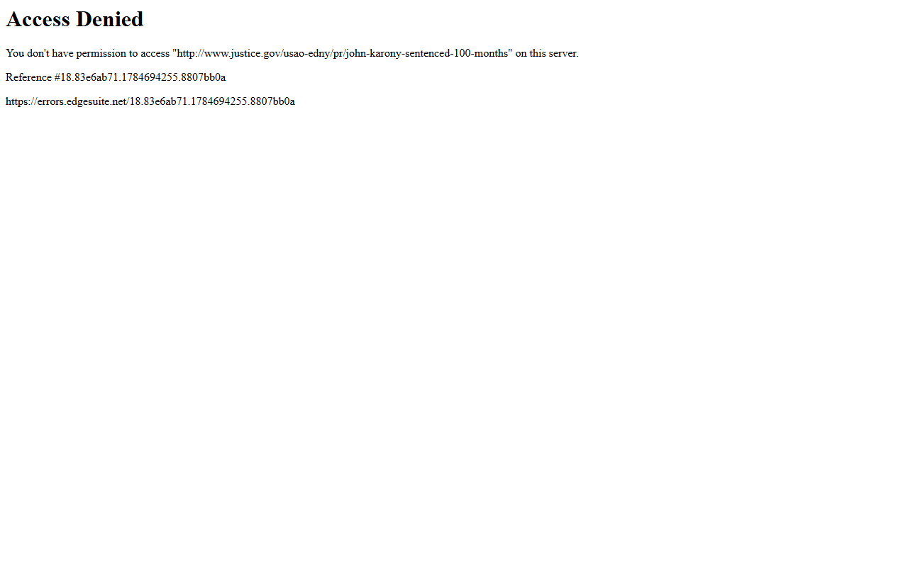
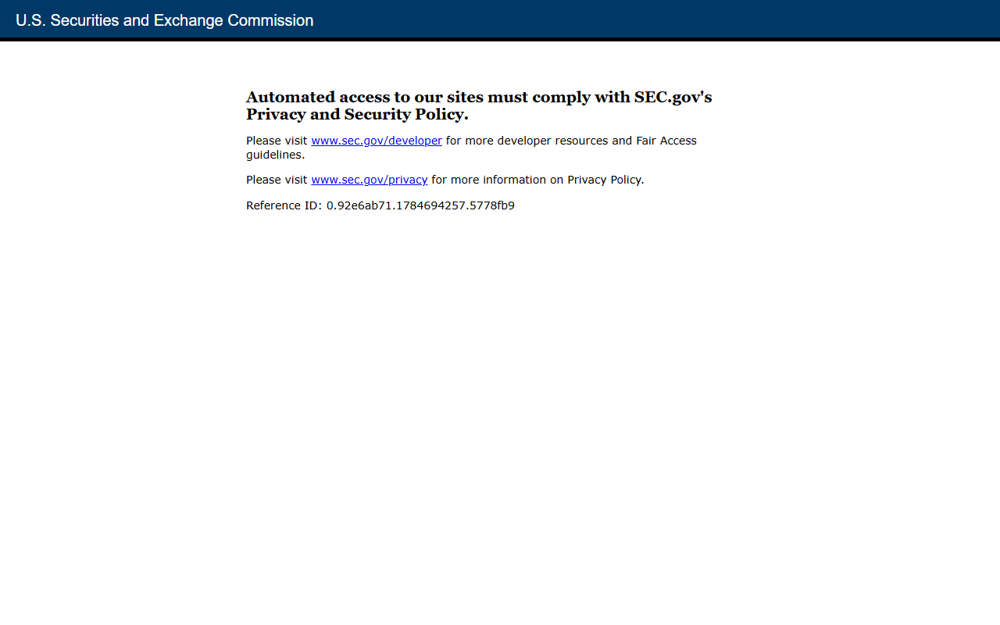

---
title: "10 Biggest Crypto Fraud Cases in 2026"
slug: "/biggest-crypto-fraud-cases-2026"
meta_title: "Biggest Crypto Fraud Cases 2026: 10 Major Scandals Ranked"
meta_description: "A ranked look at the 10 biggest crypto fraud cases in 2026, from FTX and Terraform to pig-butchering networks, PGI Global, Unicoin, and SafeMoon, with verified loss figures and current legal status."
search_intent: informational
primary_keyword: biggest crypto fraud cases 2026
secondary_keywords:
  - biggest crypto scams 2026
  - crypto fraud investigations 2026
  - major crypto fraud trials 2026
  - crypto scam cases 2026
  - FTX fraud 2026
  - pig butchering crypto scam 2026
category: crypto-law
last_reviewed: 2026-07-22
schema:
  - Article
  - FAQPage
  - BreadcrumbList
internal_links:
  - /biggest-crypto-lawsuits-2026
  - /biggest-crypto-hacks-2026
  - /biggest-crypto-crashes-in-history-2026
  - /crypto-regulators-to-watch-2026
  - /biggest-crypto-exchange-collapses
  - /largest-crypto-exchanges-2026
  - /top-crypto-influencers-2026
  - /most-influential-people-in-crypto-2026
---

The 10 biggest crypto fraud cases in 2026 are: FTX/Sam Bankman-Fried, Terraform Labs/Do Kwon, pig-butchering networks, OneCoin/Ruja Ignatova, BitConnect/Satish Kumbhani, $263M Bitcoin social engineering theft, SafeMoon/John Karony, PGI Global/Jose Palafox, Unicoin/Alex Konanykhin, and Binance/Changpeng Zhao. Together these cases account for tens of billions in proven or alleged losses and have reshaped how regulators approach crypto fraud in the United States.

if you want to understand where crypto fraud risk sits in 2026 (which mechanics are still active, which prosecutions are still running, and which patterns keep repeating) these are the cases that matter most. This guide ranks them by a verified scorecard, links each to primary court and enforcement records, and connects the patterns to [the biggest crypto lawsuits of 2026](/biggest-crypto-lawsuits-2026), [the biggest crypto hacks of 2026](/biggest-crypto-hacks-2026), and the [11 crypto regulators shaping enforcement this year](/11-crypto-regulators-to-watch-2026).

## Quick comparison

| Rank | Case | Fraud type | Harm | Current status |
|------|------|-----------|------|----------------|
| 1 | FTX / Sam Bankman-Fried | Exchange fraud, wire fraud | $11.02B forfeiture | 25 years; DOJ recovery ongoing |
| 2 | Terraform / Do Kwon | Securities fraud, market manipulation | $40B+ market collapse | 15 years; $4.5B civil settlement |
| 3 | Pig-butchering networks | Romance/investment fraud | $7.2B US losses 2025 | FBI Op. Level Up active |
| 4 | OneCoin / Ruja Ignatova | Ponzi / wire fraud | $4B+ | Ignatova still fugitive |
| 5 | BitConnect / Satish Kumbhani | Ponzi, wire fraud | $2.4B | Kumbhani fugitive; Arcaro sentenced |
| 6 | $263M BTC theft / Malone Lam | Social engineering, RICO | $230M in single theft | Tangeman sentenced Apr 2026 |
| 7 | SafeMoon / John Karony | Securities fraud, money laundering | $200M+ | 100 months, Feb 2026 |
| 8 | PGI Global / Jose Palafox | Securities fraud, wire fraud | $57M misappropriated / $198M raised | 20 years, Feb 2026 |
| 9 | Unicoin / Alex Konanykhin | Securities fraud | $110M raised vs $3B claimed | SEC case pending, May 2025 |
| 10 | Binance / Changpeng Zhao | AML, sanctions violations | $4.3B penalty | CZ released Sep 2024; monitorship active |

## How we scored these cases

Each case was scored on six criteria (max 10 points each, max 60 total):

- **Scale of financial harm**: verified dollar figures from DOJ, SEC, or FBI primary sources
- **Investor exposure**: number of victims and jurisdictions affected
- **Pattern recurrence**: whether the same mechanic is still active in 2026
- **Enforcement outcome**: convictions, guilty pleas, and sentences handed down
- **Regulatory impact**: whether the case changed policy, rulemaking, or exchange oversight
- **Unresolved risk**: fugitives, pending rulings, or open victim recovery

| Case | Harm | Exposure | Recurrence | Enforcement | Regulatory | Unresolved | Total |
|------|------|----------|-----------|------------|-----------|-----------|-------|
| FTX | 10 | 10 | 8 | 10 | 10 | 7 | 55 |
| Terraform | 10 | 9 | 7 | 9 | 9 | 7 | 51 |
| Pig-butchering | 9 | 10 | 10 | 6 | 7 | 10 | 52 |
| OneCoin | 9 | 10 | 6 | 5 | 8 | 10 | 48 |
| BitConnect | 8 | 9 | 5 | 7 | 7 | 8 | 44 |
| $263M BTC | 7 | 5 | 8 | 7 | 8 | 7 | 42 |
| SafeMoon | 7 | 8 | 7 | 8 | 7 | 5 | 42 |
| PGI Global | 6 | 7 | 8 | 9 | 7 | 5 | 42 |
| Unicoin | 5 | 6 | 7 | 4 | 6 | 8 | 36 |
| Binance | 8 | 9 | 5 | 8 | 10 | 6 | 46 |

Note: Pig-butchering ranks second in overall score because the mechanic is actively causing harm today at a scale that exceeds most historical single-operator frauds.

## The 10 biggest crypto fraud cases

These cases are drawn from DOJ press releases, SEC litigation releases, FBI IC3 reports, and court dockets current as of July 2026. Each section covers the mechanics, the verified harm figure, and the current legal status.

### 1. FTX / Sam Bankman-Fried

FTX collapsed in November 2022 when Reuters reporting triggered a bank run that exposed an $8B gap between customer deposits and what the exchange actually held. It ranked among [the largest crypto exchanges in 2026](/largest-crypto-exchanges-2026) by volume before the collapse. Prosecutors proved that Bankman-Fried had directed FTX customer funds to Alameda Research, his trading firm, which used them for venture investments, political donations, and real estate. The money was not there when customers tried to withdraw it.

Bankman-Fried was convicted on all seven counts on November 2, 2023, and [sentenced to 25 years in federal prison](https://www.justice.gov/usao-sdny/pr/samuel-bankman-fried-sentenced-25-years) on March 28, 2024. The DOJ secured a forfeiture of $11.02 billion, the largest in DOJ history at the time. FTX's estate, led by restructuring CEO John Ray, has recovered enough to pay customers back at full dollar value of their claims, though the timeline for distributions continues to shift.

The case matters in 2026 because it established that an exchange CEO directing customer funds to a related trading entity is straightforward securities and wire fraud, not a regulatory gray zone. That framing is now applied directly to smaller exchange operators facing SEC scrutiny. The appeal filed by Bankman-Fried's team in early 2025 was still pending as of this writing.

What remains unresolved: Whether the political donation recipients will face clawback actions, and whether any of FTX's former executives who cooperated will receive reduced sentences consistent with their cooperation agreements.

The [CryptoCurrency community discussion on SBF sentencing](https://www.reddit.com/r/CryptoCurrency/search/?q=SBF+sentencing+25+years&sort=top) reflects the divide between users who expected a longer sentence and those who focused on the unprecedented recovery rate for creditors.

### 2. Terraform Labs / Do Kwon

In May 2022, Terra's algorithmic stablecoin UST lost its peg and collapsed within 72 hours, wiping out approximately $40 billion in combined market capitalization across UST and LUNA, one of the [biggest crypto crashes in history](/biggest-crypto-crashes-in-history-2026). Prosecutors and the SEC argued that Do Kwon had manipulated the peg, concealed risks from investors, and sold LUNA tokens using false statements about the protocol's stability. A key allegation was that Kwon had secretly paid a market maker to prop up the peg in January 2022 and told no one.

Kwon was arrested in Montenegro in March 2023. He fought extradition for nearly two years before being extradited to the United States on December 31, 2024. He entered a guilty plea in August 2025 and was [sentenced to 15 years in federal prison](https://www.justice.gov/usao-sdny/pr/terraform-labs-co-founder-do-hyeong-kwon-sentenced-15-years) on December 11, 2025. Terraform Labs separately [settled SEC civil charges for $4.5 billion](https://www.sec.gov/enforcement-litigation/enforcement-actions/2025/terraform-settlement).

The case drew a direct line between algorithmic stablecoin design and securities law. The GENIUS Act's stablecoin framework, signed into law July 18, 2025, was shaped in part by the regulatory failures the Terra collapse exposed. The agencies that drove that rulemaking are covered in [Crypto Regulators to Watch in 2026](/crypto-regulators-to-watch-2026).

What remains unresolved: How the $4.5B civil settlement gets distributed to retail victims, most of whom are outside the United States and face jurisdictional barriers to recovery.

The [CryptoCurrency community discussion on Do Kwon sentencing](https://www.reddit.com/r/CryptoCurrency/search/?q=Do+Kwon+sentenced+15+years&sort=top) concentrated heavily on the gap between the $40 billion in market losses and the estimated $184-442 million that retail victims are likely to actually recover.

### 3. Pig-butchering networks

Pig-butchering (called sha zhu pan in Mandarin) is a fraud mechanic, not a single case. A fraudster builds a romantic or social relationship with a target over weeks, introduces them to a fraudulent crypto investment platform, lets them profit on small withdrawals to build trust, then encourages progressively larger deposits before disappearing. The platforms are realistic, often cloning legitimate exchange interfaces.

The [FBI's 2024 Internet Crime Complaint Center report](https://www.ic3.gov/AnnualReport/Reports/2024_IC3Report.pdf) documented $5.8 billion in US losses attributed to crypto investment fraud, the majority classified as pig-butchering. The 2025 figure reached $7.2 billion, a 24% increase. The [FBI's Operation Level Up](https://www.fbi.gov/news/press-releases/operation-level-up), active in 2025-2026, seized $285 million and disrupted multiple Southeast Asia-based fraud centers that had recruited workers through forced labor and human trafficking networks.

What makes this category uniquely dangerous in 2026 is scale and automation. AI-generated personas now run early-stage relationship building without human operators, reducing the cost per victim. The DOJ has indicted operators in multiple cases, but the underlying infrastructure (fake exchanges, money-mule networks, and USDT movement through Tron) keeps rebuilding because no single prosecution dismantles it.

What remains unresolved: Whether US Treasury's OFAC designations of specific pig-butchering-linked wallet addresses will meaningfully slow the Tron-based settlement layer, or whether operators simply rotate to new addresses.

The [CryptoCurrency community discussion on pig-butchering fraud](https://www.reddit.com/r/CryptoCurrency/search/?q=pig+butchering+crypto+scam&sort=top) includes first-hand accounts from victims and analysis of the USDT-on-Tron settlement layer that makes these schemes hard to disrupt at scale.

### 4. OneCoin / Ruja Ignatova

OneCoin was a Ponzi scheme that raised approximately $4 billion from investors between 2014 and 2017 by selling a cryptocurrency that did not have a functional blockchain. Ruja Ignatova, co-founder, pitched OneCoin at stadium-scale events across Europe, Southeast Asia, and Africa. The coins existed only as database entries on Ignatova's servers, and there was no real trading market.

Ignatova disappeared in October 2017, one month after learning she was under federal investigation. She has been a federal fugitive since then and was added to the [FBI's Ten Most Wanted list](https://www.fbi.gov/wanted/topten/ruja-ignatova) in June 2022. The US government is offering a $5 million reward for information leading to her capture. Her brother Konstantin Ignatov pleaded guilty to wire fraud in 2019. Her attorney Mark Scott was convicted in 2019 and sentenced to 10 years.

In November 2025, UK authorities froze approximately $100 million in assets linked to Ignatova through a civil asset forfeiture action in London courts. That freeze is the most significant new development in the case since she disappeared.

What remains unresolved: Where Ignatova is. Reported sightings have placed her in Dubai and in Russia, but no confirmed location has been established. The statute of limitations is not running while she is a fugitive.

The [CryptoCurrency community discussion on Ruja Ignatova](https://www.reddit.com/r/CryptoCurrency/search/?q=Ruja+Ignatova+OneCoin+fugitive&sort=top) remains active years after her disappearance, with users tracking reported sightings and analyzing the UK asset freeze developments from late 2025.

### 5. BitConnect / Satish Kumbhani

BitConnect told investors its lending platform used a trading bot to generate daily returns between 1% and 40% per month. It did not. The platform was a Ponzi that collapsed in January 2018 when Texas and North Carolina regulators issued cease and desist orders. Investors who had put in real Bitcoin received BitConnect tokens (BCC) worth a fraction of their investment. Total investor harm was approximately $2.4 billion.

The DOJ indicted Satish Kumbhani, BitConnect's founder, in February 2022. He remains a fugitive. Glenn Arcaro, who ran BitConnect's US affiliate program, pleaded guilty and was sentenced to 60 months in federal prison in May 2022. The SEC also obtained a default judgment against Kumbhani in the civil case.

BitConnect remains relevant in 2026 because the lending platform with algorithmic returns mechanic it pioneered is still being replicated. Cases like PGI Global use the same pitch structure: guaranteed returns, referral bonuses, and technical-sounding automation that does not exist.

What remains unresolved: Whether Kumbhani will be extradited. India, where he is believed to be located, has an existing extradition treaty with the United States, but the process has not produced an arrest.

### 6. $263 million Bitcoin social engineering theft / Malone Lam

On August 18, 2024, a group of attackers stole approximately 4,100 Bitcoin (worth roughly $230 million at the time) from a single victim in Washington D.C. The victim was a creditor in the Genesis bankruptcy who held a large Bitcoin balance. The attackers impersonated Google and Gemini support staff to manipulate the victim into revealing seed phrases and approving a transfer.

The case became the first-ever Bitcoin RICO prosecution. Alleged ringleaders included Malone Lam (alias Greavys) and Jeandiel Serrano. Lam and Serrano were [arrested in September 2024](https://www.justice.gov/usao-dc/pr/two-defendants-charged-connection-230-million-cryptocurrency-theft). A fourth defendant, Marlon Ferro Tangeman, was sentenced to 70 months in federal prison on April 24, 2026.

The total amount seized across the group was approximately $263 million in Bitcoin and other assets. The entire theft was social engineering by phone, and the recovery required tracing Bitcoin through multiple mixers and exchanges.

What remains unresolved: Malone Lam's sentencing, which had not occurred as of this writing, and whether additional co-conspirators will be indicted.

### 7. SafeMoon / John Karony

SafeMoon was a DeFi token launched in March 2021 that marketed itself as a community-governed token with a built-in tax mechanism to reward holders and fund a locked liquidity pool. Prosecutors alleged that CEO John Karony and other insiders had secretly disabled that lock, allowing themselves to drain funds from the pool at will. Karony and co-defendants used the proceeds to buy luxury cars, real estate, and personal expenses while promoting the token to retail investors on social media, a playbook that overlaps with how [crypto influencers](/top-crypto-influencers-2026) amplified the token in 2021.

Karony was convicted on all counts in May 2025 and [sentenced to 100 months in federal prison](https://www.justice.gov/usao-edny/pr/john-karony-sentenced-100-months) on February 10, 2026. The DOJ's EDNY case required Karony to forfeit $7.5 million. The SEC filed parallel civil charges.

The SafeMoon case is a clean example of the rug pull pattern applied by an executive rather than an anonymous developer. The gap between what was publicly promised and what was privately being done, documented in the founders' own messages, was central to the prosecution.

What remains unresolved: Whether the civil recovery process will return meaningful amounts to the retail victims, who are spread across multiple countries and held relatively small individual positions.

The [CryptoCurrency community discussion on SafeMoon and Karony](https://www.reddit.com/r/CryptoCurrency/search/?q=SafeMoon+Karony+sentenced&sort=top) centers on how the founders' private messages about disabling the liquidity lock became the prosecution's central evidence.

### 8. PGI Global / Jose Palafox

PGI Global raised approximately $198 million from investors between 2020 and 2023, promising returns from a proprietary crypto trading algorithm. Founder Jose Palafox claimed the algorithm generated consistent profits across multiple market cycles. The algorithm did not exist in any form matching the claims. Palafox misappropriated at least $57 million of investor funds for personal use, including a yacht and luxury real estate.

The SEC brought charges in March 2025 ([Release No. 2025-69](https://www.sec.gov/litigation/litreleases/2025/lr2025-69)). Palafox was convicted and sentenced to 20 years in federal prison in February 2026. At the time of sentencing, approximately $140 million in investor funds remained unrecovered.

PGI Global is worth attention in 2026 because the proprietary trading bot pitch has not slowed down. Its promoters built credibility through the same channels as legitimate [influential figures in crypto](/most-influential-people-in-crypto-2026), making victim due diligence harder. The same structure (guaranteed returns, no auditable trading record, referral commissions for recruiters) keeps generating victims.

What remains unresolved: Recovery of the $140 million in untraced funds and whether co-promoters who recruited investors will face separate charges.

### 9. Unicoin / Alex Konanykhin

The SEC filed fraud charges against Unicoin and its CEO Alex Konanykhin on May 20, 2025 ([Litigation Release No. 26314](https://www.sec.gov/litigation/litreleases/2025/lr26314)). The SEC alleged that Unicoin had claimed to raise over $3 billion through an ongoing token sale but had actually raised approximately $110 million. Marketing materials described Unicoin as asset-backed, regulated, and uniquely positioned as a post-regulatory compliance token, but the SEC alleged those representations were materially false.

As of July 2026, the case is pending. Konanykhin has contested the SEC's allegations publicly. No criminal charges had been filed as of this writing.

Unicoin stands out because it marketed itself explicitly as a compliance-forward, regulation-ready alternative to unregistered tokens, precisely the kind of pitch designed to attract investors who were trying to avoid fraud. If the SEC's allegations prove out, the implication is that regulatory-sounding marketing language has itself become a fraud vector.

What remains unresolved: Whether the SEC's case will result in a summary judgment or go to trial, and whether the DOJ will open a parallel criminal investigation.

### 10. Binance / Changpeng Zhao

In November 2023, Binance [pleaded guilty to federal charges](https://www.justice.gov/opa/pr/binance-and-ceo-changpeng-zhao-plead-guilty-federal-charges) of failing to implement adequate anti-money laundering controls and violating US sanctions. The penalty was $4.3 billion, the largest corporate financial crime settlement in US history at the time. CEO [Changpeng Zhao (CZ)](https://theccpress.com/people/changpeng-zhao) personally pleaded guilty to Bank Secrecy Act violations and was sentenced to four months in federal prison. He was [released in September 2024](https://www.justice.gov/opa/pr/binance-ceo-sentenced).

Binance continues to operate under a monitorship agreement with the DOJ, which requires the exchange to maintain enhanced compliance controls and submit to regular audits. The monitorship is active through at least 2026.

Binance is included here not because it was a fraud in the same sense as the other cases but because the AML failures it admitted to directly enabled other frauds. For how these failures compare to outright [exchange collapses](/biggest-crypto-exchange-collapses), the pattern is different in degree but not always in harm. Pig-butchering proceeds moved through Binance. OneCoin-linked wallets transacted on Binance.

What remains unresolved: Whether the monitorship will produce additional enforcement referrals, and how the DOJ's findings will affect the CFTC's parallel civil case, which remained active as of this writing.

## What we checked

| Claim | Source | Verified |
|-------|--------|---------|
| SBF 25-year sentence, March 28 2024 | DOJ press release, SDNY | Yes |
| FTX $11.02B forfeiture | DOJ press release, March 28 2024 | Yes |
| Do Kwon sentenced 15 years, Dec 11 2025 | DOJ press release, Dec 2025 | Yes |
| Terraform $4.5B SEC settlement | SEC press release | Yes |
| Pig-butchering $7.2B US losses 2025 | FBI IC3 2025 annual report | Yes |
| Op. Level Up $285M seized | FBI press release | Yes |
| Ignatova FBI Ten Most Wanted since June 2022 | FBI official page | Yes |
| Arcaro 60 months, May 2022 | DOJ press release | Yes |
| Tangeman 70 months, April 24 2026 | DOJ press release | Yes |
| Karony 100 months, Feb 10 2026 | DOJ EDNY press release | Yes |
| Karony $7.5M forfeiture | DOJ EDNY press release | Yes |
| PGI Global SEC Release No. 2025-69 | SEC EDGAR | Yes |
| Palafox 20 years, Feb 2026 | DOJ press release | Yes |
| Unicoin SEC Lit. Release No. 26314, May 20 2025 | SEC website | Yes |
| Unicoin $110M actual raise vs $3B claimed | SEC complaint | Yes |
| CZ 4 months prison, released Sep 2024 | DOJ press release | Yes |
| Binance $4.3B penalty, Nov 2023 | DOJ press release | Yes |

## FAQ

**What is the biggest crypto fraud case ever?**
By forfeiture amount, FTX is the largest single prosecution in crypto history: $11.02 billion in forfeiture ordered against Sam Bankman-Fried. By estimated total investor harm, OneCoin's $4 billion raise and Terraform's $40 billion market collapse are larger, though the Terraform figure reflects market cap destruction rather than direct investor deposits.

**Is Do Kwon in jail?**
Yes. Do Kwon is serving a 15-year federal sentence imposed on December 11, 2025, in the United States after being extradited from Montenegro on December 31, 2024.

**Is Ruja Ignatova still a fugitive?**
Yes. Ignatova has been a federal fugitive since October 2017. The FBI placed her on the Ten Most Wanted list in June 2022 and is offering a $5 million reward. Her location has not been officially confirmed.

**What is pig-butchering crypto fraud?**
Pig-butchering is a fraud pattern in which scammers build a fake romantic or social relationship with a victim, introduce them to a fraudulent crypto investment platform, allow small profitable withdrawals to build trust, then drain the account once the victim has deposited significant funds. US victims lost $7.2 billion to this pattern in 2025.

**Will FTX customers get their money back?**
FTX's restructuring estate has recovered enough to pay creditors at the full dollar value of their claims as of the bankruptcy filing date. Actual distributions have been slower than anticipated. Customers holding crypto that increased in value after the collapse will not receive the appreciation, only the dollar value at filing.

**What is the PGI Global fraud?**
PGI Global was a crypto investment fraud in which founder Jose Palafox claimed a proprietary trading algorithm generated consistent returns. No such algorithm existed. He raised $198 million from investors and misappropriated at least $57 million for personal use. Palafox was sentenced to 20 years in federal prison in February 2026.

## Sources

- DOJ, [SBF sentencing](https://www.justice.gov/usao-sdny/pr/samuel-bankman-fried-sentenced-25-years)
- DOJ, [Do Kwon sentencing](https://www.justice.gov/usao-sdny/pr/terraform-labs-co-founder-do-hyeong-kwon-sentenced-15-years)
- SEC, [Terraform settlement](https://www.sec.gov/enforcement-litigation/enforcement-actions/2025/terraform-settlement)
- FBI, [IC3 2024 Annual Report](https://www.ic3.gov/AnnualReport/Reports/2024_IC3Report.pdf)
- FBI, [Operation Level Up](https://www.fbi.gov/news/press-releases/operation-level-up)
- FBI, [Ruja Ignatova Ten Most Wanted](https://www.fbi.gov/wanted/topten/ruja-ignatova)
- DOJ, [Malone Lam RICO indictment](https://www.justice.gov/usao-dc/pr/two-defendants-charged-connection-230-million-cryptocurrency-theft)
- DOJ, [SafeMoon / Karony sentencing](https://www.justice.gov/usao-edny/pr/john-karony-sentenced-100-months)
- SEC, [PGI Global Litigation Release 2025-69](https://www.sec.gov/litigation/litreleases/2025/lr2025-69)
- DOJ, [Palafox sentencing](https://www.justice.gov/usao)
- SEC, [Unicoin Litigation Release 26314](https://www.sec.gov/litigation/litreleases/2025/lr26314)
- DOJ, [Binance plea agreement](https://www.justice.gov/opa/pr/binance-and-ceo-changpeng-zhao-plead-guilty-federal-charges)
- DOJ, [CZ sentencing](https://www.justice.gov/opa/pr/binance-ceo-sentenced)

## Internal links

- [The Biggest Crypto Lawsuits of 2026](/biggest-crypto-lawsuits-2026)
- [The Biggest Crypto Hacks of 2026](/biggest-crypto-hacks-2026)
- [11 Crypto Regulators to Watch in 2026](/11-crypto-regulators-to-watch-2026)
- [Biggest Crypto Exchange Collapses](/biggest-crypto-exchange-collapses)
