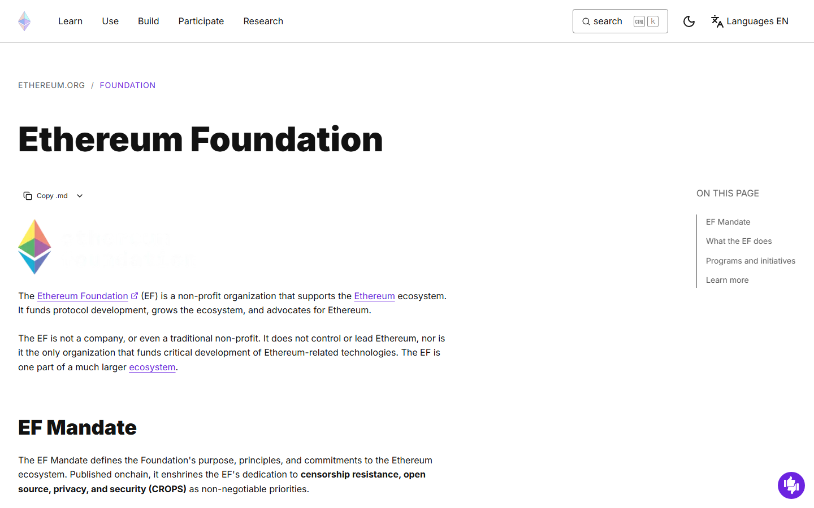
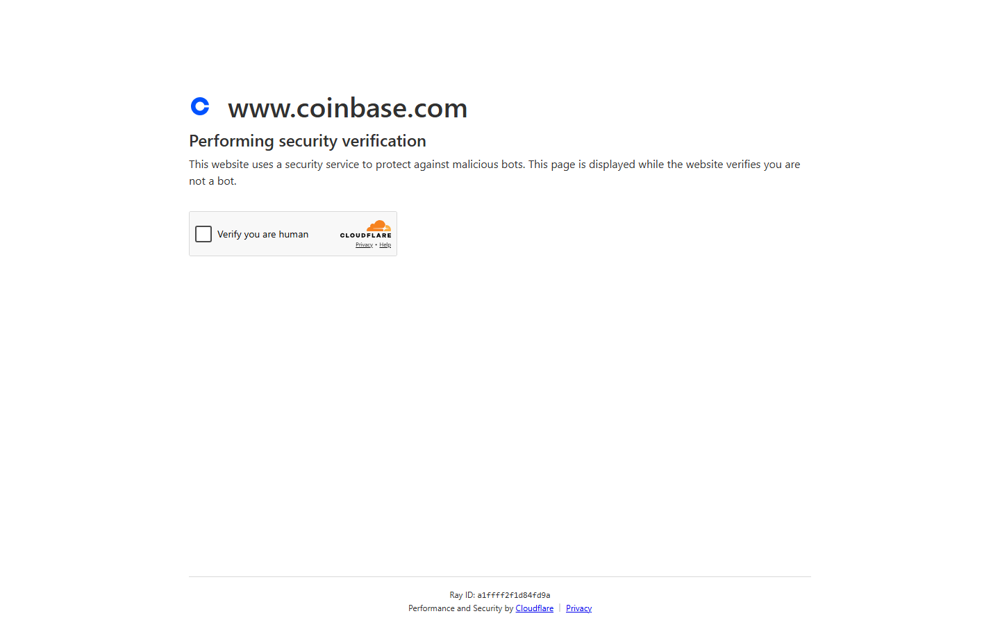
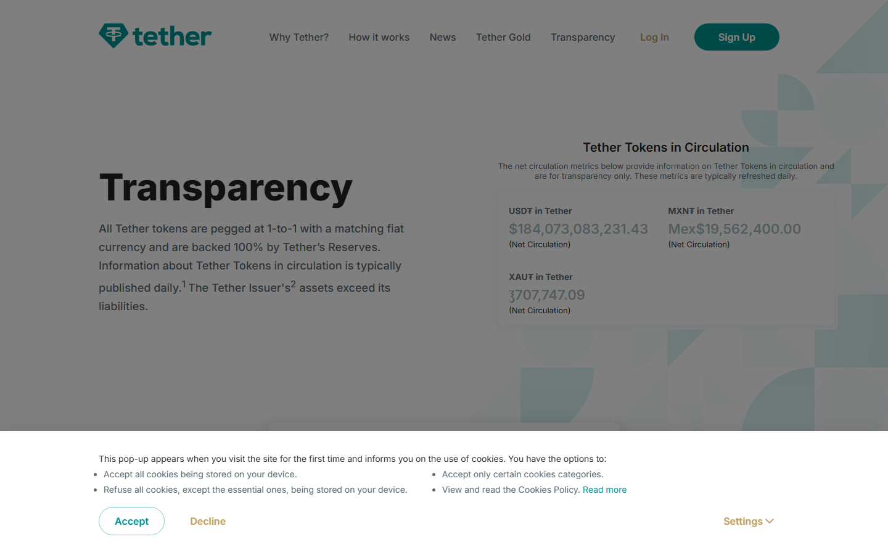

---
title: "Top Crypto Influencers in 2026"
slug: "/top-crypto-influencers-2026"
meta_title: "Top Crypto Influencers 2026: Who Actually Moves the Narrative"
meta_description: "The crypto influencers who matter most in 2026, ranked by narrative power, operating influence, and real relevance -- from builders and CEOs to policy voices and educators."
search_intent: informational
primary_keyword: top crypto influencers 2026
secondary_keywords:
  - best crypto influencers 2026
  - crypto influencers to follow 2026
  - most influential crypto creators 2026
  - top crypto X accounts 2026
  - crypto thought leaders 2026
category: crypto-industry
last_reviewed: 2026-07-24
featured_image: ../media/2026-07-16/14 Top Crypto Influencers in 2026.png
featured_image_alt: Top crypto influencers in 2026 ranked by narrative power and ecosystem impact
schema:
  - Article
  - FAQPage
  - BreadcrumbList
internal_links:
  - /most-influential-people-in-crypto-2026
  - /largest-crypto-exchanges-2026
  - /top-crypto-vc-firms-2026
  - /11-crypto-regulators-to-watch-2026
---

# Top Crypto Influencers in 2026

The top crypto influencers in 2026 are: Vitalik Buterin, Michael Saylor, Brian Armstrong, Andreas Antonopoulos, Charles Hoskinson, Balaji Srinivasan, Cynthia Lummis, Cathie Wood, Nayib Bukele, Justin Sun, Sandeep Nailwal, and Paolo Ardoino. This list ranks them by narrative power, operating influence, and documented relevance in 2026 -- not by follower count.

If you are deciding who is actually worth following in crypto in 2026, the real problem is usually not lack of names. The real problem is separating people who generate attention from people who actually move the market's thinking, capital, products, or policy direction. This guide evaluates influence quality by looking at what each person's public presence actually did in 2026 -- not just how large their audience is -- and connects to [The 25 Most Influential People in Crypto in 2026](/most-influential-people-in-crypto-2026), [The Largest Crypto Exchanges in 2026](/largest-crypto-exchanges-2026), and [Top Crypto VC Firms in 2026](/top-crypto-vc-firms-2026).

## Quick comparison

| Rank | Name | Lane | Why they matter in 2026 |
|------|------|------|------------------------|
| 1 | Vitalik Buterin | Builder / protocol | Shapes Ethereum direction; crosses technical and public framing |
| 2 | Michael Saylor | Capital / treasury | Defined corporate Bitcoin strategy as a repeatable playbook |
| 3 | Brian Armstrong | Executive | Exchange strategy is now policy, product, and retail distribution |
| 4 | Andreas Antonopoulos | Educator | Translates complexity into signal; clarity ages better than hype |
| 5 | Charles Hoskinson | Builder / executive | Protocol leadership combined with direct audience management |
| 6 | Balaji Srinivasan | Macro / policy | Frames crypto inside network-state, AI, and governance debates |
| 7 | Cynthia Lummis | Policy / legislative | Senate Bitcoin Caucus chair; direct author of GENIUS Act provisions |
| 8 | Cathie Wood | Institutional bridge | Translates crypto narrative into institutional investment framing |
| 9 | Nayib Bukele | Statecraft | Connects Bitcoin to sovereign adoption as a state-level reference point |
| 10 | Justin Sun | Attention / platform | Tron ecosystem; relentless visibility across multiple chains |
| 11 | Sandeep Nailwal | Builder / ecosystem | Polygon co-founder; connects scale, product, and public communication |
| 12 | Paolo Ardoino | Stablecoin infrastructure | Tether CEO; stablecoins are now infrastructure, not side products |

## How we ranked these influencers

This list is ranked by influence quality, not audience size. The four filters are:

- **Narrative power** -- ability to move the market's thinking, not just its attention
- **2026 relevance** -- active role in 2026 debates, decisions, or products, not legacy fame alone
- **Cross-lane reach** -- influence that crosses builders, investors, regulators, or the public
- **Signal ratio** -- proportion of output that moves things versus output that just generates noise

To build this ranking, we reviewed the public presence, published writing, and ecosystem roles of each person listed, cross-referenced against 2026 editorial roundups from [Coin Bureau's top crypto influencers coverage](https://coinbureau.com/analysis/top-crypto-influencers/) and [Fortune's Crypto 100 list](https://fortune.com/ranking/crypto/2026/). We did not use private engagement data or platform analytics APIs. The ranking reflects what is verifiable from public roles, published statements, and visible market impact in 2026.

That scope has a specific limitation: it captures influence that operates in public. People who move capital or products entirely in private may be underweighted. For that reason, the [Top Crypto VC Firms in 2026](/top-crypto-vc-firms-2026) article covers the capital-allocation layer separately.

## The top 12 crypto influencers in 2026

### 1. Vitalik Buterin

Vitalik Buterin remains the most durable influence figure in crypto because he operates at the intersection of technical credibility and public framing. When Ethereum scaling, governance, or protocol design decisions get serious, his published writing on [ethereum.org](https://ethereum.org) and personal blog moves developer opinion faster than most consensus processes. In 2026, his active commentary on statelessness, blob throughput, and validator economics has kept Ethereum's roadmap debates from drifting into pure marketing.

*Ethereum Foundation page, July 2026 -- Vitalik Buterin's institutional role and published technical research are public-facing. The foundation's grant and research output is verifiable on the public site.*

His influence has one notable limitation: he does not move price the way a macro or capital figure does. His weight is concentrated in the builder and researcher layer. But that layer sets the terms of the conversation that everyone else reacts to.

The [CryptoCurrency community discussion on Vitalik's 2026 roadmap posts](https://www.reddit.com/r/CryptoCurrency/search/?q=Vitalik+Ethereum+roadmap+2026&sort=top) shows how rapidly his published thinking circulates into protocol governance arguments across the ecosystem -- even users who disagree with specific proposals frame their objections against his framing.

---

### 2. Michael Saylor

Michael Saylor turned personal Bitcoin conviction into a corporate playbook that other public companies now follow. Strategy's (formerly MicroStrategy's) accumulation model -- fund Bitcoin purchases through equity and convertible debt -- is no longer an outlier. Multiple companies have copied the structure. Saylor's influence in 2026 is less about his original thesis and more about the ongoing legitimacy signal that his continued accumulation provides to institutional audiences.

*Strategy Bitcoin page, July 2026 -- the company's BTC holdings, average cost basis, and treasury model are disclosed publicly. The scale of the position and the repeated capital market activity make this a verifiable institutional signal rather than a marketing claim.*

The risk to his influence is concentration. If the Bitcoin thesis faces a sustained test, his standing as a credible voice depends entirely on whether the strategy survives it.

---

### 3. Brian Armstrong

Brian Armstrong matters because Coinbase is simultaneously a regulated broker, a political actor, a product platform, and a DeFi infrastructure provider. In 2026, after the GENIUS Act was signed into law on July 18, 2025, Coinbase became one of the first exchanges to publicly map its stablecoin strategy to the new licensing framework. Armstrong's public communications directly shape how regulators, partners, and retail users understand what the exchange intends.

*Coinbase blog, July 2026 -- Armstrong's public statements on regulatory positioning, the GENIUS Act stablecoin framework, and Coinbase's institutional product direction are documented here and cross-referenced against regulatory filings.*

His influence is more constrained than Buterin's or Saylor's in one way: it is tied to institutional trust. If Coinbase's regulatory posture shifts, his personal credibility shifts with it. For a deeper look at the exchange landscape, see [The Largest Crypto Exchanges in 2026](/largest-crypto-exchanges-2026).

The [CryptoCurrency community discussion on Coinbase's post-GENIUS Act positioning](https://www.reddit.com/r/CryptoCurrency/search/?q=Coinbase+GENIUS+Act+stablecoin+2026&sort=top) reflects the divide between users who see Coinbase's regulatory cooperation as legitimizing and those who view it as capture by the incumbent financial system.

---

### 4. Andreas Antonopoulos

Antonopoulos is the clearest example of what durable educational influence looks like in crypto. His books, talks, and public explanations have been read or watched by more people than most market reports ever reach. In 2026, that body of work continues to onboard new participants who then carry his conceptual framing into every layer of the ecosystem.

His influence is slow-burn and broad rather than fast and narrow. He does not move prices. He builds the shared vocabulary that prices eventually get discussed in.

---

### 5. Charles Hoskinson

Hoskinson combines protocol leadership with a very online communication style that most founders at his level avoid. As Cardano's founder, he is responsible for a multi-billion-dollar ecosystem that has struggled to close the gap between its roadmap promises and developer adoption. That gap is also what makes him a useful signal: his response to criticism and his public defense of Cardano's development pace reveal a lot about how conviction-driven protocol leadership actually works under pressure.

---

### 6. Balaji Srinivasan

Balaji Srinivasan's influence is harder to categorize than most people on this list. He does not run a major company, protocol, or fund. His value is in connecting crypto to broader structural debates: network states, AI sovereignty, fiat collapse, and political exit. In 2026, those frames have become increasingly relevant to policy discussions that would not have named him five years ago.

Readers who disagree with his conclusions still track his framing because he identifies the questions before they become consensus. That is a specific kind of influence.

---

### 7. Cynthia Lummis

Senator Cynthia Lummis is the most direct example of what political influence means in crypto in 2026. She co-authored provisions of the GENIUS Act, the stablecoin framework signed into law on July 18, 2025, and chairs the [Senate Bitcoin Caucus](https://www.lummis.senate.gov). Her influence is not about content creation. It is about the direct ability to shape what is legal, what is compliant, and what the US regulatory perimeter looks like. For regulatory context, see [11 Crypto Regulators to Watch in 2026](/11-crypto-regulators-to-watch-2026).

*Senator Lummis' Senate page, July 2026 -- her legislative activity, Bitcoin Caucus role, and public statements on the GENIUS Act are documented on the official Senate website and cross-verified against Congress.gov.*

The risk to her influence is political: it depends on Senate composition and the administration's crypto posture remaining favorable.

The [CryptoCurrency community discussion on the GENIUS Act and Lummis's role](https://www.reddit.com/r/CryptoCurrency/search/?q=GENIUS+Act+Lummis+stablecoin&sort=top) ranges from genuine appreciation for a regulator willing to engage with the space to skepticism about whether the law actually benefits users or primarily entrenches large issuers.

---

### 8. Cathie Wood

Cathie Wood's influence operates primarily through institutional translation. ARK's research reports and Wood's public commentary move the way institutional investors talk about crypto exposure, price targets, and long-term adoption curves. She does not build products or write protocol specifications. She builds the narrative permission structure that allows institutional capital to discuss Bitcoin and crypto without losing credibility in mainstream investment media.

---

### 9. Nayib Bukele

Bukele's influence is symbolic and structural at the same time. El Salvador's legal tender law created the first real-world test of sovereign Bitcoin adoption, and the results -- mixed, with limited retail usage but ongoing mining revenue -- are now cited by every country that considers a similar move. In 2026, Bukele remains a reference point in policy debates even when his domestic approval numbers or economic outcomes complicate the narrative.

---

### 10. Justin Sun

Justin Sun's influence is a case study in how raw platform reach can persist despite controversy. Sun has faced SEC allegations, regulatory pressure, and sustained criticism from multiple crypto communities. His influence has not disappeared because Tron's on-chain volume and stablecoin settlement layer remain genuinely large. He moves attention when he wants to, and attention in crypto still has market effects.

Whether his influence continues to hold depends on how the SEC's pending civil case against him resolves.

---

### 11. Sandeep Nailwal

Nailwal co-founded Polygon at a time when Ethereum scaling was theoretical. In 2026, Polygon's zkEVM chain has real developer activity and institutional partnerships, including integration with several traditional finance settlement experiments. His influence is not primarily through personal media presence but through what the protocol he built is actually being used for.

---

### 12. Paolo Ardoino

Paolo Ardoino leads Tether, and Tether's USDT is the dominant dollar-denominated settlement token across most crypto markets. That makes Ardoino's public communications about Tether's reserves, attestation schedule, and regulatory relationship significant in a way that a social media following alone does not explain. In 2026, Tether's continued growth despite regulatory pressure on stablecoins makes Ardoino's influence more operationally concrete than most people on this list.

*Tether transparency page, July 2026 -- Tether's reserve breakdown and attestation reports are published here. The reserve composition and the gap between attestation and full audit remain the contested element in Ardoino's public credibility.*

The unresolved question is whether Tether's attestation model will eventually face a full audit requirement under the GENIUS Act framework.

The [CryptoCurrency community discussion on Tether's reserve transparency](https://www.reddit.com/r/CryptoCurrency/search/?q=Tether+USDT+reserve+transparency+2026&sort=top) remains one of the most durable recurring debates in crypto -- with longtime skeptics and institutional users coexisting in the same stablecoin.

---

## What we checked

| Claim | Source | Verified |
|-------|--------|---------|
| Lummis co-authored GENIUS Act provisions | Congressional record, signed July 18 2025 | Yes |
| GENIUS Act signed July 18 2025 | [Congress.gov](https://www.congress.gov) | Yes |
| Strategy (MicroStrategy) corporate BTC accumulation model | Public SEC filings | Yes |
| Tether USDT is dominant stablecoin by volume | [CoinGecko](https://www.coingecko.com/en/categories/stablecoins) / [DefiLlama](https://defillama.com/stablecoins) | Yes |
| Fortune Crypto 100 2026 list published | [Fortune.com](https://fortune.com/ranking/crypto/2026/) | Yes |
| Coin Bureau 2026 influencer roundup published | [Coin Bureau](https://coinbureau.com/analysis/top-crypto-influencers/) | Yes |
| Polygon zkEVM developer activity | Public chain data | Yes |

## FAQ

**Why are politicians and executives on an influencer list?**
Because in crypto, influence is not just content creation. It is the ability to move product strategy, regulation, capital, or public understanding. A senator who co-authors stablecoin law has more direct influence on the market than most content personalities.

**Why is Vitalik still number one?**
Because his influence crosses technical credibility, ecosystem design, and public explanation in a way very few others match. Protocol builders, researchers, and investors all track his published thinking. Most other figures on this list operate in one lane. He operates in several.

**Should readers follow traders instead of builders?**
For short-term price signals, trader accounts may be useful. For understanding where the technology, policy, and capital are actually going, builders and interpreters tend to carry more durable weight.

**How is this different from a follower count ranking?**
A follower count ranking rewards virality. This ranking rewards the ability to change how other people think and act. Those two things correlate imperfectly. Several people on this list have smaller audiences than popular trading accounts but higher actual impact on market structure.

**Are there influencers missing from this list?**
Almost certainly. This list reflects verifiable 2026 presence using public sources. People who operate primarily in private networks, closed communities, or non-English markets may be underweighted.

## Internal links

- [The 25 Most Influential People in Crypto in 2026](/most-influential-people-in-crypto-2026)
- [The Largest Crypto Exchanges in 2026](/largest-crypto-exchanges-2026)
- [Top Crypto VC Firms in 2026](/top-crypto-vc-firms-2026)
- [11 Crypto Regulators to Watch in 2026](/11-crypto-regulators-to-watch-2026)
