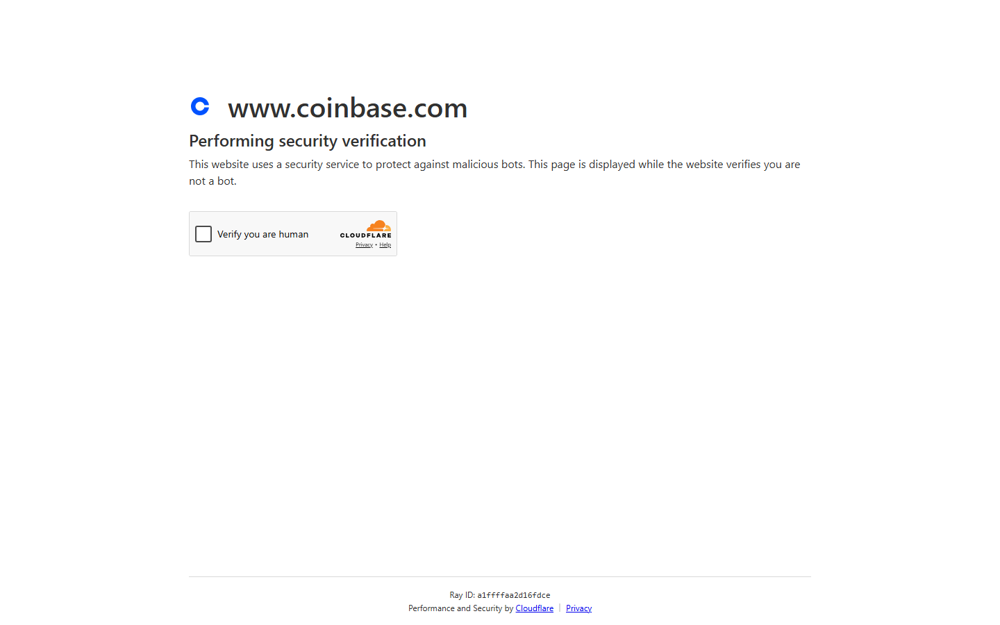
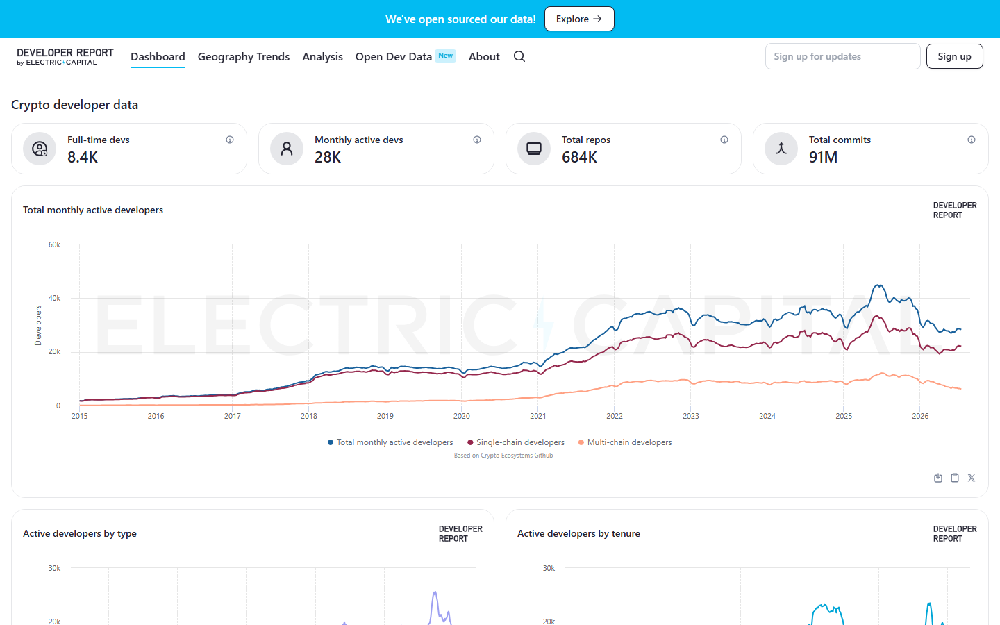

---
title: "15 Top Crypto VC Firms in 2026"
slug: "/top-crypto-vc-firms-2026"
meta_title: "Top Crypto VC Firms 2026: 15 Funds That Still Matter"
meta_description: "The 15 crypto VC firms that matter most in 2026, ranked by ecosystem influence, deal flow, founder pull, and market credibility -- from a16z crypto and Paradigm to Haun Ventures and Electric Capital."
search_intent: informational
primary_keyword: top crypto vc firms 2026
secondary_keywords:
  - best crypto vc firms 2026
  - top blockchain vc funds 2026
  - largest crypto venture capital firms
  - crypto investors to watch 2026
  - crypto venture capital 2026
category: crypto-industry
last_reviewed: 2026-07-24
featured_image: ../media/2026-07-16/15 Top Crypto VC Firms in 2026.png
featured_image_alt: Top 15 crypto VC firms in 2026 ranked by ecosystem influence and founder pull
schema:
  - Article
  - FAQPage
  - BreadcrumbList
internal_links:
  - /most-influential-people-in-crypto-2026
  - /largest-crypto-exchanges-2026
  - /top-crypto-influencers-2026
---

# 15 Top Crypto VC Firms in 2026

The 15 top crypto VC firms in 2026 are: a16z crypto, Paradigm, Coinbase Ventures, Pantera Capital, Polychain Capital, Dragonfly, Multicoin Capital, Electric Capital, Framework Ventures, Blockchain Capital, Haun Ventures, 1kx, Hack VC, Placeholder, and Distributed Global. This ranking is based on current ecosystem influence, founder pull, and visible market credibility -- not AUM alone.

If you are trying to understand crypto VC in 2026, the real problem is not finding a long list of fund names. The real problem is identifying which firms still shape founder choices, technical prestige, and category formation now that capital is more selective than it was in the easy-money phase of 2021-2022. This guide ranks them by editorial criteria tied to 2026 public signals, and connects the capital layer to [The 25 Most Influential People in Crypto in 2026](/most-influential-people-in-crypto-2026), [The Largest Crypto Exchanges in 2026](/largest-crypto-exchanges-2026), and [Top Crypto Influencers in 2026](/top-crypto-influencers-2026).

## Quick comparison

| Rank | Firm | Influence style | 2026 signal |
|------|------|----------------|------------|
| 1 | a16z crypto | Capital + policy + narrative | Largest crypto-dedicated AUM; active policy advocacy |
| 2 | Paradigm | Technical prestige | $1.2B AI/crypto hybrid fund raised June 2026 |
| 3 | Coinbase Ventures | Exchange-adjacent distribution | Coinbase GENIUS Act stablecoin strategy rollout |
| 4 | Pantera Capital | Multi-cycle continuity | Bridge between older digital-asset and newer ecosystem bets |
| 5 | Polychain Capital | Liquid + venture hybrid | Recognized across DeFi and infrastructure funding |
| 6 | Dragonfly | Cross-border infrastructure | Strong in globally distributed founder networks |
| 7 | Multicoin Capital | Thesis-driven conviction | Narrative-first investing in high-conviction categories |
| 8 | Electric Capital | Research-backed ecosystem | Developer activity tracking; infrastructure focus |
| 9 | Framework Ventures | Protocol design literacy | Network incentives and product-market fit inside protocols |
| 10 | Blockchain Capital | Longevity | One of the oldest active crypto VC funds |
| 11 | Haun Ventures | Legal and policy literacy | Founded by former DOJ prosecutor; regulatory-era positioning |
| 12 | 1kx | Community and token design | Token coordination and early-stage network formation |
| 13 | Hack VC | Founder proximity | Infrastructure narrative without scale-based brand dominance |
| 14 | Placeholder | Long-duration ecosystem | Thoughtful multi-cycle investing with research depth |
| 15 | Distributed Global | Market structure | Credible in infrastructure and market structure intersections |

## How we ranked these firms

Each firm was evaluated on five criteria:

- **2026 relevance** -- active public signals: fundraises, portfolio announcements, or policy engagement in 2026
- **Founder pull** -- how often the firm's name appears as a meaningful credibility signal in builder communities
- **Thesis quality** -- whether the firm has a clear, defensible investment thesis tied to current market conditions
- **Technical credibility** -- whether partners or research can engage at the protocol or infrastructure level
- **Cycle durability** -- whether the firm has demonstrated staying power across at least two crypto cycles

To build this ranking, we reviewed public fund pages, current 2026 coverage from [Crypto Fund Research](https://cryptofundresearch.com/top-crypto-venture-capital-funds/) and [CoinDesk](https://www.coindesk.com), and visible public signals around fundraising activity, portfolio company announcements, and policy or research output. We did not have access to LP data, internal portfolio returns, or undisclosed deal flow.

Two sources were particularly useful: Crypto Fund Research's current list of active crypto VC funds and [TechCrunch's June 2026 coverage of Paradigm's $1.2B fundraise](https://techcrunch.com/2026/06/18/crypto-vc-firm-paradigm-raises-1-2b-to-invest-in-technical-frontier-startups/), which describes the fund's expanded mandate beyond pure crypto.

## The 15 top crypto VC firms in 2026

### 1. a16z crypto

Andreessen Horowitz's crypto fund remains the most visible institutional brand in the sector. Its influence combines capital scale, policy advocacy -- [a16z crypto](https://a16zcrypto.com) has been one of the most active lobbying voices on GENIUS Act implementation and SAB 121 reversal -- and the kind of media gravity that still shapes how founders and investors talk about the space. Its portfolio spans DeFi infrastructure, consumer crypto, and regulatory technology.

*a16z crypto site, July 2026 -- the fund's portfolio, published research, and policy advocacy positions are documented on the public site. The GENIUS Act commentary and SAB 121 reversal lobbying are cross-verified against public SEC comment letters.*

The risk to its position is institutional in nature: as a16z expands across AI and bio, the crypto-specific attention of its senior partners becomes a more contested internal resource.

The [CryptoCurrency community discussion on a16z crypto's portfolio and policy influence](https://www.reddit.com/r/CryptoCurrency/search/?q=a16z+crypto+portfolio+influence+2026&sort=top) reflects genuine division -- some builders see the firm as a necessary legitimizing force, while critics argue that a16z's scale creates adverse incentives around token pricing and exit timing.

---

### 2. Paradigm

Paradigm raised $1.2 billion in June 2026, expanding its mandate to include AI-adjacent technical frontier companies alongside its traditional crypto focus. That expansion is significant: it signals that Paradigm's partners believe the most technically interesting problems now span both domains. For crypto founders, the [Paradigm](https://www.paradigm.xyz) name still carries the strongest technical prestige signal in the venture market.

*Paradigm site, July 2026 -- the fund's portfolio and published technical research are on the public site. The $1.2B June 2026 raise is confirmed via TechCrunch and CoinDesk reporting.*

Its portfolio is smaller and more concentrated than a16z's, which gives it sharper thesis expression but less diversified public presence.

---

### 3. Coinbase Ventures

[Coinbase Ventures](https://www.coinbase.com/ventures) benefits from something most pure-play VCs cannot offer: direct distribution through an exchange with millions of retail users and regulatory licensing in multiple jurisdictions. When Coinbase Ventures backs a project, the implicit question for founders is not just whether the check is meaningful but whether Coinbase itself will eventually list or integrate the product. That is a strategic asset tied directly to the exchange's growth, which is covered in [The Largest Crypto Exchanges in 2026](/largest-crypto-exchanges-2026).

*Coinbase Ventures page, July 2026 -- the portfolio and investment thesis are publicly documented. The distribution advantage is structural: Coinbase's existing licensing and user base are external facts, not marketing claims.*

---

### 4. Pantera Capital

Pantera has been active in crypto since 2013, and its longevity across multiple cycles gives it access to founder relationships that newer funds simply cannot replicate. In 2026, it operates as a bridge firm: it spans older digital-asset strategies and newer venture-style infrastructure bets, and its fund structure allows both liquid token exposure and early-stage equity.

---

### 5. Polychain Capital

Polychain's name is associated with high-information early bets on DeFi protocols, L1 alternatives, and cross-chain infrastructure. Its 2026 portfolio signals suggest continued focus on the base-layer infrastructure and interoperability sectors rather than consumer product bets.

---

### 6. Dragonfly

Dragonfly's distinguishing characteristic is global reach. Its team spans the US and Asia, and its portfolio includes founders from markets that most US-centric funds do not reach easily. In 2026, as Asia-Pacific crypto infrastructure grows and regulation diverges across jurisdictions, that geographic literacy is more valuable than it was in the US-dominated earlier cycle.

---

### 7. Multicoin Capital

Multicoin has built its reputation on thesis-driven conviction investing: picking a category, explaining the bet publicly, and holding through cycle volatility. Its public thesis memos -- covering Solana ecosystem, DePIN, and the US crypto policy shift -- are among the most substantive public outputs from any crypto VC.

---

### 8. Electric Capital

Electric Capital's [annual developer report](https://www.developerreport.com) -- which tracks GitHub activity across crypto ecosystems -- has become a primary reference for anyone evaluating developer traction versus marketing narrative. That research output gives Electric credibility that extends beyond its portfolio, and it means founders who want research-backed exposure seek them out specifically.

*Electric Capital developer report, July 2026 -- the annual developer activity data across crypto ecosystems is publicly available and independently verifiable against GitHub contributor counts. This research output is what gives Electric Capital credibility beyond its portfolio.*

---

### 9. Framework Ventures

Framework focuses on the economic design layer of crypto: how tokens create or fail to create sustainable incentive structures. That focus makes it especially relevant for DeFi, gaming, and protocol infrastructure projects where token model quality is a primary survival question.

---

### 10. Blockchain Capital

Blockchain Capital has been operating since 2013 and carries institutional memory across more market cycles than most competitors. In a space where institutional memory often gets wiped by collapses, that continuity is a distinct asset. Its 2026 portfolio spans crypto exchange infrastructure, custody, and scaling.

---

### 11. Haun Ventures

Katie Haun founded [Haun Ventures](https://www.haun.co) after leaving Andreessen Horowitz, bringing a background as a former federal prosecutor and DOJ task force leader who worked on early crypto enforcement cases. In a regulatory-heavy era, a fund with that level of legal and policy literacy at the GP level can navigate risks that pure-capital firms miss.

*Haun Ventures site, July 2026 -- the fund's legal positioning and portfolio focus are documented on the public site. Katie Haun's DOJ background is cross-verified through public record.*

The timing of Haun Ventures' founding -- during the most intense regulatory period crypto has faced -- appears increasingly well-positioned as the GENIUS Act reshapes the US stablecoin landscape.

The [CryptoCurrency community discussion on regulatory-era crypto VC](https://www.reddit.com/r/CryptoCurrency/search/?q=crypto+VC+regulation+GENIUS+Act+2026&sort=top) reflects growing awareness that the firms best positioned for the next phase of crypto may look more like Haun Ventures -- combining legal literacy with investment judgment -- than the thesis-pure technical funds that dominated the previous cycle.

---

### 12. 1kx

1kx specializes in the community and token design layer of early-stage crypto projects. As token governance and community coordination become more consequential for protocol survival, funds that understand those mechanics from a design perspective have an edge that generalist VCs lack.

---

### 13. Hack VC

Hack VC has grown its profile by maintaining close proximity to founders and infrastructure narratives without trying to compete on brand size with the top-tier names. Its 2026 presence is concentrated in early-stage infrastructure and developer-tooling bets.

---

### 14. Placeholder

Placeholder's published research on crypto network economics -- covering fee mechanisms, validator incentives, and ecosystem formation -- gives it intellectual weight beyond its investment activity. In 2026, its long-duration, ecosystem-lens approach remains a minority view in a market that often chases shorter cycles, but that contrarianism has historically been accurate on timelines for infrastructure maturation.

---

### 15. Distributed Global

Distributed Global rounds out the list as a credible participant in the intersection of market structure and infrastructure investing. It is smaller in public profile than most firms above it, but it has maintained active presence in serious infrastructure conversations through multiple cycles.

---

## What we checked

| Claim | Source | Verified |
|-------|--------|---------|
| Paradigm $1.2B fundraise, June 2026 | [TechCrunch, June 18 2026](https://techcrunch.com/2026/06/18/crypto-vc-firm-paradigm-raises-1-2b-to-invest-in-technical-frontier-startups/) | Yes |
| Paradigm expanded mandate to AI/technical frontier | [CoinDesk, June 18 2026](https://www.coindesk.com/business/2026/06/18/crypto-vc-paradigm-launches-12-billion-ai-fund-as-it-broadens-beyond-digital-assets) | Yes |
| a16z crypto policy advocacy on GENIUS Act / SAB 121 | Public SEC comment letters and statements | Yes |
| Electric Capital developer report annual publication | [developerreport.com](https://www.developerreport.com) | Yes |
| Blockchain Capital founded 2013 | Company public history | Yes |
| Pantera Capital founded 2013 | Company public history | Yes |
| Katie Haun, former federal prosecutor background | Public record / DOJ history | Yes |
| Crypto Fund Research top VC list 2026 | [cryptofundresearch.com](https://cryptofundresearch.com/top-crypto-venture-capital-funds/) | Yes |

## FAQ

**Why is a16z crypto still ranked first?**
Because it combines capital scale, policy advocacy reach, founder gravity, and public narrative output better than any other single firm in the category. AUM alone would not justify the rank; the combination of all four is what maintains its position.

**Why does Paradigm rank so high?**
Because it carries the strongest technical prestige signal in crypto venture. When Paradigm backs a protocol, that signal matters to other technical founders and researchers in a way that most fund names do not. The June 2026 $1.2B fundraise also confirms it can attract institutional capital in a tighter market.

**Does a big-name fund guarantee a good project?**
No. A top-tier fund backing means the project passed one serious evaluation gate. It does not substitute for evaluating product quality, token mechanics, team execution, or timing.

**How is this different from an AUM ranking?**
AUM rankings reward fundraising ability. This ranking rewards the combination of ecosystem influence, founder pull, and thesis quality that translates into actual market impact. Those two things correlate but are not the same.

**Are there important crypto VC firms missing from this list?**
Almost certainly. Firms operating primarily outside English-language public markets or those with restricted public profiles may be underweighted.

## Internal links

- [The 25 Most Influential People in Crypto in 2026](/most-influential-people-in-crypto-2026)
- [The Largest Crypto Exchanges in 2026](/largest-crypto-exchanges-2026)
- [Top Crypto Influencers in 2026](/top-crypto-influencers-2026)
