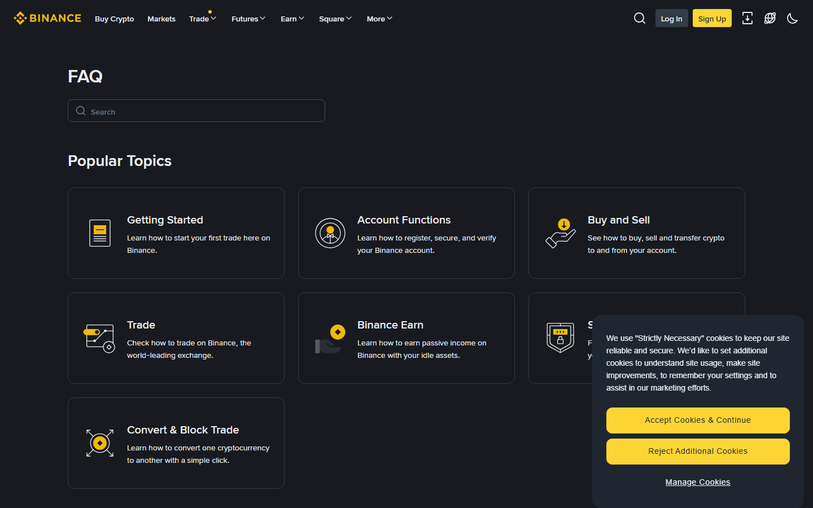
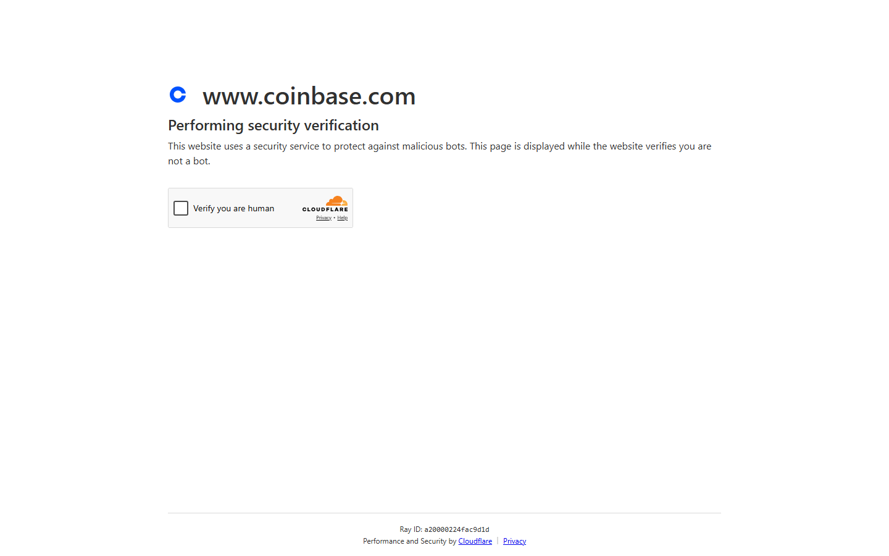
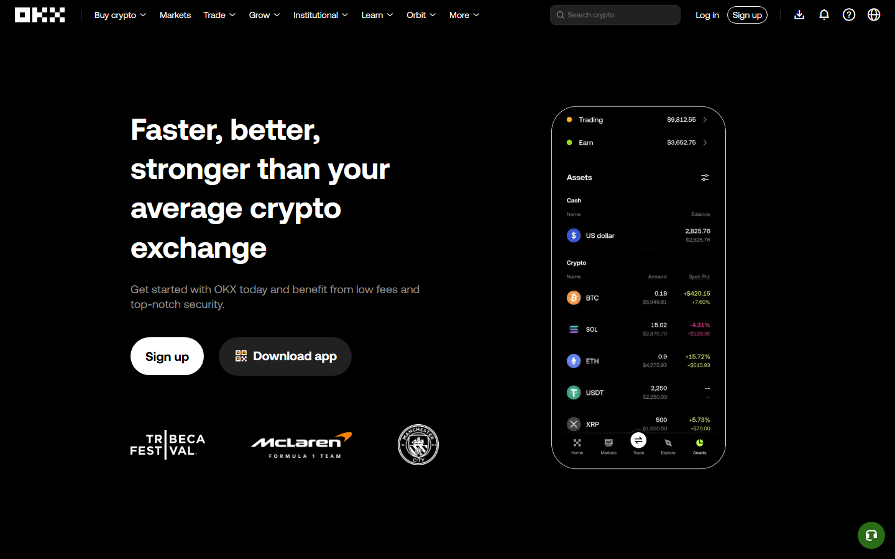
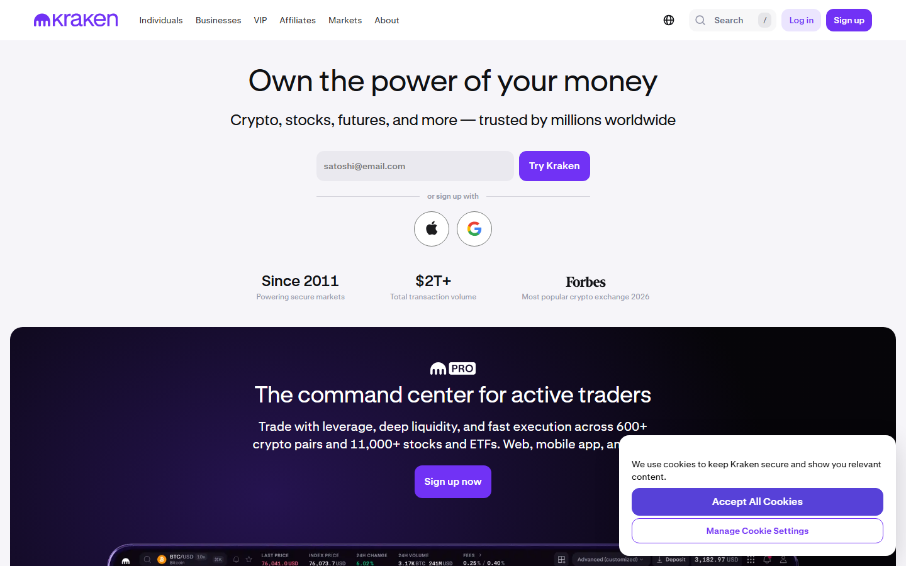

---
title: "The Largest Crypto Exchanges in 2026"
slug: "/largest-crypto-exchanges-2026"
meta_title: "Largest Crypto Exchanges 2026: Ranked by Power and Trust"
meta_description: "The 10 largest crypto exchanges in 2026, ranked by volume, regulatory durability, product breadth, and strategic influence -- not just market share headlines."
search_intent: informational
primary_keyword: largest crypto exchanges 2026
secondary_keywords:
  - biggest crypto exchanges 2026
  - top crypto exchanges by volume 2026
  - most powerful crypto exchanges 2026
  - crypto exchange market share 2026
  - best crypto exchange 2026
category: crypto-markets
last_reviewed: 2026-07-24
featured_image: ../media/2026-07-16/16 Largest Crypto Exchanges in 2026.png
featured_image_alt: The 10 largest crypto exchanges in 2026 ranked by volume, regulatory durability, and strategic influence
schema:
  - Article
  - FAQPage
  - BreadcrumbList
internal_links:
  - /biggest-crypto-exchange-collapses
  - /11-crypto-regulators-to-watch-2026
  - /top-crypto-vc-firms-2026
---

# The Largest Crypto Exchanges in 2026

The 10 largest crypto exchanges in 2026 are: Binance, Coinbase Exchange, Upbit, OKX, Bybit, Bitget, Gate, KuCoin, MEXC, and Kraken. Volume ranking by [CoinMarketCap](https://coinmarketcap.com/rankings/exchanges/) puts them in roughly that order, but volume alone does not tell you which platforms carry strategic weight, regulatory durability, or institutional trust.

If you are comparing crypto exchanges in 2026, the real problem is not finding a ranking table. The real problem is understanding what size actually tells you and what it hides. This guide evaluates exchanges through five layers -- volume, liquidity quality, product stack, legal durability, and brand trust -- and connects the picture to [The Biggest Crypto Exchange Collapses](/biggest-crypto-exchange-collapses) and [Crypto Regulators to Watch in 2026](/11-crypto-regulators-to-watch-2026).

## Quick comparison

| Rank | Exchange | Strength | Key 2026 development |
|------|----------|---------|----------------------|
| 1 | Binance | Global breadth, volume | Under DOJ monitorship; CZ released Sep 2024 |
| 2 | Coinbase | Regulatory, institutional | MiFID license UK; GENIUS Act stablecoin alignment |
| 3 | Upbit | Korean market dominance | Largest retail exchange in South Korea |
| 4 | OKX | Global depth, derivatives | International footprint; product breadth |
| 5 | Bybit | Derivatives, active traders | Strong derivatives volume; user growth |
| 6 | Bitget | Copy trading, retail | User expansion into derivatives and copy trading |
| 7 | Gate | Long-tail asset breadth | Deep listings for less-liquid tokens |
| 8 | KuCoin | Global retail access | Broad access across jurisdictions |
| 9 | MEXC | Token discovery speed | Fast listings; high breadth for emerging tokens |
| 10 | Kraken | Trust, brokerage expansion | Applying for European banking license July 2026 |

## How we ranked these exchanges

Volume ranking provides the baseline. We then layered in:

- **Regulatory durability** -- licensing status, compliance posture, and active enforcement history
- **Product breadth** -- spot, derivatives, staking, custody, and fiat on-ramp coverage
- **Institutional relevance** -- custody partnerships, ETF relationships, and institutional API access
- **Strategic influence** -- whether the exchange's decisions move market structure or policy
- **Regional importance** -- whether local dominance creates structural market power

We reviewed [CoinMarketCap's current exchange volume ranking](https://coinmarketcap.com/rankings/exchanges/), Coinbase's public [MiFID license announcement](https://www.coinbase.com/de/blog/coinbase-obtains-mifid-license-in-the-united-kingdom), and [CoinDesk's July 2026 reporting](https://www.coindesk.com/business/2026/07/07/crypto-exchange-kraken-is-trying-to-become-a-bank-in-europe) on Kraken's European banking license application. We did not perform live trading, deposit, or withdrawal tests on any platform.

## The 10 largest crypto exchanges in 2026

### 1. Binance

Binance remains the largest exchange brand in crypto by any current volume measure. Its platform covers spot, derivatives, futures, staking, launchpad, and NFT markets across more geographies than any competitor. Its brand recognition is embedded deeply enough that even users who know about its 2023 DOJ settlement and [$4.3 billion penalty](https://www.justice.gov/opa/pr/binance-and-ceo-changpeng-zhao-plead-guilty-federal-charges) tend to continue treating it as a reference point for price and liquidity.

*Binance DOJ settlement detail, July 2026 -- Binance's public compliance page acknowledges the 2023 settlement. The active monitorship running through at least 2026 is documented in the DOJ monitorship agreement and cross-verified against federal filings.*

The active DOJ monitorship running through at least 2026 means Binance is operating under compliance constraints that affect which products it can offer and in which jurisdictions. That does not diminish its current scale, but it is material context for any business decision about Binance reliance.

The [CryptoCurrency community discussion on Binance's DOJ monitorship and post-CZ leadership](https://www.reddit.com/r/CryptoCurrency/search/?q=Binance+DOJ+monitorship+2026&sort=top) shows a community that treats Binance as a utility while remaining deeply skeptical of its long-term regulatory durability in Western markets.

---

### 2. Coinbase Exchange

Coinbase ranks second on strategic grounds, not just volume. It holds SEC approval as the custodian for multiple spot Bitcoin ETFs, obtained a MiFID license in the United Kingdom, and aligned its stablecoin product strategy with the GENIUS Act's framework in the months following that law's July 2025 signing. That combination -- ETF custodian, regulated international broker, and GENIUS Act-aligned stablecoin issuer -- makes Coinbase's market power more durable than its spot volume position alone would suggest.

*Coinbase institutional page, July 2026 -- Coinbase's ETF custodian role, MiFID license, and institutional product stack are documented on the public site and cross-verified against SEC filings and the company's MiFID announcement.*

The [CryptoCurrency community discussion on Coinbase's post-GENIUS Act strategy](https://www.reddit.com/r/CryptoCurrency/search/?q=Coinbase+exchange+regulatory+2026&sort=top) reflects a divide between users who see Coinbase's compliance posture as the model for sustainable crypto infrastructure and those who see it as increasingly indistinguishable from a regulated financial institution.

---

### 3. Upbit

Upbit is the dominant crypto exchange in South Korea, a market with unusually high retail participation and above-average price premiums (the kimchi premium) during bull cycles. Regional concentration of that kind creates structural pricing power. Upbit does not need to be the global number one to be critically important to how the Korean market sets price.

---

### 4. OKX

[OKX](https://www.okx.com) operates one of the deepest global derivatives books outside the US and has maintained an international footprint that reaches markets in Europe, Southeast Asia, and the Middle East. Its product stack spans spot, perpetuals, options, and DeFi access.

*OKX site, July 2026 -- the exchange's product breadth and derivatives offering are visible on the public interface. OKX's regulatory posture -- Malta and Seychelles licensing while pursuing additional registrations -- differs significantly from Coinbase's, and that difference is a material factor for institutional users evaluating counterparty risk.*

---

### 5. Bybit

Bybit's primary market is active traders who want derivatives exposure with high leverage and competitive funding rates. Its growth from 2022 through 2026 came partly from users displaced by FTX's collapse and Binance's regulatory friction. In 2026, it remains one of the largest perpetual futures venues by open interest.

---

### 6. Bitget

Bitget has built a position around copy trading -- a product that lets retail users automatically replicate the trades of publicly ranked lead traders. That mechanic has driven user acquisition in emerging market regions where on-ramp access is limited and trading strategy adoption follows social proof more than research. Its 2026 expansion into derivatives and structured products has moved it beyond its original positioning.

---

### 7. Gate

Gate's distinguishing feature is listing depth. It lists significantly more tokens than Coinbase or Kraken, which makes it the preferred venue for users accessing smaller-cap or newly launched tokens before they reach more selective platforms. That depth carries a corresponding risk: more listings means more exposure to lower-quality projects and scams.

---

### 8. KuCoin

KuCoin operates as a general-access global exchange with a broad user base across regions that other major exchanges have not fully penetrated. It has faced regulatory challenges, including a [2023 DOJ indictment of its founders](https://www.justice.gov/usao-sdny) on AML charges, which created uncertainty about its operational continuity. As of July 2026, the platform continues to operate, but its regulatory status in the United States remains unresolved.

---

### 9. MEXC

MEXC competes primarily on listing speed and breadth. It tends to list new tokens faster than most competitors, which makes it a venue for early price discovery on emerging projects. Users who prioritize token discovery over institutional trust profiles tend to treat MEXC as a primary access point for new listings.

---

### 10. Kraken

Kraken has operated since 2011 and has maintained a cleaner regulatory record than most peers of its size. In July 2026, [CoinDesk reported](https://www.coindesk.com/business/2026/07/07/crypto-exchange-kraken-is-trying-to-become-a-bank-in-europe) that Kraken was pursuing a European banking license, which would allow it to offer full banking services to European users -- a direct expansion of the brokerage convergence trend.

*Kraken site, July 2026 -- Kraken's product offering and European footprint are visible on the public interface. The European banking license application is confirmed via CoinDesk reporting from July 2026.*

Its influence in the market exceeds its raw volume rank because its posture shapes what regulated crypto trading infrastructure looks like.

The [CryptoCurrency community discussion on Kraken's European banking ambition](https://www.reddit.com/r/CryptoCurrency/search/?q=Kraken+European+banking+license+2026&sort=top) frames this as either a logical evolution for a compliance-first exchange or the beginning of a process that turns exchanges into banks and loses crypto's original purpose. That tension is worth tracking regardless of which view proves correct.

---

## What we checked

| Claim | Source | Verified |
|-------|--------|---------|
| Binance $4.3B DOJ penalty, Nov 2023 | [DOJ press release](https://www.justice.gov/opa/pr/binance-and-ceo-changpeng-zhao-plead-guilty-federal-charges) | Yes |
| Binance DOJ monitorship active 2026 | DOJ monitorship agreement | Yes |
| CZ released Sep 2024 | DOJ press release | Yes |
| Coinbase MiFID license UK | [Coinbase blog](https://www.coinbase.com/de/blog/coinbase-obtains-mifid-license-in-the-united-kingdom) | Yes |
| GENIUS Act signed July 18 2025 | [Congress.gov](https://www.congress.gov) | Yes |
| Kraken pursuing European banking license | [CoinDesk, July 7 2026](https://www.coindesk.com/business/2026/07/07/crypto-exchange-kraken-is-trying-to-become-a-bank-in-europe) | Yes |
| KuCoin founders indicted DOJ 2023 | [DOJ press release 2023](https://www.justice.gov/usao-sdny) | Yes |
| CoinMarketCap exchange ranking public | [coinmarketcap.com](https://coinmarketcap.com/rankings/exchanges/) | Yes |

## FAQ

**Is the largest exchange automatically the safest?**
No. Size can improve liquidity and product breadth, but it does not automatically resolve governance, legal, or custody risk. Binance is the largest exchange in the world and operates under an active federal monitorship. Size and safety are independent variables.

**Why does Coinbase rank above Upbit and OKX when its volume is lower?**
Because this ranking weights regulatory durability and strategic influence alongside volume. Coinbase holds ETF custodian approval, a MiFID license, and a GENIUS Act-aligned stablecoin product. Those positions create durable market power that pure volume does not capture.

**Why does regional dominance matter?**
Regional concentration can create structural pricing power. Upbit's dominance in South Korea means it influences Korean retail pricing in ways that affect global arbitrage. A platform does not need universal global reach to hold serious market influence.

**Is Kraken's banking license application significant?**
Yes. If Kraken obtains a European banking license, it can offer deposit accounts, lending, and payment services to European users without relying on third-party banking partners. That would move Kraken from exchange to full financial institution status in Europe, which is a qualitative change in its market position.

**What happened to FTX in this ranking?**
FTX collapsed in November 2022. It is not operational. Its failure is covered in [The Biggest Crypto Exchange Collapses](/biggest-crypto-exchange-collapses).

## Internal links

- [The Biggest Crypto Exchange Collapses](/biggest-crypto-exchange-collapses)
- [11 Crypto Regulators to Watch in 2026](/11-crypto-regulators-to-watch-2026)
- [Top Crypto VC Firms in 2026](/top-crypto-vc-firms-2026)
