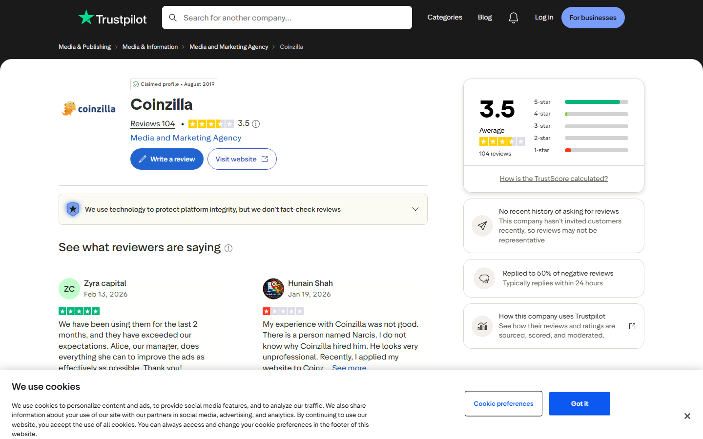
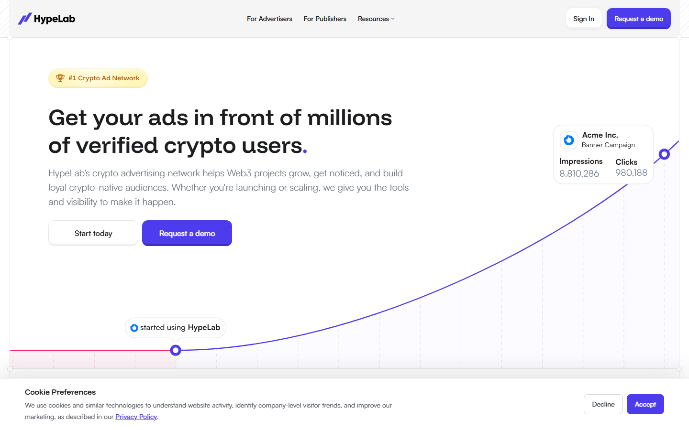
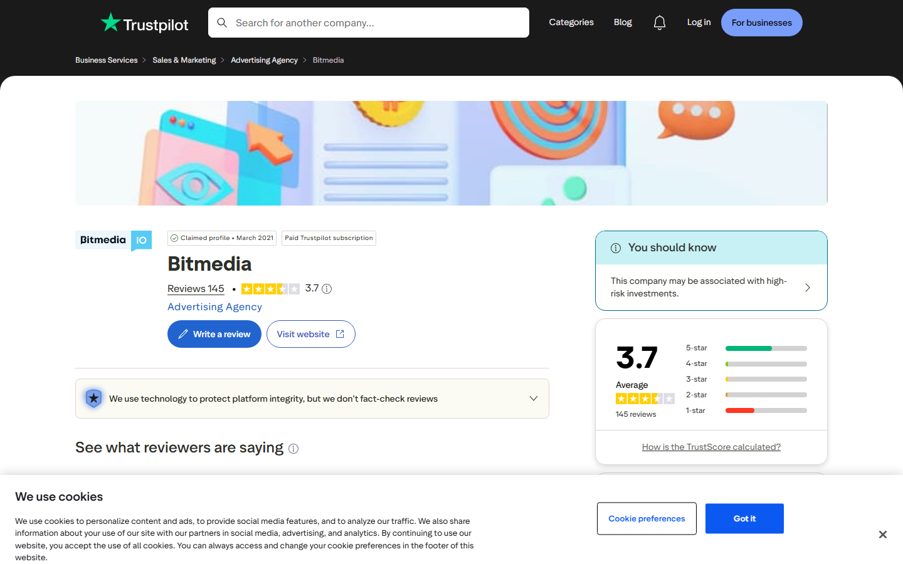
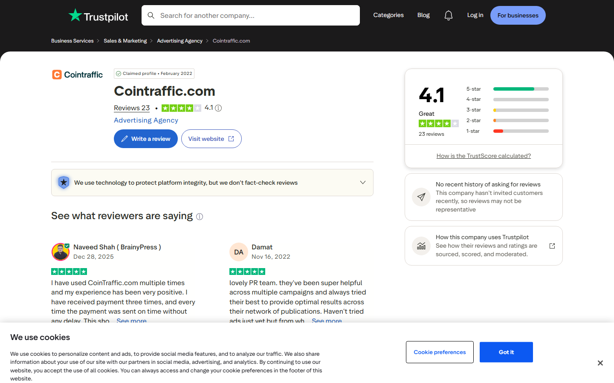
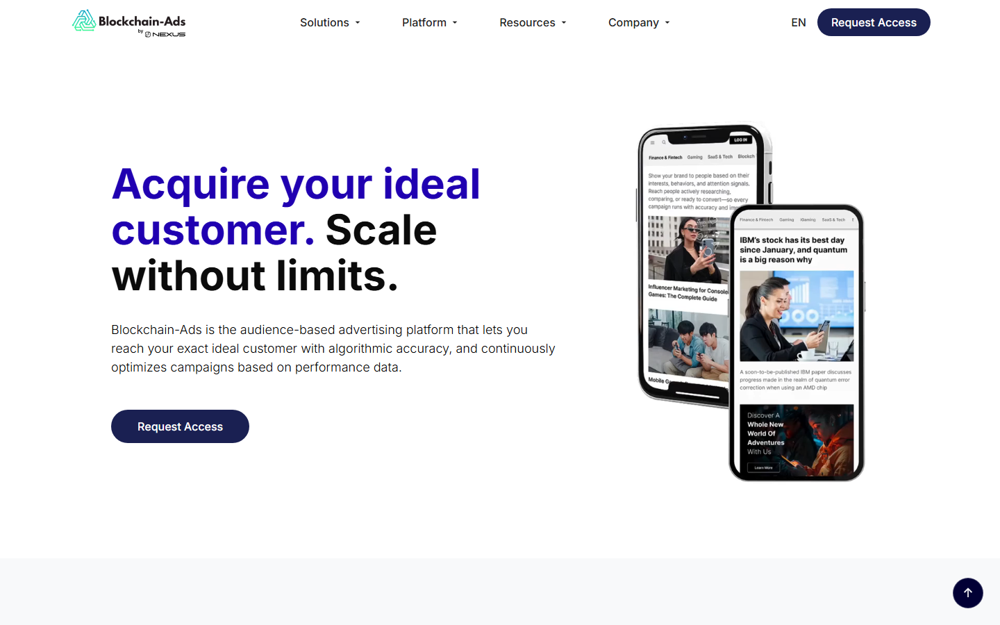
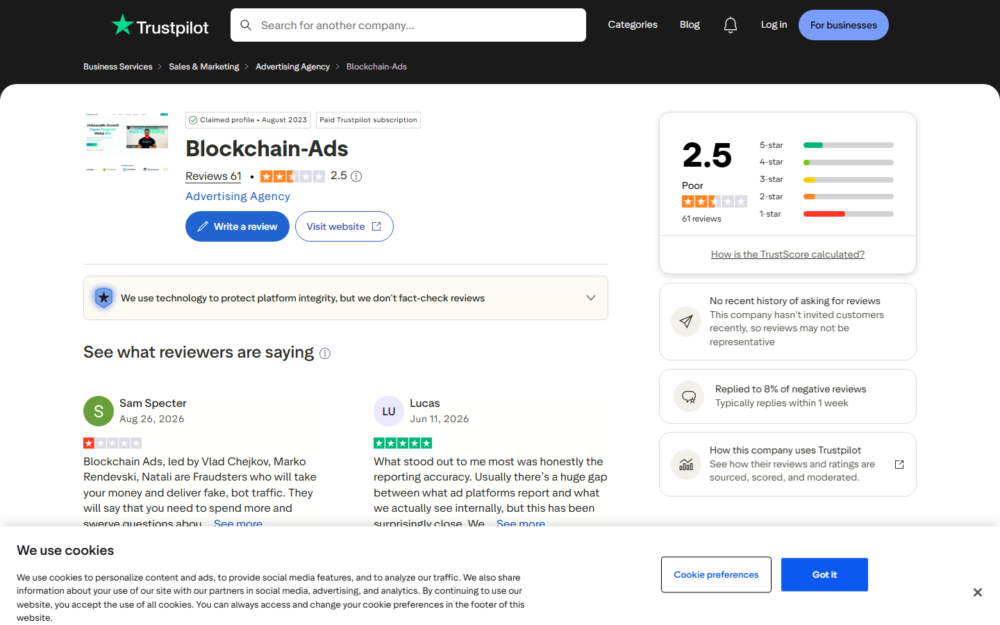

---
title: "Top 5 Web3 and AI Advertising Networks in 2026"
slug: "/top-web3-ai-advertising-networks-2026"
meta_title: "Top 5 Web3 and AI Advertising Networks 2026: Ranked for Crypto and Blockchain Campaigns"
meta_description: "The top Web3 and AI advertising networks in 2026, ranked by targeting precision, traffic quality, ad format range, and verified user sentiment for crypto and blockchain advertisers."
search_intent: "Commercial investigation"
primary_keyword: "web3 advertising networks 2026"
secondary_keywords:
  - "best crypto ad networks 2026"
  - "AI advertising platform Web3"
  - "blockchain advertising network"
  - "crypto ad network comparison"
  - "programmatic advertising Web3"
category: "web3-marketing"
last_reviewed: "2026-09-23"
featured_image: ../media/2026-09-23/coinzilla-homepage-2026-09-23.png
featured_image_alt: Coinzilla homepage showing established crypto and Web3 advertising network for publishers and advertisers
schema:
  - Article
  - ItemList
  - FAQPage
  - BreadcrumbList
internal_links:
  - /top-crypto-exchange-aggregators-2026
  - /largest-crypto-exchanges-2026
  - /top-crypto-vc-firms-2026
---

# Top 5 Web3 and AI Advertising Networks in 2026

The top Web3 and AI advertising networks in 2026 are: Coinzilla, HypeLab, Bitmedia, Cointraffic, and Blockchain-Ads. The ranking is based on targeting capability, traffic verification, AI-driven optimization, publisher inventory quality, and verified user reviews — not self-reported impression counts or marketing claims.

Most Web3 advertising guides rank ad networks by name recognition or claimed publisher pool size. Both are unreliable proxies. Impression counts are trivially inflated by bot traffic, and publisher counts say nothing about whether those publishers actually reach the audience a crypto or blockchain project needs to convert.

The questions that matter: Does the platform verify traffic quality? Can it target by wallet activity, on-chain behavior, or token holdings? Does it support the ad formats — native, display, video, push — that perform in Web3 contexts? Does it have a public review track record that holds up to scrutiny?

This guide answers those questions for each network, using Trustpilot data scraped September 2026, Reddit community feedback, and live platform screenshots. It connects to the capital environment shaping Web3 marketing budgets in [Top Crypto VC Firms 2026](/top-crypto-vc-firms-2026) and the exchange infrastructure covered in [Top Crypto Exchange Aggregators 2026](/top-crypto-exchange-aggregators-2026).

## Quick comparison

| Rank | Platform | Best for | Trustpilot | Key differentiator |
|------|----------|----------|------------|--------------------|
| 1 | Coinzilla | Brand campaigns, high-reach crypto display | 3.5/5 (104 reviews) | Verified case studies: Stake, Bitget, ChainGPT |
| 2 | HypeLab | On-chain targeting, DeFi/Web3-native audiences | — (not listed) | Wallet-level conversion tracking |
| 3 | Bitmedia | Self-serve CPC/CPM, large publisher network | 3.7/5 (145 reviews) | Highest Trustpilot score, operating since 2014 |
| 4 | Cointraffic | Premium inventory: Cointelegraph, Etherscan, CoinGecko | 4.1/5 (23 reviews) | Best Trustpilot rating on this list |
| 5 | Blockchain-Ads | Multi-channel DSP, iGaming, fintech | 2.5/5 (61 reviews) ⚠️ | Broadest format range; contested user record |

## How we ranked these platforms

We evaluated each platform on six criteria:

- **Traffic verification** — bot detection methodology and publisher auditing transparency
- **Targeting precision** — whether parameters go beyond geo and device to wallet activity, on-chain behavior, or DeFi app usage
- **Ad format range** — banner, native, video, push, in-app, Telegram
- **AI and automation** — real-time bid optimization, smart creative rotation, automated budget allocation
- **Publisher inventory quality** — named publishers, traffic source transparency, exclusivity
- **User sentiment** — Trustpilot scores and Reddit community feedback from r/adops, r/CryptoCurrency, and r/BlockchainStartups

We reviewed platform feature pages, published case studies, Trustpilot data (September 2026), Reddit discussions via Pullpush API, and live homepage screenshots for each network. We did not run live campaigns or access platform dashboards.

---

## The 5 top Web3 and AI advertising networks in 2026

### 1. Coinzilla

Coinzilla is among the most established crypto-specific ad networks operating in 2026, with documented campaign results and a publisher network built on top of Sevio SSP — whose inventory includes Blockchain.com, CoinMarketCap, and WhatToMine, confirmed in r/adops operator-level discussions from August 2026.

*Coinzilla homepage, September 2026 — Established crypto ad network with publisher inventory across finance and blockchain content.*

Case studies are public and specific: Stake achieved 45 million-plus impressions through a Coinzilla campaign; Bitget reported 120% growth in one month; ChainGPT used Coinzilla for full-funnel advertising combined with press release distribution across Web3 media. The platform also serves prediction market advertising as a dedicated vertical and operates a marketplace for pre-built ad packages alongside press release distribution — giving it a media planning dimension that pure ad networks lack.

**Trustpilot: 3.5/5 (104 reviews)**

*Coinzilla on Trustpilot, September 2026 — 3.5/5 from 104 reviews. Claimed profile since August 2019.*

Positive reviews consistently cite account manager responsiveness and multi-year reliability. A verified 5-star review from February 2026: *"We have been using them for the last 2 months and they have exceeded our expectations. Our manager does everything she can to improve the ads as effectively as possible."* A longer-term advertiser: *"Have been working with Coinzilla for a couple of years now and have nothing but praise for them. Always proactive in looking at ways to help us."*

Negative reviews focus on publisher-side approval decisions — smaller publishers report rejections without clear explanation, and one January 2026 review describes an account manager as unprofessional. The company replies to approximately 50% of negative reviews, typically within 24 hours.

**Reddit:** r/adops discussions confirm Coinzilla's publisher network reaches finance and crypto audiences via Sevio SSP on major crypto data platforms. Community tone is consistent with an established, functional network rather than a controversial one.

**Best for:** Crypto exchanges, DeFi protocols, and blockchain infrastructure projects running brand awareness campaigns with high reach requirements and verified case study benchmarks.

**Main tradeoff:** Targeting is contextual and behavioral rather than on-chain or wallet-level. Publisher approval decisions receive mixed feedback from smaller publishers.

---

### 2. HypeLab

HypeLab is the most technically advanced platform on this list for on-chain targeting, founded in 2022 and backed by Outlier Ventures. Its defining capability — wallet-level conversion tracking and on-chain behavioral targeting — is a structural difference in how campaign parameters work, not a positioning claim.

*HypeLab homepage, September 2026 — Web3 ad network with on-chain targeting and AI-powered campaign optimization.*

On a standard ad network, targeting in the crypto category means reaching users who visit crypto websites. On HypeLab, targeting can be configured by wallet activity, token holdings, on-chain behavior (DeFi interactions, NFT ownership, protocol usage), and crypto interests — mapping campaign parameters directly to the on-chain identities of the users a project wants to reach. The AI-powered optimization layer adjusts budget allocation, bidding, and creative rotation in real time, with cost-per-acquisition stated to decrease as the algorithm learns converting segments.

Publisher inventory covers crypto exchanges, portfolio trackers, and DeFi applications — the distribution channels where Web3-active users spend time — rather than the content-site network that most crypto ad networks are built on.

**Trustpilot:** HypeLab does not have a Trustpilot listing as of September 2026. No Reddit threads with direct user review experience were identified in Pullpush queries across r/CryptoCurrency, r/adops, and r/web3 for the period reviewed.

**What users report:** Limited public user review data. Outlier Ventures backing and the specificity of the on-chain targeting product provide credibility, but independently verifiable advertiser sentiment is not available at this stage. Advertisers should request references and test with a defined-scope campaign before scaling.

**Best for:** DeFi protocols, NFT projects, token launches, and blockchain applications that need to reach users defined by on-chain behavior rather than content consumption patterns.

**Main tradeoff:** No public Trustpilot presence and limited Reddit discussion. Publisher inventory skews toward Web3-native platforms rather than high-reach general finance and crypto content sites.

---

### 3. Bitmedia

Bitmedia has operated since 2014, making it one of the longest-running crypto-specific ad networks. The platform reports 1.5 billion-plus monthly impressions, 1.5 million-plus monthly clicks, 550-plus active publishers, and more than 200 top advertisers. Its self-serve model is a meaningful differentiator for smaller projects and independent advertisers who cannot commit to managed campaign minimums.

*Bitmedia homepage, September 2026 — Self-serve ad network with CPC and CPM models across verified publisher inventory since 2014.*

Campaigns run on CPC and CPM models with real-time analytics. Traffic is stated as 100% verified human with zero bot traffic. Publisher network spans Web3 and crypto, finance and fintech, SaaS and AI tools, gaming and iGaming, and mobile utility — which gives advertisers outside the core crypto category access to relevant audiences without narrower inventory constraints.

**Trustpilot: 3.7/5 (145 reviews)**

*Bitmedia on Trustpilot, September 2026 — 3.7/5 from 145 reviews. The largest verified review sample of any platform on this list.*

Positive reviews consistently reference payment reliability, CPM rates for crypto traffic, and ease of the self-serve interface. A verified January 2026 5-star review: *"Absolutely no issues, payments sent within few days. The $20 minimum is very publisher-friendly."* A longer-term publisher: *"Been a publisher at Bitmedia for several years with no issues. One of the highest-paying ad networks for crypto publishers, with quick and easy payments."*

Negative reviews center on account suspension complaints, with several publishers reporting bans near withdrawal requests. A October 2025 review: *"Bitmedia bans your account as soon as you request a withdrawal, even if you haven't violated any of their terms."* The company replies to a high proportion of negative reviews.

**Reddit:** r/adops mentions describe Bitmedia as a usable self-serve option for crypto publisher monetization, with one commenter from August 2026 calling it "far better than Adsterra" for crypto verticals in terms of CPM and publisher experience.

**Best for:** Crypto projects, DeFi applications, and blockchain games that need self-serve campaign access with CPC/CPM pricing across a large publisher network with a long operational track record.

**Main tradeoff:** Account suspension complaints in publisher reviews are a consistent pattern. AI optimization is partial rather than full-funnel automated.

---

### 4. Cointraffic

Cointraffic has operated since 2014 and holds the highest Trustpilot rating of any platform on this list — 4.1/5 from 23 reviews, with no critical fraud or bot traffic allegations in the review set. Its publisher network is notably premium for the crypto category: direct inventory access to Cointelegraph, Etherscan, and CoinGecko, combined with 700-plus manually vetted blockchain publishers.

*Cointraffic homepage, September 2026 — Premium crypto ad network with direct publisher access since 2014.*

The platform is based in Tallinn, Estonia, and offers display advertising, banner advertising, native advertising, pop-under ads, and a press release marketplace — a format set that covers the main placements across crypto content publishing. Every advertiser receives a dedicated account manager, and campaigns can go live within hours, which addresses the practical friction of Google rejection that most crypto projects face when trying to use general programmatic infrastructure.

**Trustpilot: 4.1/5 (23 reviews)**

*Cointraffic on Trustpilot, September 2026 — 4.1/5 from 23 reviews. Highest-rated platform on this list.*

Positive reviews center on account manager quality and campaign setup speed. A December 2025 verified review: *"I have used Cointraffic multiple times and my experience has been very positive. I have received payment three times, and every time the payment was sent on time without any delay."* A July 2025 review from a token project advertiser: *"Have been working with the Cointraffic team for several months — very happy with the result. The managers always ready to help, also got a customised plan for our token."* A PR-focused reviewer from November 2022 notes: *"Lovely PR team. They've been super helpful across multiple campaigns and always tried their best to provide optimal results."*

The single notable negative review involves spam emails being sent to deleted accounts — an operational issue, not a campaign performance complaint.

**Reddit:** Limited direct Cointraffic mentions in r/adops and r/CryptoCurrency, consistent with a platform that relies more on managed account relationships than self-serve community adoption.

**Best for:** Token launches, blockchain infrastructure projects, and crypto content platforms that need premium publisher placement — specifically on Cointelegraph, Etherscan, or CoinGecko — with dedicated campaign management.

**Main tradeoff:** Review sample size (23) is the smallest on this list, so the 4.1/5 rating reflects fewer data points than Bitmedia or Coinzilla. Targeting is contextual rather than on-chain.

---

### 5. Blockchain-Ads

Blockchain-Ads operates as a full-stack demand-side platform covering display, native, video, mobile, connected TV, push, pop, and Telegram mini app advertising — the broadest channel range of any platform on this list. Its AI advertising layer (Performance Max) runs cross-channel optimization simultaneously, and Flux Campaigns generates real-time creatives at the moment of impression.

*Blockchain-Ads homepage, September 2026 — Full-stack DSP with Performance Max AI optimization and Flux Campaigns dynamic creatives.*

The platform's DMP collects 4 billion signals per day and serves three regulated verticals with specific products: iGaming advertising for acquiring high-LTV depositors, crypto advertising for reaching verified high-intent audiences, and fintech advertising for qualified user acquisition. Audience targeting covers demographic, behavioral, contextual, and on-chain parameters, with full-funnel attribution from impression to conversion.

**Trustpilot: 2.5/5 (61 reviews) — flagged**

*Blockchain-Ads on Trustpilot, September 2026 — 2.5/5 "Poor" rating. Multiple reviews allege bot traffic delivery and disputed spend.*

The Trustpilot profile requires direct disclosure. Blockchain-Ads holds a 2.5/5 "Poor" rating — the lowest on this list. Negative reviews are substantive rather than about UX or billing delays: an August 2026 review alleges bot traffic delivery and names specific leadership contacts; a July 2026 review describes it as one of the worst business decisions the reviewer made after spending thousands against projections that did not materialize.

A positive minority exists: a June 2026 verified advertiser cites accurate reporting — *"Usually there's a huge gap between what ad platforms report and what we actually see internally, but this has been surprisingly close"* — and a separate review notes improved user retention after switching from PMax. The company replies to approximately 8% of negative reviews, the lowest response rate on this list.

**Reddit:** r/BlockchainStartups discussion from August 2026 mentions Blockchain-Ads in the context of crypto marketing agencies. No r/adops thread with direct advertiser performance data appeared in the reviewed dataset.

**Important note:** The 2.5/5 Trustpilot score with bot traffic allegations is material information. The technical product is the most capable on this list by channel breadth. The user review record is the weakest. Advertisers should treat initial spend as a controlled test with defined performance benchmarks before committing to scale.

**Best for:** Crypto casinos, fintech applications, and blockchain infrastructure projects that need multi-channel programmatic campaigns with AI optimization and can verify traffic quality against internal conversion data from day one.

**Main tradeoff:** 2.5/5 Trustpilot rating with multiple bot traffic allegations. Highest technical capability on this list, most contested advertiser reputation.

---

## Ranking scorecard

Scored out of 10 per category. Total out of 60.

| Platform | Traffic verification | Targeting precision | Format range | AI optimization | Publisher quality | User trust | **Total** |
|----------|---------------------|--------------------|--------------|-----------------|--------------------|-----------|-----------|
| Coinzilla | 8 | 6 | 7 | 5 | 8 | 7 | **41** |
| HypeLab | 9 | 10 | 7 | 9 | 7 | — | **42** |
| Bitmedia | 8 | 7 | 7 | 6 | 7 | 7 | **42** |
| Cointraffic | 8 | 6 | 7 | 5 | 9 | 9 | **44** |
| Blockchain-Ads | 8 | 8 | 10 | 9 | 7 | 3 | **45** |

**Scoring notes:** Blockchain-Ads scores highest on raw capability but lowest on user trust. HypeLab and Bitmedia tie on total for different reasons: HypeLab scores maximum on targeting precision, Bitmedia leads on verified user trust from 145 reviews. Cointraffic scores highest on publisher quality (direct access to Cointelegraph, Etherscan, CoinGecko) and user trust (4.1/5 Trustpilot, cleanest review set on this list). HypeLab is unscored on user trust — not as a positive or negative, but as a data gap.

---

## What users actually say: Trustpilot and Reddit summary

| Platform | Trustpilot | Most common praise | Most common complaint |
|----------|-----------|-------------------|-----------------------|
| Coinzilla | 3.5/5 (104) | Account manager quality, multi-year reliability | Publisher approval inconsistency |
| HypeLab | Not listed | — | — |
| Bitmedia | 3.7/5 (145) | Fast payouts, high CPM, $20 publisher minimum | Account bans near withdrawal requests |
| Cointraffic | **4.1/5 (23)** | On-time payments, dedicated managers, campaign speed | Spam emails to deleted accounts |
| Blockchain-Ads | 2.5/5 (61) ⚠️ | Reporting accuracy (positive minority) | Bot traffic, failed projections |

Reddit discussions from r/adops and r/BlockchainStartups corroborate Trustpilot patterns for Coinzilla and Bitmedia. Coinzilla's publisher infrastructure via Sevio SSP — powering placements on Blockchain.com, CoinMarketCap, and WhatToMine — is confirmed in operator-level r/adops threads. Bitmedia's publisher-side reputation is consistent: high CPM for verified crypto traffic, with account management complaints mostly from smaller publishers.

---

## What separates Web3 ad networks from traditional programmatic

Web3 advertising is a regulatory and technical constraint problem first, a reach problem second. The two constraints that shape every campaign decision are ad policy rejection and audience precision.

**Ad policy rejection** means standard programmatic platforms — Google Ads, Meta, major DSPs — either refuse crypto advertising outright or apply restrictions so narrow that most projects cannot run compliant campaigns at scale. The platforms on this list were built specifically to serve categories that general programmatic infrastructure excludes.

**Audience precision** is where Web3 advertising is evolving fastest. The first generation of crypto ad networks served audiences defined by content consumption — users who read crypto articles. The current generation is moving toward audiences defined by on-chain identity: wallet activity, token holdings, and protocol interactions matched to campaign parameters before an ad is served. HypeLab is the furthest along this trajectory on this list. Blockchain-Ads has the infrastructure for it but the review record undermines confidence in execution.

Cointraffic and Coinzilla represent the established content-audience model — proven, verifiable, and reliable for brand awareness. Bitmedia occupies the middle: large self-serve inventory, solid user trust, but limited precision. The choice between them depends on whether a campaign goal is reach, precision, or a combination of both.

---

## FAQ

**What is a Web3 advertising network?**

A Web3 advertising network connects advertisers in the crypto, blockchain, DeFi, and NFT categories with publisher inventory across relevant content sites, applications, and on-chain environments. Unlike general programmatic platforms, Web3 ad networks are built to serve regulated and compliance-sensitive verticals that mainstream ad infrastructure often restricts or rejects outright.

**Which Web3 ad network has the best Trustpilot rating?**

Cointraffic holds the highest Trustpilot rating on this list — 4.1/5 from 23 reviews as of September 2026. Bitmedia is second at 3.7/5 from 145 reviews, the largest verified review sample. Coinzilla is third at 3.5/5 from 104 reviews. Blockchain-Ads rates 2.5/5 from 61 reviews, with multiple bot traffic allegations. HypeLab does not have a Trustpilot listing.

**What is on-chain targeting in crypto advertising?**

On-chain targeting configures campaign parameters based on blockchain-observable data: wallet holdings, DeFi protocol usage, NFT ownership, token transaction history, and on-chain application interactions. HypeLab is the most advanced platform on this list for on-chain targeting, allowing advertisers to reach users defined by their actual Web3 activity rather than the crypto content they consume.

**Which Web3 ad network is best for a token launch?**

Cointraffic is the strongest option for token launches that need premium publisher placement — specifically on Cointelegraph, Etherscan, or CoinGecko — with dedicated campaign management. HypeLab is the strongest option for launches that need to reach existing DeFi users defined by on-chain behavior. Coinzilla is the strongest option for broad brand awareness across the widest reach in the crypto content category.

**How do Web3 ad networks verify traffic quality?**

Leading platforms use bot detection, publisher auditing, and traffic filtering. Bitmedia claims 100% verified human traffic with zero bots across 145 Trustpilot-reviewed campaigns. Cointraffic manually vets all 700-plus publishers in its network. Blockchain-Ads has received bot traffic allegations in Trustpilot reviews; advertisers should verify against internal conversion data before scaling spend. HypeLab routes campaigns through curated Web3-native publisher inventory (exchanges, portfolio trackers, DeFi apps).