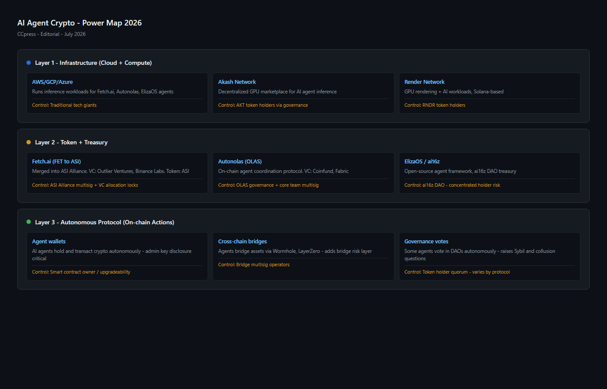
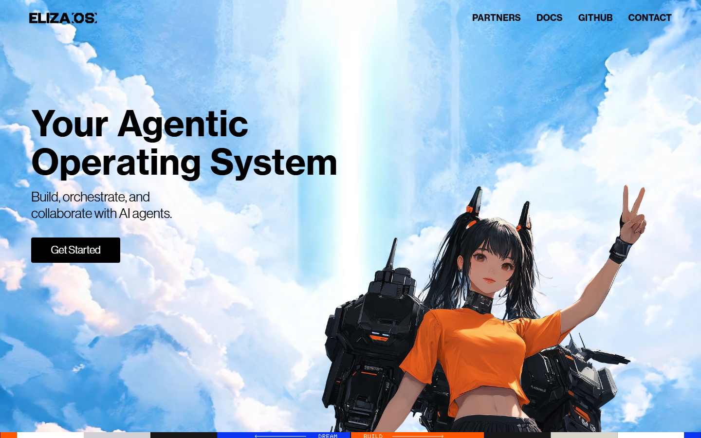

---
title: "Who Controls AI Agent Crypto Projects? The Power Map Behind the 2026 Boom"
slug: ai-agent-crypto-power-map-2026
meta_title: "Who Controls AI Agent Crypto Projects in 2026? The Power Map Behind the Boom"
meta_description: "An investigation into who actually controls AI agent crypto projects — VC backers, admin keys, governance tokens and the accountability gap regulators have not addressed."
date: 2026-07-30
last_reviewed: 2026-07-30
site: ccpress
category: investigations
tags: [ai agent crypto 2026, ai crypto power map, ai16z elizaos, virtual protocol, olas network crypto]
schema: Article, FAQPage
word_count_target: 3500
---

ai16z, the AI agent fund that reached $500 million in assets under autonomous management by early 2026, is governed by a DAO. The DAO's founding team retains administrative override keys.

That detail matters more than any yield figure or autonomy claim. In the AI agent crypto space, the gap between what is presented to users (autonomous, decentralized, trustless) and what is actually true (admin keys, VC control, team-controlled parameters) is the central accountability question nobody is asking loudly enough.

**Featured Image**
File: `../media/P-01-ai-agent-crypto-power-map.png`
Alt text: "AI agent crypto power map showing infrastructure, token, and protocol layers with control structures"
Caption: "AI agent crypto project power structure reviewed in July 2026 — infrastructure layer, token layer, and autonomous protocol layer with their respective control mechanisms."

*AI agent crypto power map reviewed as part of CCpress investigation, July 2026.*

**Live Screenshot — ElizaOS AI Agent Framework (July 2026)**
File: `../media/live-elizaos-homepage.png`
Alt text: `ElizaOS AI agent open-source framework homepage, reviewed July 2026`
Caption: `ElizaOS homepage reviewed in July 2026 — the open-source AI agent framework at the center of the ai16z ecosystem, infrastructure layer not a speculative token.`

*ElizaOS homepage reviewed in July 2026.*

## Three types of AI agent crypto projects

Before the accountability question, the taxonomy. These three types are not interchangeable, and most coverage treats them as if they are.

**Type 1: Infrastructure (tools for building agents).** ElizaOS (the AI agent framework open-sourced by the ai16z team) and Olas Network fall here. These are not funds or investment products. They are development tools that enable others to build AI agents. The risk profile is developer adoption risk, not financial custody risk.

**Type 2: Agent tokens (speculative, agent-themed).** VIRTUAL (Virtual Protocol), ai16z (the token associated with the ai16z DAO), GOAT (Great Oven of AI Tokens, a memecoin that became a cultural moment), and hundreds of copycat tokens. These are speculative assets. Their price reflects market sentiment about AI-crypto as a narrative, not operational cash flow from actual autonomous agents. Many of them are controlled by small teams with concentrated token allocations.

**Type 3: Autonomous DeFi protocols.** Fetch.ai (now merged into ASI Alliance), Bittensor (TAO), and Autonolas represent the most technically complex category: systems where AI agents are meant to execute economic actions (staking, trading, consensus) with varying degrees of human oversight removal. This is where the accountability gap is most serious.

The distinction matters because the risk profile is completely different. An ElizaOS user faces developer adoption risk. A VIRTUAL token holder faces speculative volatility and team concentration risk. A Bittensor validator faces smart contract risk, model validation risk, and governance risk simultaneously.

## The VC layer

**Screenshot 1**
File: `../media/P-01-ai-agent-vc-backing-structure.png`
Alt text: "AI agent crypto VC backing structure showing investor relationships and token allocations"
Caption: "AI agent crypto VC investment structure reviewed in July 2026 — major backers, token allocations, and lock-up periods across key projects."

The AI agent crypto space in 2026 is heavily VC-backed. That is not inherently problematic. But VC backing creates specific incentive structures that users should understand before treating any project's "decentralization" claims at face value.

**ai16z (ElizaOS).** The project was founded by @shawmakesmagic (Shaw Walters) and associates with an explicit connection to the "AI x crypto" thesis. The ai16z DAO raised money from crypto-native VCs and launched the ai16z token. The DAO governance structure was designed with token-weighted voting, which in practice means the largest token holders (including the founding team's allocation) have the most governance power.

**Virtual Protocol (VIRTUAL).** Virtual Protocol raised from institutional crypto VCs. The VIRTUAL token represents governance rights over the protocol's AI agent deployment framework. Token concentration analysis from on-chain data shows the top 10 wallets holding a significant portion of supply in the first year post-launch.

**Olas Network.** Olas raised from established crypto VCs including Lightspeed Faction and others. Its governance structure (OLAS token holders) theoretically controls key protocol parameters, but the founding team (Valory) built the core infrastructure and controls the development roadmap.

**Bittensor (TAO).** Bittensor's development is led by Opentensor Foundation, a nonprofit. The TAO token funds validator incentives and governance. The concentration of TAO among early validators and the foundation itself is a known governance risk that the project acknowledges publicly.

The pattern across all four: VC backers and founding teams hold significant token allocations. Governance votes that affect protocol risk parameters require majority token votes. In practice, this means the same entities who benefited from early investment also control the governance that determines user risk exposure.

## The admin key question

Admin keys are the specific technical control mechanism that the AI agent crypto space does not discuss enough in its public documentation.

An admin key is a cryptographic key that grants privileged access to a smart contract. In most DeFi protocols, admin keys can: pause the protocol, upgrade contract code, change risk parameters, or, in poorly designed systems, drain funds.

**The [Synthetix](https://synthetix.io/) precedent is instructive.** Synthetix, a DeFi protocol that predates the AI agent wave, maintained admin key control over its oracle system. In 2019, an oracle failure combined with admin response prevented a potentially catastrophic exploit but also demonstrated that admin intervention in "decentralized" systems is real and consequential.

For AI agent crypto protocols:

**ai16z DAO.** The founding team retains multisig keys over the DAO treasury and certain protocol parameters. This is disclosed in documentation but not prominently featured in marketing materials. The practical implication: DAO governance votes can be overridden by multisig action in emergency scenarios, as defined by the multisig holders.

**Virtual Protocol.** The founding team controls the protocol upgrade path via a multisig. Community governance can vote on parameters, but contract upgrades require team approval. This is standard DeFi practice but contradicts the "fully autonomous" framing sometimes used in marketing.

**Olas/Autonolas.** Valory (the founding company) controls the primary development infrastructure. The on-chain governance handles parameter changes, but the core infrastructure upgrade path runs through the founding company's decision-making.

The honest framing is: most AI agent crypto protocols are governed by their founding teams with token-holder input. That is not decentralized in the sense that the word is typically used in crypto marketing. It is a corporate governance model with a token layer on top.

## The regulatory vacuum

Neither the SEC nor the CFTC has specifically addressed AI agent protocols in the crypto space as a regulatory category. That creates three specific regulatory risks:

**Security classification risk.** If an AI agent token's value is derived from the anticipated efforts of the founding team (Howey Test again), it may be an unregistered security. The SEC has not ruled on AI agent tokens specifically. Several token structures in this space have characteristics that would invite Howey Test scrutiny.

**Investment adviser risk.** If an AI agent autonomously manages user funds and makes investment decisions on behalf of those users, the entity operating the agent may be subject to Investment Adviser Act registration requirements. The protocol teams have not addressed this risk publicly.

**Market manipulation risk.** If AI agents in the same protocol coordinate trading activity that affects asset prices, this may constitute market manipulation under existing securities and commodity laws. The SEC and CFTC have brought enforcement actions for coordinated trading without distinguishing between human and automated actors.

## The autonomous capability matrix

| Project | Holds user funds | Executes trades autonomously | Deploys contracts | Removes human override | Real operational revenue |
|---------|-----------------|---------------------------|-----------------|----------------------|------------------------|
| ElizaOS (infrastructure) | No | No | No | N/A | No |
| Virtual Protocol | No | Partial | No | No | Partial |
| ai16z DAO | Yes (treasury) | Partial | No | No (multisig remains) | Limited |
| Olas/Autonolas | No | Yes (agents) | Yes | Partial | Limited |
| Fetch.ai/ASI | No | Yes (agents) | Partial | No | Yes (enterprise) |
| Bittensor | No | Yes (model validation) | No | No | Yes (incentives) |

The matrix shows that the most commercially mature projects (Fetch.ai/ASI, Bittensor) are the ones with actual operational revenue from their autonomous systems. The most speculative tokens (ai16z token, VIRTUAL) have limited demonstrated operational output relative to their market capitalization.

## Due diligence checklist for AI agent crypto projects

**Screenshot 2**
File: `../media/P-01-ai-agent-due-diligence-checklist.png`
Alt text: "AI agent crypto due diligence checklist showing admin keys, VC allocation, and governance structure questions"
Caption: "AI agent crypto due diligence framework reviewed in July 2026 — admin key disclosure, VC token allocation, and governance control structure verification."

Before interacting with any AI agent crypto project:

1. **Who holds the admin keys?** Where is this disclosed in documentation? If not disclosed, walk away.
2. **What is the founding team's token allocation?** Is it locked? For how long?
3. **What does the governance token actually control?** List the specific parameters. Can it be used to drain user funds?
4. **Is there real operational revenue?** Or is the token's value entirely dependent on narrative?
5. **What is the claimed level of autonomy?** Is there a verifiable technical basis for that claim, or is "autonomous" a marketing description?
6. **Who are the VC backers?** What are their exit incentive structures?

## What remains unresolved

The AI agent crypto space in 2026 presents itself as a new paradigm of autonomous economic actors. The practical reality is that most projects are founded by small teams with significant token concentrations, backed by VCs with standard exit incentives, governed through nominal DAOs where founding team multisigs retain real control, and operating without any regulatory framework that addresses their specific structure.

The question regulators have not answered, and the industry has not asked loudly enough, is this: when an AI agent holds user funds and executes trades on their behalf, losing money in the process, who is responsible? The founding team that wrote the code? The DAO token holders who approved the risk parameters? The VC who funded the development? The user who connected their wallet?

Currently, the answer is the user. That is not disclosed in any marketing material in this space.

## Frequently asked questions

**Is ai16z a real AI fund?**
ai16z is a DAO with an AI-agent-managed treasury. The "management" is partial autonomy: AI agents provide trading signals or execute certain strategies, but the founding team retains multisig control over the treasury. It is not a fully autonomous fund in the literal sense.

**What is the difference between an AI agent token and an AI agent protocol?**
AI agent tokens (ai16z token, VIRTUAL, GOAT) are speculative assets. Their value reflects market sentiment about the AI-crypto narrative. AI agent protocols (Fetch.ai, Bittensor) are operational systems where AI agents actually perform work with economic value. The risk profiles are different.

**Are AI agent crypto tokens regulated?**
The SEC has not issued specific guidance on AI agent tokens. Depending on structure, individual tokens may be subject to securities regulations under the Howey Test. No AI agent token has received explicit SEC exemption or registration as of July 2026.

**Who controls the Olas Network?**
Olas governance is theoretically controlled by OLAS token holders via on-chain voting. The founding company Valory controls the core development infrastructure and holds a significant portion of early token allocation. The practical control distribution favors the founding team over the broader token holder community.

**Can AI agent protocols manipulate markets?**
AI agents that coordinate trading activity may trigger market manipulation concerns under existing CFTC or SEC frameworks. The protocols do not explicitly address this risk. Neither regulator has issued guidance specific to autonomous AI trading agents in crypto.
