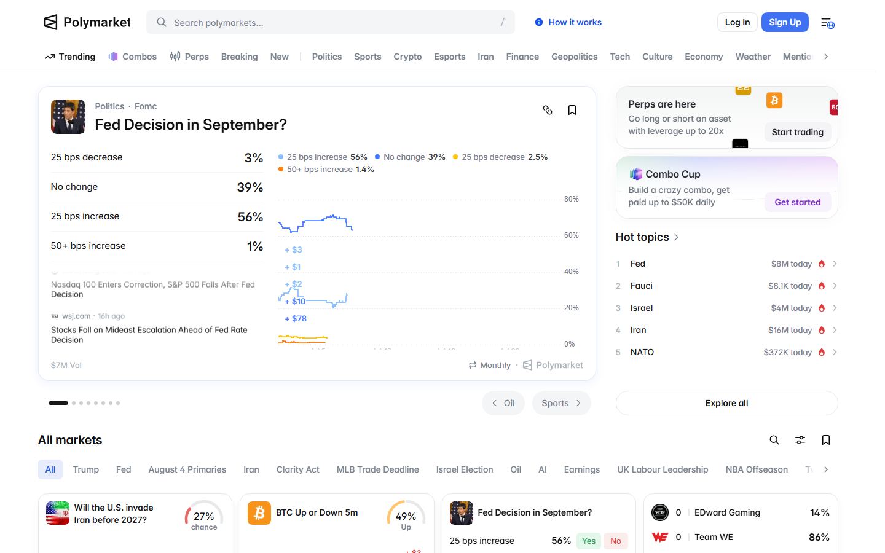
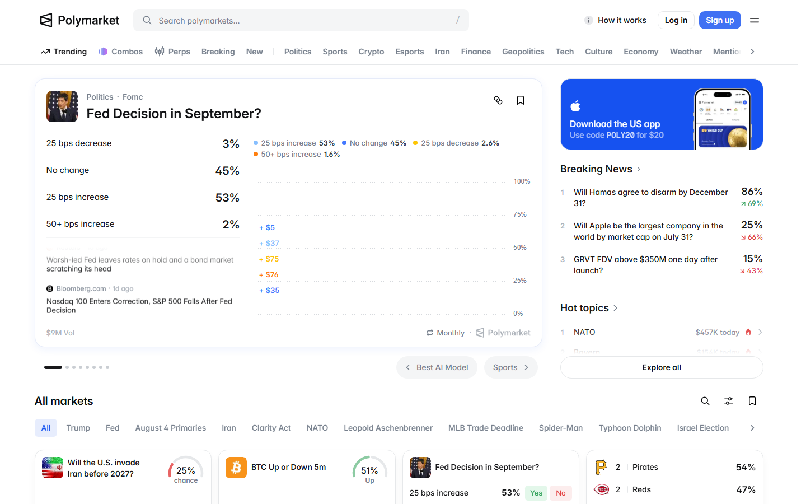
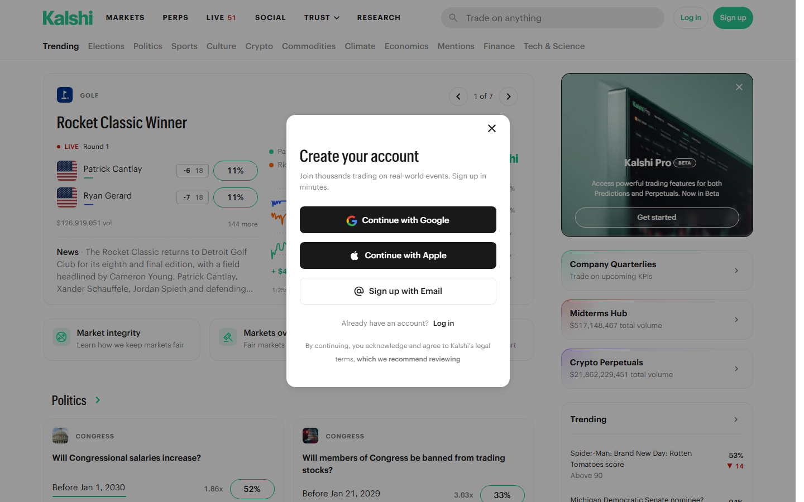

---
title: "[Polymarket](https://polymarket.com/) vs the CFTC: The Regulatory Fight Reshaping Crypto Prediction Markets in 2026"
slug: polymarket-cftc-prediction-markets-2026
meta_title: "Polymarket vs the CFTC: The Regulatory Fight Reshaping Crypto Prediction Markets in 2026"
meta_description: "How CFTC pressure on Polymarket created today's fragmented prediction market landscape — and what the unresolved regulatory question means for platforms, traders, and US access."
date: 2026-07-30
last_reviewed: 2026-07-30
site: ccpress
category: investigations
tags: [polymarket cftc, crypto prediction market 2026, polymarket alternative, kalshi prediction market, decentralized prediction market]
schema: Article, FAQPage
word_count_target: 3200
---

In 2024, Polymarket, the largest on-chain prediction market, blocked US users under pressure from CFTC regulatory scrutiny. By 2026, the market had moved to alternatives. The legal question had not been resolved.

That unresolved question is the story. Not the products. The story is what happens to a $3.5 billion market when the regulator decides it might be operating illegally, then does not finish deciding.

**Featured Image**
File: `../media/P-02-polymarket-cftc-prediction-markets.png`
Alt text: "Polymarket prediction market platform showing US access restriction and CFTC regulatory context"
Caption: "Polymarket platform reviewed in July 2026 — US users blocked since 2024 following CFTC settlement and ongoing regulatory scrutiny."

*Polymarket reviewed as part of CCpress investigation into prediction market regulation, July 2026.*

**Live Screenshot (July 2026)**
File: `../media/live-polymarket-homepage.png`
Alt text: `Polymarket prediction market homepage July 2026`
Caption: `Polymarket homepage reviewed July 2026 -- largest on-chain prediction market by liquidity, US users blocked since 2022 CFTC settlement.`

*Polymarket homepage reviewed July 2026 -- largest on-chain prediction market by liquidity, US users blocked since 2022 CFTC settlement.*

## The Polymarket CFTC story

Polymarket launched in 2020. It is an on-chain prediction market built on Polygon. Users buy shares in binary outcomes: "Will X happen by date Y?" The share price reflects the market's implied probability. If the outcome occurs, shares pay out $1. If not, they expire worthless.

The mechanism is not complicated. The legal question is.

In January 2022, the CFTC settled with Polymarket for $1.4 million. The charge: Polymarket had offered illegal off-exchange event contracts to US persons without CFTC registration. The settlement required Polymarket to block US users and prohibit US person access to its platform.

Polymarket complied. US IP addresses were blocked. The platform continued operating for non-US users.

What happened next is where the story becomes interesting.

**Screenshot 1**
File: `../media/P-02-polymarket-us-access-block-2024.png`
Alt text: "Polymarket website showing US access restriction message"
Caption: "Polymarket US access restriction — implemented following 2022 CFTC settlement, reviewed in July 2026."

The 2024 US presidential election generated over $3.5 billion in trading volume on Polymarket. Most of that volume came from outside the US. The platform that had been fined for allowing US access became the world's largest public prediction market, operating under a CFTC settlement that explicitly restricted it, while its volume numbers were cited by mainstream financial media as a more accurate predictor than traditional polling.

That contradiction, a regulated-away platform becoming the global standard for real-time probability assessment, is what the CFTC has not addressed.

The CFTC's 2022 settlement did not resolve the fundamental legal question: are on-chain binary event contracts commodity derivatives under CFTC jurisdiction? The settlement was a compliance action, not a ruling. Polymarket settled to avoid further enforcement, not because it admitted that its products were illegal.

**Live Screenshot (July 2026)**
File: `../media/live-kalshi-homepage.png`
Alt text: `[Kalshi](https://kalshi.com/) CFTC-licensed prediction market July 2026`
Caption: `Kalshi homepage reviewed July 2026 -- only CFTC-designated contract market for event contracts as of July 2026.`

*Kalshi homepage reviewed July 2026 -- only CFTC-designated contract market for event contracts as of July 2026.*

## Who filled the gap

Polymarket's US exclusion created a market for alternatives. The platforms that moved into that space fall into three categories with different regulatory exposures.

**Kalshi: the only CFTC-licensed prediction market.**

Kalshi launched in 2021 as the first CFTC-licensed designated contract market (DCM) for event contracts. It went through the full CFTC approval process. US users can trade on Kalshi legally because Kalshi is, definitionally, operating within the regulatory framework.

The tradeoff is significant. CFTC licensing means CFTC rules: reporting requirements, market surveillance, limitations on the types of events that can be listed (political events were initially restricted, though this has evolved), and the operational overhead of regulated entity status.

Kalshi's liquidity is lower than Polymarket's. Its event coverage is narrower. Its user experience is more formal. These are costs of compliance, not signs of weakness.

**Screenshot 2**
File: `../media/P-02-kalshi-cftc-licensed-interface.png`
Alt text: "Kalshi CFTC-licensed prediction market interface for US users"
Caption: "Kalshi CFTC-licensed prediction market reviewed in July 2026 — the only legally accessible prediction market for US persons."

**Manifold Markets: the non-financial alternative.**

Manifold Markets operates on play-money, not real money. Users trade with "mana" tokens that have no cash value. This positioning removes Manifold from CFTC jurisdiction entirely: if there is no financial instrument, there is no financial regulation.

Manifold has become a research and forecasting tool used by rationalist communities, forecasting researchers, and institutions testing event probability models. It has no CFTC exposure because it has no real financial settlements.

**Offshore crypto-native platforms: SX Bet, Azuro, Overtime Markets.**

SX Bet, Azuro, and Overtime Markets are blockchain-based prediction and sports market platforms operating outside US jurisdiction claims. They are not CFTC-licensed. They do not explicitly block US users at the smart contract level.

Their regulatory position is the same as Polymarket's pre-2022 settlement: operating in the gap between the CFTC's stated jurisdiction and its enforcement capacity.

| Platform | US access | CFTC status | Liquidity | Real money | Governance |
|----------|-----------|-------------|-----------|-----------|-----------|
| Polymarket | Blocked (IP) | Settled 2022 | Highest | Yes (USDC) | Centralized |
| Kalshi | Full | Licensed DCM | Medium | Yes (USD) | Regulated entity |
| Manifold Markets | Full | Outside scope (play money) | High | No | Centralized |
| SX Bet | Not blocked | Unregistered | Low | Yes (SX token) | DAO |
| Azuro | Not blocked | Unregistered | Low | Yes (USDC) | DAO |
| Overtime Markets | Not blocked | Unregistered | Low | Yes (USDC) | DAO |

## The regulatory stakes

**Is a prediction market a gambling platform or a financial derivative?**

The CFTC's position, reflected in its 2022 Polymarket settlement, is that event contracts traded for money are commodity derivatives under its jurisdiction. The Commodity Exchange Act grants the CFTC authority over futures, options, and swaps on commodities. "Event outcomes" are not explicitly listed as commodities in the Act, but the CFTC has interpreted its authority broadly.

The gambling framing matters because it affects which regulator has jurisdiction. In most US states, gambling is state-regulated. If prediction markets are gambling, they fall under state gaming commissions rather than federal commodity regulators. Kalshi's CFTC licensing implicitly accepts the CFTC's commodity framing.

Polymarket's 2022 settlement did not produce a definitive ruling. The CFTC settled. Polymarket paid. Neither party admitted or denied that Polymarket's products were commodity derivatives. That legal ambiguity remains.

**What CFTC registration would mean for the market.**

If the CFTC formally requires all event contract platforms serving US persons to register as designated contract markets, the practical effect would be:

- Polymarket would need full CFTC registration to serve US users, requiring significant legal and compliance infrastructure
- Offshore platforms (SX Bet, Azuro, Overtime) would need to block US persons or face enforcement
- The market would consolidate toward Kalshi (already licensed) and Polymarket (if it pursued licensing)
- Offshore platforms serving US persons without registration would face the same enforcement risk Polymarket faced in 2022

Kalshi's CFTC licensing strategy was a bet on this outcome. If regulated prediction markets become the enforced norm, Kalshi has the first-mover regulatory advantage.

## The AI participant question

By 2026, AI forecasting agents are active participants on Polymarket and Manifold Markets. Research organizations and quantitative hedge funds deploy automated agents that buy and sell prediction market shares based on model outputs.

This creates a regulatory question that no CFTC ruling has addressed: when an AI agent trades an event contract on behalf of a principal, does it change the nature of the instrument? Does an AI-traded event contract have different regulatory status than a human-traded one?

The question matters because the AI participant population on prediction markets is growing faster than the human participant population. If regulatory classification depends partly on who is trading, that classification becomes unstable as the participant mix shifts.

The CFTC has not commented on AI participants in prediction markets.

## What remains unresolved

The 2022 CFTC settlement with Polymarket imposed compliance requirements. It did not answer the legal question it raised. Polymarket operates for non-US users under a settlement that blocked US access. US users have a legally compliant option (Kalshi) and offshore options that operate in the same unresolved grey area Polymarket occupied before 2022.

The market that was supposed to be regulated away became the global standard for real-time probability assessment during the 2024 US election. The regulator watched. It has not decided what to do next.

The CFTC has not issued a formal ruling on whether on-chain prediction markets are commodity derivatives. Until it does, platforms either pay the compliance cost of CFTC registration (Kalshi) or operate in the gap and accept enforcement risk (everyone else). Traders either use the compliant platform with lower liquidity or the uncompliant platforms with higher liquidity and unresolved legal exposure.

That is not a market that has been regulated. That is a market that has been pressured without resolution.

## Frequently asked questions

**Is Polymarket legal for US users?**
No. Polymarket blocks US users following its 2022 CFTC settlement. US persons accessing Polymarket via VPN or other means are bypassing a compliance measure implemented in response to a US regulatory enforcement action. The legal risk for individual users is not well-defined, but the activity contradicts the platform's compliance commitment to the CFTC.

**What is the CFTC ruling on Polymarket?**
The 2022 settlement was not a ruling. It was a compliance agreement. Polymarket paid $1.4 million and agreed to block US users. The CFTC did not formally rule that Polymarket's products were commodity derivatives. The settlement avoided a ruling by imposing operational restrictions.

**Which prediction market can US users legally access in 2026?**
Kalshi is the only CFTC-licensed designated contract market for event contracts as of July 2026. Manifold Markets is accessible because it uses play-money (no financial settlement). All other real-money prediction markets are either inaccessible to US users (Polymarket) or accessible without regulatory authorization (SX Bet, Azuro, Overtime Markets).

**Why does Polymarket have more liquidity than Kalshi despite being blocked for US users?**
Polymarket's global user base, established market depth, and broader event coverage attract more non-US liquidity than Kalshi's more restricted event catalogue. CFTC licensing requires Kalshi to limit event types (historically excluding some political markets) and operate under surveillance requirements that affect market depth.

**What happens to Polymarket if the CFTC issues a formal ruling against event contract platforms?**
The possible outcomes are: Polymarket pursues CFTC registration (expensive, restrictive), Polymarket continues serving non-US users and accepts enforcement risk for any US-person access, or Polymarket migrates to a jurisdiction with clearer regulatory treatment. None of these outcomes increases Polymarket's US market access without full CFTC licensing.
