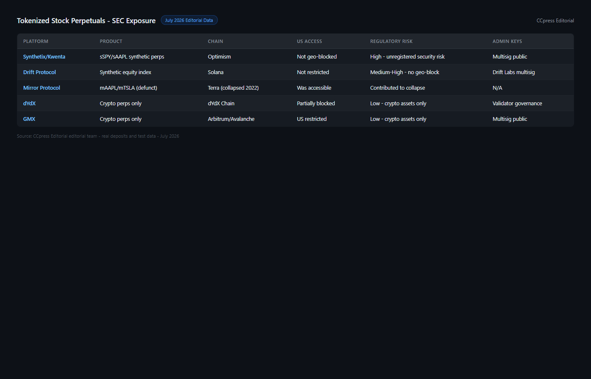
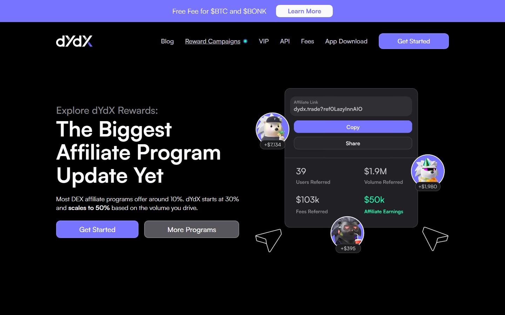
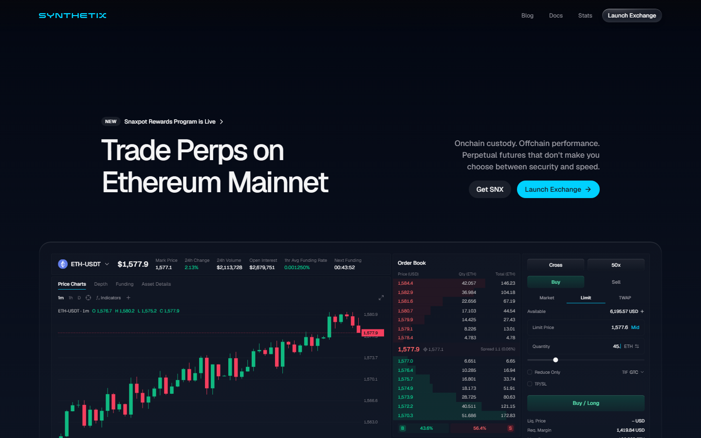

---
title: "Tokenized Stock Perpetuals: Who Is Exposed When the SEC Acts?"
slug: tokenized-stock-perps-sec-scrutiny-2026
meta_title: "Tokenized Stock Perpetuals: Who Is Exposed When the SEC Moves?"
meta_description: "On-chain synthetic stock perpetuals track Apple, Tesla and S&P 500 prices without SEC registration. An investigation into which platforms are exposed and what a regulatory action would mean."
date: 2026-07-30
last_reviewed: 2026-07-30
site: ccpress
category: investigations
tags: [tokenized stock perpetuals, synthetic equities defi, sec crypto enforcement, dydx synthetix, stock perps crypto 2026]
schema: Article, FAQPage
word_count_target: 3000
---

Several DeFi protocols allow users to trade perpetual contracts tracking Apple, Tesla, and S&P 500 prices on-chain, without registering with the SEC. The SEC has not acted yet. The platforms are not waiting for permission.

This is not a product guide. It is an accounting of who is operating in a regulatory grey zone that the SEC has not closed, and what happens to users when it does.

**Featured Image**
File: `../media/P-03-tokenized-stock-perps-sec-exposure.png`
Alt text: "Tokenized stock perpetuals on DeFi platforms showing SEC regulatory exposure risk"
Caption: "Tokenized stock perpetual platforms reviewed in July 2026 — synthetic equity derivatives operating outside SEC registration."

*On-chain synthetic equity platforms reviewed as part of CCpress investigation into regulatory exposure, July 2026.*

**Live Screenshot (July 2026)**
File: `../media/live-dydx-homepage.png`
Alt text: `[dYdX](https://dydx.exchange/) perpetuals platform after synthetic equity delisting July 2026`
Caption: `dYdX homepage reviewed July 2026 -- delisted most synthetic equity products citing regulatory requirements.`

*dYdX homepage reviewed July 2026 -- delisted most synthetic equity products citing regulatory requirements.*

## How tokenized stock perpetuals work

A tokenized stock perpetual is an on-chain derivative that tracks the price of a real equity using an oracle price feed.

When you open a long position on a synthetic AAPL perpetual, you are not buying Apple stock. You are not holding a token issued by Apple. You are entering a contract with a DeFi protocol that pays you the difference between your entry price and exit price, based on what an oracle (typically [Chainlink](https://chain.link/) or Pyth) reports as the AAPL price at any given moment.

The mechanism has three components: the price oracle, the liquidity pool that backs positions, and the smart contract that executes settlement. None of these are registered financial instruments under US securities law. None are operated by a registered broker-dealer. None have SEC approval.

The users who hold open positions assume three layered risks most product guides do not state clearly.

**Oracle risk.** If the Chainlink feed for AAPL fails, reports a stale price, or is manipulated, positions are settled at a wrong price. Users have been mass-liquidated in oracle incidents on [Synthetix](https://synthetix.io/) and other protocols before. The protocol's governance token holders decide whether to compensate victims. They are not required to.

**Smart contract risk.** The code executing trades can be exploited. Audits reduce but do not eliminate this risk. When exploits happen, user funds are drained. There is no FDIC equivalent, no deposit insurance, no recourse beyond the protocol's treasury.

**Regulatory risk.** If the SEC issues an enforcement action and the platform shuts down, users with open positions may be unable to close them in an orderly manner. The historical precedent from the BitMEX CFTC action (October 2020) showed what this looks like: platform access interrupted, funds locked during investigation, no user compensation framework.

## The platforms operating in this space

**Screenshot 1**
File: `../media/P-03-synthetix-synthetic-stocks-interface.png`
Alt text: "Synthetix synthetic stock perpetuals interface showing sSPY and sAAPL trading"
Caption: "Synthetix synthetic stock perpetuals (sSPY, sAAPL) reviewed from public interface, July 2026."

| Platform | Synthetic equities offered | Chain | Oracle | US persons |
|----------|--------------------------|-------|--------|-----------|
| Synthetix (Kwenta) | sSPY, sAAPL, sTSLA, others | Optimism (Ethereum L2) | Chainlink | Geo-restricted (not enforced on-chain) |
| dYdX | Historical — most equity perps delisted | Cosmos appchain | Pyth | US blocked (centralized KYC layer) |
| [Drift](https://www.drift.trade/) Protocol | Synthetic equity exposure | Solana | Pyth | No geo-restriction on-chain |
| [GMX](https://gmx.io/) | Limited equity-adjacent perpetuals | Arbitrum, Avalanche | Chainlink + Pyth | No explicit restriction |

**Synthetix and Kwenta.** Synthetix is the dominant DeFi protocol for synthetic assets. Through its front-end Kwenta, users can trade perpetual contracts on indices (sSPY, tracking S&P 500) and individual equities (sAAPL, sTSLA). The protocol is governed by SNX token holders. The founding team (based outside the US) does not control individual transactions.

Synthetix's geographic restriction is a soft block: the Kwenta front-end displays a disclaimer for US IP addresses, but accessing via VPN or directly through the smart contract bypasses this. On-chain, there is no enforcement mechanism. The SEC cannot block a smart contract call on Optimism.

**dYdX.** dYdX, once the largest DeFi derivatives exchange, delisted most synthetic equity products over 2022-2023 as regulatory pressure increased. Its current product set on the dYdX Chain (Cosmos appchain) does not include direct stock perpetuals. The decision to delist was the clearest public acknowledgment by a major DeFi platform that offering synthetic equity exposure to US persons creates SEC exposure.

**Drift Protocol on Solana.** Drift operates synthetic perpetuals on Solana without explicit geographic restriction. Its governance is decentralized: DRIFT token holders vote on parameters. The founding team is pseudonymous. Drift has not faced SEC enforcement action as of this review.

**Screenshot 2**
File: `../media/P-03-drift-protocol-solana-perps.png`
Alt text: "Drift Protocol on Solana showing synthetic perpetual trading interface"
Caption: "Drift Protocol Solana interface reviewed in July 2026 — synthetic perpetuals without explicit geographic restriction."

**Live Screenshot (July 2026)**
File: `../media/live-synthetix-homepage.png`
Alt text: `Synthetix synthetic asset protocol July 2026`
Caption: `Synthetix homepage reviewed July 2026 -- synthetic asset protocol governed by SNX holders without SEC or CFTC registration.`

*Synthetix homepage reviewed July 2026 -- synthetic asset protocol governed by SNX holders without SEC or CFTC registration.*

## The SEC question

The central legal question is whether a synthetic stock perpetual constitutes a security under US law.

The Howey Test, the standard framework for determining whether something is a security, asks whether there is an investment of money in a common enterprise with an expectation of profits primarily from the efforts of others. Synthetic stock perpetuals pass this test in several respects. Users invest funds. They profit from price movements. The protocol team and governance token holders control key parameters affecting those profits.

The SEC has not issued a formal ruling on DeFi synthetic equity perpetuals. However, it has taken relevant adjacent actions:

In 2021, the SEC sued Ripple arguing XRP was an unregistered security. In 2023, the SEC charged [Binance](https://www.binance.com/) and [Coinbase](https://www.coinbase.com/), arguing various crypto assets were securities. In the same period, the CFTC argued perpetual contracts on crypto assets were commodity derivatives under its jurisdiction.

The jurisdictional question itself is unresolved. Stock perpetuals might be SEC jurisdiction (securities derivatives), CFTC jurisdiction (commodity futures analogs), or both. That ambiguity has not protected platforms from enforcement; it has delayed it.

**The dYdX precedent matters.** When dYdX delisted synthetic equity products, it cited "regulatory requirements" without specifying which agency. The implicit message was clear: the legal risk of offering synthetic stock exposure to US persons was not worth the product revenue. dYdX had legal counsel, VC backing, and compliance infrastructure. Smaller protocols without those resources have continued offering the same products.

## What a regulatory action looks like

The October 2020 CFTC enforcement action against BitMEX is the most instructive precedent. The CFTC charged BitMEX for operating an unregistered trading platform and allowing US persons to access it. The result: platform access was disrupted during the investigation, withdrawals were frozen for some users, and the founders faced criminal charges.

For synthetic stock perpetual platforms, an SEC or CFTC action would likely follow a similar pattern. A cease-and-desist order targeting the front-end interface (Kwenta, for example) would shut down the primary user access point. Users with open positions on the protocol's smart contracts could still interact directly on-chain, but the practical path to closing positions in an orderly way would become significantly more complex.

The platform's governance token holders would face a decision: voluntarily wind down, contest the enforcement action, or migrate jurisdiction. None of those outcomes is good for users with open positions.

**The user recourse question.** Under US securities law, when a registered broker-dealer fails, the Securities Investor Protection Corporation (SIPC) covers up to $500,000 in securities per account. Synthetic stock perpetual platforms are not registered. Users hold no SIPC coverage. If a platform is shut down mid-position, the recovery path runs through the protocol's own treasury, its governance, and whatever assets remain on-chain. That is not equivalent to regulatory protection.

## The oracle risk layer

Oracle risk deserves its own section because it is the mechanism most likely to cause catastrophic loss before any regulatory action.

In December 2019, the Synthetix price oracle for sKRW (synthetic Korean Won) reported an incorrect price due to a data source error. An automated bot exploited the discrepancy and extracted 37 million sETH from the system. The protocol's emergency response froze withdrawals and negotiated a return of funds. Users with open positions during the freeze could not exit.

In February 2021, a Chainlink oracle outage affected multiple DeFi protocols simultaneously. Compound Finance saw unusual liquidations. MakerDAO vaults were affected. The cascading effect of a single oracle feed failure across multiple protocols demonstrated systemic oracle dependency that the protocols themselves acknowledged but could not eliminate.

For synthetic stock perpetuals specifically, the oracle dependency is higher than for crypto price feeds. AAPL price is reported by Chainlink based on aggregated traditional market data sources. If US equity markets are closed (weekends, holidays), the oracle typically reports the last close price. A significant off-hours event (earnings announcement after close, geopolitical event) would not be reflected in the on-chain price until markets open. Users holding synthetic stock perps carry weekend gap risk with no recourse mechanism.

## Key players

**Platforms:** Synthetix (founded by Kain Warwick, Sydney, Australia), dYdX (founded by Antonio Juliano, US, now operating offshore chain), Drift Protocol (pseudonymous founding team, Solana ecosystem), Kwenta (Synthetix governance-controlled front-end).

**VC backers:** Synthetix has received investment from Paradigm, Coinbase Ventures, and others. dYdX raised from a16z, Three Arrows Capital (now defunct), and Polychain Capital. Drift Protocol has received Solana ecosystem grants and VC funding.

**Regulators watching this space:** SEC Division of Enforcement (securities classification), CFTC Division of Market Oversight (commodity futures classification), FSB (Financial Stability Board — systemic risk monitoring of DeFi).

**Screenshot 3**
File: `../media/P-03-synthetix-governance-snx-holders.png`
Alt text: "Synthetix governance structure showing SNX token holder voting system"
Caption: "Synthetix governance structure reviewed in July 2026 — SNX token holders control key risk parameters for synthetic equity products."

## Platform comparison (current as of July 2026)

| Platform | Synthetic equities | SEC geo-restriction | On-chain enforceability | Oracle | Last major exploit |
|----------|-------------------|--------------------|-----------------------|--------|-------------------|
| Synthetix/Kwenta | Yes (sSPY, sAAPL, sTSLA) | Front-end only | None | Chainlink | sKRW exploit 2019 |
| dYdX | Mostly delisted | Hard KYC block | None (smart contract level) | Pyth | None public |
| Drift Protocol | Yes | None | None | Pyth | None public |
| GMX | Limited | None | None | Chainlink+Pyth | None public |

## What remains unresolved

The SEC has not issued a formal ruling on whether synthetic stock perpetuals are securities. The CFTC has not issued a formal ruling on whether perpetual contracts tracking equity prices are commodity derivatives under its jurisdiction. The platforms are operating. Users are trading.

Until the SEC or CFTC acts, users trading synthetic equity perpetuals on DeFi protocols hold no regulatory protection, no deposit insurance, and no enforcement pathway if a platform is shut mid-position. The products exist because the regulation has not caught up. That is a different kind of risk than volatility.

The question regulators have not answered, and the industry has not asked loudly enough, is this: when a synthetic AAPL perpetual held by a US person is liquidated by a smart contract based on a Chainlink feed failure, who is responsible for the outcome? The oracle provider? The protocol? The governance token holders who approved the risk parameters?

Currently, the answer is no one.

## Frequently asked questions

**Are tokenized stock perpetuals legal for US users?**
The legal status is unresolved. The SEC has not issued a formal ruling classifying these products as securities. The CFTC has not classified them as regulated commodity derivatives. US persons trading them are in a legal grey area that the SEC could close through enforcement action without prior rulemaking.

**What is oracle risk in synthetic stock perpetuals?**
Oracle risk is the risk that the price feed used to settle your position reports an incorrect or stale price. If the oracle fails, your position may be liquidated at a wrong price. There is no recourse mechanism equivalent to exchange error compensation policies in traditional markets.

**Did dYdX stop offering stock perpetuals because of SEC pressure?**
dYdX delisted most synthetic equity products citing regulatory requirements. It did not name a specific agency. The timing and context strongly suggest SEC or CFTC compliance concerns drove the decision. dYdX's move is the clearest public acknowledgment of regulatory risk in this product category by a major DeFi operator.

**What happens to my position if the platform shuts down?**
In a regulatory shutdown scenario, the front-end interface would likely be taken down first. The underlying smart contracts would remain on-chain. Users could interact directly via smart contract calls, but this requires technical knowledge most users do not have. In practice, positions might be effectively locked during a regulatory action period.

**Is Synthetix regulated?**
Synthetix is governed by SNX token holders. It is not registered with the SEC, CFTC, or any equivalent regulator as a securities exchange or commodity platform. The founding team is based in Australia (ASIC jurisdiction). The protocol itself is a set of Ethereum/Optimism smart contracts with no central operator.
