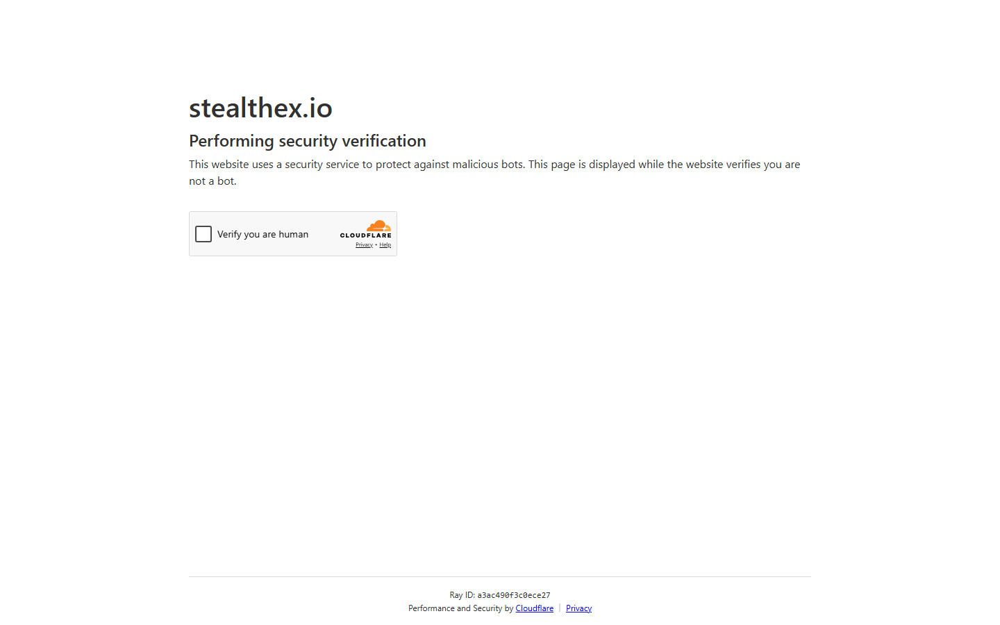

---
title: "StealthEX API Review 2026: Integration, Affiliate Program, and Developer Guide"
slug: "/exchanges/aggregators/stealthex-api-review-2026"
meta_title: "StealthEX API Review 2026: Integration Guide for Wallets and DApps"
meta_description: "StealthEX API review for 2026. How the StealthEX partner API works, affiliate program details, rate endpoints, and how it compares to ChangeNOW API integration."
primary_keyword: "stealthex api"
secondary_keywords:
  - "stealthex api review 2026"
  - "stealthex affiliate program"
  - "stealthex integration"
schema: "Article + FAQPage"
category: "exchanges/aggregators"
last_reviewed: "2026-08-18"
author: "CCpress Editorial Team"
internal_links:
  - "/exchanges/aggregators/stealthex-review-2026"
  - "/exchanges/aggregators/is-stealthex-legit-ccpress-2026"
---

# StealthEX API Review 2026: Integration, Affiliate, and Developer Guide

*By CCpress Editorial Team, Reviewed August 2026*

StealthEX offers a partner API and affiliate program for developers who want to embed no-KYC crypto swap functionality into wallets, dApps, or services. This review covers the API capabilities, affiliate commission structure, and how it compares to ChangeNOW's API, which has wider wallet adoption.

**Screenshot**
File: `../media/live-stealthex-api-page.png`
Alt text: "StealthEX partner/affiliate program page, August 2026"
Caption: "StealthEX affiliate and API partner page captured August 2026."

*StealthEX affiliate and API partner page, captured August 2026.*

---
## StealthEX API overview

StealthEX's API allows third-party services to:
- Query available currency pairs
- Get exchange rates (fixed and floating)
- Create swap transactions
- Check transaction status
- Receive affiliate commissions on completed swaps

The API is REST-based and returns JSON. Authentication uses an affiliate API key.

---

## Key API endpoints

| Endpoint | Function |
|----------|---------|
| `/get_ranges` | Min/max amounts for a currency pair |
| `/get_estimated` | Estimated exchange amount (floating rate) |
| `/get_fixed_rate` | Fixed rate quote for a pair |
| `/create_transaction` | Initiate a swap |
| `/get_transactions` | Check transaction status |

All endpoints require an affiliate ID. Registration is free and available at stealthex.io/partner.

---

## Affiliate program structure

StealthEX's affiliate program pays a commission on completed swaps routed through your API key. Published commission rates vary by volume tier. For high-volume API integrations, custom rates are negotiated directly.

Key points:
- Commission is paid in BTC or USDT
- Payment schedule is weekly for accounts above minimum threshold
- No traffic minimum to start earning

---

## StealthEX API vs ChangeNOW API

| | StealthEX API | ChangeNOW API |
|---|---|---|
| Coin coverage | 1,400+ | 850+ |
| Wallet integrations | Growing | **Wider (more established)** |
| Fixed rate API | Yes | Yes |
| Affiliate program | Yes | Yes |
| API documentation | Available | **More comprehensive** |
| Known integrations | Select wallets | Ledger Live, multiple wallets |

ChangeNOW has stronger wallet ecosystem penetration. StealthEX has the wider coin coverage, which may matter for wallets focused on altcoin or privacy coin swaps.

---

## Use cases for the StealthEX API

**Wallet integration.** Embed swap functionality directly in a non-custodial wallet. Users stay on platform, developer earns affiliate commission.

**dApp swap layer.** Add a no-KYC swap widget to a DeFi interface. StealthEX's 1,400+ coin coverage gives users access to centralized exchange rates for coins not available on-chain.

**Exchange aggregator.** Pull StealthEX rates alongside other providers to build a comparison tool.

**Arbitrage tooling.** Query StealthEX rates against other APIs to surface pricing inefficiencies.

---

## What developers should know

**Rate freshness.** Floating rate quotes are real-time but expire quickly. Fixed rate quotes have a defined validity window (typically 2-3 minutes). Build UI feedback to handle expiry gracefully.

**Minimum amount handling.** All pairs have minimum swap amounts that fluctuate with market rates. Always query `/get_ranges` before displaying a rate to avoid user-facing errors.

**XMR pairs.** XMR-related pairs require payment ID handling in some configurations. Implement accordingly.

**Transaction status polling.** StealthEX does not use webhooks natively. Status must be polled via the transaction status endpoint. Cache results at a reasonable interval (30-60 seconds).

---

## Frequently Asked Questions

**Is the StealthEX API free?**
Yes, registration is free. You earn affiliate commissions rather than paying API fees.

**How does StealthEX compare to ChangeNOW for wallet integration?**
ChangeNOW has more established wallet integrations and better documentation. StealthEX has wider coin coverage. Many developers integrate both and let users select.

**Can I integrate StealthEX into a mobile app?**
Yes. The REST API is mobile-compatible. Use HTTPS, handle rate expiry, and implement transaction polling.

**What is the StealthEX affiliate commission rate?**
Commission rates are volume-tiered and not fully published. Contact StealthEX partner support at stealthex.io/partner for current rates.

