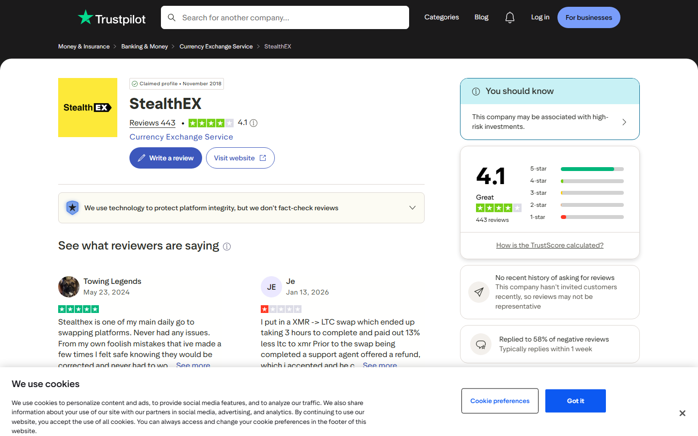

---
title: "Is StealthEX Legit and Safe in 2026? CCpress Security Review"
slug: "/exchanges/aggregators/is-stealthex-legit-ccpress-2026"
meta_title: "Is StealthEX Legit 2026? Security, Trustpilot, and Red Flags Analyzed"
meta_description: "Is StealthEX safe and legit in 2026? CCpress security review covering Trustpilot data, compliance freeze reports, the fake copycat site, and no-KYC policy reality."
primary_keyword: "is stealthex legit"
secondary_keywords:
  - "stealthex legit 2026"
  - "stealthex safe to use"
  - "stealthex security review"
schema: "Article + FAQPage"
category: "exchanges/aggregators"
last_reviewed: "2026-08-18"
author: "CCpress Editorial Team"
internal_links:
  - "/exchanges/aggregators/stealthex-api-review-2026"
  - "/exchanges/aggregators/stealthex-review-2026"
---

# Is StealthEX Legit and Safe in 2026? Security Review

*By CCpress Editorial Team, Reviewed August 2026*

StealthEX is a legitimate non-custodial crypto swap service with 8 years of operation and 10,000+ Trustpilot reviews at 4.8/5. It is not a scam or fraudulent platform. However, documented risks, including compliance freezes on large transactions and a dangerous fake copycat site, require informed use.

**Screenshot**
File: `../media/live-stealthex-trustpilot.png`
Alt text: "StealthEX Trustpilot reviews page, August 2026"
Caption: "StealthEX Trustpilot reviews showing 4.8/5 score across 10,000+ reviews, captured August 2026."

*StealthEX Trustpilot page, captured August 2026.*

---
## Security scorecard

| Factor | Assessment |
|--------|-----------|
| Operating since | 2018 (8 years) |
| Non-custodial | Yes, funds not held |
| Trustpilot score | 4.8/5 |
| Trustpilot reviews | 10,000+ |
| Fake site risk | HIGH, stealth-ex.io is fraudulent |
| Large-amount compliance risk | MEDIUM |
| Regulatory jurisdiction | St. Vincent and the Grenadines |
| Registration required | No |
| KYC required | No (standard amounts) |

---

## The fake copycat site: most important risk

The most significant documented StealthEX risk is not the platform itself but a fraudulent site that copies its interface:

- **Real site:** stealthex.io (no hyphen)
- **Fake site:** stealth-ex.io (with hyphen)

A Trustpilot reviewer documented losing funds to the fake site:

> "I initially believed I had been scammed by StealthEx, but after contacting their official customer support, they were very responsive. Unfortunately, the issue did not come from StealthEx itself, but from a fake imitation website: stealth-ex.io"
>
> Mynameis Jeff, [***** Trustpilot](https://www.trustpilot.com/reviews/6942d2ac1a6b308d693de278), Dec 17, 2025

**Always bookmark the correct URL and verify it before every transaction.**

---

## Non-custodial model: inherent security properties

StealthEX is non-custodial. This means:

- StealthEX never holds your funds beyond the immediate swap
- No exchange hack risk to stored funds (you have no stored funds on StealthEX)
- Transaction errors are not reversible (wrong address = permanent loss)
- No account to compromise (no username/password)

The non-custodial model reduces exchange-custody risk while shifting error responsibility entirely to the user.

---

## Trustpilot data analysis

Across 10,000+ reviews at 4.8/5, the positive majority describes:
- Fast settlement (under 30 minutes on common pairs)
- Smooth no-KYC experience
- Responsive support for standard issues

Negative reviews concentrate on:
- **Compliance freezes** on large amounts (contradicts published unlimited no-KYC policy)
- **Rate discrepancies** between quoted and received amounts
- **Settlement delays** on privacy coin pairs (XMR specifically)

**Notable positive:**

> "Extremely trustworthy and professional service. We encountered a processing delay with a large exchange of several thousand USDT. Instead of leaving us in limbo, their support team proactively communicated and issued a full refund promptly."
>
> hana michi, [***** Trustpilot](https://www.trustpilot.com/reviews/695d5729e9348ba67ab19df2), Jan 06, 2026

**Notable negative:**

> "My 30 BNB swap has been frozen by StealthEX for over 3 MONTHS under a vague compliance review."
>
> Tinney Dustin, [* Trustpilot](https://www.trustpilot.com/reviews/6a6fafcc64ceb531a8b1f36d), Aug 02, 2026

---

## Compliance freeze risk: what it means

Despite marketing unlimited no-KYC, StealthEX applies AML screening to large transactions and flagged wallet addresses. When a transaction is flagged:

- Funds may be held pending "compliance review"
- Review can take days to months per user reports
- Resolution is not guaranteed in all cases

This does not mean StealthEX is stealing funds. It means the published unlimited no-KYC policy is not an absolute guarantee for all transaction sizes and address histories.

**Risk level by amount:** Under $5,000 equivalent, compliance freeze risk is low. Over $20,000, risk increases meaningfully based on user report patterns.

---

## Comparison: legitimacy vs competitors

| Service | Years active | Trustpilot | Review volume | Large-amount freeze risk |
|---------|-------------|------------|--------------|--------------------------|
| ChangeNOW | 9 | 4.6/5 | 450K+ | Documented threshold (published) |
| StealthEX | 8 | 4.8/5 | 10K+ | Undocumented, but reported |
| SimpleSwap | 8 | 4.6/5 | 5K+ | Lower reported incidence |
| Exolix | 6 | 4.7/5 | 2K+ | Lower reported incidence |

ChangeNOW is more transparent about its KYC threshold, which is a compliance advantage. StealthEX's unlimited no-KYC claim is less accurate for large amounts.

---

## Frequently Asked Questions

**Is StealthEX safe for small swaps?**
Yes. For standard amounts on common pairs (BTC, ETH, USDT), StealthEX has a strong track record.

**Is StealthEX safe for large amounts?**
More caution warranted. Some users have had funds frozen for extended periods on large transactions. Use fixed rate, document everything, and have a support contact ready.

**Has anyone been scammed by StealthEX directly?**
No documented pattern of StealthEX deliberately stealing funds. The primary scam risk is the fake copycat site (stealth-ex.io), not the real platform.

**Is StealthEX regulated?**
No. It operates from St. Vincent and the Grenadines with no major regulatory oversight. Users in regulated markets have limited legal recourse if disputes arise.

