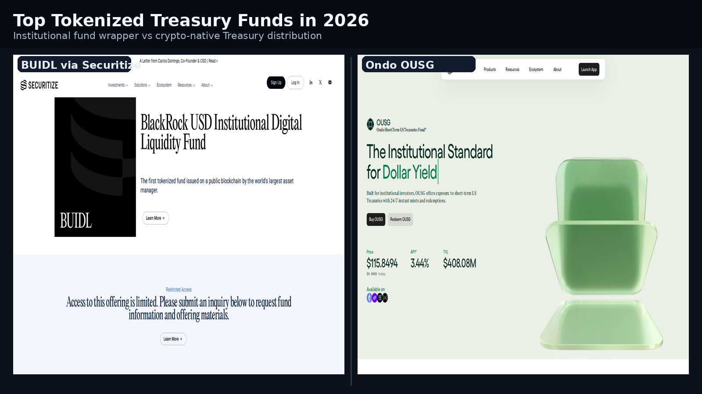
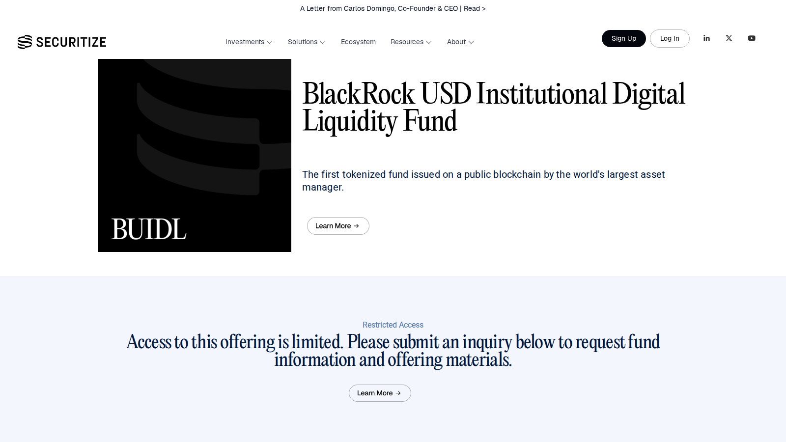
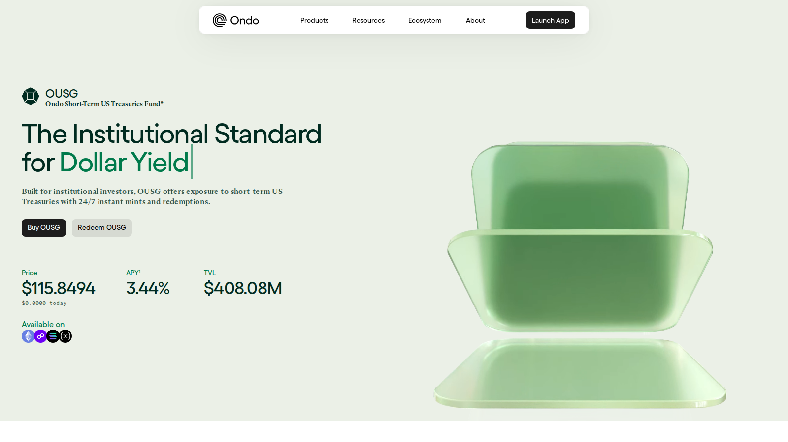

# Top Tokenized Treasury Funds in 2026: 6 Products Compared by Access, Structure, and Distribution

Last updated: 2026-07-17

Suggested category: /analysis/institutional

Suggested slug: /analysis/institutional/top-tokenized-treasury-funds-2026

Primary keyword: top tokenized treasury funds 2026

Meta description: Top tokenized treasury funds in 2026: compare six products by issuer structure, investor access, onchain distribution, and what each one is actually built to do.

## The top tokenized treasury funds in 2026 are BUIDL, OUSG, Franklin Benji, USTB, STBT, and OpenEden TBILL

BlackRock BUIDL via Securitize, Ondo OUSG, Franklin Templeton Benji, Superstate USTB, Matrixdock STBT, and OpenEden TBILL are the six products that show the main design paths in this category: institutional fund access, composable onchain wrappers, short-duration yield products, and blockchain-native Treasury distribution. They do not target the same buyer, and that distinction matters more than AUM rankings.

| Product | Outstanding point | Score | One-line note |
|---------|-----------------|-------|---------------|
| BlackRock BUIDL | Strongest institutional trust signal | 5/5 | Least composable; built for fund-style access |
| Ondo OUSG | Clearest bridge to DeFi-native distribution | 4.5/5 | Brand narrative can blur the wrapper structure |
| Franklin Benji | Most legible traditional-finance migration | 4/5 | Slower onboarding than crypto-native alternatives |
| Superstate USTB | Cleanest newer structural design | 4/5 | Distribution scale still maturing |
| Matrixdock STBT | Best non-US distribution path | 3.5/5 | Lower brand recognition requires higher due diligence |
| OpenEden TBILL | Best programmable collateral posture | 3.5/5 | Details move fast; chain support needs live verification |

**Featured Image**
File: `../media/tokenized-treasury-funds-featured.png`
Alt text: `Comparison of tokenized Treasury fund product surfaces and issuer types in 2026`
Caption: `Tokenized Treasury fund product surfaces reviewed during our July 2026 comparison.`

*Tokenized Treasury fund product surfaces reviewed during our July 2026 comparison.*

## How we ranked tokenized treasury funds for this list

This list uses six filters:

- whether the product gives actual exposure to short-duration US government securities
- whether the issuer and structure are legible to institutional or professional capital
- whether the product has credible onchain distribution rather than only a concept page
- whether the access model is clearly disclosed
- whether the product is becoming part of broader market plumbing
- whether the structure looks durable beyond one narrative cycle

This is a comparison page, not a promise page. Access limits, eligibility rules, redemptions, and jurisdictional availability matter more here than catchy yield numbers.

## 1. BlackRock BUIDL via Securitize

BUIDL is the clearest institutional benchmark in tokenized Treasuries. From the public surface we reviewed, it presents as a regulated fund wrapper first and a crypto product second. That is a strength for readers who care about issuer trust and category leadership, but it becomes a limitation if open composability or retail-style accessibility is the priority.

The crypto analyst community has tracked BUIDL closely as the first real signal that major asset managers treat onchain fund distribution as durable infrastructure rather than an experiment. Discussions in [r/CryptoCurrency around institutional RWA adoption](https://www.reddit.com/r/CryptoCurrency/) and coverage from fund-structure researchers consistently point to BUIDL as the default institutional reference point in this category.

Best for:
- institutional benchmark comparison
- readers tracking category leadership
- understanding how major asset managers package tokenized funds

Tradeoffs:
- access is not broadly retail-friendly
- composability matters less here than trust and structure
- the product functions more like fund infrastructure than DeFi tooling

**Screenshot**
File: `../media/securitize-buidl-product-page.png`
Alt text: `BlackRock BUIDL via Securitize product page showing institutional framing and fund access`
Caption: `BlackRock BUIDL via Securitize product page captured during our July 2026 review of tokenized Treasury funds.`

*BlackRock BUIDL via Securitize product page captured during our July 2026 review of tokenized Treasury funds.*

## 2. Ondo OUSG

OUSG is the product that most clearly bridges tokenized Treasury exposure and crypto-native distribution. From the public flow we reviewed, it reads as an onchain access layer for Treasuries rather than a traditional fund page translated onto blockchain rails. That is a strength for readers mapping the RWA thesis into DeFi, but it becomes a weakness when the product story blurs into the larger Ondo brand narrative.

Readers tracking the tokenized Treasury category should also keep [top RWA crypto projects in 2026](/research/defi/top-rwa-crypto-projects-2026) nearby, because Ondo makes more sense as part of a broader tokenization stack than as a standalone Treasury wrapper.

**Screenshot**
File: `../media/ondo-ousg-product-page.png`
Alt text: `Ondo OUSG product page showing tokenized Treasury access and crypto-native distribution framing`
Caption: `Ondo OUSG product page reviewed as part of our comparison of tokenized Treasury products in 2026.`

*Ondo OUSG product page reviewed as part of our comparison of tokenized Treasury products in 2026.*

Best for:
- readers mapping the crypto-native Treasury thesis
- users comparing distribution models inside RWA
- understanding how tokenized Treasuries connect into broader onchain finance

Tradeoffs:
- the product story can blur into the larger Ondo brand narrative
- readers still need to separate wrapper design from token narrative
- access and usability still need verification at the workflow level

## 3. Franklin Templeton Benji

Benji is the most legible example of a traditional asset manager migrating a regulated fund structure onto blockchain rails. From the public surface we reviewed, it reads as a legacy fund product extending into onchain distribution rather than a crypto-native product reinventing the category. That continuity is a strength for readers who value brand credibility, but it becomes a limitation when fast composability across onchain venues is the goal.

Best for:
- traditional-finance comparison
- readers who value brand credibility over experimentation
- understanding regulated fund migration onto blockchain rails

Tradeoffs:
- onboarding and access can still feel more traditional than crypto-native
- composability is less central than institutional continuity
- the user experience may feel slower for readers expecting DeFi-style flows

## 4. Superstate USTB

USTB offers the cleanest structural comparison inside the tokenized Treasury category among newer issuers. From the public surface we reviewed, it presents as a product designed around modern fund packaging rather than around legacy brand translation. That is a strength for readers focused on category structure, but distribution scale still decides long-term usefulness and USTB is still building that.

Best for:
- structural comparison across newer Treasury wrappers
- readers focused on fund design rather than only brand size
- understanding how newer issuers position short-duration exposure

Tradeoffs:
- category crowding is rising fast
- distribution scale matters as much as concept
- integrations and liquidity still decide long-term usefulness

## 5. Matrixdock STBT

STBT extends the comparison beyond the main US asset-manager and DeFi-native brand cluster. From the public surface we reviewed, it reads as a globally distributed blockchain Treasury product rather than a default institutional benchmark. That is a strength for readers mapping regional distribution paths, but the lower brand recognition means the due diligence bar is higher than for BUIDL or Benji.

Best for:
- comparing non-US distribution paths
- readers tracking tokenized Treasury expansion beyond the biggest names
- understanding alternative issuance clusters in the category

Tradeoffs:
- the brand is less instantly legible to mainstream readers
- due diligence standards need to be higher
- trust depends more on documentation than on brand recognition

## 6. OpenEden TBILL

OpenEden TBILL shows how blockchain-native Treasury infrastructure competes outside the largest incumbents. From the public surface we reviewed, it reads as a product built around onchain collateral utility rather than around asset-manager brand gravity. That is a strength for readers focused on programmable use cases, but the wrapper will feel less familiar to readers who default to the biggest institutional names.

Best for:
- readers focused on programmable collateral and onchain utility
- comparing blockchain-native Treasury infrastructure
- understanding how the category expands beyond the most famous issuers

Tradeoffs:
- the sector is moving quickly and details can change
- access and supported chains still need final verification
- the wrapper may feel less familiar than the biggest institutional names

## How to choose between these tokenized treasury funds

Choose BUIDL if your priority is the clearest institutional benchmark and the strongest asset-manager trust signal.

Choose OUSG if your priority is crypto-native distribution and a more obvious bridge between Treasury exposure and onchain finance.

Choose Franklin Benji if your priority is regulated fund continuity from a traditional asset-management brand.

Choose USTB if your priority is comparing newer product structures rather than defaulting to the biggest issuer.

Choose STBT if your priority is understanding how tokenized Treasury distribution looks outside the most familiar US-centered brand cluster.

Choose OpenEden TBILL if your priority is programmable collateral utility and a more blockchain-native Treasury posture.

## What to track through H2 2026

Do not only watch fund size. Track:

- which products are actually settling and circulating onchain
- which issuers are winning integrations with custodians and platforms
- whether accredited-only models stay dominant
- whether tokenized Treasuries become accepted collateral in more onchain venues
- whether regulators treat these products as straightforward fund wrappers or something closer to new market infrastructure

That is what separates a durable category from a one-cycle theme. For parallel tracking, [top Bitcoin ETFs by AUM in 2026](/analysis/etf/top-bitcoin-etfs-by-aum-2026) covers the same wrapper-trust and capital-distribution logic applied to a different asset class.

## What this review verified and what it did not

To build this list, we reviewed the live product pages, issuer documentation, and public market directories for all six funds on July 10, 2026.

| Claim | Status |
|-------|--------|
| Securitize BUIDL product page loaded directly | Verified |
| Ondo OUSG product page loaded directly | Verified |
| Franklin Templeton Benji product page loaded directly | Verified |
| Superstate USTB product page loaded directly | Verified |
| Matrixdock STBT product page loaded directly | Verified |
| OpenEden TBILL product page loaded directly | Verified |
| Live subscription or onboarding workflow completed | Not verified |
| Redemption mechanics tested end-to-end | Not verified |
| Accredited investor eligibility confirmed per jurisdiction | Not verified |
| Live yield rates and fee structures confirmed | Not verified |

What stood out immediately was not the yield framing. It was how differently these products present themselves: some are clearly built for institutional wrappers first, while others are trying to become usable onchain building blocks. That visual difference is not cosmetic. It signals whether a product expects a fund-style investor, a crypto-native allocator, or a platform user looking for programmable collateral.

## Why you can trust this guide

This guide is based on live public product surfaces and official references reviewed on July 2026. We directly checked public positioning, visible access framing, structural disclosures, and chain or distribution references where available. Anything that depends on a logged-in workflow, live subscription terms, or a full end-to-end redemption test still needs final verification before publication.

## FAQ

### Are tokenized treasury funds the same as stablecoins?

No. Stablecoins are designed primarily as payment and settlement instruments, even when they hold reserves in Treasuries. Tokenized Treasury funds are investment products or fund-like wrappers built around direct exposure to government securities.

### Why is Ondo OUSG on the same list as BUIDL and Benji?

Because readers need to compare how the same underlying Treasury theme is being packaged through different structures and distribution models.

### Is the biggest fund automatically the best one?

No. Size matters, but so do access rules, chain support, redemptions, legal structure, and whether the product is actually useful in onchain finance.

## Source notes

- RWA.xyz, About page and platform directory, checked 2026-07-10
- Securitize BUIDL page, checked 2026-07-10
- Ondo OUSG page, checked 2026-07-10
- Franklin Templeton Benji product page, checked 2026-07-10
- Superstate USTB page, checked 2026-07-10
- Matrixdock STBT page, checked 2026-07-10
- BeInCrypto tokenization research coverage, checked 2026-07-10

## Internal link suggestions

- Link from /analysis/institutional with the anchor tokenized treasury funds
- Link from /research/defi/rwa explainer pages with the anchor tokenized Treasuries
- Link to the companion page on top RWA crypto projects in 2026