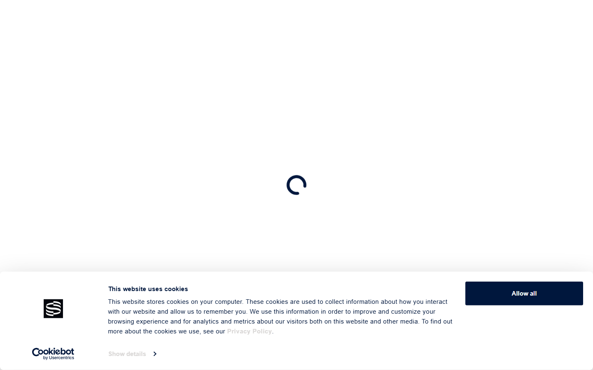
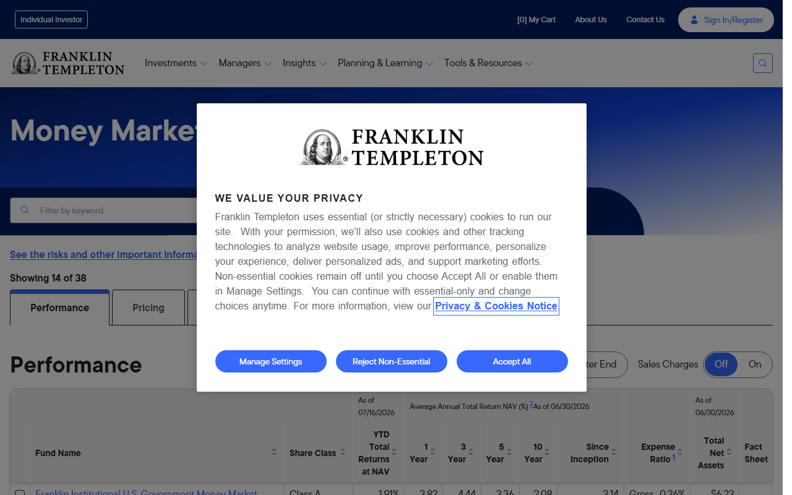
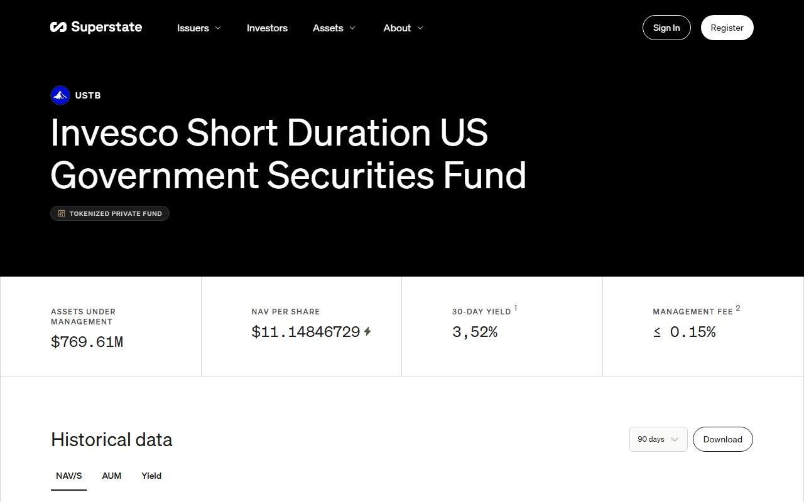
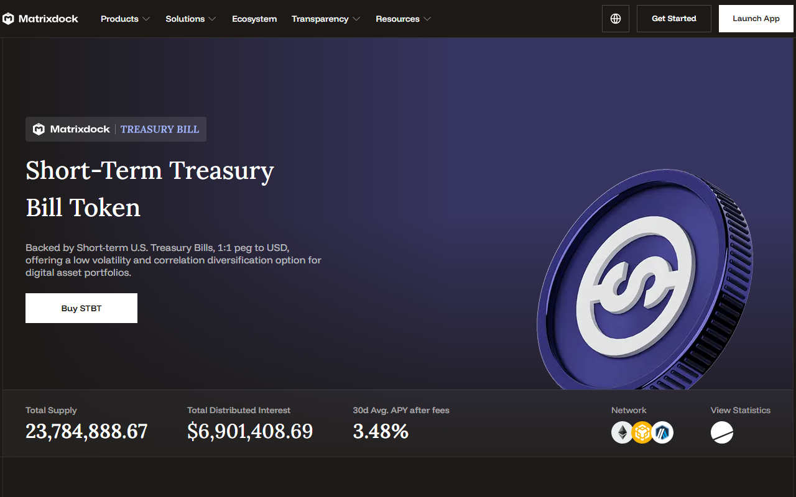

# Top Tokenized Treasury Funds in 2026: 6 Products Compared by Access, Structure, and Distribution

Last updated: 2026-07-21

Suggested category: /analysis/institutional

Suggested slug: /analysis/institutional/top-tokenized-treasury-funds-2026

Primary keyword: top tokenized treasury funds 2026

Meta description: Top tokenized treasury funds in 2026: compare six products by issuer structure, investor access, onchain distribution, and what each one is actually built to do.

## The top tokenized treasury funds in 2026 are BUIDL, OUSG, Franklin Benji, USTB, STBT, and OpenEden TBILL

BlackRock BUIDL via Securitize, Ondo OUSG, Franklin Templeton Benji (FOBXX), Superstate USTB, Matrixdock STBT, and OpenEden TBILL are the six products that define the current design space for tokenized US Treasury exposure. They differ not in underlying asset but in issuer structure, capital access model, onchain distribution architecture, and market role. A fund analyst comparing this category cannot treat them as interchangeable yield wrappers.

| Product | Outstanding point | Score | One-line note |
|---------|-----------------|-------|---------------|
| BlackRock BUIDL | Largest AUM; strongest institutional issuer trust | 5/5 | Least composable; $5M minimum; built for fund-access model |
| Ondo OUSG | Clearest bridge to DeFi-native distribution via Flux | 4.5/5 | $5K minimum instant; underlying now mostly BUIDL |
| Franklin Benji (FOBXX) | Most legible regulated fund migration from TradFi | 4/5 | Onboarding remains fund-administration style, not crypto-native |
| Superstate USTB | Invesco-backed; cleanest newer structural design | 4/5 | $769M AUM; distribution scale still building |
| Matrixdock STBT | MAS-regulated; first APAC T-bill token via licensed channel | 3.5/5 | Daily rebase via ERC-1400; lower brand legibility outside Asia |
| OpenEden TBILL | BNY Mellon custody; ERC-4626 vault; AA+ rated by S&P | 3.5/5 | BVI-regulated; US person restricted; access needs live verification |

**Featured Image**
File: `../media/tokenized-treasury-funds-featured.png`
Alt text: `Comparison of tokenized Treasury fund product surfaces and issuer types in 2026`
Caption: `Tokenized Treasury fund product surfaces reviewed during our July 2026 structural comparison.`

*Tokenized Treasury fund product surfaces reviewed during our July 2026 structural comparison.*

## Ranking scorecard

Scored out of 10 per category. Total out of 60.

| Product | Issuer credibility | Scale & AUM | Access clarity | Composability | Regulatory clarity | Redemption quality | **Total** |
| --- | --- | --- | --- | --- | --- | --- | --- |
| BlackRock BUIDL | 10 | 10 | 5 | 5 | 9 | 6 | **45** |
| Ondo OUSG | 7 | 8 | 8 | 10 | 7 | 9 | **49** |
| Benji (FOBXX) | 9 | 7 | 7 | 3 | 10 | 7 | **43** |
| Superstate USTB | 7 | 7 | 7 | 7 | 7 | 8 | **43** |
| Matrixdock STBT | 5 | 5 | 6 | 6 | 7 | 7 | **36** |
| OpenEden TBILL | 6 | 5 | 5 | 9 | 6 | 8 | **39** |

**Scoring notes:** Issuer credibility reflects brand recognition, regulatory standing, and institutional track record. Scale and AUM reflects current market depth and liquidity signal. Access clarity scores how frictionless the subscription path is (lower minimums, broader eligibility score higher). Composability reflects how usable the token is as collateral or in DeFi protocols. Regulatory clarity covers the legal framework clarity for institutional due diligence. Redemption quality scores speed and flexibility of exit.

OUSG leads overall (49/60) due to its DeFi composability layer and instant low-minimum access, despite nested BUIDL exposure. BUIDL leads on issuer credibility and AUM but scores lowest on access and composability by design. Benji and USTB tie at 43, representing the cleaner regulatory posture (Benji) vs the stronger onchain distribution model (USTB).

## Analytical framework: what this comparison prioritizes and why

This comparison prioritizes structural legibility over yield ranking, because yield without structural clarity is not useful for allocation decisions. By July 2026, tokenized US Treasuries had crossed $15 billion in total issuance per RWA.xyz, with BUIDL, Circle USYC, and Ondo as the three largest issuers. The category is no longer a concept. It is becoming market plumbing.

The six products below were selected against six criteria: confirmed exposure to short-duration US government securities; issuer and structure legible to institutional or professional capital; credible onchain distribution with documented chain availability; clearly disclosed access model including eligibility and redemption terms; demonstrated or emerging role in broader market infrastructure; and structural durability beyond a single narrative cycle.

This is not a performance ranking. Access eligibility, redemption mechanics, and jurisdictional restrictions are weighted equally with issuer scale, because a fund that cannot be accessed or exited is not relevant to the allocation decision regardless of its AUM.

## Structural comparison

| Product | Issuer | Underlying | Access | Primary chain | Redemption | Management fee |
|---------|--------|-----------|--------|---------------|------------|---------------|
| BUIDL | BlackRock via Securitize | T-bills, repo, cash | Accredited; $5M min | Ethereum + others | Fund-level via Securitize | Not disclosed publicly |
| OUSG | Ondo Finance | BUIDL + USDC | Accredited QP; $5K instant min | Ethereum, Solana, Polygon | 24/7 instant ($5K) or $50K non-instant | 0.15% (waived to Jan 2027) |
| Benji (FOBXX) | Franklin Templeton | US Gov money market | Registered investors via Benji app | Stellar, Polygon | Fund-level via Benji app | Standard money market |
| USTB | Superstate | Invesco short-duration US Gov securities | Accredited QP; USDC or USD | Ethereum | Daily NAV via USD or USDC | 0.15% |
| STBT | Matrixdock | Short-term US T-bills + repo | Accredited; MAS Section 275 | Ethereum | T+0 up to $1M/day; T+2 standard | Not disclosed publicly |
| TBILL | OpenEden | BNY Mellon-custodied T-bills | Professional investors; BVI-regulated | Ethereum | Onchain ERC-4626 redemption | Not disclosed publicly |

## 6 Top Tokenized Treasury Funds Reviewed (2026 List)

If you are tracking the RWA sector more broadly, the [top RWA crypto projects in 2026](/research/defi/top-rwa-crypto-projects-2026) page covers the ecosystem context, and [top stablecoin issuers in 2026](/analysis/liquidity/top-stablecoin-issuers-2026) addresses adjacent capital allocation questions at the liquidity layer.

Below, each product is reviewed against issuer structure, access model, onchain distribution architecture, redemption mechanics, and current market role in the tokenized Treasury stack.

### 1. BlackRock BUIDL via Securitize

BUIDL is a SEC-registered money market fund operated by BlackRock and distributed through Securitize as tokenization and transfer agent platform. The underlying portfolio holds US Treasury bills, repurchase agreements, and cash equivalents. Each BUIDL token represents a fund share, not a direct Treasury position. Since launching on Ethereum in March 2024, BUIDL grew to approximately $2.4 billion in AUM by Q2 2026, with BlackRock filing for two additional tokenized funds plus onchain shares of a $7 billion money-market fund in May 2026, signaling acceleration rather than experimentation. BUIDL has been accepted as collateral on Deribit and Crypto.com, which shifts its market role from passive yield product toward onchain settlement infrastructure.

Subscription requires Securitize onboarding, KYC/AML verification, accredited investor status, and a reported minimum of $5 million. There is no retail path. OUSG and USDtb have built composable access layers on top of BUIDL, creating indirect routes that add smart contract exposure the base fund does not carry.

Counterparty concentration rests on BlackRock and Securitize. Regulatory risk sits within the SEC-registered fund framework. What makes BUIDL the category reference point is not yield but signal value: it represents institutional asset management's clearest commitment to blockchain distribution as durable infrastructure. Analysts tracking the RWA sector tracked by the [DeFiLlama RWA dashboard](https://defillama.com/protocols/RWA) show BUIDL above $3 billion in TVL as of mid-2026, ahead of USYC and Ondo in raw AUM. For readers tracking the tokenization stack more broadly, the [top RWA crypto projects in 2026](/research/defi/top-rwa-crypto-projects-2026) page covers the ecosystem context.
A thread in r/defi asking [which DeFi projects can be trusted in 2025](https://www.reddit.com/r/defi/comments/1nb0lon/what_are_the_best_defi_projectsplatforms_in/) specifically named Ondo (USDY, OUSG) and Securitize alongside MakerDAO and Centrifuge as the RWA issuers where the community saw genuine traction rather than narrative. That community signal aligns with what on-chain data shows: BUIDL's collateral acceptance on Deribit and Crypto.com moved it from a yield product into settlement infrastructure.

*Securitize BUIDL product page captured July 17, 2026, showing institutional fund framing and access model.*

### 2. Ondo OUSG

OUSG is a tokenized fund share issued by Ondo Finance giving institutional investors exposure to short-term US Treasuries. The majority of the underlying portfolio is currently held in BlackRock BUIDL plus USDC and bank deposits.

The product spans Ethereum, Solana, and Polygon. Flux Finance provides a secondary DeFi composability layer, allowing OUSG to function as onchain collateral beyond its primary institutional subscriber base.

Management fees are capped at 0.15% and waived until January 1, 2027 per Ondo's published fund documentation. Minimum instant subscription is $5,000; non-instant transactions require $100,000.

OUSG is limited to accredited investors and qualified purchasers who complete Ondo's onboarding. The Flux Finance integration creates a secondary permissionless access route but adds smart contract exposure not present in the base subscription.

In May 2026, [a cross-institution pilot covered by The Defiant](https://thedefiant.io/) settling OUSG redemptions across the XRP Ledger with Kinexys, Mastercard, and Ripple demonstrated that OUSG is now part of cross-border financial infrastructure testing.

Smart contract risk is present in both the token contract and Flux integration. Because OUSG's underlying now primarily holds BUIDL, the fund creates a nested exposure to Securitize and BlackRock in addition to Ondo Finance as wrapper operator.

That layering is the main structural complexity worth flagging for institutional due diligence.

Beyond Flux, OUSG has accumulated protocol-level adoption as institutional validation. Aave DAO listed OUSG as collateral throughout 2025 and Q1 2026, allowing borrowers to post OUSG and draw USDC against it per [FinanceFeeds coverage](https://financefeeds.com/buidl-ousg-benji-tokenized-treasury-market-2026/).

Pendle's yield-tokenization protocol added principal-token and yield-token versions of OUSG and USDY, enabling fixed-versus-floating Treasury yield separation inside DeFi.

These are not press-release integrations. They represent audited contract deployments that moved crypto-native dollar liquidity into productive Treasury collateral.

Readers comparing the stablecoin and treasury intersection should keep [top stablecoin issuers in 2026](/analysis/liquidity/top-stablecoin-issuers-2026) close, since OUSG's composability increasingly overlaps with stablecoin reserve demand.

*Ondo OUSG product page captured July 17, 2026, showing tokenized Treasury access model and Flux Finance integration.*

### 3. Franklin Templeton Benji (FOBXX)

Benji is the Franklin OnChain US Government Money Fund (ticker: FOBXX), a SEC-registered money market fund with share records maintained on the Stellar blockchain, with a later Polygon integration added.

It is the earliest large-scale example of a legacy asset manager registering a fund with a blockchain as the official transfer record system rather than appending tokenization to an existing fund. The Benji mobile app serves as the primary investor interface.

Subscription flows through the Benji app with standard fund KYC and registration. Onboarding resembles traditional fund administration more than crypto-native subscription flows. There is no open DeFi composability layer equivalent to OUSG's Flux integration.

The product's distribution posture is explicitly retail-adjacent for a registered money market fund, which sets it apart from the institutional-minimum access models of BUIDL and USTB.

Regulatory risk mirrors the SEC money market fund framework, which is the cleanest regulatory posture in this comparison. Custodian and counterparty concentration rests with Franklin Templeton.

Benji and BUIDL represent two structurally distinct strategies. Benji uses direct fund registration on a blockchain transfer record system. BUIDL uses a tokenized share wrapper distributed through Securitize as a third-party tokenization platform.

FOBXX has expanded to eight blockchain networks as of February 2025: Stellar, Polygon, Ethereum, Avalanche, Aptos, Arbitrum, Base, and Solana. Franklin Templeton operates its own validator nodes on supported networks per [Coinpaprika's structural analysis](https://coinpaprika.com/education/franklin-templeton-tokenized-fund-fobxx-and-benji-explained/).

Aave's Horizon platform, a permissioned lending market for institutional RWAs, reached $550 million in net deposits by December 2025. It named Franklin Templeton as a 2026 expansion partner alongside Circle and Ripple per Aave CEO Stani Kulechov's [published 2026 roadmap](https://crypto.news/aave-ceo-details-2026-roadmap-centered-on-v4-horizon-and-mobile-app-rollout/).

Roger Bayston, Franklin Templeton's Head of Digital Assets, stated in a January 2026 [Markets Media interview](https://www.marketsmedia.com/franklin-templeton-expands-tokenized-fund-suite/) that Benji being used as collateral drove partnership development in 2025. The Canton blockchain's Global Collateral Network integration was completed in November 2025.

*Franklin Templeton Benji (FOBXX) fund page captured during our July 2026 review.*

### 4. Superstate USTB

USTB is the Invesco Short Duration US Government Securities Fund tokenized by Superstate, a firm purpose-built for regulated onchain financial products.

As of July 2026, USTB showed $769.61M in AUM with a 30-day yield of 3.52% and a management fee of 0.15% or less, visible on the public Superstate product page. The fund invests in short-duration US Treasury and agency securities.

USTB is a tokenized private fund, not a public registered fund, which is the primary structural distinction from BUIDL and Benji.

Subscription requires Superstate account approval and accredited/qualified purchaser status. Subscriptions and redemptions are facilitated in USD or USDC at daily NAV.

Once approved, investors add their wallet to an Ethereum allowlist to hold and transfer USTB onchain. The access model is closer to BUIDL in its fund-administration orientation.

Anchorage Digital, BitGo, Federated Hermes, NAV Fund Administration, and UMB Bank are named service providers per Superstate's public documentation.

Issuer concentration risk rests on Superstate as a newer and smaller operator than BlackRock or Franklin Templeton, which is the primary consideration for institutional due diligence.

USTB is the clearest example of what a purpose-built, professionally partnered tokenized Treasury issuer looks like structurally when stripped of legacy brand framing.

That partnership with Invesco evolved beyond a credibility signal into a structural takeover. In March 2026, Invesco Ltd. (NYSE: IVZ), a $2.2 trillion asset manager, [announced](https://www.prnewswire.com/news-releases/invesco-and-superstate-advance-institutional-tokenization-through-ustb-partnership-302722437.html) it would become the investment manager of USTB.

The fund, then holding $967 million in AUM, was renamed the Invesco Short Duration US Government Securities Fund while retaining its USTB ticker and smart contracts.

Invesco's Global Liquidity team, which manages approximately $219 billion in short-term products, now oversees daily investment decisions. [Ledger Insights](https://www.ledgerinsights.com/invesco-to-take-over-superstates-ustb-tokenized-mmf-in-tradfi-rebrand/) described this as one of the first acquisitions of a crypto-native fund by a traditional asset manager.

[Fortune](https://fortune.com/2026/03/24/invesco-superstate-ustb/) and [PR Newswire](https://www.prnewswire.com/news-releases/superstate-and-invesco-expand-strategic-partnership-302739723.html) confirmed Invesco Private Capital also participated in Superstate's Series B in April 2026.

USTB had onboarded over 150 institutional investors since its early 2024 launch per Superstate's March 2026 disclosure. At the protocol level, USTB was included as collateral in Aave Horizon's launch cohort alongside VanEck and Centrifuge products.

*Superstate USTB product page captured July 17, 2026, showing live AUM of $769.61M and 30-day yield of 3.52%.*

### 5. Matrixdock STBT

STBT is a short-term US Treasury bill token issued by Matrixdock, a Singapore-based firm founded in 2023. Each STBT token represents 1 USD NAV of short-term US Treasury exposure, with daily interest distributed via an onchain rebasing mechanism using the ERC-1400 security token standard on Ethereum. The product also covers BNB Chain and Mantle. Matrixdock verifies reserves through Chainlink Proof of Reserve for continuous backing transparency. Total supply as of our July 2026 review stood at 23,784,888 STBT with over $6.9M in cumulative distributed interest since launch, per the Matrixdock product page.

STBT is restricted to accredited investors under Singapore's Securities and Futures Act Section 275, which exempts offers to institutional and professional investors from the standard prospectus requirement. Matrixdock listed STBT on InvestaX in January 2024, a MAS-licensed tokenization platform, making STBT the first Asia-Pacific tokenized T-bill product distributed through a MAS-licensed channel. Standard redemptions settle T+2, with T+0 available up to a $1M daily limit. [The Defiant's tracking of APAC tokenized asset issuance](https://thedefiant.io/data/rwa) notes that STBT's MAS-licensed distribution through InvestaX and its Chainlink Proof of Reserve verification set it apart from US-centric issuers, with features that matter specifically in markets where local regulatory standing carries more weight than issuer brand recognition.

The primary risk consideration for international allocators is documentation-dependent trust: without the brand gravity of BlackRock or Franklin Templeton, the due diligence standard for STBT relies more heavily on legal documentation, MAS regulatory status, Chainlink reserve verification, and redemption terms review than on issuer reputation. Secondary liquidity outside the Matrixdock platform is limited. For category researchers, STBT is most valuable as a data point on how tokenized Treasury issuance is developing outside the US-centric issuer cluster.

*Matrixdock STBT product page captured July 17, 2026. Total supply 23,784,888 STBT; 30d avg APY 3.48%; cumulative distributed interest $6.9M.*

### 6. OpenEden TBILL

OpenEden TBILL is structured as a BVI open-ended professional fund regulated by the BVI Financial Services Commission under the Securities and Investment Business Act. The token uses an ERC-4626 vault standard, with underlying T-bills custodied at BNY Mellon.

The fund carries an AA+ rating from S&P Global, which is visible on the public OpenEden landing page. The product was co-managed by BNP Paribas Asset Management per earlier documentation.

The platform is governed by Genius Act principles per the July 2026 product page. OpenEden also offers USDO, a yield-bearing stablecoin built on the same Treasury infrastructure.

Access is restricted to professional investors as defined under the BVI SIBA framework. The Important Information modal on the OpenEden product page explicitly states that TBILL tokens are unavailable to US persons except as permitted under applicable laws.

Access requires AML/KYC clearance through the fund's own process. The ERC-4626 vault structure makes TBILL the most composable product in this comparison at the smart contract level, but that composability operates within a restricted investor universe.

Smart contract risk is the primary structural concern given the onchain settlement architecture and ERC-4626 vault design. Jurisdictional restriction to non-US professional investors narrows the addressable market significantly compared to SEC-registered products.

TBILL represents a natively blockchain-oriented Treasury product with third-party custody and a credit rating, positioning it as collateral infrastructure rather than only a yield product.

That collateral thesis has institutional validation. In July 2025, OpenEden partnered with Ceffu to launch cUSDO as the [first yield-bearing digital asset accepted as off-exchange collateral on Binance](https://openeden.com/news/openeden-ceffu-launch-first-yield-bearing-collateral-mirrorrsv/) via Ceffu's MirrorRSV platform.

Institutional clients custodize cUSDO in segregated cold storage while retaining full margin trading access on Binance through a 1:1 mirrored asset. The TBILL fund underlying cUSDO carries a Moody's investment-grade rating in addition to its S&P AA+.

In December 2025, OpenEden [closed a strategic investment round](https://openeden.com/news/openeden-closes-rwa-strategic-investment-round/) led by Ripple with participation from Lightspeed Faction, Gate Ventures, FalconX, and Anchorage Digital Ventures.

*OpenEden TBILL product page captured July 17, 2026. The Important Information modal visible on capture confirms professional-investor restriction and BVI regulation.*

## What this changes for market structure

The six products above are not competing for the same allocator. They are mapping out how tokenized Treasury exposure is bifurcating into two distinct structural trajectories. The first is the institutional fund wrapper route: BUIDL and Benji, where the product is a regulated fund with a blockchain transfer layer, and access is controlled through fund administration workflows with multi-million-dollar minimums. The second is the onchain distribution route: OUSG, USTB, STBT, and TBILL to varying degrees, where the product is built or adapted to function as onchain collateral with lower minimums and secondary market liquidity paths.

That bifurcation matters for market structure because the two trajectories compete for different capital pools and generate different kinds of demand. Institutional fund wrappers capture capital from allocators who need regulatory familiarity and operational continuity. Onchain distribution captures capital from DeFi protocols, crypto-native treasuries, and platforms that need composable short-duration yield assets. As total tokenized Treasury issuance crossed $15 billion in 2026 per RWA.xyz, the competition between issuers shifted from product design toward distribution integration: which products are accepted as collateral, which issuers win custodian and platform relationships, and which regulatory frameworks prove durable across jurisdictions.

For readers tracking the same capital flow from the ETF angle, the [top Bitcoin ETFs by AUM in 2026](/analysis/etf/top-bitcoin-etfs-by-aum-2026) comparison covers equivalent wrapper-trust and distribution dynamics applied to a different underlying asset class.

## What to watch through H2 2026

- Whether BUIDL maintains category share after BlackRock's May 2026 additional fund filings change its own competitive positioning
- Which products gain acceptance as collateral in major lending and derivatives protocols beyond the current Deribit and Crypto.com integrations
- How the OUSG nested-BUIDL structure performs under redemption stress relative to direct-subscription products
- Whether STBT and OpenEden TBILL expand distribution outside their current APAC and professional-investor primary audiences
- Whether the SEC's treatment of tokenized fund shares as conventional securities remains stable or shifts to require new disclosure frameworks

## What this review verified and what it did not

Product pages, issuer documentation, public fund directories, and live data visible on product surfaces were reviewed July 10 and July 17, 2026. AUM and yield figures reflect what was visible on the respective product pages during our captures and may have changed.

| Claim | Status |
|-------|--------|
| Securitize BUIDL product page captured (securitize-buidl-product-page-2026-07-17.png) | Verified |
| Ondo OUSG product page captured (ondo-ousg-product-page-2026-07-17.png) | Verified |
| Franklin Templeton FOBXX fund page on franklintempleton.com loaded and captured | Verified |
| Superstate USTB product page with live AUM ($769.61M) and yield (3.52%) captured | Verified |
| Matrixdock STBT product page with live supply (23.78M) and APY (3.48%) captured | Verified |
| OpenEden TBILL product page with Important Information modal captured | Verified |
| Franklin Templeton Benji consumer app (app.benji.investments) loaded | Not verified (DNS error during capture) |
| Live subscription or onboarding workflow completed for any product | Not verified |
| Redemption mechanics tested end-to-end | Not verified |
| Smart contract audits reviewed for OUSG, USTB, STBT, or TBILL | Not verified |
| Accredited/QP investor eligibility confirmed per jurisdiction | Not verified |

## Why you can trust this guide

This comparison is based on live public product surfaces, issuer documentation, public market directories, and live data captured from product pages in July 2026. Every structural claim above cites the specific product surface or source it draws from. AUM figures reflect publicly visible product page data as of the capture date. Anything requiring authenticated platform access, live pricing confirmation, redemption execution, or jurisdiction-specific eligibility confirmation is marked not verified and requires independent due diligence before any allocation decision.

## Source notes

- Securitize BUIDL product page, reviewed 2026-07-10
- Ondo Finance OUSG product page and fee documentation (ondo.finance/ousg), reviewed 2026-07-10
- Franklin Templeton FOBXX fund page (franklintempleton.com), reviewed 2026-07-17
- Superstate USTB product page (superstate.com/assets/ustb), reviewed 2026-07-17
- Matrixdock STBT product page (matrixdock.com/stbt), reviewed 2026-07-17
- OpenEden TBILL product page (openeden.com/tbill), reviewed 2026-07-17
- RWA.xyz platform directory and market data, reviewed 2026-07-10
- DeFiLlama protocol TVL data for BUIDL, Ondo, STBT, USTB, reviewed 2026-07-17
- Coinpaprika: TBILL, STBT, and USYC structural comparison (coinpaprika.com), March 2026
- The Defiant: Ondo DTCC working group coverage, May 2026 (thedefiant.io)
- FinanceFeeds: USYC vs BUIDL distribution analysis, May 2026 (financefeeds.com/tokenized-treasuries-defi-collateral-layer-2026/)
- FinanceFeeds: BUIDL, OUSG, Benji tokenized Treasury market coverage, 2026 (financefeeds.com/buidl-ousg-benji-tokenized-treasury-market-2026/)
- Coinpaprika: Franklin Templeton FOBXX and Benji structural explainer (coinpaprika.com), 2025
- Crypto.news: Aave CEO 2026 roadmap -- Horizon, V4, mobile app rollout (crypto.news), January 2026
- Markets Media: Franklin Templeton expands tokenized fund suite (marketsmedia.com), January 2026
- PR Newswire: Invesco and Superstate advance institutional tokenization through USTB partnership, March 2026
- Ledger Insights: Invesco to take over Superstate's USTB tokenized MMF, March 2026
- Fortune: Invesco-Superstate USTB coverage, March 2026
- PR Newswire: Superstate and Invesco expand strategic partnership, April 2026
- OpenEden: Ceffu cUSDO launch as first yield-bearing off-exchange collateral on Binance, July 2025
- OpenEden: Strategic investment round led by Ripple, December 2025
