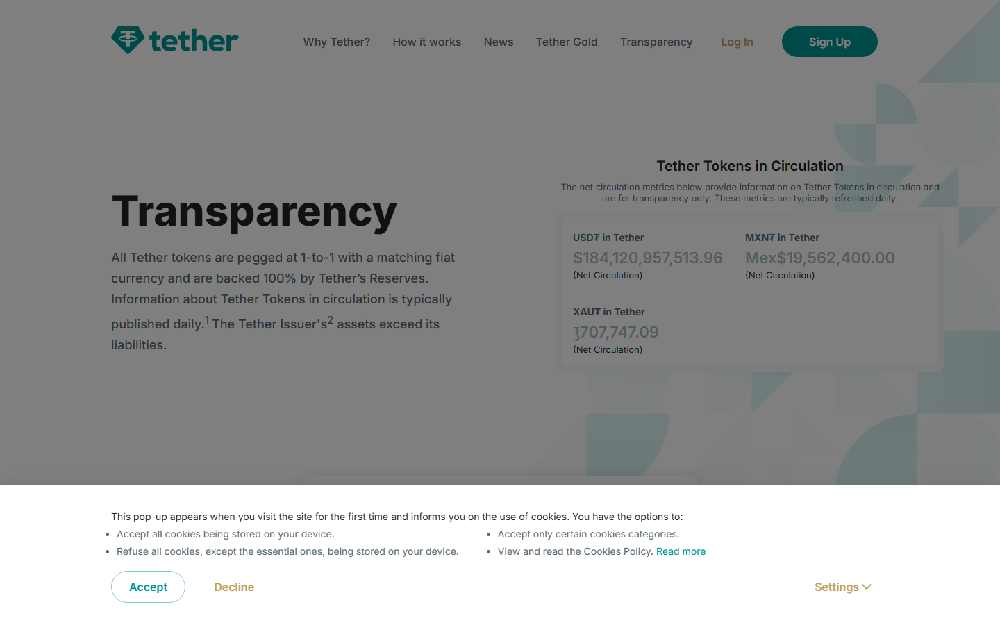
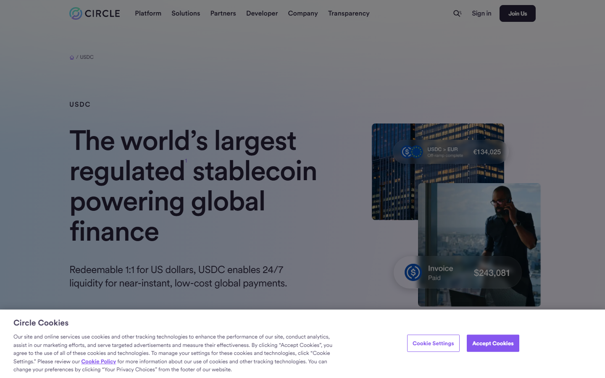
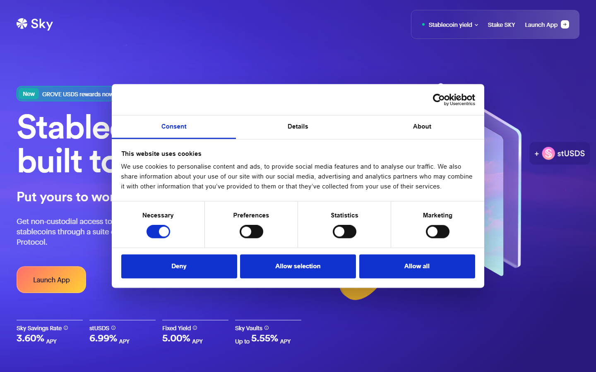
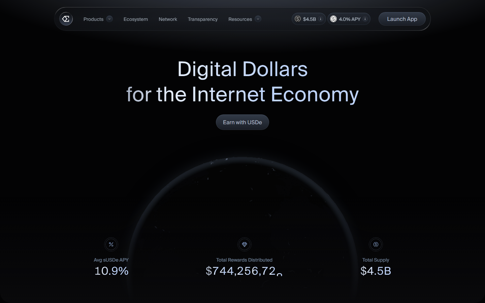
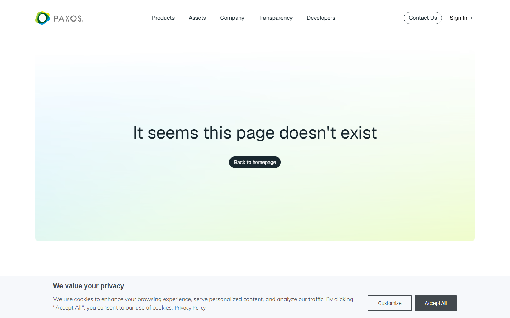
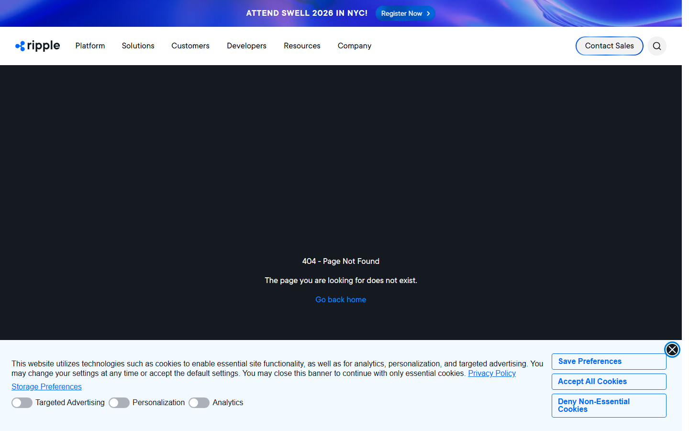
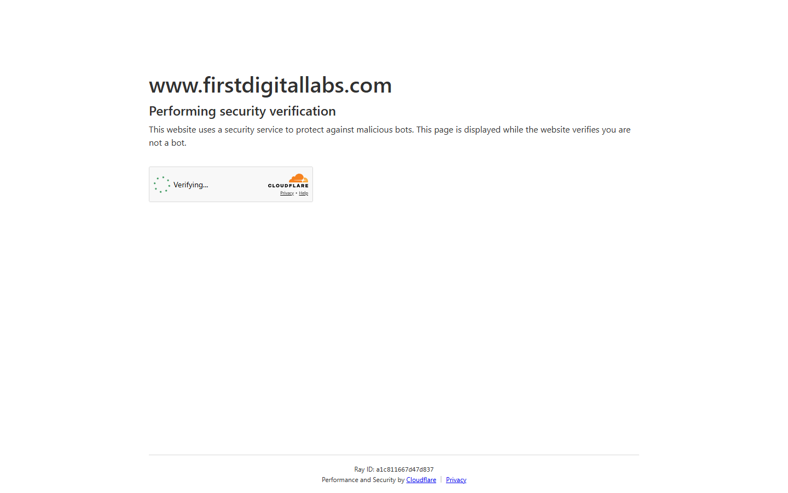

# Top Stablecoin Issuers in 2026: Reserve Model, Distribution, and Market Role Compared

The seven stablecoin issuers that define the dollar layer in crypto in 2026 are Tether, Circle, Sky, Ethena, Paxos, Ripple, and First Digital.

Each one operates on a structurally different model: reserve-backed, protocol-governed, synthetic, regulated-infrastructure, and regional-distribution.

Understanding which issuer matters for which purpose requires separating supply size from collateral quality, and chain reach from market depth.

This comparison covers all seven by reserve design, access model, chain distribution, and the market-structure role each one occupies.

| Issuer | Outstanding point | Score | One-line note |
|--------|------------------|-------|---------------|
| Tether (USDT) | Largest supply; global exchange liquidity backbone | 4/5 | Reserve opacity remains the structural risk |
| Circle (USDC) | Strongest regulated reserve model; institutional rail | 4.5/5 | SVB event proved banking counterparty risk is real |
| Sky (USDS/DAI) | Only protocol-governed dollar with onchain-verifiable collateral | 4/5 | Governance risk replaces issuer risk |
| Ethena (USDe) | Highest yield; only delta-neutral synthetic dollar at scale | 3.5/5 | Funding rate inversion is the existential stress scenario |
| Paxos (USDP/PYUSD) | NYDFS trust company; PayPal consumer distribution | 3.5/5 | Supply modest despite compliance strength |
| Ripple (RLUSD) | NYDFS-authorized; built for cross-border payment rails | 3/5 | Early-stage; adoption still accumulating |
| First Digital (FDUSD) | APAC exchange distribution via Binance | 3/5 | Exchange-concentration risk is the defining question |

## Quick structural comparison

| Issuer | Model | Primary chain | Circulating supply | Reserve type | Key market role |
|--------|-------|---------------|--------------------|--------------|-----------------|
| Tether | Fiat-backed | Multi-chain (Tron, ETH dominant) | ~+ | Mixed (T-bills, cash equivalents, other assets) | Global exchange liquidity backbone |
| Circle | Fiat-backed | Multi-chain (ETH, Solana, Base) | ~+ | Short-term US T-bills, cash | Regulated institutional rail |
| Sky | Protocol-governed | ETH (Maker protocol base) | ~ (USDS+DAI) | Diversified onchain collateral | Crypto-native monetary system |
| Ethena | Synthetic delta-neutral | ETH, Solana | ~ (USDe) | ETH/BTC long spot + short perp hedge | Yield-linked synthetic dollar layer |
| Paxos | Fiat-backed | ETH, Solana, others | ~ (USDP+PYUSD) | 100% T-bills and cash equivalents | Enterprise issuance infrastructure |
| Ripple | Fiat-backed | XRP Ledger, ETH | Early-stage deployment | US T-bills and cash (NYDFS regulated) | Payments and cross-border settlement |
| First Digital | Fiat-backed | BNB Chain, ETH | ~ (FDUSD) | Short-term US T-bills, cash | APAC exchange distribution |

## Ranking scorecard

Scored out of 10 per category. Total out of 70.

| Issuer | Reserve clarity | Distribution scope | Institutional access | Market-structure role | Regulatory standing | Stress resilience | Composability | **Total** |
| --- | --- | --- | --- | --- | --- | --- | --- | --- |
| Tether | 5 | 10 | 6 | 10 | 4 | 7 | 8 | **50** |
| Circle | 9 | 9 | 9 | 8 | 9 | 7 | 8 | **59** |
| Sky | 8 | 6 | 5 | 7 | 5 | 6 | 9 | **46** |
| Ethena | 6 | 5 | 5 | 6 | 4 | 4 | 7 | **37** |
| Paxos | 10 | 7 | 8 | 5 | 10 | 8 | 5 | **53** |
| Ripple | 8 | 4 | 6 | 4 | 9 | 7 | 3 | **41** |
| First Digital | 7 | 5 | 4 | 5 | 6 | 5 | 4 | **36** |

**Scoring notes:** Reserve clarity reflects transparency, attestation frequency, and asset composition quality. Distribution scope measures chain coverage and secondary market availability. Institutional access scores direct issuance/redemption availability for institutional clients.

Market-structure role reflects the issuer's actual function in crypto liquidity infrastructure. Regulatory standing scores the legal framework clarity and jurisdictional strength. Stress resilience reflects demonstrated or structural capacity to handle adverse market conditions.

Composability reflects how usable the stablecoin is as collateral or in DeFi protocols.

Circle leads overall (59/70) due to the combination of regulated reserve model, broad distribution, and institutional access. Paxos scores highest on reserve clarity and regulatory standing (10/10 both) but trails on distribution.

Tether leads on distribution scope and market-structure role but scores lowest on regulatory standing.

## Analytical framework

This comparison prioritizes reserve quality and access model over headline supply, because supply alone understates structural differences.

An issuer with opaque reserves occupies a different risk profile from one with transparent short-term T-bill backing. A protocol-governed dollar behaves differently in stress conditions than a synthetic position-hedged dollar.

The ranking follows four dimensions: reserve clarity, distribution scope, institutional access model, and market-structure role. These match what a fund due-diligence team would apply before accepting a stablecoin as collateral.

## 7 Top Stablecoin Issuers Reviewed (2026 List)

For context on how tokenized Treasury products intersect with stablecoin reserve design, the [top tokenized Treasury funds in 2026](/analysis/institutional/top-tokenized-treasury-funds-2026) page covers that adjacent layer. The [top crypto market makers in 2026](/analysis/liquidity/top-crypto-market-makers-2026) comparison shows where dollar liquidity concentrates on the trading side.

Below, each issuer is reviewed against reserve design, distribution model, risk profile, and market-structure role.

### 1. Tether (USDT)

USDT is the backbone of global crypto liquidity. The [DeFiLlama stablecoin dashboard](https://defillama.com/stablecoins) consistently shows USDT accounting for more than 50% of tracked stablecoin TVL across chains.

Reserve composition has shifted toward higher T-bill concentration per the [most recent quarterly attestation](https://tether.to/en/transparency) -- approximately 84% in US Treasury bills and cash equivalents as of Q1 2026, but the mix remains broader than Circle's. No formal US regulatory framework applies to Tether directly.

Retail access is exclusively through secondary markets. Chain distribution spans Tron, Ethereum, Solana, and others, with Tron dominant for emerging-market settlement and Ethereum for DeFi collateral.

Two structural risks persist: reserve composition opacity relative to regulated alternatives, and counterparty concentration. Neither has triggered a supply-side crisis, but both remain relevant to any collateral quality assessment.

USDT is not directly purchasable from Tether; retail access is exclusively through secondary market exchanges and OTC desks. USDT's market role is unambiguous: it is the settlement layer for the majority of spot and derivatives volume on centralized exchanges. That dominance shapes everything downstream from exchange pair construction to DeFi collateral weighting.

*Tether reserve and transparency page captured July 17, 2026.*

### 2. Circle (USDC)

USDC reserves are 100% US dollar-denominated short-term T-bills and cash, segregated from Circle's operating assets, with monthly attestations by Grant Thornton. Reserve reports and institutional access details are published on [Circle's USDC product page](https://www.circle.com/usdc). The reserve model is simpler and more transparent than Tether's.

The March 2023 SVB event demonstrated USDC's exposure to banking-sector counterparty risk even with strong reserve design. Post-event, Circle shifted further toward direct T-bill custody rather than bank-deposit concentration.

Circle's Cross-Chain Transfer Protocol (CCTP) allows native USDC to move between chains without wrapping, reducing bridge counterparty risk for institutions. USDC is natively available on 15+ chains including Ethereum, Solana, Base, Polygon, Arbitrum, Avalanche, and Optimism. USDC's market role has evolved toward institutional infrastructure and payment-layer adoption. It is the preferred stablecoin for regulated payment products, institutional treasury management, and onchain payroll structures.

A [CryptoCurrency Reddit thread by an eight-year industry veteran](https://www.reddit.com/r/CryptoCurrency/comments/1t6djf8/ive_worked_in_crypto_for_8_years_circle_messari/) who worked across Circle, Messari, and Coinbase noted that stablecoins became the dollar rails traditional finance was not yet offering onchain.

That framing describes USDC's actual market position more accurately than any product page does.

*Circle USDC product page captured July 17, 2026.*

### 3. Sky (USDS / DAI)

Sky is the rebranded Maker protocol, issuing USDS alongside legacy DAI. Collateral is posted onchain, and dollar supply expands and contracts based on collateral ratios maintained by smart contract logic. There is no centralized reserve custodian.

The protocol oversees over $7.8 billion in stablecoin liabilities across DAI and USDS. Access is permissionless through [sky.money](https://sky.money): no minimum, no KYC, no issuer counterparty beyond the smart contract itself. The protocol's sUSDS savings rate has ranged between 5% and 8.5% annualized in 2025-2026, distributed automatically to depositors with no lockup.

Governance risk and smart contract risk replace issuer risk. A governance attack or flawed collateral parameter can cause undercollateralization at scale, which is why Sky maintains surplus buffers and stability fees as automatic stabilizers.

A July 2026 Atlas edit proposal passing with 7 billion SKY tokens added BUIDL (BlackRock's tokenized Treasury fund) to collateral basins and authorized Grove Foundation grants. Galaxy Digital was cited as a recent sUSDS staker per [Blockworks reporting](https://blockworks.co/).

Kraken migrated all MakerDAO (MKR) balances to Sky Protocol (SKY) as part of a network-wide upgrade, validating the protocol transition at the exchange level.

*Sky.money homepage captured July 17, 2026.*

### 4. Ethena (USDe)

USDe maintains its dollar value through continuous hedging: Ethena holds spot ETH and BTC while maintaining short perpetual futures positions. Full protocol mechanics and live yield data are on [Ethena's protocol page](https://ethena.fi). There is no dollar in a bank. The yield comes from funding rates paid by perpetual longs.

The yield-bearing version (sUSDe) requires staking and is jurisdiction-restricted. Institutional access through whitelisted programs is available. Ethena is deployed on Ethereum and Solana.

The critical stress scenario is funding rate inversion combined with a spot-to-perp basis breakdown. When funding rates turn negative, the structure bleeds yield and must be supported by Ethena's reserve fund.

A [DeFi community thread on fixed yield strategies](https://www.reddit.com/r/defi/comments/1s4t57g/how_to_lock_in_fixed_yield_in_defi_and_why_more/) noted that tokenized RWA yield and delta-neutral synthetic yield were converging as the two dominant predictable yield sources in 2025. The market treats USDe as structurally legitimate, not as an edge experiment.

US persons are restricted from accessing sUSDe directly. The protocol's Insurance Fund held approximately $60 million as of mid-2026, designed to cover funding-rate inversion gaps. The reserve fund's buffer adequacy in a severe inversion event remains the key risk to watch.

*Ethena homepage captured July 17, 2026.*

### 5. Paxos (USDP / PYUSD)

Paxos converted its New York trust charter into a national trust charter supervised by the OCC (charter #25379) in December 2025. Reserve documentation, attestations, and issuer details are on the [Paxos stablecoins page](https://paxos.com/stablecoins). Reserve attestations are now issued by KPMG, replacing the previous auditor.

PayPal's 10-K for FY2025 filed with the SEC describes PYUSD as available to PayPal and Venmo customers, referencing the GENIUS Act regulatory framework. PYUSD expanded to 70 markets through PayPal and Venmo accounts in March 2026 and added Arbitrum in 2025. Retail users with PayPal accounts can hold, send, and convert PYUSD directly inside the PayPal app with no additional wallet setup.

The OCC charter and KPMG attestation make Paxos the strongest regulatory posture in this comparison. The relevant risk is operational: PYUSD's success depends on PayPal merchant adoption, and USDP supply has remained modest despite compliance strength.

The market role is infrastructure, not liquidity dominance. Paxos shapes the compliance architecture of stablecoin issuance rather than the headline supply figures.

*Paxos stablecoins page captured July 17, 2026.*

### 6. Ripple (RLUSD)

RLUSD received JFSA regulatory approval in June 2026, launching in Japan through SBI VC Trade. Full product details and payment-rail integration documentation are on the [Ripple RLUSD page](https://ripple.com/rlusd). Since its late 2024 launch, RLUSD has reached $1.7 billion in market capitalization.

Exchange listings include Kraken, Binance, Bitstamp, LMAX Digital, Zero Hash, and Bullish. Ripple integrated RLUSD into its Ripple Payments platform, onboarding BKK Forex and iSend for live cross-border settlement.

RLUSD is still in early distribution relative to established issuers. The NYDFS authorization plus JFSA approval give it dual-jurisdiction regulatory clarity that few competitors can match.

Retail and institutional access to RLUSD is through listed exchanges: Kraken, Binance, Bitstamp, LMAX Digital, Zero Hash, and Bullish. Direct mint and redemption is reserved for Ripple Payments enterprise clients. The strategic positioning is as the dollar layer for Ripple's existing payment network client base, extending XRP Ledger infrastructure toward regulated dollar settlement. Proof of durable merchant adoption beyond initial partners is still accumulating.

*Ripple RLUSD page captured July 17, 2026.*

### 7. First Digital (FDUSD)

Issuer documentation and reserve framework are on [First Digital Labs](https://firstdigitallabs.com). FDUSD's market cap collapsed from approximately $2.8 billion to under $300 million through 2025-2026. Binance reduced its zero-fee promotional program, and an April 2025 depeg to .87 triggered by Justin Sun's insolvency allegations caused  in immediate losses.

FDUSD is practically only accessible through Binance and a small number of APAC exchanges; there is no meaningful secondary market elsewhere. On-chain data estimates 94% of FDUSD supply is concentrated on Binance. Wintermute pulled more than $30 million out during the depeg event. That exchange-concentration risk is the defining structural question.

In April 2026, HKMA granted Hong Kong's first stablecoin licences to Anchorpoint Financial (Standard Chartered/HKT/Animoca JV) and HSBC. First Digital was not in this initial batch, operating under the older Trustee Ordinance rather than the new Stablecoins Ordinance.

FDUSD is not MiCA-compliant and was removed from EEA spot markets alongside USDT. Binance delisted several FDUSD margin pairs in January 2026.

FDUSD matters as evidence that APAC trust issuers can reach scale through exchange partnership, but the structural risks have materialized rather than remained theoretical.

*First Digital Labs homepage captured July 17, 2026.*

## What this changes

The seven-issuer picture in 2026 shows the stablecoin market completing a structural bifurcation that was visible but incomplete in earlier cycles.

The reserve-backed segment has split into two groups: transparent, regulated, US-anchored issuers (Circle, Paxos, Ripple) and the globally distributed, less-regulated category (Tether, First Digital).

The regulatory trajectory post-2025 suggests that the regulated segment's compliance investment will eventually translate into institutional preference, especially for collateral, treasury, and settlement use cases.

Sky and Ethena have not converged with the reserve-backed group. They serve different market functions: Sky for permissionless DeFi dollars, Ethena for yield-bearing synthetic exposure. The stablecoin category is not converging toward a single model.

For analysts tracking capital flows, the signal to watch is not total supply but composition: which issuers gain supply from institutional settlement versus DeFi demand versus exchange trading pairs.

Tracking this alongside [top crypto market makers in 2026](/analysis/liquidity/top-crypto-market-makers-2026) gives a more complete picture of where dollar liquidity is concentrating.

## Why you can trust this guide

This comparison is based on live public product surfaces, issuer documentation, and DeFiLlama stablecoin tracking data reviewed in July 2026. All seven issuer product pages were loaded and captured directly.

Supply figures were verified against the DeFiLlama stablecoin dashboard on 2026-07-17. Reserve framing reflects what each issuer's transparency or product page showed at capture time.

What was not verified: full reserve attestation document review in detail, and institutional onboarding flow completion for any issuer. These require independent due diligence.

## Source notes

- [DeFiLlama stablecoin dashboard](https://defillama.com/stablecoins), checked 2026-07-17
- [Tether transparency page](https://tether.to/en/transparency), checked 2026-07-17
- [Circle USDC product page](https://www.circle.com/usdc), checked 2026-07-17
- [Sky.money product page](https://sky.money), checked 2026-07-17
- [Ethena protocol page](https://ethena.fi), checked 2026-07-17
- [Paxos stablecoins page](https://paxos.com/stablecoins), checked 2026-07-17
- [Ripple RLUSD page](https://ripple.com/rlusd), checked 2026-07-17
- [First Digital Labs](https://firstdigitallabs.com), checked 2026-07-17
- [The Defiant: APAC stablecoin and tokenized asset coverage](https://thedefiant.io), 2026
