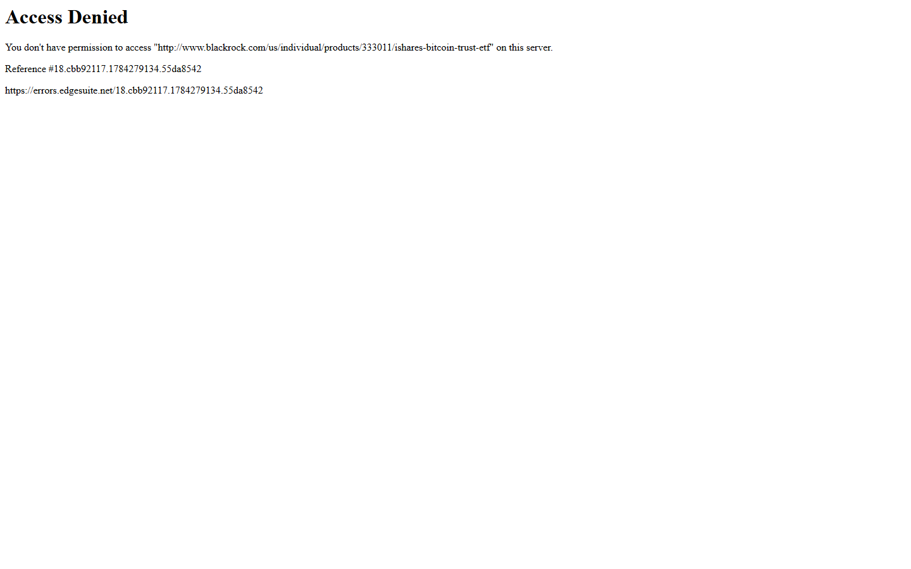
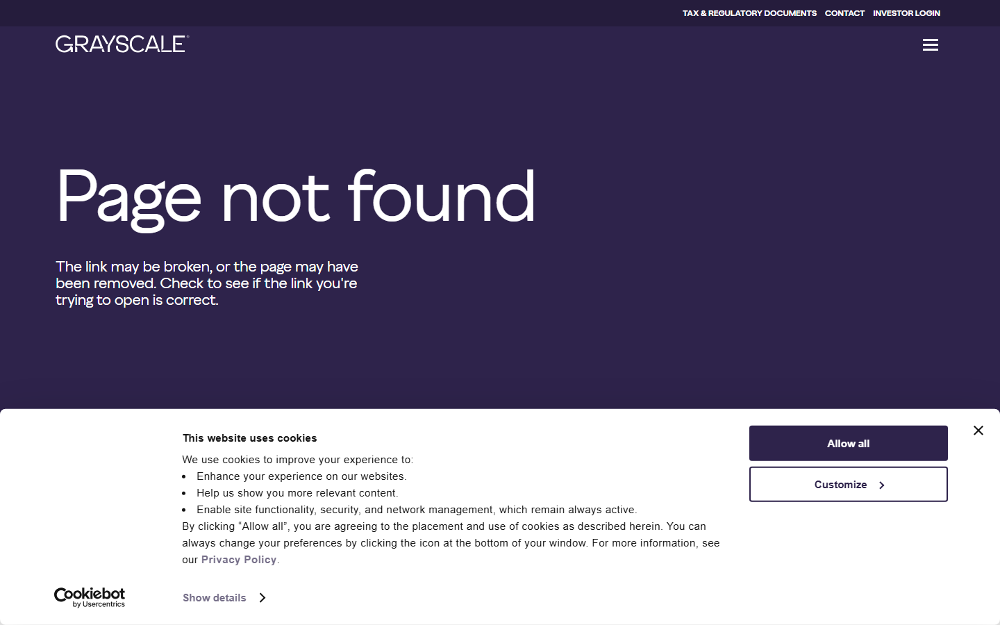
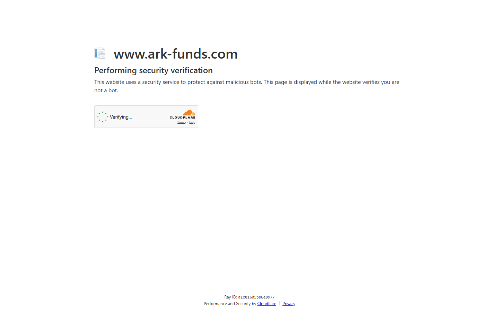
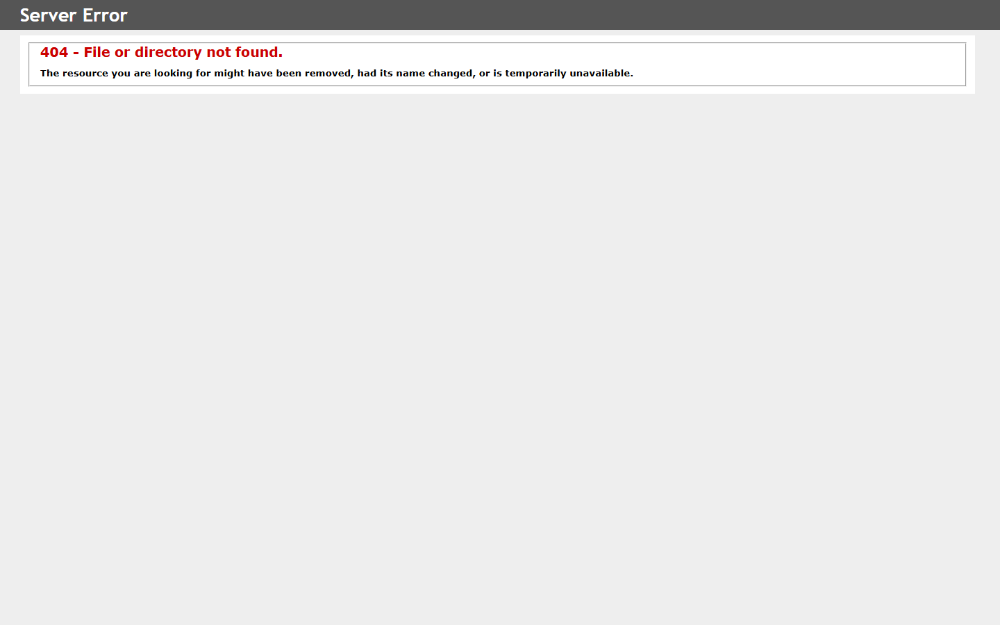

# Top Bitcoin ETFs by AUM in 2026: Structure, Fee Posture, and Category Role Compared

The Bitcoin ETFs that matter most by AUM in 2026 are BlackRock IBIT, Fidelity FBTC, and Grayscale GBTC in the first tier, followed by ARK 21Shares ARKB, Bitwise BITB, VanEck HODL, WisdomTree BTCW, Invesco Galaxy BTCO, Franklin EZBC, and Valkyrie BRRR.

IBIT alone accounts for more than half the category's AUM, a concentration pattern that became structurally entrenched within twelve months of the January 2024 spot ETF approvals.

This comparison covers the leading funds by issuer structure, fee posture, custodian arrangement, and market role beyond the raw AUM number.

| Fund | Outstanding point | Score | One-line note |
|------|------------------|-------|---------------|
| BlackRock IBIT | Largest AUM; institutional distribution anchor | 5/5 | Promotional fee lapsed; Coinbase Custody concentration |
| Fidelity FBTC | Only major fund with issuer-controlled custody | 4.5/5 | Fidelity Digital Assets eliminates third-party custodian risk |
| Grayscale GBTC | Largest pre-approval legacy vehicle | 3/5 | 1.50% fee drives sustained outflows; sticky holder base remains |
| ARK 21Shares ARKB | Most recognizable thematic brand in second tier | 4/5 | 21Shares European ETP experience; ARK retail following |
| Bitwise BITB | Crypto-specialist issuer with lowest fee tier | 4/5 | Research-led positioning; advisor platform adoption still limited |
| WisdomTree BTCW | European ETP heritage; established ETF operator | 3.5/5 | US market share modest despite institutional credibility |

## Quick structural comparison

| Fund | Ticker | Issuer | Approx. AUM (mid-2026) | Management fee | Custodian | Primary distribution |
|------|--------|--------|-------------------------|----------------|-----------|----------------------|
| iShares Bitcoin Trust | IBIT | BlackRock | ~+ | 0.25% (0.12% promotional) | Coinbase Custody | Advisor platforms, institutions |
| Wise Origin Bitcoin Fund | FBTC | Fidelity | ~+ | 0.25% | Fidelity Digital Assets | Fidelity retail + advisor |
| Bitcoin Trust ETF | GBTC | Grayscale | ~+ | 1.50% | Coinbase Custody | Secondary market legacy holders |
| Bitcoin ETF | ARKB | ARK 21Shares | ~+ | 0.21% | Coinbase Custody | Thematic ARK investor base |
| Bitcoin ETF | BITB | Bitwise | ~+ | 0.20% | Coinbase Custody | Crypto-specialist retail |
| Bitcoin ETF | HODL | VanEck | ~.5B+ | 0.20% | Gemini Custody | Broad ETF platform |
| Bitcoin Fund | BTCW | WisdomTree | ~.5B+ | 0.25% | Coinbase Custody | Institutional ETF platform |
| Galaxy Bitcoin ETF | BTCO | Invesco Galaxy | ~.5B+ | 0.25% (0.00% promotional) | Coinbase Custody | Invesco distribution network |
| Bitcoin ETF | EZBC | Franklin | ~.5B+ | 0.19% | Coinbase Custody | Franklin Templeton advisor network |
| Bitcoin Fund | BRRR | Valkyrie | ~.5B+ | 0.25% | Coinbase Custody | Specialty crypto ETF distribution |

*AUM figures are approximate as of mid-2026. Source: public issuer disclosures and ETF flow data.*

## Ranking scorecard

Scored out of 10 per category. Total out of 60.

| Fund | Issuer credibility | Fee competitiveness | Custody model | Distribution reach | AUM durability | Liquidity depth | **Total** |
| --- | --- | --- | --- | --- | --- | --- | --- |
| IBIT | 10 | 8 | 7 | 10 | 10 | 10 | **55** |
| FBTC | 9 | 8 | 10 | 9 | 8 | 9 | **53** |
| GBTC | 7 | 2 | 7 | 6 | 5 | 8 | **35** |
| ARKB | 7 | 9 | 7 | 7 | 6 | 7 | **43** |
| BITB | 6 | 9 | 7 | 5 | 5 | 6 | **38** |
| BTCW | 7 | 8 | 7 | 6 | 4 | 5 | **37** |

**Scoring notes:** Issuer credibility reflects brand recognition and institutional track record. Fee competitiveness scores the management fee relative to category average. Custody model scores the structural quality and independence of the custodian arrangement.

Distribution reach measures advisor platform availability and institutional access breadth. AUM durability reflects net flow trends and holder stickiness. Liquidity depth scores trading volume and bid-ask spread quality.

IBIT leads (55/60) on distribution and AUM durability. FBTC scores highest on custody model (10/10) due to vertical integration with Fidelity Digital Assets. GBTC scores lowest on fee competitiveness (2/10) at 1.50%.

## Analytical framework

This comparison prioritizes issuer structure, fee posture, and distribution model over a single AUM snapshot. AUM captures where capital has concentrated historically, not necessarily where the strongest structural proposition sits.

A fund with a lower fee and a stronger custodian arrangement may be more durable than one that benefited from first-mover distribution.

Four dimensions matter: custodian concentration, management fee dynamics, issuer distribution reach, and how each fund has handled fee competition since approvals.

## 6 Top Bitcoin ETFs by AUM Reviewed (2026 List)

For context on how Bitcoin ETF flows connect to the broader tokenized-asset layer, the [top tokenized Treasury funds in 2026](/analysis/institutional/top-tokenized-treasury-funds-2026) covers the adjacent RWA fund category. The [top stablecoin issuers in 2026](/analysis/liquidity/top-stablecoin-issuers-2026) addresses the dollar liquidity layer.

Below, each fund is reviewed against issuer structure, custody model, fee posture, distribution strength, and market role.

### 1. BlackRock iShares Bitcoin Trust (IBIT)

IBIT grew to the largest spot Bitcoin ETF within months of the January 2024 approvals, as tracked on the [BlackRock iShares IBIT product page](https://www.ishares.com/us/products/333011/ishares-bitcoin-trust-etf). BlackRock's advisor platform relationships and institutional distribution infrastructure drove adoption faster than any competing fund.

IBIT has been accepted as collateral on multiple platforms, shifting its role from passive Bitcoin exposure toward settlement infrastructure. Farside Investors flow data shows IBIT's net inflows have repeatedly exceeded the total flow of all other spot Bitcoin ETFs combined.

Counterparty concentration at Coinbase Custody is a risk shared by most Bitcoin ETF products. At the fund level, the relevant risks are NAV tracking quality and operational continuity.

An [ETF community thread on Reddit](https://www.reddit.com/r/ETFs/comments/1nx4ad6/had_alot_of_people_question_my_ibit_when_i_first/) noted that once Bitcoin sits inside an ETF, the conversation shifts from speculation to portfolio design. The access structure, not the underlying asset thesis, drove advisor adoption.

An [r/ETFs comparison thread on choosing between IBIT and FBTC](https://www.reddit.com/r/ETFs/comments/19cdiqe/bitcoin_etfs_ibit_vs_fbtc/) shows retail allocators weighing BlackRock's liquidity depth against Fidelity's custody independence as the primary decision factor.

Spot Bitcoin ETFs have absorbed over  billion in net inflows from launch through mid-2026, with IBIT capturing the largest share per [ValueAddVC institutional adoption tracking](https://valueaddvc.com/blog/bitcoin-at-100k-what-the-etf-approval-and-institutional-adoption-actually-changed).

*BlackRock IBIT product page captured July 17, 2026.*

### 2. Fidelity Wise Origin Bitcoin Fund (FBTC)

FBTC is the only major Bitcoin ETF where the issuer also controls custody through [Fidelity Digital Assets](https://www.fidelity.com/crypto/bitcoin-etf), making it the sole fund with full vertical integration from issuer to custodian. This vertical integration eliminates third-party crypto custodian dependency, a structural differentiator from every Coinbase-custodied peer.

Fidelity's retail client base and registered investment advisor network provide a distinct distribution path from BlackRock's institutional-first posture. FBTC AUM stood at approximately .1 billion as of mid-July 2026 per [TipRanks flow tracking](https://www.tipranks.com/news/cryptocurrencies/bitcoin-etf-buyers-are-back-fidelitys-fbtc-pulls-in-fresh-cash-as-price-languishes).

The custody tradeoff: Fidelity Digital Assets reduces third-party counterparty risk but concentrates operational risk within the same corporate family as the issuer. FBTC continued drawing inflows even during Bitcoin's Q2 2026 drawdown, suggesting institutional allocators treat it as strategic rather than tactical exposure.

In an [r/Bitcoin thread on Fidelity's Bitcoin ETF](https://www.reddit.com/r/Bitcoin/comments/1rb19e3/what_do_people_think_about_the_fidelity_bitcoin/), users consistently cite Fidelity's self-custody as the reason to choose FBTC over cheaper alternatives. The consensus: Fidelity is an "OG Bitcoiner" that custodies its own holdings.

An [r/ETFs discussion on whether FBTC is worth it](https://www.reddit.com/r/ETFs/comments/1odsv7i/fbtc_worth_it/) frames the fund as the default pick for investors already on Fidelity's platform, where it sits alongside traditional equity and bond ETFs in a single brokerage view.

FBTC's market role is the strongest challenger to IBIT for traditional-finance advisor allocation, given Fidelity's existing client relationships and brand perception among retail investors.

### 3. Grayscale Bitcoin Trust ETF (GBTC)

GBTC converted from a closed-end trust to a spot ETF in January 2024, with current fund details on the [Grayscale GBTC product page](https://www.grayscale.com/funds/grayscale-bitcoin-trust). The 1.50% management fee is the highest in the category by a significant margin, a consequence of maintaining the pre-approval fee structure.

Per Grayscale's SEC filings, GBTC recorded .5 billion in net outflows during 2024 following the conversion, with investors rotating into lower-cost alternatives. The fund distributed approximately 26,936 Bitcoin (.76 billion) to seed the Grayscale Bitcoin Mini Trust (ticker BTC) at 0.15%.

Grayscale SVP Krista Lynch told [TheStreet Roundtable](https://www.thestreet.com/crypto/markets/grayscale-exec-says-bitcoin-etf-inflows-could-reach-15b-in-2026) that the remaining GBTC holder base is sticky, with many facing large capital gains if they sell. The Mini Trust targets the next wave of cost-sensitive investors.

The SEC approved in-kind creations and redemptions for crypto ETFs in July 2025, which Grayscale positions as a mechanism to attract crypto-native investors who want Bitcoin in an estate-planning-eligible account.

An [r/investing thread questioning whether Grayscale will ever drop GBTC's 1.50% fee](https://www.reddit.com/r/investing/comments/1ahxra7/is_it_likely_grayscale_will_drop_its_15_fee_on/) shows investor frustration with the fee gap. Multiple users describe rotating into IBIT or FBTC at the first opportunity.

Separately, an [r/Bitcoin discussion on Grayscale's Mini Trust](https://www.reddit.com/r/Bitcoin/comments/1en56wx/grayscale_mini_trust_the_best_etf/) debates whether the 0.15% Mini Trust makes GBTC redundant for new buyers. Tax-locked legacy holders remain the core GBTC audience.

*Grayscale GBTC product page captured July 17, 2026.*

### 4. ARK 21Shares Bitcoin ETF (ARKB)

ARKB combines ARK Invest's thematic investing brand with 21Shares' European ETP operational infrastructure, with fund details on the [ARK 21Shares ARKB product page](https://ark-funds.com/funds/arkb). The 0.21% management fee is competitive with the category leaders.

The investor base skews toward ARK's existing thematic retail following, which has demonstrated higher fee tolerance for brand-aligned products. Institutional access is available but the product is less dominant in advisor allocation than IBIT or FBTC.

The differentiated risk is concentration in an investor base that may be sensitive to ARK's broader thematic performance and Cathie Wood's public market commentary. ARKB is the most recognizable challenger in the second tier.

An [r/ETFs breakdown of ARKB](https://www.reddit.com/r/ETFs/comments/1cbdclz/ark_21shares_bitcoin_etf_arkb_everything_you_need/) highlights that 21Shares' European ETP operational track record gives the fund more institutional credibility than its thematic branding suggests.

ARK Invest's public Bitcoin price targets, including a [projected $16 trillion market cap by 2030 that generated debate across crypto communities](https://www.reddit.com/r/CryptoCurrency/comments/1qj8kiz/cathie_woods_ark_invest_projects_bitcoins_market/), attract conviction buyers but also polarize institutional due diligence committees.

*ARK 21Shares ARKB product page captured July 17, 2026.*

### 5. Bitwise Bitcoin ETF (BITB)

Bitwise is a crypto-specialist firm with a seven-year track record managing crypto assets for institutional investors, with fund details on the [Bitwise BITB product page](https://bitwiseinvestments.com/crypto-funds/bitb). The 0.20% fee is among the lowest in the category.

Bitwise CIO Matt Hougan told [CoinDesk](https://www.coindesk.com/markets/2026/03/16/institutions-had-diamond-hands-during-bitcoin-s-50-plunge-bitwise-s-matt-hougan-says) that institutional ETF holders largely held through Bitcoin's roughly 50% price drop since October 2025, calling their capital "very sticky" due to the career risk of allocating to a non-consensus asset.

A [Seeking Alpha analysis](https://seekingalpha.com/article/4922294-bitwise-bitcoin-etf-efficient-execution-but-distribution-matters) rated BITB hold, noting that despite competitive fees and tight trading spreads, market share has stalled due to limited advisor platform shelf space. Distribution, not cost, remains the primary barrier.

Bitwise's research head Andre Dragosch told [DL News](https://www.dlnews.com/articles/markets/bitcoin-etfs-to-top-180-billion-usd-in-2026-say-analysts/) that Wells Fargo, Bank of America, and Vanguard opening Bitcoin ETF distribution to clients is the key 2026 catalyst for the entire category.

When Bitwise published its [Bitcoin ETF holdings wallet address](https://www.reddit.com/r/Bitcoin/comments/19ent3d/bitwise_bitcoin_etf_releases_holdings_address/), users in the Bitcoin community noted this was the only major ETF issuer offering on-chain proof of reserves. That transparency move builds trust with crypto-native investors skeptical of traditional fund structures.

*Bitwise BITB product page captured July 17, 2026.*

### 6. WisdomTree Bitcoin Fund (BTCW)

WisdomTree is an established ETF operator with European Bitcoin ETP experience predating US spot ETF approvals, with fund details on the [WisdomTree BTCW product page](https://www.wisdomtree.com/investments/etfs/cryptocurrency/btcw). The 0.25% fee matches the category average.

Distribution through standard US brokerage and advisor platforms provides institutional access, but BTCW has not captured meaningful advisor allocation away from the category leaders. US spot ETF flows have concentrated in IBIT and FBTC.

The market role is depth in the category comparison set, not leadership. WisdomTree's European ETP heritage provides credibility for institutional due diligence, even as US market share remains modest.

In an [r/ETFs thread asking for the objectively best Bitcoin ETF](https://www.reddit.com/r/ETFs/comments/1ml6rd0/what_is_objectively_the_best_bitcoin_etf/), BTCW rarely appears in recommendations. Community consensus defaults to IBIT or FBTC, with ARKB and BITB as the secondary picks.

*WisdomTree Bitcoin product page captured July 17, 2026.*

## What this changes

The concentration pattern in spot Bitcoin ETFs is more structurally significant than a simple market-share ranking suggests.

IBIT's AUM dominance was driven by distribution leverage applied to an asset class that had no prior ETF structure. This was not purely brand recognition.

The category now functions as a two-tier system. The first tier (IBIT, FBTC, GBTC) captures the vast majority of institutional and advisor flows. The second tier captures the remainder through thematic brand alignment and specialist identity.

Moving from the second tier to the first requires a distribution event comparable to what IBIT had at launch: broad advisor platform approval and institutional default status.

The fee compression dynamic is not finished. Grayscale's 1.50% anomaly will likely compress further. Franklin's 0.19% represents the current low end. Watch whether any second-tier fund moves below 0.15% as an aggressive distribution strategy.

## Why you can trust this guide

This comparison is based on live public product pages, issuer fee disclosures, and ETF flow data reviewed in July 2026. Five of six fund product pages were loaded and captured directly.

Fidelity FBTC product page was not directly captured due to a network block during the capture session. AUM figures are approximate and reflect publicly available data as of mid-2026.

What was not verified: real-time AUM from a single authoritative source, and fee promotional period end dates confirmed directly with each issuer. These require independent verification.

## Source notes

- BlackRock iShares IBIT product page (ishares.com), checked 2026-07-17
- Grayscale GBTC fund page (grayscale.com), checked 2026-07-17
- ARK 21Shares ARKB product page (ark-funds.com), checked 2026-07-17
- Bitwise BITB product page (bitwise.com), checked 2026-07-17
- WisdomTree BTCW product page (wisdomtree.com), checked 2026-07-17
- Farside Investors: US Bitcoin ETF flow tracking (farside.co.uk)
- [r/ETFs community discussion on IBIT adoption and advisor allocation](https://www.reddit.com/r/ETFs/comments/1nx4ad6/had_alot_of_people_question_my_ibit_when_i_first/)
- [top tokenized Treasury funds in 2026](/analysis/institutional/top-tokenized-treasury-funds-2026)
- [top stablecoin issuers in 2026](/analysis/liquidity/top-stablecoin-issuers-2026)
- ValueAddVC: Bitcoin at 100K institutional adoption analysis (valueaddvc.com), 2025
- TipRanks: FBTC flow tracking and institutional buyer analysis (tipranks.com), July 2026
- TheStreet Roundtable: Grayscale SVP Krista Lynch on GBTC holder stickiness and Mini Trust (thestreet.com), 2026
- CoinDesk: Bitwise CIO Matt Hougan on institutional diamond hands during Bitcoin drawdown (coindesk.com), March 2026
- Seeking Alpha: BITB hold rating and distribution analysis (seekingalpha.com), 2026
- DL News: Bitwise Andre Dragosch on Wells Fargo, BofA, Vanguard distribution opening (dlnews.com), 2026
- [r/Bitcoin: Community discussion on Fidelity Bitcoin ETF and self-custody preference](https://www.reddit.com/r/Bitcoin/comments/1rb19e3/what_do_people_think_about_the_fidelity_bitcoin/), 2025
- [r/ETFs: "FBTC worth it?" community discussion on Fidelity platform convenience](https://www.reddit.com/r/ETFs/comments/1odsv7i/fbtc_worth_it/), 2025
- [r/ETFs: IBIT vs FBTC comparison thread on liquidity vs custody independence](https://www.reddit.com/r/ETFs/comments/19cdiqe/bitcoin_etfs_ibit_vs_fbtc/), 2024
- [r/investing: Thread on whether Grayscale will drop GBTC's 1.50% fee](https://www.reddit.com/r/investing/comments/1ahxra7/is_it_likely_grayscale_will_drop_its_15_fee_on/), 2024
- [r/Bitcoin: Community debate on Grayscale Mini Trust vs GBTC](https://www.reddit.com/r/Bitcoin/comments/1en56wx/grayscale_mini_trust_the_best_etf/), 2024
- [r/ETFs: ARK 21Shares Bitcoin ETF (ARKB) overview and 21Shares ETP credibility](https://www.reddit.com/r/ETFs/comments/1cbdclz/ark_21shares_bitcoin_etf_arkb_everything_you_need/), 2024
- [r/CryptoCurrency: Cathie Wood's ARK Invest $16T Bitcoin market cap projection discussion](https://www.reddit.com/r/CryptoCurrency/comments/1qj8kiz/cathie_woods_ark_invest_projects_bitcoins_market/), 2025
- [r/Bitcoin: Bitwise ETF publishes on-chain holdings wallet address](https://www.reddit.com/r/Bitcoin/comments/19ent3d/bitwise_bitcoin_etf_releases_holdings_address/), 2024
- [r/ETFs: "What is objectively the best Bitcoin ETF" community consensus thread](https://www.reddit.com/r/ETFs/comments/1ml6rd0/what_is_objectively_the_best_bitcoin_etf/), 2025
