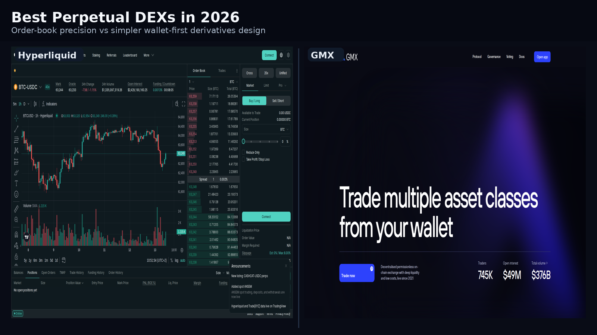
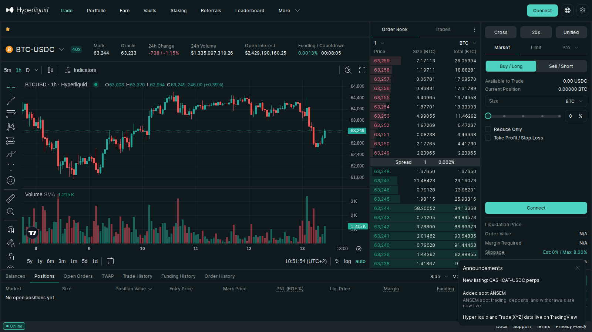
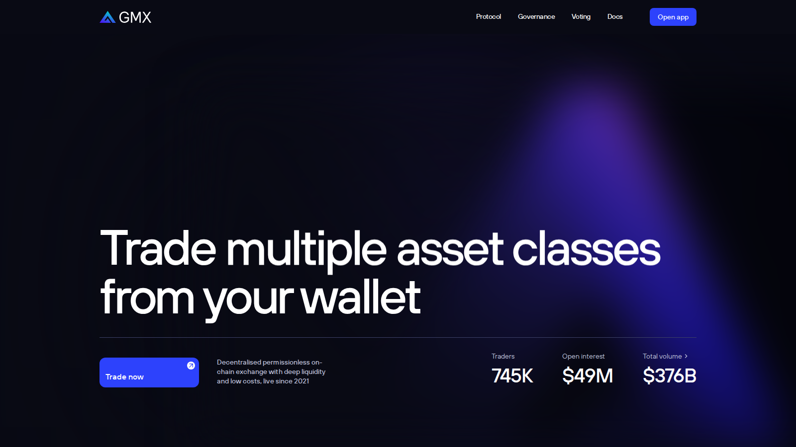

# Best Perpetual DEXs in 2026: 6 Platforms Compared by Liquidity, UX, and Product Model

Last updated: 2026-07-10

Suggested category: /analysis/derivatives

Suggested slug: /analysis/derivatives/best-perpetual-dexs-2026

Primary keyword: best perpetual DEXs 2026

Meta description: Best perpetual DEXs in 2026: compare six platforms by liquidity, execution model, chain fit, and who each one is actually best for.

If you are comparing perpetual DEXs in 2026, the real problem is not picking the best DEX in abstract. The real problem is understanding which trading model fits your workflow, risk tolerance, and chain preference.

That is why this guide looks at liquidity, product model, and distribution together. What stood out immediately was not feature count. It was where each platform puts friction: order-book precision, vault simplicity, appchain speed, or Solana-native reach. That is also why this page should support [top Layer 2 networks in 2026](/research/blockchain/top-layer-2-networks-2026), because venue design and chain design now reinforce each other.

> Why you can trust this guide
>
> This guide is based on live public platform surfaces and official references reviewed on July 10, 2026. We directly checked trading interfaces, market menus, fee pages, and public workflow framing where available. Anything that depends on a wallet-connected trade, live depth snapshot, or a full stress-period execution test still needs final verification before publication.

## The perpetual DEXs most worth comparing in 2026 are Hyperliquid, dYdX, GMX, Jupiter, Drift, and SynFutures

The perpetual DEXs most worth comparing in 2026 are Hyperliquid, dYdX, GMX, Jupiter, Drift, and SynFutures. They matter because together they capture the major product models in the sector: appchain order books, Cosmos-style pro trading, vault-backed perps, Solana-native distribution, and onchain expansion into multi-asset markets.

That is why this page avoids fake precision. The best perpetual DEX for one user can be the wrong product for another.

## How we ranked perpetual DEXs for this list

This list uses six filters:

- liquidity and execution quality
- clarity of product model
- chain and user-distribution advantage
- relevance to current crypto trading flows
- durability of the platform brand
- risk profile under stress

This is a platform comparison, not a leverage recommendation.

## What we checked ourselves before ranking these platforms

To build this list, we reviewed the live homepages, market surfaces, fee pages, docs, and wallet-entry flows for all six venues on July 10, 2026. From the public experience alone, we could compare product posture, market breadth, and how each platform signals its ideal user before any trade is placed.

That direct review does not replace a live funded trading session. But it does show something important very quickly: where each platform puts friction, which type of trader it expects, and whether the venue is optimizing for depth, speed, or easier onboarding. What stood out immediately was not capability alone. It was where each product puts friction in the workflow.

The screenshots below should make that difference easier to show. That visual difference is not cosmetic. It signals whether a platform is built for order-book precision, simplified vault exposure, or broader consumer-style distribution.

**Featured Image**
File: `../media/best-perpetual-dexs-featured.png`
Alt text: `Comparison of perpetual decentralized exchange interfaces showing different trading models`
Caption: `Perpetual DEX interfaces reviewed during our July 2026 comparison of onchain derivatives platforms.`

*Perpetual DEX interfaces reviewed during our July 2026 comparison of onchain derivatives platforms.*

**Screenshot 1**
File: `../media/hyperliquid-trading-interface.png`
Alt text: `Hyperliquid trading screen showing order-book style perpetual markets`
Caption: `Hyperliquid market interface captured during our July 2026 perpetual DEX review.`

*Hyperliquid market interface captured during our July 2026 perpetual DEX review.*

**Screenshot 2**
File: `../media/gmx-home-interface.png`
Alt text: `GMX interface showing wallet-first perpetual trading product positioning`
Caption: `GMX public interface reviewed as part of our comparison of perpetual DEX product models in 2026.`

*GMX public interface reviewed as part of our comparison of perpetual DEX product models in 2026.*

## The full list

### 1. Hyperliquid

Hyperliquid is a strong choice for readers who want the clearest reference point for an onchain order-book venue built around active traders. From the public surface we reviewed, it immediately felt more like a pro-trading platform than a simplified DeFi front end. That is a strength if you care about depth, speed, and product identity, but it becomes a weakness if your priority is the softest possible onboarding path.

Best for:
- readers comparing order-book-first perpetual venues
- understanding where pro-trader identity is strongest onchain
- mapping the category leader in platform posture

Tradeoffs:
- the product is built more for active traders than casual explorers
- concentration around one dominant venue model creates category risk
- easier consumer onboarding is not the main story here

### 2. dYdX

dYdX is a strong choice for readers who want a long-standing professional-trading identity inside onchain derivatives. From the public surface we reviewed, it immediately felt more like a serious market venue than an app-first retail product. That is a strength if you care about trading credibility and category history, but it becomes a weakness if your main filter is where current retail attention clusters.

Best for:
- readers comparing established pro-trading brands
- understanding category history beyond the newest winner
- mapping serious perpetual DEX identity outside the retail frame

Tradeoffs:
- the field is more crowded than it used to be
- brand history alone does not secure category leadership
- retail attention has shifted toward newer distribution models

### 3. GMX

GMX is a strong choice for readers who want one of the clearest perpetual DEX models to understand quickly. From the public surface we reviewed, it immediately felt more like a straightforward wallet-first derivatives product than a venue trying to be everything at once. That is a strength if you value clarity and a simpler mental model, but it becomes a weakness if you want the deepest market breadth or the most advanced trading posture.

Best for:
- readers who want the cleanest product explanation
- comparing simpler perpetual DEX design
- understanding wallet-first derivatives positioning

Tradeoffs:
- not every trader wants the same execution model
- clarity does not always mean maximum breadth
- advanced users may still prefer deeper order-book environments

This model difference is exactly why Coincu’s existing explainer on [AMM versus order book DEXes in 2026](https://coincu.com/how-will-the-dex-war-explode/) can work as a concept-layer internal link beneath the ranking.

### 4. Jupiter

Jupiter is a strong choice for readers who want to understand how Solana distribution changes the derivatives conversation. From the public surface we reviewed, it immediately felt more like a broad consumer trading gateway than a pure perps specialist. That is a strength if you care about reach and user flow, but it becomes a weakness if your priority is a narrowly focused perps-first identity.

Best for:
- readers comparing Solana-led distribution advantages
- understanding where broad user flow enters onchain trading
- mapping crossover between swaps and derivatives

Tradeoffs:
- product breadth can blur the perps comparison
- some users may want a more specialized venue
- reach is stronger than purity of category identity

### 5. Drift

Drift is a strong choice for readers who want a clearer Solana-native perpetual venue than the broader Jupiter-style gateway model. From the public surface we reviewed, it immediately felt more like a focused derivatives brand than a side feature inside a larger product family. That is a strength if you want category focus, but it becomes a weakness if you prefer a broader cross-ecosystem venue thesis.

Best for:
- readers comparing focused Solana-native perps venues
- understanding category specialization on Solana
- mapping serious derivatives identity outside broad gateways

Tradeoffs:
- Solana-native strength can still feel narrower than cross-ecosystem breadth
- the venue story is more focused than universal
- wider market reach may matter more to some users than specialization

### 6. SynFutures

SynFutures is a strong choice for readers who want to compare a broader multi-asset ambition instead of a crypto-only perpetual identity. From the public surface we reviewed, it immediately felt more like an expansion experiment than a narrow single-lane venue. That is a strength if you care about category ambition and scope, but it becomes a weakness if your priority is the clearest execution focus.

Best for:
- readers comparing multi-asset DEX ambition
- understanding how far derivatives venues want to expand
- mapping category experiments beyond crypto-only perps

Tradeoffs:
- bigger product scope can create execution complexity
- ambition does not always convert into cleaner market fit
- broader coverage can weaken clarity for some users

## How to choose between these perpetual DEXs

Choose Hyperliquid if your priority is the clearest pro-trader onchain order-book environment.

Choose dYdX if your priority is an established professional-trading identity with longer category history.

Choose GMX if your priority is the simplest product model to understand quickly.

Choose Jupiter if your priority is broad Solana-led user distribution and a larger consumer trading gateway.

Choose Drift if your priority is a more focused Solana-native perpetual venue.

Choose SynFutures if your priority is comparing a broader multi-asset derivatives experiment rather than a narrow perps-first brand.

## Key evidence and signals to track through H2 2026

Track these signals instead of just social sentiment:

- where daily and weekly volume concentrates
- whether traders stay loyal to one venue model or rotate quickly
- whether vault and LP models remain healthy during stress
- whether Solana-native distribution continues to reshape user behavior
- whether newer multi-asset DEXs turn ambition into real usage

Those signals tell you whether a platform is structurally winning or just temporarily loud.

## What this tells us about crypto in 2026

Perpetual DEXs are no longer a niche corner of DeFi. They are now one of the main places where crypto tests new market structure. The category shows how fast onchain products can get close to pro-trading expectations, but it also shows how many different paths the sector is still trying at once.

The strongest platforms in 2026 are not the ones shouting the loudest. They are the ones that make traders come back. That also makes [top crypto market makers in 2026](/analysis/liquidity/top-crypto-market-makers-2026) a useful follow-up page, since venue quality and external liquidity support are tightly linked.

## FAQ

### What makes one perpetual DEX better than another?

Usually some mix of liquidity, execution quality, risk controls, interface clarity, and whether the product model actually fits the trader’s style.

### Is the biggest perpetual DEX always the safest choice?

No. Scale matters, but so do infrastructure risk, liquidation behavior, and whether the venue model makes sense in volatile conditions.

### Why compare Hyperliquid, dYdX, and GMX together if they work differently?

Because readers need to compare the dominant models in the category, not only platforms that look identical.

## Source notes

- Hyperliquid official site, checked 2026-07-10
- dYdX official site, checked 2026-07-10
- GMX official site, checked 2026-07-10
- Jupiter official site, checked 2026-07-10
- Drift official site, checked 2026-07-10
- SynFutures official site, checked 2026-07-10
- CoinGecko 2026 perpetuals report, checked 2026-07-10

## Internal link suggestions

- Link from /analysis/derivatives with the anchor best perpetual DEXs
- Link from market-structure and exchange-comparison pieces with the anchor onchain derivatives platforms
- Link to pages on top layer 2 networks and market makers where relevant
