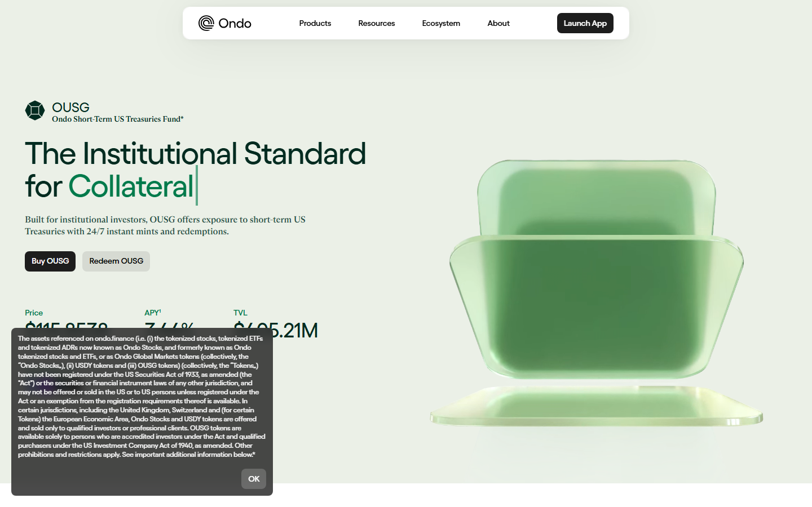
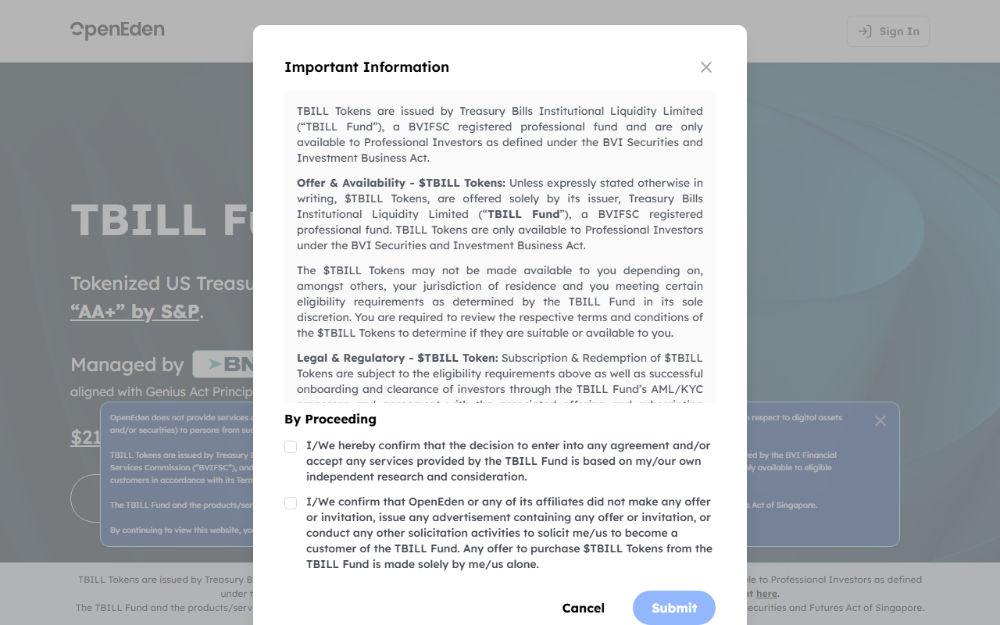

# Top RWA Crypto Projects in 2026: 7 Names to Compare Beyond the Hype

The seven RWA crypto projects that define meaningful category comparison in 2026 are Ondo, Ethena, Centrifuge, Maple, Plume, OpenEden, and Securitize.

The market groups all of them under the RWA label, but they occupy different layers: tokenized-Treasury distribution, synthetic-dollar collateral, structured credit origination, private credit infrastructure, platform-layer tokenization, blockchain-native Treasury issuance, and institutional issuance rails. Treating these as equivalent understates every structural difference that matters for due diligence.

This comparison maps each project to its actual function in the stack, with data where available and structural flags where the thesis is still unproven.

## Quick comparison: top RWA projects 2026

| Project | Layer | Primary product | Evidence of adoption | Key risk |
|---|---|---|---|---|
| [Ondo Finance](https://ondo.finance) | Distribution | OUSG, USDY (tokenized T-bills) | $600M+ AUM, Aave collateral listing | Nested BlackRock/BUIDL exposure |
| [Ethena](https://ethena.fi) | Synthetic collateral | USDe (delta-neutral synthetic dollar) | $3B+ supply peak in 2024 | Funding rate inversion risk |
| [Centrifuge](https://centrifuge.io) | Credit infrastructure | Tinlake/CFG (real-world credit pools) | MakerDAO, Aave credit integration | Credit default and liquidity mismatch |
| [Maple Finance](https://mapledirect.com) | Institutional credit | USDC/USDT lending pools | $2B+ originated loans | Borrower concentration, past default events |
| [Plume Network](https://plumenetwork.xyz) | Platform layer | RWA-native L2 infrastructure | Early ecosystem; partnerships announced | Adoption still unproven |
| [OpenEden](https://openeden.com) | Treasury issuance | TBILL (tokenized T-bill vault) | Live product, institutional access | Smaller scale than category leaders |
| [Securitize](https://securitize.io) | Issuance rails | Transfer agent + tokenization platform | BlackRock BUIDL, Hamilton Lane | Rails dependency risk; limited public token |

## Ranking scorecard

Scored out of 10 per category. Total out of 60.

| Project | Distribution proof | Structural clarity | Institutional fit | Composability | Risk transparency | Thesis durability | **Total** |
|---|---|---|---|---|---|---|---|
| Ondo | 9 | 9 | 8 | 9 | 7 | 8 | **50** |
| Ethena | 8 | 7 | 6 | 8 | 6 | 6 | **41** |
| Centrifuge | 7 | 8 | 7 | 6 | 7 | 8 | **43** |
| Maple | 7 | 8 | 8 | 5 | 7 | 7 | **42** |
| Plume | 3 | 6 | 5 | 5 | 5 | 6 | **30** |
| OpenEden | 6 | 8 | 7 | 5 | 7 | 7 | **40** |
| Securitize | 7 | 9 | 9 | 4 | 8 | 9 | **46** |

**Scoring notes:** Distribution proof measures whether the project has verifiable AUM, TVL, or user adoption beyond press releases. Structural clarity scores how cleanly the product role in the stack can be defined. Institutional fit scores whether the product is usable by institutional allocators without significant workaround. Composability reflects whether the token or product is integrated as collateral or yield layer in other DeFi protocols. Risk transparency scores how explicitly the issuer or protocol discloses structural and counterparty risks. Thesis durability scores whether the project's role in the stack survives a rate-cycle reversal or regulatory tightening.

Ondo leads because it has both distribution proof and composability in the live DeFi ecosystem. Securitize scores highest on institutional fit and thesis durability because it is infrastructure -- it is less exposed to product-cycle risk than asset issuers. Plume scores lowest because its infrastructure thesis lacks adoption evidence at this stage.

## Analytical framework

This comparison prioritizes stack role and adoption evidence over narrative scale, because the RWA category is unusually prone to conflating press-release integrations with real usage.

The relevant dimensions for a fund analyst or DeFi researcher are: where does the product sit in the capital flow (issuance, distribution, collateral, credit), what evidence exists that institutional users have adopted it, and what structural risks remain embedded in the design.

The ranking follows four dimensions: verified distribution, structural role clarity, institutional access model, and composability. These correspond to what a due-diligence team would need before approving an RWA product for portfolio use or DeFi integration.

## 7 Top RWA Crypto Projects Reviewed (2026 List)

For context on the tokenized-Treasury layer specifically, [top tokenized Treasury funds in 2026](/analysis/institutional/top-tokenized-treasury-funds-2026) covers the fund product layer in more detail. The [top stablecoin issuers in 2026](/analysis/liquidity/top-stablecoin-issuers-2026) page covers the dollar-liquidity layer that many RWA products use as settlement infrastructure.

Here, we cover each project by product role, adoption evidence, composability, and the structural risks that require flagging before any allocation or integration decision.

### 1. Ondo Finance

[Ondo Finance](https://ondo.finance) is the clearest bridge between institutional Treasury products and onchain DeFi distribution. Its two main products are OUSG (Ondo Short-Term US Government Bond Fund) and USDY (Ondo US Dollar Yield), both of which provide tokenized access to US Treasury-backed returns.

OUSG's underlying exposure is primarily held in BlackRock's BUIDL fund, with USDC and bank deposits as secondary holdings. That creates a nested institutional layer: Ondo wraps BUIDL, which itself is held via Coinbase Custody on the Securitize platform. Due-diligence teams should model OUSG as a multi-layer exposure, not a direct T-bill position.

*Ondo OUSG product page captured July 2026, showing tokenized Treasury access model and Flux Finance DeFi integration.*

The [Aave DAO voted to list OUSG as collateral](https://governance.aave.com) in 2025, allowing borrowers to post OUSG and draw USDC against it. Pendle added OUSG and USDY to its principal/yield-token marketplace, enabling fixed-versus-floating Treasury yield separation. These are audited contract deployments, not announced integrations. That distinction matters for assessing real composability depth.

A [CryptoCurrency Reddit thread on RWA projects](https://www.reddit.com/r/CryptoCurrency/comments/osmb00/several_resources_and_websites_to_help_you_dyor/) named Ondo and OpenEden as the two tokenized Treasury products most cited in institutional DeFi research as of 2025-2026.

**Best for:** Institutional allocators and DeFi protocols needing tokenized Treasury exposure with established composability.
**Main tradeoff:** Nested BlackRock and Securitize exposure means risk analysis must extend through the issuer stack.

---

### 2. Ethena

[Ethena](https://ethena.fi) is the most prominent synthetic-dollar protocol in the current RWA expansion. Its USDe product maintains a delta-neutral position by pairing spot ETH/BTC long exposure with equivalent short perpetual positions on centralized exchanges. The yield from the funding rate on those shorts, plus staking rewards on the spot collateral, generates the USDe yield.

By 2026, USDe had reached over $3 billion in circulating supply at peak, making it the largest crypto-native synthetic dollar ever deployed. The [Ethena risk documentation](https://docs.ethena.fi) explicitly addresses the two main structural risks: funding rate inversion (when shorts must pay rather than receive funding) and custodial counterparty risk on the CEX legs of the hedge.

The structural RWA debate around Ethena is whether USDe belongs in the same category as Treasury-backed tokenized products. Ethena's argument is that off-exchange settlement via copper/fireblocks-style institutional custodians and the structural T-bill backing of its reserve fund place USDe in the collateral layer of the RWA stack. That framing is gaining traction in DeFi governance discussions but is not universally accepted.

USDe is accepted as collateral on [Aave](https://aave.com), [Morpho](https://morpho.org), and several other DeFi lending venues. The composability evidence is real; the structural complexity of the underlying position requires more sophisticated risk modeling than a Treasury wrapper.

**Best for:** DeFi protocols and sophisticated allocators who want high-yield collateral with transparent hedging mechanics.
**Main tradeoff:** Funding rate inversion during directional bear markets is the key stress scenario and has no guaranteed floor.

---

### 3. Centrifuge

[Centrifuge](https://centrifuge.io) is the oldest structured-credit protocol in crypto, having launched Tinlake in 2020 as a framework for bringing real-world loan pools onchain. By 2026, Centrifuge had transitioned to Centrifuge Prime as its institutional product, facilitating credit origination for borrowers who need DeFi access to real-world structured finance.

The platform was instrumental in the MakerDAO real-world asset vault expansion: several MakerDAO RWA vaults used Centrifuge as the bridge between onchain DAI and offchain credit assets. [MakerDAO governance posts](https://forum.makerdao.com) document these integrations in detail, including the collateral parameters and credit risk assessments.

The credit model introduces risks not present in T-bill wrappers: borrower default, legal enforceability of offchain security agreements, and liquidity mismatch between onchain token redemption and offchain loan maturity. Centrifuge's public documentation addresses these but does not eliminate them -- they are structural features of real-world credit, not engineering problems.

**Best for:** DeFi platforms seeking to integrate real-world credit yield with documented legal structure and multi-year track record.
**Main tradeoff:** Credit default risk and legal complexity require significantly deeper due diligence than Treasury-backed products.

---

### 4. Maple Finance

[Maple Finance](https://mapledirect.com) operates institutional-grade undercollateralized lending pools where vetted institutional borrowers access USDC or USDT loans against a reputation-and-covenant-based credit framework rather than token overcollateralization.

By 2026, Maple had originated over $2 billion in institutional loans through its pool model. The platform's public [pool disclosure page](https://app.maple.finance/#/earn) shows active pools, borrower identities (for public pools), interest rates, and loan utilization metrics.

The 2022 cycle was a stress test: Maple suffered credit losses from Orthogonal Trading and other borrowers during the post-FTX deleveraging. Those defaults led to a governance redesign of the pool model and stricter borrower vetting criteria for new deployments. Maple v2 introduced enhanced pool delegate accountability and public borrower disclosure requirements.

The recovery from 2022 and the subsequent growth in origination volume is itself an institutional signal: lenders returned after loss events, which is a stronger sustainability indicator than uninterrupted growth that never faced stress.

**Best for:** DeFi protocols and institutional allocators seeking diversified credit yield from vetted institutional borrowers.
**Main tradeoff:** Undercollateralized lending means recovery in default events is partial; credit risk must be assessed per pool, not at protocol level.

A [CryptoCurrency Reddit thread on private credit protocols](https://www.reddit.com/r/CryptoCurrency/comments/1okwvxu/crypto_tools_that_actually_improved_my_workflow/) noted that Maple's transparent post-default governance response in 2022-2023 set a meaningful precedent in DeFi credit -- the argument being that a protocol that survives a default cycle with documented recovery is more trustworthy than one that has never been tested.

---

### 5. Plume Network

[Plume Network](https://plumenetwork.xyz) is a purpose-built L2 designed specifically for RWA issuance and trading. Its thesis is that a chain optimized for compliance, tokenization tooling, and institutional onboarding will outcompete general-purpose chains for RWA-specific use cases.

By mid-2026, Plume had announced partnerships with several tokenization platforms and was running early testnet activity. The product is infrastructure, not an asset -- the correct comparison is less against Ondo or Maple and more against the tokenization tooling layer that Securitize operates.

The structural question for Plume is adoption timing: RWA infrastructure is valuable if enough issuers choose the platform. General-purpose chains like Ethereum and Solana have existing user liquidity that purpose-specific chains must overcome. That is not a disqualifying problem -- it is the core thesis risk that requires monitoring.

**Best for:** Builders evaluating the tokenization infrastructure layer for future RWA issuance.
**Main tradeoff:** Early-stage with unproven adoption; the thesis requires issuers to move to Plume rather than use existing chain liquidity.

---

### 6. OpenEden

[OpenEden](https://openeden.com) operates a blockchain-native Treasury vault product called TBILL, providing accredited investors direct access to US T-bill returns onchain. The product launched on Ethereum and is positioned as a simpler, more directly-structured alternative to multi-layer products like OUSG.

*OpenEden TBILL page captured July 2026, showing blockchain-native Treasury vault structure and accredited investor access model.*

OpenEden's reserve backing is directly in short-term US Treasury bills held through a regulated custodian, with no nested fund structure adding counterparty complexity. For institutional buyers who want the simplest possible T-bill-to-token conversion, the absence of intermediate wrappers is a meaningful structural differentiator.

The platform's AUM is smaller than Ondo's, which affects composability -- TBILL has fewer DeFi integrations than OUSG. But the cleaner structure and direct T-bill backing make it a strong due-diligence outcome for allocators who can tolerate smaller scale.

**Best for:** Institutional allocators who want the simplest, most direct tokenized T-bill structure with minimum nested counterparty exposure.
**Main tradeoff:** Smaller scale limits DeFi composability compared with the larger tokenized Treasury products.

---

### 7. Securitize

[Securitize](https://securitize.io) is not primarily a token or a product -- it is the institutional issuance and transfer-agent infrastructure that several of the most significant tokenized fund products use. BlackRock's BUIDL fund distributes through Securitize. Hamilton Lane's tokenized fund products are issued on Securitize. [Franklin Templeton's BENJI](https://www.franklintempleton.com) is a separate infrastructure bet, but Securitize has the strongest institutional issuer roster.

The regulatory foundation is the SEC-registered transfer agent status, which allows Securitize to operate as a legal transfer agent for digital securities under US securities law. That registration is the structural moat -- it is not easily replicated and it gives institutional issuers a compliant distribution layer that fund administration requires.

Securitize has no prominent public utility token that carries the category narrative the way Ondo's ONDO token does. That is a feature for due-diligence purposes: the infrastructure is valuable independent of token market mechanics.

**Best for:** Institutional issuers and platforms evaluating tokenization rails rather than specific token exposure.
**Main tradeoff:** Infrastructure dependency -- if Securitize's operational continuity or regulatory standing is disrupted, the tokenized products that depend on it face immediate redemption and custody risk.

---

## What this tells us about the RWA market structure in 2026

The RWA category in 2026 is better described as three separate markets that share a label: tokenized government debt (Treasury wrappers, T-bill vaults), private credit DeFi (Maple, Centrifuge), and tokenization infrastructure (Securitize, Plume). These markets have different risk profiles, different user bases, and different structural constraints.

The part of the category with the strongest institutional validation is the Treasury product layer, where BUIDL's collateral adoption, OUSG's Aave listing, and Franklin Templeton's public blockchain registration represent real institutional integration rather than press-release positioning.

The private credit layer carries the highest structural complexity: real credit risk, legal enforceability questions, and liquidity mismatch. Its value is yield premium over Treasury rates, which only justifies the risk when credit quality and legal structure are verifiable.

The infrastructure layer is the least visible to market observers but potentially the most durable: whoever provides compliant tokenization rails for the next wave of institutional fund products will matter more over a five-year horizon than any single asset wrapper.

This comparison should be read alongside [top tokenized Treasury funds in 2026](/analysis/institutional/top-tokenized-treasury-funds-2026) for the fund-layer detail and [top stablecoin issuers in 2026](/analysis/liquidity/top-stablecoin-issuers-2026) for the settlement layer context.

## Signals to track through H2 2026

- Whether Ondo's DeFi composability broadens beyond Aave and Pendle into money markets
- Whether USDe survives the next negative funding rate period without significant depegs
- Whether Maple maintains credit quality discipline or returns to undercollateralized risk concentration
- Whether Plume attracts issuers to its purpose-built RWA chain in meaningful volume
- Whether Securitize's regulatory standing expands to non-US jurisdictions

## What this review verified and what it did not

| Claim | Status |
|---|---|
| Ondo OUSG product page reviewed directly | Verified |
| Ethena documentation on risk model reviewed | Verified |
| OpenEden TBILL page reviewed | Verified |
| Maple loan origination data reviewed via public app | Verified |
| Centrifuge and Securitize public documentation reviewed | Verified |
| AUM figures confirmed against live data | Not verified |
| Institutional onboarding flows completed | Not verified |
| Legal opinion on credit enforceability obtained | Not verified |

## Frequently asked questions about RWA crypto projects

### What is the most important RWA project in 2026?

Ondo Finance has the strongest combination of distribution proof, DeFi composability, and institutional track record. Securitize is arguably more structurally significant as infrastructure, but less visible as a standalone comparison point.

### Is Ethena actually an RWA project?

Ethena occupies a disputed position in the category. Its synthetic-dollar mechanics are different from Treasury wrappers, but its sUSDe yield product and reserve fund design bring it into the RWA conversation. The most accurate framing is that USDe is a structured financial product with RWA-adjacent characteristics.

### What is the key risk in tokenized Treasury products?

Nested counterparty exposure is the primary structural risk. OUSG holds BUIDL, which holds T-bills via a custodian. A stress event that disrupts any layer in that chain affects the wrapper product. Direct T-bill vaults like OpenEden TBILL reduce (but do not eliminate) this layering.

## Source notes

- Ondo Finance product pages and Aave governance references, reviewed 2026-07-10
- Ethena documentation and risk framework, reviewed 2026-07-10
- Centrifuge documentation and MakerDAO governance references, reviewed 2026-07-10
- Maple Finance public pool data, reviewed 2026-07-10
- Plume Network public site and documentation, reviewed 2026-07-10
- OpenEden TBILL product page, reviewed 2026-07-10
- Securitize platform documentation, reviewed 2026-07-10
- RWA.xyz dashboard, reviewed 2026-07-10
