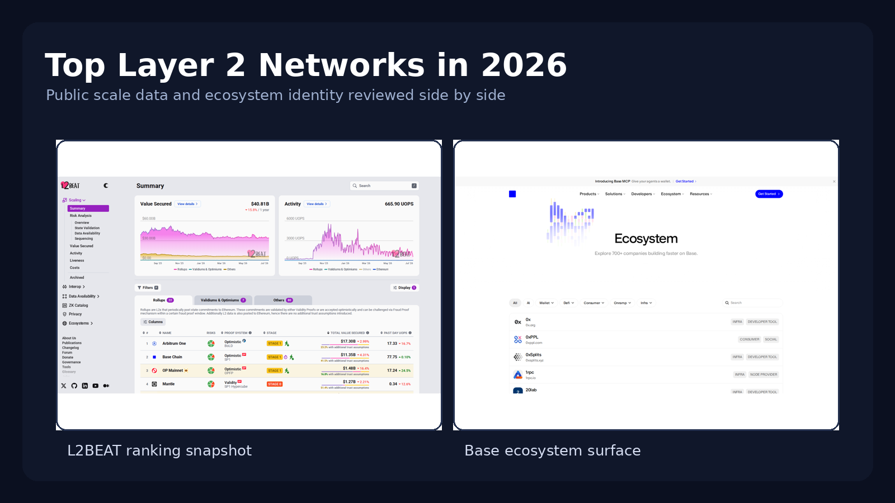
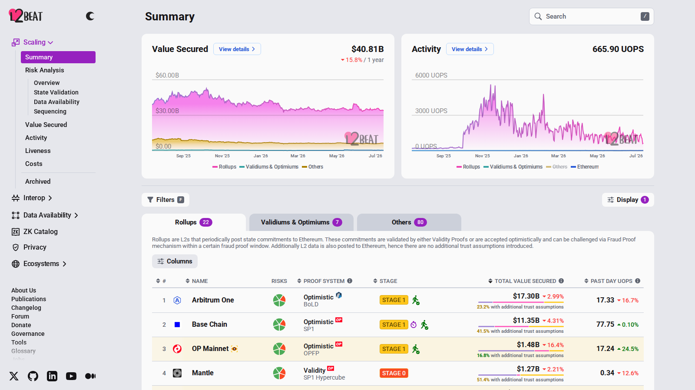
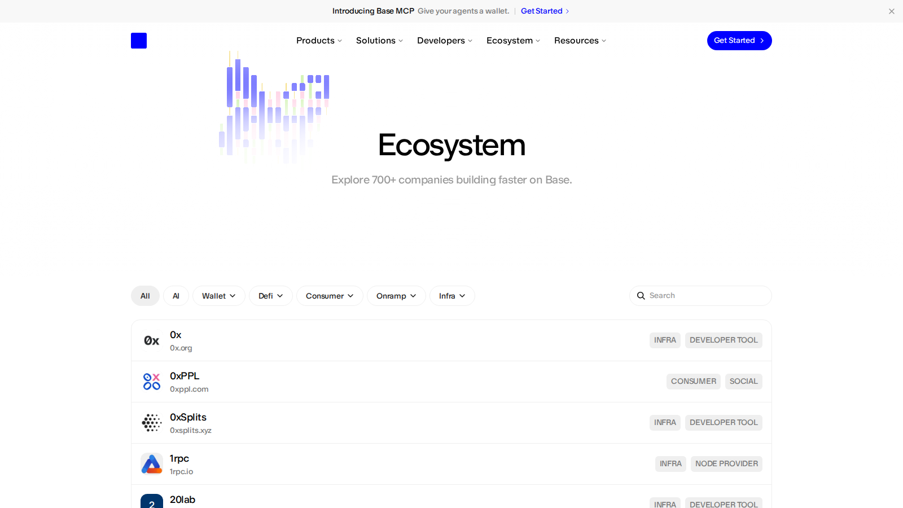

# Top Layer 2 Networks in 2026: 8 Projects Compared by TVS, Activity, and Product Identity

Last updated: 2026-07-10

Suggested category: /research/blockchain

Suggested slug: /research/blockchain/top-layer-2-networks-2026

Primary keyword: top layer 2 networks 2026

Meta description: Top layer 2 networks in 2026: compare eight Ethereum scaling networks by total value secured, ecosystem role, and what each one is actually best at.

If you are comparing Layer 2 networks in 2026, the real problem is not just reading a TVS leaderboard. The real problem is understanding which networks have become real homes for users, apps, and developer identity.

That is why this guide combines public scaling data with product role and ecosystem posture. The important thing is not which chain wins one metric. The important thing is whether the network has become the default place for a real slice of demand. Readers who want the Bitcoin side of the same scaling debate should also continue into [best Bitcoin Layer 2 projects in 2026](/research/blockchain/best-bitcoin-layer-2-projects-2026).

> Why you can trust this guide
>
> This guide is based on live public network surfaces and official references reviewed on July 10, 2026. We directly checked public scaling data, ecosystem framing, and how each chain presents its role in the Ethereum stack. Anything that depends on a live bridge test, logged-in wallet flow, or a full onchain usage check still needs final verification before publication.

## The top Layer 2 networks in 2026 are Arbitrum, Base, OP Mainnet, zkSync, Starknet, Linea, Scroll, and Mantle

The top Layer 2 networks to compare in 2026 are Arbitrum, Base, OP Mainnet, zkSync, Starknet, Linea, Scroll, and Mantle. L2BEAT’s data remains the strongest public starting point for understanding category scale, but the ranking conversation makes more sense when paired with product identity and ecosystem role.

That is why this article treats Layer 2 as a market-structure category rather than a simple leaderboard.

## How we ranked Layer 2 networks for this list

This list uses six filters:

- total value secured and broad category scale
- ecosystem relevance and developer gravity
- product identity beyond generic scaling
- category specialization, if any
- durability of user attention
- whether the network still looks important if incentives cool down

This is a research ranking, not a price prediction page.

## What we checked ourselves before ranking these networks

To build this list, we reviewed L2BEAT category data, official network pages, ecosystem hubs, and current positioning language for all eight networks on July 10, 2026. Based on what we could verify directly, the biggest difference was not only scale. It was product identity and how clearly each chain signals its role in the Ethereum stack.

That public review does not replace a live bridge or app-level test on every network. But it does show something important very quickly: which chains already feel like default homes for a user segment, which ones are leaning on distribution, and which ones are still asking the reader to buy into a broader architectural thesis. What stood out immediately was which chains already feel like default homes for a user segment and which still rely more on generic scaling language.

The screenshots below should make that difference easier to show. That visual difference is not cosmetic. It signals whether a network is winning through DeFi gravity, exchange distribution, infrastructure identity, or zero-knowledge positioning.

**Featured Image**
File: `../media/top-layer-2-networks-featured.png`
Alt text: `Comparison of Layer 2 network ranking data and Base ecosystem positioning in 2026`
Caption: `Layer 2 category scale and ecosystem identity reviewed side by side during our July 2026 comparison.`

*Layer 2 category scale and ecosystem identity reviewed side by side during our July 2026 comparison.*

**Screenshot 1**
File: `../media/l2beat-layer2-rankings.png`
Alt text: `L2BEAT rankings page showing value secured across major Ethereum Layer 2 networks`
Caption: `L2BEAT rankings page captured during our July 2026 review of Layer 2 scale and value secured.`

*L2BEAT rankings page captured during our July 2026 review of Layer 2 scale and value secured.*

**Screenshot 2**
File: `../media/base-ecosystem-page.png`
Alt text: `Base ecosystem page showing app categories and network positioning`
Caption: `Base ecosystem page reviewed as part of our comparison of Layer 2 product identity and user fit in 2026.`

*Base ecosystem page reviewed as part of our comparison of Layer 2 product identity and user fit in 2026.*

## The full list

### 1. Arbitrum

Arbitrum is a strong choice for readers who want the clearest DeFi-heavy reference point in the Layer 2 field. From the public surface we reviewed, it immediately felt more like a default ecosystem home than a chain still trying to define itself. That is a strength if you care about established app gravity and user familiarity, but it becomes a weakness if your priority is comparing newer distribution-led models.

Best for:
- readers mapping the most established DeFi-heavy L2 identity
- understanding default ecosystem gravity
- comparing network leadership beyond one metric

Readers who want chain-level ecosystem examples rather than network-level ranking should also branch into Coincu’s ecosystem pages such as [top Sui ecosystem projects in 2026](/research/blockchain/top-sui-ecosystem-projects-2026).

Tradeoffs:
- defending leadership gets harder as new channels expand
- established identity can be challenged by stronger distribution elsewhere
- category maturity means less novelty than newer entrants

### 2. Base

Base is a strong choice for readers who want to understand how exchange-linked distribution changed the Layer 2 market. From the public surface we reviewed, it immediately felt more like a distribution engine than a pure scaling narrative. That is a strength if you care about user funnel power and reach, but it becomes a weakness if your main concern is whether distribution alone settles every ecosystem-quality question.

Best for:
- readers comparing exchange-driven network growth
- understanding distribution as a Layer 2 advantage
- mapping how mainstream funnels affect chain relevance

Tradeoffs:
- distribution does not automatically settle ecosystem-quality debate
- reach can outrun deeper identity for some readers
- some users will still weigh decentralization questions more heavily

### 3. OP Mainnet

OP Mainnet is a strong choice for readers who want to compare a network that matters both as a live chain and as a broader infrastructure thesis. From the public surface we reviewed, it immediately felt more like architecture and ecosystem strategy than a simple transaction venue. That is a strength if you care about superchain-style expansion and developer relevance, but it becomes a weakness if your priority is the clearest consumer-facing chain identity.

Best for:
- readers comparing infrastructure-led Layer 2 theses
- understanding superchain-style expansion
- mapping developer-oriented network relevance

Tradeoffs:
- architectural breadth can be less intuitive than a single clear user story
- developer relevance does not always look like mainstream identity
- consumer-facing legibility may feel weaker than at distribution-led networks

### 4. zkSync

zkSync is a strong choice for readers who want one of the most visible zero-knowledge scaling brands in the category. From the public surface we reviewed, it immediately felt more like a finance-oriented ZK brand than a generic L2 placeholder. That is a strength if you care about how ZK identity is evolving, but it becomes a weakness if your main filter is already-proven ecosystem dominance.

Best for:
- readers comparing visible ZK scaling brands
- understanding finance-oriented network positioning
- mapping how zero-knowledge brands differentiate themselves

Tradeoffs:
- visibility does not automatically equal top ecosystem gravity
- ZK identity can still feel more thesis-driven than habit-driven
- category leadership is broader than one technical posture

### 5. Starknet

Starknet is a strong choice for readers who want to compare one of the more ambitious high-end ZK execution theses in the market. From the public surface we reviewed, it immediately felt more like a frontier execution platform than a generic scaling layer. That is a strength if you care about technical ambition and long-horizon positioning, but it becomes a weakness if your priority is immediate legibility to mainstream users.

Best for:
- readers comparing frontier ZK execution theses
- understanding higher-ambition scaling posture
- mapping networks that push beyond a narrow single-chain story

Tradeoffs:
- ambition can be harder to translate into simple user fit
- technical posture may outrun mainstream clarity
- frontier positioning carries more interpretation risk

### 6. Linea

Linea is a strong choice for readers who want a more recognizable Ethereum-aligned network with a clear thesis around strengthening the broader ETH economy. From the public surface we reviewed, it immediately felt more like an ecosystem-support chain than a narrative outlier. That is a strength if you care about ETH-aligned continuity, but it becomes a weakness if your priority is louder category differentiation.

Best for:
- readers comparing Ethereum-aligned network identity
- understanding ecosystem-support positioning
- mapping recognizable but less theatrical L2 brands

Tradeoffs:
- category differentiation can feel softer than at louder rivals
- support-role identity may be less dramatic for comparison readers
- visibility may depend more on ecosystem fit than on standout narrative

### 7. Scroll

Scroll is a strong choice for readers who want a credible zkEVM comparison point that stays close to Ethereum compatibility logic. From the public surface we reviewed, it immediately felt more like a compatibility-focused scaling brand than a broader distribution thesis. That is a strength if you care about staying close to familiar Ethereum logic, but it becomes a weakness if your priority is maximum narrative reach.

Best for:
- readers comparing zkEVM-style compatibility plays
- understanding scaling brands that stay close to Ethereum logic
- mapping technical fit over loud distribution narratives

Tradeoffs:
- compatibility focus can feel quieter than bigger consumer stories
- narrative reach may be weaker than at the loudest brands
- some readers will prefer stronger ecosystem identity over clean compatibility

### 8. Mantle

Mantle is a strong choice for readers who want to compare the liquidity- and treasury-flavored side of the Layer 2 field rather than only app-driven networks. From the public surface we reviewed, it immediately felt more like a capital-structure and liquidity story than a pure consumer ecosystem play. That is a strength if you care about another kind of network identity, but it becomes a weakness if your main filter is the loudest app-layer gravity.

Best for:
- readers comparing liquidity- and treasury-oriented network identity
- understanding alternative L2 positioning beyond app-first chains
- mapping how capital structure influences chain relevance

Tradeoffs:
- the identity is less consumer-obvious than app-driven rivals
- treasury flavor is more structural than mainstream
- category mindshare may still cluster around louder ecosystems

## How to choose between these Layer 2 networks

Choose Arbitrum if your priority is the clearest DeFi-heavy default ecosystem in the field.

Choose Base if your priority is exchange-linked distribution and user-funnel power.

Choose OP Mainnet if your priority is infrastructure thesis and superchain-style expansion.

Choose zkSync or Starknet if your priority is comparing visible zero-knowledge scaling brands with different levels of ambition.

Choose Linea or Scroll if your priority is Ethereum-aligned continuity and compatibility-focused scaling.

Choose Mantle if your priority is a more liquidity- and treasury-oriented network identity.

## Key data and structural signals to track through H2 2026

If you want to keep this page useful, track:

- L2BEAT total value secured changes
- whether user activity keeps concentrating in a few leaders
- whether app-specific distribution matters more than general-purpose scaling claims
- whether ZK and optimistic designs keep converging in user experience
- whether liquidity sticks after incentive regimes change

These signals explain more than one-time ranking snapshots.

## What this tells us about crypto in 2026

Layer 2 is no longer a side debate about lower fees. It is now one of the main ways market structure is being rebuilt around Ethereum. The strongest networks have moved beyond generic scaling claims and developed real identities around DeFi, distribution, infrastructure, or zero-knowledge execution.

That means the next phase of the L2 race is less about existing and more about being necessary. It also means this page should internally support [best perpetual DEXs in 2026](/analysis/derivatives/best-perpetual-dexs-2026), because venues and networks are no longer cleanly separable.

## FAQ

### What is the best source for comparing Layer 2 scale?

L2BEAT remains one of the best public starting points because it tracks total value secured and keeps the category legible.

### Is the largest Layer 2 automatically the best one?

No. Scale matters, but ecosystem role, developer gravity, product identity, and user stickiness matter too.

### Why include Mantle over every newer L2?

Because the goal is not to reward novelty. It is to compare the networks that still matter structurally.

## Source notes

- L2BEAT scaling data, checked 2026-07-10
- Base official site, checked 2026-07-10
- Optimism official site, checked 2026-07-10
- zkSync official site, checked 2026-07-10
- Starknet official site, checked 2026-07-10
- Linea official site, checked 2026-07-10
- Scroll official site, checked 2026-07-10
- Mantle official site, checked 2026-07-10

## Internal link suggestions

- Link from /research/blockchain with the anchor top Layer 2 networks
- Link from Arbitrum, Starknet, and Optimism ecosystem pages
- Link to the Bitcoin Layer 2 and perpetual DEX comparison pages
