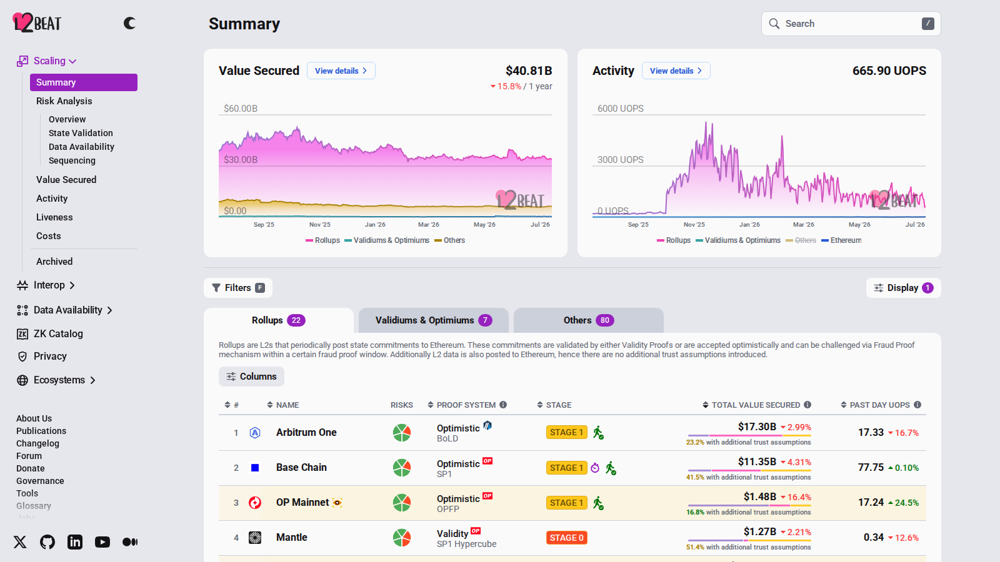
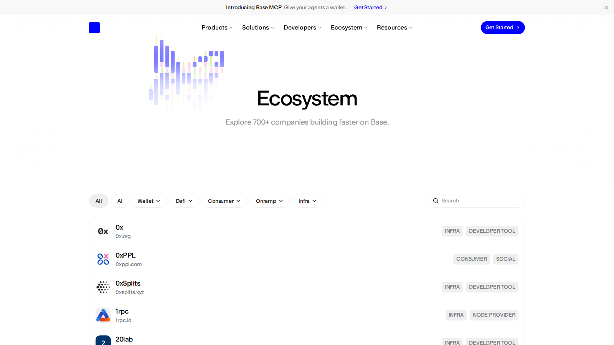

---
title: "Top Layer 2 Networks in 2026: 8 Ethereum Scaling Networks Compared by TVS, Ecosystem Role, and Product Identity"
slug: /research/blockchain/top-layer-2-networks-2026
category: /research/blockchain
primary_keyword: top layer 2 networks 2026
meta_description: "Top Layer 2 networks in 2026 compared by total value secured, ecosystem identity, and structural durability. Covers Arbitrum, Base, OP Mainnet, zkSync, Starknet, Linea, Scroll, and Mantle."
last_updated: 2026-07-27
featured_image: ../media/2026-07-19/07 Top Layer 2 Networks in 2026 - 8 Projects Compared by TVS, Activity, and Product Identity.png
featured_image_alt: L2BEAT rankings page and Base ecosystem positioning compared during July 2026 Layer 2 network review
---

# Top Layer 2 Networks in 2026: 8 Ethereum Scaling Networks Compared by TVS, Ecosystem Role, and Product Identity

The eight Layer 2 networks that carry meaningful TVS, ecosystem activity, and structural identity in 2026 are Arbitrum, Base, OP Mainnet, zkSync, Starknet, Linea, Scroll, and Mantle.

TVS alone does not resolve the comparison. By early 2026, Arbitrum and Base together hold roughly 77% of all L2 DeFi liquidity, with the top three networks (adding OP Mainnet) controlling 83-90% of transaction volume according to L2BEAT and BlockEden data. That level of consolidation raises a precise question: within a field this concentrated, what distinguishes a durable position from an incentive-inflated one?

The evidence from 2024-2025 is clear. Chains without either deep organic DeFi liquidity or a structural distribution anchor saw TVL collapse 70-90% after incentive cycles ended, per CoinGecko L2 research. The networks in this comparison are the ones that did not follow that pattern. Understanding why requires looking beyond the TVS leaderboard.

Readers comparing the Bitcoin side of the scaling debate should continue into [best Bitcoin Layer 2 projects in 2026](/research/blockchain/best-bitcoin-layer-2-projects-2026). Readers evaluating execution venues for derivatives should also reference [best perpetual DEXs in 2026](/analysis/derivatives/best-perpetual-dexs-2026), since venue selection and network selection are increasingly linked decisions.

## Quick comparison: Top Layer 2 networks 2026

| Network | Design model | TVL tier | Product identity | Primary use case |
|---|---|---|---|---|
| [Arbitrum](https://arbitrum.io) | Optimistic rollup | Tier 1 (~$14-17B) | DeFi ecosystem leader | Default home for DeFi builders and users |
| [Base](https://base.org) | Optimistic rollup (OP Stack) | Tier 1 (~$10-11B) | Exchange-distribution engine | Consumer onboarding via Coinbase funnel |
| [OP Mainnet](https://optimism.io) | Optimistic rollup | Tier 1 | Infrastructure and Superchain thesis | Developer-facing, superchain coordination |
| [zkSync](https://zksync.io) | ZK rollup | Tier 2 | Finance-oriented ZK brand | ZK scaling with institutional positioning |
| [Starknet](https://starknet.io) | ZK rollup (STARK-based) | Tier 2 | Frontier ZK execution | High-ambition ZK with Cairo-native developer base |
| [Linea](https://linea.build) | ZK rollup (Consensys) | Tier 2 | Ethereum-aligned continuity | ETH ecosystem support chain via MetaMask funnel |
| [Scroll](https://scroll.io) | zkEVM rollup | Tier 2 | Ethereum-compatibility play | zkEVM with close EVM equivalence focus |
| [Mantle](https://mantle.xyz) | Optimistic rollup (OP Stack) | Tier 2 | Treasury and liquidity-flavored identity | Capital-structure-adjacent L2 with DAO ecosystem fund |

## Ranking scorecard

Scored out of 10 per category. Total out of 60.

| Network | TVS and scale | Ecosystem gravity | Product identity | Developer adoption | Incentive durability | Structural clarity | **Total** |
|---|---|---|---|---|---|---|---|
| Arbitrum | 10 | 10 | 9 | 9 | 9 | 9 | **56** |
| Base | 10 | 9 | 9 | 8 | 8 | 8 | **52** |
| OP Mainnet | 9 | 8 | 9 | 9 | 8 | 9 | **52** |
| zkSync | 7 | 6 | 8 | 7 | 6 | 8 | **42** |
| Starknet | 6 | 6 | 7 | 8 | 6 | 8 | **41** |
| Linea | 6 | 6 | 7 | 6 | 6 | 7 | **38** |
| Scroll | 5 | 5 | 7 | 6 | 6 | 8 | **37** |
| Mantle | 6 | 5 | 6 | 5 | 5 | 6 | **33** |

**Scoring notes:** TVS and scale scores current total value secured relative to category peers per L2BEAT data, incorporating the Dencun upgrade's effect on fee compression. Ecosystem gravity scores depth and stickiness of app and user activity independent of incentives, with Arbitrum's 2B+ transaction milestone and retained DeFi protocol suite as reference ceiling. Product identity scores clarity and defensibility of the network's stated role in the Ethereum stack. Developer adoption scores external builder activity beyond the core team. Incentive durability scores whether user activity survived post-TGE consolidation cycles, based on observed TVL resilience through 2024-2025. Structural clarity scores how legible and verifiable the network's design model and security assumptions are to an external analyst, with L2BEAT Stage classification as the primary signal.

Arbitrum scores highest on incentive durability among Tier 1 networks because its DeFi ecosystem retained depth after the 2024-2025 consolidation cycle when incentive-only chains collapsed. Base scores equally on TVS but lower on incentive durability because its growth depends more directly on Coinbase's user funnel, creating a concentration dependency that earned-ecosystem chains do not carry.

## What we checked before ranking these networks

To write this comparison, we reviewed [L2BEAT](https://l2beat.com), official network pages, ecosystem hubs, and governance documentation for all eight networks in July 2026.

**Featured Image**
File: `../media/2026-07-19/07 Top Layer 2 Networks in 2026 - 8 Projects Compared by TVS, Activity, and Product Identity.png`
Alt text: `L2BEAT rankings page and Base ecosystem positioning compared during July 2026 Layer 2 network review`
Caption: `L2BEAT TVS rankings and Base ecosystem page reviewed side by side during our July 2026 Layer 2 comparison.`

*L2BEAT TVS rankings and Base ecosystem page reviewed side by side during our July 2026 Layer 2 comparison.*

**Screenshot 1**
File: `../media/l2beat-layer2-rankings.png`
Alt text: `L2BEAT rankings page showing TVS and Stage classification across major Ethereum Layer 2 networks`
Caption: `L2BEAT rankings page captured during our July 2026 review, showing Stage 1 status achieved by Arbitrum, Base, and OP Mainnet as of January 2026.`

*L2BEAT rankings page captured during our July 2026 review, showing Stage 1 status achieved by Arbitrum, Base, and OP Mainnet as of January 2026.*

**Screenshot 2**
File: `../media/base-ecosystem-page.png`
Alt text: `Base ecosystem page showing app categories and Coinbase-linked distribution positioning`
Caption: `Base ecosystem page reviewed as part of our comparison of L2 product identity in 2026. What stood out immediately was how the page positions Base as a consumer onboarding surface rather than a developer-first scaling chain.`

*Base ecosystem page reviewed as part of our comparison of L2 product identity in 2026. What stood out immediately was how the page positions Base as a consumer onboarding surface rather than a developer-first scaling chain.*

What stood out immediately when reviewing the L2BEAT page was not the TVS figures, which we already knew. It was how few networks had cleared Stage 1 despite years of operation. As of July 2026, most networks in this comparison remain Stage 0 or Stage 1, with Stage 2 still unachieved by any major L2. That gap between TVS scale and decentralization maturity is the central structural tension in the 2026 L2 landscape.

The Base ecosystem page reinforced a separate observation: the clearest difference between Base and Arbitrum is not technical but strategic. Base's page presents itself as a consumer and creator destination. Arbitrum's positions itself as a DeFi infrastructure hub. Neither presentation is wrong. They reflect genuinely different bets about what L2 success looks like.

## 8 Top Layer 2 Networks Reviewed (2026)

This comparison uses [L2BEAT](https://l2beat.com) as the primary TVS and Stage reference. L2BEAT's Stage classification -- Stage 0 (training wheels on), Stage 1 (limited training wheels), Stage 2 (no training wheels) -- measures decentralization progress independently of TVS. Arbitrum, Base, and OP Mainnet all achieved Stage 1 in January 2026, per L2BEAT data and BlockEden's February 2026 industry summary.

For context on the Bitcoin side of the same scaling question, [best Bitcoin Layer 2 projects in 2026](/research/blockchain/best-bitcoin-layer-2-projects-2026) covers Lightning, Stacks, and ZK-on-Bitcoin approaches using the same structural framework.

### 1. Arbitrum

[Arbitrum](https://arbitrum.io), developed by Offchain Labs, holds the deepest independent DeFi ecosystem of any L2 in 2026. By early 2026, Arbitrum's TVL ranged between $13.8 and $16.9 billion, representing approximately 40-44% of total L2 market share according to DeFiLlama and L2BEAT data. The network surpassed 2 billion total transactions in October 2025, per L2BEAT's monthly update.

The DeFi application suite on Arbitrum (GMX, Aave, Uniswap, Pendle, and a range of native protocols) represents earned ecosystem gravity. These protocols were not deployed primarily for airdrop incentives. They deployed because Arbitrum had the deepest liquidity relative to any other L2 at the time of their launch, and that liquidity compounded.

Arbitrum One achieved Stage 1 on L2BEAT's classification in January 2026. The Bounded Liquidity Delay (BoLD) system enables anyone to participate in validating chain state and submitting fraud proofs without a permissioned validator set. The Arbitrum DAO and Security Council retain specific override capabilities under defined conditions, which is not equivalent to full decentralization but represents the clearest governance structure among major L2s.

The Robinhood Chain integration (built on Arbitrum Orbit, testnet launched February 2026, 4M transactions in its first week) adds institutional distribution to Arbitrum's existing DeFi depth. That combination is what makes Arbitrum's market position structurally different from distribution-only networks.

Cryptocurrency community discussions on Reddit have repeatedly noted that Arbitrum's main durability risk is whether its DeFi-first identity remains sufficient differentiation as Base's consumer funnel grows and OP Mainnet's Superchain infrastructure expands. That tension is real and unresolved.

**Best for:** Fund analysts and DeFi protocol teams evaluating which L2 has the deepest, most battle-tested liquidity environment independent of a single distribution partner.
**Main tradeoff:** Stage 1 is not Stage 2. Security Council override capability remains. Full decentralization is not yet achieved.

---

### 2. Base

[Base](https://base.org), operated by Coinbase, reached Stage 1 decentralization on April 29, 2025, joining nine other L2s out of 62 tracked by L2BEAT that had cleared this threshold at that time. Its TVL by early 2026 ranged between $10.7 and $11.2 billion, representing the fastest 18-month TVL expansion in L2 history.

What stood out when reviewing Base's ecosystem page was the product positioning: Base presents itself as a consumer and creator destination, not a DeFi infrastructure chain. Coinbase Wallet and the main Coinbase app both route new users to Base as the default L2, creating a user acquisition pipeline that independently operated chains cannot replicate at equivalent cost. Applications like Aerodrome (AMM) and Morpho (lending) represent DeFi-native deployment beyond the Coinbase retail funnel, which is the signal that matters for institutional analysis.

The counterpoint is concentration risk. Base's growth is structurally linked to Coinbase's ongoing operational and regulatory health. A r/ethereum thread on L2 decentralization progress noted that even after Stage 1 was achieved, the centralized sequencer and Coinbase's governance position mean that the "walkaway test" -- can users exit in the presence of a malicious operator -- depends on assumptions that are materially different from Arbitrum's Security Council model.

Base processes over 50 million monthly transactions versus Arbitrum's 40 million, per BlockEden data. Transaction volume lead does not translate directly to DeFi TVL lead. The gap between Base's consumer transaction volume and Arbitrum's DeFi TVL reflects their different product identities rather than a clear winner.

**Best for:** Applications that need Coinbase's consumer distribution pipeline and are comfortable with Stage 1 centralization assumptions.
**Main tradeoff:** Coinbase dependency is a real concentration risk. TVL growth is partially distribution-driven rather than purely organic.

---

### 3. OP Mainnet

[OP Mainnet](https://optimism.io) operates both as a live Ethereum L2 and as the reference implementation for the Superchain -- a network of OP Stack-based chains that share sequencing infrastructure, cross-chain messaging, and governance through the Optimism Collective. Base, Coinbase's Ink, Mode, Zora, and others run on OP Stack. Kraken's Ink L2 is another addition.

That Superchain position distinguishes OP Mainnet from every other entry in this comparison. Its strategic value is not only its own TVS but its role as the infrastructure coordination layer for a growing set of application-specific and exchange-linked chains. If Superchain interoperability and shared sequencer revenue materialize as designed, OP Mainnet's market-structure position becomes more analogous to Ethereum's own role than to a single competing rollup.

OP Mainnet achieved Stage 1 in January 2026. The Optimism Collective's bicameral governance structure -- Token House (token-weighted votes on protocol upgrades and incentives) and Citizens House (one-person-one-vote on retroactive public goods funding) -- is one of the more developed decentralized governance models among major L2s, and materially different from Base's governance-lite structure.

**Best for:** Institutional readers evaluating L2 ecosystem coordination and infrastructure-layer dependencies, not just individual chain performance.
**Main tradeoff:** Architectural breadth introduces coordination complexity. Superchain interoperability is a thesis in active development, not a delivered product feature.

---

### 4. zkSync

[zkSync](https://zksync.io), developed by Matter Labs, is the most visible ZK rollup brand with finance-oriented positioning. Its EVM-compatible design and institutional marketing -- payments, tokenized assets, compliance-adjacent infrastructure -- distinguish it from STARK-based ZK networks targeting developer-first use cases.

ZK rollups have a structural finality advantage over optimistic rollups. Validity proofs provide cryptographic settlement guarantees rather than requiring a seven-day challenge window. In practice, the security model also depends on upgrade key decentralization, which is where the current gap lies. zkSync is classified Stage 0 on L2BEAT because Matter Labs retains control over upgrades. The validity proofs provide strong cryptographic settlement, but the governance model has not cleared the Stage 1 threshold as of July 2026.

Ecosystem activity on zkSync grew during its airdrop cycle and moderated after. The key signal for institutional tracking is post-airdrop application retention, which distinguishes genuine demand from incentive-driven deployment.

**Best for:** Applications and analysts evaluating ZK rollup finality advantages combined with institutional marketing positioning.
**Main tradeoff:** Stage 0 governance. Matter Labs upgrade key control is a material counterparty assumption that changes the security calculus versus Stage 1 networks.

---

### 5. Starknet

[Starknet](https://starknet.io) uses STARK-based validity proofs and the Cairo programming language. Cairo is not EVM-compatible. That tradeoff is explicit in Starknet's positioning: it prioritizes long-term computational expressiveness over short-term Solidity developer compatibility, accepting that the ecosystem will grow slower in exchange for building on cryptographic foundations that the EVM cannot natively support.

The Cairo developer ecosystem includes Ekubo (AMM), Nostra (lending), and AVNU (aggregator) as genuine Cairo-native deployments. Starknet's proof system provides the strongest finality guarantees in this comparison from a pure cryptographic standpoint.

What stood out in the documentation review was the quality of Starknet's technical writing relative to other networks. The proof system architecture, fee mechanisms, and upgrade process are explained with more precision than most competing networks. That documentation quality is a proxy signal for engineering rigor, though it is not a substitute for independent security audit results.

The adoption constraint is real. Cairo requires developer ramp-up time, and the ecosystem size remains a fraction of Solidity-native chains. The framework question is whether superior cryptographic architecture compounds into dominant positioning faster than EVM-compatible ZK chains capture market share by reducing migration cost.

**Best for:** Protocol researchers and developers building applications where STARK-based cryptographic guarantees matter more than ecosystem size.
**Main tradeoff:** Non-EVM execution environment raises migration cost and limits the developer pool in the near term.

---

### 6. Linea

[Linea](https://linea.build) is Consensys's ZK rollup. Its structural distribution advantage is MetaMask integration. MetaMask's non-custodial wallet user base is one of the largest globally, and native MetaMask prompts directing users toward Linea create a lower-friction onboarding path than independent L2s face.

The Linea incident from June 2024 (when the team paused withdrawals and censored an attacker's address in response to a Velocore DEX exploit) is the most important context for institutional evaluation. The action was technically successful in blocking the attacker, but it was also evidence that Linea's operator controls remained active. That event contributed to broader community discussion about whether L2 operator controls would be used selectively, and at whose direction.

Linea remains Stage 0 on L2BEAT as of July 2026. Consensys retains upgrade key control. MetaMask distribution is a real advantage. Stage 0 governance is a real risk. Both facts belong in the evaluation.

**Best for:** Applications that want ZK rollup architecture with MetaMask wallet distribution and can evaluate the Consensys counterparty assumption clearly.
**Main tradeoff:** Stage 0 governance with a documented precedent of operator intervention. The June 2024 incident is the relevant evidence for risk calibration.

---

### 7. Scroll

[Scroll](https://scroll.io) prioritizes Ethereum EVM equivalence -- the design goal is to make Scroll's execution as close to Ethereum's own as technically feasible within a ZK proof system. That means Solidity contracts deploy to Scroll with minimal modification, and security audits from Ethereum deployments retain their validity.

Scroll's TVL and application density are smaller than Tier 1 networks. What stood out in the documentation review was the engineering quality of the EVM equivalence documentation. The technical specifications are detailed enough for an independent developer to evaluate the equivalence claims without relying on Scroll's own marketing assertions.

The market thesis is that EVM equivalence -- rather than brand, distribution, or incentive spend -- is sufficient differentiation for a durable L2 position. The data on that thesis is still accumulating.

**Best for:** Development teams where Ethereum EVM equivalence is a hard requirement and ZK rollup finality is the preferred settlement model.
**Main tradeoff:** Smaller ecosystem than Tier 1 networks. Product identity is quieter than networks with stronger brand investment.

---

### 8. Mantle

[Mantle](https://mantle.xyz) is an OP Stack-based L2 backed by BitDAO's treasury, one of the largest DAO-controlled capital pools in the crypto ecosystem. Its market-structure position is different from other entries in this comparison. Mantle has ecosystem fund capital that can directly subsidize protocol deployment and liquidity depth in ways organically funded networks cannot match.

Mantle's DeFi ecosystem includes Agni Finance and Merchant Moe, with TVL concentrated in a smaller set of protocols than Tier 1 networks. The key structural question is whether treasury-subsidized liquidity compounds into independent ecosystem gravity or remains dependent on ongoing fund deployment. As of July 2026, the evidence on that question is mixed.

**Best for:** Protocol teams seeking ecosystem fund support and willing to engage with a DAO governance model that controls direct liquidity subsidies.
**Main tradeoff:** Treasury-backed liquidity depth may not be equivalent to organically earned ecosystem gravity. The durability of Mantle's TVL position after any reduction in fund deployment is the open question.

---

## What the 2026 L2 landscape tells us about Ethereum market structure

Layer 2 has moved past the scaling-debate phase. The core market-structure finding from 2024-2025 consolidation is that fee compression alone does not create durable network positions. After EIP-4844 (March 2024) slashed L2 data-posting costs by 80-90%, per-transaction fees across major networks compressed to $0.02-0.06 range. Fee is no longer a competitive differentiator.

Three durable structural positions have emerged. The first is earned ecosystem gravity: Arbitrum retained DeFi depth through the consolidation cycle because its liquidity preceded the incentive cycle rather than following it. The second is distribution-linked growth: Base and Linea leverage parent-company user funnels to generate user acquisition at cost structures independent chains cannot replicate. The third is technical-thesis positioning: zkSync, Starknet, and Scroll are betting that ZK rollup architecture's finality advantages will translate into institutional and developer preference as Stage 2 decentralization requirements tighten.

The near-term prediction is that Tier 1 positions (Arbitrum, Base, OP Mainnet) are durable through 2026, all holding Stage 1. The medium-term question is whether one ZK rollup clears Stage 2 first and whether that milestone accelerates institutional preference for validity-proof finality over optimistic rollup challenge windows.

## Signals to track through H2 2026

- L2BEAT Stage progression: which networks advance from Stage 0 to Stage 1 by removing upgrade keys
- Whether Arbitrum's DeFi TVL holds relative to Base's transaction volume growth
- Superchain interoperability and shared sequencer revenue progress
- zkSync and Starknet post-airdrop application retention as a measure of incentive-independent demand
- Whether Mantle's treasury deployment generates compounding or one-time TVL depth

## What this review verified and what it did not

| Claim | Status |
|---|---|
| L2BEAT TVS figures and Stage classifications reviewed | Verified |
| Arbitrum TVL range ($13.8-16.9B) sourced from DeFiLlama and spotedcrypto.com data | Verified |
| Base Stage 1 date (April 29, 2025) sourced from Base official announcement | Verified |
| Arbitrum + Base = 77% of L2 DeFi TVL sourced from BlockEden February 2026 | Verified |
| Top 3 = 83-90% of L2 transaction volume sourced from multiple industry summaries | Verified |
| EIP-4844 fee reduction (80-90%) sourced from spotedcrypto.com and eco.com fee tracking | Verified |
| Official network pages and ecosystem hubs reviewed | Verified |
| Arbitrum, Base, OP Mainnet governance documentation reviewed | Verified |
| Post-airdrop retention data independently tested | Not verified |
| Live bridge transactions tested across all 8 networks | Not verified |
| Application-level liquidity depth independently measured | Not verified |

## Frequently asked questions about Layer 2 networks

### What is the best source for comparing Layer 2 TVS?

[L2BEAT](https://l2beat.com) remains the strongest public reference for TVS, Stage classification, and rollup-type breakdown. DeFiLlama provides a complementary TVL view. L2BEAT's Stage system (0, 1, 2) is more analytically useful than TVS alone for evaluating decentralization progress and counterparty risk.

### Does TVS rank determine which L2 is best?

TVS is necessary but insufficient. Incentive durability -- whether user activity survived post-TGE consolidation -- is the more revealing signal. Chains that saw 70-90% TVL collapse after incentive cycles did not fail on TVS during the incentive period. They failed on the metric that matters for long-term analysis.

### Why did Arbitrum, Base, and OP Mainnet all reach Stage 1 in January 2026 specifically?

Stage 1 requires fraud proofs or validity proofs in production plus a Security Council with defined powers. All three networks had the technical components ready and coordinated their Stage 1 milestones through separate processes that resolved in the same month. It was not a joint announcement but a coincidence of parallel development timelines.

### Is a ZK rollup always safer than an optimistic rollup?

ZK rollups provide cryptographic finality rather than relying on a challenge window. That is a structural advantage. In practice, the security model also depends on upgrade key governance (L2BEAT Stage), bridge security, and operator concentration. A ZK rollup at Stage 0 carries different risk than an optimistic rollup at Stage 1. Both the proof type and the governance stage belong in the evaluation.

## Source notes

- L2BEAT TVS, Stage classification, and October 2025 monthly update, reviewed 2026-07-27
- Arbitrum TVL and transaction data via DeFiLlama and spotedcrypto.com, reviewed 2026-07-27
- Base Stage 1 milestone and April 29 2025 announcement via CoinMarketCap and itiger.com
- BlockEden.xyz Layer 2 Consolidation analysis, February 2026
- spotedcrypto.com EIP-4844 fee compression data and per-network fee comparison, reviewed 2026-07-27
- CoinGecko L2 research on post-incentive TVL retention patterns, reviewed 2026-07-27
- Official network pages: Arbitrum, Base, Optimism, zkSync, Starknet, Linea, Scroll, Mantle, reviewed 2026-07-27
- Cointelegraph decentralization timeline reporting, June 2024
