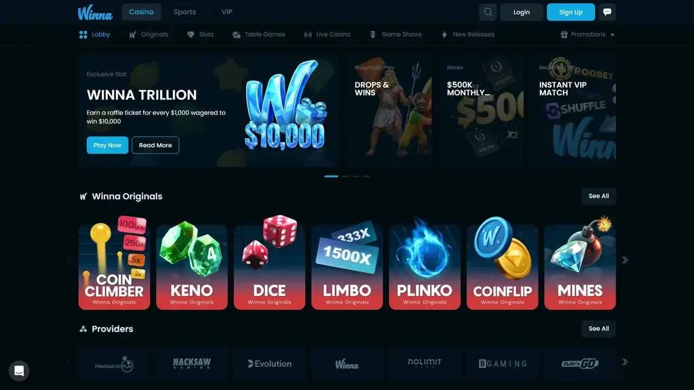
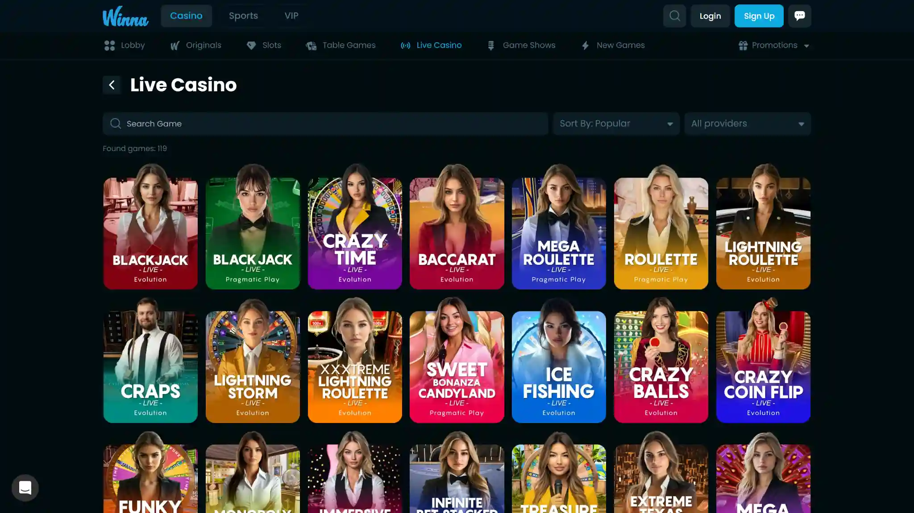
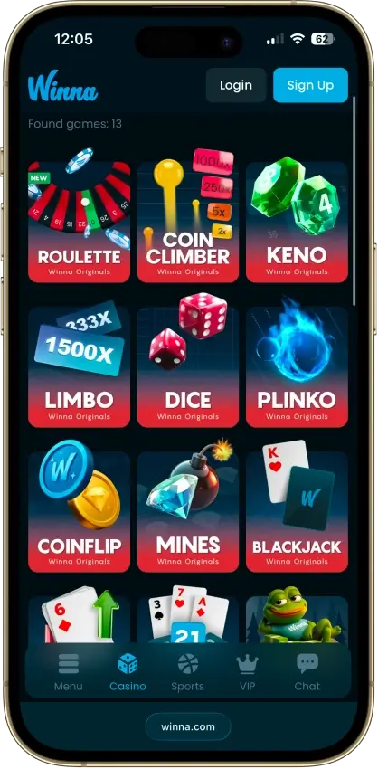
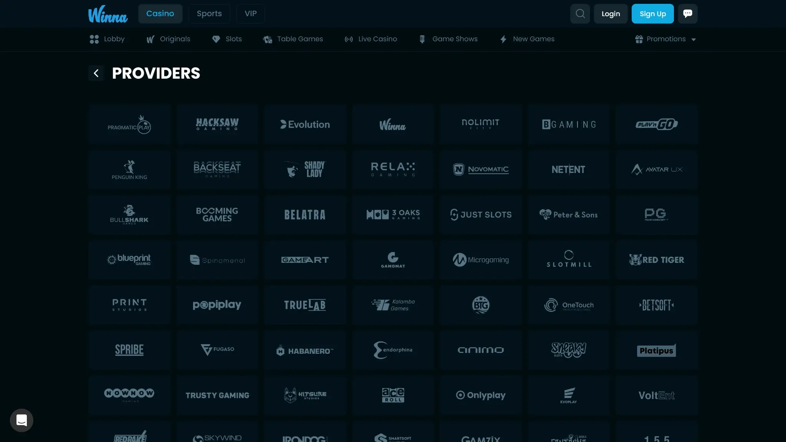
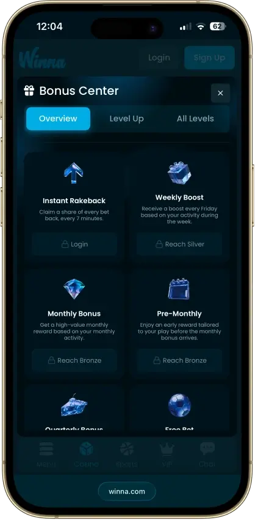
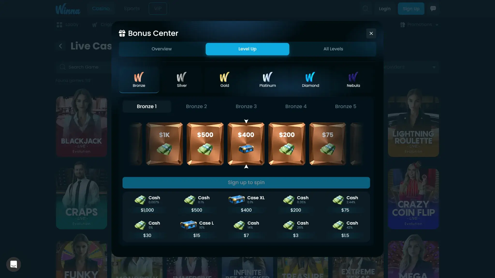
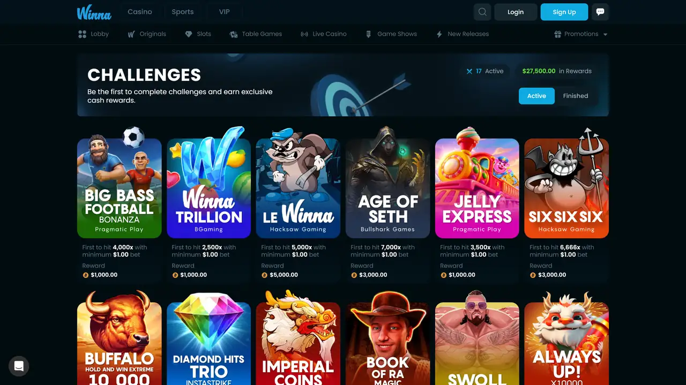
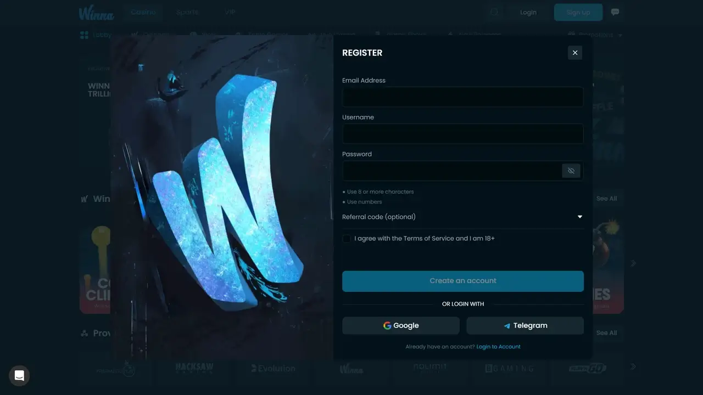

# Winna Casino Review 2026: Rakeback Every 7 Minutes, $1 Deposit, No KYC Required

Last updated: 2026-09-21

Suggested category: /reviews/crypto-casinos

Suggested slug: /reviews/crypto-casinos/winna-casino-review

Primary keyword: winna casino review

Meta description: Winna Casino review 2026: $1 minimum deposit, instant rakeback every 7 minutes, 6,000+ games, no-KYC signup. Editorial score 7.8/10. Full breakdown of bonuses, payments, VIP, and trust.

## Winna earns a 7.8 out of 10 in our 2026 crypto casino review

Winna is a 2024-launched crypto casino operated by GG Gaming LLC under a Tobique Gaming Commission licence. Its defining mechanic is rakeback credited every seven minutes, continuous compounding that replaces the standard once-a-day or weekly winback model. A $1 minimum deposit and no-KYC signup keep the entry barrier lower than most licensed crypto casinos. The library runs to 6,000-plus games from 61 providers including 14 provably-fair Originals.

| Dimension | Score | Summary |
|---|---|---|
| Security & Licensing | 8.5 / 10 | TGC licence; RNG-certified providers; on-site provably-fair verification |
| Game Library | 8.9 / 10 | 6,000+ titles, 61 studios, 5,209 slots, provably-fair Originals |
| Bonuses & Promotions | 8.4 / 10 | Rakeback every 7 min; up to 60% at top tier; 1x deposit turnover |
| UX & Interface | 8.1 / 10 | Clean lobby; mobile-ready; no RTP filter in game browser |
| **Overall** | **7.8 / 10** | Strong fundamentals; short track record; polarised Trustpilot picture |

**Trustpilot:** 3.2 / 5 (744 reviews as of September 2026) -- reviews cluster around fast payouts on one side and held-withdrawal disputes on the other.

---

## What this review covers and how it was produced

This review draws from the live Coincu editorial dataset for Winna, captured and last updated August 7, 2026. It covers the operator structure and licensing framework, the game catalogue and provider list, the bonus and VIP mechanics, payment rails and withdrawal behaviour, and the community reputation picture from Trustpilot and user forums.

What this review does not cover: end-to-end account verification or withdrawal tested under real-money conditions, smart contract audits for Winna Originals (the provably-fair mechanism is described as documented, not audited independently here), or jurisdiction-specific legality. Players must verify whether online gambling is lawful in their country before registering.

---

## Operator, licence, and corporate structure

Winna is operated by **GG Gaming LLC** and holds a licence from the **Tobique Gaming Commission (TGC)**, a First Nations gaming authority based in New Brunswick, Canada. TGC licences are accepted by most crypto payment processors and are used by operators seeking a regulated North American-adjacent licensing home as an alternative to Curaçao eGaming and Anjouan frameworks.

TGC licence obligations include ongoing RNG certification for the game catalogue, player-fund handling standards, and a formal complaint resolution process. Winna launched in 2024, which gives it a short operational track record by crypto-casino standards.

| Detail | Value |
|---|---|
| Operator | GG Gaming LLC |
| Founded | 2024 |
| Licence | Tobique Gaming Commission (TGC) |
| Website | winna.com |
| KYC at signup | Not required |
| KYC trigger | First, flagged, or large withdrawal |

The short operating history is the most significant structural caveat in this review. Winna has not been tested through a major traffic spike, a payout dispute at scale, or a regulatory review cycle. Players depositing above a few hundred dollars should factor this into their risk assessment.

---

## Game library: 6,000-plus titles from 61 providers

Winna's library holds more than 6,000 games from 61 software providers. Slots account for approximately 5,209 of those titles, drawn from Pragmatic Play, Hacksaw Gaming, NetEnt, Push Gaming, Nolimit City, and 56 other studios. The depth is competitive with larger-AUM crypto casinos that have been operating for five or more years.

*Winna casino lobby showing Originals section, provider tiles, and active promotions.*

### Game categories

- **Slots** -- 5,209 titles across all major studios
- **Winna Originals** -- 14 proprietary instant-win games including Roulette, Coin Climber, Keno, Limbo, Dice, Plinko, Coinflip, and Mines; all provably fair with on-site verification
- **Live Casino** -- Blackjack, Baccarat, Roulette, Craps, and Evolution game shows via dedicated live lobby
- **Sportsbook** -- Live odds across 30-plus sports on the same account and wallet as the casino
- **Challenges** -- Active mission-style tasks tied to specific game types and deposit amounts

*Winna desktop live casino lobby: blackjack, baccarat, roulette, craps, and Evolution game shows.*

*Winna mobile Originals: 14 provably-fair in-house titles with on-site result verification.*

The provably-fair Originals are the standout editorial differentiator. Each title carries a verification tool on-site that lets a player confirm any result using the server seed, client seed, and nonce. This is a meaningful fairness claim relative to the majority of the Winna catalogue, where RTP figures are not surfaced in the lobby browser. Players who want RTP data for third-party slots must navigate to the individual game's own information screen.

*Winna providers page: 61 studios including Pragmatic Play, Hacksaw Gaming, Evolution, and Nolimit City.*

---

## Bonuses, rakeback, and VIP programme

Winna does not offer a standard first-deposit match bonus. Its value model is built entirely around a continuous rakeback system and a six-tier VIP ladder.

### Rakeback every seven minutes

The flagship mechanic is rakeback credited to the player account **every seven minutes** -- 144 individual payments per day. At standard casinos, rakeback or cashback is calculated daily or weekly. The seven-minute interval means the winback is compounding throughout a session rather than being held for batch processing. Rakeback percentage scales with VIP tier, reaching up to 60% at the highest level.

*Winna mobile Bonus Center: instant rakeback claimable every 7 minutes, plus weekly and monthly VIP rewards.*

### Six-tier VIP ladder

The VIP programme runs across six named tiers. Players who hold documented VIP status at another crypto casino can apply for a status match, with Winna paying up to $10,000 to attract high-tier players from competing platforms. Higher tiers unlock:

- Reloads and lossback on losses during qualifying periods
- Monthly sportsbook free bets from Gold tier and above
- A dedicated VIP host who can raise the $10,000 daily withdrawal cap

The 1x deposit turnover requirement before cashout is the most player-friendly aspect of the bonus structure. Standard crypto casino welcome bonuses commonly require 25x to 50x wagering on the bonus amount before a withdrawal is permitted. Winna's model has no welcome match to wager through, but any deposit is eligible for cashout after just 1x turnover.

*Winna desktop Bonus Center: VIP level-up prizes and tier progression overview.*

### Challenges and daily race

Active challenges attach prize amounts to specific slot tasks and deposit targets. A daily race leaderboard runs alongside VIP rewards, distributing additional prizes to top-ranked players by wagered volume within the 24-hour window.

*Winna challenges page: active slot missions with prize amounts and target multiplier requirements.*

---

## Payments: crypto-first with a hard fiat limit

Winna accepts 13 cryptocurrencies and one fiat route.

### Accepted cryptocurrencies

Bitcoin, Ethereum, Tether (USDT), USD Coin (USDC), Litecoin, Solana, BNB, Tron, Dogecoin, XRP, Toncoin, Dai, and Shuffle. Networks supported include ERC-20, TRC-20, BEP-20, and Solana mainnet.

### Payment limits and mechanics

| Detail | Value |
|---|---|
| Minimum deposit | $1 |
| Minimum withdrawal | $10 |
| Withdrawal speed | Instant (crypto) |
| Daily withdrawal cap | $10,000 |
| Deposit turnover before cashout | 1x |
| Fiat deposit option | Kinguin gift cards only |
| Fiat withdrawal option | None |

The Kinguin gift card route is a meaningful limitation for players who need to move fiat into or out of the casino. Kinguin cards can be used for deposits only; withdrawals are crypto-only. Players without existing crypto holdings must acquire crypto through an external exchange before depositing.

The $10,000 daily withdrawal cap is the second structural limitation. At standard account level, a player winning above $10,000 must wait for the next 24-hour window to clear the remainder, unless a VIP host raises the cap. High-volume players should confirm cap-raise eligibility before depositing significant amounts.

---

## Registration and KYC

Winna allows account creation with an email address, username, and password. No identity documents are required at signup.

*Winna registration: email, username, and password only. No identity documents at signup.*

Verification is triggered at the cashier on a first withdrawal, a flagged withdrawal, or a withdrawal above the platform's internal AML threshold (not publicly disclosed, but user reports suggest it engages at larger cashouts). When triggered, Winna requests a photo ID and proof of address with a stated turnaround of up to 72 hours.

The practical implication is that players who make a modest first withdrawal and complete verification early are less likely to face a hold on larger future cashouts. The Trustpilot dispute pattern at Winna centres on accounts where verification was not completed before a larger withdrawal was requested.

---

## Trust and community reputation

Winna's Trustpilot score sits at **3.2 out of 5 across 744 reviews** as of September 2026. The score is below the crypto-casino sector median of approximately 3.8. The distribution is sharply bimodal: a significant cluster of five-star reviews cites fast payouts and responsive VIP support, and a matching cluster of one-star reviews describes held withdrawals and unresolved verification disputes.

The pattern is consistent with a 2024-launched platform whose verification workflow scales unevenly under high-volume withdrawal periods. It is not evidence of systemic fraud, but it is a signal that verification friction is higher than at more established platforms.

| Signal | Detail |
|---|---|
| Trustpilot score | 3.2 / 5 |
| Trustpilot review count | 744 |
| Positive pattern | Fast crypto payouts; responsive VIP host |
| Negative pattern | Held withdrawals; verification delay disputes |
| Founded | 2024 (short operating track record) |

---

## Pros and cons

**What Winna does well**

- $1 minimum deposit is the lowest practical entry point in this category
- No KYC at signup allows immediate play with only an email
- Rakeback every seven minutes compounding throughout each session
- Six-tier VIP with documented lossback, reloads, and status-match payment up to $10,000
- 1x deposit turnover before cashout makes rewards genuinely withdrawable
- 14 provably-fair Originals with on-site result verification
- Full sportsbook on the same account and wallet

**Where Winna falls short**

- No first-deposit welcome match; players who want a one-time bonus match should look elsewhere
- $10,000 daily withdrawal cap creates friction for larger winners at standard account level
- Fiat access limited to Kinguin gift card deposits; no fiat withdrawal route
- No RTP filter in the game lobby; individual game screens are the only source of return-to-player data
- 2024 launch means the track record has not been tested through a multi-year operational cycle

---

## Verdict

Winna gets the crypto fundamentals right. A $1 minimum deposit, nearly 6,000 slots from 80-plus studios, instant rakeback every seven minutes, and a 1x turnover that makes rewards actually withdrawable add up to one of the more player-friendly reward structures in the current crypto casino market. The provably-fair Originals back the fairness claim with on-site verification anyone can run.

What holds it back sits at the edges. The reputation picture is sharply split around held-withdrawal and verification disputes, the only fiat route is a Kinguin gift card, and a $10,000 daily cap will slow big winners unless a VIP host lifts it.

The practical playbook: deposit in crypto, complete a modest first withdrawal to trigger and clear verification early, and keep cashouts within the daily cap until a VIP host confirms a higher limit. Played that way, Winna is an easy casino to recommend for rakeback-focused and no-KYC-priority players.

Anyone wanting a platform with a five-year operating record, a bank-fiat deposit-and-withdrawal path, or a standard first-deposit match bonus should look elsewhere first.

---

## Frequently asked questions

### Is Winna a legitimate casino?
Yes. Winna is an operating crypto casino run by GG Gaming LLC under a Tobique Gaming Commission licence, with RNG-certified third-party studios and on-site provably-fair verification for its 14 Originals. It launched in 2024, so the track record is short and its Trustpilot score reflects a polarised review pattern centred on verification and withdrawal disputes. It is not a scam, but it is a newer platform.

### Does Winna offer a welcome bonus?
No first-deposit match. Winna's value structure is built on continuous rakeback claimable every seven minutes, plus reloads, lossback, leaderboard races, and tier rewards across the six-level VIP ladder. The 1x deposit turnover before cashout means there is nothing to wager through on deposit, and rewards cash out with minimal friction.

### Does Winna require identity verification?
Not at signup. Registration requires only an email, username, and password. Verification is triggered at the cashier on a first, flagged, or larger withdrawal. When requested, Winna asks for a photo ID and proof of address, with a stated processing time of up to 72 hours. Completing a small first cashout early clears the verification step before larger withdrawals are attempted.

### How fast does Winna process withdrawals?
Crypto withdrawals are processed instantly at the platform level for standard accounts within the $10,000 daily cap. Network confirmation time varies by cryptocurrency and congestion. Flagged or first-time withdrawals wait on a verification check before release. VIP-host-assisted accounts can have the daily cap raised on request.

### What cryptocurrencies can I use at Winna?
Thirteen cryptocurrencies: Bitcoin, Ethereum, Tether (USDT), USD Coin (USDC), Litecoin, Solana, BNB, Tron, Dogecoin, XRP, Toncoin, Dai, and Shuffle. Supported networks include ERC-20, TRC-20, BEP-20, and Solana mainnet. The minimum deposit is $1. The only fiat option is a Kinguin gift card for deposits; fiat withdrawals are not available.

### Are Winna games fair?
Third-party slots run on audited studios including Pragmatic Play, Evolution, NetEnt, and Play'n GO. The 14 Winna Originals are provably fair with an on-site verification tool for each result. The gap is RTP transparency: return-to-player figures are not displayed in the lobby browser and must be found in each game's own information screen.

### Does Winna have a sportsbook?
Yes. Winna runs a full sportsbook with live odds across more than 30 sports including football, basketball, tennis, MMA, and esports. The sportsbook shares an account and wallet with the casino. Gold-tier VIP players and above receive a monthly sportsbook free bet.

### Is Winna a no-KYC casino?
For signup and standard play, yes. You can open an account and wager without uploading documents. The no-KYC claim breaks at the cashier, where a withdrawal can trigger identity verification on a first, flagged, or larger payout. Lower-value crypto cashouts often clear without triggering a check; larger amounts should be planned with verification in mind.

---

## What this review verified and what it did not

| Claim | Status |
|---|---|
| Operator and licence (GG Gaming LLC, TGC) from Winna terms page | Verified |
| Game count (6,000+) and provider count (61) from Winna lobby | Verified |
| Rakeback frequency (every 7 minutes) from Winna Bonus Center | Verified |
| VIP status match value (up to $10,000) from Winna VIP page | Verified |
| Deposit minimum ($1) and withdrawal minimum ($10) from cashier | Verified |
| Daily withdrawal cap ($10,000) from Winna cashier and terms | Verified |
| 13 accepted cryptocurrencies from Winna cashier page | Verified |
| Provably-fair verification tool on Originals -- tool exists on-site | Verified |
| Trustpilot score (3.2 / 5, 744 reviews) from trustpilot.com/review/winna.com | Verified |
| Editorial score sub-components (security 8.5, games 8.9, bonuses 8.4, UX 8.1) | Coincu editorial assessment |
| Live account creation, deposit, or withdrawal completed for this review | Not verified |
| Smart contract or RNG audit reports for Winna Originals reviewed | Not verified |
| Jurisdiction-specific legality of using Winna confirmed | Not verified |

---

## Source notes

- Winna Casino product page and lobby (winna.com), reviewed August 2026
- Winna Bonus Center and VIP programme documentation, reviewed August 2026
- Winna Cashier: cryptocurrency list, deposit and withdrawal limits, reviewed August 2026
- Winna Originals provably-fair verification tool (on-site), reviewed August 2026
- Tobique Gaming Commission licensing framework, reviewed August 2026
- Trustpilot review page for Winna (trustpilot.com/review/winna.com), reviewed September 2026
- Coincu editorial casino dataset for Winna, last updated August 7, 2026
- Coincu live review: coincu.com/reviews/crypto-casinos/winna-casino-review
