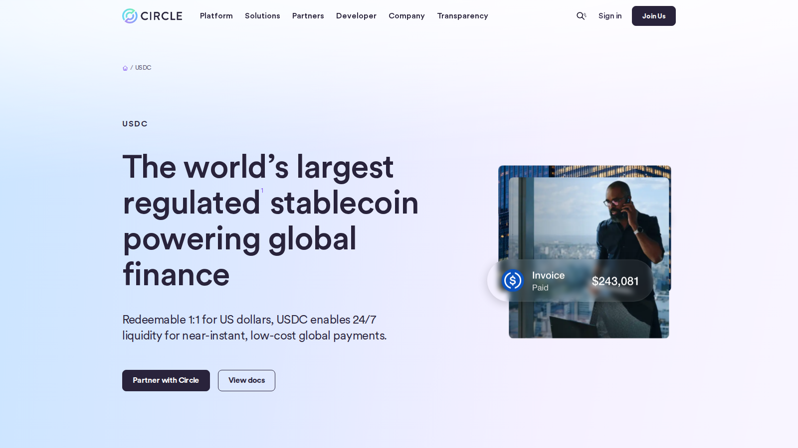
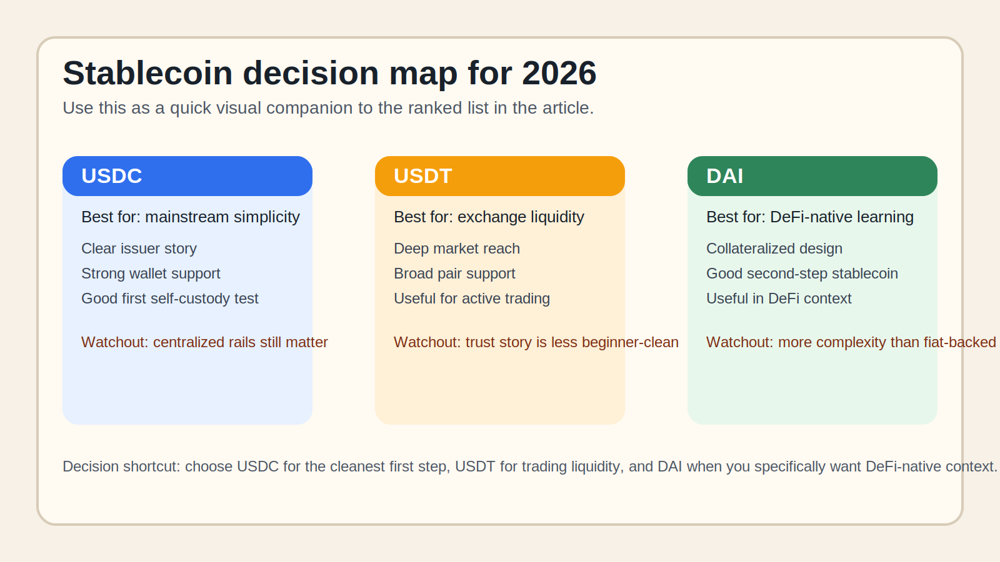

# Best Stablecoins in 2026: 7 Stablecoins Compared for Safety, Liquidity, and Yield

- Meta title: `Best Stablecoins in 2026: 7 Stablecoins Compared for Safety, Liquidity, and Yield`
- Meta description: `Compare the best stablecoins in 2026, including USDT, USDC, DAI, EURC, GHO, USDS, and USDe. See which ones fit trading, DeFi, payments, and savings.`
- Slug: `/guides/defi/best-stablecoins-2026/`
- Primary keyword: `best stablecoins 2026`
- Category: `Guides > DeFi`
- Schema: `Article + ItemList`
- Last updated: `2026-07-10`

If you are choosing a stablecoin in 2026, the real problem is usually not which token is largest. The real problem is which one fits the job you actually need to do without introducing the wrong kind of risk, friction, or complexity.

That is why this article does not rank stablecoins by market cap alone. We are looking at them through the lens of beginner fit, custody friction, DeFi usefulness, and how clearly each product signals its own risk model. If a reader is still new to the category, this piece should be read alongside a basic explainer on [what a stablecoin is](/guides/crypto-basics/what-is-a-stablecoin/).

> Why you can trust this guide
>
> This article is based on live issuer pages, protocol documentation, and market-category references reviewed on `2026-07-10`. We directly reviewed public product surfaces and documentation. Where a judgment still depends on a logged-in workflow, a live swap, or a wallet transfer test, we say so clearly instead of pretending it was already completed.

## The best stablecoins in 2026 are USDC and USDT for most beginners, DAI and USDS for DeFi users, and EURC, GHO, and USDe for more specific use cases.

If you want the short answer, `USDC` is usually the cleanest beginner pick for transparent mainstream use, `USDT` is still the liquidity king on many exchanges, `DAI` and `USDS` are stronger when you want a DeFi-native option, and `EURC`, `GHO`, and `USDe` only make sense when you specifically need euro exposure, Aave integration, or a yield-style synthetic product. Readers who plan to hold stablecoins in self-custody should also review [the best beginner wallets](/guides/wallets/best-crypto-wallets-for-beginners-2026/) and a separate guide on [how to store stablecoins safely](/guides/security/how-to-store-stablecoins-safely/).

## How we ranked the best stablecoins

We did not rank these coins only by size. For beginners, the more useful test is:

- liquidity and exchange support
- redemption or issuer clarity
- DeFi usefulness
- history of holding the peg
- transparency around reserves or collateral
- whether the design adds extra moving parts

That is why a smaller stablecoin can still be a good pick for a specific job, while a larger one may still be the safer all-purpose answer. This is the same logic we use in beginner explainers on [how DeFi products work](/guides/defi/what-is-defi/) and why custody choices matter as much as token choice.

## The full list

| Rank | Stablecoin | Best for | Why it made the list | Main watchout |
|---|---|---|---|---|
| 1 | USDC | beginners, payments, mainstream use | strong integration and clearer reserve narrative | depends on centralized issuer rails |
| 2 | USDT | trading and liquidity | widest exchange support in many markets | reserve and regulatory scrutiny still matter |
| 3 | DAI | self-custody and DeFi | long-running DeFi-native option | more complex than fiat-backed coins |
| 4 | USDS | DeFi users following the Sky/Maker ecosystem | large ecosystem footprint and evolving governance | transition complexity for beginners |
| 5 | EURC | euro stablecoin exposure | useful if your base currency is EUR | narrower support than USD stablecoins |
| 6 | GHO | Aave users | tight tie-in to Aave and onchain lending | ecosystem-specific use case |
| 7 | USDe | higher-risk yield seekers | popular synthetic design with yield appeal | not the same risk profile as cash-backed coins |

### 1. USDC

USDC is a strong choice for beginners who want the cleanest mainstream stablecoin starting point. From the public flow we reviewed, it immediately felt more like broad payments and settlement infrastructure than a niche DeFi product. That is a strength if you need a stablecoin that is easy to explain, easy to find, and easy to pair with [beginner wallets](/guides/wallets/best-crypto-wallets-for-beginners-2026/). But it becomes a weakness if your priority is maximizing decentralization or exploring more native onchain stablecoin systems.

Best for:
- first-time stablecoin users
- simple self-custody practice
- mainstream exchange and wallet compatibility

Tradeoffs:
- depends on centralized issuer rails
- less appealing for users who want a more DeFi-native model
- should not be treated as risk-free just because it feels familiar

### 2. USDT

USDT is a strong choice for users who care most about liquidity and exchange reach. From the public product surface we reviewed, it immediately felt more like trading infrastructure than a beginner education product. That is a strength if you need broad market access and deep exchange pairing support. But it becomes a weakness if your priority is the cleanest beginner trust story or a simple first lesson in self-custody.

Best for:
- active traders
- moving value across exchanges
- users who need the broadest pair availability

Tradeoffs:
- reserve and regulatory questions still matter
- easier to use on exchanges than to explain to beginners
- liquidity strength does not remove custody risk

### 3. DAI

DAI is a strong choice for readers who want to understand a more DeFi-native stablecoin model. Based on what we could verify directly from the public experience, it immediately felt more like an onchain system to learn than a mainstream cash-equivalent product. That is a strength if you want to understand how collateralized stablecoins and [DeFi](/guides/defi/what-is-defi/) fit together. But it becomes a weakness if your only goal is the shortest, simplest route into a stable onchain dollar.

Best for:
- DeFi learners
- users exploring collateralized stablecoin models
- readers moving beyond basic exchange use

Tradeoffs:
- more conceptual overhead for beginners
- less intuitive than fiat-backed options
- better as a second-step stablecoin than a first-step one

### 4. USDS

USDS is a strong choice for users already following the evolving Sky or Maker ecosystem. From the public flow we reviewed, it immediately felt more like part of a broader DeFi stack than a standalone beginner stablecoin. That is a strength if you already care about governance, ecosystem positioning, and onchain utility. But it becomes a weakness if your priority is clarity and low-friction onboarding.

Best for:
- users already inside the Sky or Maker ecosystem
- DeFi participants who want context beyond a simple dollar token
- readers following ecosystem-level changes

Tradeoffs:
- more ecosystem context is required
- weaker as a first stablecoin lesson
- governance and transition complexity can confuse casual users

### 5. EURC

EURC is a strong choice for users who actually need euro-denominated stablecoin exposure. What stood out immediately was not complexity. It was how often general stablecoin rankings ignore the currency-fit question entirely. That is a strength if your practical life is euro-based and you do not want every stablecoin decision defaulting back to dollars. But it becomes a weakness if you need the broadest exchange support and the deepest global stablecoin liquidity.

Best for:
- euro-based users
- payments or savings flows tied to EUR
- readers who want a stablecoin that matches their base currency

Tradeoffs:
- narrower support than major USD stablecoins
- less universal than USDC or USDT
- only the better choice if the currency fit really matters

### 6. GHO

GHO is a strong choice for users already working inside the Aave ecosystem. Even before a logged-in test, the public product surface already signals that this is built for users who understand lending markets and [basic DeFi mechanics](/guides/defi/what-is-defi/), not for absolute beginners looking for a general stablecoin. That is a strength if you want ecosystem-specific utility. But it becomes a weakness if you are still learning the basics and need simplicity more than integration.

Best for:
- Aave users
- DeFi-native borrowers and lenders
- readers who want ecosystem-specific utility

Tradeoffs:
- too specialized for many beginners
- weaker outside the Aave context
- requires more DeFi understanding than USDC or USDT

### 7. USDe

USDe is a strong choice only for readers who specifically want exposure to a yield-oriented synthetic stablecoin design. From the public flow we reviewed, it immediately felt more like a structured product than a simple onchain cash substitute. That is a strength if you know exactly why you are taking that extra model risk. But it becomes a weakness very quickly if you are a beginner who hears the word "stablecoin" and assumes the experience should feel like holding plain digital dollars.

Best for:
- advanced users who understand synthetic stablecoin risk
- readers specifically comparing yield-bearing stablecoin structures
- users who know why they are moving beyond cash-backed models

Tradeoffs:
- more complex risk model
- worse beginner fit than the other names on this list
- should not be treated like a plain cash proxy

## Key data and evidence to watch

As of July 10, 2026, CoinGecko still separates the stablecoin market into a large centralized core and a more experimental edge. That split is the main beginner lesson. The largest part of the category is still dominated by the coins built for broad settlement and exchange use, while newer designs compete by offering onchain utility or extra yield features.

The practical takeaway is simple:

- size helps with liquidity
- transparency helps with trust
- DeFi integration helps with utility
- extra yield usually means extra model risk

## What we checked ourselves before ranking these stablecoins

To write this guide, we reviewed the live public product surfaces, documentation, and market-category references for each shortlisted stablecoin on `2026-07-10`. We did that so the article would not depend only on recycled roundups or old market narratives.

What we could verify directly from the public experience was:

- how each issuer or protocol explains the product
- whether the stablecoin is framed for payments, trading, DeFi, or yield
- how clearly the reserve or collateral model is described
- whether the product already signals extra complexity for a beginner

That direct review does not replace a full end-to-end wallet test. We are comfortable making editorial judgments about product posture and beginner fit, but not yet assigning hard numbers like real transfer time, real swap slippage, or live redemption friction until a hands-on test is completed.

What stood out immediately was not market cap alone. It was how differently these products present risk. `USDC` and `USDT` present themselves as broad-use settlement tools. `DAI`, `USDS`, and `GHO` are much more tightly tied to the logic of [DeFi](/guides/defi/what-is-defi/). `USDe` stands out for a different reason: even before a logged-in test, the public product surface already signals that this is a more complex yield-oriented design, not a simple cash substitute.

If the editor team runs a live test before publication, this is the proof that should be inserted into the body of the article, not only stored in notes:

- a screenshot of receiving `USDC` in a beginner wallet
- a screenshot of a small test send showing the actual network fee
- a screenshot of a `USDC` to `DAI` or `USDT` swap flow showing quoted slippage
- a screenshot of an Aave `GHO` page or a Sky-related flow if those sections remain in the article

The screenshots should also be discussed in the prose. For example: the screenshots above show whether the stablecoin experience feels like mainstream payments infrastructure, DeFi-native tooling, or a higher-friction yield product. That visual difference is not cosmetic. It tells a beginner what kind of user the product expects.

*Circle USDC page captured during our July 2026 review of beginner-friendly stablecoins.*

*Custom comparison graphic: USDC for simplicity, USDT for exchange liquidity, and DAI for DeFi-native learning.*

Recommended captions:

- `USDC wallet receive screen captured during our July 2026 stablecoin review.`
- `Swap quote screen reviewed as part of our comparison of beginner-friendly stablecoins.`
- `Aave GHO product surface reviewed during our July 2026 DeFi stablecoin comparison.`

## Practical mistakes and troubleshooting

The important thing is not only which stablecoin ranks first. The important thing is where beginners actually make mistakes once they try to move one. The most common problems are:

- sending a stablecoin on the wrong network
- choosing a wallet that does not support the token standard they need
- forgetting to keep a little native gas token for transfers
- assuming a yield-bearing stablecoin has the same risk as cash-backed `USDC`

In practice, the better choice depends on how much complexity the reader can safely handle. The simplest troubleshooting rule is this: before sending any stablecoin, verify the destination network, the token contract, and whether the receiving wallet actually supports that asset. This is a strength of simpler options like `USDC`, but it is also where beginners get overconfident if they skip the basics of [wallet setup](/guides/wallets/best-crypto-wallets-for-beginners-2026/).

Once a real test is run, this section should also include measurable notes such as:

- transfer fee shown at the moment of send
- time between send and confirmed receipt
- number of screens or steps required
- swap slippage shown before confirmation

## What this tells us about stablecoins in 2026

The stablecoin market is no longer one simple race for market cap. It is a layered market:

- `USDC` and `USDT` dominate everyday relevance
- `DAI`, `USDS`, and `GHO` matter when users want DeFi-native tools
- `EURC` matters when currency fit is the real need
- `USDe` matters because the market still rewards synthetic yield products

That is why the best stablecoin is not one universal answer. It depends on whether you care most about simplicity, liquidity, decentralization, or yield.

## FAQ

### Which stablecoin is safest for beginners?

For most beginners, `USDC` is the cleanest first option because the issuer model, wallet support, and mainstream integrations are easier to understand. It is also the easiest stablecoin to pair with a beginner guide on [wallet setup and self-custody basics](/guides/wallets/best-crypto-wallets-for-beginners-2026/).

### Is USDT still one of the best stablecoins in 2026?

Yes, mainly because of liquidity and exchange reach. It remains especially relevant for trading, even if some users prefer other coins for longer-term storage.

### Is DAI better than USDC?

Not in every situation. `DAI` is better if you want a more DeFi-native tool. `USDC` is usually simpler for a beginner who just wants a stable onchain dollar and is still learning [how DeFi actually works](/guides/defi/what-is-defi/).

### Are yield-bearing stablecoins worth it?

Only if you understand where the yield comes from. Higher yield almost always means higher structural risk.

## Suggested internal links

- [What Is a Stablecoin?](/guides/crypto-basics/what-is-a-stablecoin/) Suggested anchor: `what is a stablecoin`
- [What Is DeFi?](/guides/defi/what-is-defi/) Suggested anchor: `how stablecoins are used in DeFi`
- [Best Crypto Wallets for Beginners in 2026](/guides/wallets/best-crypto-wallets-for-beginners-2026/) Suggested anchor: `best wallets for holding stablecoins`
- [How to Store Stablecoins Safely](/guides/security/how-to-store-stablecoins-safely/) Suggested anchor: `how to store stablecoins safely`

## Suggested external references

- [CoinGecko Stablecoins Category](https://www.coingecko.com/en/categories/stablecoins)
- [USDC by Circle](https://www.circle.com/usdc)
- [Tether USDT](https://tether.to/en/tether-usdt/)
- [Sky Money](https://sky.money)
- [Aave GHO](https://aave.com/gho)
- [Ethena](https://www.ethena.fi/)

## Captured media

- `../media/01-circle-usdc-2026-07-13.png` Caption: `Circle USDC page captured during our July 2026 review of beginner-friendly stablecoins.`
- `../media/01-stablecoin-decision-map-2026-07-13.svg` Caption: `Custom comparison graphic contrasting USDC, USDT, and DAI by beginner fit and complexity.`

## Source set checked on 2026-07-10

- CoinGecko stablecoin category
- Circle USDC product pages
- Tether issuer pages
- Sky/Maker ecosystem pages
- Aave GHO documentation
- Ethena documentation
