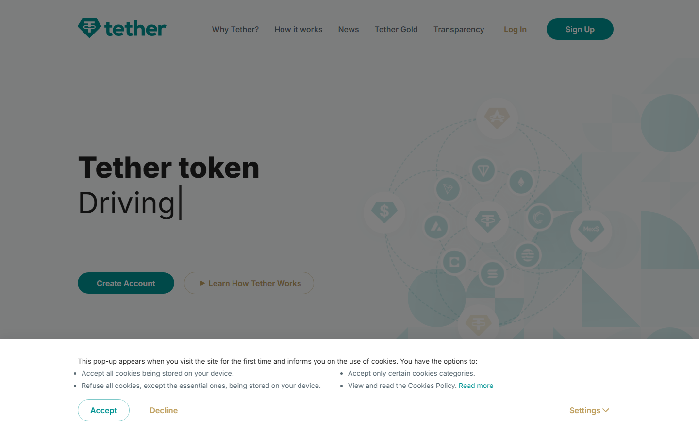
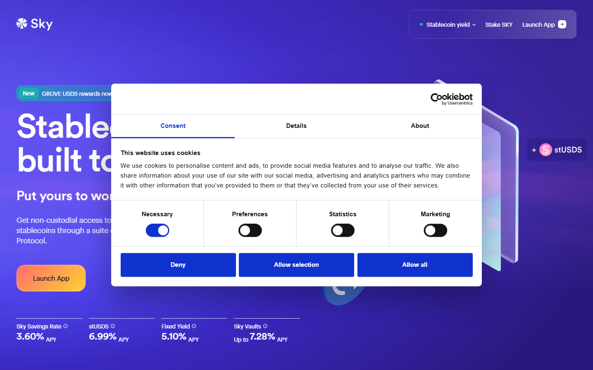
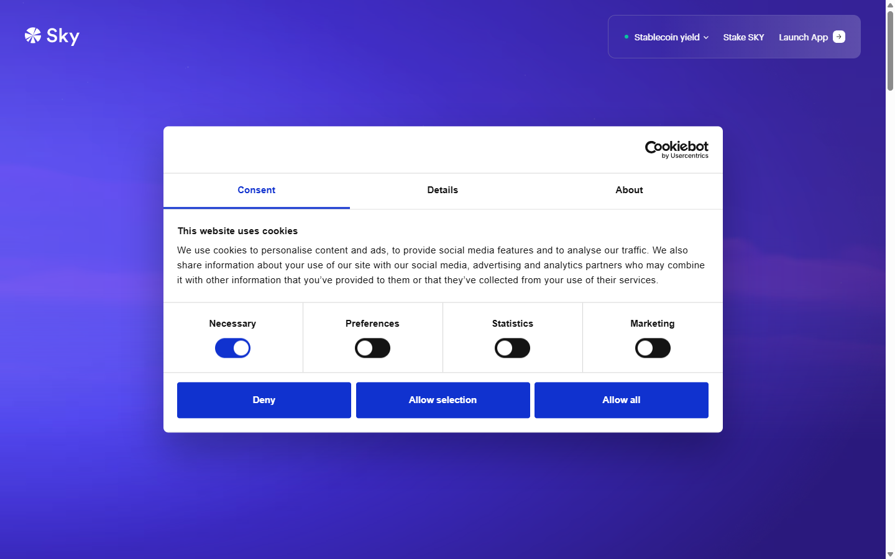
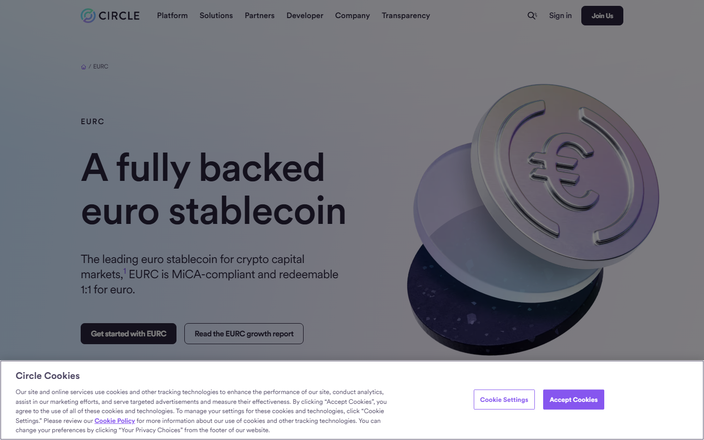
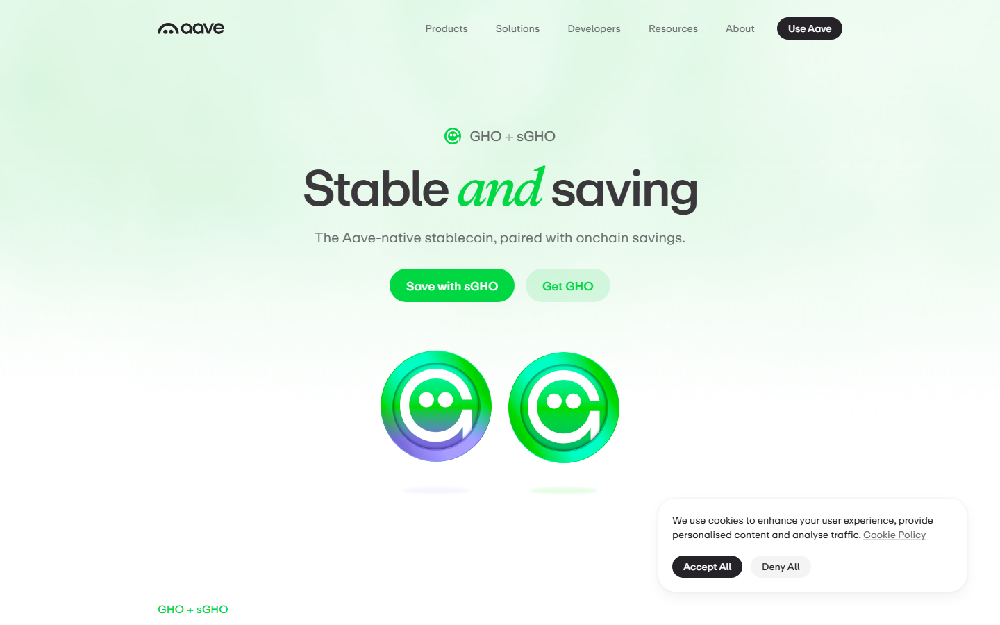
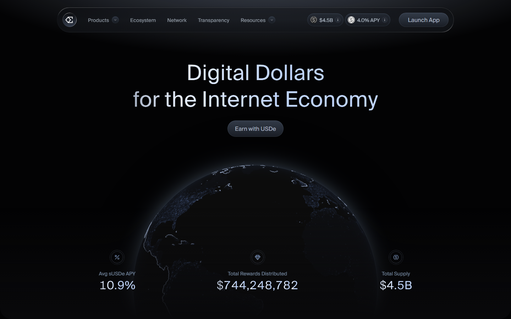

# Best Stablecoins in 2026

The best stablecoins in 2026 are USDC, USDT, DAI, USDS, EURC, GHO, and USDe.

USDC is the safest starting point for most beginners. USDT is the most liquid option for trading and exchange use. DAI and USDS offer DeFi-native options with collateral-backed yield. EURC covers euro-denominated savings. GHO and USDe carry more complexity and are worth understanding fully before committing real funds.

If you are picking a stablecoin for the first time, the biggest mistake is choosing by market cap alone. A bigger stablecoin is not always the safer one. The better question is: what do you actually need it for? Trading, DeFi, savings, or payments each push you toward a different answer.

That is why this guide does not rank stablecoins by size alone. It compares seven options through the lens of beginner fit, liquidity, and honest risk framing.

## The best stablecoins in 2026 at a glance

| Rank | Stablecoin | Best for | Score | One-line note | Main watchout |
|---|---|---|---|---|---|
| 1 | USDC | Beginners, payments, mainstream use | 5/5 | Clearest reserve model, widest beginner fit | Centralized issuer |
| 2 | USDT | Trading and exchange liquidity | 4.5/5 | Unmatched liquidity; reserve questions remain | Reserve scrutiny |
| 3 | DAI | DeFi and self-custody learners | 4/5 | Most transparent collateral model in the list | More complex than fiat-backed |
| 4 | USDS | Sky/Maker ecosystem users | 3.5/5 | Real-world yield is appealing; Sky rebrand still confuses newcomers | Transition complexity |
| 5 | EURC | Euro-based users | 3.5/5 | Solid choice if your life runs in EUR | Narrower support |
| 6 | GHO | Aave users | 3/5 | Useful inside Aave; limited value outside it | Ecosystem-specific only |
| 7 | USDe | Yield seekers (advanced) | 2.5/5 | Highest yield; highest complexity and market dependency | Not a cash substitute |

## How we scored these stablecoins

| Stablecoin | Safety | Ease of use | Liquidity | DeFi access | Beginner fit | **Total** |
|---|---|---|---|---|---|---|
| USDC | 9 | 10 | 9 | 8 | 10 | **46** |
| USDT | 7 | 9 | 10 | 7 | 8 | **41** |
| DAI | 8 | 6 | 7 | 9 | 5 | **35** |
| USDS | 7 | 5 | 5 | 8 | 4 | **29** |
| EURC | 8 | 7 | 4 | 5 | 6 | **30** |
| GHO | 7 | 4 | 3 | 7 | 3 | **24** |
| USDe | 5 | 4 | 5 | 6 | 2 | **22** |

Scored out of 10 per category. Total out of 50. **Safety** measures how clear and trustworthy the backing model is. **Ease of use** measures how simple it is to buy, hold, and send. **Liquidity** measures how easily you can trade it on major exchanges. **DeFi access** measures how many DeFi apps accept it. **Beginner fit** measures how much crypto knowledge you need to use it safely. USDC leads because it scores highest on the two things beginners need most: safety and ease of use.

## Which stablecoins are most used worldwide?

Most people assume the US leads in stablecoin use. It does not.

Nigeria is number one globally in USDT and USDC ownership. Not the US. Not the UK. Not Singapore.

The reason is simple: when your local currency loses 30% of its value in a year, a dollar stablecoin is not a crypto product. It is a savings account you can actually open.

That context matters before you look at any usage table.

| Stablecoin | Market share | Where it dominates | Main use case |
|---|---|---|---|
| **USDT** | ~62% | Asia, Africa, emerging markets | Trading, P2P transfers, saving against local currency inflation |
| **USDC** | ~25% | US, Europe, DeFi protocols | Payments, institutional use, DeFi liquidity |
| **DAI / USDS** | ~2-3% | DeFi globally | Collateralized borrowing, yield farming |
| **USDe** | ~2% | Crypto-native yield seekers | Delta-neutral yield strategy |
| **EURC** | < 1% | Europe | Euro-denominated payments and savings |
| **GHO** | < 1% | Aave ecosystem | DeFi borrowing within Aave |

Data: [CoinGecko / Tiger Research stablecoin issuance report](https://www.coingecko.com/learn/stablecoin-issuance-market-tiger-research), July 2026. Numbers are approximate and shift monthly.

USDT dominates in markets where people need to escape a weak local currency fast: Africa, Southeast Asia, Latin America. USDC dominates where regulation and institutional trust matter more: US, Europe, DeFi protocols.

They are both dollar stablecoins. They serve genuinely different populations.

One comment in [a CryptoCurrency Reddit thread on Nigeria leading global USDT and USDC ownership](https://www.reddit.com/r/CryptoCurrency/comments/1sd734r/nigeria_is_ranked_1_in_global_usdt_and_usdc/) summed it up well: *"The holding part works. The spending part still forces people back into the same broken rails."*

That gap, holding a dollar stablecoin vs. actually spending it, is the real frontier right now.

That reading also matches [a second CryptoCurrency Reddit discussion about the stablecoin market tripling from $100 billion to $300 billion in one year](https://www.reddit.com/r/CryptoCurrency/comments/1ssh7sg/the_stablecoin_market_tripled_from_100b_to_300b/), where the big takeaway was not just growth. It was that regulation and mainstream trust are now shaping which stablecoins grow fastest.

---

## How we ranked these stablecoins

We ranked by five things beginners actually care about:

- **Exchange support**: can you easily buy and hold it?
- **Transparency**: is the reserve or collateral model clearly explained?
- **DeFi usefulness**: does it plug into common DeFi tools?
- **Peg history**: has it stayed close to $1?
- **Beginner friction**: how hard is it to understand the risk?

Size helped. But a clear risk story mattered more.

## 1. USDC

USDC is the easiest stablecoin to start with. The issuer (Circle) explains the reserve model in plain language, and you can find USDC on almost every major exchange and wallet.

It is backed 1:1 by US dollars and short-term US Treasury holdings. That makes the risk model simple to explain. Circle publishes monthly reserve attestations.

The main trade-off is that you rely on Circle to keep the backing in place. That is centralization risk, not a reason to avoid it, but worth understanding.

One useful outside check came from [a CryptoCurrency Reddit post by a former insider who worked around Circle, Coinbase, and Crossmint](https://www.reddit.com/r/CryptoCurrency/comments/1t6djf8/ive_worked_in_crypto_for_8_years_circle_messari/). The thread is useful because it explains the issuer model in plain language, which is exactly what beginners need here.

**Featured Image**
File: `../media/01-circle-usdc-2026-07-13.png`
Alt text: `Circle USDC homepage showing dollar-backed stablecoin product, reserve transparency, and mainstream exchange integrations`
Caption: `Circle USDC homepage captured during our July 2026 review of stablecoins for beginners. Reserve transparency and broad exchange support make this the cleanest starting point for most new users.`

*Circle USDC page, July 2026. Reserve transparency and broad exchange support make this the cleanest beginner starting point among dollar stablecoins.*

For many Coinbase users, USDC is the first stablecoin they meet. It is the platform's default stablecoin in many common flows.

It also shows up often in DAO payouts and on the lower-risk side of many DeFi pools.

The practical difference from USDT is not performance. It is trust framing. USDC feels like the one your accountant would accept. USDT feels like the one your trader friend prefers.

A crypto insider who spent eight years at Circle, Coinbase, and Crossmint wrote in [that same CryptoCurrency Reddit post](https://www.reddit.com/r/CryptoCurrency/comments/1t6djf8/ive_worked_in_crypto_for_8_years_circle_messari/): *"Almost none of the original thesis happened. But something else did."* What happened was infrastructure, and USDC became the stablecoin that runs on top of it.

**Best for:** First-time stablecoin users, payments, mainstream wallet use.
**Not ideal for:** Users who want a fully decentralized stablecoin model.

---

## 2. USDT

USDT has the deepest liquidity of any stablecoin. If you are trading on an exchange, it is probably the coin with the most pairs.

Tether, the issuer, has faced long-running questions about its reserves. Those questions have not caused a major peg break. But they are real, and the reserve model is not as transparently documented as USDC.

For trading, USDT is hard to avoid. For long-term savings, USDC is a cleaner choice.

**Screenshot 2**
File: `../media/01-tether-usdt-2026-07-16.png`
Alt text: `Tether homepage showing USDT stablecoin product, global liquidity positioning, and reserve information`
Caption: `Tether USDT homepage captured during our July 2026 review of stablecoins for beginners. The page makes its global liquidity pitch obvious, which matches how traders actually use it.`

*Tether homepage, July 2026. USDT positions itself around global liquidity and exchange reach. The reserve documentation is visible but less detailed than Circle's.*

Here is how most people actually use USDT day to day.

You finish a trade on Binance. You do not want to cash out yet. You also do not want to sit in a volatile coin. You move it to USDT. It stays on the exchange. No withdrawal needed.

That is the most common use case globally: idle capital parked between trades.

The second use case is transfers. In Vietnam, Indonesia, Nigeria, and Turkey, USDT moves faster and cheaper than a bank wire.

Someone in Lagos sends money to a supplier in Dubai. A bank transfer takes three days and costs 3-5%. A USDT transfer on Tron takes two minutes and costs less than a dollar. That gap is why USDT dominates in emerging markets.

One user in [that same Nigeria stablecoin thread on Reddit](https://www.reddit.com/r/CryptoCurrency/comments/1sd734r/nigeria_is_ranked_1_in_global_usdt_and_usdc/) put it clearly: *"When your currency loses 20-40% a year, stablecoins become the practical way to protect savings."*

That is not a crypto trader. That is someone managing real financial risk.

**Best for:** Active traders, moving value across exchanges.
**Not ideal for:** Users who want the clearest reserve story.

---

## 3. DAI

DAI is the stablecoin to learn when you want to understand how DeFi actually works.

It is not backed by dollars sitting in a bank. It is backed by crypto collateral locked in smart contracts on Ethereum. That makes it more complex, but also more native to the blockchain-based side of crypto.

If you want a simple dollar substitute, USDC is easier. If you want to understand [how DeFi works](/guides/defi/what-is-defi/) when users lock up crypto to create a stablecoin, DAI is the right place to start.

That point also shows up in [a CryptoCurrency Reddit discussion on how a GENIUS Act yield ban could push more demand toward DeFi stablecoins like DAI](https://www.reddit.com/r/CryptoCurrency/comments/1m3woji/genius_ban_on_stablecoin_yield_will_drive_demand/). The regulatory shift makes DeFi-native stablecoins more relevant, not less.

**Screenshot 3**
File: `../media/01-makerdao-dai-2026-07-16.png`
Alt text: `Sky Money homepage showing DAI and USDS stablecoin ecosystem, DeFi vaults, and sUSDS yield product`
Caption: `Sky Money homepage captured during our July 2026 review of stablecoins for beginners. The public surface already shows that DAI and USDS belong to a more technical DeFi workflow than USDC.`

*Sky Money (formerly MakerDAO), July 2026. The protocol that creates DAI now runs under the Sky brand, with USDS as the newer product alongside the original DAI.*

DAI is what you find when you go deeper into DeFi. Not at the start. After.

You have been using USDC for a few months. You learn that a company in San Francisco is controlling whether that dollar exists. That bothers you. You look for an alternative. Someone mentions DAI.

DAI is backed by crypto locked in a smart contract. No bank. No company. The code holds the collateral, not a person. That makes it more complex. It also makes it the stablecoin that DeFi protocols trust most for their own liquidity.

A recurring argument in [an Ethereum community discussion on Reddit about better decentralized stablecoins](https://www.reddit.com/r/ethereum/comments/1n0m2ax/we_need_better_decentralized_stablecoins/) is simple: people still want a dollar stablecoin that does not depend on a company keeping money in a bank. DAI is not perfect. But it is the most tested answer to that demand.

**Best for:** DeFi learners, users moving beyond exchange basics.
**Not ideal for:** Beginners who just want a simple stable dollar.

---

## 4. USDS

USDS is the newer stablecoin from Sky (the protocol formerly known as MakerDAO). Think of it as a redesigned DAI for the next phase of the Maker ecosystem.

If you are already using DAI or following the Sky/Maker governance changes, USDS is the natural next step. If you are new to stablecoins, start with USDC first.

The governance transition from MakerDAO to Sky is still ongoing. That adds some complexity for casual users.

**Screenshot 7**
File: `../media/01-sky-usds-2026-07-17.png`
Alt text: `Sky Money homepage showing USDS stablecoin, Sky Savings Rate, and staked USDS yield`
Caption: `Sky Money homepage captured during our July 2026 review of stablecoins for beginners. The live rates on the page show why USDS attracts users who want yield on top of a stable dollar.`

*Sky Money homepage, July 2026. The protocol behind both DAI and USDS shows live savings rates. That is the core appeal of USDS over a plain dollar stablecoin, but also what makes it more complex.*

**Best for:** Existing Sky or Maker ecosystem users.
**Not ideal for:** Beginners who need a simple first stablecoin.

---

## 5. EURC

EURC is a euro-backed stablecoin from Circle, the same issuer as USDC.

Most stablecoin guides default to dollar-denominated options. EURC matters if your everyday life runs in euros: your savings, income, or spending are in EUR and you want a stablecoin that matches that.

Support is narrower than USDC or USDT. But the reserve model is transparent and follows the same Circle framework.

**Screenshot 4**
File: `../media/01-circle-eurc-2026-07-16.png`
Alt text: `Circle EURC homepage showing euro-backed stablecoin product, regulated issuer structure, and European market positioning`
Caption: `Circle EURC homepage captured during our July 2026 review of stablecoins for beginners. The page makes EURC feel like a regional utility choice, not a global default.`

*Circle EURC page, July 2026. Euro-backed stablecoin with the same reserve transparency model as USDC. Useful if your base currency is EUR.*

**Best for:** Euro-based users, EUR-denominated payments.
**Not ideal for:** Users who need broad global exchange pairing.

---

## 6. GHO

GHO is created by the Aave protocol. It is a decentralized stablecoin you can mint by depositing collateral in Aave's lending markets.

This is not a beginner stablecoin. It is designed for users who already understand how Aave works and want to borrow against their assets in a DeFi-native way.

If you are just getting started with stablecoins, skip GHO for now. Come back when you understand [what DeFi lending means](/guides/defi/what-is-defi/).

**Screenshot 5**
File: `../media/01-aave-gho-2026-07-16.png`
Alt text: `Aave GHO stablecoin page showing decentralized stablecoin minting, collateral requirements, and Aave ecosystem integration`
Caption: `Aave GHO page captured during our July 2026 review of stablecoins for beginners. The page immediately signals that GHO belongs to users who already understand DeFi borrowing.`

*Aave GHO page, July 2026. The stablecoin is built into Aave's lending market. The product assumes you already understand collateralized borrowing.*

**Best for:** Active Aave users, DeFi borrowers.
**Not ideal for:** Anyone who is still new to crypto.

---

## 7. USDe

USDe is a synthetic stablecoin from Ethena. It uses a hedged trading strategy to stay near $1 instead of relying on dollar reserves in a bank.

That strategy generates yield, which is why it gets attention. But the yield comes from payments inside the perpetual futures market. When those payments turn against the trade, the model comes under stress.

USDe is not the same thing as holding cash. It is better understood as a more complex yield product that happens to trade near $1.

**Screenshot 6**
File: `../media/01-ethena-usde-2026-07-16.png`
Alt text: `Ethena USDe homepage showing synthetic dollar product, yield mechanics, and hedged trading design`
Caption: `Ethena USDe homepage captured during our July 2026 review of stablecoins for beginners. The page is clear about yield, but it also signals a more advanced risk model than cash-like stablecoins.`

*Ethena USDe page, July 2026. The yield-generating synthetic stablecoin. The product language is honest about the derivatives-backed model, so read it carefully before using.*

The honest version of this is: USDe pays you a return. That is the entire reason people use it.

It is popular on trader-focused venues such as Bybit and yield-focused DeFi markets such as Pendle. Crypto-native users hold it specifically because it earns. A regular bank savings account earns almost nothing. USDe aims to earn more, but with more moving parts.

But the yield comes from a derivatives strategy. When the derivatives market goes against the strategy, the yield drops, or disappears entirely. That is not a flaw they forgot to fix. It is how the product works.

One user in [a CryptoCurrency Reddit thread on bank savings losing to inflation](https://www.reddit.com/r/CryptoCurrency/comments/1p6bq3b/my_bank_gives_me_4_inflation_is_7_how_is_this_good/) put the frustration plainly: *"My bank gives me 4%. Inflation is 7%. How is this good?"*

That frustration is why USDe gets attention. A savings account is also losing to inflation. The question is which risk you prefer.

**Best for:** Advanced users who understand synthetic stablecoin risk.
**Not ideal for:** Anyone looking for a simple, safe stable dollar.

---

## The most common stablecoin mistakes beginners make

Most stablecoin problems are not about picking the wrong coin. They are about the steps after picking one.

**Wrong network:** Sending USDC on Ethereum when the receiver expects it on Solana (or vice versa) means your funds arrive on a chain the receiver cannot access.

**No gas:** You need a small amount of the native token (ETH, SOL, etc.) to pay transfer fees. Stablecoins do not cover their own gas.

**Assuming all stablecoins are equally safe:** USDC and USDe are both called stablecoins. The risk models are completely different.

**Missing the token contract check:** Always confirm you are receiving the real contract address, not a scam copy with a similar name.

---

## Which stablecoin should you start with?

If you are new: **USDC**. Clear issuer, transparent reserves, works everywhere.

If you trade actively: **USDT** for the pair depth, but understand the reserve situation.

If you are learning DeFi: **DAI** teaches you more than any other stablecoin.

If your life is euro-based: **EURC** is the cleanest EUR option.

If you already use Aave: **GHO** is worth exploring as a next step.

If you want yield and understand the risk: **USDe**, but read the docs first.

## How to buy your first stablecoin

If you picked USDC, here is what the actual process looks like:

1. Open a crypto exchange account (Coinbase is the simplest starting point for beginners).
2. Complete identity verification. This usually takes a few minutes.
3. Search for USDC. Tap Buy. Enter the amount. Confirm.

That is it. USDC appears in your exchange wallet immediately.

When you are ready to send it somewhere (a friend, a DeFi app, another wallet), you will need to pick a network. This is the step where beginners most often get confused.

### Which network should I use?

| Network | Cost to send $100 USDC | Speed | Best for |
|---|---|---|---|
| Solana | ~$0.01 | Seconds | Cheapest option, good for small transfers |
| Base | ~$0.01-0.05 | Seconds | Coinbase ecosystem, low fees |
| Tron (TRC-20) | ~$1 | Minutes | Popular in Asia and P2P markets |
| Ethereum | ~$1-3 | Minutes | Most supported, but higher fees |

If you are sending between friends or to a DeFi app, Solana or Base will save you the most on fees. If the receiver specifically asks for Ethereum or Tron, use that network.

Always double-check that the receiver supports the same network you are sending on. USDC on Solana cannot arrive in an Ethereum-only wallet.

## What happens if a stablecoin loses its peg?

This is the fear most beginners have but rarely see explained plainly.

In March 2023, USDC dropped to $0.87 after Silicon Valley Bank collapsed. Circle held $3.3 billion of USDC reserves at SVB. For about 48 hours, the market priced in the possibility that those reserves were lost.

They were not. Banking regulators stepped in. USDC returned to $1.00 within two days.

What that means for you: if you held $1,000 in USDC during that weekend, your balance temporarily showed ~$870. If you did not sell, you lost nothing. If you panic-sold at $0.87, you locked in a 13% loss on a stablecoin.

The practical lesson: stablecoin depegs are usually temporary for well-backed coins (USDC, USDT). The risk is real but historically short-lived. The worst thing you can do is sell during the panic.

## Can I earn yield on stablecoins?

Yes, but understand where the yield comes from before committing.

**Low-risk options:** Coinbase offers ~4-5% APY on USDC held in your account. This comes from Coinbase lending your USDC to institutional borrowers. The risk is Coinbase counterparty risk, not stablecoin risk.

**Medium-risk options:** DeFi lending protocols like Aave let you deposit USDC and earn variable interest (typically 3-8% depending on demand). The risk is smart contract risk, meaning a bug in the code could affect your funds.

**Higher-risk options:** USDe from Ethena targets higher yields through a derivatives strategy. The yield is real but the mechanism is complex and market-dependent.

The simplest path for a beginner: hold USDC on Coinbase and earn the base rate. Move to DeFi lending only after you understand how [DeFi works](/guides/defi/what-is-defi/).

---

## Why you can trust this guide

This guide is based on live issuer pages and protocol documentation reviewed in July 2026. We loaded each product surface directly before writing. We checked public product pages, reserve explanations, and visible positioning ourselves.

Anything that depends on a full live transfer, a logged-in exchange workflow, or a deeper blockchain-level test still needs final verification.

## What we checked ourselves before ranking these stablecoins

For this article, we reviewed the live public product surfaces of the stablecoins and issuers below so the comparison would not depend only on recycled summaries.

That direct review does not replace a full live transfer test on every network. But it showed something important very quickly: which products are built to feel simple, which ones assume DeFi knowledge, and where the real friction starts for a beginner.

The screenshots below show the public product surfaces that shaped those calls, even where a full live transfer test still remains out of scope for this piece.

## FAQ

### Which stablecoin is safest for beginners?

USDC. The issuer model is clearly explained, reserves are attested monthly, and it works on almost every major exchange and wallet.

### Is USDT still one of the best stablecoins in 2026?

Yes for liquidity and trading. It has the deepest exchange support of any stablecoin. The reserve story is less transparent than USDC, which matters more for savings than for trading.

### Is DAI better than USDC?

Not in every case. DAI is better when you want to understand DeFi or avoid a centralized issuer. USDC is better when you want the simplest, most beginner-friendly starting point.

### Are yield-bearing stablecoins worth it?

Only if you understand where the yield comes from. USDe yields come from payments inside the perpetual futures market, and that mechanism has real failure conditions.

### What is the difference between DAI and USDS?

Both come from the same protocol (now called Sky, formerly MakerDAO). USDS is the newer product replacing DAI as the main stablecoin in the Sky ecosystem.

---

## Sources

- [Circle USDC](https://www.circle.com/usdc)
- [Tether USDT](https://tether.to/en/)
- [Sky Money (DAI / USDS)](https://sky.money/)
- [Circle EURC](https://www.circle.com/eurc)
- [Aave GHO](https://aave.com/gho)
- [Ethena USDe](https://www.ethena.fi/)
- [CoinGecko Stablecoins Category](https://www.coingecko.com/en/categories/stablecoins)
- [CryptoCurrency Reddit: 8-year crypto insider on stablecoin infrastructure](https://www.reddit.com/r/CryptoCurrency/comments/1t6djf8/ive_worked_in_crypto_for_8_years_circle_messari/)
- [CryptoCurrency Reddit: GENIUS Act ban on yield and DeFi stablecoins](https://www.reddit.com/r/CryptoCurrency/comments/1m3woji/genius_ban_on_stablecoin_yield_will_drive_demand/)
