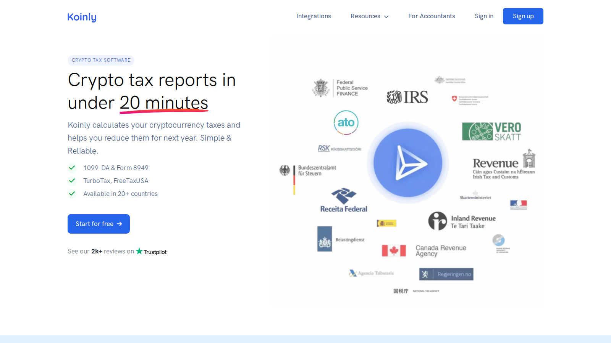
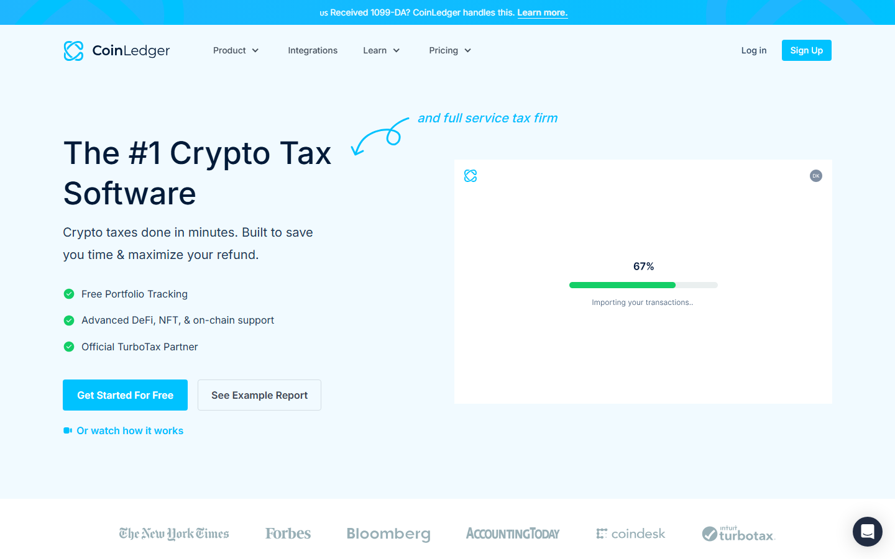
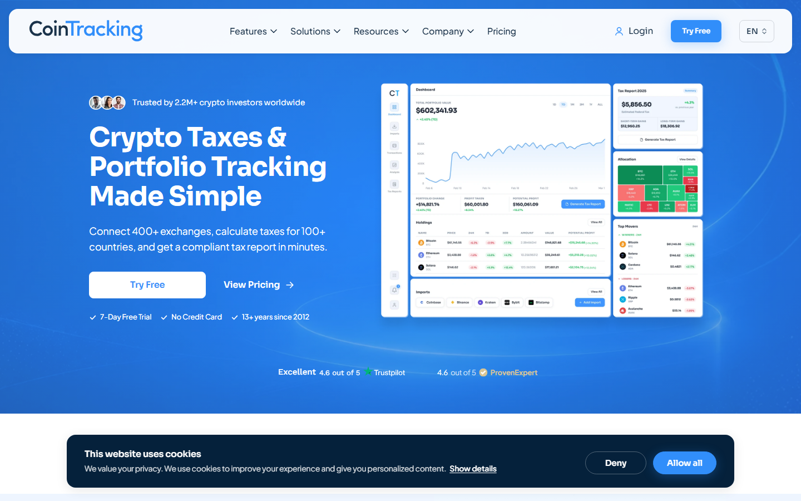
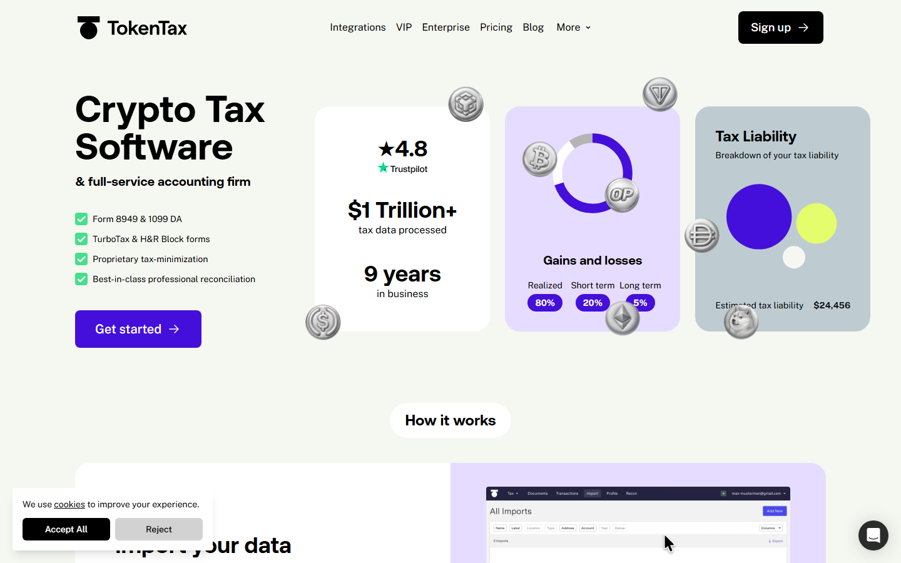

# Best Crypto Tax Software in 2026

The best crypto tax software in 2026 are Koinly, CoinLedger, and Crypto Tax Calculator.

Koinly is the safest starting point for most people with mixed wallets and exchanges. CoinLedger is the fastest path for beginners whose history is mostly exchange-based. Crypto Tax Calculator handles DeFi, NFT, and multichain wallets better than either. The remaining five tools on this list, including CoinTracker, CoinTracking, TokenTax, ZenLedger, and TurboTax, fill specific niches covered in the breakdown below.

If you are choosing crypto tax software for the first time, the biggest mistake is comparing only the sticker price. A cheaper plan is not really cheaper if it fails at imports, duplicates transfers, or leaves you fixing cost basis by hand at midnight in April. The real test is whether the software can read your exchange CSVs, wallet transfers, staking rewards, and DeFi activity without turning the review screen into a mess.

That is why this guide does not rank these tools by price alone. It compares eight options based on import reliability, ease of cleanup, DeFi coverage, and how painful the final filing step feels in practice.

## The best crypto tax software in 2026 at a glance

| Rank | Tool | Best for | Score | One-line note | Main watchout |
|---|---|---|---|---|---|
| 1 | Koinly | Most users with mixed wallets and exchanges | 5/5 | Best balance of wallet coverage and cleanup workflow | Pricing scales hard as transaction counts grow |
| 2 | CoinLedger | Exchange-heavy beginners in the US | 4.5/5 | Fastest path from import to report for simple histories | DeFi edge cases still need checking |
| 3 | CoinTracker | Coinbase users wanting the smoothest UI | 4/5 | Polished consumer feel; strong Coinbase integration | Price climbs quickly |
| 4 | CoinTracking | High-volume traders needing granular controls | 4/5 | Best row-level control for messy historical records | Steep learning curve |
| 5 | Crypto Tax Calculator | DeFi and NFT-heavy wallets | 4/5 | Strongest DeFi auto-categorization in the list | Busy interface for simple users |
| 6 | TokenTax | Users willing to pay for CPA support | 3/5 | Software plus human help; useful for complex filings | Premium pricing and less DIY flexibility |
| 7 | ZenLedger | Users who want a mainstream alternative to compare | 2.5/5 | Approachable interface; recent support complaints are frequent | Mixed support feedback |
| 8 | TurboTax | Final filing after reconciliation is done | 2/5 | Handles last-mile filing; not a reconciliation tool | Not a cleanup tool by itself |

## How we scored these tools

| Tool | Import reliability | Cleanup workflow | DeFi handling | Filing path | Price value | **Total** |
|---|---|---|---|---|---|---|
| Koinly | 9 | 9 | 7 | 8 | 7 | **40** |
| CoinLedger | 8 | 8 | 5 | 8 | 8 | **37** |
| CoinTracker | 7 | 7 | 6 | 8 | 5 | **33** |
| CoinTracking | 8 | 6 | 6 | 7 | 7 | **34** |
| Crypto Tax Calculator | 7 | 7 | 9 | 7 | 7 | **37** |
| TokenTax | 6 | 5 | 5 | 7 | 4 | **27** |
| ZenLedger | 5 | 5 | 4 | 6 | 5 | **25** |
| TurboTax | 3 | 2 | 1 | 9 | 6 | **21** |

Scored out of 10 per category. Total out of 50. **Import reliability** measures how cleanly the tool reads exchange CSVs and wallet data. **Cleanup workflow** measures how easy it is to find and fix missing cost basis and duplicate entries. **DeFi handling** measures coverage of swaps, LPs, staking, NFTs, and bridges. **Filing path** measures how smoothly the final export works with tax software or a CPA. **Price value** measures what you get relative to the cost. Koinly and Crypto Tax Calculator tie near the top for different reasons: Koinly on breadth, CTC on DeFi depth.

## How we evaluated these tools

Most beginners make the same mistake. They buy the cheapest plan first, then discover the tool cannot read their files cleanly.

Think of crypto tax software like a translator. If it reads your exchange history badly, every number after that becomes harder to trust.

We focused on the moments where beginners usually get stuck:

- **CSV import coverage**: can you load exchange files without reformatting columns?
- **Wallet sync quality**: can it identify self-transfers (moving your own coins between your own accounts) instead of treating them as sales?
- **DeFi handling**: can it read swaps, LP positions (liquidity pool deposits), staking rewards, and NFT activity?
- **Reconciliation workflow**: does it make missing cost basis (the original buy price used to calculate tax) easy to find and fix?
- **Filing path**: how cleanly does the final export move into tax software?

Most of these products let you import data for free. The bill usually appears when you need downloadable forms or full filing exports.

---
## Do I even need crypto tax software?

Not always. If you only bought crypto on one exchange, held it, and never sold, you may not owe anything yet in most countries. In the US, you only owe capital gains tax when you sell, swap, or spend crypto.

If your entire history is fewer than 10 transactions on one exchange, you can probably calculate gains by hand or use your exchange's built-in tax report (Coinbase and Kraken both offer these).

You need software when your history spans multiple exchanges, includes wallet transfers, staking rewards, DeFi activity, or when you have lost track of what you originally paid for something (your cost basis).

## Pricing comparison

| Tool | Free tier | Paid start | Mid tier | Notes |
|---|---|---|---|---|
| Koinly | Preview only (10K txns) | $49 (100 txns) | $179 (3K txns) | Report download requires paid plan |
| CoinLedger | Preview only | $49 (100 txns) | $99 (1K txns) | Clean upgrade path |
| CoinTracker | Limited | $59 (100 txns) | $199 (1K txns) | Price climbs fast |
| CoinTracking | 200 txns free | $119/yr (3.5K txns) | $239/yr (unlimited) | Best free tier for small traders |
| Crypto Tax Calculator | Preview only | $49 (100 txns) | $99 (1K txns) | Similar to CoinLedger |
| TokenTax | None | $65 (500 txns) | $199 (5K txns) | CPA services extra |
| ZenLedger | 25 txns free | $49 (100 txns) | $149 (1K txns) | Check current pricing |
| TurboTax | Basic filing free | $89+ (Premier) | N/A | Not a reconciliation tool |

Prices are approximate as of July 2026. Always check the tool's current pricing page before buying. Most tools let you import and preview data for free. You only pay when you download the final tax report.

## When should you start?

Do not wait until April. The best time to set up crypto tax software is right after tax season ends, while you still remember which exchanges and wallets you used.

Import your data now. Fix the errors while they are still fresh. When filing season arrives, the report is already waiting.

## 1. Koinly

[Koinly](https://koinly.io/) remains the safest first recommendation because it handles the widest mix of exchange accounts and self-custody wallets (wallets you control yourself, not an exchange) without making the setup feel technical.

The product surface is built around cleanup. After import, it pushes missing cost basis, duplicate entries, and transfer mismatches into visible review queues instead of burying them.

That matters because crypto tax work is rarely about calculation first. It is usually about finding the bad row that breaks everything downstream.

Recent Reddit feedback still lines up with that. In one [a CryptoTax Reddit comparison thread on Koinly vs other tools](https://www.reddit.com/r/CryptoTax/comments/1hkzwzt/cointracker_vs_koinly_vs_other_cryptocurrency_tax/), a user said Koinly was easy to set up across multiple cold wallets and exchanges, and that its cost basis came out closer than competing tools even though a few transactions still needed manual cleanup.

Another user in [a Koinly community discussion about how reliable Koinly feels in practice](https://www.reddit.com/r/koinly/comments/1hd0tqb/how_reliable_is_koinly/) wrote that once the import issues were fixed, the product worked smoothly and the UI felt easier for both beginners and experienced users.

*"Once the import issues were fixed, it worked smoothly and felt easier to use than other tools I had tried, both for beginners and for more experienced users."*

The trade-off is price creep. A high-volume user in [a separate CryptoTax Reddit thread about which crypto tax software people actually keep using](https://www.reddit.com/r/CryptoTax/comments/1qjw11l/which_crypto_tax_software_do_you_actually_use_and/) said they stayed with Koinly partly because other services became unsustainable once transaction counts climbed.

That is the part to watch. Koinly is easy to trust early, but it stops feeling cheap once your activity grows. The free tier limits you to 10,000 transactions for preview only. Downloading a tax report starts at $49 per year for up to 100 transactions, and scales to $179 or more for larger histories.

**Featured Image**
File: `../media/02-koinly-home-2026-07-13.png`
Alt text: `Koinly dashboard interface showing crypto portfolio tracking, tax liabilities, and exchange import options`
Caption: `Koinly homepage captured during our July 2026 review of crypto tax software for beginners. The dashboard makes cleanup and wallet imports feel more visible than hidden.`

*Koinly homepage, July 2026. The dashboard feels cleaner than most rivals, and that matters once you start tracing missing transfers across several exchanges and wallets.*

**Best for:** Most users who mix centralized exchanges with a few wallets.
**Not ideal for:** Extremely high-volume traders trying to keep annual software costs low.

---

## 2. CoinLedger

[CoinLedger](https://coinledger.io/) is strongest when your history is still mostly exchange-driven and you want the shortest path from import to report.

Its interface is simpler than the average tax tool. You connect the exchange, review flagged issues, and move toward the export step without getting dragged into a giant accounting dashboard.

That simplicity is exactly why some users prefer it. In [a recent CryptoTax Reddit discussion about tools updated for the new IRS rules](https://www.reddit.com/r/CryptoTax/comments/1r3rrw9/what_crypto_tax_software_is_fully_updated_for_the/), one commenter said CoinLedger's missing cost basis workflow was genuinely useful for reconciling cross-platform transfers, which is where many beginners fail.

Another commenter in [a CryptoTax Reddit thread on whether CoinLedger is the best option](https://www.reddit.com/r/CryptoTax/comments/1kjcj96/is_coinledger_the_best_option_for_crypto_taxes_or/) said CoinLedger was the tool that finally made them feel able to file again after struggling with crypto taxes for years.

*"CoinLedger was the tool that finally made me feel able to file again after struggling with crypto taxes for years. The missing cost basis workflow was genuinely useful for reconciling cross-platform transfers."*

The catch is that sentiment is mixed once activity gets messier. In [another recent CryptoTax Reddit thread comparing CoinLedger with other options](https://www.reddit.com/r/CryptoTax/comments/1kjcj96/is_coinledger_the_best_option_for_crypto_taxes_or/), one user said CoinLedger handled their blockchain-based wallet activity poorly enough that they would stay away, while another commenter in the same discussion said they preferred Crypto Tax Calculator for complex DeFi.

That split matches the product itself. CoinLedger is good at getting straightforward exchange histories into filing shape, but you should inspect every wallet-derived line if you used bridges, LPs, loans, or NFT mints.

That is the watchout. The cleaner the interface looks, the easier it is to miss a wrong category hidden inside a complicated wallet history.

**Screenshot 2**
File: `../media/02-coinledger-home-2026-07-16.png`
Alt text: `CoinLedger homepage showing crypto tax reporting product, exchange integrations, and free report preview options`
Caption: `CoinLedger homepage captured during our July 2026 review of crypto tax software for beginners. The surface feels simpler than most rivals, which helps exchange-only users move faster.`

*CoinLedger homepage, July 2026. The surface is intentionally spare, which makes it less intimidating for exchange-only users and first-time filers.*

**Pricing note:** CoinLedger's base plan starts at around $49 per year for up to 100 transactions. The hobbyist tier covers up to 1,000 transactions at roughly $99. Those prices are worth checking on their [current pricing page](https://coinledger.io/pricing) before buying, as they update periodically.

**Best for:** Beginners with mostly exchange imports.
**Not ideal for:** Users with heavy DeFi histories across multiple chains.

---

## 3. CoinTracker

[CoinTracker](https://www.cointracker.io/) feels the most like a mainstream consumer finance app. That is its real advantage.

The product does not just prepare tax data. It keeps a live portfolio layer on top, which makes it easier for Coinbase users and casual investors to stay inside one polished system all year.

That mainstream feel is backed by user feedback too. In [that same CryptoTax Reddit comparison thread](https://www.reddit.com/r/CryptoTax/comments/1hkzwzt/cointracker_vs_koinly_vs_other_cryptocurrency_tax/), one user with an accounting background said CoinTracker was the most accurate option they had tested.

The opposite view is easy to find as well. A user in [a CryptoCurrency Reddit thread about ZenLedger and tax-tool frustrations](https://www.reddit.com/r/CryptoCurrency/comments/1aub039/zenledger_sucks_help_me/) said the subscription pricing was excessive and support was weak, while [the broader CryptoTax Reddit comparison](https://www.reddit.com/r/CryptoTax/comments/1hkzwzt/cointracker_vs_koinly_vs_other_cryptocurrency_tax/) said CoinTracker handled DeFi and NFTs better than expected but still required manual work.

That mix makes sense. CoinTracker is attractive if you want the smoothest UI and already live inside Coinbase-adjacent workflows, but the price becomes harder to justify once your history grows.

That is the open question with CoinTracker. It feels polished fast, but it may not feel worth the premium once you move beyond a simple portfolio.

**Screenshot 3**
File: `../media/02-cointracker-home-2026-07-16.png`
Alt text: `CoinTracker homepage showing portfolio tracking, tax optimization tools, and Coinbase integration`
Caption: `CoinTracker homepage captured during our July 2026 review of crypto tax software for beginners. The page feels closer to a mainstream finance app than a pure tax dashboard.`

*CoinTracker homepage, July 2026. It feels like a retail investing product first and a tax tool second, which many beginners will prefer.*

**Best for:** Coinbase users and beginners who care about interface quality.
**Not ideal for:** Budget-first users with large transaction histories.

---

## 4. CoinTracking

[CoinTracking](https://cointracking.info/) is less a guided wizard and more a tax database for people who already know where crypto records break.

That old-school design has a purpose. If you have years of trading activity, defunct exchanges, manually imported CSVs, and wallet-by-wallet cost basis issues, CoinTracking gives you more levers than cleaner-looking competitors.

Its own user base often describes the product in exactly those terms. In [a CryptoTax Reddit recommendation thread](https://www.reddit.com/r/CryptoTax/comments/170t7po/looking_for_recommendations_for_crypto_tax/), one long-time user said they had over 20,000 trades and kept using CoinTracking because moving away would be expensive, even though cleanup could become a hassle.

The warning is obvious: the interface asks more from you. Another [a current CryptoTax Reddit thread about software for people in the US](https://www.reddit.com/r/CryptoTax/comments/1iilrx2/best_crypto_tax_software_for_people_in_the_us/) shows the same pattern, with users discussing reporting changes at a much more technical level.

If you want a simple setup flow, CoinTracking is too much tool. If you want row-by-row control over messy records, it earns its place on the list.

That is the trade-off to keep in mind. More control helps when your records are a mess, but it also means more chances to overwhelm yourself.

**Screenshot 4**
File: `../media/02-cointracking-home-2026-07-16.png`
Alt text: `CoinTracking homepage showing advanced trading analytics, historical database tools, and professional tax reporting options`
Caption: `CoinTracking homepage captured during our July 2026 review of crypto tax software for beginners. The dense layout signals control first and simplicity second.`

*CoinTracking homepage, July 2026. It looks dense because it is dense, but that density is useful once you need to audit thousands of historical entries.*

**Best for:** Active traders and users with long, messy records.
**Not ideal for:** Casual beginners who want a guided, low-friction setup.

---

## 5. Crypto Tax Calculator

[Crypto Tax Calculator](https://cryptotaxcalculator.io/en/), now also branded as Summ in some Reddit discussions, is the best fit here for users whose tax history is mostly wallet-and-DeFi chaos.

If your year includes LP deposits, liquid staking, cross-chain transfers, NFT trades, and gas-heavy wallets, this category is where the import engine matters more than the homepage polish.

Recent user feedback is unusually consistent. In [a CryptoTax Reddit comparison thread](https://www.reddit.com/r/CryptoTax/comments/1hkzwzt/cointracker_vs_koinly_vs_other_cryptocurrency_tax/), a user who said they had tried most major tools called Crypto Tax Calculator the easiest to use for complex DeFi and the most accurate at auto-categorization and reporting.

Another user in [a CryptoTax Reddit thread on switching away from Koinly](https://www.reddit.com/r/CryptoTax/comments/1i46z8l/wife_hates_koinly_with_a_passion_is_crypto_tax/) said the interface felt clean, prices for assets were more accurate in their experience, and support was more responsive, though they still found exchange coverage thinner in some cases.

A separate user in [a BitcoinAUS Reddit discussion of the best Australian crypto tax tool](https://www.reddit.com/r/BitcoinAUS/comments/1hzw6xw/best_aus_crypto_tax_tool/) credited Crypto Tax Calculator's tax-loss harvesting tools with helping them surface old losing positions they had missed.

The downside is still readability. When a product is built to decode blockchain-based wallet activity correctly, the review screen can feel busy for anyone whose activity was just spot buys on one exchange.

That is the warning here. A stronger DeFi tool often looks harder at first because it is doing more cleanup work in front of you.

**Screenshot 5**
File: `../media/02-cryptotaxcalc-home-2026-07-16.png`
Alt text: `Crypto Tax Calculator homepage showing DeFi tax tools, smart contract decoding, and multichain wallet integrations`
Caption: `Crypto Tax Calculator homepage captured during our July 2026 review of crypto tax software for beginners. The public surface already signals that this tool is built for more complicated wallet histories.`

*Crypto Tax Calculator page, July 2026. This is one of the few tools that looks built for cleaning up smart-contract and wallet activity, not just exchange CSV imports.*

**Best for:** DeFi, NFT, and multichain wallet users.
**Not ideal for:** Beginners with only simple exchange buys and sells.

---

## 6. TokenTax

[TokenTax](https://tokentax.co/) sits in a different part of the market because it mixes software with a paid human-help path.

That matters when the tax problem is no longer just software. If your records are broken across multiple years, or you want someone else to reconcile old wallets before filing, TokenTax starts to make more sense.

Reddit feedback on TokenTax is sharply split. In [a recent CryptoTax Reddit thread about paying thousands just to report losses](https://www.reddit.com/r/CryptoTax/comments/1oica3r/4000_just_to_report_my_taxes_when_i_only_have/), a user said they had used TokenTax themselves for years before paying for the service tier once the value justified outside help.

But in [another Reddit comparison thread on which tax software people actually prefer](https://www.reddit.com/r/CryptoTax/comments/1qjw11l/which_crypto_tax_software_do_you_actually_use_and/), a commenter warned against TokenTax because of bugs, clunky DeFi handling, and its refund policy.

So the right way to read TokenTax is this: you are not paying for the cleanest DIY software. You are paying because you may eventually want a team involved.

That can be worth it. But it only makes sense if your records are messy enough to justify the higher bill.

**Screenshot 6**
File: `../media/02-tokentax-home-2026-07-17.png`
Alt text: `TokenTax homepage showing crypto tax software with CPA services, DeFi tax tools, and high-complexity filing support`
Caption: `TokenTax homepage captured during our July 2026 review of crypto tax software for beginners. The page positions itself around professional filing help rather than a self-serve tool.`

*TokenTax homepage, July 2026. The pitch is not the cheapest tool on the market. It is aimed at users who want a team behind the software.*

**Best for:** High-complexity tax situations where CPA-style support matters.
**Not ideal for:** Users who want the best value as a standalone software purchase.

---

## 7. ZenLedger

[ZenLedger](https://zenledger.io/) still shows up in mainstream comparison lists because it has been around for years and its UI is approachable at first glance.

That said, recent Reddit feedback is rougher here than with the tools above. In [a current CryptoTax Reddit thread on alternatives to ZenLedger](https://www.reddit.com/r/CryptoTax/comments/1tnjh3q/alternative_to_zenledger/), a user said ZenLedger had worked for them for years but recently stopped pulling full transaction histories, and support responses were too slow to rely on.

Another user in [a CryptoCurrency Reddit thread titled "Zenledger sucks. Help me!!!"](https://www.reddit.com/r/CryptoCurrency/comments/1aub039/zenledger_sucks_help_me/) wrote that ZenLedger was misreading conversions and leaving them with balance errors after hours of back-and-forth support.

There are still some positive historical experiences around getting FIFO reports into TurboTax. But compared with Koinly or CoinLedger, ZenLedger now feels more like a backup option to test than a default recommendation.

That is the risk with ZenLedger. Support delays matter more in tax season because every bad import gets harder to fix as deadlines get closer.

**Screenshot 7**
File: `../media/02-zenledger-home-2026-07-17.png`
Alt text: `ZenLedger homepage showing crypto tax reporting, exchange integrations, and TurboTax filing options`
Caption: `ZenLedger homepage captured during our July 2026 review of crypto tax software for beginners. The page looks approachable, but recent user reports about import issues and slow support are worth checking first.`

*ZenLedger homepage, July 2026. The surface looks simple, but the gap between the homepage promise and the real import experience is where complaints tend to appear.*

**Best for:** Users comparing several mainstream tax tools before paying.
**Not ideal for:** Anyone who wants the most dependable support and reconciliation flow.

---

## 8. TurboTax Crypto

[TurboTax Crypto](https://turbotax.intuit.com/personal-taxes/online/crypto-taxes/) belongs on this list because many beginners mistake it for a full crypto tax solution.

It is not. TurboTax is the last-mile filing surface after another tool has already cleaned the history, calculated gains, and prepared the right export.

Recent Reddit threads make that distinction very clear. In [a CryptoTax Reddit thread about TurboTax changing its crypto import approach](https://www.reddit.com/r/CryptoTax/comments/1r75r89/just_spoke_to_turbo_tax_on_the_phone_they_are/), a user said CoinLedger's export still clashed with TurboTax's new crypto-report format, and [another Reddit thread on the TurboTax Desktop import debacle](https://www.reddit.com/r/CryptoTax/comments/1rfmpog/turbotax_desktop_import_debacle/) described imports as broken across multiple methods.

That does not make TurboTax useless. It just means you should not expect it to solve reconciliation problems. If the upstream data is messy, TurboTax will inherit the mess.

That is the key warning. TurboTax finishes the job, but it does not rescue a broken crypto history.

**Screenshot 8**
File: `../media/02-turbotax-crypto-2026-07-17.png`
Alt text: `TurboTax homepage showing online tax filing products, crypto import options, and guided filing flow`
Caption: `TurboTax homepage captured during our July 2026 review of crypto tax software for beginners. The page makes the product look like a full crypto solution, but in practice it is the final filing step after another tool has done the cleanup.`

*TurboTax homepage, July 2026. It handles the last step well. The problem is that most crypto users reach TurboTax before they have fixed the steps before it.*

**Best for:** Filing an already-clean report.
**Not ideal for:** Fixing cost basis, transfers, or DeFi transaction history.

---

## Where beginners actually lose time

The most expensive mistake in crypto taxes is thinking the hard part is choosing the software. The hard part is fixing the records.

A user in [a CryptoCurrency Reddit last-minute tax frustration thread](https://www.reddit.com/r/CryptoCurrency/comments/u62h91/im_doing_my_taxes_last_minute_and_am_about_to/) described trying multiple tools because one would not accept a PayPal CSV and another failed the same import in a different way. That is a normal failure mode, not a rare one.

Another [a recent CryptoTax Reddit discussion about whether calculators are trustworthy](https://www.reddit.com/r/CryptoTax/comments/1r3njny/are_crypto_tax_calculators_reliabletrustworthy/) made the same point more broadly: the calculators are only as good as the data you feed them, especially when transfers are imported as disposals instead of internal movements.

That is why the best tool for you depends less on marketing and more on your transaction shape:

- Mostly exchange buys and sells: CoinLedger or Koinly
- Mixed exchanges plus self-custody wallets: Koinly
- Coinbase-centered history: CoinTracker
- Heavy DeFi, NFTs, and bridges: Crypto Tax Calculator
- Massive historical trade logs: CoinTracking
- Broken records plus willingness to pay for help: TokenTax

---

## Which crypto tax tool should you pick?

For most beginners, **Koinly** is still the safest answer. It gives you the cleanest balance of wallet coverage, issue visibility, and broad compatibility.

If your history is simple and exchange-heavy, **CoinLedger** is often the faster path.

If your activity is deeply tied to wallet activity on blockchains and DeFi apps, **Crypto Tax Calculator** deserves serious attention before the bigger consumer brands.

If your records are enormous and ugly, **CoinTracking** is the one built for detailed cleanup rather than pleasant onboarding.

If you are still unsure, do this in order:

1. Import everything into Koinly or CoinLedger first.
2. Check whether balances, transfers, and missing buy prices look right.
3. Move to Crypto Tax Calculator only if your wallet history stays messy after that first pass.

---

---

## Why you can trust this guide

This guide is based on live product surfaces and pricing pages reviewed in July 2026. We checked public setup pages and visible onboarding cues, then cross-checked user pain points in recent Reddit discussions.

A full paid filing with live wallet histories was not completed inside every product. That means the Reddit feedback here matters because it fills in the parts a public homepage cannot prove.

## What we checked ourselves before ranking these tools

We directly checked the public product pages, pricing pages, and visible setup cues for each tool.

We did not complete a full paid tax filing inside every product with a live wallet history. That means the Reddit feedback here matters because it fills in the parts a public homepage cannot prove.

What stood out immediately was not the feature count. It was where each tool puts friction. Some products try to hide cleanup complexity. Others surface it early, which is harder at first but usually better once your history gets messy.

The screenshots below show the public surfaces where that difference is easiest to see. For lower-ranked tools without a useful public walkthrough, the comparison leans more on docs, pricing pages, and consistent user reports.

## FAQ

### What is the best crypto tax software for beginners?

Koinly and CoinLedger are the easiest starting points for most people. Koinly is broader across wallets, while CoinLedger is simpler for users who mostly stay on [crypto exchanges](../10-best-crypto-exchanges-for-beginners-2026.md).

### Which crypto tax software is best for DeFi?

Crypto Tax Calculator. User feedback and product design both point to better handling of swaps, staking, LPs, and other contract-heavy activity.

### Is CoinTracker worth it?

It can be, especially if you already use Coinbase and want the cleanest interface. The main complaint is pricing once transaction counts grow.

### Can TurboTax do crypto taxes by itself?

Not well. It can file the final numbers, but it is not built to reconcile messy wallet and exchange histories on its own.

### Why do crypto tax tools still need manual cleanup?

Because they depend on the source data. If exchanges export incomplete CSVs, transfers lose timestamps, or DeFi actions get labeled badly, the software still needs human review.

---

## Sources

- [Koinly](https://koinly.io/)
- [CoinLedger](https://coinledger.io/)
- [CoinTracker](https://www.cointracker.io/)
- [CoinTracking](https://cointracking.info/)
- [Crypto Tax Calculator](https://cryptotaxcalculator.io/en/)
- [TokenTax](https://tokentax.co/)
- [ZenLedger](https://zenledger.io/)
- [TurboTax Crypto](https://turbotax.intuit.com/personal-taxes/online/crypto-taxes/)
- [a CryptoTax Reddit - CoinTracker vs Koinly vs other cryptocurrency tax software](https://www.reddit.com/r/CryptoTax/comments/1hkzwzt/cointracker_vs_koinly_vs_other_cryptocurrency_tax/)
- [a CryptoTax Reddit - Which crypto tax software do you actually use and why do you prefer it?](https://www.reddit.com/r/CryptoTax/comments/1qjw11l/which_crypto_tax_software_do_you_actually_use_and/)
- [Koinly community - How reliable is Koinly?](https://www.reddit.com/r/koinly/comments/1hd0tqb/how_reliable_is_koinly/)
- [a CryptoTax Reddit - What crypto tax software is fully updated for the new IRS rules?](https://www.reddit.com/r/CryptoTax/comments/1r3rrw9/what_crypto_tax_software_is_fully_updated_for_the/)
- [a CryptoTax Reddit - Looking for recommendations for crypto tax software that work](https://www.reddit.com/r/CryptoTax/comments/170t7po/looking_for_recommendations_for_crypto_tax/)
- [a CryptoTax Reddit - Is CoinLedger the best option for crypto taxes?](https://www.reddit.com/r/CryptoTax/comments/1kjcj96/is_coinledger_the_best_option_for_crypto_taxes_or/)
- [a CryptoTax Reddit - Wife hates Koinly with a passion, is Crypto Tax Calculator any good?](https://www.reddit.com/r/CryptoTax/comments/1i46z8l/wife_hates_koinly_with_a_passion_is_crypto_tax/)
- [BitcoinAUS Reddit - Best AUS crypto tax tool](https://www.reddit.com/r/BitcoinAUS/comments/1hzw6xw/best_aus_crypto_tax_tool/)
- [a CryptoTax Reddit - $4000 just to report my taxes when I only have losses?](https://www.reddit.com/r/CryptoTax/comments/1oica3r/4000_just_to_report_my_taxes_when_i_only_have/)
- [a CryptoTax Reddit - Best crypto tax software for people in the US?](https://www.reddit.com/r/CryptoTax/comments/1iilrx2/best_crypto_tax_software_for_people_in_the_us/)
- [a CryptoTax Reddit - Alternative to Zenledger](https://www.reddit.com/r/CryptoTax/comments/1tnjh3q/alternative_to_zenledger/)
- [a CryptoTax Reddit - Zenledger sucks. Help me!!!](https://www.reddit.com/r/CryptoCurrency/comments/1aub039/zenledger_sucks_help_me/)
- [a CryptoTax Reddit - Just spoke to TurboTax on the phone. They are doing away with...](https://www.reddit.com/r/CryptoTax/comments/1r75r89/just_spoke_to_turbo_tax_on_the_phone_they_are/)
- [a CryptoTax Reddit - TurboTax Desktop import debacle](https://www.reddit.com/r/CryptoTax/comments/1rfmpog/turbotax_desktop_import_debacle/)
- [CryptoCurrency Reddit - I am doing my taxes last minute and am about to lose it](https://www.reddit.com/r/CryptoCurrency/comments/u62h91/im_doing_my_taxes_last_minute_and_am_about_to/)
- [a CryptoTax Reddit - Are crypto tax calculators reliable and trustworthy?](https://www.reddit.com/r/CryptoTax/comments/1r3njny/are_crypto_tax_calculators_reliabletrustworthy/)
