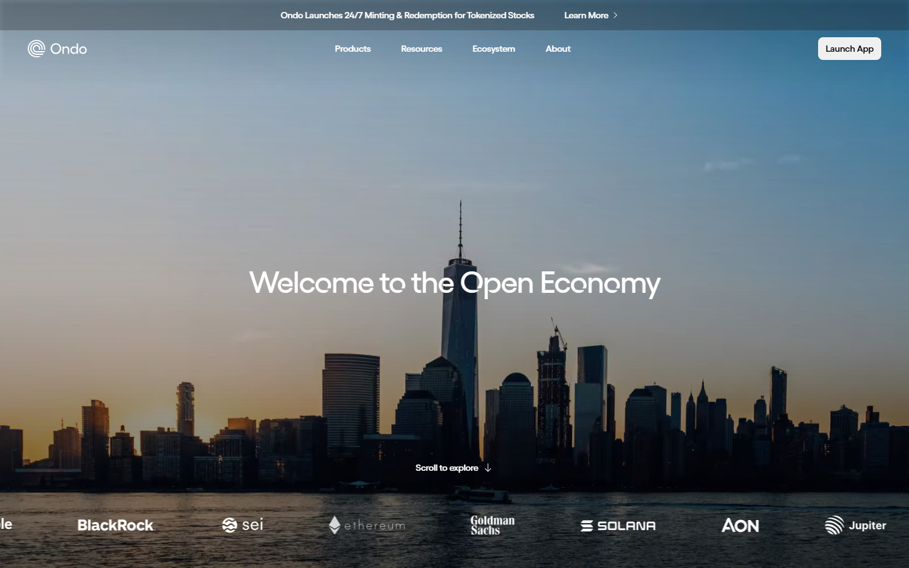
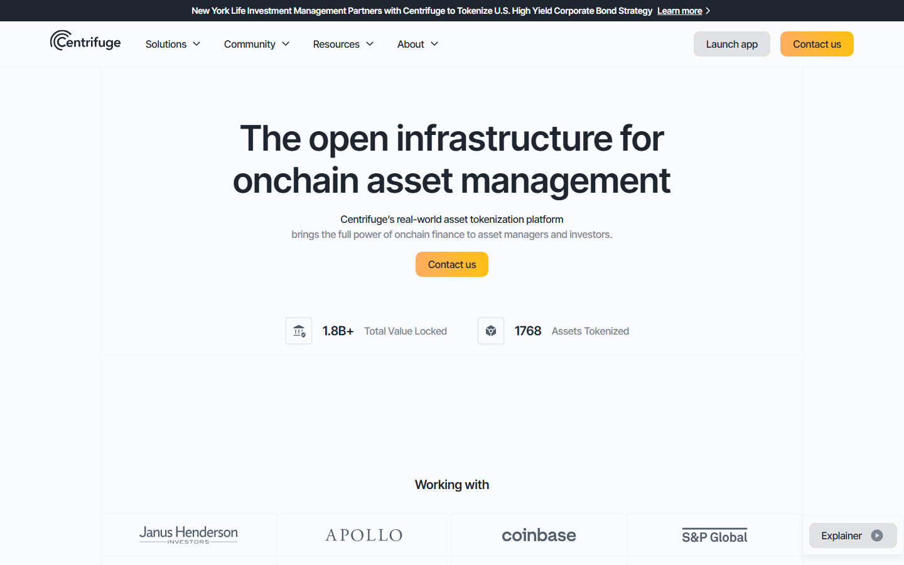
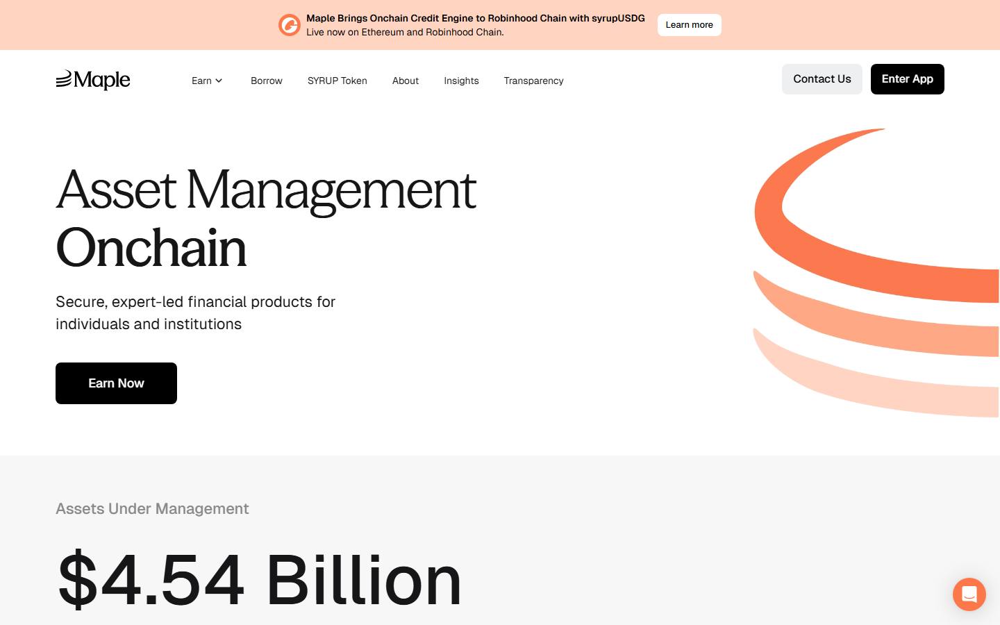
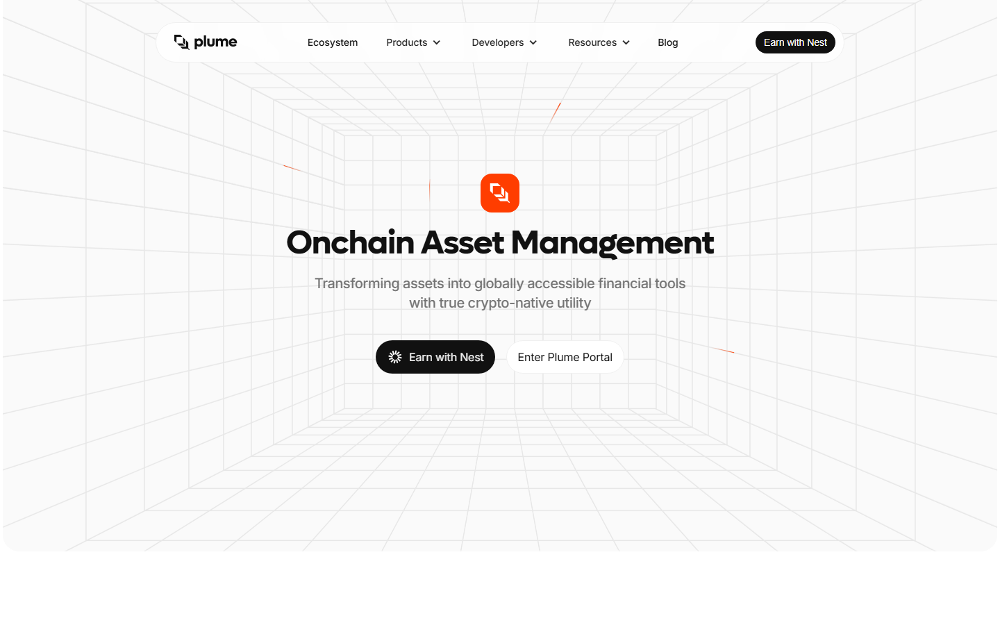
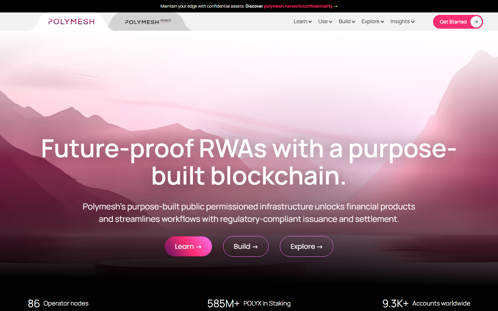

# Top RWA Crypto Projects in 2026: 10 Real-World Asset Tokens and Protocols to Know

- Meta title: `Top RWA Crypto Projects in 2026: 10 RWA Tokens to Know`
- Meta description: `Compare the top RWA (real-world asset) crypto projects in 2026, including Ondo, Chainlink, Maker, Centrifuge, and Plume. Learn how tokenization works.`
- Slug: `/projects/top-projects/top-rwa-crypto-projects-2026/`
- Primary keyword: `top rwa crypto projects 2026`
- Category: `Projects > Top Projects`
- Schema: `Article + ItemList`
- Last updated: `2026-07-16`

If you are following the real-world asset trend, the first thing to understand is that RWA is not one neat coin sector.

It is a stack. One project tokenizes Treasuries. Another verifies reserves. Another builds compliant rails. Another turns that yield into a DeFi product normal users can actually hold.

That is why beginner RWA lists often feel shallow. They mix treasury tokens, oracle rails, credit markets, and tokenization infrastructure as if they all do the same job.

This guide separates those roles and compares ten projects based on product maturity, practical use, and how easy it is to understand what the token is actually doing.

> **Why you can trust this guide**
> Based on live protocol documentation and public product pages reviewed July 2026. We directly loaded the public interfaces of Ondo, Centrifuge, Maple, Polymesh, and Plume, then cross-checked public Reddit discussions to see how real users describe access, yield, and risk.

> **Plain-language summary**
> If you are new to RWA, start with Ondo because the product is easiest to understand.
> Think of RWA like putting a normal financial product, such as a Treasury bill or a loan, into a token you can hold in a [crypto wallet](../09-best-crypto-wallets-for-beginners-2026.md).
> Do not buy an RWA coin just because it sounds safer than the rest of crypto. First check whether it gives you direct asset exposure, support infrastructure, or only a narrative.

## What we checked directly and what we did not

We directly checked public product pages, docs, and visible product positioning for the projects on this list.

We did not buy every token or complete every onboarding flow with real funds. That is why this article focuses on what each project clearly does, what users say about using it, and where the biggest beginner risks still sit.

## The top RWA crypto projects in 2026 at a glance

| Rank | Project | What it does | Main watchout |
|---|---|---|---|
| 1 | Ondo Finance | Tokenized Treasury access | Access restrictions and KYC |
| 2 | Chainlink | Verifies reserves and moves data between chains | Does not give direct Treasury exposure |
| 3 | Maker / Sky | Stablecoin system backed partly by real-world assets | Brand transition still confuses newcomers |
| 4 | Centrifuge | Credit pools backed by real business assets | Borrower default risk is real |
| 5 | Maple Finance | Lending markets for bigger borrowers | Less beginner-friendly |
| 6 | Plume Network | Blockchain built for tokenized asset apps | Early ecosystem risk |
| 7 | TokenFi | Retail-friendly tokenization tooling | Narrative can outrun product depth |
| 8 | Pendle | Yield trading for tokenized yield assets | Too complex for most beginners |
| 9 | Polymesh | Regulated securities blockchain | Specialized, permissioned design |
| 10 | Hashnote | Institutional onchain cash management | Limited retail accessibility |

## How we evaluated these RWA projects

Most beginners hear "RWA" and think every project is the same. That is the first mistake.

Think of this category like a shopping mall. One store sells the product. Another store verifies it is real. Another store built the building.

We ranked these projects using five questions:

- **Live assets**: is the product already used for real Treasury, credit, or securities activity?
- **Clear role**: does the token or protocol solve one distinct job?
- **Transparency**: can you verify what is backing the product?
- **Accessibility**: can a non-expert understand what they are buying or using?
- **Risk profile**: what breaks first if markets, regulation, or borrowers turn?

That last point matters most. RWA sounds safer than meme-coin speculation, but "backed by real assets" does not remove smart contract risk, legal risk, or liquidity risk.

---

## 1. Ondo Finance

[Ondo Finance](https://ondo.finance/) is the cleanest beginner entry point into RWA because the story is easy to explain: it wraps short-term US Treasury exposure into tokens people can hold in a crypto wallet.

Its best-known product is [USDY](https://ondo.finance/usdy), which is designed to pass through Treasury-style yield instead of just sitting flat like a normal dollar stablecoin such as the ones covered in our [stablecoin guide](../01-best-stablecoins-2026.md).

That makes Ondo useful for users who want dollar stability plus yield, but it also makes the compliance layer impossible to ignore. A recurring theme in [this r/defi discussion about what DeFi users still want from the market](https://www.reddit.com/r/defi/comments/1m95ps4/whats_your_defi_want/) is that access still feels more like regulated finance than open DeFi (crypto apps that run without a normal broker).

In that same thread, a user from the Caribbean complained that USDY geo-blocks and KYC hoops made it harder to access than meme coins. Another commenter in [r/CryptoCurrency's discussion of the new generation of stablecoins](https://www.reddit.com/r/CryptoCurrency/comments/16ibnhy/the_new_generation_of_stablecoins_analysis_of_the/) made the same point more neutrally, describing USDY as appealing precisely because Treasury yield is real, but still noting the jurisdiction and onboarding limits.

That tension is why Ondo ranks first here. It has one of the clearest products in the category, but it also shows exactly how fast RWA stops feeling open to everyone.

*Ondo Finance homepage, July 2026. The product story is unusually clear: bring Treasury-style yield onchain, then wrap it in a polished institutional surface.*

**Best for:** Users who want the simplest Treasury-backed RWA concept.
**Not ideal for:** Anyone expecting fully permissionless, region-free access.

---

## 2. Chainlink

[Chainlink](https://chain.link/) is on this list for infrastructure, not because it issues Treasury tokens itself.

If tokenized bonds, funds, or stablecoins are going to matter, someone has to verify reserves that sit outside the blockchain and move trusted data between chains. That is the layer where Chainlink keeps showing up through [Proof of Reserve](https://chain.link/proof-of-reserve) and CCIP.

Reddit discussion around Chainlink's RWA role is usually less about using a product and more about why the rails matter. In [one recent r/defi thread about which RWA projects are really bridging TradFi and DeFi](https://www.reddit.com/r/defi/comments/1ite1l4/what_rwa_projects_are_bridging_the_tradfi_and/), a commenter argued that regardless of who tokenizes the assets, they all end up needing Chainlink for verification.

That is the trade-off. Chainlink gives you infrastructure exposure to the theme, but not direct exposure to one Treasury or credit product.

*Chainlink homepage, July 2026. The RWA case here is not about a single tokenized fund. It is about the verification and messaging layer under many of them.*

**Best for:** Investors who want infrastructure exposure across the RWA stack.
**Not ideal for:** Users looking for direct Treasury or credit yield.

---

## 3. Sky Money / Maker

[Sky Money](https://sky.money/), formerly Maker, matters because it proved a large DeFi protocol could lean heavily on real-world collateral instead of pretending all yield had to come from pure crypto demand.

Its stablecoin system has spent years integrating Treasury exposure through vault structures and external managers. That makes the protocol one of the most battle-tested bridges between DeFi and offchain debt markets.

Public user discussion around Maker's RWA side is less emotional than Ondo's because most users touch the stablecoin first and the collateral strategy second. In [one MakerDAO thread asking where the treasury comes from](https://www.reddit.com/r/MakerDAO/comments/1b2h8m5/where_does_the_treasury_come_from/), commenters framed the RWA arm as evidence that big capital still sees Maker's collateralized debt model as one of the strongest in crypto. Another comment in [r/defi's RWA bridge discussion](https://www.reddit.com/r/defi/comments/1ite1l4/what_rwa_projects_are_bridging_the_tradfi_and/) described Maker as the biggest protocol in the sector by a wide margin.

The beginner problem is branding. If you arrive fresh, the Maker-to-Sky transition adds one more layer to an already technical system.

**Best for:** Users who want RWA exposure through a proven DeFi collateral engine.
**Not ideal for:** Beginners who want a single-purpose product with one easy message.

---

## 4. Centrifuge

[Centrifuge](https://centrifuge.io/) is where the RWA story shifts from government debt into private credit.

Instead of packaging Treasuries, it tokenizes assets like invoices, trade receivables, and other borrower-backed pools so DeFi capital can fund real businesses onchain.

That makes the yield story more interesting, but also more fragile. In [an older r/defi thread about high-yield staking projects](https://www.reddit.com/r/defi/comments/s3ker6/the_best_high_yielding_staking_projects/), one user said they liked Centrifuge because of the mission and the partnership overlap with Maker and Aave, while still noting that some pools were limited to accredited investors. That is a useful signal because it shows both the appeal and the gatekeeping.

The token side matters too. Centrifuge has long used loan-related fee flows and CFG incentives to coordinate the network, which gives the coin a role beyond simple speculation.

*Centrifuge homepage, July 2026. This is one of the clearest examples of real credit markets being rebuilt onchain instead of just wrapping a Treasury fund.*

**Best for:** Users who want exposure to private credit rather than only government debt.
**Not ideal for:** Beginners who are not comfortable evaluating borrower and default risk.

---

## 5. Maple Finance

[Maple Finance](https://maple.finance/) sits close to Centrifuge in theme, but the feel is different. It is a cleaner lending market for larger borrowers, not a retail-first product.

The platform is built around managed lending pools, structured credit, and counterparties that already look more like professional firms than crypto hobbyists.

That professional focus is exactly why Maple can be useful in an RWA portfolio. It gives you exposure to a part of crypto lending that is trying to look disciplined and credit-aware instead of hype-driven.

The risk is obvious in public discussion. [Reddit coverage of Maple Finance's $54 million sour-debt episode](https://www.reddit.com/r/CryptoCurrency/comments/zjoy0a/maple_finances_54m_of_sour_debt_shows_risks_of/) became a reminder that institutional branding does not erase underwriting risk. When unsecured or lightly protected lending goes wrong, the losses are very real.

*Maple Finance page, July 2026. The interface feels more like a professional credit portal than a retail DeFi dashboard, which is both the attraction and the barrier.*

**Best for:** Users who want exposure to institutional-style onchain credit.
**Not ideal for:** Casual retail users expecting simple deposit-and-earn flows.

---

## 6. Plume Network

[Plume Network](https://www.plumenetwork.xyz/) is not the most proven project on this list, but it is one of the clearest bets on where the sector is going.

Most blockchains are general-purpose and tell RWA teams to bolt compliance and custody on later. Plume is trying to make those features native so builders can launch tokenized assets without stitching together the whole stack themselves.

That is why the project gets attention from people who care more about the future plumbing of RWA than buying one specific yield token today.

The flip side is maturity. Plume is still earlier than Ondo, Maker, or Chainlink in terms of market proof, so the upside case depends on ecosystem execution rather than already-dominant live assets.

*Plume Network page, July 2026. The pitch is infrastructure first: if RWA grows, builders may want a chain that was designed around compliance from day one.*

**Best for:** Developers and investors who want an early infrastructure bet.
**Not ideal for:** Users who want mature, already-scaled RWA cash flows today.

---

## 7. TokenFi

[TokenFi](https://tokenfi.com/) aims at the retail edge of tokenization.

Where Ondo and Maple feel more corporate, TokenFi sells the idea that launching or tokenizing an asset should eventually become a simpler product workflow instead of a custom legal-and-engineering project.

That is attractive because tokenization only scales if the tooling becomes easier. But the narrative can run ahead of reality here. Public Reddit chatter is still more about potential and ecosystem growth than many concrete end-user case studies.

For that reason, TokenFi belongs lower in the ranking. The concept is important, and the no-code angle is useful, but it is still easier to picture the pitch than to find deep proof of broad adoption.

**Best for:** Users who want exposure to the tokenization-tooling narrative.
**Not ideal for:** Investors who want the strongest evidence of live institutional traction.

---

## 8. Pendle

[Pendle](https://www.pendle.finance/) is not an RWA issuer, but it becomes relevant the moment tokenized Treasury yield starts behaving like something traders want to split, price, and hedge.

Its core idea is powerful: separate the principal from the yield so users can lock rates, speculate on future yield, or reshape exposure from assets like tokenized Treasuries.

Reddit discussion around Pendle usually comes from DeFi users who already think in yield curves, not beginners. That alone is a warning. If the base RWA product already feels technical, Pendle adds another layer on top.

Still, it deserves a place here because yield-bearing RWA tokens become much more interesting once a protocol can turn them into tradable rate instruments.

**Best for:** Advanced DeFi users who understand yield trading.
**Not ideal for:** Beginners who just want to hold a Treasury-backed asset and collect yield.

---

## 9. Polymesh

[Polymesh](https://polymesh.network/) is the most regulation-first chain on this list.

It was built specifically for regulated securities, which means identity checks, permissioning, and compliance are not awkward add-ons. They are part of the design.

That makes it different from almost every DeFi-native project. In [a PolymathNetwork thread on POLY and POLYX](https://www.reddit.com/r/PolymathNetwork/comments/rqja36/poly_and_polyx/), users repeatedly explain the project by stressing that security tokens mean actual ownership claims, not just another utility coin. Other commenters in [the broader PolymathNetwork community](https://www.reddit.com/r/PolymathNetwork/) describe Polymesh as a hidden infrastructure play precisely because it is trying to solve the back-end compliance burden directly.

The limitation is also the selling point: this is specialized infrastructure. If you prefer open crypto apps, Polymesh will feel restrictive by design.

*Polymesh homepage, July 2026. The chain is designed for compliant securities issuance, so the permissioned structure is not an accident. It is the core product choice.*

**Best for:** Institutions and investors focused on compliant securities tokenization.
**Not ideal for:** Users who prioritize censorship resistance and open participation.

---

## 10. Hashnote

[Hashnote](https://www.hashnote.com/) represents the institutional cash-management end of the category.

Its role is less about retail speculation and more about putting short-term cash into blockchain-based structures that still look acceptable to funds, treasuries, and professional allocators.

That is why public user commentary is thinner here than for Ondo or Pendle. Most open discussion is around market structure and acquisitions rather than small investors describing daily use.

Even so, Hashnote belongs on the list because the RWA sector is not only about coins retail traders can chase. A large part of the category is quietly about where bigger firms park cash once blockchain settlement starts to look normal.

**Best for:** Users tracking the institutional cash-management side of RWA.
**Not ideal for:** Retail users who want open access and active community participation.

---

## How to explore the RWA stack without fooling yourself

RWA projects often look safer than the rest of crypto because the underlying story involves bonds, invoices, or regulated securities instead of pure hype.

That can still create false comfort.

If you buy Ondo, your risk is not just "Treasuries are safe." It is also smart contracts, issuer structure, access restrictions, and liquidity conditions.

If you buy Centrifuge or Maple exposure, your risk moves toward borrower quality and underwriting discipline.

If you buy Chainlink, Plume, or Polymesh, you are making more of an infrastructure bet than a direct asset-yield bet.

The sector makes more sense once you stop asking "Which RWA coin wins?" and start asking "Which part of this stack am I actually buying?"

---

## Which RWA crypto project should beginners start with?

If you want the easiest product story, start with **Ondo**.

If you want infrastructure exposure instead of one issuer, look at **Chainlink**.

If you want battle-tested DeFi with major real-world collateral underneath, **Sky/Maker** is still one of the most important names in the space.

If you want credit-market exposure, compare **Centrifuge** and **Maple** carefully, because the yield is different and so is the risk.

---

## FAQ

### What is an RWA crypto project?

It is a crypto project that helps bring real-world assets like Treasuries, credit, real estate, or securities onto blockchain rails, either by issuing them, verifying them, or building the infrastructure around them.

### Is Ondo the best RWA project for beginners?

It is one of the easiest to understand because the product is straightforward: Treasury-backed yield onchain. The main drawback is access restrictions.

### Why is Chainlink on an RWA list if it does not issue Treasury tokens?

Because tokenized assets still need trusted reserve verification and cross-chain messaging. Chainlink sits underneath many of those workflows.

### Are RWA projects safer than other crypto projects?

Not automatically. The underlying assets may be safer, but the legal wrappers, issuers, liquidity, and smart contracts still create risk.

### What is the difference between Centrifuge and Maple?

Centrifuge is more associated with tokenized credit pools and asset-backed borrowing structures, while Maple feels more like a managed institutional lending marketplace.

---

## Sources

- [Ondo Finance](https://ondo.finance/)
- [Ondo USDY](https://ondo.finance/usdy)
- [Chainlink](https://chain.link/)
- [Chainlink Proof of Reserve](https://chain.link/proof-of-reserve)
- [Sky Money](https://sky.money/)
- [Centrifuge](https://centrifuge.io/)
- [Maple Finance](https://maple.finance/)
- [Plume Network](https://www.plumenetwork.xyz/)
- [TokenFi](https://tokenfi.com/)
- [Pendle](https://www.pendle.finance/)
- [Polymesh](https://polymesh.network/)
- [Hashnote](https://www.hashnote.com/)
- [r/defi - What's your defi want??](https://www.reddit.com/r/defi/comments/1m95ps4/whats_your_defi_want/)
- [r/CryptoCurrency - The new generation of stablecoins](https://www.reddit.com/r/CryptoCurrency/comments/16ibnhy/the_new_generation_of_stablecoins_analysis_of_the/)
- [r/defi - What RWA projects are bridging the TradFi and DeFi gap?](https://www.reddit.com/r/defi/comments/1ite1l4/what_rwa_projects_are_bridging_the_tradfi_and/)
- [r/MakerDAO - Where Does The Treasury Come From?](https://www.reddit.com/r/MakerDAO/comments/1b2h8m5/where_does_the_treasury_come_from/)
- [r/MakerDAO - MakerDAO invests $50 mln in RWA and plans to invest more](https://www.reddit.com/r/MakerDAO/comments/16eu1x2/makerdao_invests_50_mln_in_rwa_and_plans_to/)
- [r/defi - The best high yielding staking projects](https://www.reddit.com/r/defi/comments/s3ker6/the_best_high_yielding_staking_projects/)
- [r/CryptoCurrency - Maple Finance's $54M of sour debt shows risks](https://www.reddit.com/r/CryptoCurrency/comments/zjoy0a/maple_finances_54m_of_sour_debt_shows_risks_of/)
- [r/PolymathNetwork - POLY and POLYX?](https://www.reddit.com/r/PolymathNetwork/comments/rqja36/poly_and_polyx/)
- [r/PolymathNetwork - community discussion on Polymesh infrastructure](https://www.reddit.com/r/PolymathNetwork/)
