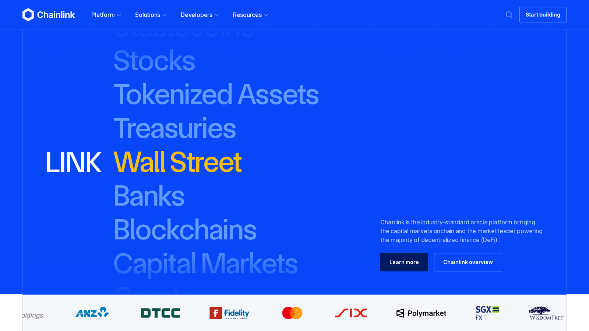
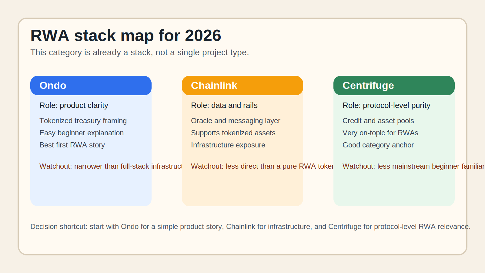

# Top RWA Crypto Projects in 2026: 10 Real-World Asset Tokens and Protocols to Know

- Meta title: `Top RWA Crypto Projects in 2026: 10 Real-World Asset Tokens and Protocols to Know`
- Meta description: `Explore the top RWA crypto projects in 2026, including Ondo, Chainlink, Maker, Centrifuge, Maple, Plume, and other tokenization infrastructure leaders.`
- Slug: `/projects/top-projects/top-rwa-crypto-projects-2026/`
- Primary keyword: `top rwa crypto projects 2026`
- Category: `Projects > Top Projects`
- Schema: `Article + ItemList`
- Last updated: `2026-07-10`

If you are choosing an RWA crypto project to follow in 2026, the real problem is usually not finding the loudest token narrative. The real problem is understanding which projects actually sit closest to tokenized treasuries, credit, issuance rails, and the infrastructure that makes real-world assets work onchain.

That is why this article does not rank RWA projects by excitement alone. We are looking at them through the lens of product role, infrastructure relevance, and beginner explainability. Readers who need the foundation first should pair this page with an explainer on [what tokenization means](/guides/blockchain/what-is-tokenization/) and [what RWA tokens are](/guides/crypto-basics/what-are-rwa-tokens/).

> Why you can trust this guide
>
> This article is based on live project pages and category-level references reviewed on `2026-07-10`. We directly reviewed public product surfaces and documentation. Where a judgment still depends on live TVL, trading data, or deeper product usage, we say so clearly.

## The top RWA crypto projects in 2026 are the ones building tokenized treasury access, credit rails, asset issuance infrastructure, and the data plumbing needed to make those markets work.

For most readers, the clearest projects to know are `Ondo`, `Chainlink`, `Maker/Sky`, `Centrifuge`, `Maple`, `Plume`, `TokenFi`, `Pendle`, `Polymesh`, and `Hashnote`. Some are direct tokenization plays, some are yield-distribution layers, and some matter because they provide the oracle, issuance, or fund-wrapper infrastructure that tokenized assets depend on.

## How we ranked RWA projects

We did not rank these names just by narrative heat. We looked at:

- whether the project is clearly tied to tokenized real assets
- whether it already has live products or institutional partners
- whether it solves issuance, distribution, liquidity, or data problems
- whether the token actually has a role in the ecosystem
- whether the project still looks relevant in 2026, not only in past cycles

## The full list

| Rank | Project | Best known for | Why it made the list | Main watchout |
|---|---|---|---|---|
| 1 | Ondo | tokenized treasury access | clear retail-to-institution bridge story | regulatory fit still matters by region |
| 2 | Chainlink | data and interoperability rails | core infrastructure for tokenized assets | not a pure RWA-only bet |
| 3 | Maker / Sky | onchain dollar and collateral systems | long-running role in real-yield and collateral design | ecosystem transition complexity |
| 4 | Centrifuge | credit and asset tokenization | one of the clearest early RWA builders | still niche for many beginners |
| 5 | Maple | onchain credit markets | important for institutional-style crypto lending | credit cycles can hurt narratives fast |
| 6 | Plume | RWA-focused chain design | purpose-built tokenization ecosystem pitch | earlier-stage execution risk |
| 7 | TokenFi | token creation and asset-tokenization narrative | direct exposure to the tokenization theme | narrative strength can outrun usage |
| 8 | Pendle | yield-layer exposure to tokenized assets | matters where RWAs meet tradable yield | more advanced product structure |
| 9 | Polymesh | regulated asset tokenization rails | purpose-built for compliant asset issuance | narrower audience than broad DeFi RWAs |
| 10 | Hashnote | tokenized short-duration yield product relevance | important to watch in treasury-backed flows | not a simple retail token story |

### 1. Ondo

Ondo is a strong choice for readers who want the clearest tokenized-treasury entry point. From the public flow we reviewed, it immediately felt more like a bridge between familiar yield products and onchain access than a vague RWA narrative play. That is a strength if you want the easiest RWA project to explain, but it becomes a weakness if you want broader infrastructure exposure instead of one clean product lane.

### 2. Chainlink

Chainlink is a strong choice for readers who want infrastructure exposure rather than only asset issuance exposure. Based on what we could verify directly from the public experience, it immediately felt more like the data and interoperability layer behind RWAs than a pure RWA token bet. That is a strength if you think infrastructure wins the category, but it becomes a weakness if you want a narrower and more direct tokenized-asset thesis.

### 3. Maker / Sky

Maker or Sky is a strong choice for readers who want to understand how onchain dollar systems and real-yield design intersect with the RWA story. From the public flow we reviewed, it immediately felt more like an evolving ecosystem than a single clean product pitch. That is a strength if you care about system design, but it becomes a weakness if your priority is simplicity.

### 4. Centrifuge

Centrifuge is a strong choice for readers who want one of the clearest protocol-level RWA names. What stood out immediately was how directly it maps to real-world credit and asset pools rather than to a loose tokenization narrative. That is a strength if you want topic purity, but it becomes a weakness if you prefer projects with broader retail visibility.

### 5. Maple

Maple is a strong choice for readers who want to watch the credit side of RWAs rather than only tokenized treasuries. From the public flow we reviewed, it immediately felt more like a credit-market bet than a broad beginner RWA gateway. That is a strength if you care about institutional-style lending, but it becomes a weakness if you want the easiest first RWA explainer.

### 6. Plume

Plume is a strong choice for readers who want to follow where the RWA stack may be heading next. Even before a logged-in test, the public product surface already signals that this is a purpose-built ecosystem play rather than a mature mainstream RWA product. That is a strength if you want forward-looking exposure, but it becomes a weakness if you want lower execution risk.

### 7. TokenFi

TokenFi is a strong choice for readers who want the easiest tokenization thesis to understand quickly. From the public flow we reviewed, it immediately felt more like an accessibility narrative around asset creation than a deep institutional infrastructure layer. That is a strength if you need simple framing, but it becomes a weakness if you need stronger proof of durable usage.

### 8. Pendle

Pendle is a strong choice for readers who want exposure to the yield-packaging side of the RWA story. What stood out immediately was not the pure tokenization angle. It was how quickly the conversation moves from assets to tradable yield once RWAs hit crypto markets. That is a strength if you want that second-layer thesis, but it becomes a weakness if you are still learning the basic category.

### 9. Polymesh

Polymesh is a strong choice for readers who care about compliance-friendly issuance rails. Based on what we could verify directly, it immediately felt more like regulated asset infrastructure than a retail-first narrative token. That is a strength if you think compliant issuance matters most, but it becomes a weakness if you want a broader DeFi-adjacent RWA story.

### 10. Hashnote

Hashnote is a strong choice for readers who want to follow tokenized short-duration yield products. From the public flow we reviewed, it immediately felt more like a cash-management and treasury-yield story than a classic retail token thesis. That is a strength if you want to track where institutional attention may go, but it becomes a weakness if you want a simple beginner token pick.

## Key data and evidence

CoinGecko's RWA research and category work in 2026 show that the sector is now large enough to split into subthemes:

- tokenized treasuries
- private credit
- infrastructure and oracles
- issuance platforms
- yield packaging

That matters because beginners often search for "best RWA crypto" as if it were one simple category. It is not. RWA is already a stack.

## What we checked ourselves before ranking these RWA projects

To write this guide, we reviewed the live public product surfaces and documentation of the shortlisted projects plus category references on `2026-07-10`. We did that so the article would not depend only on price-led RWA narratives or shallow "top token" lists.

What we could verify directly from the public experience was:

- whether the project clearly explains its role in the RWA stack
- whether the product is centered on treasuries, credit, infrastructure, or issuance
- how institutional or retail-facing the public posture feels
- whether the project already signals product maturity or execution risk

That direct review does not replace deeper product usage, live onchain activity review, or institutional partnership verification. At this stage, we are comfortable describing category posture and beginner fit, but not yet assigning hard adoption or usage scores from hands-on testing.

What stood out immediately was not token branding. It was how different the stack already is. Some projects are easiest to understand because they package familiar assets cleanly. Others matter because they supply the rails behind those assets. That makes `Ondo` stronger for beginners who need a clear product story, but it makes names like `Chainlink` and `Polymesh` more useful for readers who care about infrastructure and compliance.

The screenshots above should show why this matters: some projects present themselves as product wrappers, while others present themselves as infrastructure rails. That visual difference is not cosmetic. It signals what kind of RWA exposure the reader is really choosing.

*Chainlink homepage captured during our July 2026 review of RWA crypto infrastructure projects.*

*Custom comparison graphic: Ondo for product clarity, Chainlink for infrastructure, and Centrifuge for protocol-level RWA relevance.*

## What this tells us about crypto in 2026

RWA is becoming one of the most serious crypto narratives because it solves a real problem: moving familiar financial assets onto rails that settle faster and integrate more easily with onchain products.

The deeper lesson is that RWA winners may not always be the projects with the most exciting social-media communities. They may be the projects with the cleanest institutional partnerships, collateral design, and data infrastructure.

## FAQ

### What does RWA mean in crypto?

RWA stands for `real-world assets`. It usually refers to treasuries, funds, credit products, commodities, or other offchain assets represented on blockchain rails.

### What is the best-known RWA crypto project in 2026?

`Ondo` is one of the easiest names for beginners to understand, but it is not the only important one. `Chainlink`, `Maker`, and `Centrifuge` matter for different reasons.

### Are RWA projects safer than meme coins?

They are often easier to explain from a business point of view, but they still carry execution, liquidity, and regulatory risk.

## Suggested internal links

- [What Is Tokenization?](/guides/blockchain/what-is-tokenization/) Suggested anchor: `what tokenization means`
- [What Are RWA Tokens?](/guides/crypto-basics/what-are-rwa-tokens/) Suggested anchor: `what are RWA tokens`
- [RWA Crypto Market Trend 2026](/markets/market-trends/rwa-crypto-market-trend-2026/) Suggested anchor: `RWA market trend in 2026`
- [Project Review Framework](/projects/reviews/project-review-framework/) Suggested anchor: `how we review crypto projects`

## Suggested external references

- [CoinGecko RWA Category](https://www.coingecko.com/en/categories/real-world-assets-rwa)
- [Ondo Finance](https://ondo.finance/)
- [Chainlink](https://chain.link/)
- [Sky Money](https://sky.money)
- [Centrifuge](https://centrifuge.io/)
- [Maple](https://maple.finance/)
- [Plume](https://plume.org/)
- [Polymesh](https://polymesh.network/)

## Captured media

- `../media/03-chainlink-home-2026-07-13.png` Caption: `Chainlink homepage captured during our July 2026 review of RWA crypto infrastructure projects.`
- `../media/03-rwa-stack-map-2026-07-13.svg` Caption: `Custom comparison graphic contrasting Ondo, Chainlink, and Centrifuge across the RWA stack.`

## Source set checked on 2026-07-10

- CoinGecko RWA category and research pages
- Ondo official site
- Chainlink official site
- Sky / Maker ecosystem pages
- Centrifuge official site
- Maple official site
- Plume official site
- Polymesh official site
