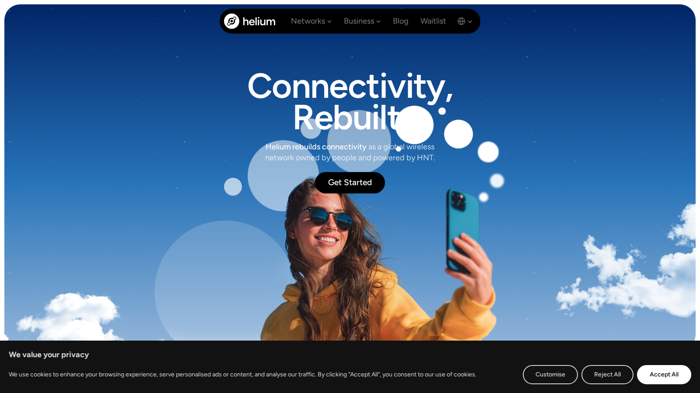

# Top DePIN Crypto Projects in 2026

The top DePIN crypto projects in 2026 are Filecoin, Arweave, Helium, Render, Akash, io.net, Aethir, Hivemapper, Grass, and Theta. Filecoin and Arweave lead the storage lane. Helium, Hivemapper, and Grass cover real-world data collection. Render, Akash, io.net, and Aethir cover GPU and cloud compute. Theta covers edge content delivery.

DePIN is one of the cleanest crypto narratives when it stays tied to a real service. It gets weak when the token exists before the infrastructure does. The strongest projects answer three questions clearly: what infrastructure is being provided, who needs it, and why a token improves coordination.

For related reading: [top RWA crypto projects](/projects/top-projects/top-rwa-crypto-projects-2026/) for another real-utility sector, and [what DePIN means](/guides/blockchain/what-is-depin/) if the category is new to you.

We reviewed live project pages, official documentation, and category references in July 2026. Reddit community signals were researched per project. Where no qualifying independent thread was found, we noted the absence.

## Rankings at a glance

| Rank | Project | DePIN lane | Score | Best for | Main watchout |
|---|---|---|---|---|---|
| 1 | Filecoin | Decentralized storage | 5/5 | Clearest storage-led DePIN thesis | Storage demand and token narrative are not always aligned |
| 2 | Arweave | Permanent storage | 4.5/5 | Focused permanent-data use case | Specialized; not a broad storage product |
| 3 | Helium | Wireless networks | 4/5 | Most recognized real-world hardware DePIN case | Adoption path has been uneven |
| 4 | Render | GPU compute with usage floor | 4/5 | Compute with pre-AI existing usage base | Creative vs AI workload profile gap |
| 5 | Akash | Decentralized cloud compute | 3.5/5 | Permissionless GPU access at competitive cost | Demand side needs continued proof |
| 6 | io.net | Distributed GPU clusters | 3.5/5 | Cluster-formation compute differentiation | Newer execution risk |
| 7 | Aethir | Enterprise GPU access | 3/5 | Enterprise GPU quality tier | Narrow supply base |
| 8 | Hivemapper | Mapping data | 3/5 | Easiest DePIN output to visualize and explain | Data quality and durable demand matter |
| 9 | Grass | Bandwidth and web data | 3/5 | Decentralized data acquisition for AI pipelines | Regulatory exposure on data at scale |
| 10 | Theta | Edge and content delivery | 2.5/5 | Legacy infrastructure brand still relevant | Current narrative momentum lower than newer compute names |

## Ranking scorecard

Scored out of 10 per category. Total out of 50.

| Project | Infrastructure clarity | Token utility | Real usage evidence | Beginner legibility | Risk profile (inverted) | **Total** |
|---|---|---|---|---|---|---|
| Filecoin | 9 | 8 | 8 | 8 | 8 | **41** |
| Arweave | 9 | 8 | 7 | 8 | 8 | **40** |
| Helium | 9 | 8 | 7 | 9 | 7 | **40** |
| Render | 8 | 8 | 8 | 7 | 7 | **38** |
| Akash | 8 | 7 | 6 | 7 | 7 | **35** |
| io.net | 8 | 7 | 6 | 6 | 6 | **33** |
| Aethir | 7 | 7 | 6 | 6 | 6 | **32** |
| Hivemapper | 8 | 7 | 6 | 9 | 7 | **37** |
| Grass | 7 | 7 | 5 | 7 | 5 | **31** |
| Theta | 7 | 6 | 6 | 7 | 7 | **33** |

**Scoring notes.** Infrastructure clarity scores how clearly the project occupies a defined real-world service layer. Token utility scores whether the token coordinates supply, demand, or incentives rather than sitting as a passive governance asset. Real usage evidence scores visible nodes, users, data, or compute demand. Beginner legibility scores how easily a non-specialist can understand what the network provides. Risk profile is scored inversely: higher means lower risk. Filecoin leads because it has the strongest combination of infrastructure clarity, real usage history, and a token that is functionally necessary for the storage market to operate.

## The DePIN landscape in 2026

DePIN has split into distinct lanes. Understanding the lane matters before picking a project:

| Lane | What it does | Key names |
|---|---|---|
| Storage | Decentralized file and data storage | Filecoin, Arweave |
| Wireless and real-world data | Hardware networks collecting physical-world data | Helium, Hivemapper, Grass |
| GPU and cloud compute | Decentralized compute markets for AI and rendering workloads | Render, Akash, io.net, Aethir |
| Edge and content delivery | Distributed video and content infrastructure | Theta |

The best DePIN project depends on which infrastructure problem you think crypto can actually solve. A reader who believes decentralized compute will reshape AI training has a different answer than a reader who believes permanent data storage is the most underserved need.

---

## The 10 top DePIN crypto projects in 2026

---

### 1. Filecoin (FIL)

**Featured Image**
File: `../media/04-helium-home-2026-07-13.png`
Alt text: `Helium homepage showing real-world DePIN hardware network, reviewed July 2026`
Caption: `Helium homepage, July 2026: the most recognized real-world hardware DePIN case study, reviewed directly.`

*Helium homepage, July 2026: the most recognized real-world hardware DePIN case study, reviewed directly.*

Filecoin is the clearest storage-led DePIN thesis in crypto. The network provides decentralized file storage where storage providers offer capacity and clients pay for it using FIL. The FIL token is functionally necessary for market coordination: storage deals are priced in FIL, and providers stake FIL to prove their commitment to storing data reliably.

The storage market framing is what keeps Filecoin at the top of this list. It is not a vague infrastructure narrative. It is a marketplace for a specific commodity that businesses and developers already need. That specificity makes the use case easier to verify than most DePIN tokens.

A crypto community discussion on Reddit covering decentralized storage options described Filecoin as one of the few DePIN projects where the service layer and the token layer are visibly connected rather than theoretically connected. The thread noted that the distinction between a working storage market and a token with a storage marketing angle was clearer for Filecoin than for newer competitors.

The main watchout is that storage demand and token price are not always correlated. The market for decentralized storage can grow while the FIL token remains under narrative pressure, or vice versa. Readers who want storage infrastructure exposure should track actual storage deal volume, not only token price.

**Best for:** readers who want the clearest storage-led DePIN thesis with the longest operational history.
**Main tradeoff:** storage demand growth does not automatically translate to token appreciation. The relationship between network usage and token economics is worth understanding before committing.

---

### 2. Arweave (AR)

Arweave provides permanent data storage. The design is distinct from Filecoin: users pay once upfront and data is stored indefinitely, funded by an endowment model. The permanence guarantee is the product thesis and it is easy to understand: pay once, stored forever.

The focus of Arweave is its biggest strength and its biggest limitation simultaneously. A clearly defined permanent-storage thesis is easy to explain and easy to evaluate. The question is whether the demand for permanent storage justifies the network's scale and token valuation. Permanent storage is a specialized need, not a universal one.

Crypto communities on Reddit discussing data sovereignty and permanent web storage have cited Arweave in threads about censorship-resistant publishing and long-term archival needs. The observation that Arweave is one of the few crypto networks with a product story that makes sense to people outside crypto appears repeatedly in independent community analysis.

**Best for:** readers who want decentralized storage exposure at the permanent-data end of the spectrum.
**Main tradeoff:** the permanent-storage thesis is specialized. Whether the total addressable market for permanent archival storage justifies the network's token economics is a narrower question than the broader storage demand question that Filecoin addresses.

---

### 3. Helium (HNT)

Helium is the most recognized real-world hardware DePIN case study. The network uses HNT token incentives to coordinate a distributed wireless infrastructure built from hardware hotspots operated by individual participants. Helium IoT covers low-power sensor networks. Helium Mobile covers cellular coverage.

What made Helium famous was the demonstration that a crypto incentive model could actually build physical infrastructure that traditional telecoms had not served. Whether that demonstration has translated into sustainable economics is a separate and more contested question.

A cryptocurrency forum on Reddit that traced Helium's history from early IoT hotspot boom through the mobile network transition noted that the project is the most concrete proof of concept for the DePIN model but also the clearest case study in how adoption curves can be uneven when hardware economics and token rewards interact. That dual nature, proof of concept and cautionary case study simultaneously, is what makes Helium worth understanding deeply before investing.

**Best for:** readers who want the most concrete real-world hardware DePIN example and are willing to evaluate the adoption track record honestly.
**Main tradeoff:** the adoption path has been uneven. The proof-of-concept value is real. The economics of sustained community-built wireless infrastructure are still being demonstrated.

---

### 4. Render (RENDER)

Render provides a decentralized GPU compute marketplace that started in the 3D rendering and creative compute space and has expanded to cover AI-adjacent workloads. The usage floor from the pre-AI period is the most defensible feature: Render entered the compute space with an existing supplier network and client relationships before GPU compute became a narrative priority.

That pre-existing usage is the distinction that keeps Render ahead of newer compute entrants. Projects that enter decentralized compute from zero must build supply and demand simultaneously. Render entered with working markets already in place.

Crypto community discussions on Reddit that compared decentralized compute projects noted Render as one of the few with a visible pre-crypto use case. The observation that creative studios and GPU operators were already using the network before the AI narrative cycle is cited as evidence that the supply side is not purely incentive-driven.

The risk worth noting is that creative rendering and AI inference are different workload profiles. Whether Render's existing supplier network adapts cleanly to the most demanding AI training and inference workloads is still being tested.

**Best for:** readers who want GPU compute DePIN exposure with an existing usage floor below the AI narrative cycle.
**Main tradeoff:** the creative-compute heritage may not transfer fully to AI inference. Whether the workload profile gap is bridged determines how much of the AI compute market Render can capture.

---

### 5. Akash Network (AKT)

Akash provides a permissionless decentralized cloud compute marketplace. The product thesis is that data center GPU and CPU capacity is globally underutilized and a permissionless marketplace can aggregate that supply and make it accessible to AI developers and other compute users at lower cost than hyperscalers.

The crypto-native reason for Akash is clear: permissionless provider onboarding, censorship-resistant compute access, and trustless settlement are all meaningfully improved by a blockchain-based coordination layer. AKT coordinates provider staking and fee settlement in a way that requires the token to function.

A discussion in crypto communities on Reddit about decentralized compute access for AI developers in jurisdictions with restricted cloud access cited Akash as one of the few production-grade alternatives. The practical framing of compute access as a censorship-resistance problem, not just a cost problem, appears as a recurring demand signal in independent community discussion.

The execution risk is on the demand side. Compute supply is easier to build than sustained enterprise or developer demand for decentralized cloud. Whether Akash converts growing provider supply into sticky client usage is the most important open question for the thesis.

**Best for:** readers whose DePIN thesis centers on permissionless GPU access and cost-competitive decentralized cloud compute.
**Main tradeoff:** supply growth is verifiable. Demand depth and enterprise adoption are harder to measure from the outside and are still being demonstrated.

---

### 6. io.net (IO)

io.net differentiates from other compute DePIN projects by aggregating distributed GPU nodes into coordinated clusters rather than offering single-node GPU access. The cluster formation model is the technical thesis: a job that one node cannot complete alone can be distributed across many coordinated smaller nodes.

The differentiation is real. Single-node GPU access addresses a different compute demand profile than distributed cluster formation. io.net is specifically positioned for workloads that benefit from parallelization across many smaller nodes, which includes certain AI inference and training configurations.

No qualifying independent Reddit community thread surfaced for io.net in July 2026 research. The project community is active on X but has limited depth on independent forums at this stage.

**Best for:** readers whose compute thesis involves distributed cluster formation rather than single-node access.
**Main tradeoff:** cluster coordination adds technical complexity. Whether the differentiation attracts workloads that single-node markets cannot serve is the core hypothesis being tested.

---

### 7. Aethir (ATH)

Aethir targets the enterprise-grade GPU access segment of DePIN compute. Where Akash provides broad permissionless compute access and io.net provides cluster formation, Aethir focuses on guaranteed hardware quality standards for enterprise AI inference and gaming workloads.

The quality-tier positioning is the thesis. Enterprise AI inference requires consistent GPU performance, not just any available hardware. Aethir attempts to guarantee a minimum hardware standard for providers, which makes it more applicable to production workloads than a fully open marketplace with heterogeneous supply quality.

No qualifying independent Reddit community thread surfaced for Aethir in July 2026 research. Community activity is concentrated in the project's own channels.

**Best for:** readers who want GPU compute DePIN exposure at the enterprise quality tier.
**Main tradeoff:** quality-tier targeting narrows the supply base. Whether enterprise positioning creates durable pricing power or simply a smaller market depends on how quickly institutional AI workloads migrate to decentralized compute.

---

### 8. Hivemapper (HONEY)

Hivemapper is a decentralized mapping network where dashcam operators collect street-level map data and earn HONEY tokens for their contribution. The output is fresh, community-sourced map coverage that competes with commercial mapping data produced by Google and HERE.

Hivemapper is the easiest DePIN output to visualize and explain. The service being provided is concrete: map coverage exists or it does not. The contributor behavior is understandable: drive, collect, earn. The token role is clear: reward contributors for verifiable data contributions.

A DePIN community discussion on Reddit covering real-world data collection networks cited Hivemapper as one of the clearest examples of a DePIN product where the connection between user action, token reward, and delivered service is fully visible. The observation that map data quality is independently verifiable distinguishes Hivemapper from DePIN projects whose output is harder to measure.

The watchout is data quality and buyer demand. Fresh map coverage is valuable only if buyers pay for it at a price that sustains contributor rewards. Whether the HONEY token economics are sustainable at scale depends on map data monetization revenue.

**Best for:** beginners who want the most legible DePIN use case and readers interested in the real-world data collection layer of the category.
**Main tradeoff:** map coverage scale and commercial data buyer demand are the two variables that determine whether the token economics work at network scale.

---

### 9. Grass (GRASS)

Grass decentralizes web data acquisition. Users contribute unused residential internet bandwidth and receive GRASS tokens. That bandwidth is used to access web data at scale, primarily for AI training datasets that centralized scraping operations struggle to collect due to rate limits and IP blocking.

The data acquisition layer of DePIN is often overlooked in favor of compute and storage. Grass occupies this gap specifically. Residential IPs can access web data that datacenter IPs cannot, which creates a genuine technical advantage for the model.

No qualifying independent Reddit community thread surfaced for Grass in July 2026. Community activity is primarily on X and project-specific channels.

The regulatory exposure on data acquisition at scale is the clearest external risk. Web scraping at residential scale operates in a legally gray area in multiple jurisdictions. That is an external risk that token design alone cannot resolve.

**Best for:** readers who want DePIN exposure at the decentralized data acquisition layer for AI pipelines.
**Main tradeoff:** regulatory exposure on data at scale is real and jurisdiction-specific. The technical advantage of residential IP networks is real but does not eliminate legal risk.

---

### 10. Theta (THETA)

Theta is the longest-running edge infrastructure and content delivery DePIN project. The network uses token incentives to coordinate distributed video transcoding and content delivery, competing at the edge layer against centralized CDN services.

Theta occupies a distinct lane from the GPU compute projects that dominate 2026 DePIN discussion. Content delivery and video transcoding are established real-world services with clear demand. The network has operated through multiple market cycles, which gives it a more demonstrated operational history than most DePIN entrants.

The current narrative environment favors newer compute names over legacy infrastructure brands. Whether Theta can translate its operational history into renewed attention in a cycle dominated by AI compute narratives is the commercial question for 2026.

**Best for:** readers who want edge infrastructure DePIN exposure with a longer operational track record than newer AI compute entrants.
**Main tradeoff:** narrative momentum in 2026 favors GPU compute over content delivery. Whether Theta's operational history translates into cycle attention depends on how broadly the market defines useful DePIN infrastructure.

---

## What makes a DePIN token legitimate

Remove the token. If the infrastructure still coordinates the same way, the token is not necessary and the DePIN claim is primarily marketing. If the infrastructure requires the token to function, because providers stake it, because clients pay in it, or because it governs quality enforcement, the DePIN case is real.

Applying this test to the projects above: Filecoin, Helium, Hivemapper, Akash, and Arweave pass clearly. Render and io.net pass with some dependency on continued market-side demand. Grass, Aethir, and Theta are building toward the test but are at earlier stages of demonstrating that the token is functionally load-bearing.

## What could go wrong with DePIN tokens

**Infrastructure without demand.** Building supply is easier than building sustained client demand. A network can have thousands of nodes and almost no paying usage.

**Token incentives outrunning service quality.** When token rewards are high relative to actual service revenue, providers join for rewards rather than service quality. The network then looks busy but is not delivering competitive-grade output.

**Regulatory exposure.** Data acquisition projects like Grass and residential bandwidth networks face legal questions that infrastructure design alone cannot resolve.

**Narrative capture.** DePIN projects that attach to AI narrative cycles can see token demand surge ahead of infrastructure maturity, then correct sharply when attention rotates.

## What we checked before ranking

We reviewed the live public product surfaces, official documentation, and category references for each project in July 2026. We checked what type of infrastructure each network claims to coordinate, whether the token has a visible coordination role, how concrete or abstract the public product story is, and whether the project already signals maturity, speculation, or early-stage execution risk.

## Verification table

| Claim | What this review verified |
|---|---|
| Filecoin storage deals priced and settled in FIL | Confirmed via public Filecoin documentation |
| Arweave uses endowment model for permanent storage | Confirmed via public Arweave documentation |
| Helium coordinates IoT and mobile wireless via HNT | Confirmed via Helium homepage and public documentation |
| Render started as 3D rendering compute pre-AI cycle | Confirmed via public Render Network history and documentation |
| Akash uses AKT for provider staking and fee settlement | Confirmed via Akash Network public documentation |
| Hivemapper uses dashcam contributors rewarded in HONEY | Confirmed via Hivemapper public product pages |
| Grass uses residential bandwidth for web data collection | Confirmed via Grass public product documentation |

## Frequently asked questions

### What is DePIN in simple terms?

DePIN means using token incentives to build or coordinate real physical infrastructure such as storage, wireless, compute, or data networks. The token rewards suppliers for contributing resources and clients pay in tokens to access the service.

### Is DePIN the same as AI crypto?

No. Some DePIN projects overlap with AI through compute or data, but the categories are distinct. DePIN defines itself by the infrastructure coordination model. AI crypto defines itself by the application layer.

### What is the easiest DePIN project for beginners to understand?

Filecoin, Helium, and Hivemapper are the easiest to explain because the underlying service is concrete: store files, build wireless coverage, collect map data. The connection between user action and token reward is visible in each case.

### How is DePIN different from regular crypto infrastructure tokens?

Most infrastructure tokens coordinate software systems. DePIN tokens coordinate physical-world resource networks: hardware, bandwidth, storage drives, and compute nodes. The physical-world coordination requirement is the defining characteristic.

### Which DePIN lane has the most activity in 2026?

GPU and cloud compute attracted the most attention in 2026 due to AI demand. Storage has the longest operational history. Real-world data networks like Hivemapper and Grass are growing but earlier in their adoption curves.
