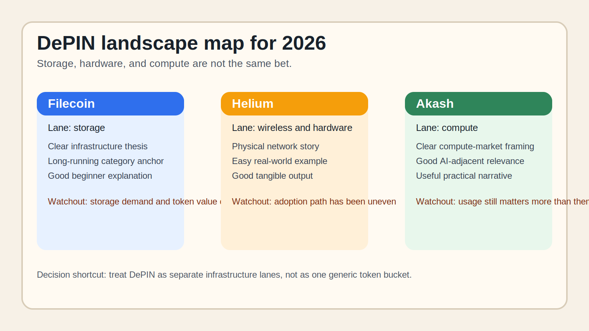

# Top DePIN Crypto Projects in 2026: 10 Networks in Compute, Wireless, Storage, and Data

- Meta title: `Top DePIN Crypto Projects in 2026: 10 Networks in Compute, Wireless, Storage, and Data`
- Meta description: `See the top DePIN crypto projects in 2026, including Filecoin, Arweave, Helium, Render, Akash, io.net, Hivemapper, and other infrastructure networks.`
- Slug: `/projects/new-projects/top-depin-crypto-projects-2026/`
- Primary keyword: `top depin crypto projects 2026`
- Category: `Projects > New Projects`
- Schema: `Article + ItemList`
- Last updated: `2026-07-10`

If you are choosing a DePIN project to follow in 2026, the real problem is usually not which token sounds futuristic. The real problem is which network is actually coordinating something real enough to matter outside crypto marketing.

That is why this article does not rank DePIN projects by hype alone. We are looking at them through the lens of infrastructure clarity, token utility, and whether the network still makes sense once you strip away the narrative. Readers who need the foundation first should pair this page with [what DePIN means](/guides/blockchain/what-is-depin/) and a guide on [what gives a token utility](/guides/crypto-basics/what-gives-a-token-utility/).

> Why you can trust this guide
>
> This article is based on live project pages and category references reviewed on `2026-07-10`. We directly reviewed public product surfaces and documentation. Where a judgment still depends on deeper usage, node economics, or adoption data, we say so clearly.

## The top DePIN crypto projects in 2026 are the networks with real infrastructure demand, visible usage, and a token that still has a clear role in the system.

The best names to know are `Filecoin`, `Arweave`, `Helium`, `Render`, `Akash`, `io.net`, `Aethir`, `Hivemapper`, `Grass`, and `Theta`. Some are mature infrastructure networks, while others are newer bets tied to AI compute, bandwidth, or data collection.

## How we ranked DePIN projects

We favored projects that meet at least three of these tests:

- the network clearly provides infrastructure, not just a vague narrative
- the token has a real coordination role
- the product has users, nodes, demand, or developer traction
- the project can be explained in plain English
- the thesis still makes sense in 2026

That matters because DePIN is one of the easiest categories for hype to outrun reality.

## The full list

| Rank | Project | Best known for | Why it made the list | Main watchout |
|---|---|---|---|---|
| 1 | Filecoin | decentralized storage | long-running infrastructure role | storage demand and token narrative are not the same |
| 2 | Arweave | permanent data storage | clear use case and strong identity | permanent-storage thesis is specialized |
| 3 | Helium | wireless networks | famous DePIN example with real-world hardware roots | adoption path has been uneven |
| 4 | Render | GPU compute marketplace | strong bridge between crypto and compute demand | overlaps with AI narrative hype |
| 5 | Akash | decentralized cloud compute | clear compute-market pitch | usage and economics need continued proof |
| 6 | io.net | distributed GPU compute | strong AI-era relevance | newer execution risk |
| 7 | Aethir | GPU and cloud infrastructure | exposure to enterprise-style compute demand | market still sorting winners |
| 8 | Hivemapper | mapping network | easy beginner explanation and visible field-data model | data quality and durable demand matter |
| 9 | Grass | bandwidth and data layer theme | high attention in the consumer node crowd | early-stage durability questions |
| 10 | Theta | edge infrastructure and content delivery | older but still relevant infrastructure design | narrative attention shifts fast |

### 1. Filecoin

Filecoin is a strong choice for readers who want the clearest storage-led DePIN thesis. From the public flow we reviewed, it immediately felt more like a real infrastructure market than a speculative branding exercise. That is a strength if you want the easiest storage case to explain, but it becomes a weakness if you want a newer and more aggressive growth narrative.

### 2. Arweave

Arweave is a strong choice for readers who value focus over breadth. What stood out immediately was how clearly the permanent-storage thesis defines the product. That is a strength if you want a specific and memorable use case, but it becomes a weakness if you want a broader infrastructure story.

### 3. Helium

Helium is a strong choice for readers who want a recognizable real-world DePIN case study. Based on what we could verify directly, it immediately felt more like a hardware-rooted network story than a pure token thesis. That is a strength if you want a concrete example, but it becomes a weakness if you want the cleanest recent execution track record.

### 4. Render

Render is a strong choice for readers who want a visible bridge between crypto and AI-era compute demand. From the public flow we reviewed, it immediately felt more like a serious compute marketplace than a generic AI narrative token. That is a strength if you want a category leader people already recognize, but it becomes a weakness if you want to avoid themes where hype can outrun fundamentals.

### 5. Akash

Akash is a strong choice for readers who want the decentralized cloud-compute thesis in cleaner form. What stood out immediately was how easy the core compute-market pitch is to explain. That is a strength if you want practical clarity, but it becomes a weakness if live usage does not keep up with the thesis.

### 6. io.net

io.net is a strong choice for readers who want exposure to the distributed GPU theme at the center of the current cycle. Even before a logged-in test, the public product surface already signals high ambition and high expectations. That is a strength if you want one of the most current compute narratives, but it becomes a weakness if you want lower execution risk.

### 7. Aethir

Aethir is a strong choice for readers who want another compute-layer name beyond the obvious leaders. From the public flow we reviewed, it immediately felt more enterprise-oriented than consumer-facing. That is a strength if you think enterprise compute demand matters most, but it becomes a weakness if you want the simplest beginner story.

### 8. Hivemapper

Hivemapper is a strong choice for readers who want one of the easiest DePIN outputs to visualize. What stood out immediately was the tangible nature of map data compared with more abstract infrastructure categories. That is a strength if you value clarity, but it becomes a weakness if you want the scale and mindshare of larger compute or storage networks.

### 9. Grass

Grass is a strong choice for readers who want to follow the bandwidth and data-sharing side of the category. From the public flow we reviewed, it immediately felt more like a high-attention emerging model than a fully settled infrastructure winner. That is a strength if you want early narrative exposure, but it becomes a weakness if you need durability already proven.

### 10. Theta

Theta is a strong choice for readers who want exposure to edge and media infrastructure rather than only the newer compute stories. Based on what we could verify directly, it felt more like a legacy but still relevant infrastructure brand than a fresh cycle leader. That is a strength if you value category history, but it becomes a weakness if you want the strongest current momentum.

## Key data and evidence

CoinGecko's DePIN-related category work shows that the sector is no longer one niche bucket. It is splitting into:

- storage
- wireless
- GPU and cloud compute
- mapping and data
- bandwidth and edge services

That split matters because the best DePIN project depends on which infrastructure problem you think crypto can actually solve.

## What we checked ourselves before ranking these DePIN projects

To write this guide, we reviewed the live public product surfaces and documentation of the shortlisted projects plus category references on `2026-07-10`. We did that so the article would not depend only on token-performance lists or loose DePIN buzzwords.

What we could verify directly from the public experience was:

- what type of infrastructure each network claims to coordinate
- whether the token has a visible role in that system
- how concrete or abstract the public product story feels
- whether the project already signals maturity, speculation, or execution risk

That direct review does not replace deeper node-level or onchain usage testing. At this stage, we are comfortable describing product posture and beginner fit, but not yet assigning hard usage or traction scores from a full test run.

What stood out immediately was not which project sounded most futuristic. It was which projects could explain the real service most clearly. That makes names like `Filecoin`, `Arweave`, and `Hivemapper` stronger for beginner understanding, but it makes newer compute names more conditional on execution.

The screenshots above should show why this matters: some DePIN projects already look like real infrastructure products, while others still look more like narrative-forward crypto ecosystems. That visual difference tells the reader how much abstraction they are buying into.

*Helium homepage captured during our July 2026 review of DePIN crypto projects.*

*Custom comparison graphic: Filecoin for storage, Helium for real-world hardware presence, and Akash for compute.*

## What this tells us about crypto in 2026

DePIN is one of the healthiest crypto narratives when it stays tied to a real service. The category gets weak when it becomes a loose marketing label. The strongest projects are still the ones that can answer three questions clearly:

- what infrastructure is being provided
- who needs it
- why a token improves coordination

## FAQ

### What is DePIN in simple terms?

DePIN means using token incentives to build or coordinate real infrastructure such as storage, wireless, compute, or data networks.

### Is DePIN the same as AI crypto?

No. Some AI-related projects overlap with DePIN through compute or data, but the categories are not identical.

### What is the easiest DePIN project for beginners to understand?

`Filecoin`, `Helium`, and `Hivemapper` are among the easiest to explain because the underlying service is concrete.

## Suggested internal links

- [What Is DePIN?](/guides/blockchain/what-is-depin/) Suggested anchor: `what is DePIN`
- [What Gives a Token Utility?](/guides/crypto-basics/what-gives-a-token-utility/) Suggested anchor: `what gives these tokens utility`
- [AI vs DePIN Crypto Trends 2026](/markets/market-trends/ai-vs-depin-crypto-trends-2026/) Suggested anchor: `AI vs DePIN trends`
- [Top RWA Crypto Projects in 2026](/projects/top-projects/top-rwa-crypto-projects-2026/) Suggested anchor: `another real-utility crypto sector`

## Suggested external references

- [CoinGecko DePIN Category](https://www.coingecko.com/en/categories/depin)
- [Filecoin](https://filecoin.io/)
- [Arweave](https://www.arweave.org/)
- [Helium](https://www.helium.com/)
- [Render Network](https://rendernetwork.com/)
- [Akash Network](https://akash.network/)
- [io.net](https://io.net/)
- [Aethir](https://aethir.com/)

## Captured media

- `../media/04-helium-home-2026-07-13.png` Caption: `Helium homepage captured during our July 2026 review of DePIN crypto projects.`
- `../media/04-depin-landscape-map-2026-07-13.svg` Caption: `Custom comparison graphic contrasting storage, wireless, and compute DePIN lanes.`

## Source set checked on 2026-07-10

- CoinGecko DePIN category and research pages
- Filecoin official site
- Arweave official site
- Helium official site
- Render Network official site
- Akash Network official site
- io.net official site
