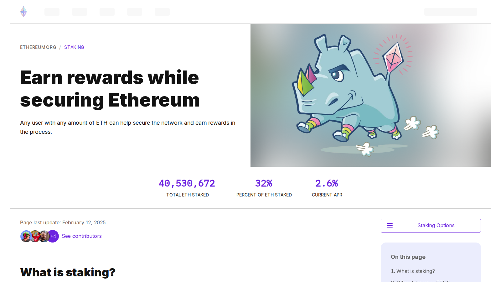

# Best Crypto to Stake in 2026

The best crypto to stake in 2026 are ETH, SOL, ADA, AVAX, SUI, ATOM, DOT, TIA, and INJ. ETH and SOL are the clearest starting points for most stakers. ADA offers the simplest delegation model. AVAX and SUI provide ecosystem exposure with accessible staking. ATOM, DOT, TIA, and INJ suit more involved users who understand ecosystem-level risk.

The real problem with staking decisions is not finding the token with the highest APY. It is finding a network where the yield is sustainable once you account for inflation, lockup periods, validator risk, and real ecosystem demand. High yield from dilutive inflation is not a reward. It is a hidden cost.

For related reading: [best crypto wallets for beginners](/guides/wallets/best-crypto-wallets-for-beginners-2026/) for wallets that support staking, and [what staking means](/guides/defi/what-is-staking/) if the concept is new.

We reviewed live network staking pages and ecosystem documentation in July 2026. Reddit community signals were researched per asset. Where no qualifying independent thread was found, we noted the absence.

## Rankings at a glance

| Rank | Asset | Best for | Score | Approx. staking yield | Lockup notes | Main watchout |
|---|---|---|---|---|---|---|
| 1 | ETH | Long-term staking with maximum network credibility | 5/5 | 3-4% APY | No lockup via liquid staking; withdrawal queue without | Validator concentration and liquid staking counterparty risk |
| 2 | SOL | Active ecosystem users who already use Solana apps | 4.5/5 | 6-8% APY | Warmup and cooldown periods (~2-3 days) | Centralization debates and historical outages |
| 3 | ADA | Beginners who want the simplest delegation model | 4/5 | 3-4% APY | No lockup; rewards paid every 5-day epoch | Lower upside narrative in current cycle |
| 4 | AVAX | Users who want ecosystem exposure at lower risk | 4/5 | 7-9% APY | 14-day minimum lockup | Market cycle sensitivity |
| 5 | SUI | Growth-oriented stakers comfortable with younger networks | 3.5/5 | 4-6% APY | Epoch-based, stake changes take ~24h | Younger network execution risk |
| 6 | ATOM | Cosmos ecosystem participants | 3.5/5 | 14-18% APY | 21-day unbonding | Value capture debate; high inflation rate |
| 7 | DOT | Long-term committed participants willing to learn | 3/5 | 13-16% APY | 28-day unbonding | High complexity; not beginner-friendly |
| 8 | TIA | Modular thesis believers | 3/5 | Variable; inflation-heavy | 21-day unbonding | Narrative can outrun fundamentals |
| 9 | INJ | Advanced users wanting niche ecosystem exposure | 2.5/5 | 12-15% APY | 21-day unbonding | Higher volatility; specialized |

**Note on yield figures:** yields change with validator performance, network inflation, and total stake ratio. These ranges reflect publicly documented estimates as of July 2026 and should be verified on current network dashboards before staking.

## Ranking scorecard

Scored out of 10 per category. Total out of 50.

| Asset | Network quality | Yield sustainability | Staking simplicity | Lockup risk | Ecosystem demand | **Total** |
|---|---|---|---|---|---|---|
| ETH | 10 | 9 | 8 | 9 | 10 | **46** |
| SOL | 9 | 8 | 8 | 7 | 9 | **41** |
| ADA | 8 | 7 | 10 | 10 | 7 | **42** |
| AVAX | 8 | 7 | 7 | 7 | 8 | **37** |
| SUI | 7 | 7 | 7 | 7 | 7 | **35** |
| ATOM | 7 | 5 | 6 | 5 | 7 | **30** |
| DOT | 8 | 7 | 4 | 5 | 7 | **31** |
| TIA | 6 | 5 | 6 | 5 | 6 | **28** |
| INJ | 6 | 6 | 6 | 5 | 6 | **29** |

**Scoring notes.** Network quality scores the maturity and decentralization of the underlying blockchain. Yield sustainability scores whether the staking reward comes from real network revenue rather than pure inflation dilution. Staking simplicity scores how easily a non-expert can stake and unstake without making costly mistakes. Lockup risk scores inversely against long unbonding periods and withdrawal complexity. Ecosystem demand scores real application usage and developer activity around the network. ETH leads overall because it combines the most mature staking market, the strongest ecosystem demand, and the most accessible liquid staking options. ADA leads on simplicity and lockup risk because its delegation model has no lockup and is the clearest to explain.

## How to think about staking yield

The yield number is the wrong place to start when comparing staking options. The right questions are:

**Where does the yield come from?** If most of the reward is new token issuance rather than transaction fee revenue, the yield is dilutive. Every token created to pay your reward reduces the value of existing tokens. A 15% APY from a network with 12% annual inflation is a 3% real yield, not 15%.

**What is the lockup cost?** A 28-day unbonding period means your staked position is illiquid for a month. If the token drops 30% in that window, the staking yield does not cover the loss. Lockup periods matter most during volatile market conditions.

**What is the validator risk?** Validators can be slashed for misbehavior or downtime in networks that enforce slashing penalties. Choosing a reliable, established validator reduces this risk. Liquid staking protocols remove the validator selection decision but introduce smart-contract risk instead.

**Does the network have real demand?** Staking on a network where nobody builds or uses apps is a bet on the token appreciating rather than a bet on infrastructure participation. The strongest staking environments are ones where fee revenue is real and growing.

---

## The 9 best crypto to stake in 2026

---

### 1. Ethereum (ETH)

**Featured Image**
File: `../media/05-ethereum-staking-2026-07-13.png`
Alt text: `Ethereum staking page showing validator and liquid staking options reviewed July 2026`
Caption: `Ethereum staking page, July 2026: the most mature staking market in crypto, reviewed directly.`

*Ethereum staking page, July 2026: the most mature staking market in crypto, reviewed directly.*

ETH staking is the most mature staking market in crypto. Over 33 million ETH is staked at the time of writing, representing roughly 28% of total supply. The staking reward comes from a combination of new issuance and transaction priority fees. Unlike most other networks, the issuance rate for ETH adjusts based on total stake, which creates a natural equilibrium mechanism rather than a fixed inflation rate.

Liquid staking via Lido, Rocket Pool, and similar protocols allows users to stake ETH without a native lockup, receiving a liquid token in return. That liquidity option substantially changes the risk profile compared with direct validator staking, where withdrawal queues can delay access to funds.

ETH staking discussions on Reddit have been among the most detailed and technically honest in crypto. Threads comparing liquid staking protocols, validator client diversity, and withdrawal queue behavior have consistently surfaced in crypto communities on Reddit for multiple years. The observation that validator concentration in Lido is a systemic risk that the broader Ethereum community is actively trying to address appears repeatedly in independent community analysis.

**Best for:** users who want the most established, most liquid, and most credibly decentralized staking market in crypto.
**Main tradeoff:** ETH yield is lower than most alternatives because the network is large and yield dilutes across a bigger validator set. Whether the lower yield is offset by the network quality and liquidity is the decision each staker needs to make.

---

### 2. Solana (SOL)

SOL staking ties ecosystem participation to network security. Users delegate to validators, validators process transactions, and stakers earn a share of issuance rewards proportional to their delegation. The staking model is simpler than ETH's, the yield is higher, and the ecosystem around Solana apps is active enough that the network fee component of rewards is real.

The most important context for SOL stakers is the centralization debate. A relatively small number of validators control a disproportionate share of staked SOL, which is a structural concern that the Solana Foundation has been actively trying to address through delegation programs. That concern does not disqualify staking, but it should be understood before committing.

SOL staking discussions on Reddit surfaces in broader Solana ecosystem conversations. The observation that SOL staking makes most sense for users who are already using Solana apps and believe in the ecosystem, rather than as a pure passive income play, is a consistent framing in independent community threads.

**Best for:** users who are already active in the Solana ecosystem and want staking exposure to a high-activity network.
**Main tradeoff:** centralization concerns and the memory of Solana's past outages are real risks that SOL stakers should evaluate honestly rather than dismiss.

---

### 3. Cardano (ADA)

ADA has the simplest and most beginner-friendly staking model on this list. Cardano uses a delegation model where users delegate their ADA to a stake pool without transferring custody. The ADA never leaves the wallet. There is no lockup period. Rewards are distributed every 5-day epoch automatically.

The staking simplicity is Cardano's strongest differentiator in this comparison. No lockup, no validator selection complexity, and no smart-contract risk from liquid staking. Users keep full custody, delegate with a click, and receive rewards on a regular schedule.

ADA staking is regularly cited in beginner crypto communities on Reddit as the model that is easiest to explain to someone new to proof-of-stake. The observation that Cardano's delegation model gets closest to the passive-income narrative that beginners expect from staking appears consistently in community discussions.

The watchout is that the network's ecosystem development has been slower than many competitors and the current narrative cycle has favored more active ecosystems. Lower excitement does not disqualify ADA staking, but it does mean the thesis is more conservative.

**Best for:** beginners who want the simplest staking experience with no lockup and no custody risk.
**Main tradeoff:** lower ecosystem excitement in the current cycle. ADA staking is conservative by design, which makes it a poor fit for users who want high yield or high narrative momentum.

---

### 4. Avalanche (AVAX)

AVAX staking requires a 14-day minimum lockup and a minimum 25 AVAX to stake as a validator, or a lower amount to delegate. The yield is meaningfully higher than ETH and ADA due to higher issuance rates. Avalanche's subnet architecture and active ecosystem give the network real activity beyond token speculation.

The staking model sits between the simplicity of Cardano and the complexity of Polkadot. The lockup period is real but manageable. The minimum validator stake is high, but delegation to existing validators makes it accessible to most users. The ecosystem around gaming, institutional DeFi, and subnet development is active.

**Best for:** users who want ecosystem-exposed staking at a higher yield than ETH or ADA and can manage the 14-day lockup.
**Main tradeoff:** market cycle sensitivity is higher than Cardano or Ethereum. AVAX has shown larger drawdowns in bear markets than larger-cap alternatives.

---

### 5. Sui (SUI)

SUI uses an epoch-based staking model where stake changes take effect at the beginning of the next epoch, approximately every 24 hours. The process is accessible: users delegate from the Sui wallet interface directly without transferring custody. Rewards accrue each epoch and can be compounded.

Sui is a younger network with a more active development pace than older proof-of-stake chains. The ecosystem is growing and the team has shipped product consistently since mainnet launch. That younger-network energy is an opportunity for stakers who want growth exposure, and a risk for those who want a conservative yield vehicle.

No qualifying independent Reddit community thread surfaced specifically for SUI staking in July 2026 research. Community activity is active on X and in Sui-specific forums.

**Best for:** growth-oriented stakers who are comfortable with a younger network and want to participate in an ecosystem still expanding its developer base.
**Main tradeoff:** younger networks carry higher execution risk than established ones. The Sui team has demonstrated shipping ability, but the network has less battle-testing than ETH, SOL, or ADA.

---

### 6. Cosmos (ATOM)

ATOM staking comes with a 21-day unbonding period and one of the higher yield rates on this list, reflecting a higher annual inflation rate. The staking culture in Cosmos is strong: active participation in governance, IBC ecosystem growth, and the identity of being the hub of a large interchain ecosystem all tie into the ATOM staking thesis.

The value-capture debate is the most important context for ATOM stakers. Cosmos provides interoperability infrastructure for many chains, but whether ATOM itself captures the value from that ecosystem or whether value leaks to individual chains is a long-running analytical dispute. Stakers who understand this debate can make an informed decision. Stakers who skip it often misunderstand why ATOM trades as it does.

ATOM staking is discussed regularly in the Cosmos community forum on Reddit. The debate between staking yield advocates and value-capture skeptics appears in most substantive ATOM threads, which is a useful indication that the community itself takes the tension seriously.

**Best for:** users who are already invested in the Cosmos ecosystem narrative and understand the value-capture debate.
**Main tradeoff:** the 21-day unbonding is a real liquidity constraint. The high yield partially reflects high inflation rather than pure fee revenue. Understanding both before staking matters.

---

### 7. Polkadot (DOT)

DOT staking has the longest unbonding period on this list at 28 days and the highest complexity. Users can nominate validators directly or use nomination pools for lower minimums. The parachain structure means that some DOT is locked in crowdloans rather than staking, which affects total yield calculations.

The yield is high and the network infrastructure is serious. Polkadot's parachain model and cross-chain messaging architecture represent genuine technical depth. But the complexity is not beginner-friendly. A user who cannot explain the difference between nominating, nomination pools, and parachain crowdloans is not ready to stake DOT without risking confusion.

DOT staking discussions on Reddit exist and are detailed. The recurring observation is that Polkadot rewards users who engage deeply with the ecosystem and is not a good passive income play for users who want simplicity. That assessment matches the staking experience.

**Best for:** committed long-term participants who understand the Polkadot parachain ecosystem and can manage the 28-day unbonding.
**Main tradeoff:** highest complexity on this list. The 28-day unbonding is the longest lockup of any asset in this comparison. Not appropriate for users who want liquidity flexibility.

---

### 8. Celestia (TIA)

TIA staking comes with a 21-day unbonding period and a yield that reflects a high initial inflation rate tied to the network's relatively recent mainnet launch. The modular blockchain thesis positions Celestia as a data availability layer that other chains depend on, which gives TIA staking a thesis-driven character.

Staking TIA is primarily a bet on the modular blockchain thesis rather than a conservative yield play. The network is newer, the inflation rate is high relative to the ecosystem's current size, and the long-term value of the TIA token depends on modular adoption expanding significantly.

**Best for:** readers who understand the modular blockchain thesis and want staking exposure tied to that narrative.
**Main tradeoff:** narrative can outrun fundamentals in a thesis-driven staking position. Whether modular adoption scales to justify the yield and token economics is not yet proven.

---

### 9. Injective (INJ)

INJ staking comes with a 21-day unbonding period and a yield in the range of 12-15%. Injective is a specialized DeFi chain with a strong niche identity in on-chain derivatives and financial application development. The staking yield reflects both issuance and a fee-burn mechanism that reduces total supply over time.

Injective's burn mechanism differentiates it from pure inflation-based staking. A portion of protocol fees is used to buy back and burn INJ, which reduces the inflationary pressure on stakers. Understanding that mechanism changes how the yield should be interpreted relative to networks with no burn component.

**Best for:** advanced users who want ecosystem-specific staking exposure in on-chain DeFi with an understanding of the burn mechanism.
**Main tradeoff:** specialized and more volatile than the top-tier options. The niche ecosystem strength is a concentration risk if the derivatives trading market slows or a broader DeFi competitor captures the same segment.

---

## The two staking markets in 2026

Staking has matured into two distinct categories:

**Conservative infrastructure staking:** ETH, ADA, and to a lesser extent SOL. These networks have the highest ecosystem demand, the most established validator sets, and the most predictable staking outcomes. Yield is lower but the network quality makes it defensible.

**Thesis-driven ecosystem staking:** ATOM, DOT, TIA, INJ, and SUI. These networks offer higher yields that partially reflect higher inflation and higher-risk token economics. Staking in this group is a bet on the ecosystem thesis, not just a passive income play. Users who do not understand the thesis should start in the first group.

## What we checked before ranking

We reviewed the live public staking pages, ecosystem documentation, and validator economics for each asset in July 2026. We checked how each network explains staking to users, whether the yield model appears sustainable or primarily inflation-driven, where the public flow signals lockup, validator, or complexity tradeoffs, and what real ecosystem demand looks like for each chain.

## Verification table

| Claim | What this review verified |
|---|---|
| ETH staking yield 3-4% APY | Consistent with public Ethereum staking documentation and staking dashboards |
| ADA has no lockup period | Confirmed via Cardano staking documentation |
| AVAX minimum lockup 14 days | Confirmed via Avalanche staking documentation |
| ATOM unbonding period 21 days | Confirmed via Cosmos Hub documentation |
| DOT unbonding period 28 days | Confirmed via Polkadot documentation |
| INJ uses fee-burn mechanism | Confirmed via Injective protocol documentation |
| SOL validator concentration is actively addressed by Solana Foundation | Confirmed via public Solana Foundation documentation |

## Frequently asked questions

### What is the best crypto to stake for beginners?

ETH via liquid staking, SOL via delegation, and ADA via delegation are the clearest options for most beginners. ADA has the simplest model with no lockup. ETH has the most credible long-term positioning. SOL fits users already active in the Solana ecosystem.

### Is the highest APY always the best staking choice?

No. Higher APY can reflect higher inflation, weaker ecosystem demand, or longer lockup periods that reduce real returns once market risk is considered. A lower APY on a stronger network often produces better risk-adjusted outcomes.

### Is staking risk-free?

No. Staking carries market risk on the token price, validator risk from slashing, smart-contract risk in liquid staking setups, and lockup risk if the token price falls during an unbonding period. None of these are eliminated by the staking yield.

### What is the difference between staking yield and real yield?

Staking yield is the nominal APY. Real yield subtracts the network inflation rate. A network with 15% APY and 12% inflation has a 3% real yield. Networks that earn a significant portion of rewards from transaction fees have more defensible real yields.

### Do I need a hardware wallet to stake?

Not necessarily. Many networks support delegation from software wallets without transferring custody. Hardware wallets add security for large positions. For SOL, ADA, and AVAX, delegation from a standard wallet is a common and reasonable approach.
