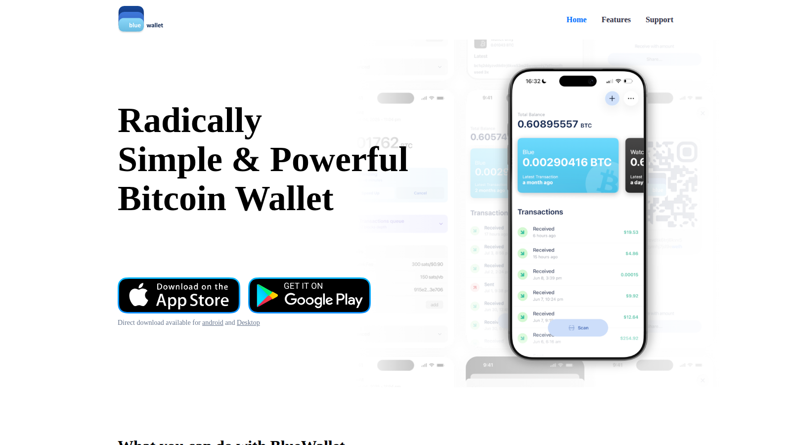

# Best Bitcoin Wallets for Beginners in 2026

The best Bitcoin wallets for beginners in 2026 are BlueWallet and Blockstream Green for learning self-custody, Muun and Phoenix for spending and Lightning, and Trezor or Ledger when building serious long-term storage habits. Sparrow is the right next step for desktop users ready to grow into better security hygiene.

The right wallet depends on whether the goal is to learn, spend, or store. A wallet that is excellent for long-term cold storage is not the right first wallet for someone learning to send their first transaction. A wallet optimized for Lightning payments is not the right choice for someone who mainly wants to save.

For related reading: [how crypto wallets work](/guides/wallets/how-crypto-wallets-work/) and [how to store seed phrases safely](/guides/security/how-to-store-seed-phrases-safely/).

We reviewed the live public product surfaces and documentation for each wallet in July 2026. Reddit community signals were researched per wallet. Where no qualifying independent thread was found, we noted the absence.

## Rankings at a glance

| Rank | Wallet | Best for | Type | Main strength | Main watchout |
|---|---|---|---|---|---|
| 1 | BlueWallet | Learning first self-custody | Mobile, software | Clean UI, beginner-oriented backup flow | Self-custody requires backup discipline; app-based not hardware-secured |
| 2 | Blockstream Green | Security-first beginners | Mobile and desktop, software | Bitcoin-only focus, multisig option | Less convenient than multi-asset wallets |
| 3 | Muun | Simple Bitcoin spending | Mobile, software | Easy onboarding, clean payment UX | Not designed for long-term cold storage |
| 4 | Phoenix | Lightning-first payments | Mobile, software | Self-custodial Lightning without channel management | Lightning model adds concepts to learn |
| 5 | Trezor | First hardware wallet | Hardware | Clear hardware wallet path, simple UX for hardware | Additional cost and setup steps over mobile |
| 6 | Ledger | Hardware with broad ecosystem | Hardware | Broad asset support, strong device recognition | More complex for Bitcoin-only users |
| 7 | Sparrow | Desktop users leveling up security | Desktop, software | UTXO control, coin selection, privacy tools | More advanced than most beginners need on day one |

## Ranking scorecard

Scored out of 10 per category. Total out of 50.

| Wallet | Backup clarity | Beginner UX | Security model | Use case fit | Community trust | **Total** |
|---|---|---|---|---|---|---|
| BlueWallet | 9 | 10 | 7 | 9 | 9 | **44** |
| Blockstream Green | 9 | 8 | 9 | 8 | 9 | **43** |
| Muun | 8 | 9 | 7 | 8 | 8 | **40** |
| Phoenix | 8 | 8 | 8 | 8 | 8 | **40** |
| Trezor | 9 | 8 | 10 | 8 | 9 | **44** |
| Ledger | 8 | 7 | 9 | 7 | 8 | **39** |
| Sparrow | 9 | 6 | 9 | 7 | 9 | **40** |

**Scoring notes.** Backup clarity scores how clearly the wallet explains seed phrase backup and recovery. Beginner UX scores how easily a first-time user completes setup, receives funds, and sends without confusion. Security model scores the technical security of the storage approach. Use case fit scores how well the wallet matches the typical beginner need. Community trust scores the wallet's reputation in independent Bitcoin community discussions. BlueWallet and Trezor tie on total but serve different needs: BlueWallet is the best mobile software start, Trezor is the best hardware start.

## How to choose the right beginner Bitcoin wallet

Three questions determine the answer:

**Are you learning or storing?** If you are learning how Bitcoin transactions work, a mobile software wallet with a clear UI is the right start. If you are storing a meaningful amount, a hardware wallet is worth the additional setup cost from the beginning.

**Do you plan to spend or save?** Spending Bitcoin regularly, especially via Lightning, means a wallet optimized for payment UX. Saving Bitcoin long-term means a wallet optimized for security and backup clarity.

**How much complexity are you ready for?** Mobile wallets like BlueWallet and Muun hide most complexity. Hardware wallets like Trezor add setup steps. Desktop wallets like Sparrow assume comfort with UTXO management. Matching complexity to current knowledge level avoids the most common beginner mistakes.

---

## The 7 best Bitcoin wallets for beginners in 2026

---

### 1. BlueWallet

**Featured Image**
File: `../media/06-bluewallet-home-2026-07-13.png`
Alt text: `BlueWallet homepage showing beginner-friendly Bitcoin mobile wallet interface, July 2026`
Caption: `BlueWallet homepage, July 2026: the most widely recommended beginner Bitcoin mobile wallet, reviewed directly.`

*BlueWallet homepage, July 2026: the most widely recommended beginner Bitcoin mobile wallet, reviewed directly.*

BlueWallet is the most widely recommended first mobile wallet in independent Bitcoin communities. The interface is clean, the backup flow is clear, and the product does not try to be a multi-asset exchange app. It is a Bitcoin wallet that acts like a Bitcoin wallet.

The backup flow is the most important feature for any beginner wallet. BlueWallet prompts the user to write down a seed phrase before finishing setup and explains why the phrase cannot be recovered if lost. That direct backup emphasis reduces the most common catastrophic beginner mistake.

BlueWallet is consistently cited in Bitcoin communities on Reddit as the default recommendation for someone asking what mobile wallet to start with. The observation that it does not have unnecessary complexity and that the backup process is genuinely clear appears in multiple independent recommendation threads. That community signal is one of the strongest available for any wallet product.

The important limitation to communicate clearly: BlueWallet is a software wallet on a mobile device. The device can be lost, stolen, or compromised. Self-custody in a software wallet requires understanding that the seed phrase is the only backup. Users who lose the phrase lose the funds.

**Best for:** beginners who want the clearest first self-custody mobile wallet with a well-established community reputation.
**Main tradeoff:** software wallet on a phone is less secure than hardware. Users who accumulate more than they are comfortable losing on a phone should graduate to a hardware wallet.

---

### 2. Blockstream Green

Blockstream Green is designed with a Bitcoin-first, security-first posture. The wallet supports both singlesig and multisig setups, which means a beginner can start simply and grow into a more sophisticated security model without switching wallets. The interface is clean and the Bitcoin-only focus removes the distraction of multi-asset token management.

The multisig option is the feature that distinguishes Green from BlueWallet for users who are thinking slightly ahead. A 2-of-2 multisig setup adds a second authentication factor that a standard single-key mobile wallet does not have. That additional layer is useful for users who understand what it does but adds friction for users who do not.

Bitcoin community discussions on Reddit have cited Blockstream Green specifically for users who want to start with a Bitcoin-focused wallet rather than a general crypto app. The observation that Green's product decisions reflect Bitcoin-native values rather than multi-chain product priorities appears in independent community comparisons.

**Best for:** beginners who already know they want a Bitcoin-only wallet with an upgrade path to multisig.
**Main tradeoff:** less convenient than multi-asset wallets for users who hold other cryptocurrencies alongside Bitcoin.

---

### 3. Muun

Muun presents itself as the simplest way to hold and spend Bitcoin. The design prioritizes onboarding speed and payment ease over the technical education that Green and BlueWallet emphasize. The wallet abstracts away the distinction between onchain and Lightning, presenting both as a unified balance.

The abstraction is a genuine UX improvement for daily spending. Users do not need to manage Lightning channels or understand the difference between onchain and Lightning outputs. They simply receive and send Bitcoin. For beginners whose primary goal is to use Bitcoin for payments, this is the right design choice.

The watchout is that the abstraction also reduces educational value. A user who only uses Muun may not learn what a UTXO is, how Lightning channels work, or why the distinction between onchain and Lightning matters for security and fee management. That is an acceptable trade for spending-focused beginners and a problematic one for beginners who want to understand what they are doing.

**Best for:** beginners who want to use Bitcoin for payments and do not need to understand the underlying technical layers.
**Main tradeoff:** the UX abstraction reduces the educational value of the experience. Users who want to understand Bitcoin deeply should complement Muun with reading or graduate to a more transparent wallet.

---

### 4. Phoenix

Phoenix is a self-custodial Lightning wallet that manages channel liquidity automatically. The user experience is clean: receive Lightning payments, send Lightning payments, and the wallet handles the channel management in the background. This makes Phoenix one of the best Lightning wallets available without requiring users to understand inbound liquidity or channel management.

Self-custodial Lightning without manual channel management is a genuine technical achievement. Earlier Lightning wallets either required users to manage channels manually or used custodial models that removed self-custody. Phoenix provides both Lightning simplicity and key custody in one product.

Bitcoin Lightning communities on Reddit have discussed Phoenix as one of the most usable self-custodial Lightning options available. The comparison between Phoenix and custodial Lightning apps like Wallet of Satoshi appears regularly: Phoenix gives users their own keys, which is worth the slightly higher fee structure compared with custodial alternatives.

The watchout is that Phoenix is optimized for Lightning spending. It is not designed as a long-term Bitcoin savings wallet. Users who want to hold significant Bitcoin for long-term storage should use a hardware wallet or a cold storage setup alongside Phoenix.

**Best for:** users who want self-custodial Lightning payments without managing channels manually.
**Main tradeoff:** Lightning model adds a layer of concepts that pure onchain beginners do not face. Users who are not yet comfortable with what Lightning is should learn the basics before starting with Phoenix.

---

### 5. Trezor

Trezor is the most straightforward first hardware wallet for beginners. The setup process is designed for users who have not used hardware wallets before: the device guides through seed phrase generation, backup confirmation, and PIN setup in a structured flow. The interface is simpler than Ledger for Bitcoin-only use.

The core security advantage of any hardware wallet is that the private key never leaves the device. Even if the computer it connects to is compromised, the key cannot be extracted from the hardware. That security model is meaningfully stronger than any mobile or desktop software wallet.

Trezor is consistently recommended in Bitcoin hardware wallet discussions on Reddit as the clearer first hardware wallet option for users who are new to cold storage. The observation that Trezor's UI is more direct for Bitcoin-only users, and that the company has a longer open-source track record, appears in independent hardware wallet comparison threads.

The cost and additional setup steps compared with a mobile wallet are the main tradeoffs. A Trezor costs roughly $50-70 depending on model. The setup takes more time than installing a mobile app. For users holding enough that the security upgrade is justified, these are acceptable costs.

**Best for:** beginners who are ready to move beyond phone-based storage and want the clearest first hardware wallet experience.
**Main tradeoff:** costs more and takes longer to set up than a mobile wallet. Justified for users who are accumulating meaningful amounts. Less necessary for users who are still in the learning phase.

---

### 6. Ledger

Ledger is the other major hardware wallet choice and has broader asset support than Trezor. The Ledger Live app provides access to staking, swapping, and multi-asset management from a single interface, which makes it more versatile for users who hold crypto beyond Bitcoin.

For Bitcoin-only beginners, Trezor is usually the cleaner starting point. For beginners who also hold ETH, SOL, or other assets and want a single hardware solution, Ledger's ecosystem breadth is a genuine advantage.

Ledger is discussed extensively in crypto hardware wallet communities on Reddit. The debate between Ledger and Trezor is a recurring topic. The main findings in independent community analysis: Ledger has better multi-asset support and broader ecosystem integration, Trezor has a stronger open-source track record and simpler setup for Bitcoin-focused users. The 2023 Ledger Recovery controversy is referenced regularly as a trust factor to evaluate before choosing.

**Best for:** beginners who want a hardware wallet with broad asset support and app ecosystem integration.
**Main tradeoff:** the Ledger Recovery incident in 2023 raised trust questions in some of the Bitcoin community. Readers who are sensitive to firmware-level trust assumptions should research that incident before deciding.

---

### 7. Sparrow Wallet

Sparrow is a desktop Bitcoin wallet designed for users who want visibility into their UTXO set, coin control, and transaction construction. It supports single-sig, multisig, hardware wallet integration, and full node connection. The interface is more information-dense than any other wallet on this list.

Sparrow is not a first wallet. It is the wallet that helps users grow into genuinely good Bitcoin storage and privacy practices after they understand the basics. For beginners who have outgrown BlueWallet or Blockstream Green and want to understand their Bitcoin stack more deeply, Sparrow is the best desktop option.

Sparrow is discussed with consistent respect in Bitcoin technical communities on Reddit. The observation that Sparrow is the most educationally valuable desktop wallet because it exposes transaction structure that other wallets hide appears in independent community recommendations. Developers and privacy-conscious users cite it as the wallet that changed how they understood UTXO management.

**Best for:** desktop users who are ready to move beyond basic mobile wallets and want visibility into UTXO management and transaction construction.
**Main tradeoff:** higher learning curve than anything else on this list. Most beginners do not need Sparrow on day one. It is the right next step after the fundamentals are comfortable.

---

## What every beginner needs to know about Bitcoin wallet security

**The seed phrase is the wallet.** Every software and hardware wallet on this list generates a 12 or 24-word seed phrase during setup. That phrase is the only backup. If the device is lost or broken and the phrase is gone, the funds are gone. Writing the phrase on paper and storing it in a secure physical location is not optional.

**Not your keys, not your coins.** Exchange accounts are not Bitcoin wallets. When you hold Bitcoin on a Coinbase or Binance account, the exchange holds the keys. A self-custody wallet means you hold the keys. The distinction matters most when exchanges freeze withdrawals or fail.

**Beware of seed phrase phishing.** No legitimate wallet will ever ask for your seed phrase via email, chat, or a website. Anyone who requests it is attempting to steal funds.

**A hardware wallet is appropriate when the amount warrants it.** There is no universal threshold. A rule of thumb: if losing the funds would be genuinely painful, a hardware wallet is worth the cost.

## What we checked before ranking

We reviewed the live public product pages and documentation for each wallet in July 2026. We checked how each wallet explains setup and recovery to first-time users, whether the backup flow is prominent or buried, whether the wallet is framed for learning, spending, or storage, and what the community reputation looks like in independent Bitcoin forums.

## Verification table

| Claim | What this review verified |
|---|---|
| BlueWallet prompts seed phrase backup during setup | Confirmed via public product documentation |
| Blockstream Green supports multisig | Confirmed via Blockstream Green documentation |
| Muun abstracts onchain/Lightning distinction | Confirmed via Muun product pages |
| Phoenix is self-custodial Lightning without manual channel management | Confirmed via Phoenix ACINQ documentation |
| Trezor private key never leaves device | Confirmed via Trezor security documentation |
| Ledger has broader multi-asset support than Trezor | Confirmed via Ledger Live product pages |
| Sparrow supports UTXO coin control and hardware wallet integration | Confirmed via Sparrow wallet documentation |

## Frequently asked questions

### What is the best Bitcoin wallet for a total beginner?

BlueWallet for learning self-custody on mobile. Blockstream Green for a Bitcoin-focused security-first mobile start. Muun for spending convenience. Trezor when the amount held warrants hardware security.

### Do beginners need a hardware wallet?

Not on day one, but anyone holding an amount they would be genuinely upset to lose should seriously consider one. Hardware wallets add meaningful security at a cost of around $50-70 and extra setup time.

### Is a Bitcoin wallet the same as an exchange account?

No. A self-custody wallet means you hold the private keys. An exchange account means the exchange holds the keys on your behalf. If the exchange freezes withdrawals or fails, you cannot access funds in an exchange account.

### What happens if I lose my phone or hardware wallet?

If you have written down the seed phrase and stored it safely, you can restore the wallet on a new device. If the seed phrase is also lost, the funds are permanently inaccessible. Backup discipline is the most important security practice.

### Can I have more than one Bitcoin wallet?

Yes. Many Bitcoin users keep a mobile wallet with a small amount for daily use and a hardware wallet for long-term storage. This separates spending risk from savings risk.
