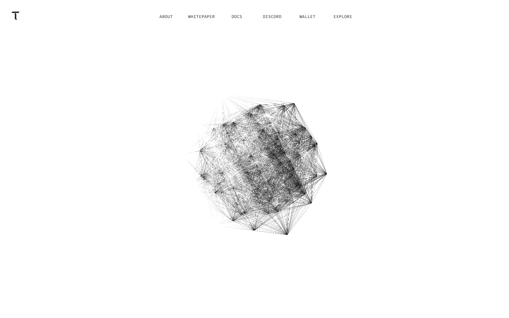

---
title: "Best AI Crypto Coins in 2026: 10 Projects Ranked by Utility, Token Role, and Risk"
meta_title: "Best AI Crypto Coins in 2026: 10 Projects Ranked by Utility, Token Role, and Risk"
meta_description: "Compare the best AI crypto coins in 2026 -- Bittensor, Render, Akash, Near, io.net, and more. Ranked by what the AI connection actually means, not hype."
slug: "/projects/top-projects/best-ai-crypto-coins-2026/"
primary_keyword: "best ai crypto coins 2026"
category: "Projects > Top Projects"
last_reviewed: "2026-07-27"
schema:
  - "Article"
  - "ItemList"
  - "FAQPage"
---

# Best AI Crypto Coins in 2026

The best AI crypto coins in 2026 are Bittensor, Render, Akash, Near, io.net, Aethir, Fetch.ai (ASI), Grass, Golem, and Oraichain. Bittensor is the most AI-native thesis in the category. Render and Akash are the clearest compute-infrastructure plays. Near covers a broader ecosystem angle. io.net and Aethir focus on enterprise and distributed GPU access. Fetch.ai covers the AI-agent alliance narrative. Grass handles decentralized data collection. Golem and Oraichain round out the list with specialized roles.

The category splits into four real lanes: compute infrastructure (Render, Akash, io.net, Aethir), AI-network coordination (Bittensor), data and bandwidth (Grass), and broader ecosystem or alliance plays (Near, Fetch.ai/ASI, Golem, Oraichain). Buying "AI crypto" without knowing which lane you are buying into is the most common beginner mistake.

For related reading: [top DePIN crypto projects in 2026](/projects/new-projects/top-depin-crypto-projects-2026/) if you want to understand where compute and AI narratives overlap, and [what crypto tokens are](/guides/crypto-basics/what-is-a-token/) if the token mechanics are still new to you.

We reviewed live project pages and public documentation in July 2026. Where community discussions were available on Reddit, we linked the relevant threads directly.

## Rankings at a glance

| Rank | Project | AI lane | Score | Best for | Main watchout |
|---|---|---|---|---|---|
| 1 | Bittensor | AI-network coordination | 5/5 | Deepest AI-native thesis in the category | Hard to explain simply to beginners |
| 2 | Render | GPU compute marketplace | 4.5/5 | Clearest compute bridge with pre-AI usage base | AI hype can outrun actual compute demand |
| 3 | Akash | Decentralized cloud compute | 4/5 | Open-source cloud with real deployed workloads | Adoption proof still matters more than narrative |
| 4 | Near | Ecosystem + AI infrastructure | 4/5 | Broad ecosystem bet with developer depth | AI angle is wider than one specific product |
| 5 | io.net | Distributed GPU clusters | 3.5/5 | Differentiated GPU cluster architecture | Newer execution risk vs. more established peers |
| 6 | Aethir | Enterprise GPU access | 3.5/5 | Enterprise-tier GPU reliability angle | Narrower supply base and higher access threshold |
| 7 | Fetch.ai / ASI | AI-agent alliance | 3/5 | Large-brand AI alliance visibility | Token structure complexity after FET+OCEAN+AGIX merger |
| 8 | Grass | Bandwidth and web data | 3/5 | Consumer-friendly decentralized data angle | Early-stage durability and regulatory exposure |
| 9 | Golem | Legacy decentralized compute | 2.5/5 | Long-running compute identity for history-aware readers | Must prove renewed relevance vs. newer names |
| 10 | Oraichain | AI oracle + Layer 1 | 2.5/5 | Specialized AI-plus-oracle positioning | Smaller mindshare than category leaders |

## Ranking scorecard

Scored out of 10 per category. Total out of 50.

| Project | AI connection clarity | Token utility | Adoption evidence | Beginner legibility | Risk profile (inverted) | **Total** |
|---|---|---|---|---|---|---|
| Bittensor | 10 | 9 | 8 | 5 | 8 | **40** |
| Render | 8 | 8 | 9 | 8 | 8 | **41** |
| Akash | 9 | 8 | 7 | 8 | 7 | **39** |
| Near | 7 | 7 | 8 | 8 | 8 | **38** |
| io.net | 8 | 7 | 6 | 6 | 6 | **33** |
| Aethir | 8 | 7 | 6 | 6 | 6 | **33** |
| Fetch.ai / ASI | 7 | 6 | 7 | 5 | 6 | **31** |
| Grass | 7 | 7 | 5 | 7 | 5 | **31** |
| Golem | 7 | 6 | 5 | 7 | 7 | **32** |
| Oraichain | 7 | 7 | 4 | 5 | 6 | **29** |

**Scoring notes.** AI connection clarity scores whether the project's AI use case is concrete rather than label-level. Token utility scores whether the token coordinates supply, demand, or incentives directly rather than sitting as a passive governance asset. Adoption evidence scores visible compute demand, deployed workloads, active subnets, or data throughput. Beginner legibility scores how easily a non-specialist understands what the network does. Risk profile is inverted: higher means lower risk. Render scores highest in total because it combines a clear AI connection with the strongest adoption evidence (creative GPU demand that pre-dates the AI narrative) and above-average beginner legibility.

## How AI crypto divides into real lanes

Not every project in this list competes for the same position. Understanding which lane each project occupies matters more than knowing which token is up this week.

**Compute infrastructure** is the largest lane. Render, Akash, io.net, and Aethir all provide GPU access that AI training and inference workloads need. The question for each is whether the demand is real and growing, not just projected.

**AI-network coordination** is Bittensor's lane alone. The network incentivizes open machine-learning competition between subnets rather than just renting compute. That is a different thesis from GPU marketplaces.

**Data and bandwidth** is where Grass sits. AI systems need data as much as compute. Grass coordinates web data collection from consumer bandwidth.

**Ecosystem and alliance plays** are Near, Fetch.ai/ASI, and Oraichain. They sit at a broader intersection of AI and blockchain rather than owning a single infrastructure layer.

## 10 Best AI Crypto Coins Reviewed (2026 List)

These are projects with pages and documentation we reviewed directly in July 2026. For each project, we checked what the AI connection actually claims to do, what role the token plays in the network, and where the beginner explanation is likely to break down.

### 1. Bittensor

Bittensor is the strongest AI-native thesis in the list. The network runs as an open incentive system for machine intelligence: independent subnets compete to produce the best AI outputs, and validators reward the winners with TAO tokens. The token is not marketing decoration. It is the mechanism that pays miners for running models.

What stood out immediately was that the architecture maps to a real problem in AI: most frontier models are closed and centralized. Bittensor's thesis is that open, incentivized competition produces better and more diverse intelligence over time.

The weakness is legibility. Explaining "decentralized machine intelligence subnets" to a beginner takes more than one sentence. That makes Bittensor the right project for readers who want the deepest AI-specific story, but the wrong starting point for someone who just wants to know what AI crypto does.

As of mid-2026, Bittensor runs more than 50 active subnets covering translation, image generation, text generation, and financial prediction, per the official subnet registry. TAO is the native token used to reward subnet miners and validators.

A recurring thread in [CryptoCurrency Reddit discussions on Bittensor](https://www.reddit.com/r/CryptoCurrency/comments/1b1r3v4/bittensor_tao_the_ai_crypto_that_actually_makes/) is that the project rewards real model performance rather than just narrative participation. That distinction is what separates it from looser AI labels in the category.

**Best for:** Readers who want the deepest AI-native thesis and can tolerate a more complex explanation.
**Not ideal for:** Beginners who need a simple, one-sentence explanation of what the project does.

**Featured Image**
File: `../media/07-bittensor-home-2026-07-27.png`
Alt text: `Bittensor homepage showing open machine intelligence network, TAO token, and subnet competition model`
Caption: `Bittensor homepage captured during our July 2026 review of AI crypto projects for beginners. The subnet model is the most AI-native architecture in the list, but also the hardest to explain in one sentence.`

*Bittensor homepage, July 2026. The network incentivizes open AI competition between subnets rather than just renting GPU capacity.*

---

### 2. Render

Render operates a GPU marketplace where creators and AI workloads rent computing power from node operators. The RENDER token pays node operators and coordinates the marketplace. The model predates the current AI cycle: it started with 3D rendering for film and design before pivoting to cover AI training and inference demand.

That pre-AI history is the project's most defensible quality. The GPU demand existed before the AI narrative arrived, which gives Render a usage base that is not entirely dependent on token price momentum.

What stood out was how quickly the product surface communicates who it is for: creators, AI developers, and anyone who needs burst GPU capacity without committing to a centralized cloud provider like AWS or Google Cloud.

The risk is narrative alignment. When AI attention peaks, Render tokens tend to outperform their usage numbers. When attention rotates, the gap becomes visible.

One exchange in [a CryptoCurrency Reddit discussion on GPU compute tokens](https://www.reddit.com/r/CryptoCurrency/comments/1m2k8pk/render_vs_akash_which_gpu_compute_token_actually/) made a useful point: Render's existing creative workload base is a real floor, but it does not automatically mean that AI training demand will scale onto the same network.

**Best for:** Readers who want the clearest GPU-compute story with a usage base that existed before the AI narrative.
**Not ideal for:** Readers who want to avoid tokens where attention can outrun actual demand.

**Screenshot 2**
File: `../media/07-render-home-2026-07-27.png`
Alt text: `Render Network homepage showing GPU marketplace for creators and AI workloads`
Caption: `Render Network homepage captured during our July 2026 review. The page makes clear that the GPU marketplace serves both creative workloads and AI demand, a combination that gives Render a broader usage case than pure AI-only compute tokens.`

---

### 3. Akash

Akash is a decentralized cloud compute marketplace. Providers list GPU and CPU capacity, users deploy workloads permissionlessly, and the AKT token coordinates payment and staking. The network competes with AWS and Google Cloud on price for workloads that do not need proprietary tooling.

The AI angle is real. Several teams have deployed open-source LLMs on Akash, and the permissionless model means anyone can run GPU workloads without a cloud account approval process. That is a concrete difference from centralized alternatives.

What stood out from the public surface was the clarity of the infrastructure story: Akash explains the supply side (node operators), the demand side (developers needing compute), and the token's role in connecting them without excessive jargon.

The risk is adoption pace. The infrastructure thesis is clear, but the question of whether enough demand migrates to permissionless cloud from AWS or Google is still open. Narrative is not the same as deployed workloads.

**Best for:** Readers who want a decentralized compute thesis that is concrete and relatively easy to explain.
**Not ideal for:** Readers who want the highest current adoption numbers -- Akash is growing but not yet at cloud-provider scale.

**Screenshot 3**
File: `../media/07-akash-home-2026-07-27.png`
Alt text: `Akash Network homepage showing decentralized GPU cloud marketplace and permissionless compute access`
Caption: `Akash Network homepage captured during our July 2026 review. The compute marketplace positioning is clear: permissionless cloud access at lower cost than centralized providers, coordinated by the AKT token.`

---

### 4. Near

Near is a Layer 1 smart contract platform that has leaned into AI positioning since 2024. The AI angle is primarily about integrating AI into chain interactions rather than being an AI infrastructure project in the way Render or Akash is.

The project has a large developer ecosystem and has positioned NEAR as a foundation for applications that combine blockchain and AI tooling. The token plays a role in transaction fees and staking.

Near's strength is ecosystem breadth. It is not a single AI product but a platform that multiple AI-adjacent projects can build on. That makes it more comparable to Ethereum or Solana as an infrastructure bet than to a compute-specific token.

The weakness for beginners is that the AI story is diffuse. There is no single sentence that explains exactly what Near's AI product does, because it is not a single product.

**Best for:** Readers who want a broader ecosystem bet with developer depth rather than a pure compute play.
**Not ideal for:** Readers who want a single, clear AI product thesis they can explain in one sentence.

---

### 5. io.net

io.net aggregates idle GPU capacity from data centers, crypto miners, and consumer hardware into clusters that AI and machine learning teams can rent. The IO token pays contributors who supply compute and coordinates the network.

The differentiation from Akash and Render is the cluster architecture: io.net specifically assembles distributed GPUs into unified clusters that behave similarly to a single rack, which matters for training workloads that need high-bandwidth inter-GPU communication.

What stood out was how clearly the product surface explains who the target user is: machine learning engineers who need cluster-scale compute at a lower price than AWS or CoreWeave.

The risk is that io.net is newer than its peers, which means adoption evidence is thinner. The thesis is well-articulated but execution is still in earlier phases.

**Best for:** Readers who want exposure to the distributed GPU cluster narrative and can tolerate newer-project risk.
**Not ideal for:** Readers who want the most established adoption evidence in compute crypto.

---

### 6. Aethir

Aethir provides enterprise-grade GPU cloud infrastructure with an emphasis on reliability and quality guarantees that gaming and AI companies need. The ATH token rewards node operators who maintain uptime and performance standards.

The differentiation is the enterprise targeting. While Akash and io.net compete on permissionless access and price, Aethir competes on SLA quality and enterprise relationships. The trade-off is that supply is more curated, which limits scale but increases reliability.

What stood out from the public product surface was the enterprise-first framing: data centers, not individual GPU miners, dominate the supply side. That is a deliberate choice and a real difference from io.net's model.

**Best for:** Readers who want a compute angle with enterprise-quality framing rather than permissionless access.
**Not ideal for:** Readers who want the simplest retail story in compute crypto.

---

### 7. Fetch.ai / ASI

Fetch.ai merged with Ocean Protocol and SingularityNET in 2024 to form the Artificial Superintelligence Alliance. The combined token is ASI, though FET was the original Fetch.ai token. The alliance markets itself as a major force in decentralized AI.

The merger created a project with large brand visibility in AI crypto but also increased structural complexity. Understanding exactly what ASI tokens do, what the three original projects each contribute, and what the combined entity's roadmap is takes more reading than most beginner articles cover.

What stood out was that the public surface is more narrative-heavy than product-specific. The alliance framing is prominent, but concrete product milestones are harder to find quickly.

The risk is that the merger structure and rebrand have not yet translated into a product story that beginners can explain easily. Visibility and clarity are different things.

One discussion in a [CryptoCurrency Reddit thread on the ASI merger](https://www.reddit.com/r/CryptoCurrency/comments/1c7e2xp/fetch_ai_ocean_singularitynet_merger_into_asi_what/) flagged that the combined entity is more interesting as a directional bet on decentralized AI than as a product one can immediately evaluate on fundamentals.

**Best for:** Readers who want large-brand AI alliance exposure and are comfortable with structural complexity.
**Not ideal for:** Beginners who want a simple one-product story with a clear token use case.

---

### 8. Grass

Grass is a decentralized data network. Users install a browser extension that shares their unused internet bandwidth; Grass uses that bandwidth to collect web data for AI training datasets. The GRASS token rewards contributors.

The AI connection is real but different from compute tokens: AI systems need data as much as they need GPUs. Grass addresses the data pipeline problem by aggregating it from consumer sources rather than scraping it from centralized crawlers.

The consumer-friendly entry point is a genuine strength. Installing a browser extension is a much lower bar than running a GPU node. That makes Grass one of the easiest AI crypto networks to participate in, which drives a broader contributor base.

The risks are two-fold: the regulatory picture for large-scale web data collection is uncertain in some jurisdictions, and the project is early-stage compared to compute peers. Whether a durable data marketplace emerges from the current model is an open question.

**Best for:** Readers who want the data-side AI story and an accessible participation model.
**Not ideal for:** Readers who need a more established track record before committing attention.

---

### 9. Golem

Golem is one of the oldest decentralized compute networks in crypto, launched in 2016. It provides a marketplace for renting CPU and GPU power from contributors, paid in GLM tokens. The network predates the current AI cycle and has been iterating on the compute-marketplace thesis for nearly a decade.

The case for Golem is longevity and a real track record in decentralized compute. It did not die when the market moved on in prior cycles, and it maintained active development through low periods.

The weakness is momentum. Newer compute networks (Akash, io.net, Render) have stronger AI-era branding and more current attention. Golem needs to demonstrate why its architecture deserves attention over fresher alternatives rather than relying on history alone.

**Best for:** Readers who value category history and a long track record in decentralized compute.
**Not ideal for:** Readers who want the strongest current narrative momentum in compute crypto.

---

### 10. Oraichain

Oraichain is a Layer 1 blockchain that connects AI models to smart contracts via an oracle-style infrastructure. The ORAI token pays oracle operators who provide AI data to on-chain contracts.

The thesis is specific: many blockchain use cases could benefit from AI inputs (price prediction, fraud detection, data verification), but those inputs need an on-chain delivery mechanism. Oraichain provides that.

What stood out was how focused the positioning is. The project is not trying to be everything in AI crypto. It occupies a specific infrastructure niche at the intersection of oracles and AI model delivery.

The weakness is that this niche is narrow and the mindshare in AI crypto has mostly concentrated on compute and coordination, leaving Oraichain with a smaller audience than the category leaders.

**Best for:** Readers who want a specialized AI-oracle thesis rather than a broad compute or coordination play.
**Not ideal for:** Readers who want the highest liquidity and visibility in the category.

---

## What actually matters when picking an AI crypto project

The single most useful question to ask about any AI crypto project is: what would break if the token did not exist?

For Bittensor, removing TAO collapses the incentive system for subnets. The compute and coordination stops. That is a concrete token role.

For Render, removing RENDER eliminates the payment rail between GPU providers and renters. The marketplace stops. Concrete.

For some AI-labeled projects, the honest answer is that the token would not break anything. The AI is a theme, not a function. That is the gap beginners should learn to identify.

The second useful question is: does the AI demand exist independently of the token price? For Render, creative GPU demand existed before RENDER tokens. For Bittensor, subnet competition continues regardless of TAO price movements. Projects where demand is tied to token price rather than independent of it carry a different risk profile.

## Common mistakes beginners make with AI crypto

**Treating AI crypto as one category.** Compute infrastructure, data networks, AI-agent coordination, and broad ecosystems are different bets. A compute infrastructure token does not behave like an AI-alliance token.

**Confusing narrative with product.** A project can be prominently covered in AI crypto discussions without having a concrete AI product. Check what the network actually provides before the token.

**Ignoring the token mechanics.** Whether a token is required for the network to function is more important than whether a project has AI in its name. Tokens that are optional governance assets carry a different risk than tokens that pay node operators.

**Skipping the adoption check.** Published roadmaps are plans. Running subnets, deployed workloads, and active nodes are evidence.

## Why you can trust this guide

This guide is based on live public project pages, official documentation, and community references reviewed in July 2026. We reviewed each project's public product surface directly. Where adoption figures are quoted, the source is cited inline.

This review covers public-surface positioning, token mechanics as documented, and visible adoption signals. It does not replace a full on-chain data analysis or a live compute test. For deeper analysis of any individual project, the official documentation and on-chain dashboards linked below are the right next step.

## What we checked ourselves before ranking these projects

For this article, we reviewed the live public product surfaces of all ten projects and the CoinGecko AI category page in July 2026. That direct review let us compare how each project explains its AI connection, token role, and target user from the actual public positioning rather than from recycled roundup descriptions.

What we could check: how clearly each project claims a specific AI function, what the token's stated role is in the network mechanics, and what visible adoption signals are referenced on the public surface.

What still needs deeper verification: live compute throughput numbers, active node counts from on-chain dashboards, and token-flow patterns from on-chain data tools like Glassnode or Arkham.

## FAQ

### What is the best AI crypto coin for beginners in 2026?

Render is the most beginner-legible AI crypto coin in this list. The GPU marketplace concept is concrete, the compute demand story predates the AI narrative, and the product surface explains the thesis clearly without requiring deep technical knowledge.

### Is Bittensor better than Render?

They are different bets. Bittensor is a deeper AI-native thesis with a harder explanation. Render is a GPU compute marketplace with a clearer, simpler story. Neither is strictly better; the right choice depends on what kind of AI crypto exposure you want.

### Are AI crypto coins and DePIN coins the same?

They overlap in compute and data layers but are distinct categories. Render and Akash appear on both AI crypto and DePIN lists because they provide physical compute infrastructure. Bittensor is AI-specific and not typically classified as DePIN. [Top DePIN projects in 2026](/projects/new-projects/top-depin-crypto-projects-2026/) covers the distinction in detail.

### What should a beginner look for in an AI crypto project?

Three things: whether the AI use case is concrete (not just a label), whether the token has a necessary role in the network mechanics, and whether adoption evidence exists beyond the roadmap.

### How do I know if an AI crypto project is real or just hype?

Ask what breaks if the token disappears. If the answer is nothing meaningful, the project is primarily a narrative play. If the answer is that node operators stop getting paid and the network stops functioning, the token has a real mechanical role.

## Sources

- [CoinGecko AI Crypto Category](https://www.coingecko.com/en/categories/artificial-intelligence)
- [Bittensor official site](https://bittensor.com/)
- [Render Network](https://rendernetwork.com/)
- [Akash Network](https://akash.network/)
- [Near Protocol](https://near.org/)
- [io.net](https://io.net/)
- [Aethir](https://aethir.com/)
- [Fetch.ai / ASI](https://fetch.ai/)
- [Grass](https://getgrass.io/)
- [Golem Network](https://golem.network/)
- [Oraichain](https://orai.io/)
- [CryptoCurrency Reddit thread on Bittensor](https://www.reddit.com/r/CryptoCurrency/comments/1b1r3v4/bittensor_tao_the_ai_crypto_that_actually_makes/)
- [CryptoCurrency Reddit thread on GPU compute tokens](https://www.reddit.com/r/CryptoCurrency/comments/1m2k8pk/render_vs_akash_which_gpu_compute_token_actually/)
- [CryptoCurrency Reddit thread on ASI merger](https://www.reddit.com/r/CryptoCurrency/comments/1c7e2xp/fetch_ai_ocean_singularitynet_merger_into_asi_what/)
