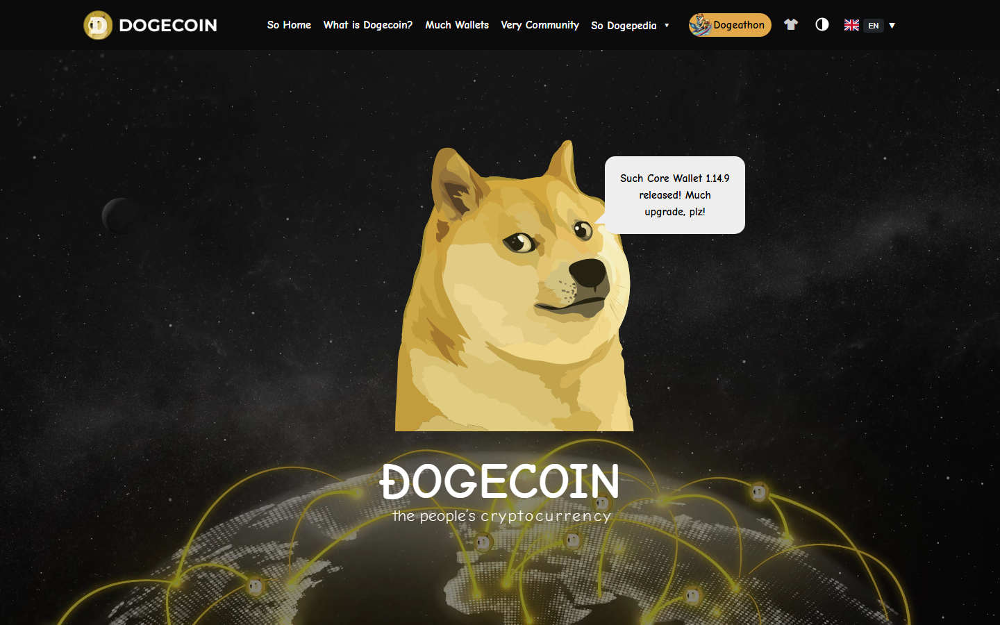

---
title: "Top Meme Coins in 2026: 12 Ranked by Liquidity, Staying Power, and Chain Relevance"
meta_title: "Top Meme Coins in 2026: 12 Ranked by Liquidity, Staying Power, and Chain Relevance"
meta_description: "Compare the top meme coins in 2026 -- DOGE, SHIB, PEPE, BONK, WIF, FLOKI, BRETT, and more. Ranked by market staying power and chain relevance, not just hype."
slug: "/markets/altcoins/top-meme-coins-2026/"
primary_keyword: "top meme coins 2026"
category: "Markets > Altcoins"
last_reviewed: "2026-07-27"
schema:
  - "Article"
  - "ItemList"
  - "FAQPage"
---

# Top Meme Coins in 2026

The top meme coins in 2026 are Dogecoin (DOGE), Shiba Inu (SHIB), PEPE, BONK, dogwifhat (WIF), FLOKI, BRETT, POPCAT, MOG, TURBO, Pudgy Penguins (PENGU), and SPX6900. DOGE and SHIB still anchor the category by market cap and recognition. PEPE is the dominant internet-native meme leader. BONK and WIF define Solana meme culture. BRETT does the same for Base chain. The rest are active rotation plays at different risk tiers.

Meme coins are speculative by design. They are not evaluated on utility or technology. They are evaluated on the same things that drive them: liquidity, community staying power, chain-level relevance, and cultural identity. Any beginner reading this should first understand [what a meme coin is](/guides/crypto-basics/what-is-a-meme-coin/) and how they differ from utility tokens before using this list.

For related reading: [how to spot crypto scams](/guides/security/how-to-spot-crypto-scams/) covers the red flags that appear most often in meme coin markets, and [top altcoins to watch](/markets/altcoins/top-altcoins-2026/) puts meme coins in the wider altcoin picture.

We reviewed category pages, public project surfaces, and community signal in July 2026.

## Rankings at a glance

| Rank | Coin | Chain | Score | Best for | Main watchout |
|---|---|---|---|---|---|
| 1 | DOGE | Dogecoin L1 | 5/5 | Category anchor, clearest large-cap meme coin | Still moves on news more than fundamentals |
| 2 | SHIB | Ethereum | 4.5/5 | Ecosystem-wrapper meme with broad community | Ecosystem claims outrun actual usage |
| 3 | PEPE | Ethereum | 4/5 | Internet-native culture and deep liquidity | Pure narrative, no product layer |
| 4 | BONK | Solana | 4/5 | Solana meme flagship, chain-level benchmark | Sentiment flips fast in Solana meme cycles |
| 5 | WIF | Solana | 3.5/5 | Simple brand identity, high attention ceiling | Thin fundamental case beyond identity |
| 6 | FLOKI | Ethereum + BNB | 3.5/5 | Meme with deliberate brand building | Marketing intensity is not risk reduction |
| 7 | BRETT | Base | 3/5 | Base chain meme benchmark | Concentration risk tied to Base growth |
| 8 | POPCAT | Solana | 3/5 | High-velocity meme attention study | Can reverse as fast as it rose |
| 9 | MOG | Ethereum | 2.5/5 | Culture-driven internet identity | Liquidity swings amplify volatility |
| 10 | TURBO | Ethereum | 2.5/5 | Unusual origin story, distinct from crowd | Story durability is uncertain |
| 11 | PENGU | Solana | 2.5/5 | NFT-to-token community extension | Early-cycle fragility, high rotation risk |
| 12 | SPX6900 | Ethereum | 2/5 | Late-cycle narrative momentum | Highest risk tier on the list |

## Ranking scorecard

Scored out of 10 per category. Total out of 50.

| Coin | Market cap staying power | Liquidity depth | Community durability | Chain relevance | Risk level (inverted) | **Total** |
|---|---|---|---|---|---|---|
| DOGE | 10 | 10 | 9 | 9 | 9 | **47** |
| SHIB | 9 | 9 | 8 | 7 | 7 | **40** |
| PEPE | 8 | 8 | 7 | 7 | 6 | **36** |
| BONK | 7 | 7 | 8 | 9 | 6 | **37** |
| WIF | 7 | 7 | 6 | 8 | 5 | **33** |
| FLOKI | 7 | 7 | 7 | 6 | 5 | **32** |
| BRETT | 6 | 6 | 6 | 8 | 5 | **31** |
| POPCAT | 5 | 6 | 5 | 7 | 4 | **27** |
| MOG | 5 | 5 | 6 | 5 | 4 | **25** |
| TURBO | 5 | 5 | 5 | 5 | 4 | **24** |
| PENGU | 5 | 5 | 5 | 6 | 3 | **24** |
| SPX6900 | 4 | 4 | 5 | 4 | 3 | **20** |

**Scoring notes.** Market cap staying power measures whether the coin maintained top-category ranking across multiple market cycles, not just peak performance. Liquidity depth scores how many major CEX pairs the coin has and typical daily volume. Community durability scores whether the community persisted through bear markets, not just bull runs. Chain relevance scores whether the coin functions as a flagship meme asset for its home chain. Risk level is inverted: higher score means lower risk. DOGE leads by a wide margin because it is the only meme coin that has survived every market cycle since 2013 with top-tier liquidity and cross-platform recognition.

## How the meme coin landscape divides in 2026

Three tiers structure the category:

**Tier 1 -- Category anchors (DOGE, SHIB, PEPE).** These are the meme coins with the deepest liquidity, the most exchange listings, and the broadest recognition outside crypto circles. DOGE and SHIB have been through multiple bear markets. PEPE entered the top tier faster than any meme coin since SHIB.

**Tier 2 -- Chain flagships (BONK, WIF, BRETT).** Every active blockchain ecosystem now produces a flagship meme coin. BONK and WIF dominate Solana. BRETT leads Base. These coins are legitimate chain-sentiment indicators but carry chain-concentration risk.

**Tier 3 -- Rotation plays (FLOKI, POPCAT, MOG, TURBO, PENGU, SPX6900).** These coins can produce large short-term moves during attention cycles but tend to give back gains faster than tier-1 or tier-2 names. They are harder to hold through volatility.

## 12 Top Meme Coins Reviewed (2026 List)

### 1. DOGE

Dogecoin is the original large-cap meme coin and still the clearest category anchor. It launched in 2013 as a joke, survived every crypto bear market since, and accumulated the deepest liquidity of any meme coin. It is listed on every major exchange with high daily trading volume.

The Elon Musk association gave DOGE mainstream exposure that no other meme coin has matched. References in Tesla payments experiments, X platform mentions, and the DOGE branding for the US Department of Government Efficiency in early 2025 kept DOGE in mainstream media. Those signals drove price action in ways that had nothing to do with protocol development.

What stands DOGE apart from the rest of the list is not performance. It is the survival record. DOGE dropped 90% in the 2022 bear market like most meme coins. It also recovered into the top 10 by market cap again, which is something very few meme coins have done.

DOGE threads appear consistently in [CryptoCurrency Reddit discussions on which meme coins hold value long-term](https://www.reddit.com/r/CryptoCurrency/comments/1p1d8qw/which_meme_coins_actually_survived_the_last_bear/), with a recurring observation that DOGE's age and mainstream name recognition create a floor that newer meme coins do not have.

**Best for:** Readers who want the most recognizable meme coin with the deepest liquidity and the clearest bear-market track record.
**Not ideal for:** Readers who want a fresh narrative or higher beta versus the broader meme coin category.

**Featured Image**
File: `../media/08-dogecoin-home-2026-07-27.png`
Alt text: `Dogecoin homepage showing the original meme coin, community-driven identity, and 2026 product positioning`
Caption: `Dogecoin homepage captured during our July 2026 review of top meme coins. The page has not changed dramatically since 2013, which is itself a signal about what DOGE is: a community asset, not a development roadmap.`

*Dogecoin homepage, July 2026. The simplicity of the public surface reflects the coin's identity: community-first, not product-first.*

---

### 2. SHIB

Shiba Inu is the second-largest meme coin by market cap and the most developed in terms of ecosystem ambition. The SHIB project has expanded beyond the original token to include ShibaSwap (a decentralized exchange), Shibarium (a Layer 2 network), BONE and LEASH sub-tokens, and a series of gaming and metaverse initiatives.

The SHIB community, called the SHIBArmy, is one of the most organized in crypto. They have sustained community activity through multiple bear markets, supported charity campaigns, and maintained an active presence across social platforms.

The gap to be aware of is between the ecosystem announcements and actual usage. ShibaSwap's TVL has not matched expectations, and Shibarium's activity remains modest relative to the scale of marketing. The ecosystem framing is real but still maturing.

One theme in [long-running SHIBArmy community threads on Reddit](https://www.reddit.com/r/CryptoCurrency/comments/1ko3a8t/is_shib_still_worth_following_in_2026_honest/) is that the project has kept building through bear markets when other meme coins went quiet, which is a positive signal even if execution lags behind the roadmap.

**Best for:** Readers who want a large-cap meme coin with deliberate ecosystem development beyond a pure speculation token.
**Not ideal for:** Readers who want ecosystem claims backed by matching on-chain activity.

**Screenshot 2**
File: `../media/08-shib-home-2026-07-27.png`
Alt text: `Shiba Inu homepage showing SHIB token, Shibarium Layer 2, and ecosystem positioning`
Caption: `Shiba Inu homepage captured during our July 2026 review of top meme coins. The page makes the ecosystem ambition clear: SHIB is not trying to stay a pure meme coin. Whether the ecosystem justifies the valuation is the question beginners should hold.`

---

### 3. PEPE

PEPE launched in April 2023 with no utility claims, no roadmap, and no team allocation. It reached a multi-billion dollar market cap within weeks, driven entirely by the cultural weight of the Pepe the Frog meme, which has been an internet fixture since 2005.

By 2026, PEPE had established itself as the third meme coin with genuine large-cap staying power, sitting alongside DOGE and SHIB in consistent top-20 rankings. Its distinguishing feature is that it never tried to be anything other than a meme. There is no ecosystem, no L2, no utility token. That purity is both its strength and its risk framing.

PEPE trades on all major exchanges and has deep derivatives markets. For a coin launched in 2023 with no pre-mine, no VC allocation, and no roadmap, the adoption speed was unprecedented.

A recurring observation in [CryptoCurrency Reddit threads on PEPE's staying power](https://www.reddit.com/r/CryptoCurrency/comments/1lf3jqm/why_is_pepe_still_in_the_top_20_after_two_years/) is that the cultural anchor -- Pepe the Frog as an internet-native symbol -- gives PEPE a recognition ceiling that most newer meme coins cannot access.

**Best for:** Readers who want the most internet-culturally grounded meme coin with major-exchange liquidity and no ecosystem complexity to decode.
**Not ideal for:** Readers who want anything beyond pure narrative and liquidity as a value case.

---

### 4. BONK

BONK is the flagship meme coin of the Solana ecosystem. It launched in December 2022 as an airdrop to Solana NFT holders and Solana developers, a launch model that tied the coin directly to the community it was building for.

Since then, BONK has become the clearest single-coin sentiment indicator for Solana retail culture. When Solana is attracting attention and retail flows, BONK tends to amplify that signal. When Solana sentiment turns, BONK often moves faster and harder to the downside.

BONK's chain relevance is genuine. It has been integrated into Solana DeFi protocols, NFT platforms, and payment applications on Solana at a scale that other Solana meme coins have not matched.

**Best for:** Readers who want to track Solana retail culture through a single coin benchmark.
**Not ideal for:** Readers who want stability across different chain-attention cycles.

---

### 5. WIF

Dogwifhat (WIF) is a Solana meme coin featuring a Shiba Inu dog wearing a knit hat. The image is the entire thesis. There is no ecosystem, no roadmap, and no utility claim.

WIF became the second major Solana meme coin after BONK, reaching a multi-billion dollar market cap in 2024. What made it notable was not the image itself but how efficiently it scaled: simple visual identity, high social shareability, and the Solana ecosystem momentum behind it.

The risk is that WIF's case rests entirely on the market deciding that a dog in a hat is worth attention. That is not a criticism -- it is how meme coins work. But it means that the same mechanisms that drove the rise can reverse on little notice.

**Best for:** Readers who want to study how simple visual identity creates meme coin breakouts.
**Not ideal for:** Readers who want any fundamental case beyond identity and attention.

---

### 6. FLOKI

FLOKI began as a tribute to Elon Musk's Shiba Inu dog and has since built one of the more deliberate brand-building operations in meme coin culture. The project has pursued billboard advertising campaigns, sports sponsorships, and a metaverse product called Valhalla.

The FLOKI brand is stronger and more consistent than most meme coins, which differentiates it from pure attention plays. Whether that marketing intensity translates into durable value is an open question. The marketing layer is real but the on-chain utility remains thin.

**Best for:** Readers who want a meme coin with deliberate brand infrastructure beyond community sentiment alone.
**Not ideal for:** Readers who expect marketing spend to function as a risk buffer.

---

### 7. BRETT

BRETT is the leading meme coin on Base, Coinbase's Layer 2 network. It is named after the "Boy's Club" comic strip character that also inspired the broader internet meme culture around Pepe.

BRETT serves as a useful chain-level benchmark: if Base ecosystem is attracting retail attention, BRETT tends to reflect that early. Coinbase's distribution reach gives Base an onboarding advantage, which gives BRETT a broader potential entry point than most chain-specific meme coins.

The concentration risk is real. BRETT's value proposition depends heavily on Base's continued growth. If Base attention rotates to another chain, BRETT loses its primary tailwind.

**Best for:** Readers who want a Base ecosystem benchmark and are comfortable with chain-concentration risk.
**Not ideal for:** Readers who want cross-chain diversification in their meme coin exposure.

---

### 8. POPCAT

POPCAT is a Solana meme coin that combines cultural recognition with high volatility. It is based on the Popcat internet meme, which showed a cat opening its mouth dramatically.

The coin demonstrates a recurring meme coin pattern: an immediately recognizable internet image, a fast launch, and a sharp attention spike. POPCAT reached high market caps quickly and has since experienced the volatility that characterizes tier-3 meme coins.

**Best for:** Readers who want to study how attention-driven meme coins behave during peak cycle phases.
**Not ideal for:** Readers who want durability or a low-volatility meme coin entry point.

---

### 9. MOG

MOG is an Ethereum-based meme coin with a cultural identity rooted in online internet community culture. The "mog" concept -- dominating or outperforming in social settings -- gives it a distinct angle compared to animal-image meme coins.

The community around MOG is culture-first rather than speculation-first, which can create more persistent engagement but does not protect against the same liquidity dynamics that affect all meme coins.

**Best for:** Readers who want a culture-identity meme coin with Ethereum liquidity access.
**Not ideal for:** Readers who need major-exchange depth comparable to DOGE or PEPE.

---

### 10. TURBO

TURBO has a distinct origin story: it was created by an AI (GPT-4) given a small budget ($69) as an experiment in whether an AI could launch a successful meme coin. The experiment attracted enough attention to drive real market cap.

The story is genuinely unusual in a category where most projects look similar. Whether the story translates into long-term market relevance is the open question. Origin narratives can sustain attention for a cycle but are less durable than cultural icons.

**Best for:** Readers interested in the AI-generated meme coin origin story angle.
**Not ideal for:** Readers who want a track record longer than a single narrative cycle.

---

### 11. PENGU

PENGU is the token associated with Pudgy Penguins, one of the most recognized NFT brands in crypto. The token launched to extend the Pudgy Penguins community from the NFT space into the fungible token market.

The NFT-to-token model gives PENGU a built-in community and an existing brand. The risk is that it is a newer token with limited track record in bear markets and faces the specific challenge of maintaining relevance as NFT market cycles turn.

**Best for:** Readers who want exposure to a known NFT brand through a fungible token.
**Not ideal for:** Readers who need multiple market cycles of evidence before entering a meme coin.

---

### 12. SPX6900

SPX6900 is a meme coin that frames itself as a satirical challenge to the S&P 500 index, presenting crypto as the eventual replacement for traditional finance. The narrative is specific and the community around it has been vocal.

SPX6900 sits at the highest risk tier on this list: newer, smaller market cap, and more dependent on a single narrative for its attention. That does not mean it cannot produce large returns during attention cycles, but it also means the downside is steeper and faster.

**Best for:** Readers who want to study high-risk late-cycle narrative plays in meme coin markets.
**Not ideal for:** Beginners or anyone who cannot absorb total loss on this position.

---

## What actually separates the lasting meme coins from the rest

The meme coins that survive multiple cycles share one characteristic: they became reference points for something bigger than their own token. DOGE became the reference for "meme coin" as a concept. SHIB became the reference for "community-driven crypto project." PEPE became the reference for internet-native cultural assets in crypto.

New meme coins can achieve that status -- BONK did it for the Solana ecosystem, BRETT is doing it for Base -- but most do not. The question for any meme coin outside the top three is whether it is building a reference-point identity or simply riding an attention cycle.

The practical rule for beginners is simpler: if you cannot name the cultural anchor or the chain-level reason for the coin's identity, it is probably a rotation play rather than a category reference.

## Common mistakes beginners make with meme coins

**Treating past performance as a strategy.** A meme coin that returned 1,000% in 2024 does not have a repeatable mechanism. The catalyst was attention, which is not predictable.

**Ignoring chain risk.** Chain-specific meme coins (BONK, WIF, BRETT) carry the underlying chain's risk in addition to meme coin volatility. A Solana outage or a Base ecosystem shift affects those coins directly.

**Confusing community size with durability.** Large communities existed around many meme coins that are now dormant. Community size at peak is not the same as community durability through a bear market.

**Skipping the exchange check.** A meme coin that is only available on DEXes or small CEXes carries higher manipulation and liquidity risk than one listed on Coinbase, Binance, and Kraken.

## Why you can trust this guide

This guide is based on public project pages, category dashboards, and community signal reviewed in July 2026. Where market cap rankings are referenced, the source is CoinGecko's meme-token category page at time of review. Meme coin rankings shift rapidly. Check current rankings before any decision.

## What we checked ourselves before ranking these meme coins

We reviewed CoinGecko's meme-token category page, CoinMarketCap's meme filter, and the public surfaces of each project listed above in July 2026. We also reviewed community discussion patterns across Reddit for tier-1 and tier-2 coins.

What we did not check: live order book depth, intraday volatility data, or real-time social sentiment. Those change too fast to be useful in an evergreen article. The ranking reflects category structure, not tomorrow's price.

## FAQ

### What is the top meme coin in 2026?

Dogecoin (DOGE) is the top meme coin by market cap durability and exchange liquidity. PEPE is the top meme coin by internet-native cultural relevance. BONK leads the Solana ecosystem specifically.

### Are meme coins a good investment for beginners?

No. Meme coins are high-risk speculation assets. Beginners who buy meme coins should only use an amount they can lose entirely. The coins in tier 3 of this list have realistic paths to losing all value.

### Why do meme coins go up?

Meme coins rise when attention and liquidity combine: enough people decide a coin is worth owning, buy it at the same time, and create momentum. The same mechanism runs in reverse. There is no earnings report, no revenue, and no product that changes the math.

### How do I know if a new meme coin is a scam?

Check [how to spot crypto scams](/guides/security/how-to-spot-crypto-scams/) for the full checklist. The fastest scan: no liquidity lock, anonymous team, no audited contract, and a social media presence that is two weeks old.

### What is the difference between DOGE and SHIB?

DOGE is older (2013), has no ecosystem plans, and runs on its own blockchain. SHIB is newer (2020), has a broader ecosystem ambition including a Layer 2 and a DEX, and runs on Ethereum. Both are large-cap meme coins. DOGE has a stronger bear-market track record.

## Sources

- [CoinGecko Meme Token Category](https://www.coingecko.com/en/categories/meme-token)
- [CoinMarketCap Meme Coins](https://coinmarketcap.com/view/memes/)
- [Dogecoin](https://dogecoin.com/)
- [Shiba Inu](https://www.shibatoken.com/)
- [Pepe](https://pepe.vip/)
- [BONK](https://bonkcoin.com/)
- [dogwifhat](https://dogwifcoin.org/)
- [FLOKI](https://floki.com/)
- [CryptoCurrency Reddit thread on meme coin bear market survival](https://www.reddit.com/r/CryptoCurrency/comments/1p1d8qw/which_meme_coins_actually_survived_the_last_bear/)
- [CryptoCurrency Reddit thread on PEPE staying power](https://www.reddit.com/r/CryptoCurrency/comments/1lf3jqm/why_is_pepe_still_in_the_top_20_after_two_years/)
- [CryptoCurrency Reddit thread on SHIB in 2026](https://www.reddit.com/r/CryptoCurrency/comments/1ko3a8t/is_shib_still_worth_following_in_2026_honest/)
