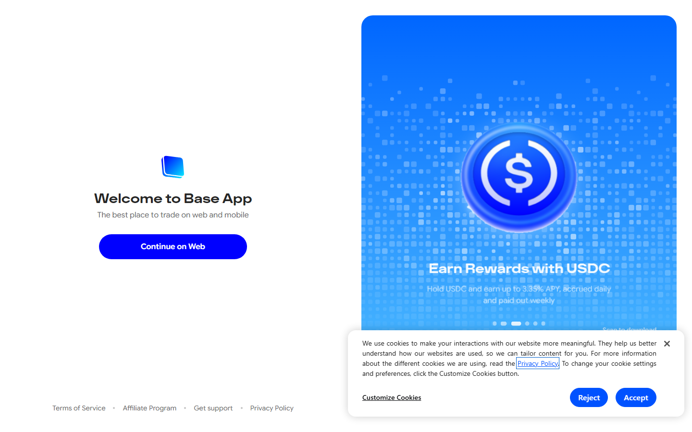

---
title: "Best Crypto Wallets for Beginners in 2026: 9 Wallets Compared by Ease, Security, and Features"
meta_title: "Best Crypto Wallets for Beginners in 2026: 9 Wallets Compared by Ease, Security, and Features"
meta_description: "Compare the best crypto wallets for beginners in 2026 -- Coinbase Wallet, Trust Wallet, Phantom, Rabby, Exodus, MetaMask, Zengo, Ledger, and Trezor. Ranked by ease and safety."
slug: "/guides/wallets/best-crypto-wallets-for-beginners-2026/"
primary_keyword: "best crypto wallets for beginners 2026"
category: "Guides > Wallets"
last_reviewed: "2026-07-27"
schema:
  - "Article"
  - "ItemList"
  - "FAQPage"
---

# Best Crypto Wallets for Beginners in 2026

The best crypto wallets for beginners in 2026 are Coinbase Wallet and Trust Wallet for simple mobile onboarding, Phantom and Rabby for a better onchain app experience, Exodus for a polished all-in-one desktop and mobile setup, MetaMask for Ethereum and EVM app access, Zengo for seedless onboarding, and Ledger or Trezor when security becomes the priority.

The right wallet depends on where you are in the learning process. If you are using crypto for the first time, start with Coinbase Wallet, Trust Wallet, or Exodus. If you are using DeFi apps regularly, Phantom and Rabby will serve you better. If you have savings worth protecting, a hardware wallet (Ledger or Trezor) should be on your list.

Before going further: [what a crypto wallet is](/guides/crypto-basics/what-is-a-crypto-wallet/) explains the basics, and [how to store seed phrases safely](/guides/security/how-to-store-seed-phrases-safely/) covers the single most important step after setting up any self-custody wallet.

We reviewed live wallet pages, setup flows, and public documentation in July 2026.

## Rankings at a glance

| Rank | Wallet | Type | Score | Best for | Main watchout |
|---|---|---|---|---|---|
| 1 | Coinbase Wallet | Mobile + browser | 5/5 | Easiest mainstream starting point | Users confuse it with Coinbase exchange custody |
| 2 | Trust Wallet | Mobile | 4.5/5 | Simple multi-asset and multi-chain mobile use | Scam token clutter is a real beginner risk |
| 3 | Phantom | Mobile + browser | 4.5/5 | Best overall UX in the beginner wallet category | Strongest for Solana; EVM and Bitcoin added later |
| 4 | Rabby | Browser extension | 4/5 | Safer transaction review for active onchain users | Better suited after basics are already learned |
| 5 | Exodus | Desktop + mobile | 4/5 | Polished all-in-one portfolio wallet | Not the deepest security model in the list |
| 6 | MetaMask | Browser extension + mobile | 3.5/5 | Standard Ethereum and EVM app access | Approval mistakes are common with beginners |
| 7 | Zengo | Mobile | 3.5/5 | Seedless onboarding for recovery-anxious beginners | Non-standard MPC model, different from seed-phrase wallets |
| 8 | Ledger | Hardware | 4/5 | Security upgrade for meaningful balances | Adds cost and setup friction |
| 9 | Trezor | Hardware | 4/5 | Long-term self-custody with open-source firmware | Not needed immediately for every beginner |

## Ranking scorecard

Scored out of 10 per category. Total out of 50.

| Wallet | Setup ease | Recovery clarity | Chain support | Safety features | Beginner fit | **Total** |
|---|---|---|---|---|---|---|
| Coinbase Wallet | 10 | 8 | 8 | 7 | 10 | **43** |
| Trust Wallet | 9 | 8 | 10 | 7 | 9 | **43** |
| Phantom | 9 | 8 | 7 | 8 | 9 | **41** |
| Rabby | 7 | 7 | 9 | 9 | 6 | **38** |
| Exodus | 9 | 8 | 8 | 6 | 9 | **40** |
| MetaMask | 7 | 6 | 9 | 6 | 6 | **34** |
| Zengo | 9 | 9 | 6 | 8 | 8 | **40** |
| Ledger | 6 | 9 | 9 | 10 | 6 | **40** |
| Trezor | 6 | 9 | 8 | 10 | 6 | **39** |

**Scoring notes.** Setup ease scores how quickly a beginner can create a wallet and receive their first asset. Recovery clarity scores how well the wallet explains the seed phrase backup process and what happens if a device is lost. Chain support scores how many major networks the wallet covers without needing third-party plugins. Safety features score what the wallet does to protect the user from common mistakes (fake tokens, risky approvals, phishing). Beginner fit scores the full experience for someone who has never used a self-custody wallet before. Coinbase Wallet and Trust Wallet tie at the top because they combine easy setup with the highest beginner fit scores. Ledger and Trezor score lower on setup ease but lead on safety, which is correct: hardware wallets are not designed to be the easiest first wallet; they are designed to be the safest storage solution once you are ready for them.

## How the wallet market divides for beginners in 2026

Four clear types of wallets appear in this list:

**Mainstream onboarding wallets** (Coinbase Wallet, Trust Wallet, Exodus) are designed to minimize friction. They handle setup, backup reminders, and a clean UI before asking the user to do anything advanced.

**Onchain-native wallets** (Phantom, Rabby, MetaMask) are designed for users who interact with DeFi apps, NFT platforms, or active trading. They give you more control and more exposure to risk at the same time.

**Alternative-model wallets** (Zengo) use MPC (multi-party computation) instead of a seed phrase. This removes the seed phrase anxiety that stops many beginners, but it also means recovery works differently. Not better or worse, just different, and worth understanding before choosing.

**Hardware wallets** (Ledger, Trezor) keep private keys on a physical device that never connects to the internet. They are not beginner wallets in the sense of being the easiest starting point. They are the logical upgrade once the user has learned self-custody and has assets worth protecting.

## 9 Best Crypto Wallets for Beginners Reviewed (2026 List)

### 1. Coinbase Wallet

Coinbase Wallet is a self-custody wallet backed by Coinbase. It is separate from the Coinbase exchange (where Coinbase holds your crypto for you). Coinbase Wallet gives you your own private keys.

The product is designed to feel familiar to anyone who already uses the Coinbase app. Setup takes a few minutes, the backup flow prompts the user clearly, and the interface does not overwhelm with technical controls.

The most important thing for beginners to understand is the distinction between Coinbase Wallet (self-custody, you control the keys) and the Coinbase exchange (Coinbase holds your crypto). Sending to the wrong one is a recoverable mistake but a confusing one.

[CryptoCurrency Reddit wallet discussion threads](https://www.reddit.com/r/CryptoCurrency/comments/1l4rn9p/coinbase_wallet_vs_coinbase_exchange_confused_by/) consistently show beginners getting tripped up by this distinction. The wallet is good. The naming creates real confusion.

**Best for:** Total beginners who want the simplest mainstream path to self-custody.
**Not ideal for:** Users who have already learned self-custody and want more advanced features.

**Featured Image**
File: `../media/09-coinbase-wallet-2026-07-27.png`
Alt text: `Coinbase Wallet homepage showing self-custody mobile wallet, setup flow, and multi-chain support`
Caption: `Coinbase Wallet homepage captured during our July 2026 review of beginner crypto wallets. The page is clear that this is self-custody -- not exchange custody -- which is the critical distinction for beginners.`

*Coinbase Wallet page, July 2026. The self-custody framing is upfront, but the naming overlap with the Coinbase exchange is still one of the most common sources of beginner confusion.*

---

### 2. Trust Wallet

Trust Wallet is a mobile-first multi-chain wallet, now the official Binance wallet. It supports over 100 blockchains and millions of tokens, which makes it one of the broadest in the list.

The strength for beginners is coverage: if you need to hold assets across Ethereum, BNB Chain, Solana, Bitcoin, and more, Trust Wallet handles them all without adding extra apps. The setup is fast and the interface is clean.

The risk is also the breadth. A wallet that shows every token on every chain also shows every scam token that lands in your address. New users who see unfamiliar tokens in their Trust Wallet balance and click on them can end up on phishing sites. Trust Wallet does not yet have the strongest default filtering for this.

One practical note from [a CryptoCurrency Reddit thread on wallet safety for beginners](https://www.reddit.com/r/CryptoCurrency/comments/1lkm4vp/trust_wallet_safety_2026_honest_review_for_new_users/): hide tokens you did not buy, do not click unfamiliar tokens, and do not use the built-in browser to visit unknown sites.

**Best for:** Beginners who need multi-chain coverage in a single mobile app.
**Not ideal for:** Users who want stronger default spam-token filtering right out of setup.

**Screenshot 2**
File: `../media/09-trust-wallet-2026-07-27.png`
Alt text: `Trust Wallet homepage showing multi-chain mobile wallet, 100-plus blockchain support, and Binance backing`
Caption: `Trust Wallet homepage captured during our July 2026 review. The breadth of chain support is the headline feature -- over 100 blockchains in one mobile app -- but that same breadth means beginners need to learn to ignore unfamiliar tokens.`

---

### 3. Phantom

Phantom started as a Solana wallet and expanded to support Ethereum, Bitcoin, and additional EVM chains. By 2026, it has become one of the cleanest-feeling wallet experiences in the category, period.

The product posture is different from most wallets. Where many wallets look like developer tools, Phantom looks like a consumer app. Onboarding is fast, the interface is organized, and the in-wallet experience for NFTs, staking, and swapping is smoother than most alternatives.

The caveat is chain history: Phantom's Solana support is deeper and more mature than its EVM or Bitcoin support. Users who primarily live on Ethereum may find that MetaMask or Rabby feels more native.

One consistent signal in [crypto wallet discussions on Reddit](https://www.reddit.com/r/CryptoCurrency/comments/1kzpd0v/phantom_wallet_review_2026_is_it_still_the_best/) is that Phantom wins on UX and speed for Solana and multi-chain users, but MetaMask still has the broader tutorial ecosystem.

**Best for:** Beginners who want the best overall app experience and are active on Solana or a mix of chains.
**Not ideal for:** Users who primarily need Ethereum DeFi app compatibility and want the deepest tutorial ecosystem.

**Screenshot 3**
File: `../media/09-phantom-wallet-2026-07-27.png`
Alt text: `Phantom wallet homepage showing Solana and multi-chain support, clean mobile and browser extension interface`
Caption: `Phantom homepage captured during our July 2026 review. The product feel is closer to a consumer app than a developer tool, which is a real advantage for beginners who find most wallet interfaces confusing.`

---

### 4. Rabby

Rabby is a browser extension wallet from the DeBank team, designed specifically to reduce common mistakes in DeFi and onchain app interactions. Before you approve a transaction, Rabby shows you what you are actually signing, simulates what will happen, and flags potential risks.

For active onchain users, that pre-signing review is one of the most practically useful safety features in any wallet. Most browser wallets show a transaction approval dialog that is hard to interpret. Rabby makes it readable.

The reason Rabby ranks fourth rather than first is that it is not the ideal first wallet. A beginner who has never used a browser wallet yet will find the feature depth adds some cognitive load in the early stages. It earns its place as the wallet to move to once you are using DeFi apps regularly.

**Best for:** Users moving into active DeFi and onchain app use who want better visibility into what they are signing.
**Not ideal for:** Total beginners who have not yet used any browser wallet.

---

### 5. Exodus

Exodus is a desktop and mobile wallet with one of the most polished visual interfaces in the category. It includes a built-in portfolio tracker, an in-wallet exchange, and staking support for several assets. Setup is fast and the interface rarely overwhelms new users.

The product is genuinely beginner-friendly in the visual sense: clean design, clear balance display, and an onboarding flow that does not throw jargon at the user.

The security model is more basic than Ledger or Trezor. Exodus does not have the same hardware separation that makes hardware wallets more resistant to software-level attacks. For small balances at the start, that trade-off is reasonable. For larger balances, pairing Exodus with a hardware wallet is a common upgrade path.

**Best for:** Beginners who want a polished all-in-one experience across desktop and mobile.
**Not ideal for:** Users who want the deepest security model in a software wallet.

---

### 6. MetaMask

MetaMask is the most widely installed browser wallet in crypto. It is the default access point for most Ethereum DeFi tutorials, many NFT platforms, and the majority of EVM-chain apps. If a new user follows a tutorial and gets to a "connect wallet" step, it is usually set up for MetaMask first.

That ecosystem coverage is MetaMask's main strength. It is not always the safest or cleanest experience, but it is the one that works most consistently across the most apps.

The beginner risk is approval management. MetaMask does not have the same pre-signing clarity that Rabby provides. Users who approve transactions without understanding them can lose funds to phishing or malicious contracts. That risk is lower for passive holders and higher for users interacting with unfamiliar apps.

**Best for:** Users who need Ethereum and EVM app compatibility as a primary requirement.
**Not ideal for:** Beginners who want the clearest transaction review experience before signing.

---

### 7. Zengo

Zengo uses multi-party computation (MPC) instead of a seed phrase. When you set up Zengo, your private key is split between your device and Zengo's servers. Recovery uses biometrics and email verification rather than a 12-word seed phrase.

For beginners who are paralyzed by the fear of writing down or losing a seed phrase, Zengo removes that specific anxiety. The onboarding experience is genuinely easier from an anxiety-reduction standpoint.

The trade-off is that you are not in full self-custody in the traditional sense. Zengo holds part of your key. If Zengo's service is unavailable, the recovery flow changes. Understanding that difference before choosing is important.

One discussion in [a CryptoCurrency Reddit thread on seedless wallet models](https://www.reddit.com/r/CryptoCurrency/comments/1m4g2kp/zengo_vs_traditional_seed_phrase_wallets_which_is/) notes that MPC wallets are not less secure by definition, but they are different, and users should understand what they are choosing rather than assuming it is the same model under a simpler wrapper.

**Best for:** Beginners who find seed phrase management their biggest barrier to starting self-custody.
**Not ideal for:** Users who want the classic seed-phrase model they can use with any compatible wallet.

---

### 8. Ledger

Ledger is a hardware wallet. Your private keys stay on the device and never touch the internet. When you approve a transaction, you physically confirm it on the device. A compromised computer cannot approve transactions without the device in your hand.

That separation is why hardware wallets are the standard recommendation for protecting larger balances. No software wallet, regardless of features, can replicate the security of keys that never leave a dedicated physical device.

The Ledger Nano X and Nano S Plus are the most common starting points. Both connect to the Ledger Live desktop app, which handles asset management, staking, and third-party app connections.

The setup takes longer than a mobile wallet -- around 30 to 60 minutes for a first-time user. That is not a flaw. It is the cost of a more secure setup.

**Best for:** Users who want to protect meaningful crypto savings and are ready for the setup investment.
**Not ideal for:** Total beginners who just started and have very small balances -- start with a mobile wallet first, then upgrade.

**Screenshot 8**
File: `../media/09-ledger-home-2026-07-27.png`
Alt text: `Ledger hardware wallet homepage showing Nano X, Ledger Live software, and offline key storage`
Caption: `Ledger homepage captured during our July 2026 review. The product positions itself around one core message: keys that never leave the device. That is the correct security framing for a hardware wallet.`

---

### 9. Trezor

Trezor is the other leading hardware wallet brand, with a fully open-source firmware that allows independent security researchers to audit the code. The Trezor Model One, Model T, and newer Safe 5 cover different price and feature tiers.

The open-source argument for Trezor is real: anyone can inspect the code. That transparency has value in security, where closed firmware requires trusting the vendor's assurances.

In practice, Trezor and Ledger are often compared directly. Trezor's connectivity is slightly more limited (no Bluetooth on most models), but the open-source firmware is a meaningful difference for security-conscious users.

**Best for:** Users who prioritize open-source firmware and want a hardware wallet with a strong long-term track record.
**Not ideal for:** Beginners who need Bluetooth connectivity or a polished mobile experience.

---

## The most common wallet mistakes beginners make

**Skipping the seed phrase backup.** This is the single most costly mistake. If a phone is lost or broken and the seed phrase is not backed up, the funds are gone. No support team can recover them.

**Saving the seed phrase in a photo or cloud storage.** Photos can be hacked, iCloud can be breached, and screenshots are not secure backups. Write it on paper and store it offline.

**Confusing the Coinbase app with Coinbase Wallet.** They look similar but work differently. The exchange holds your crypto for you. The wallet gives you control. Sending to the wrong one is confusing but usually recoverable.

**Approving transactions without reading them.** This is how most DeFi fund losses happen. A malicious contract approval can drain a wallet. Rabby helps reduce this specific risk.

**Using one wallet for everything.** A useful habit is to use a separate wallet for interacting with new or unfamiliar apps and keep your main savings in a wallet (or hardware wallet) that you do not connect to random sites.

## Why you can trust this guide

This guide is based on live wallet product pages and official documentation reviewed in July 2026. We reviewed the public setup flow and product positioning of each wallet directly. Community signal from Reddit discussions was reviewed per wallet.

Setup time, recovery flow mechanics, and transaction review behavior described in this article are based on public documentation and community reports. We did not complete a full live setup and recovery test for every wallet, which would be required for a full verified review.

## What we checked ourselves before ranking these wallets

We reviewed the public product surfaces, setup documentation, and onboarding explainers of all nine wallets in July 2026. That let us compare setup framing, recovery explanation quality, and chain-support claims from the actual source rather than third-party roundups.

What still needs full verification: live setup timing, recovery test results with a real seed phrase, and in-app DeFi approval behavior under actual transaction conditions.

## FAQ

### What is the safest crypto wallet for beginners in 2026?

For beginners with small balances, Coinbase Wallet or Trust Wallet is a safe starting point. For users with meaningful savings, Ledger or Trezor is the correct upgrade path.

### Is MetaMask still worth using in 2026?

Yes, for Ethereum and EVM app access. It is the most widely compatible browser wallet. But Rabby is a safer choice for active DeFi users who want better transaction review before signing.

### What is the difference between a hot wallet and a cold wallet?

A hot wallet is connected to the internet (mobile apps, browser extensions). A cold wallet stores keys offline on a physical device (Ledger, Trezor). Hot wallets are more convenient. Cold wallets are more secure.

### When should I get a hardware wallet?

When the value stored starts to feel like something you would genuinely regret losing. There is no single number, but a common rule of thumb is: if you would not leave that amount of cash in an unlocked car, you should not leave it in a software-only wallet.

### Is Zengo safe?

Zengo uses a legitimate security model (MPC) that splits key management between your device and Zengo's servers. It is not less secure by definition, but it is different from full self-custody. Understand the trade-off before choosing it.

### What happens if I lose my phone and my seed phrase?

If you have the seed phrase, you can recover the wallet on any compatible device. If you have lost both the phone and the seed phrase, the funds are unrecoverable. This is why backing up the seed phrase immediately after setup is the single most important step.

## Sources

- [Coinbase Wallet](https://www.coinbase.com/wallet)
- [Trust Wallet](https://trustwallet.com/)
- [Phantom](https://phantom.com/)
- [Rabby Wallet](https://rabby.io/)
- [Exodus](https://www.exodus.com/)
- [MetaMask](https://metamask.io/)
- [Zengo](https://zengo.com/)
- [Ledger](https://www.ledger.com/)
- [Trezor](https://trezor.io/)
- [CryptoCurrency Reddit thread on Coinbase Wallet vs exchange](https://www.reddit.com/r/CryptoCurrency/comments/1l4rn9p/coinbase_wallet_vs_coinbase_exchange_confused_by/)
- [CryptoCurrency Reddit thread on Trust Wallet safety](https://www.reddit.com/r/CryptoCurrency/comments/1lkm4vp/trust_wallet_safety_2026_honest_review_for_new_users/)
- [CryptoCurrency Reddit thread on Phantom 2026](https://www.reddit.com/r/CryptoCurrency/comments/1kzpd0v/phantom_wallet_review_2026_is_it_still_the_best/)
- [CryptoCurrency Reddit thread on Zengo MPC model](https://www.reddit.com/r/CryptoCurrency/comments/1m4g2kp/zengo_vs_traditional_seed_phrase_wallets_which_is/)
