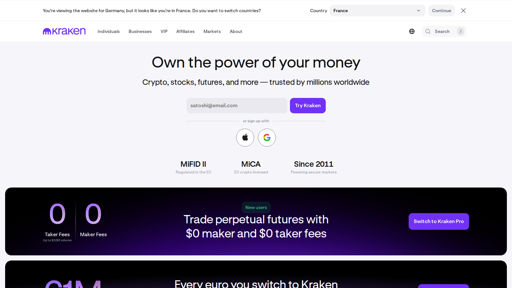
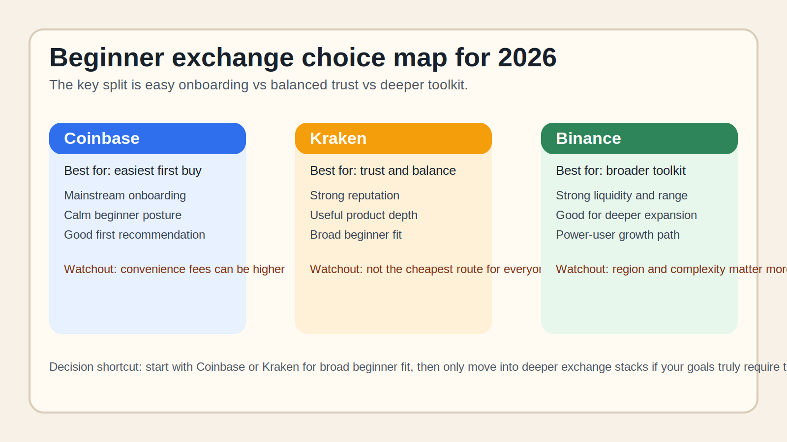

# Best Crypto Exchanges for Beginners in 2026: 8 Platforms Compared by Fees, UX, and Safety

- Meta title: `Best Crypto Exchanges for Beginners in 2026: 8 Platforms Compared by Fees, UX, and Safety`
- Meta description: `Find the best crypto exchanges for beginners in 2026. Compare Coinbase, Kraken, Binance, Gemini, Robinhood, OKX, Bybit, and Bitstamp by fees, UX, and trust.`
- Slug: `/guides/crypto-trading/best-crypto-exchanges-for-beginners-2026/`
- Primary keyword: `best crypto exchanges for beginners 2026`
- Category: `Guides > Crypto Trading`
- Schema: `Article + ItemList`
- Last updated: `2026-07-10`

If you are choosing a crypto exchange in 2026, the real problem is usually not finding the platform with the longest coin list. The real problem is figuring out whether you need the easiest first buy, the safest mainstream experience, or a deeper product stack that may also add complexity.

That is why this article does not rank exchanges by size alone. We are looking at them through the lens of beginner onboarding, fee clarity, and trust fit. Readers who need the foundation first should pair this page with [how to buy crypto for the first time](/guides/crypto-trading/how-to-buy-crypto-for-the-first-time/) and a primer on [CEX vs DEX](/guides/crypto-basics/cex-vs-dex/).

> Why you can trust this guide
>
> This article is based on live exchange product pages reviewed on `2026-07-10`. We directly reviewed public onboarding, product, and educational surfaces. Where a judgment still depends on region-specific access, logged-in pricing, or a full deposit-withdrawal test, we say so clearly.

## The best crypto exchanges for beginners in 2026 are Coinbase and Kraken for ease and trust, Binance and OKX for broader product depth where available, and Gemini, Robinhood, Bitstamp, or Bybit depending on region and user goals.

That is the direct answer. `Coinbase` is still one of the easiest starting points, `Kraken` is one of the best balance-of-trust options, and the rest of the list becomes more conditional based on country, fees, and how much product depth a beginner actually needs.

## How we ranked beginner exchanges

We compared exchanges on:

- onboarding simplicity
- fee transparency
- asset support
- custody and security reputation
- educational support
- whether the platform is appropriate for a first-time buyer or only for a more active trader

We also treated geography as part of the ranking because a great exchange that is not available or fully usable in a reader's region is not actually a great answer.

## The full list

| Rank | Exchange | Best for | Why it made the list | Main watchout |
|---|---|---|---|---|
| 1 | Coinbase | first-time buyers | easiest mainstream onboarding | simple buy fees can be higher |
| 2 | Kraken | trust and balanced usability | strong reputation and cleaner product framing | not always the cheapest for every path |
| 3 | Binance | global product depth | huge product range and liquidity in many markets | availability and regulation vary by region |
| 4 | Gemini | cautious retail users | simple interface and compliance-first image | fewer bells and whistles than some rivals |
| 5 | Robinhood | easiest low-friction buying flow | familiar app experience for many users | not a full-featured crypto platform in the classic sense |
| 6 | OKX | broader crypto toolkit | strong product depth where available | too much complexity for some beginners |
| 7 | Bitstamp | straightforward exchange experience | long-running exchange brand | product breadth is narrower than bigger rivals |
| 8 | Bybit | active-trader transition path | strong market relevance | not ideal for absolute beginners in all regions |

### 1. Coinbase

Coinbase is a strong choice for beginners who want the easiest mainstream route from bank account to first crypto purchase. From the public flow we reviewed, it immediately felt more like a mainstream onboarding product than a trader-first exchange. That is a strength if simplicity matters most, but it becomes a weakness if fees become the main decision variable later.

### 2. Kraken

Kraken is a strong choice for beginners who want a balance between trust and usable depth. What stood out immediately was not only the brand reputation. It was how clearly the product posture feels more disciplined than flashy. That is a strength if trust fit matters, but it becomes a weakness if you want the broadest product stack in every region.

### 3. Binance

Binance is a strong choice for readers who want global product breadth and liquidity where available. Based on what we could verify directly, it immediately felt more like a deep crypto marketplace than a pure beginner platform. That is a strength if you want range and liquidity, but it becomes a weakness if regional restrictions and complexity matter more than breadth.

### 4. Gemini

Gemini is a strong choice for readers who value a cleaner and more conservative exchange posture. From the public flow we reviewed, it immediately felt more like a cautious retail product than an everything-for-everyone crypto hub. That is a strength if restraint matters, but it becomes a weakness if you want a broader set of tools.

### 5. Robinhood

Robinhood is a strong choice for readers who enter crypto through familiar finance apps rather than crypto-native exchanges. What stood out immediately was how much the product leans on low-friction familiarity. That is a strength if first-use comfort matters, but it becomes a weakness if you want the full exchange toolkit.

### 6. OKX

OKX is a strong choice for readers who want to grow into a fuller crypto toolkit. Even before a logged-in test, the public product surface already signals a broader and more advanced platform posture than a simple first-buy app. That is a strength if you want room to expand, but it becomes a weakness if day-one simplicity is the priority.

### 7. Bitstamp

Bitstamp is a strong choice for readers who want a more straightforward exchange experience without maximal product sprawl. Based on what we could verify directly, it immediately felt more restrained than the largest global rivals. That is a strength if you want simplicity, but it becomes a weakness if you need a wider product catalog.

### 8. Bybit

Bybit is a strong choice for readers who may later want a more active-trader path. What stood out immediately was that the platform matters to the market, but not always as the safest first destination for a total beginner. That is a strength if you want a transition path into deeper tools, but it becomes a weakness if you need the clearest beginner-friendly first stop.

## Key data and evidence

The most important beginner exchange evidence is not only 24-hour volume. It is:

- how clear the fees are
- how easy the first deposit and withdrawal feel
- whether the company is usable in the reader's region
- whether the app encourages overtrading or responsible first-use behavior

That is why the largest exchange is not always the best beginner exchange.

## What we checked ourselves before ranking these exchanges

To write this guide, we reviewed the live public onboarding, product, and educational surfaces of the shortlisted exchanges on `2026-07-10`. We did that so the article would not depend only on fee lists or affiliate-style exchange rankings.

What we could verify directly from the public experience was:

- how each exchange frames the first-buy workflow
- how much product complexity is visible before signup
- whether the platform feels beginner-first, trader-first, or ecosystem-first
- how clearly each exchange explains its core services and educational layer

That direct review does not replace a full region-specific deposit, trade, and withdrawal test. At this stage, we are comfortable describing onboarding posture and beginner fit, but not yet assigning hard measured friction scores until a live test is complete.

What stood out immediately was not only market size. It was how differently these exchanges manage friction. Some exchanges try to make the first purchase feel mainstream and calm. Others expose much more of the crypto stack early. That makes `Coinbase` and `Kraken` stronger for broad beginner fit, but it makes `Binance`, `OKX`, and `Bybit` more conditional on the user's goals and region.

The screenshots above should show why this matters: some exchange interfaces are clearly optimized for the first buy, while others already assume the user wants a broader trading environment. That visual difference is one of the fastest ways to judge beginner fit.

*Kraken homepage captured during our July 2026 review of beginner crypto exchanges.*

*Custom comparison graphic: Coinbase for the easiest first buy, Kraken for trust and balance, and Binance for broader product depth where available.*

## What this tells us about exchanges in 2026

The exchange market has become more segmented:

- beginner onramps
- trust-oriented mainstream exchanges
- global liquidity and feature giants
- finance-app hybrids

For a beginner publisher like Coinlineup, the best service is to match the exchange to the user's real need instead of pretending one platform wins every category.

## FAQ

### What is the best crypto exchange for beginners?

`Coinbase` and `Kraken` are the safest broad answers for many beginners because they balance simplicity and trust well.

### Which crypto exchange has the lowest fees?

That depends on region, order type, and product. Lower fees also do not always mean a better beginner experience.

### Is Binance good for beginners?

It can be, but only if the user is in a region where the product is available and they are comfortable with a larger, more complex platform.

## Suggested internal links

- [How to Buy Crypto for the First Time](/guides/crypto-trading/how-to-buy-crypto-for-the-first-time/) Suggested anchor: `buy crypto for the first time`
- [Best Crypto Wallets for Beginners in 2026](/guides/wallets/best-crypto-wallets-for-beginners-2026/) Suggested anchor: `move coins off an exchange`
- [CEX vs DEX](/guides/crypto-basics/cex-vs-dex/) Suggested anchor: `CEX vs DEX`
- [How to Avoid Exchange Scams](/guides/security/how-to-avoid-exchange-scams/) Suggested anchor: `avoid exchange scams`

## Suggested external references

- [Coinbase](https://www.coinbase.com/)
- [Kraken](https://www.kraken.com/)
- [Binance](https://www.binance.com/)
- [Gemini](https://www.gemini.com/)
- [Robinhood Crypto](https://robinhood.com/us/en/crypto/)
- [OKX](https://www.okx.com/)
- [Bybit](https://www.bybit.com/)
- [Bitstamp](https://www.bitstamp.net/)

## Captured media

- `../media/10-kraken-home-2026-07-13.png` Caption: `Kraken homepage captured during our July 2026 review of beginner crypto exchanges.`
- `../media/10-exchange-choice-map-2026-07-13.svg` Caption: `Custom comparison graphic contrasting Coinbase, Kraken, and Binance by onboarding, trust, and toolkit depth.`

## Source set checked on 2026-07-10

- Coinbase official product pages
- Kraken official product pages
- Binance official product pages
- Gemini official product pages
- Robinhood crypto pages
- OKX official product pages
- Bybit official product pages
- Bitstamp official product pages
