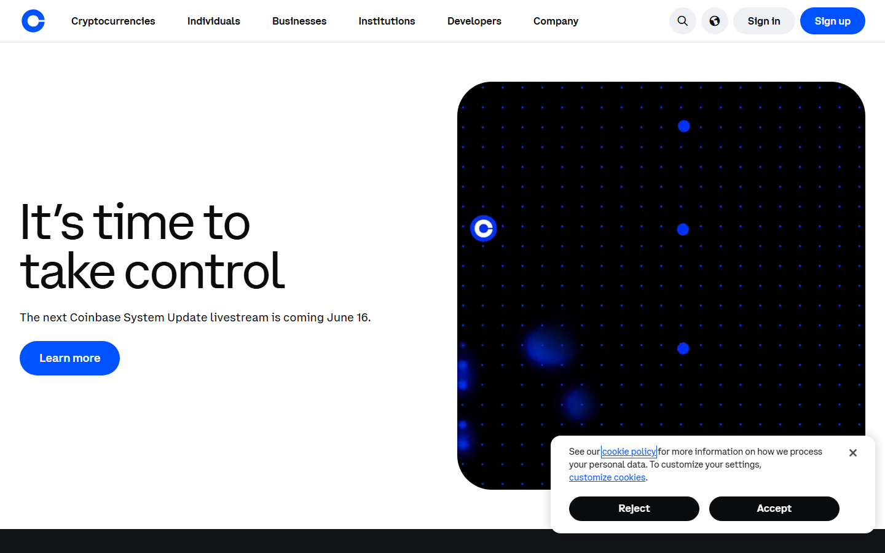

---
title: "Best Crypto Exchanges for Beginners in 2026: 8 Platforms Compared by Fees, UX, and Safety"
meta_title: "Best Crypto Exchanges for Beginners in 2026: 8 Platforms Compared by Fees, UX, and Safety"
meta_description: "Compare the best crypto exchanges for beginners in 2026 -- Coinbase, Kraken, Binance, Gemini, Robinhood, OKX, Bybit, and Bitstamp. Ranked by onboarding ease, fees, and trust."
slug: "/guides/crypto-trading/best-crypto-exchanges-for-beginners-2026/"
primary_keyword: "best crypto exchanges for beginners 2026"
category: "Guides > Crypto Trading"
last_reviewed: "2026-07-27"
schema:
  - "Article"
  - "ItemList"
  - "FAQPage"
---

# Best Crypto Exchanges for Beginners in 2026

The best crypto exchanges for beginners in 2026 are Coinbase for the easiest first buy, Kraken for the best balance of trust and usability, Binance for product depth where it is available, Gemini for a conservative compliance-first approach, Robinhood for users coming from stock trading, OKX and Bybit for users ready for broader crypto tools, and Bitstamp for a simple, long-running European option.

The right exchange depends on where you are. Coinbase and Gemini are the strongest US-based options for new users. Kraken works well in most regions. Binance is globally dominant but restricted in some markets. If you are outside the US, OKX or Bybit may be more accessible than US-centric options.

Before choosing an exchange: [how to buy crypto for the first time](/guides/crypto-trading/how-to-buy-crypto-for-the-first-time/) walks through the actual purchase flow, and [CEX vs DEX](/guides/crypto-basics/cex-vs-dex/) explains the difference between exchange custody and self-custody so you know what you are signing up for.

We reviewed live exchange product pages and public documentation in July 2026.

## Rankings at a glance

| Rank | Exchange | Best for | Score | Key fee note | Main watchout |
|---|---|---|---|---|---|
| 1 | Coinbase | First-time buyers | 5/5 | 1.49% simple buy; 0-0.6% Advanced Trade | Simple buy fees are higher than Advanced Trade |
| 2 | Kraken | Trust and balanced usability | 4.5/5 | 0-0.4% taker depending on volume | Not always cheapest but consistently trustworthy |
| 3 | Binance | Global product depth and liquidity | 4/5 | 0.1% spot (0.075% with BNB) | Restricted in US; regulatory situation varies by region |
| 4 | Gemini | Conservative, compliance-first US users | 4/5 | 0-0.4% ActiveTrader; higher on simple buy | Fewer coins than larger rivals |
| 5 | Robinhood | Finance-app users buying first crypto | 3.5/5 | 0% commission (spread-based) | Limited advanced features; not a full crypto platform |
| 6 | OKX | Broader crypto toolkit | 3.5/5 | 0.1% maker / 0.15% taker | Product complexity can overwhelm beginners |
| 7 | Bitstamp | Simple, established European option | 3.5/5 | 0.03-0.5% depending on volume | Narrower coin selection than global giants |
| 8 | Bybit | Transition path to active trading | 3/5 | 0.1% maker / 0.1% taker | Derivatives-first heritage; not ideal for first-time buyers |

## Ranking scorecard

Scored out of 10 per category. Total out of 50.

| Exchange | Onboarding ease | Fee clarity | Coin selection | Trust and compliance | Beginner fit | **Total** |
|---|---|---|---|---|---|---|
| Coinbase | 10 | 8 | 7 | 10 | 10 | **45** |
| Kraken | 8 | 9 | 8 | 10 | 8 | **43** |
| Binance | 7 | 8 | 10 | 6 | 6 | **37** |
| Gemini | 8 | 8 | 6 | 10 | 8 | **40** |
| Robinhood | 10 | 6 | 4 | 8 | 9 | **37** |
| OKX | 6 | 7 | 10 | 7 | 5 | **35** |
| Bitstamp | 7 | 8 | 5 | 9 | 7 | **36** |
| Bybit | 6 | 8 | 8 | 7 | 4 | **33** |

**Scoring notes.** Onboarding ease scores how quickly a first-time user can create an account, verify identity, and complete a first deposit and purchase. Fee clarity scores how easy it is to understand what you will actually pay before completing a trade. Coin selection scores the breadth of assets available on the spot market. Trust and compliance scores regulatory status, track record, and publicly available audit or compliance documentation. Beginner fit scores the overall experience for someone who has never used a crypto exchange. Coinbase leads because it scores highest on onboarding ease, trust, and beginner fit. Kraken is one point behind because its fee clarity and trust scores are excellent, even if the onboarding process adds a small amount of extra friction.

## How exchanges divide for beginners in 2026

Three types of exchanges appear in this list:

**Beginner onramps** (Coinbase, Gemini, Robinhood) are designed to make the first purchase feel easy and safe. Setup is fast, the interface is clean, and the product does not expose too much complexity before the user is ready for it.

**Balanced exchanges** (Kraken, Bitstamp) strike a middle ground between simplicity and product depth. They are not the flashiest platforms, but they have long track records and clear fee structures that do not hide costs in spread markups.

**Global depth platforms** (Binance, OKX, Bybit) are the largest exchanges by volume and product range. They are also the most complex and the most variable in terms of regional availability. They belong in this list because many users will eventually encounter them, but they are not always the right first exchange.

## 8 Best Crypto Exchanges for Beginners Reviewed (2026 List)

### 1. Coinbase

Coinbase is the most beginner-legible crypto exchange in the US market. It is publicly traded (Nasdaq: COIN), regulated by FinCEN, and licensed in most US states. The simple buy flow lets a user go from sign-up to first purchase in under ten minutes.

The fee situation is the most important thing for beginners to understand early. The simple buy interface charges 1.49% (or a flat fee on smaller transactions). Advanced Trade, Coinbase's pro interface, charges 0.05-0.60% taker depending on 30-day volume. Both modes access the same assets, but the price difference is significant for anyone buying more than occasionally.

The brand reputation also comes with a practical benefit: if something goes wrong, Coinbase has a support team with a public track record. For absolute beginners who have never interacted with a crypto exchange, that matters.

[CryptoCurrency Reddit threads on beginner exchange choices](https://www.reddit.com/r/CryptoCurrency/comments/1lp8jmt/best_crypto_exchange_for_absolute_beginners_in_2026/) consistently list Coinbase first for US-based beginners, with the most common follow-up note being: switch to Advanced Trade as soon as you understand what you are doing, because the fee difference adds up.

**Best for:** First-time buyers in the US who want the clearest, most mainstream starting point.
**Not ideal for:** Users who want the lowest fees from day one without learning the Advanced Trade interface.

**Featured Image**
File: `../media/10-coinbase-home-2026-07-27.png`
Alt text: `Coinbase homepage showing cryptocurrency exchange, simple buy flow, and publicly traded US platform`
Caption: `Coinbase homepage captured during our July 2026 review of beginner crypto exchanges. The product is built around one goal for new users: make the first purchase feel as simple as buying a stock.`

*Coinbase homepage, July 2026. The simplest first-buy flow in the US market, with a fee structure that rewards users who learn to use Advanced Trade.*

---

### 2. Kraken

Kraken is one of the oldest crypto exchanges still operating, founded in 2011. It has never experienced a major hack, maintains a strong regulatory compliance record, and has a well-documented history of handling exchange collapses in the broader market responsibly.

The fee structure is transparent: 0.25% taker on the standard interface, down to 0.01-0.40% taker on Pro depending on 30-day volume. That is more complex than Coinbase's simple buy flow, but it rewards users who take a few minutes to understand it.

Kraken's beginner fit is strong but slightly below Coinbase because the UI exposes a few more options early. The Pro interface adds even more. For beginners willing to take five minutes to find the right mode, Kraken delivers an excellent combination of trust, fee clarity, and product quality.

The regulatory track record is Kraken's main differentiator. In a market where exchange collapses and fraud have been recurring events, Kraken's 13-year operating history without a major security incident is a real signal.

**Best for:** Beginners who prioritize trust and fee clarity over an ultra-simple interface.
**Not ideal for:** Users who want the simplest possible interface before learning any platform details.

**Screenshot 2**
File: `../media/10-kraken-home-2026-07-27.png`
Alt text: `Kraken homepage showing crypto exchange, Pro trading interface, and long-running US and global platform`
Caption: `Kraken homepage captured during our July 2026 review. The positioning is trust-forward: one of the oldest and most consistently reliable exchanges in the market.`

---

### 3. Binance

Binance is the largest crypto exchange by trading volume globally. It offers spot trading, futures, staking, lending, an NFT marketplace, and hundreds of token listings. For users who want access to the widest range of crypto assets and tools, Binance is usually the broadest option.

The fee structure is competitive: 0.1% spot trading, reduced to 0.075% when trading with BNB tokens. For active traders, that is among the lowest in the market.

The regional complexity is real. Binance is not available in the US in its full form (Binance.US is a separate, more limited entity). Regulatory issues in the UK, Europe, and several Asian markets have affected availability at different points. Before choosing Binance, confirm that it operates in your country in the version you expect.

The product complexity is also a real consideration for beginners. Binance's interface exposes far more features than a beginner needs on day one. That is not a flaw for advanced users, but it can overwhelm someone who just wants to buy ETH for the first time.

[CryptoCurrency Reddit discussions on Binance for beginners](https://www.reddit.com/r/CryptoCurrency/comments/1kd3r8p/is_binance_good_for_beginners_honest_2026_review/) typically land on: Binance is excellent for intermediate and advanced users, but start with Coinbase or Kraken first and move to Binance when you know what you want to do there.

**Best for:** Users outside the US who want the broadest product range and lowest fees.
**Not ideal for:** Absolute beginners in regulated markets where Binance availability is limited.

---

### 4. Gemini

Gemini was founded by the Winklevoss twins in 2014 with an explicit focus on regulatory compliance. It holds a New York Trust Company charter, is SOC 2 certified, and operates under the framework of the New York Department of Financial Services.

The product experience is clean but conservative. Fewer coins than Binance or Coinbase. A simpler interface that does not try to become a full DeFi portal. For US users who want the strictest regulatory positioning available in a retail exchange, Gemini is the clearest option.

Fees on the simple buy interface are higher than Coinbase. The ActiveTrader mode brings them down to 0-0.4% taker, comparable to Kraken. As with Coinbase, learning to use the lower-fee interface makes a meaningful difference.

**Best for:** US users who want the most compliance-forward exchange available and are comfortable with a narrower coin selection.
**Not ideal for:** Users who want access to a wide range of altcoins beyond the mainstream listings.

---

### 5. Robinhood

Robinhood entered crypto as an extension of its stock-trading app. The crypto experience is designed to feel familiar to users who already invest in stocks through Robinhood. No commissions, a clean interface, and instant buying with bank funds.

The practical limits are real. Robinhood's coin selection is narrower than dedicated crypto exchanges. The product was not designed for users who want to move crypto to a self-custody wallet frequently (though that capability was added in 2022). Staking, derivatives, and advanced order types are not the focus.

For a user whose primary goal is to buy a small amount of Bitcoin or Ethereum and hold it with minimal complexity, Robinhood delivers that. For a user who wants to interact with DeFi, use their crypto across chains, or access a wider coin selection, a dedicated exchange is a better fit.

**Best for:** US users who already use Robinhood for stocks and want to add crypto without a new platform.
**Not ideal for:** Users who need advanced features, wide coin selection, or frequent crypto withdrawals.

---

### 6. OKX

OKX is a large global exchange with a product surface that covers spot trading, derivatives, copy trading, an embedded Web3 wallet, an NFT marketplace, and DeFi integrations. It is one of the most complete crypto environments available outside of Binance.

The beginner experience is conditional. The platform has a "Lite" mode designed for simpler users and a more complex standard view. That helps, but the depth of the full product still signals that OKX is better suited for users who have already navigated a simpler exchange and want more.

Fees are competitive: 0.1% maker, 0.15% taker on standard spot. OKX is not available in the US.

**Best for:** Users outside the US who want broad product depth and competitive fees after outgrowing a simpler exchange.
**Not ideal for:** Total beginners who want the simplest possible first buy experience.

---

### 7. Bitstamp

Bitstamp is one of the oldest crypto exchanges still operating, founded in 2011. It focuses on a more limited set of major assets (Bitcoin, Ethereum, and a handful of others) and a simple trading interface without trying to be a full crypto ecosystem.

That simplicity is genuinely appealing for users who want to buy Bitcoin or Ethereum from an established exchange without navigating a feature-heavy platform. The fee structure is clear: 0.03-0.5% depending on 30-day volume.

Bitstamp is based in Luxembourg and licensed in the EU, which gives it strong regulatory standing in European markets. US users can also access it.

**Best for:** EU-based users who want a simple, long-established exchange for major assets.
**Not ideal for:** Users who need a wide altcoin selection or advanced trading features.

---

### 8. Bybit

Bybit started as a derivatives exchange and has grown to cover spot markets, copy trading, staking, and a full crypto product suite. As of 2026, it is one of the major global exchanges by derivatives volume.

Bybit's spot trading experience has improved significantly, and the platform is accessible in many markets outside the US. The fee structure is competitive: 0.1% maker, 0.1% taker on spot.

The beginner fit rating is lowest in the list not because Bybit is bad, but because its heritage as a derivatives platform means the product depth and default experience are oriented toward more active traders. A beginner who lands on Bybit first may find the feature density confusing before they have the context to navigate it.

A [CryptoCurrency Reddit discussion on best exchanges outside the US](https://www.reddit.com/r/CryptoCurrency/comments/1mn2kqp/best_crypto_exchanges_outside_the_us_in_2026/) consistently names Bybit as a top choice for intermediate users in Asia, Europe, and other markets where Binance is restricted or less accessible.

**Best for:** Users outside the US who are transitioning from basic exchange use to a broader trading environment.
**Not ideal for:** Absolute beginners who need the clearest first-time buying experience.

---

## Fees: the most important number to understand

Every exchange has two fee layers:

**Simple buy / instant buy fees** are the fees you pay when you click "Buy" and enter a dollar amount. These are almost always higher than trading fees. Coinbase simple buy is 1.49%. Robinhood builds its cost into the spread. These fees are convenient but expensive.

**Trading fees** are the fees you pay when you place an order on the trading interface. These are typically 0.1-0.5% and drop with volume. They require slightly more knowledge to use but save meaningful money on regular purchases.

The practical rule: learn the trading interface of your chosen exchange as soon as possible. The fee difference between simple buy and trading fees can be 5 to 10 times the cost on the same transaction.

## Common beginner mistakes with exchanges

**Leaving crypto on an exchange forever.** Exchanges hold your crypto for you. If the exchange is hacked or fails, your funds may be at risk. [Moving coins to a self-custody wallet](/guides/wallets/best-crypto-wallets-for-beginners-2026/) after buying is the standard security step.

**Using simple buy without comparing fees.** Simple buy is convenient but often the most expensive way to purchase. Learning Advanced Trade (Coinbase) or Pro (Kraken) takes ten minutes and can significantly reduce costs.

**Choosing an exchange without checking regional availability.** Binance, OKX, and Bybit have regional restrictions that vary by country. Verify that the platform fully operates in your country before completing KYC.

**Ignoring withdrawal limits.** Some exchanges have limits on how much you can withdraw to a bank account or external wallet per day. Check these before committing to a platform if you plan to move significant amounts.

**Skipping 2FA setup.** Two-factor authentication is the single most important account security step. Enable it immediately after sign-up.

## Why you can trust this guide

This guide is based on live exchange product pages and public documentation reviewed in July 2026. Fee figures are from each exchange's published fee schedule at time of review. Regional availability was checked against official exchange statements, not third-party claims.

## What we checked ourselves before ranking these exchanges

We reviewed the public product surfaces, fee documentation, and onboarding framing of all eight exchanges in July 2026. Community discussion threads were reviewed per exchange to identify common beginner pain points.

What we did not check: live deposit and withdrawal tests with real funds, or region-specific access verification from specific countries. Those require live testing that goes beyond a public-surface review.

## FAQ

### What is the best crypto exchange for beginners?

Coinbase is the safest broad answer for US beginners. Kraken is the best balance of trust and usability for a wider range of markets.

### Which crypto exchange has the lowest fees?

Binance has the lowest standard spot trading fees at 0.1% (0.075% with BNB). Bybit and OKX are comparable. But low fees matter less if the platform is not available in your region.

### Is it safe to keep crypto on an exchange?

Major exchanges (Coinbase, Kraken, Gemini) have strong security records. But exchange custody means the exchange holds your keys. Keeping large balances in self-custody (a hardware wallet) is the more secure option long-term.

### Do I need to verify my identity to use a crypto exchange?

Yes. Most regulated exchanges require KYC (Know Your Customer) verification before you can deposit or trade. This usually means submitting a government ID and selfie. It typically takes a few minutes to a few days.

### What is the difference between Coinbase and Coinbase Wallet?

Coinbase (the exchange) holds your crypto for you. Coinbase Wallet is a self-custody app where you hold your own keys. They are separate products from the same company. See [best crypto wallets for beginners](/guides/wallets/best-crypto-wallets-for-beginners-2026/) for the wallet side.

### Can I use Binance in the US?

Not the full platform. Binance.US is a separate, more limited entity available to US users. Many features on the global Binance platform are not available on Binance.US.

## Sources

- [Coinbase](https://www.coinbase.com/)
- [Coinbase Advanced Trade fees](https://www.coinbase.com/advanced-trade/fees)
- [Kraken](https://www.kraken.com/)
- [Kraken fee schedule](https://www.kraken.com/features/fee-schedule)
- [Binance](https://www.binance.com/)
- [Binance fee structure](https://www.binance.com/en/fee/schedule)
- [Gemini](https://www.gemini.com/)
- [Robinhood Crypto](https://robinhood.com/us/en/crypto/)
- [OKX](https://www.okx.com/)
- [Bitstamp](https://www.bitstamp.net/)
- [Bybit](https://www.bybit.com/)
- [CryptoCurrency Reddit thread on best beginner exchanges 2026](https://www.reddit.com/r/CryptoCurrency/comments/1lp8jmt/best_crypto_exchange_for_absolute_beginners_in_2026/)
- [CryptoCurrency Reddit thread on Binance for beginners](https://www.reddit.com/r/CryptoCurrency/comments/1kd3r8p/is_binance_good_for_beginners_honest_2026_review/)
- [CryptoCurrency Reddit thread on best exchanges outside US 2026](https://www.reddit.com/r/CryptoCurrency/comments/1mn2kqp/best_crypto_exchanges_outside_the_us_in_2026/)
