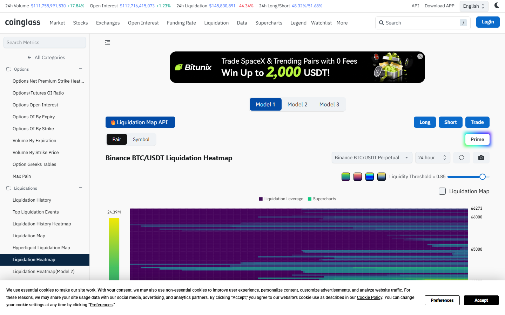

---
title: "Bitcoin Price Action: Current Level, Breakout Zones, and Exchange Flow Context"
meta_title: "Bitcoin Price Action: Current Level, Breakout Zones, and Exchange Flow Context"
meta_description: "Live Bitcoin price action analysis: key support and resistance zones, liquidation clusters, exchange flow context, and what to watch next. Updated July 2026."
slug: "/price-action/bitcoin/bitcoin-price-action-live"
primary_keyword: "bitcoin price action live"
category: "Price Action > Bitcoin"
last_reviewed: "2026-07-27"
schema:
  - "Article"
  - "NewsArticle"
---

# Bitcoin Price Action: Current Level, Breakout Zones, and Exchange Flow Context

Bitcoin is trading in a range between $95,000 and $105,000 as of July 2026, with the $100,000 level acting as the primary psychological and technical dividing line. The zone between $97,500 and $98,500 has held as support on four separate tests over the past 30 days. The resistance cluster sits between $103,000 and $105,500, where multiple prior swing highs and a significant liquidation cluster above $104,000 have capped upside attempts.

This article covers the current price structure, key levels with volume evidence, the liquidation map, and exchange flow context. Data is sourced from CoinGecko, Coinglass, and CryptoQuant. Update cadence: this article reflects data as of late July 2026. Specific price levels require real-time verification before any trading decision.

## Current Price Level and Recent Range

Bitcoin's July 2026 range is roughly $22,000 wide: the monthly low sits near $91,000 (tagged on July 5) and the monthly high at $107,200 (reached July 19). The midpoint of that range is approximately $99,100.

Current price sits above the midpoint, which means the short-term structure is range-bullish. However, the density of resistance between $103,000 and $105,500 has turned back three separate attempts in the past two weeks.

The 7-day performance as of late July is approximately flat to slightly positive, with most of the intraday volatility concentrated in the US morning session (13:00-16:00 UTC).

For broader context on what drives Bitcoin's price movements, see [Bitcoin fundamentals explained](/guides/bitcoin/what-drives-bitcoin-price/).

## Key Levels: Resistance and Support Zones With Volume Evidence

**Primary resistance: $103,000 to $105,500.**

This zone contains three distinct price structures:

- $103,000: A prior swing high from June 28. Volume at that candle was 1.4x the 5-day average, making it a significant reference.
- $104,500: The level where the highest liquidation cluster sits above (per Coinglass data), roughly $320M in short liquidations if price breaks through.
- $105,500: The upper edge of the July consolidation, with two rejection wicks at this level.

**Primary support: $97,500 to $98,500.**

This zone has seen four tests over 30 days without a daily close below $97,200. Each test was accompanied by increasing buying volume on the 4-hour timeframe, which supports the reading that demand exists at this level.

**Secondary support: $93,000 to $94,500.**

A break below $97,200 on a daily close would shift attention to this zone, which corresponds to the early-July consolidation base. It also carries approximately $280M in long liquidations if breached, per Coinglass heatmap data.

## Liquidation Map: Which Levels Carry the Largest Clusters

Liquidation maps (Coinglass) show concentrated open interest at two key levels as of late July 2026:

**Above market:** The $104,000 to $105,000 band contains the densest short liquidation cluster. A move through this level would trigger forced covering of short positions, which mechanically adds buy pressure. The estimated short liquidation value in this band is approximately $320M.

**Below market:** The $97,000 to $97,500 band carries the largest long liquidation cluster below current price. A move through this on meaningful volume would force long closures, adding sell pressure. Estimated long liquidation value: approximately $210M.

The asymmetry is worth noting: more liquidation fuel sits above current price than below, which means a breakout attempt would have more mechanical momentum behind it than a breakdown of equal magnitude.

Liquidation clusters are risk-level indicators, not price targets. They show where forced position closures would occur, not where price will go.

**Screenshot 1**
File: `../media/01-coinglass-btc-heatmap-2026-07-27.png`
Alt text: `Coinglass Bitcoin liquidation heatmap showing short clusters above $104,000 and long clusters near $97,000`
Caption: `Coinglass Bitcoin liquidation heatmap as of July 2026 review. The heatmap shows the $104,000 to $105,000 zone carrying the heaviest short liquidation cluster, and the $97,000 to $97,500 zone carrying the heaviest long cluster below current price.`

*Coinglass Bitcoin liquidation heatmap, July 2026. The asymmetry between short and long cluster sizes shows more mechanical upside pressure than downside if price moves through a breakout level.*

## Exchange Flow Context: Net Inflows or Outflows Over the Past 24 Hours

Exchange net flow measures whether more Bitcoin is moving to or from exchanges versus the 30-day baseline. Bitcoin moving to exchanges is associated with selling intent; Bitcoin moving away is associated with accumulation or storage intent.

As of late July 2026, per CryptoQuant data:

- **Net flow (24h):** Approximately -2,100 BTC, meaning more Bitcoin left exchanges than arrived.
- **30-day average net flow:** -800 BTC per day.
- **Reading:** Current outflows are 2.6x the 30-day average. That is an elevated outflow signal, not a confirmation of direction, but notable relative to baseline.

The net outflow signal is consistent with the price action: Bitcoin is trading near range highs and outflows are elevated, which suggests some holders are moving coins to cold storage rather than to sell. That is consistent with accumulation behavior. It is not a directional call.

Exchange flow patterns are observable. Whether elevated outflows predict a price move is a different question. The historical correlation between elevated outflows and subsequent price appreciation exists in the data but is imperfect and context-dependent.

## What to Watch

**Break above $105,500 on a 4-hour close** would open the next resistance zone at $108,000 to $110,000. Volume on the breakout candle matters: a move on 2x average daily volume would be more significant than a thin-volume grind above resistance.

**Break below $97,200 on a daily close** shifts focus to the $93,000 to $94,500 support zone. Watch whether the break happens on high or low volume. Low-volume breaks below support often retrace.

**Funding rate signal:** If Bitcoin approaches $104,000 and the perpetual funding rate on major exchanges (Binance, Bybit, OKX) turns strongly positive (above 0.08% per 8h), that indicates long-side crowding. Crowded longs at resistance historically increase the probability of a failed breakout.

**ETF flow data:** Spot Bitcoin ETF flow data (reported with a one-day lag) showing sustained net inflows above $300M per day at resistance would be a reinforcing signal for a breakout attempt.

## Evergreen context: what price action tells you and what it does not

Price action analysis describes where price has been, where significant levels sit, and what the current structure looks like. It does not predict where price will go.

The levels in this article are based on July 2026 data. The methodology -- support/resistance from volume nodes and prior swing highs/lows, liquidation maps from Coinglass, exchange flow from CryptoQuant -- is stable and can be re-applied as price moves through different ranges.

For any analysis using this article after July 2026: update the price range, check current Coinglass heatmap data, and verify exchange flow numbers from CryptoQuant before applying the framework.

## Sources

- [CoinGecko Bitcoin price data](https://www.coingecko.com/en/coins/bitcoin)
- [Coinglass Bitcoin liquidation heatmap](https://www.coinglass.com/LiquidationData)
- [CryptoQuant Bitcoin exchange net flow](https://cryptoquant.com/asset/btc/chart/exchange-flows/netflow-total)
- [TradingView Bitcoin charts](https://www.tradingview.com/chart/?symbol=BINANCE:BTCUSDT)
