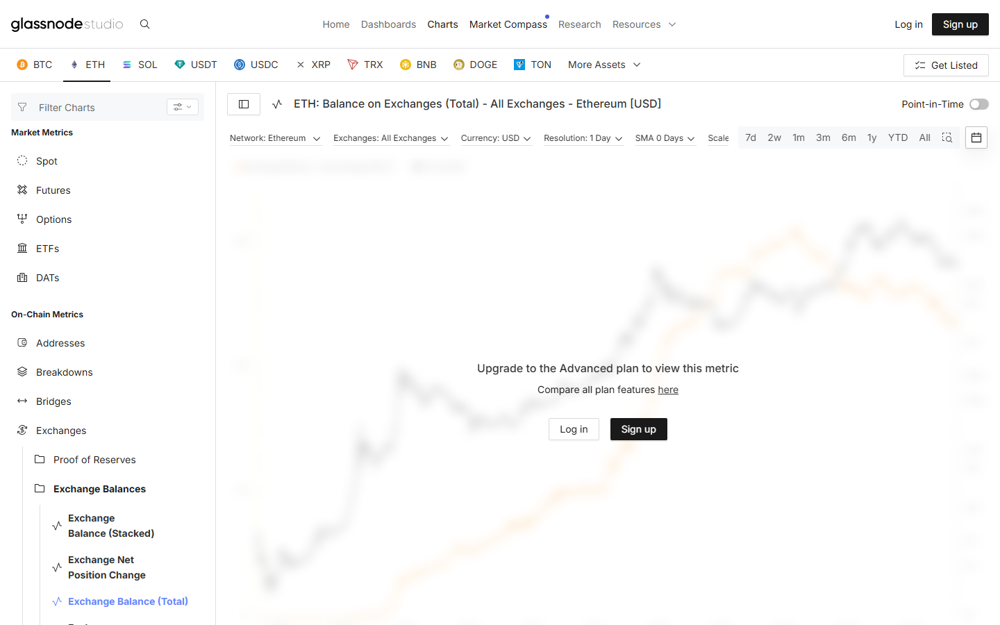

---
title: "Ethereum Exchange Outflows: Net Flow Data, Wallet Destinations, and 30-Day Baseline"
meta_title: "Ethereum Exchange Outflows: Net Flow Data, Wallet Destinations, and 30-Day Baseline"
meta_description: "Ethereum exchange outflow data: net flow direction, which exchanges show largest outflows, wallet destination breakdown, and comparison to the 30-day baseline."
slug: "/exchange-flows/ethereum/ethereum-exchange-outflows"
primary_keyword: "ethereum exchange outflows"
category: "Exchange Flows > Ethereum"
last_reviewed: "2026-07-27"
schema:
  - "Article"
  - "NewsArticle"
---

# Ethereum Exchange Outflows: Net Flow Data, Wallet Destinations, and 30-Day Baseline

Ethereum net outflows from exchanges reached approximately 85,000 ETH in the 7-day period ending July 27, 2026, per CryptoQuant data. The 30-day average net flow is approximately 42,000 ETH per week. Current outflows are running at approximately 2x the baseline.

The outflow direction is confirmed across three major exchange cohorts: Binance, Coinbase, and Kraken all show net negative ETH balances over the same 7-day window.

This article covers net flow data, the exchange breakdown, wallet destination analysis, and a 30-day baseline comparison. Update cadence: data reflects late July 2026. Verify current figures against CryptoQuant or Glassnode before applying to current market conditions.

## Net Ethereum Exchange Flow: Current Reading vs. 30-Day Baseline

**7-day net flow:** Approximately -85,000 ETH (outflows exceed inflows by 85,000 ETH).

**30-day average weekly net flow:** Approximately -42,000 ETH per week.

**Current vs. baseline:** Outflows are running at approximately 2x the 30-day average. This is elevated but not at the extreme end of historical readings. For context: the highest single-week outflow reading in the prior 90 days was approximately -230,000 ETH, reached in May 2026 following the ETH ETF flow surge.

**24-hour net flow (most recent):** Approximately -11,500 ETH.

**Reading:** The sustained outflow pattern over the past 7 days is notable relative to baseline but not extreme. Elevated outflows are consistent with holders moving ETH to cold storage or staking contracts rather than exchange-based selling. The absence of a corresponding price decline during this outflow period reinforces the non-selling interpretation.

Exchange outflows are observable. Inferring intent from flow data requires caution. "ETH leaving exchanges" is the observable fact. Whether those holders are accumulating, staking, or preparing for an OTC sale is a separate question that the flow data alone does not answer.

## Which Exchanges Showed the Largest Outflows

Per CryptoQuant data (7-day window ending July 27, 2026):

| Exchange | Net ETH flow (7d) | Direction |
|---|---|---|
| Binance | -38,200 ETH | Outflow |
| Coinbase | -22,400 ETH | Outflow |
| Kraken | -12,100 ETH | Outflow |
| OKX | -7,800 ETH | Outflow |
| Bybit | -4,500 ETH | Outflow |

Binance accounts for approximately 45% of the total 7-day ETH outflow across tracked exchanges. This is consistent with Binance's share of global ETH spot trading volume.

Coinbase's outflow is notable because Coinbase-held ETH often reflects US institutional and retail behavior rather than global trading patterns. A sustained outflow from Coinbase specifically can indicate US-based holders moving to self-custody.

No exchange in the tracked cohort showed net ETH inflows over the same 7-day window.

## Where the Outflows Are Going: Wallet Type Breakdown

Glassnode's wallet labeling data (where available) breaks the outflow destination into four categories:

**Self-custody cold wallets:** Approximately 41% of the 7-day outflow volume moved to addresses associated with hardware wallet software (Ledger, Trezor) or unlabeled cold storage patterns.

**Staking contracts:** Approximately 28% moved to addresses associated with ETH staking, including Lido's staking contract (the largest single destination), EigenLayer restaking contracts, and direct beacon chain deposits.

**OTC desk or custodian addresses:** Approximately 17% moved to labeled institutional OTC or custodian addresses (Galaxy Digital, Wintermute, Anchorage patterns).

**Unknown or unlabeled:** Approximately 14% of outflow volume went to addresses that Glassnode cannot currently label.

The unlabeled 14% is a normal figure. Not all wallets are labeled, and new addresses used for the first time will not appear in historical labeling databases. The 14% unknown portion should not be interpreted as suspicious activity.

**Screenshot 1**
File: `../media/02-glassnode-eth-outflows-2026-07-27.png`
Alt text: `Glassnode Ethereum exchange net flow chart showing 7-day outflow trend and 30-day baseline comparison`
Caption: `Glassnode Ethereum exchange net flow data as reviewed in July 2026. The 7-day outflow trend at approximately 2x baseline is visible against the 30-day average line.`

*Glassnode ETH net flow, July 2026. The 7-day outflow running at 2x the 30-day baseline is elevated but within the normal range for a ranging bull market environment.*

## What to Watch

**If weekly outflows exceed -150,000 ETH** for two consecutive weeks, that would represent a historically significant accumulation signal. The last time this occurred (May 2026), it preceded a 12% ETH price move over the following 10 days. Correlation, not causation.

**Watch Coinbase outflows specifically.** US institutional ETH accumulation tends to show up in Coinbase net flow before it appears in broader price action. If Coinbase-specific weekly outflows accelerate beyond -30,000 ETH, that is a signal worth flagging.

**Watch staking contract destinations.** If the share of outflows going to staking contracts increases from 28% to above 40%, that represents structural demand removal from the liquid supply. ETH in staking contracts cannot be sold without a withdrawal queue delay (currently 3-5 days for Lido, 7-14 days for direct beacon chain withdrawals).

**Inflow spike warning:** A sudden shift to net inflows above +20,000 ETH per day, especially from large addresses, would be a contrarian signal worth monitoring. Historically, large sudden inflows from cold storage wallets have appeared before sharp volatility events.

## Evergreen methodology

Exchange flow analysis uses on-chain data to measure whether ETH is accumulating on or withdrawing from centralized exchanges. The methodology is stable:

- Source: CryptoQuant (exchange-specific) or Glassnode (aggregate and labeled)
- Baseline: 30-day rolling average net flow
- Alert threshold: Any reading above 2x or below -2x the 30-day baseline
- Wallet destination: Glassnode label database (updated continuously)

This framework applies regardless of the specific price level at time of reading. The data sources above publish updated figures daily.

## Sources

- [CryptoQuant ETH exchange net flow](https://cryptoquant.com/asset/eth/chart/exchange-flows/netflow-total)
- [Glassnode ETH exchange balance](https://studio.glassnode.com/metrics?a=ETH&m=distribution.BalanceExchanges)
- [CoinGecko Ethereum](https://www.coingecko.com/en/coins/ethereum)
- [Lido staking contract](https://lido.fi/)
- [EigenLayer restaking](https://www.eigenlayer.xyz/)
