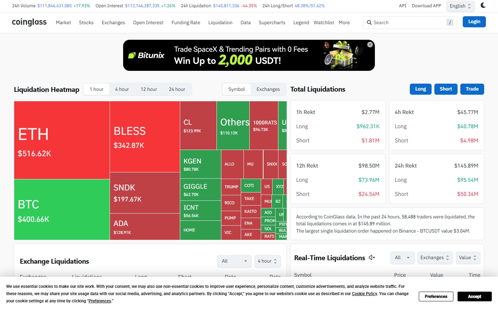

---
title: "Bitcoin Liquidation Data: Long and Short Positions, Exchange Breakdown, and Trigger Levels"
meta_title: "Bitcoin Liquidation Data: Long and Short Positions, Exchange Breakdown, and Trigger Levels"
meta_description: "Bitcoin liquidation data: total forced closures, long vs short breakdown, exchange distribution, remaining liquidation clusters, and what to watch next."
slug: "/price-action/liquidations/bitcoin-liquidation-data"
primary_keyword: "bitcoin liquidation data"
category: "Price Action > Liquidations"
last_reviewed: "2026-07-27"
schema:
  - "Article"
  - "NewsArticle"
---

# Bitcoin Liquidation Data: Long and Short Positions, Exchange Breakdown, and Trigger Levels

$148 million in Bitcoin positions were liquidated in the 24-hour period ending July 27, 2026 at 08:00 UTC, per Coinglass. Long liquidations totaled $94 million. Short liquidations totaled $54 million. Net liquidation direction: long-biased, consistent with a market that moved against the dominant leveraged position.

This article covers total liquidations, long/short split, exchange breakdown, remaining cluster map, and what to watch. Data source: Coinglass. Update cadence: figures reflect July 27, 2026. Verify current data before use.

## Total Bitcoin Liquidations in the Last 24 Hours

**Total:** $148M in forced position closures over the 24-hour window ending July 27, 08:00 UTC.

**Context:** The 7-day average daily liquidation total for Bitcoin is approximately $185M. Yesterday's $148M is below the 7-day average, indicating a relatively normal volatility day rather than a cascade event.

For comparison:
- **Typical low-volatility day:** $50-100M total liquidations
- **Elevated volatility day:** $200-500M
- **Cascade event:** >$500M in a single 24-hour window

Yesterday's reading falls in the moderate range. It indicates the market experienced meaningful forced closures but not at a level that historically precedes further sharp moves.

## Long vs. Short Breakdown

**Long liquidations:** $94M (64% of total)
**Short liquidations:** $54M (36% of total)

When long liquidations exceed short liquidations, the market moved downward enough to force out leveraged long positions. Specifically, any leveraged long position held at a level that Bitcoin's price moved through during the 24-hour window was closed by the exchange.

Bitcoin moved from approximately $101,200 at the window open to a low of $99,400 during the session before recovering. That $1,800 downside move was enough to force out positions leveraged at ratios that placed their liquidation price above $99,400.

Liquidated means forced position closure by the exchange, not voluntary selling. A $94M long liquidation figure means $94M in leveraged long contracts were automatically closed by exchanges when price breached the liquidation threshold. It does not mean $94M in Bitcoin was sold on the spot market.

## Exchange Breakdown: Where Liquidations Were Concentrated

| Exchange | BTC liquidations (24h) | Dominant direction |
|---|---|---|
| Binance | $72M | Long-biased |
| OKX | $31M | Long-biased |
| Bybit | $28M | Long-biased |
| Deribit | $11M | Mixed |
| CME | $6M | Long-biased |

Binance accounts for approximately 49% of total BTC liquidations, which is consistent with its share of global BTC derivatives open interest.

CME liquidations at $6M reflect institutional-side forced closures. CME uses calendar futures rather than perpetuals, so the liquidation mechanism differs. CME liquidations tend to be larger individual trades (fewer but bigger).

**Screenshot 1**
File: `../media/03-coinglass-btc-liquidations-2026-07-27.png`
Alt text: `Coinglass Bitcoin liquidation dashboard showing 24-hour total, long vs short breakdown, and exchange distribution`
Caption: `Coinglass Bitcoin liquidation data for July 27, 2026. The long-biased liquidation split ($94M longs vs $54M shorts) is consistent with a moderate downside move against a leveraged long-heavy open interest structure.`

*Coinglass Bitcoin liquidation dashboard, July 2026. The exchange breakdown shows Binance absorbing nearly half of total forced closures.*

## Liquidation Cluster Map: Key Levels That Remain Loaded

Remaining liquidation clusters (Coinglass heatmap, as of July 27):

**Above current price ($100,800):**
- $102,500 to $103,000: Approximately $180M in short liquidations (breakout fuel if reached)
- $104,500 to $105,500: Approximately $320M in short liquidations (the major resistance cluster)

**Below current price:**
- $99,000 to $99,500: Approximately $140M in long liquidations (yesterday's move cleared some of this; residual remains)
- $97,000 to $97,500: Approximately $210M in long liquidations (the primary support cluster)

Yesterday's session cleared approximately $55M of the long cluster in the $99,000 to $99,500 band. The $97,000 to $97,500 band remained untouched.

Liquidation clusters are future risk zones, not price targets. They show where forced closures would occur if price reaches those levels. They do not predict whether price will reach them.

## What to Watch

**A daily close above $103,000** would begin to trigger short liquidations in the $102,500 to $103,000 cluster. Volume on the breakout determines whether the move continues toward the $104,500 cluster.

**A daily close below $98,500** would increase the probability of testing the $97,000 to $97,500 long cluster. A move through that level with high volume could trigger a cascade scenario.

**Long/short ratio at extremes.** If the 24-hour liquidation split moves to 80% long or higher for two consecutive days, that is a signal of extreme over-leveraged long positioning. Historically that condition precedes a flush of long positions.

**CME basis.** If CME futures trade at a premium to spot above 2.5%, institutional positioning is leaning bullish. Below 0.5% basis, institutional interest is cooling regardless of retail open interest.

## Evergreen methodology

Bitcoin liquidation analysis uses Coinglass as the primary source. The framework is:
- **Total liquidations:** Coinglass 24h data, updated continuously
- **Long/short split:** Coinglass aggregated exchange data
- **Cluster map:** Coinglass liquidation heatmap (shows where remaining OI would be forced out at each price level)
- **Alert threshold:** Any 24h liquidation total above $500M warrants a separate cascade analysis

The levels in this article reflect July 2026 prices. The methodology applies at any price level by re-anchoring to current Coinglass heatmap data.

## Sources

- [Coinglass Bitcoin liquidations](https://www.coinglass.com/LiquidationData)
- [Coinglass liquidation heatmap](https://www.coinglass.com/pro/futures/LiquidationHeatMap)
- [CoinGecko Bitcoin](https://www.coingecko.com/en/coins/bitcoin)
